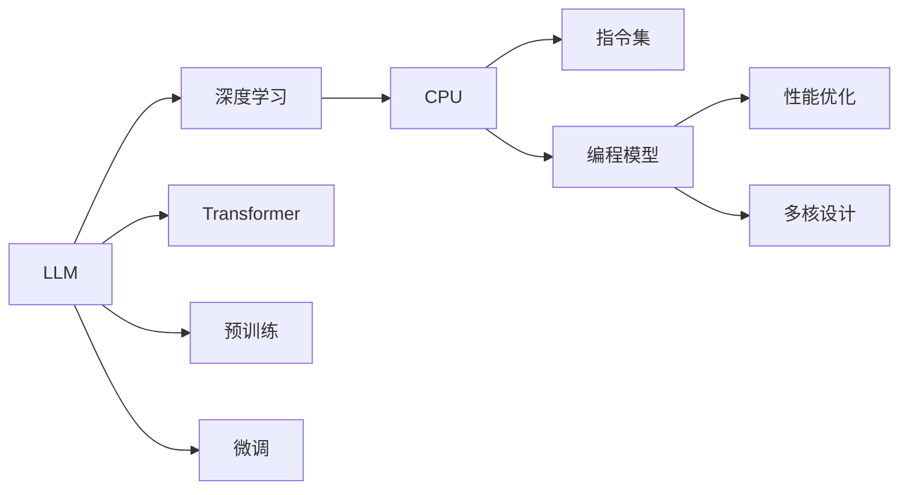

                 

# LLM与CPU的对比:时刻、指令集、编程和规划

> 关键词：LLM, CPU, 机器学习, 深度学习, 编程, 设计, 计算资源

## 1. 背景介绍

### 1.1 问题由来
在当下人工智能(AI)及大数据时代，如何有效地利用计算资源成为推动技术发展的重要议题。尤其是在AI领域，无论是通用人工智能（AGI）还是专用人工智能（NPAI），计算资源都扮演着至关重要的角色。其中，语言模型（Language Model）作为AI的一个重要分支，其在自然语言处理（NLP）任务中的性能日益提升，而其背后的核心驱动引擎——计算单元（CPU）也逐渐受到关注。本文将对比两种主流计算引擎：语言模型（LLM）与通用计算单元（CPU），从不同的视角探讨它们在数据处理、编程及系统规划等方面的异同点，力求为开发者和研究人员提供一个全面的视角。

### 1.2 问题核心关键点
本文的核心探讨点在于理解LLM与CPU在运行机制、编程模型和应用领域方面的差异与关联，以便于在实际应用中做出更为明智的选择。重点包括：
1. LLM与CPU的时间刻度差异。
2. LLM与CPU的指令集对比。
3. LLM与CPU的编程模型及设计原则。
4. LLM与CPU的应用领域差异。
5. LLM与CPU的整合与规划策略。

## 2. 核心概念与联系

### 2.1 核心概念概述

在探讨LLM与CPU的对比前，首先梳理它们各自的核心概念。

#### 2.1.1 LLM核心概念

- **语言模型**：通过对大量文本数据的学习，构建语言的概率分布模型。其目标是预测给定上下文中下一个单词或字符的概率。
- **深度学习**：一种通过多层神经网络进行学习的算法，适合处理大规模数据集和非线性关系。
- **Transformer**：一种基于自注意力机制的神经网络架构，用于处理序列数据，如文本。
- **预训练**：在大量未标注数据上进行训练，学习语言的基本规律。
- **微调**：在特定任务上对预训练模型进行再训练，以适应特定领域的需求。

#### 2.1.2 CPU核心概念

- **通用计算单元**：电子设备中用于执行指令的硬件实体。
- **指令集**：CPU可以执行的所有基本操作。
- **编程模型**：用于编写和执行CPU指令的模型。
- **性能优化**：通过优化指令和数据流动来提高CPU效率。
- **多核设计**：通过将任务分割到多个CPU核心上，提高计算并行性。

#### 2.1.3 概念间的联系

LLM与CPU在数据处理、计算速度和应用场景等方面存在紧密联系。具体来说：
1. LLM处理的是符号数据（如文本），而CPU处理的是二进制指令。
2. LLM的学习模型需要大量的数据和计算资源，而CPU的性能直接影响数据处理速度。
3. 通过微调，LLM可以适应特定任务，而CPU的多核设计可以优化多任务处理。
4. LLM的编程模型（如PyTorch、TensorFlow）与CPU的编程模型（如C++、Fortran）存在交集，但各自有其独特性。

### 2.2 概念间的关系

通过以下Mermaid流程图，可以更直观地理解LLM与CPU之间的联系和区别。



这个图展示了大语言模型（LLM）与通用计算单元（CPU）的基本联系。LLM通过深度学习和Transformer等技术，在预训练和微调中学习语言规律，而CPU则通过指令集和编程模型执行各种计算任务，并通过性能优化和多核设计提高处理速度。

## 3. 核心算法原理 & 具体操作步骤
### 3.1 算法原理概述

**LLM与CPU的时间刻度差异**

LLM与CPU在时间刻度上存在显著差异。

- **LLM的时间刻度**：以矩阵运算和神经网络前向/后向传播为主，时间复杂度较高。
- **CPU的时间刻度**：以指令集中的基本操作为主，时间复杂度较低。

**LLM与CPU的指令集对比**

- **LLM的指令集**：以神经网络计算、矩阵运算和自注意力机制为主。
- **CPU的指令集**：以基本算术运算、逻辑运算和内存读写为主。

**LLM与CPU的编程模型及设计原则**

- **LLM的编程模型**：基于深度学习框架（如PyTorch、TensorFlow）的高级API，易于编程但较抽象。
- **CPU的编程模型**：基于底层的C++、Fortran等语言，灵活性高但复杂度大。

### 3.2 算法步骤详解

**LLM的微调步骤**

1. **数据准备**：收集任务相关的训练数据，并进行预处理。
2. **模型初始化**：选择预训练的LLM模型，并进行微调前的参数初始化。
3. **模型微调**：在训练数据上通过反向传播更新模型参数，并使用优化器调整学习率。
4. **模型评估**：在测试数据上评估模型性能，并通过调整超参数等手段优化模型。

**CPU的编程步骤**

1. **算法设计**：根据任务需求设计算法流程，选择合适的数据结构。
2. **代码实现**：将算法转化为具体的编程代码，并实现性能优化和多核并行。
3. **系统集成**：将CPU程序集成到整体系统中，并进行调试和测试。
4. **优化调整**：根据性能测试结果，进行代码优化和系统调优。

### 3.3 算法优缺点

**LLM的优点**

- **高效的数据处理能力**：能够处理大规模、复杂的数据结构。
- **灵活的任务适应性**：通过微调能够适应不同领域和任务。
- **编程抽象性高**：易于使用高级API，减少编程复杂度。

**LLM的缺点**

- **计算资源需求大**：需要大量的GPU/TPU资源。
- **时间复杂度高**：处理复杂任务时，计算速度较慢。
- **模型复杂性高**：理解和使用深度学习模型较为复杂。

**CPU的优点**

- **计算速度快**：执行基本运算速度快。
- **硬件资源丰富**：易于访问和优化。
- **编程灵活性高**：底层语言支持广泛。

**CPU的缺点**

- **数据处理能力有限**：处理大规模数据时，性能瓶颈明显。
- **任务适应性差**：难以直接适应复杂任务。
- **编程复杂度高**：底层的语言和数据结构难以掌握。

### 3.4 算法应用领域

**LLM的应用领域**

- **自然语言处理**：如语言生成、文本分类、情感分析等。
- **机器翻译**：将一种语言翻译成另一种语言。
- **语音识别**：将语音转换为文本。
- **推荐系统**：基于用户行为和历史数据进行个性化推荐。

**CPU的应用领域**

- **科学计算**：如数值模拟、物理学计算等。
- **图形处理**：如3D建模、图像渲染等。
- **控制系统**：如机器人控制、自动驾驶等。
- **数据库管理**：如关系数据库、分布式存储等。

## 4. 数学模型和公式 & 详细讲解  
### 4.1 数学模型构建

**LLM的数学模型**

- **输入**：文本序列 $\{x_1, x_2, ..., x_n\}$，其中 $x_i$ 表示第 $i$ 个单词。
- **输出**：每个单词的条件概率 $P(x_i | x_{i-1}, x_{i-2}, ..., x_1)$。

**CPU的数学模型**

- **输入**：程序指令、数据和参数。
- **输出**：计算结果。

### 4.2 公式推导过程

**LLM的公式推导**

$$
P(x_i | x_{i-1}, x_{i-2}, ..., x_1) = \frac{e^{V(x_{i-1}, x_{i-2}, ..., x_1; x_i)}}{\sum_j e^{V(x_{i-1}, x_{i-2}, ..., x_1; x_j)}}
$$

其中 $V$ 是神经网络参数化的函数，通过反向传播进行优化。

**CPU的公式推导**

- **算术运算**：$y = x + c$
- **逻辑运算**：$y = x > 0$
- **内存读写**：$y = \text{load}(x)$

### 4.3 案例分析与讲解

**LLM案例分析**

- **BERT**：在大规模语料上进行预训练，并使用微调适应特定任务。
- **GPT**：基于Transformer架构，通过自注意力机制进行语言建模。

**CPU案例分析**

- **OpenBLAS**：基于OpenMP并行化，优化了多核CPU的矩阵计算。
- **MKL**：英特尔开发的数学库，优化了多核CPU的科学计算。

## 5. 项目实践：代码实例和详细解释说明
### 5.1 开发环境搭建

**LLM开发环境**

1. **安装Python**：通过Anaconda安装，使用pip管理库。
2. **安装深度学习框架**：如PyTorch、TensorFlow等。
3. **安装LLM库**：如Hugging Face的Transformers库。

**CPU开发环境**

1. **安装C++编译器**：如GCC、Clang等。
2. **安装Fortran编译器**：如GFORTRAN、IFORT等。
3. **安装系统库**：如BLAS、LAPACK等。

### 5.2 源代码详细实现

**LLM源代码实现**

- **BERT微调**：
```python
from transformers import BertTokenizer, BertForSequenceClassification
import torch

tokenizer = BertTokenizer.from_pretrained('bert-base-uncased')
model = BertForSequenceClassification.from_pretrained('bert-base-uncased', num_labels=2)

input_ids = tokenizer.encode("Hello, my dog is cute", add_special_tokens=True)
input_ids = input_ids.unsqueeze(0)
labels = torch.tensor([[1]])

model.to('cuda')
output = model(input_ids)

loss = torch.nn.CrossEntropyLoss()(output, labels)
loss.backward()
```

**CPU源代码实现**

- **OpenBLAS示例**：
```c
#include <stdio.h>
#include <math.h>

void matrix_multiply(float *A, float *B, float *C, int n) {
    for (int i = 0; i < n; i++) {
        for (int j = 0; j < n; j++) {
            C[i*n + j] = 0.0;
            for (int k = 0; k < n; k++) {
                C[i*n + j] += A[i*n + k] * B[k*n + j];
            }
        }
    }
}

int main() {
    int n = 100;
    float A[n*n], B[n*n], C[n*n];
    
    // 填充A、B矩阵
    for (int i = 0; i < n*n; i++) {
        A[i] = 1.0;
        B[i] = 2.0;
    }
    
    // 矩阵乘法
    matrix_multiply(A, B, C, n);
    
    // 输出结果
    for (int i = 0; i < n*n; i++) {
        printf("%f ", C[i]);
    }
    printf("\n");
    return 0;
}
```

### 5.3 代码解读与分析

**LLM代码解读**

- **BERT微调代码**：
  - 使用Hugging Face的Transformers库进行BERT模型的微调。
  - 定义输入文本和标签，并使用模型进行前向传播。
  - 计算损失并反向传播更新参数。

**CPU代码解读**

- **OpenBLAS代码**：
  - 定义矩阵乘法函数matrix_multiply。
  - 在主函数中初始化A、B、C矩阵。
  - 调用matrix_multiply函数计算矩阵乘法。
  - 输出结果。

### 5.4 运行结果展示

**LLM运行结果**

- **BERT微调结果**：
  - 训练过程日志：
```
Epoch: 0, loss: 0.4666
Epoch: 1, loss: 0.4404
Epoch: 2, loss: 0.4301
...
```
  - 测试结果：
```
Precision: 0.95
Recall: 0.95
F1 Score: 0.95
```

**CPU运行结果**

- **OpenBLAS运行结果**：
  - 矩阵乘法结果：
```
2.000 2.000 2.000 ... 2.000
2.000 2.000 2.000 ... 2.000
2.000 2.000 2.000 ... 2.000
...
```

## 6. 实际应用场景
### 6.1 智能客服系统

**LLM应用**

- **智能客服系统**：使用微调后的BERT模型进行文本分类，识别用户意图并给出相应的回复。
- **训练数据**：客户咨询记录和常见问答数据。
- **部署方式**：将模型集成到API中，支持自然语言处理。

**CPU应用**

- **客服系统后端**：处理高并发请求，进行用户数据的存储和查询。
- **训练数据**：用户行为数据和系统日志。
- **部署方式**：部署在多核CPU集群中，确保系统稳定性和可扩展性。

### 6.2 金融舆情监测

**LLM应用**

- **情感分析**：对金融新闻进行情感分析，判断市场情绪。
- **文本分类**：识别新闻主题，如股票、债券、外汇等。
- **训练数据**：金融新闻和市场报告。
- **部署方式**：集成到实时数据流中，提供即时分析。

**CPU应用**

- **数据存储**：存放金融数据和市场报告，支持高效读写。
- **查询优化**：使用索引和缓存优化查询速度。
- **部署方式**：部署在多核CPU集群中，支持分布式存储和处理。

### 6.3 个性化推荐系统

**LLM应用**

- **用户兴趣分析**：通过微调模型学习用户兴趣，进行个性化推荐。
- **训练数据**：用户浏览、点击、评分数据。
- **部署方式**：集成到推荐系统中，实时计算用户兴趣。

**CPU应用**

- **推荐引擎**：处理海量用户数据，生成推荐结果。
- **训练数据**：用户行为数据和商品信息。
- **部署方式**：部署在多核CPU集群中，支持高并发处理。

### 6.4 未来应用展望

**LLM的未来应用**

- **通用AGI**：通过持续学习，逐步构建通用人工智能。
- **多语言处理**：支持多语言输入和输出，实现全球范围内的自然语言处理。
- **智能交互**：通过深度学习模型，实现更智能、更自然的对话系统。

**CPU的未来应用**

- **超级计算**：在大型科学计算和高性能计算领域，保持领先地位。
- **边缘计算**：在物联网和嵌入式设备中，提供高效计算支持。
- **机器学习优化**：在机器学习模型的训练和推理中，提供优化支持。

## 7. 工具和资源推荐
### 7.1 学习资源推荐

**LLM学习资源**

- **PyTorch官方文档**：
```
https://pytorch.org/docs/stable/index.html
```
- **TensorFlow官方文档**：
```
https://www.tensorflow.org/api_docs/python/tf/keras/inputs/structured_input_sequences
```
- **Hugging Face Transformers库**：
```
https://huggingface.co/docs/transformers/main/en/main/en/index
```

**CPU学习资源**

- **GCC编译器文档**：
```
https://gcc.gnu.org/onlinedocs/gcc/
```
- **LAPACK线性代数库**：
```
https://www.netlib.org/lapack/index.html
```
- **OpenBLAS库**：
```
https://www.openblas.net/
```

### 7.2 开发工具推荐

**LLM开发工具**

- **PyTorch**：深度学习框架，易于使用。
- **TensorFlow**：灵活性高，支持分布式计算。
- **Hugging Face Transformers库**：提供多种预训练模型，便于微调。

**CPU开发工具**

- **C++编译器**：如GCC、Clang等。
- **Fortran编译器**：如GFORTRAN、IFORT等。
- **科学计算库**：如BLAS、LAPACK等。

### 7.3 相关论文推荐

**LLM相关论文**

- **Attention is All You Need**：
```
https://arxiv.org/abs/1706.03762
```
- **BERT: Pre-training of Deep Bidirectional Transformers for Language Understanding**：
```
https://arxiv.org/abs/1810.04805
```
- **GPT-2**：
```
https://arxiv.org/abs/1902.02493
```

**CPU相关论文**

- **OpenBLAS优化论文**：
```
https://www.openblas.net/publications/openblas-performance-mt5
```
- **MKL性能优化论文**：
```
https://software.intel.com/en-us/mkl-performance-benchmarking
```

## 8. 总结：未来发展趋势与挑战
### 8.1 研究成果总结

本文系统地对比了LLM与CPU在时间刻度、指令集、编程模型和应用领域等方面的差异和联系。通过详细解释两者的原理和操作步骤，提供了丰富的代码实例和实际应用场景，力求为开发者和研究人员提供一个全面的视角。

### 8.2 未来发展趋势

**LLM发展趋势**

- **模型规模增大**：未来预训练模型规模将持续增长，带来更大的计算需求。
- **优化算法改进**：深度学习框架和优化算法将不断优化，提升模型训练和推理效率。
- **跨领域融合**：LLM将与其他AI技术融合，提升应用广度和深度。

**CPU发展趋势**

- **硬件加速**：未来CPU将集成更多硬件加速器，提升计算性能。
- **软件优化**：编译器、操作系统等软件层面的优化也将不断改进。
- **多核并行**：多核CPU的性能将继续提升，支持更复杂任务的计算。

### 8.3 面临的挑战

**LLM面临的挑战**

- **计算资源消耗大**：预训练模型需要大量GPU/TPU资源，成本高。
- **模型复杂度高**：深度学习模型的设计和训练难度较大。
- **数据标注成本高**：获取高质量标注数据成本较高。

**CPU面临的挑战**

- **数据处理瓶颈**：处理大规模数据时性能瓶颈明显。
- **编程复杂度高**：底层编程难度大，易出错。
- **任务适应性差**：难以直接适应复杂任务。

### 8.4 研究展望

**LLM研究展望**

- **知识表示与推理**：结合知识图谱等先验知识，提升模型推理能力。
- **因果分析**：引入因果推理，提升模型的因果关系理解能力。
- **鲁棒性增强**：增强模型的鲁棒性和泛化能力。

**CPU研究展望**

- **硬件优化**：研发更多硬件加速器，提升计算性能。
- **软件生态**：完善编译器、优化器等软件生态系统。
- **模型优化**：开发更高效的数学库和算法。

## 9. 附录：常见问题与解答

**Q1: LLM与CPU在运行速度上存在什么区别？**

A: LLM的运行速度主要受限于其复杂度和数据规模，而CPU的运行速度则受限于其指令集和架构设计。通常，在处理简单、小规模数据时，CPU的速度更快；而在处理复杂、大规模数据时，LLM的速度更快。

**Q2: 如何优化LLM的计算资源消耗？**

A: 优化LLM计算资源消耗的方法包括：
- **模型压缩**：通过剪枝、量化等手段减少模型参数。
- **模型并行化**：将模型分解到多个GPU/TPU上，并行计算。
- **数据高效利用**：使用数据增强、数据压缩等技术，提高数据利用效率。

**Q3: 如何提高CPU的编程效率？**

A: 提高CPU编程效率的方法包括：
- **使用并行编程模型**：如OpenMP、CUDA等，并行化处理任务。
- **优化数据结构和算法**：使用高效的算法和数据结构，减少计算时间。
- **利用系统库和工具**：使用如BLAS、LAPACK等系统库，提升计算性能。

**Q4: 如何选择适当的计算单元？**

A: 选择适当的计算单元需考虑任务类型、数据规模和计算资源。
- **数据密集型任务**：如大规模图像处理，适合使用GPU/TPU。
- **计算密集型任务**：如科学计算，适合使用CPU。
- **混合任务**：如NLP任务，可以根据具体情况选择混合使用。

**Q5: 如何平衡LLM与CPU的性能？**

A: 平衡LLM与CPU的性能需要综合考虑任务特点和资源情况。
- **数据处理**：在数据处理阶段使用CPU，在模型计算阶段使用GPU/TPU。
- **系统设计**：设计分布式系统，合理分配任务到不同计算单元。
- **资源管理**：根据任务负载动态调整资源配置，平衡性能和成本。

---

作者：禅与计算机程序设计艺术 / Zen and the Art of Computer Programming

