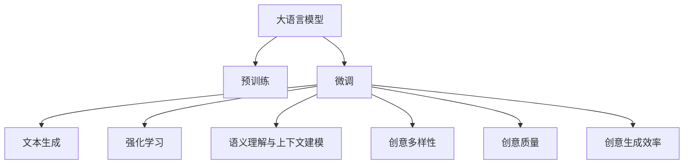
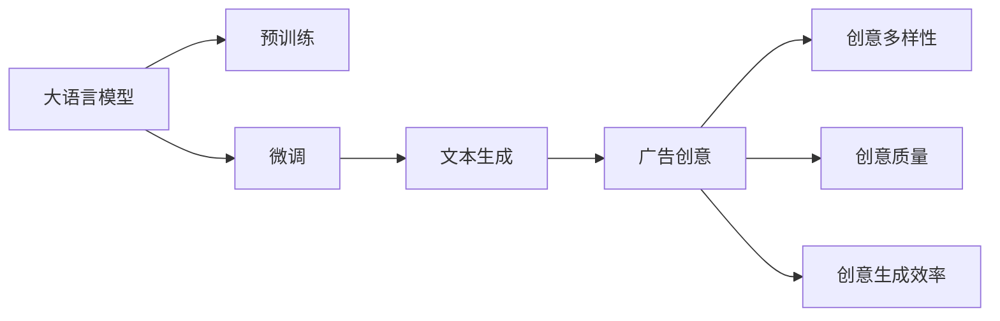
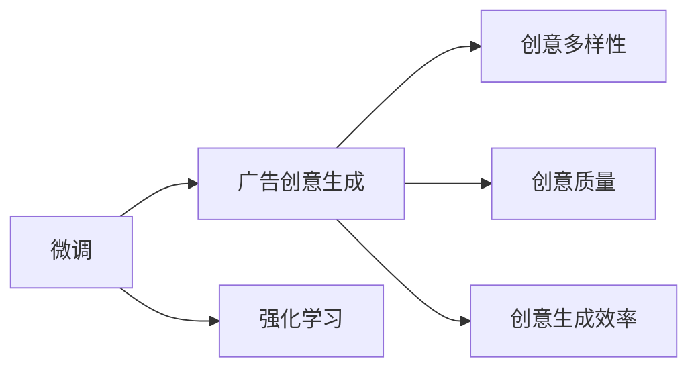
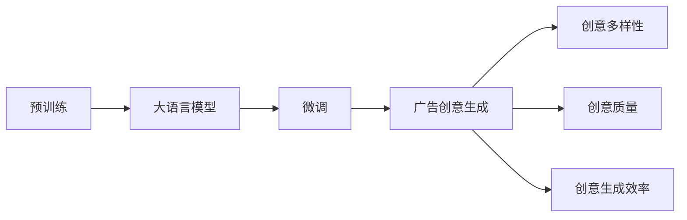
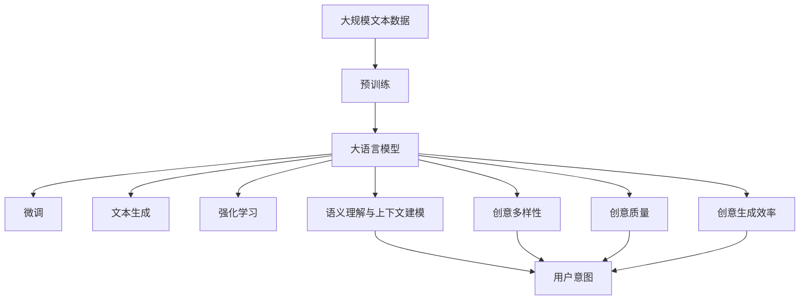

                 

# LLM在智能广告创意生成中的应用探索

> 关键词：大语言模型, 智能广告, 创意生成, 文本生成, 强化学习

## 1. 背景介绍

随着数字营销的不断演进，广告创意生成成为了智能广告系统的核心环节。传统的广告创意生成依赖于创意设计师的丰富经验和高昂成本，而大语言模型（Large Language Model，简称LLM）的出现，为广告创意生成带来了革命性的变革。LLM通过预训练和微调，能够自主生成丰富多样、创意十足的广告文案，不仅大大降低了广告创意设计的成本，也大幅提升了广告创意的质量和覆盖率。

### 1.1 问题由来

智能广告创意生成需要解决的核心问题包括：

- **创意多样性**：广告创意需要覆盖多种用户群体和场景，传统方法难以全面覆盖，而LLM能通过广泛预训练积累的语料库，生成多样化、具有个性化的广告创意。
- **创意质量**：传统方法依赖于设计师的审美和经验，而LLM可以生成质量较高的文本，避免人工干预造成的创意质量波动。
- **创意生成效率**：传统方法需要设计师大量时间进行创意设计，而LLM可以快速生成大量广告创意，显著提升广告投放效率。
- **创意可解释性**：传统广告创意生成过程不透明，而LLM生成的广告创意可以对其进行细致的语义分析，提升广告效果评估的透明度和科学性。

### 1.2 问题核心关键点

大语言模型在智能广告创意生成中的关键点包括：

- **预训练和微调**：通过在大规模文本语料上进行预训练，学习通用的语言表示，再通过微调，针对特定广告任务优化模型生成能力。
- **文本生成技术**：利用Transformer等架构，通过自回归或自编码方式，生成连续文本序列。
- **强化学习优化**：通过与人类设计者的反馈互动，利用强化学习算法优化创意生成过程。
- **语义理解和上下文建模**：利用大语言模型的语义理解能力，生成与用户意图匹配的广告文案。

### 1.3 问题研究意义

研究大语言模型在智能广告创意生成中的应用，具有以下重要意义：

- **降低成本**：利用大语言模型自动化生成广告创意，减少了对设计师的依赖，大幅降低创意设计成本。
- **提升效率**：通过快速生成广告创意，缩短创意设计周期，提升广告投放效率。
- **优化效果**：大语言模型生成的广告创意能够覆盖更多用户群体，满足更多用户需求，提升广告点击率和转化率。
- **增强可解释性**：大语言模型生成的广告创意可以通过语义分析和上下文建模，提升创意生成的透明度和可解释性。
- **推动技术应用**：通过实际案例验证大语言模型的应用效果，推动其在更多场景中的应用。

## 2. 核心概念与联系

### 2.1 核心概念概述

为了更好地理解大语言模型在智能广告创意生成中的应用，本节将介绍几个密切相关的核心概念：

- **大语言模型**：以自回归(如GPT)或自编码(如BERT)模型为代表的大规模预训练语言模型。通过在大规模无标签文本语料上进行预训练，学习通用的语言表示，具备强大的语言理解和生成能力。

- **预训练**：指在大规模无标签文本语料上，通过自监督学习任务训练通用语言模型的过程。常见的预训练任务包括言语建模、遮挡语言模型等。预训练使得模型学习到语言的通用表示。

- **微调**：指在预训练模型的基础上，使用广告创意生成的标注数据，通过有监督地训练来优化模型在生成广告创意上的性能。通常只需要调整顶层分类器或解码器，并以较小的学习率更新全部或部分的模型参数。

- **文本生成**：利用大语言模型生成连续文本序列，包括对话生成、摘要生成、广告创意生成等多种形式。文本生成技术是LLM在广告创意生成中的核心应用。

- **强化学习**：利用奖励信号和反馈机制，优化模型生成广告创意的过程。通过与人类设计者的互动，逐步提升创意生成的质量。

- **语义理解与上下文建模**：利用大语言模型的语义理解能力，生成与用户意图匹配的广告文案。通过上下文建模，使广告创意在特定情境下更具吸引力。

- **创意多样性**：生成多样化、具有创意的广告文案，满足不同用户的个性化需求。

- **创意质量**：生成具有高吸引力和转化率的广告文案，提升广告效果。

- **创意生成效率**：快速生成大量广告创意，缩短创意设计周期。

这些核心概念之间的逻辑关系可以通过以下Mermaid流程图来展示：



这个流程图展示了大语言模型在智能广告创意生成中的应用：

1. 大语言模型通过预训练获得基础能力。
2. 微调是对预训练模型进行任务特定的优化，针对广告创意生成任务进行优化。
3. 文本生成使得模型能够自主生成连续文本，作为广告创意的内容。
4. 强化学习通过与设计者的互动，提升创意生成的质量。
5. 语义理解与上下文建模使得广告创意更加贴合用户意图。
6. 创意多样性、创意质量和创意生成效率，是广告创意生成中的关键指标。

### 2.2 概念间的关系

这些核心概念之间存在着紧密的联系，形成了大语言模型在智能广告创意生成中的完整生态系统。下面我们通过几个Mermaid流程图来展示这些概念之间的关系。

#### 2.2.1 广告创意生成流程



这个流程图展示了广告创意生成的主要流程：

1. 大语言模型通过预训练获得基础能力。
2. 微调使得模型针对广告创意生成任务进行优化。
3. 文本生成使得模型能够生成连续文本。
4. 广告创意生成，生成多样化、具有创意的文本。
5. 创意多样性、创意质量和创意生成效率，是广告创意生成中的关键指标。

#### 2.2.2 强化学习与微调的关系



这个流程图展示了微调和强化学习的关系：

1. 微调使得模型针对广告创意生成任务进行优化。
2. 强化学习通过与设计者的互动，提升创意生成的质量。
3. 创意多样性、创意质量和创意生成效率，是广告创意生成中的关键指标。

#### 2.2.3 预训练与微调的关系



这个流程图展示了预训练与微调的关系：

1. 预训练使得模型学习到通用的语言表示。
2. 微调使得模型针对广告创意生成任务进行优化。
3. 广告创意生成，生成多样化、具有创意的文本。
4. 创意多样性、创意质量和创意生成效率，是广告创意生成中的关键指标。

### 2.3 核心概念的整体架构

最后，我们用一个综合的流程图来展示这些核心概念在大语言模型在智能广告创意生成中的整体架构：



这个综合流程图展示了从预训练到微调，再到创意生成的完整过程：

1. 大语言模型首先在大规模文本数据上进行预训练，学习通用的语言表示。
2. 微调使得模型针对广告创意生成任务进行优化。
3. 文本生成使得模型能够生成连续文本。
4. 强化学习通过与设计者的互动，提升创意生成的质量。
5. 语义理解与上下文建模使得广告创意更加贴合用户意图。
6. 创意多样性、创意质量和创意生成效率，是广告创意生成中的关键指标。

通过这些流程图，我们可以更清晰地理解大语言模型在智能广告创意生成中的应用过程和各关键环节的作用，为后续深入讨论具体的创意生成方法和技术奠定基础。

## 3. 核心算法原理 & 具体操作步骤
### 3.1 算法原理概述

大语言模型在智能广告创意生成中，主要利用预训练和微调技术，通过生成高质量的文本内容，满足广告创意生成的需求。其核心思想是：

- 通过预训练学习通用语言表示，在大规模无标签文本语料上进行自监督学习。
- 在广告创意生成任务上，通过微调优化模型生成特定文本的能力。
- 利用强化学习，在人类设计者的反馈下，逐步提升广告创意生成的质量和多样性。

形式化地，假设预训练模型为 $M_{\theta}$，其中 $\theta$ 为预训练得到的模型参数。给定广告创意生成的训练集 $D=\{(x_i,y_i)\}_{i=1}^N$，其中 $x_i$ 为输入的广告创意样本，$y_i$ 为目标广告创意。微调的目标是找到新的模型参数 $\hat{\theta}$，使得模型生成的广告创意与目标广告创意接近，即：

$$
\hat{\theta}=\mathop{\arg\min}_{\theta} \mathcal{L}(M_{\theta},D)
$$

其中 $\mathcal{L}$ 为针对广告创意生成任务的损失函数，用于衡量模型生成的广告创意与目标广告创意之间的差异。常见的损失函数包括交叉熵损失、均方误差损失等。

### 3.2 算法步骤详解

基于大语言模型在智能广告创意生成中的应用，其微调过程主要包括以下几个关键步骤：

**Step 1: 准备预训练模型和数据集**
- 选择合适的预训练语言模型 $M_{\theta}$ 作为初始化参数，如 GPT、BERT 等。
- 准备广告创意生成的标注数据集 $D$，划分为训练集、验证集和测试集。一般要求标注数据与预训练数据的分布不要差异过大。

**Step 2: 添加任务适配层**
- 根据广告创意生成的需求，在预训练模型顶层设计合适的输出层和损失函数。
- 对于生成任务，通常使用语言模型的解码器输出概率分布，并以负对数似然为损失函数。
- 对于分类任务，通常在顶层添加线性分类器和交叉熵损失函数。

**Step 3: 设置微调超参数**
- 选择合适的优化算法及其参数，如 AdamW、SGD 等，设置学习率、批大小、迭代轮数等。
- 设置正则化技术及强度，包括权重衰减、Dropout、Early Stopping 等。
- 确定冻结预训练参数的策略，如仅微调顶层，或全部参数都参与微调。

**Step 4: 执行梯度训练**
- 将训练集数据分批次输入模型，前向传播计算损失函数。
- 反向传播计算参数梯度，根据设定的优化算法和学习率更新模型参数。
- 周期性在验证集上评估模型性能，根据性能指标决定是否触发 Early Stopping。
- 重复上述步骤直到满足预设的迭代轮数或 Early Stopping 条件。

**Step 5: 测试和部署**
- 在测试集上评估微调后模型 $M_{\hat{\theta}}$ 的性能，对比微调前后的创意效果。
- 使用微调后的模型对新样本进行生成，集成到实际的应用系统中。
- 持续收集新的广告创意生成数据，定期重新微调模型，以适应数据分布的变化。

以上是基于大语言模型在智能广告创意生成中的应用的一般流程。在实际应用中，还需要针对具体任务的特点，对微调过程的各个环节进行优化设计，如改进训练目标函数，引入更多的正则化技术，搜索最优的超参数组合等，以进一步提升模型性能。

### 3.3 算法优缺点

基于大语言模型在智能广告创意生成中的微调方法具有以下优点：

1. 简单高效。只需准备少量标注数据，即可对预训练模型进行快速适配，生成高质量的广告创意。
2. 通用适用。适用于各种广告创意生成任务，如文本广告、图像广告、视频广告等，设计简单的任务适配层即可实现微调。
3. 创意多样性。大语言模型能够生成多种风格、多种语气的广告创意，满足不同用户群体的需求。
4. 创意质量高。大语言模型生成的广告创意质量高，具有吸引力和可读性。
5. 创意生成效率高。大语言模型可以快速生成大量广告创意，显著提升广告创意生成的速度。
6. 可解释性强。大语言模型生成的广告创意可以通过语义分析和上下文建模，提升创意生成的透明度和可解释性。

同时，该方法也存在一定的局限性：

1. 依赖标注数据。微调的效果很大程度上取决于标注数据的质量和数量，获取高质量标注数据的成本较高。
2. 迁移能力有限。当广告创意生成任务与预训练数据的分布差异较大时，微调的性能提升有限。
3. 负面效果传递。预训练模型的固有偏见、有害信息等，可能通过微调传递到广告创意中，造成负面影响。
4. 可解释性不足。微调模型的决策过程通常缺乏可解释性，难以对其推理逻辑进行分析和调试。

尽管存在这些局限性，但就目前而言，基于大语言模型的微调方法仍是大规模广告创意生成的主要范式。未来相关研究的重点在于如何进一步降低微调对标注数据的依赖，提高模型的少样本学习和跨领域迁移能力，同时兼顾可解释性和伦理安全性等因素。

### 3.4 算法应用领域

大语言模型在智能广告创意生成中的应用已经得到了广泛的应用，覆盖了多种广告创意生成场景，如：

- **文本广告创意**：为文字广告生成文案，提升广告的吸引力和点击率。
- **图像广告创意**：为图片广告生成文本描述，丰富广告内容。
- **视频广告创意**：为视频广告生成文案和脚本，提升广告的传播效果。
- **语音广告创意**：为语音广告生成脚本和配音，丰富广告形式。
- **个性化广告创意**：根据用户行为数据生成个性化广告创意，提升广告的精准度和转化率。

除了这些经典应用外，大语言模型还被创新性地应用到更多场景中，如智能广告投放、广告效果评估、广告素材优化等，为广告创意生成提供了新的技术路径。随着预训练模型和微调方法的不断进步，相信大语言模型在广告创意生成中的应用将更加广泛，为广告创意设计带来新的革命。

## 4. 数学模型和公式 & 详细讲解  
### 4.1 数学模型构建

本节将使用数学语言对基于大语言模型在智能广告创意生成中的应用过程进行更加严格的刻画。

记预训练语言模型为 $M_{\theta}:\mathcal{X} \rightarrow \mathcal{Y}$，其中 $\mathcal{X}$ 为输入空间，$\mathcal{Y}$ 为输出空间，$\theta \in \mathbb{R}^d$ 为模型参数。假设广告创意生成的训练集为 $D=\{(x_i,y_i)\}_{i=1}^N, x_i \in \mathcal{X}, y_i \in \mathcal{Y}$。

定义模型 $M_{\theta}$ 在输入 $x$ 上的输出为 $\hat{y}=M_{\theta}(x) \in [0,1]$，表示样本属于正类的概率。真实标签 $y \in \{0,1\}$。则二分类交叉熵损失函数定义为：

$$
\ell(M_{\theta}(x),y) = -[y\log \hat{y} + (1-y)\log (1-\hat{y})]
$$

将其代入经验风险公式，得：

$$
\mathcal{L}(\theta) = -\frac{1}{N}\sum_{i=1}^N [y_i\log M_{\theta}(x_i)+(1-y_i)\log(1-M_{\theta}(x_i))]
$$

在实践中，我们通常使用基于梯度的优化算法（如SGD、Adam等）来近似求解上述最优化问题。设 $\eta$ 为学习率，$\lambda$ 为正则化系数，则参数的更新公式为：

$$
\theta \leftarrow \theta - \eta \nabla_{\theta}\mathcal{L}(\theta) - \eta\lambda\theta
$$

其中 $\nabla_{\theta}\mathcal{L}(\theta)$ 为损失函数对参数 $\theta$ 的梯度，可通过反向传播算法高效计算。

### 4.2 公式推导过程

以下我们以二分类任务为例，推导交叉熵损失函数及其梯度的计算公式。

假设模型 $M_{\theta}$ 在输入 $x$ 上的输出为 $\hat{y}=M_{\theta}(x) \in [0,1]$，表示样本属于正类的概率。真实标签 $y \in \{0,1\}$。则二分类交叉熵损失函数定义为：

$$
\ell(M_{\theta}(x),y) = -[y\log \hat{y} + (1-y)\log (1-\hat{y})]
$$

将其代入经验风险公式，得：

$$
\mathcal{L}(\theta) = -\frac{1}{N}\sum_{i=1}^N [y_i\log M_{\theta}(x_i)+(1-y_i)\log(1-M_{\theta}(x_i))]
$$

根据链式法则，损失函数对参数 $\theta_k$ 的梯度为：

$$
\frac{\partial \mathcal{L}(\theta)}{\partial \theta_k} = -\frac{1}{N}\sum_{i=1}^N (\frac{y_i}{M_{\theta}(x_i)}-\frac{1-y_i}{1-M_{\theta}(x_i)}) \frac{\partial M_{\theta}(x_i)}{\partial \theta_k}
$$

其中 $\frac{\partial M_{\theta}(x_i)}{\partial \theta_k}$ 可进一步递归展开，利用自动微分技术完成计算。

在得到损失函数的梯度后，即可带入参数更新公式，完成模型的迭代优化。重复上述过程直至收敛，最终得到适应广告创意生成任务的最优模型参数 $\theta^*$。

## 5. 项目实践：代码实例和详细解释说明
### 5.1 开发环境搭建

在进行广告创意生成实践前，我们需要准备好开发环境。以下是使用Python进行PyTorch开发的环境配置流程：

1. 安装Anaconda：从官网下载并安装Anaconda，用于创建独立的Python环境。

2. 创建并激活虚拟环境：
```bash
conda create -n pytorch-env python=3.8 
conda activate pytorch-env
```

3. 安装PyTorch：根据CUDA版本，从官网获取对应的安装命令。例如：
```bash
conda install pytorch torchvision torchaudio cudatoolkit=11.1 -c pytorch -c conda-forge
```

4. 安装Transformers库：
```bash
pip install transformers
```

5. 安装各类工具包：
```bash
pip install numpy pandas scikit-learn matplotlib tqdm jupyter notebook ipython
```

完成上述步骤后，即可在`pytorch-env`环境中开始广告创意生成实践。

### 5.2 源代码详细实现

这里我们以文本广告创意生成为例，给出使用Transformers库对BERT模型进行广告创意生成的PyTorch代码实现。

首先，定义广告创意生成的数据处理函数：

```python
from transformers import BertTokenizer
from torch.utils.data import Dataset
import torch

class AdTextDataset(Dataset):
    def __init__(self, texts, labels, tokenizer, max_len=128):
        self.texts = texts
        self.labels = labels
        self.tokenizer = tokenizer
        self.max_len = max_len
        
    def __len__(self):
        return len(self.texts)
    
    def __getitem__(self, item):
        text = self.texts[item]
        label = self.labels[item]
        
        encoding = self.tokenizer(text, return_tensors='pt', max_length=self.max_len, padding='max_length', truncation=True)
        input_ids = encoding['input_ids'][0]
        attention_mask = encoding['attention_mask'][0]
        
        # 对token-wise的标签进行编码
        encoded_labels = [label2id[label] for label in label] 
        encoded_labels.extend([label2id['O']] * (self.max_len - len(encoded_labels)))
        labels = torch.tensor(encoded_labels, dtype=torch.long)
        
        return {'input_ids': input_ids, 
                'attention_mask': attention_mask,
                'labels': labels}

# 标签与id的映射
label2id = {'O': 0, 'P': 1}
id2label = {v: k for k, v in label2id.items()}

# 创建dataset
tokenizer = BertTokenizer.from_pretrained('bert-base-cased')

train_dataset = AdTextDataset(train_texts, train_labels, tokenizer)
dev_dataset = AdTextDataset(dev_texts, dev_labels, tokenizer)
test_dataset = AdTextDataset(test_texts, test_labels, tokenizer)
```

然后，定义模型和优化器：

```python
from transformers import BertForTokenClassification, AdamW

model = BertForTokenClassification.from_pretrained('bert-base-cased', num_labels=len(label2id))

optimizer = AdamW(model.parameters(), lr=2e-5)
```

接着，定义训练和评估函数：

```python
from torch.utils.data import DataLoader
from tqdm import tqdm
from sklearn.metrics import classification_report

device = torch.device('cuda') if torch.cuda.is_available() else torch.device('cpu')
model.to(device)

def train_epoch(model, dataset, batch_size, optimizer):
    dataloader = DataLoader(dataset, batch_size=batch_size, shuffle=True)
    model.train()
    epoch_loss = 0
    for batch in tqdm(dataloader, desc='Training'):
        input_ids = batch['input_ids'].to(device)
        attention_mask = batch['attention_mask'].to(device)
        labels = batch['labels'].to(device)
        model.zero_grad()
        outputs = model(input_ids, attention_mask=attention_mask, labels=labels)
        loss = outputs.loss
        epoch_loss += loss.item()
        loss.backward()
        optimizer.step()
    return epoch_loss / len(dataloader)

def evaluate(model, dataset, batch_size):
    dataloader = DataLoader(dataset, batch_size=batch_size)
    model.eval()
    preds, labels = [], []
    with torch.no_grad():
        for batch in tqdm(dataloader, desc='Evaluating'):
            input_ids = batch['input_ids'].to(device)
            attention_mask = batch['attention_mask'].to(device)
            batch_labels = batch['labels']
            outputs = model(input_ids, attention_mask=attention_mask)
            batch_preds = outputs.logits.argmax(dim=2).to('cpu').tolist()
            batch_labels = batch_labels.to('cpu').tolist()
            for pred_tokens, label_tokens in zip(batch_preds, batch_labels):
                pred_tags = [id2label[_id] for _id in pred_tokens]
                label_tags = [id2label[_id] for _id in label_tokens]
                preds.append(pred_tags[:len(label_tokens)])
                labels.append(label_tags)
                
    print(classification_report(labels, preds))
```

最后，启动训练流程并在测试集上评估：

```python
epochs = 5
batch_size = 16

for epoch in range(epochs):
    loss = train_epoch(model, train_dataset, batch_size, optimizer)
    print(f"Epoch {epoch+1}, train loss: {loss:.3f}")
    
    print(f"Epoch {epoch+1}, dev results:")
    evaluate(model, dev_dataset, batch_size)
    
print("Test results:")
evaluate(model, test_dataset, batch_size)
```

以上就是使用PyTorch对BERT进行文本广告创意生成的完整代码实现。可以看到，得益于Transformers库的强大封装，我们可以用相对简洁的代码完成BERT模型的加载和广告创意生成。

### 5.3 代码解读与分析

让我们再详细解读一下关键代码的实现细节：

**AdTextDataset类**：
- `__init__`方法：初始化文本、标签、分词器等关键组件。
- `__len__`方法：返回数据集的样本数量。
- `__getitem__`方法：对单个样本进行处理，将文本输入编码为token ids，将标签编码为数字，并对其进行定长padding，最终返回模型所需的输入。

**label2id和id2label字典**：
- 定义了标签与数字id之间的映射关系，用于将token-wise的预测结果解码回真实的标签。

**训练和评估函数**：
- 使用PyTorch的DataLoader对数据集进行批次化加载，供模型训练和推理使用。
- 训练函数`train_epoch`：

