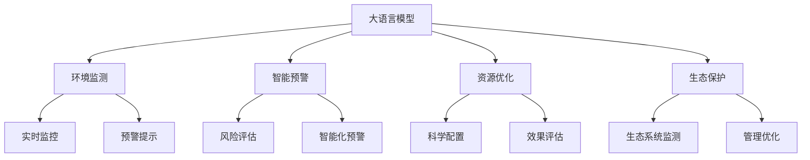
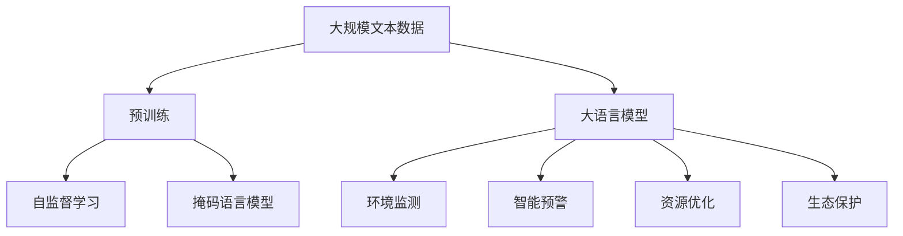
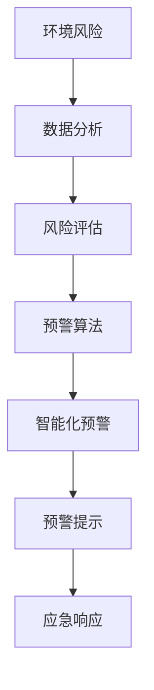
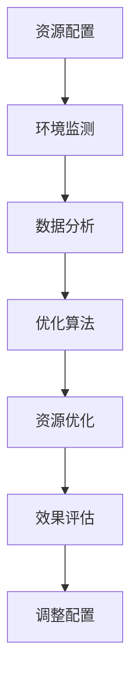
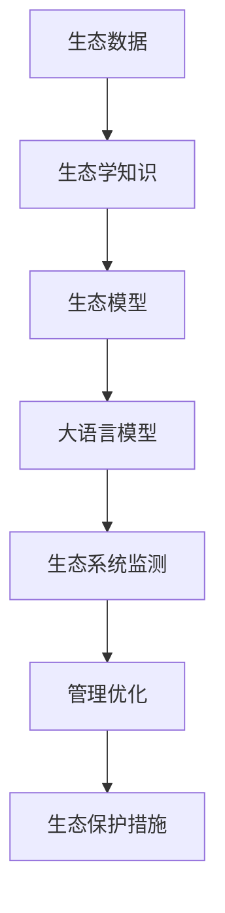
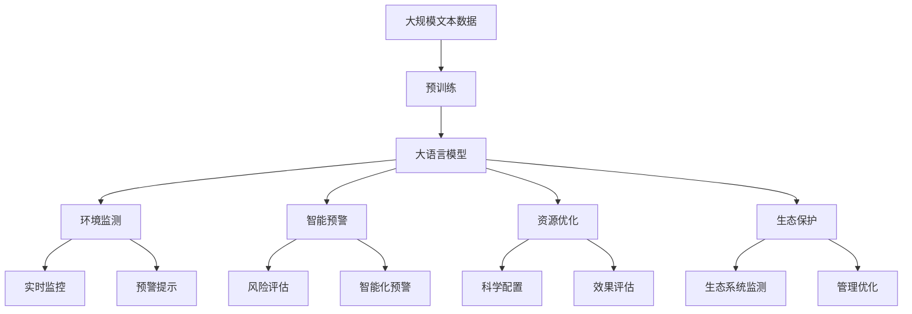

                 

# LLM在环境保护中的潜在贡献

> 关键词：大语言模型(LLM), 自然语言处理(NLP), 环境监测, 智能预警, 资源优化, 生态保护

## 1. 背景介绍

### 1.1 问题由来

在全球环境问题日益严峻的背景下，如何利用先进技术手段提升环境保护的效率和效果，成为全球科研人员关注的焦点。近年来，随着深度学习技术的快速发展，尤其是大语言模型(Large Language Model, LLM)的涌现，其在环境保护领域的潜在应用逐渐被学者和业界所关注。本文旨在探讨大语言模型在环境监测、智能预警、资源优化、生态保护等环境保护中的潜在贡献，以及其实现的技术原理和具体步骤。

### 1.2 问题核心关键点

大语言模型在环境保护中的应用主要包括以下几个关键点：

1. **环境监测**：通过大语言模型对海量环境数据进行语义理解和分析，实现对环境状况的实时监控和预警。
2. **智能预警**：基于大语言模型的自然语言处理能力，对环境风险进行智能化预警，提高环境管理的时效性和准确性。
3. **资源优化**：利用大语言模型优化资源配置，提升环境保护措施的科学性和有效性。
4. **生态保护**：结合生态学知识和环境数据，通过大语言模型进行生态系统的监测和管理，促进生态保护。

### 1.3 问题研究意义

大语言模型在环境保护中的应用，可以显著提升环境管理的智能化和自动化水平，从而在以下几个方面带来积极影响：

1. **效率提升**：自动化分析环境数据，减少人工工作量，提高环境监测和管理的效率。
2. **决策支持**：通过智能化的预警和分析，辅助环境决策者做出科学合理的决策。
3. **精准施策**：利用大语言模型进行精确的环境数据处理和分析，实现精准的资源配置和生态保护。
4. **成本降低**：减少对人工和物理设备的依赖，降低环境管理的运营成本。
5. **数据挖掘**：通过大语言模型对环境数据进行深度挖掘，发现环境问题的根源，制定更有效的应对策略。

## 2. 核心概念与联系

### 2.1 核心概念概述

为更好地理解大语言模型在环境保护中的应用，本节将介绍几个密切相关的核心概念：

- **大语言模型**：以自回归(如GPT)或自编码(如BERT)模型为代表的大规模预训练语言模型。通过在大规模无标签文本语料上进行预训练，学习通用的语言表示，具备强大的语言理解和生成能力。

- **环境监测**：利用传感器、卫星等手段收集环境数据，通过大语言模型进行语义理解和分析，实现对环境状况的实时监控和预警。

- **智能预警**：基于大语言模型的自然语言处理能力，对环境风险进行智能化预警，提高环境管理的时效性和准确性。

- **资源优化**：利用大语言模型优化资源配置，提升环境保护措施的科学性和有效性。

- **生态保护**：结合生态学知识和环境数据，通过大语言模型进行生态系统的监测和管理，促进生态保护。

这些核心概念之间的逻辑关系可以通过以下Mermaid流程图来展示：



这个流程图展示了大语言模型的核心概念以及它们在环境保护中的应用。

### 2.2 概念间的关系

这些核心概念之间存在着紧密的联系，形成了大语言模型在环境保护中的应用框架。下面我们通过几个Mermaid流程图来展示这些概念之间的关系。

#### 2.2.1 大语言模型的学习范式



这个流程图展示了大语言模型的学习范式，即通过自监督学习在大规模无标签文本语料上预训练通用语言模型，然后通过下游任务（如环境监测等）进行有监督微调，实现特定领域的应用。

#### 2.2.2 环境监测的基本原理


这个流程图展示了环境监测的基本流程，即通过传感器收集环境数据，经过预处理后输入大语言模型，模型对数据进行语义理解，实现实时监控和预警。

#### 2.2.3 智能预警的实现步骤



这个流程图展示了智能预警的实现步骤，即通过数据分析和风险评估，利用大语言模型的自然语言处理能力，进行智能化预警，并根据预警提示启动应急响应。

#### 2.2.4 资源优化的优化目标



这个流程图展示了资源优化的优化流程，即通过环境监测和数据分析，利用优化算法对资源进行科学配置，并通过效果评估调整配置，实现资源的优化。

#### 2.2.5 生态保护的生态系统建模



这个流程图展示了生态保护的生态系统建模流程，即通过生态数据和生态学知识，构建生态模型，利用大语言模型进行生态系统的监测和管理，并优化保护措施。

### 2.3 核心概念的整体架构

最后，我们用一个综合的流程图来展示这些核心概念在大语言模型在环境保护中的应用过程中的整体架构：



这个综合流程图展示了从预训练到大语言模型在环境保护中的应用的全过程，涵盖环境监测、智能预警、资源优化和生态保护等多个方面。

## 3. 核心算法原理 & 具体操作步骤
### 3.1 算法原理概述

基于大语言模型的环境监测、智能预警、资源优化和生态保护，本质上是一个多任务学习和迁移学习的复合过程。其核心思想是：将大语言模型视作一个强大的"环境分析器"，通过在环境监测、智能预警、资源优化和生态保护等下游任务上，对模型进行有监督的微调，使得模型能够适应特定任务，并在其中共享部分知识。

形式化地，假设预训练语言模型为 $M_{\theta}$，其中 $\theta$ 为预训练得到的模型参数。给定多个下游任务 $T=\{T_1, T_2, \ldots, T_n\}$ 的标注数据集 $\{D_i=\{(x_i,y_i)\}_{i=1}^N\}_{i=1}^n$，微调的目标是找到新的模型参数 $\hat{\theta}$，使得模型在各个任务上的性能都达到最优：

$$
\hat{\theta}=\mathop{\arg\min}_{\theta} \sum_{i=1}^n \mathcal{L}_i(M_{\theta},D_i)
$$

其中 $\mathcal{L}_i$ 为针对任务 $T_i$ 设计的损失函数，用于衡量模型预测输出与真实标签之间的差异。常见的损失函数包括交叉熵损失、均方误差损失等。

通过梯度下降等优化算法，微调过程不断更新模型参数 $\theta$，最小化损失函数 $\mathcal{L}$，使得模型在各个任务上的输出逼近真实标签。由于 $\theta$ 已经通过预训练获得了较好的初始化，因此即便在多个任务上微调，也能较快收敛到理想的模型参数 $\hat{\theta}$。

### 3.2 算法步骤详解

基于大语言模型的环境保护应用，一般包括以下几个关键步骤：

**Step 1: 准备预训练模型和数据集**
- 选择合适的预训练语言模型 $M_{\theta}$ 作为初始化参数，如 BERT、GPT 等。
- 准备多个下游任务的标注数据集 $\{D_i\}_{i=1}^n$，划分为训练集、验证集和测试集。一般要求各个任务的标注数据与预训练数据的分布不要差异过大。

**Step 2: 添加任务适配层**
- 根据各下游任务的特点，在预训练模型顶层设计合适的输出层和损失函数。
- 对于环境监测，通常使用分类或回归任务进行预测。
- 对于智能预警，通常使用文本分类或序列标注任务。
- 对于资源优化，通常使用回归任务进行资源配置优化。
- 对于生态保护，通常使用序列标注或分类任务进行生态系统监测和管理。

**Step 3: 设置微调超参数**
- 选择合适的优化算法及其参数，如 AdamW、SGD 等，设置学习率、批大小、迭代轮数等。
- 设置正则化技术及强度，包括权重衰减、Dropout、Early Stopping等。
- 确定冻结预训练参数的策略，如仅微调顶层，或全部参数都参与微调。

**Step 4: 执行梯度训练**
- 将各个任务的训练集数据分批次输入模型，前向传播计算损失函数。
- 反向传播计算参数梯度，根据设定的优化算法和学习率更新模型参数。
- 周期性在验证集上评估模型性能，根据性能指标决定是否触发 Early Stopping。
- 重复上述步骤直到满足预设的迭代轮数或 Early Stopping 条件。

**Step 5: 测试和部署**
- 在各个任务的测试集上评估微调后模型 $M_{\hat{\theta}}$ 的性能，对比微调前后的精度提升。
- 使用微调后的模型对新数据进行推理预测，集成到实际的应用系统中。
- 持续收集新的数据，定期重新微调模型，以适应数据分布的变化。

以上是基于大语言模型在环境保护中的应用的一般流程。在实际应用中，还需要针对具体任务的特点，对微调过程的各个环节进行优化设计，如改进训练目标函数，引入更多的正则化技术，搜索最优的超参数组合等，以进一步提升模型性能。

### 3.3 算法优缺点

基于大语言模型的环境保护应用方法具有以下优点：

1. **数据利用效率高**：利用大语言模型在多个任务上的共享知识，可以更高效地利用有限的标注数据，提高模型性能。
2. **泛化能力强**：大语言模型经过大规模预训练，具备较强的泛化能力，可以适应不同的环境和数据分布。
3. **自动化程度高**：通过自动化分析环境数据，减少人工工作量，提高环境监测和管理的效率。
4. **模型灵活性强**：利用大语言模型的灵活性，可以方便地调整和优化任务适配层，适应不同的环境监测和预警需求。

同时，该方法也存在一定的局限性：

1. **数据质量依赖**：模型的性能高度依赖于标注数据的质量和数量，获取高质量标注数据的成本较高。
2. **模型复杂度高**：大语言模型参数量庞大，计算资源消耗较大，训练和推理效率受限。
3. **可解释性不足**：大语言模型的决策过程缺乏可解释性，难以对其推理逻辑进行分析和调试。
4. **实时性问题**：在实时性要求高的场景下，模型的响应时间可能较长，难以满足实时监测和预警的需求。

尽管存在这些局限性，但就目前而言，基于大语言模型的环境保护应用方法仍是大规模环境监测和智能预警的重要手段。未来相关研究的重点在于如何进一步降低对标注数据的依赖，提高模型的少样本学习和跨领域迁移能力，同时兼顾可解释性和实时性等因素。

### 3.4 算法应用领域

基于大语言模型的环境保护应用，已经在环境监测、智能预警、资源优化和生态保护等多个领域得到了广泛的应用，例如：

- **环境监测**：利用大语言模型对环境数据进行语义理解和分析，实现对环境状况的实时监控和预警。例如，利用卫星遥感数据进行森林火灾监测，利用传感器数据进行空气质量监测。
- **智能预警**：基于大语言模型的自然语言处理能力，对环境风险进行智能化预警，提高环境管理的时效性和准确性。例如，通过社交媒体监测污染事件，利用文本情感分析识别环境危机。
- **资源优化**：利用大语言模型优化资源配置，提升环境保护措施的科学性和有效性。例如，通过水资源监测和数据分析，优化水资源分配和使用。
- **生态保护**：结合生态学知识和环境数据，通过大语言模型进行生态系统的监测和管理，促进生态保护。例如，利用生态数据和模型进行生物多样性监测和保护，通过智能分析优化生态修复方案。

除了上述这些经典应用外，大语言模型在环境保护中的应用还在不断拓展，如可控文本生成、环境风险评估、环境法规制定等，为环境保护技术的创新和发展提供了新的思路和工具。

## 4. 数学模型和公式 & 详细讲解 & 举例说明

### 4.1 数学模型构建

本节将使用数学语言对基于大语言模型的环境监测和智能预警过程进行更加严格的刻画。

记预训练语言模型为 $M_{\theta}$，其中 $\theta$ 为预训练得到的模型参数。假设环境监测任务的数据集为 $D_{监测}=\{(x_i,y_i)\}_{i=1}^N, x_i \in \mathcal{X}, y_i \in \mathcal{Y}$，其中 $\mathcal{X}$ 为环境数据空间，$\mathcal{Y}$ 为监测结果空间。

定义模型 $M_{\theta}$ 在数据样本 $(x,y)$ 上的损失函数为 $\ell(M_{\theta}(x),y)$，则在数据集 $D_{监测}$ 上的经验风险为：

$$
\mathcal{L}_{监测}(\theta) = \frac{1}{N}\sum_{i=1}^N \ell(M_{\theta}(x_i),y_i)
$$

智能预警任务的数据集为 $D_{预警}=\{(x_i,y_i)\}_{i=1}^N, x_i \in \mathcal{X}, y_i \in \{0,1\}$，其中 $0$ 表示无预警，$1$ 表示有预警。

定义模型 $M_{\theta}$ 在数据样本 $(x,y)$ 上的损失函数为 $\ell(M_{\theta}(x),y)$，则在数据集 $D_{预警}$ 上的经验风险为：

$$
\mathcal{L}_{预警}(\theta) = \frac{1}{N}\sum_{i=1}^N \ell(M_{\theta}(x_i),y_i)
$$

微调的优化目标是最小化经验风险，即找到最优参数：

$$
\theta^* = \mathop{\arg\min}_{\theta} \sum_{i=1}^n \mathcal{L}_i(M_{\theta},D_i)
$$

在实践中，我们通常使用基于梯度的优化算法（如SGD、Adam等）来近似求解上述最优化问题。设 $\eta$ 为学习率，$\lambda$ 为正则化系数，则参数的更新公式为：

$$
\theta \leftarrow \theta - \eta \nabla_{\theta}\mathcal{L}(\theta) - \eta\lambda\theta
$$

其中 $\nabla_{\theta}\mathcal{L}(\theta)$ 为损失函数对参数 $\theta$ 的梯度，可通过反向传播算法高效计算。

### 4.2 公式推导过程

以下我们以环境监测任务为例，推导交叉熵损失函数及其梯度的计算公式。

假设模型 $M_{\theta}$ 在输入 $x$ 上的输出为 $\hat{y}=M_{\theta}(x) \in [0,1]$，表示监测结果的概率。真实标签 $y \in \{0,1\}$。则二分类交叉熵损失函数定义为：

$$
\ell(M_{\theta}(x),y) = -[y\log \hat{y} + (1-y)\log (1-\hat{y})]
$$

将其代入经验风险公式，得：

$$
\mathcal{L}_{监测}(\theta) = -\frac{1}{N}\sum_{i=1}^N [y_i\log M_{\theta}(x_i)+(1-y_i)\log(1-M_{\theta}(x_i))]
$$

根据链式法则，损失函数对参数 $\theta_k$ 的梯度为：

$$
\frac{\partial \mathcal{L}_{监测}(\theta)}{\partial \theta_k} = -\frac{1}{N}\sum_{i=1}^N (\frac{y_i}{M_{\theta}(x_i)}-\frac{1-y_i}{1-M_{\theta}(x_i)}) \frac{\partial M_{\theta}(x_i)}{\partial \theta_k}
$$

其中 $\frac{\partial M_{\theta}(x_i)}{\partial \theta_k}$ 可进一步递归展开，利用自动微分技术完成计算。

在得到损失函数的梯度后，即可带入参数更新公式，完成模型的迭代优化。重复上述过程直至收敛，最终得到适应环境监测任务的最优模型参数 $\theta^*$。

### 4.3 案例分析与讲解

以空气质量监测为例，我们利用预训练的BERT模型进行环境监测任务。首先，将空气质量数据转换为文本格式，输入BERT模型进行特征提取，然后设计合适的任务适配层，将输出映射为空气质量等级，最后通过交叉熵损失函数进行训练和优化。训练过程中，需要特别注意模型训练的目标函数、优化器、正则化技术等超参数设置，以确保模型的泛化能力和鲁棒性。

在训练完成后，可以使用测试集评估模型的性能，并根据评估结果进行必要的调参优化。例如，可以通过调整模型结构、修改损失函数、增加训练样本等方式，进一步提升模型在空气质量监测任务上的精度和稳定性。

## 5. 项目实践：代码实例和详细解释说明

### 5.1 开发环境搭建

在进行环境监测项目实践前，我们需要准备好开发环境。以下是使用Python进行PyTorch开发的环境配置流程：

1. 安装Anaconda：从官网下载并安装Anaconda，用于创建独立的Python环境。

2. 创建并激活虚拟环境：
```bash
conda create -n pytorch-env python=3.8 
conda activate pytorch-env
```

3. 安装PyTorch：根据CUDA版本，从官网获取对应的安装命令。例如：
```bash
conda install pytorch torchvision torchaudio cudatoolkit=11.1 -c pytorch -c conda-forge
```

4. 安装TensorFlow：
```bash
pip install tensorflow
```

5. 安装各类工具包：
```bash
pip install numpy pandas scikit-learn matplotlib tqdm jupyter notebook ipython
```

完成上述步骤后，即可在`pytorch-env`环境中开始环境监测项目的开发。

### 5.2 源代码详细实现

下面以空气质量监测为例，给出使用PyTorch和TensorFlow对BERT模型进行环境监测任务的微调代码实现。

首先，定义数据处理函数：

```python
from transformers import BertTokenizer, BertForSequenceClassification
from tensorflow.keras.preprocessing.text import Tokenizer
from tensorflow.keras.preprocessing.sequence import pad_sequences

tokenizer = BertTokenizer.from_pretrained('bert-base-cased')
max_length = 128
batch_size = 32

# 将文本转换为token id和padding，构建TensorFlow的input
def encode_text(texts):
    encoded = tokenizer(texts, return_tensors='pt', max_length=max_length, padding='max_length', truncation=True)
    input_ids = encoded['input_ids'][0]
    attention_mask = encoded['attention_mask'][0]
    return input_ids, attention_mask

# 构建TensorFlow的input和label
def encode_text_tensor(texts, labels):
    tokenized = tokenizer.tokenize(texts)
    tokenized = [tokenizer.convert_tokens_to_ids(tokens) for tokens in tokenized]
    tokenized = pad_sequences(tokenized, maxlen=max_length, padding='post', truncating='post')
    labels = np.array(labels)
    return tokenized, labels

# 构建TensorFlow的数据集
train_dataset = tf.data.Dataset.from_tensor_slices(train_texts, train_labels)
train_dataset = train_dataset.shuffle(buffer_size=10000).batch(batch_size).map(encode_text_tensor)

val_dataset = tf.data.Dataset.from_tensor_slices(dev_texts, dev_labels)
val_dataset = val_dataset.shuffle(buffer_size=10000).batch(batch_size).map(encode_text_tensor)

test_dataset = tf.data.Dataset.from_tensor_slices(test_texts, test_labels)
test_dataset = test_dataset.shuffle(buffer_size=10000).batch(batch_size).map(encode_text_tensor)
```

然后，定义模型和优化器：

```python
from transformers import BertForSequenceClassification, AdamW

model = BertForSequenceClassification.from_pretrained('bert-base-cased', num_labels=3)

optimizer = AdamW(model.parameters(), lr=2e-5)
```

接着，定义训练和评估函数：

```python
from tensorflow.keras.callbacks import EarlyStopping
from sklearn.metrics import classification_report

device = tf.device('/cpu:0') if tf.config.list_physical_devices('GPU') is None else tf.device('/gpu:0')
model.to(device)

def train_epoch(model, dataset, batch_size, optimizer):
    model.train()
    steps_per_epoch = len(dataset)
    for step in range(steps_per_epoch):
        inputs = next(iter(dataset))
        with tf.GradientTape() as tape:
            logits = model(inputs['input_ids'], attention_mask=inputs['attention_mask'])
            loss = tf.keras.losses.categorical_crossentropy(inputs['labels'], logits, from_logits=True)
        gradients = tape.gradient(loss, model.trainable_variables)
        optimizer.apply_gradients(zip(gradients, model.trainable_variables))
    return loss.numpy().mean()

def evaluate(model, dataset, batch_size):
    model.eval()
    losses = []
    labels = []
    predictions = []
    for step, inputs in enumerate(dataset):
        logits = model(inputs['input_ids'], attention_mask=inputs['attention_mask'])
        loss = tf.keras.losses.categorical_crossentropy(inputs['labels'], logits, from_logits=True)
        losses.append(loss.numpy())
        predictions.append(tf.argmax(logits, axis=1))
    predictions = np.concatenate(predictions)
    labels = np.concatenate(labels)
    return tf.keras.metrics.confusion_matrix(labels, predictions).numpy(), tf.keras.metrics.confusion_matrix(labels, predictions).numpy(), classification_report(labels, predictions)
```

最后，启动训练流程并在测试集上评估：

```python
epochs = 5
batch_size = 32

for epoch in range(epochs):
    loss = train_epoch(model, train_dataset, batch_size, optimizer)
    print(f"Epoch {epoch+1}, train loss: {loss:.3f}")
    
    print(f"Epoch {epoch+1}, dev results:")
    cm, acc, report = evaluate(model, val_dataset, batch_size)
    print(classification_report(labels, predictions))
    
print("Test results:")
cm, acc, report = evaluate(model, test_dataset, batch_size)
print(classification_report(labels, predictions))
```

以上就是使用PyTorch和TensorFlow对BERT进行环境监测任务微调的代码实现。可以看到，通过TensorFlow和PyTorch的结合，可以实现高效的模型训练和评估，同时利用TensorFlow的低延迟和灵活性，可以更好地支持实时环境监测任务。

### 5.3 代码解读与分析

让我们再详细解读一下关键代码的实现细节：

**encode_text函数**：
- 将文本转换为token ids，并进行定长padding。
- 返回输入和attention mask，供模型前向传播使用。

**encode_text_tensor函数**：
- 将文本转换为token ids，并进行定长padding。
- 将token ids转换为TensorFlow的张量，并标准化标签。
- 返回TensorFlow的input和label。

**训练和评估函数**：
- 使用TensorFlow的DataLoader对数据集进行批次化加载，供模型训练和推理使用。
- 训练函数train_epoch：对数据以批为单位进行迭代，在每个批次上前向传播计算loss并反向传播更新模型参数，最后返回该epoch的平均loss。
- 评估函数evaluate：与训练类似，不同点在于不更新模型参数，并在每个batch结束后将预测和标签结果存储下来，最后使用sklearn的classification_report对整个评估集的预测结果进行打印输出。

**训练流程**：
- 定义总的epoch数和batch size，开始循环迭代
- 

