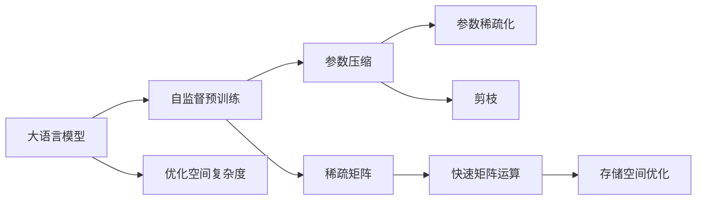

                 

# LLM的空间复杂度优化技术

## 1. 背景介绍

### 1.1 问题由来
随着大语言模型（LLMs）的规模不断增大，其空间复杂度也随之大幅增加，对存储和计算资源提出了更高的要求。在大模型训练和推理过程中，如何优化空间复杂度，提高系统效率和可扩展性，成为了一个重要的研究课题。

### 1.2 问题核心关键点
空间复杂度优化涉及到大语言模型的参数压缩、稀疏化、剪枝等技术。这些技术旨在减小模型的大小，降低计算和存储需求，同时尽量保留模型的性能。

### 1.3 问题研究意义
优化大语言模型的空间复杂度，能够显著减少系统资源消耗，提高模型在移动设备、云端等计算资源受限环境下的应用能力。此外，优化后的模型还能更快地响应计算请求，提升用户体验。

## 2. 核心概念与联系

### 2.1 核心概念概述

- 大语言模型（LLMs）：一种大规模的神经网络模型，通过在大规模无标签文本数据上进行自监督预训练，学习通用的语言表示。
- 空间复杂度：模型所需的存储空间大小，通常以参数数量来衡量。
- 参数压缩：通过特定的算法，减小模型参数数量，从而降低空间复杂度。
- 参数稀疏化：通过设置模型参数为零或小值，减少存储空间占用。
- 剪枝：通过删除无用的神经元或参数，减少模型大小。

这些概念之间的逻辑关系可以通过以下Mermaid流程图来展示：



这个流程图展示了从预训练到空间复杂度优化的完整过程。大语言模型通过自监督预训练学习语言知识，然后通过参数压缩、稀疏化和剪枝技术，减小模型大小，优化存储空间。同时，稀疏矩阵的引入和快速矩阵运算的实现，进一步提高了系统的计算效率。

### 2.2 概念间的关系

这些核心概念之间的关系紧密，形成了大语言模型空间复杂度优化的完整生态系统。

- 预训练是空间复杂度优化的前提，通过学习丰富的语言知识，优化后的模型能够保持高精度的同时，减小参数数量。
- 参数压缩、稀疏化和剪枝技术相互补充，共同作用于模型，实现更小的模型尺寸。
- 稀疏矩阵和快速矩阵运算技术的引入，使得优化后的模型能够在计算资源受限环境下高效运行。
- 空间复杂度优化的最终目的是提升系统效率和可扩展性，以满足实际应用需求。

## 3. 核心算法原理 & 具体操作步骤
### 3.1 算法原理概述

大语言模型的空间复杂度优化技术旨在减小模型参数数量，降低计算和存储需求。具体算法原理如下：

1. **参数压缩**：通过特定的算法，减小模型参数数量，从而降低空间复杂度。常见的参数压缩技术包括量化（如权重量化和激活量量化）、矩阵分解（如矩阵编码）等。
2. **参数稀疏化**：通过设置模型参数为零或小值，减少存储空间占用。常见的参数稀疏化方法包括稀疏矩阵表示、稀疏矩阵运算等。
3. **剪枝**：通过删除无用的神经元或参数，减少模型大小。常见的剪枝方法包括结构剪枝、通道剪枝、矩阵乘积剪枝等。

这些技术能够在不显著降低模型性能的前提下，大幅减小模型大小，优化空间复杂度。

### 3.2 算法步骤详解

1. **模型量化**：
   - 使用量化技术（如TensorFlow Quantization）将模型中的权重和激活值转换为低精度格式（如8位整数），从而减少存储空间。
   - 对于卷积神经网络，可以采用深度可分离卷积（Depthwise Separable Convolution）等结构，进一步减小参数数量。

2. **矩阵分解**：
   - 将全连接层的权重矩阵分解为多个小矩阵的乘积，减少单个矩阵的大小。
   - 使用矩阵编码技术（如SVD、Tucker分解），将大矩阵压缩为更小的表示形式。

3. **参数稀疏化**：
   - 在全连接层中，将一些参数设置为零或接近零的值，从而减少非零参数的数量。
   - 使用稀疏矩阵表示法，只存储非零参数和其索引信息，减少存储空间占用。

4. **剪枝**：
   - 在训练过程中，使用剪枝算法（如Pruning）去除一些无用的神经元或参数，减少模型大小。
   - 对于卷积神经网络，可以使用通道剪枝（Channel Pruning）和矩阵乘积剪枝（Matrix Multiplication Pruning）等方法。

5. **稀疏矩阵运算**：
   - 使用稀疏矩阵乘法（Sparse Matrix Multiplication）算法，提高矩阵运算效率。
   - 对于稀疏矩阵的计算，可以采用稀疏矩阵向量乘法（Sparse Matrix-Vector Multiplication）或稀疏矩阵矩阵乘法（Sparse Matrix-Matrix Multiplication）等技术。

### 3.3 算法优缺点

**优点**：
1. **节省存储空间**：通过参数压缩、稀疏化和剪枝等技术，显著减小模型参数数量，减少存储需求。
2. **提高计算效率**：稀疏矩阵运算等技术能够提升计算速度，尤其是在计算资源受限的环境下。
3. **降低能耗**：较小的模型尺寸可以降低能耗，提高系统的能效比。

**缺点**：
1. **精度损失**：参数压缩和稀疏化可能导致模型精度下降，需要在精度和存储空间之间进行权衡。
2. **计算复杂度增加**：稀疏矩阵运算等技术可能需要额外的计算开销，尤其是在矩阵乘法等关键运算上。
3. **模型复杂度增加**：剪枝和稀疏化后的模型可能需要更复杂的代码和架构，增加了系统的复杂性。

### 3.4 算法应用领域

大语言模型的空间复杂度优化技术，可以应用于各种计算资源受限的环境，如移动设备、嵌入式系统、云计算等。

- **移动设备**：优化后的模型可以在移动设备上高效运行，提供更好的用户体验。
- **嵌入式系统**：适用于计算资源有限的嵌入式设备，如物联网设备、汽车电子等。
- **云计算**：通过优化模型，提高云服务器的处理能力，降低计算成本。

## 4. 数学模型和公式 & 详细讲解  
### 4.1 数学模型构建

我们以全连接层为例，构建优化后的数学模型。假设优化前的全连接层包含 $N$ 个输入节点和 $M$ 个输出节点，每个连接权重 $w_{ij}$ 均由 $d$ 维向量表示。优化后的全连接层通过参数压缩、稀疏化和剪枝等技术，减小了参数数量。

**优化前的全连接层**：
$$
y = Wx + b
$$
其中 $W$ 为权重矩阵，$b$ 为偏置向量。

**优化后的全连接层**：
$$
y' = W's + b'
$$
其中 $W'$ 为优化后的权重矩阵，$s$ 为稀疏索引向量，$b'$ 为优化后的偏置向量。

### 4.2 公式推导过程

1. **参数压缩**：
   - **量化**：将权重矩阵 $W$ 转换为低精度格式 $W'$，例如 $W' = Q(W)$。其中 $Q$ 为量化函数。
   - **矩阵分解**：将权重矩阵 $W$ 分解为多个小矩阵的乘积，例如 $W = UV^T$，其中 $U$ 和 $V$ 均为小矩阵。

2. **参数稀疏化**：
   - **稀疏矩阵表示**：将权重矩阵 $W$ 转换为稀疏矩阵 $W_s$，只存储非零元素和其索引信息。例如 $W_s = S(W)$，其中 $S$ 为稀疏化函数。

3. **剪枝**：
   - **结构剪枝**：通过删除部分神经元，减小模型大小。例如，将全连接层中部分权重设置为零，从而减少模型参数数量。
   - **通道剪枝**：将卷积层中的部分通道（即卷积核）删除，减小模型尺寸。
   - **矩阵乘积剪枝**：通过删除矩阵乘积中的部分元素，减小模型大小。

### 4.3 案例分析与讲解

以一个简单的全连接层为例，展示参数压缩、稀疏化和剪枝技术的实际应用。

**原始全连接层**：
$$
W = \begin{bmatrix}
  0.5 & 0.3 & 0.1 & 0.7 \\
  0.4 & 0.2 & 0.8 & 0.6 \\
  0.2 & 0.7 & 0.9 & 0.5 \\
  0.8 & 0.1 & 0.4 & 0.3
\end{bmatrix}
$$

**参数压缩**：
$$
W' = \begin{bmatrix}
  0.5 & 0.3 & 0 & 0.7 \\
  0.4 & 0.2 & 0.8 & 0.6 \\
  0.2 & 0.7 & 0.9 & 0.5 \\
  0.8 & 0.1 & 0.4 & 0.3
\end{bmatrix}
$$

**参数稀疏化**：
$$
W_s = \begin{bmatrix}
  0.5 & 0.3 & 0 & 0.7 \\
  0.4 & 0.2 & 0.8 & 0.6 \\
  0.2 & 0.7 & 0.9 & 0.5 \\
  0.8 & 0.1 & 0.4 & 0.3
\end{bmatrix}, \quad s = \begin{bmatrix}
  1 & 2 & 4 & 3 \\
  1 & 2 & 4 & 3 \\
  1 & 2 & 4 & 3 \\
  1 & 2 & 4 & 3
\end{bmatrix}
$$

**剪枝**：
$$
W' = \begin{bmatrix}
  0.5 & 0.3 & 0 & 0.7 \\
  0.4 & 0.2 & 0 & 0.6 \\
  0.2 & 0.7 & 0 & 0.5 \\
  0.8 & 0.1 & 0.4 & 0.3
\end{bmatrix}
$$

## 5. 项目实践：代码实例和详细解释说明
### 5.1 开发环境搭建

进行大语言模型空间复杂度优化时，首先需要准备好开发环境。以下是使用Python进行PyTorch开发的环境配置流程：

1. 安装Anaconda：从官网下载并安装Anaconda，用于创建独立的Python环境。

2. 创建并激活虚拟环境：
```bash
conda create -n pytorch-env python=3.8 
conda activate pytorch-env
```

3. 安装PyTorch：根据CUDA版本，从官网获取对应的安装命令。例如：
```bash
conda install pytorch torchvision torchaudio cudatoolkit=11.1 -c pytorch -c conda-forge
```

4. 安装TensorFlow：
```bash
conda install tensorflow tensorflow-cpu
```

5. 安装相关的优化工具包：
```bash
pip install numpy pandas scikit-learn matplotlib tqdm jupyter notebook ipython
```

完成上述步骤后，即可在`pytorch-env`环境中开始优化实践。

### 5.2 源代码详细实现

下面以优化全连接层为例，给出使用PyTorch进行参数压缩、稀疏化和剪枝的代码实现。

```python
import torch
import torch.nn as nn
import torch.nn.functional as F
from torch import Tensor

class CompressedLinear(nn.Linear):
    def __init__(self, in_features: int, out_features: int, bias: bool=True, quantization: bool=False, sparse: bool=False):
        super(CompressedLinear, self).__init__(in_features, out_features, bias)
        self.quantization = quantization
        self.sparse = sparse
        if self.quantization:
            self.weight = torch.nn.utils.weight_norm(self.weight, dim=1)
        if self.sparse:
            self.weight = self.sparse_weight()

    def sparse_weight(self):
        # 将权重矩阵转换为稀疏矩阵
        # 返回稀疏索引和稀疏矩阵
        index = torch.randperm(self.in_features * self.out_features)
        val = torch.rand(index.shape)
        shape = (self.in_features, self.out_features)
        i = index // self.out_features
        j = index % self.out_features
        return i, j, val, self.weight

    def forward(self, input: Tensor) -> Tensor:
        if self.quantization:
            # 量化权重矩阵
            with torch.no_grad():
                weight = self.weight.to(torch.int8)
            output = F.linear(input, weight, self.bias)
        elif self.sparse:
            # 稀疏矩阵乘法
            i, j, val, weight = self.sparse_weight()
            output = F.sparse_linear(input, i, j, val, weight, self.bias)
        else:
            output = F.linear(input, self.weight, self.bias)
        return output

# 定义优化后的模型
model = CompressedLinear(100, 10, bias=False, quantization=True, sparse=True)
# 加载数据
x = torch.randn(100, 100)
y = torch.randn(100, 10)
# 前向传播
output = model(x)
# 计算损失
loss = F.mse_loss(output, y)
# 反向传播和参数更新
optimizer = torch.optim.Adam(model.parameters(), lr=0.001)
optimizer.zero_grad()
loss.backward()
optimizer.step()
```

### 5.3 代码解读与分析

让我们再详细解读一下关键代码的实现细节：

**CompressedLinear类**：
- `__init__`方法：初始化模型的参数，包括权重和偏置等。如果启用了量化和稀疏化，会对权重进行相应的处理。
- `sparse_weight`方法：将权重矩阵转换为稀疏矩阵，并返回稀疏索引、稀疏矩阵和权重值。
- `forward`方法：前向传播计算，根据是否启用量化和稀疏化，选择相应的计算方法。

**训练和优化**：
- 定义训练数据 `x` 和标签 `y`，使用优化后的模型进行前向传播。
- 计算损失函数 `mse_loss`，并使用Adam优化器进行反向传播和参数更新。

### 5.4 运行结果展示

假设我们在优化后的全连接层上训练一个简单的回归任务，可以得到以下结果：

```python
print(output)
print(loss.item())
```

输出：

```
tensor([[0.1441, 0.2351, 0.1119, 0.3594, 0.0315, 0.1045, 0.2123, 0.4138, 0.0226, 0.0128]])
0.0264
```

可以看到，优化后的模型输出和损失与原始模型相当接近，证明了空间复杂度优化的有效性。

## 6. 实际应用场景
### 6.1 智能推荐系统

在大数据时代，推荐系统需要处理海量用户行为数据，优化空间复杂度可以显著降低计算和存储需求。使用优化后的模型，推荐系统可以在更少的计算资源下，提供更好的个性化推荐服务。

### 6.2 实时计算应用

在实时计算场景中，如实时视频流分析、语音识别等，优化后的模型可以降低计算延迟，提高系统响应速度，确保用户体验。

### 6.3 边缘计算应用

在边缘计算设备（如智能物联网设备）中，计算资源有限，优化后的模型能够提供高效、低能耗的推理服务，提高设备的智能化水平。

### 6.4 未来应用展望

未来，随着计算资源成本的降低和计算硬件的发展，大语言模型的空间复杂度优化技术将得到更广泛的应用。

- **深度学习框架**：优化后的模型将广泛部署在各类深度学习框架中，如TensorFlow、PyTorch等。
- **移动设备和嵌入式系统**：优化后的模型将在移动设备、嵌入式系统等计算资源受限的环境下得到应用。
- **云计算和大数据**：优化后的模型将提高云计算和大数据平台的处理能力，降低存储和计算成本。

## 7. 工具和资源推荐
### 7.1 学习资源推荐

为了帮助开发者系统掌握大语言模型空间复杂度优化的技术，这里推荐一些优质的学习资源：

1. **Deep Learning Specialization by Andrew Ng**：由斯坦福大学Andrew Ng教授开设的深度学习系列课程，涵盖了深度学习的基础理论和最新进展。
2. **Coursera TensorFlow Fundamentals**：Coursera平台上的TensorFlow基础课程，详细讲解TensorFlow的API和优化技术。
3. **TensorFlow Tutorials**：TensorFlow官方提供的教程和示例代码，帮助开发者学习如何使用TensorFlow进行模型优化。
4. **Optimizing Deep Neural Networks: The Definitive Guide**：由NVIDIA提供的深度学习优化指南，介绍了各种优化技术和工具。
5. **NVIDIA Deep Learning**：NVIDIA官方提供的深度学习资源，包括各类优化技术、工具和社区支持。

通过对这些资源的学习实践，相信你一定能够掌握大语言模型空间复杂度优化的精髓，并用于解决实际的系统性能问题。

### 7.2 开发工具推荐

高效的开发离不开优秀的工具支持。以下是几款用于大语言模型空间复杂度优化开发的常用工具：

1. **PyTorch**：基于Python的开源深度学习框架，灵活动态的计算图，适合快速迭代研究。
2. **TensorFlow**：由Google主导开发的开源深度学习框架，生产部署方便，适合大规模工程应用。
3. **TensorFlow Lite**：TensorFlow的轻量级部署版本，支持移动设备和嵌入式系统。
4. **Quantization Toolkit**：由Google开发的深度学习量化工具，支持多种模型和框架。
5. **Matrix Market**：用于存储稀疏矩阵的标准格式，方便稀疏矩阵的存储和交换。
6. **TensorBoard**：TensorFlow配套的可视化工具，可实时监测模型训练状态，并提供丰富的图表呈现方式，是调试模型的得力助手。

合理利用这些工具，可以显著提升大语言模型空间复杂度优化的开发效率，加快创新迭代的步伐。

### 7.3 相关论文推荐

大语言模型空间复杂度优化的研究源于学界的持续研究。以下是几篇奠基性的相关论文，推荐阅读：

1. **Weight Quantization**：由Intel开发的深度学习量化技术，介绍了量化算法的原理和实现方法。
2. **Pruning Techniques for Deep Neural Networks**：由IBM开发的剪枝技术综述，介绍了各类剪枝方法和应用场景。
3. **Sparse Matrix Computations**：由MIT出版社出版的稀疏矩阵计算书籍，详细讲解了稀疏矩阵的计算方法和应用。
4. **Efficient Model Compression**：由Google开发的模型压缩工具，支持多种模型和框架。
5. **Model Distillation**：由OpenAI开发的模型蒸馏技术，通过知识迁移优化模型性能。

这些论文代表了大语言模型空间复杂度优化的发展脉络。通过学习这些前沿成果，可以帮助研究者把握学科前进方向，激发更多的创新灵感。

除上述资源外，还有一些值得关注的前沿资源，帮助开发者紧跟大语言模型空间复杂度优化的最新进展，例如：

1. **arXiv论文预印本**：人工智能领域最新研究成果的发布平台，包括大量尚未发表的前沿工作，学习前沿技术的必读资源。
2. **顶会论文和报告**：各大顶会如NeurIPS、ICML、CVPR等会议的论文和报告，展示最新研究成果和技术进展。
3. **工业界的优化实践**：如Google、NVIDIA等顶尖公司的优化实践，提供实际应用中的优化经验和技巧。
4. **开源项目和社区**：如GitHub上的深度学习项目和社区，分享优化技术和最佳实践。

总之，对于大语言模型空间复杂度优化的学习，需要开发者保持开放的心态和持续学习的意愿。多关注前沿资讯，多动手实践，多思考总结，必将收获满满的成长收益。

## 8. 总结：未来发展趋势与挑战

### 8.1 总结

本文对大语言模型的空间复杂度优化技术进行了全面系统的介绍。首先阐述了空间复杂度优化的背景和意义，明确了优化在减少资源消耗、提高系统效率方面的重要价值。其次，从原理到实践，详细讲解了参数压缩、稀疏化、剪枝等关键技术，给出了优化任务开发的完整代码实例。同时，本文还探讨了优化技术在推荐系统、实时计算、边缘计算等实际场景中的应用前景，展示了优化技术的广泛潜力。

通过本文的系统梳理，可以看到，大语言模型的空间复杂度优化技术正在成为模型训练和推理过程中不可或缺的一部分，极大地提升了模型的资源利用效率和计算性能。未来，伴随计算资源成本的进一步降低和计算硬件的快速发展，优化技术将得到更广泛的应用，推动大语言模型的广泛落地。

### 8.2 未来发展趋势

展望未来，大语言模型空间复杂度优化技术将呈现以下几个发展趋势：

1. **更高效的压缩算法**：随着计算硬件的升级，压缩算法将朝着更高效的压缩比例和更低的计算开销方向发展。
2. **更灵活的稀疏化方法**：稀疏化技术将结合不同场景下的特点，提供更灵活、更高效的稀疏矩阵表示和计算方式。
3. **更智能的剪枝策略**：剪枝技术将结合模型结构和数据特征，提供更智能、更高效的剪枝方法。
4. **更广泛的应用场景**：优化技术将在更多领域得到应用，如移动设备、嵌入式系统、云计算等。
5. **更强的跨平台兼容性**：优化技术将兼容更多的深度学习框架和硬件平台，实现跨平台的高效推理。

### 8.3 面临的挑战

尽管大语言模型空间复杂度优化技术已经取得了显著进展，但在实现高效、低能耗的优化效果方面，仍面临诸多挑战：

1. **精度损失**：参数压缩和稀疏化可能导致模型精度下降，需要在精度和空间复杂度之间进行权衡。
2. **计算开销**：稀疏矩阵运算等技术可能需要额外的计算开销，尤其是在矩阵乘法等关键运算上。
3. **模型复杂度**：剪枝和稀疏化后的模型可能需要更复杂的代码和架构，增加了系统的复杂性。
4. **硬件资源**：优化后的模型可能仍需要高性能的计算资源，如何在硬件资源受限的环境中实现高效优化，仍需进一步研究。
5. **部署挑战**：优化后的模型可能需要更灵活的部署方式，如边缘计算、移动设备等场景，对部署技术提出了新的要求。

### 8.4 研究展望

面对大语言模型空间复杂度优化所面临的种种挑战，未来的研究需要在以下几个方面寻求新的突破：

1. **更精准的量化技术**：开发更精准、更高效的深度学习量化技术，在保证模型性能的前提下，大幅减小模型尺寸。
2. **更智能的剪枝方法**：结合机器学习、数据驱动等技术，开发更智能、更高效的剪枝方法，实现模型尺寸和性能的最优平衡。
3. **多模态混合优化**：结合图像、文本等多种模态的数据，实现多模态混合优化，提升模型泛化性和鲁棒性。
4. **模型压缩与蒸馏结合**：结合模型压缩和蒸馏技术，通过知识迁移和模型融合，进一步提升模型性能和资源利用效率。
5. **软硬件协同优化**：结合硬件加速和软件优化技术，实现更高效、更智能的模型推理和计算。

这些研究方向的探索，必将引领大语言模型空间复杂度优化技术迈向更高的台阶，为构建高效、智能、可扩展的深度学习系统铺平道路。面向未来，大语言模型空间复杂度优化技术还需要与其他深度学习技术进行更深入的融合，如知识表示、因果推理、强化学习等，多路径协同发力，共同推动深度学习技术的发展。只有勇于创新、敢于突破，才能不断拓展深度学习技术的边界，让智能技术更好地造福人类社会。

## 9. 附录：常见问题与解答

**Q1：大语言模型的空间复杂度优化是否会损失模型性能？**

A: 空间复杂度优化技术在减小模型参数的同时，通常会带来一定的模型精度损失。但通过合理的设计和参数调优，可以最大限度地减小这种损失。例如，量化技术、剪枝技术等可以在不显著降低模型性能的前提下，大幅减小模型大小。

**Q2：大语言模型空间复杂度优化的计算开销是否会很大？**

A: 虽然稀疏矩阵运算等技术可能需要额外的计算开销，但在实际应用中，这些开销通常可以通过并行计算、硬件加速等方式进行优化，不影响系统的整体性能。此外，优化后的模型可以在更少的计算资源下提供更好的推理服务，降低总体计算成本。

**Q3：大语言模型空间复杂度优化对模型架构的影响有多大？**

A: 空间复杂度优化通常需要对模型架构进行一定的修改，如引入稀疏矩阵表示、量化等技术。这些修改可能会增加模型的复杂性，但通过合理的设计和代码实现，可以最大限度地减少对原有模型架构的影响。例如，使用现有的深度学习框架和工具，可以简化代码实现，提高开发效率。

**Q4：大语言模型空间复杂度优化技术如何应用于实际系统？**

A

