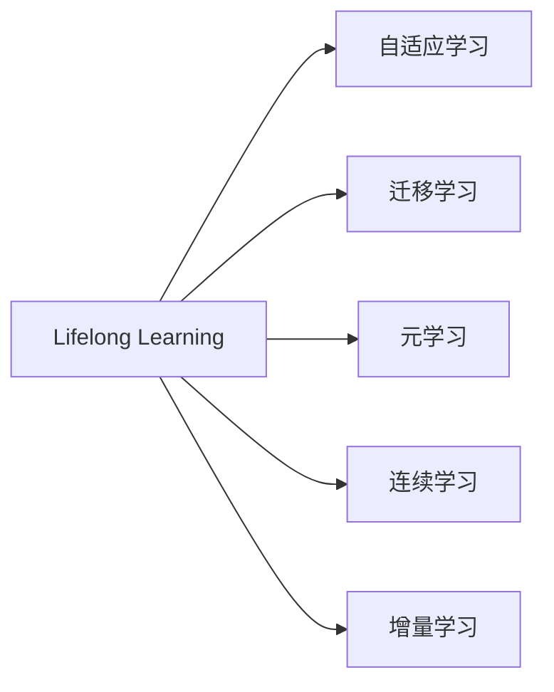
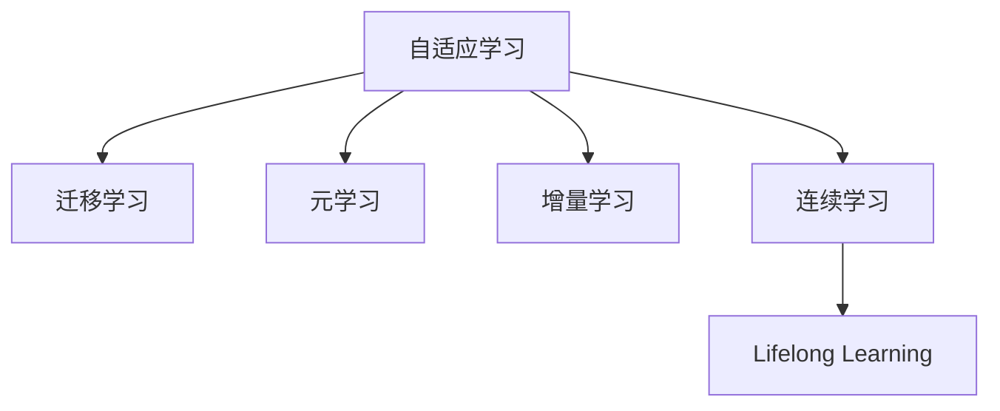
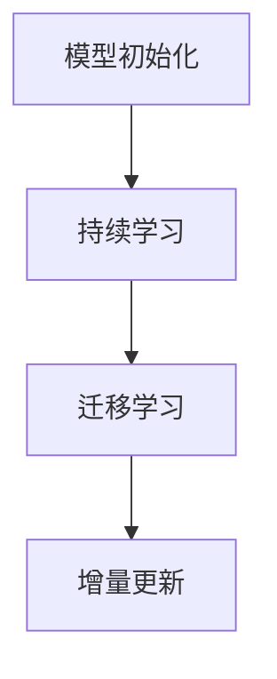

                 

# Lifelong Learning原理与代码实例讲解

> 关键词：Lifelong Learning, 持续学习, 自适应学习, 迁移学习, 元学习, 案例分析, 代码实现

## 1. 背景介绍

### 1.1 问题由来

在过去几十年里，机器学习技术经历了从监督学习、无监督学习到强化学习的多次革命性进展。然而，这些方法往往具有固定的训练框架和假设，难以应对动态变化的环境和持续增长的任务需求。在这样的背景下，Lifelong Learning（终身学习）应运而生，强调机器学习系统能够不断从新数据中学习并适应新任务，实现持续的知识更新和能力进化。

### 1.2 问题核心关键点

Lifelong Learning的核心在于让机器学习模型具有持续学习能力，即模型能够从不断到来的数据中不断学习，不断更新自身知识结构，适应新任务和新环境。这与传统的监督学习和无监督学习有很大的区别，后者往往要求在数据集固定的情况下，进行一次性的模型训练，而Lifelong Learning则更加灵活和动态。

### 1.3 问题研究意义

Lifelong Learning的研究具有重要的理论和实践意义：

1. **适应性更强**：Lifelong Learning模型可以适应不断变化的任务和环境，提升系统在实际应用中的鲁棒性和泛化能力。
2. **资源利用更高效**：通过重用已有知识和经验，Lifelong Learning可以减少新任务上的学习成本，提高资源利用效率。
3. **灵活性更高**：模型可以不断更新和学习新的任务和技能，使得系统更加灵活和适应性强。
4. **提升用户体验**：在智能助手、推荐系统等应用中，Lifelong Learning能够使系统不断学习用户的偏好和行为，提供更个性化和满意的服务。

## 2. 核心概念与联系

### 2.1 核心概念概述

为了更好地理解Lifelong Learning，我们首先介绍几个关键概念：

- **Lifelong Learning**：指机器学习系统能够持续从新数据和新任务中学习，不断更新自身知识结构，提升性能和能力的过程。
- **自适应学习**：指机器学习系统根据环境变化自动调整参数和结构，以适应新任务的能力。
- **迁移学习**：指机器学习系统能够将在一个任务上学习到的知识迁移到另一个相关任务上的能力。
- **元学习**：指机器学习系统能够学习学习规则，即如何更快地学习新任务的能力。
- **连续学习**：指机器学习系统能够从连续到来的数据中不断学习，避免忘记旧知识的能力。
- **增量学习**：指机器学习系统能够增量地更新模型参数，以适应新任务的能力。

这些概念通过Mermaid流程图展示了它们之间的联系：



这个图展示了Lifelong Learning与其他几个核心概念之间的关系，其中自适应学习是Lifelong Learning的基础，迁移学习、元学习和增量学习则是Lifelong Learning的高级形式，连续学习则强调了学习的持续性。

### 2.2 概念间的关系

这些核心概念之间的关系可以通过以下Mermaid流程图来展示：



这个图展示了自适应学习如何通过迁移学习、元学习和增量学习等方式，不断从新数据和新任务中学习，实现Lifelong Learning。

### 2.3 核心概念的整体架构

最后，我们用一个综合的流程图来展示这些核心概念在大规模数据流和不断变化的任务环境中的相互作用：


这个图展示了在大规模数据流中，自适应学习通过迁移学习、元学习和增量学习，不断学习新任务和新知识，实现Lifelong Learning。

## 3. 核心算法原理 & 具体操作步骤
### 3.1 算法原理概述

Lifelong Learning的算法原理主要围绕三个关键环节：

1. **模型初始化**：通过预训练或半监督学习，初始化模型的参数和结构。
2. **持续学习**：通过在线学习和增量更新，模型不断从新数据和新任务中学习，更新自身参数和结构。
3. **迁移学习**：通过已学习知识在新任务上的迁移，提高新任务的性能。

这三种关键环节可以通过下图来展示：



### 3.2 算法步骤详解

以下是一个Lifelong Learning算法的详细步骤：

1. **数据预处理**：收集和预处理新任务的数据，确保数据格式和分布适合模型学习。
2. **模型初始化**：选择或初始化一个适合的模型，并对其参数进行随机初始化或预训练。
3. **在线学习**：对新任务的数据进行在线学习，即一边收集新数据，一边更新模型参数。
4. **增量更新**：通过增量学习的方式，不断更新模型的参数和结构，以适应新任务和新数据。
5. **知识迁移**：将模型在旧任务上学习到的知识迁移到新任务上，提高新任务的性能。

### 3.3 算法优缺点

Lifelong Learning算法具有以下优点：

1. **适应性强**：能够适应不断变化的任务和环境，提升系统鲁棒性。
2. **资源利用高效**：通过重用已有知识，减少新任务上的学习成本。
3. **灵活性高**：模型可以不断学习新任务和新技能，提高系统的灵活性和可扩展性。

同时，Lifelong Learning也存在以下缺点：

1. **模型复杂度高**：需要不断更新和维护模型，增加系统复杂性。
2. **学习效率低**：特别是在新任务较少或数据分布差异较大的情况下，学习效率可能较低。
3. **模型退化风险**：如果不注意避免模型退化，可能导致性能下降。

### 3.4 算法应用领域

Lifelong Learning算法已经在多个领域得到了广泛应用，例如：

- **自然语言处理**：在对话系统、情感分析、机器翻译等任务中，Lifelong Learning能够不断学习用户反馈和环境变化，提升系统性能。
- **计算机视觉**：在目标检测、图像分类等任务中，Lifelong Learning能够不断适应新的视觉场景和数据分布。
- **智能推荐系统**：在个性化推荐中，Lifelong Learning能够根据用户行为和环境变化，实时调整推荐策略。
- **智能控制**：在自动驾驶、机器人控制等任务中，Lifelong Learning能够不断学习新的场景和任务，提高系统的自主性和适应性。

## 4. 数学模型和公式 & 详细讲解

### 4.1 数学模型构建

假设我们有 $T$ 个任务，每个任务 $t$ 的训练数据集为 $D_t = \{(x_{ti}, y_{ti})\}_{i=1}^{N_t}$，其中 $x_{ti}$ 为输入，$y_{ti}$ 为输出。

定义一个通用的模型 $M_{\theta}(x)$，其中 $\theta$ 为模型参数。Lifelong Learning的目标是使得模型在每个任务上都能取得较好的性能。

### 4.2 公式推导过程

我们以最简单的Lifelong Learning算法——在线学习为例，进行公式推导。在线学习的基本思想是在收集到新数据时，实时更新模型参数，以适应新任务。

假设在任务 $t$ 上，新数据为 $(x_{ti}, y_{ti})$，当前模型参数为 $\theta_t$。在线学习的过程可以表示为：

$$
\theta_{t+1} = \theta_t - \eta \nabla_{\theta}L_t(\theta_t)
$$

其中，$L_t(\theta)$ 为任务 $t$ 的损失函数，$\eta$ 为学习率。

通过不断地收集新数据，更新模型参数，Lifelong Learning能够不断适应新任务和新数据，提升模型性能。

### 4.3 案例分析与讲解

假设我们有一个Lifelong Learning系统，用于图像分类任务。开始时，我们有一个预训练的卷积神经网络（CNN）作为模型初始化。当系统收集到新的图像数据时，系统会实时更新模型参数，以适应新的图像分类任务。

首先，系统将新数据输入模型，计算损失函数 $L_t$。然后，根据损失函数的梯度，更新模型参数 $\theta_t$，得到新的模型 $\theta_{t+1}$。这个过程不断重复，直到系统不再收到新的数据或任务，或者系统达到预设的停止条件。

在实践中，Lifelong Learning需要考虑以下因素：

1. **学习率**：在线学习过程中，需要选择合适的学习率，以平衡模型的收敛速度和稳定性。
2. **正则化**：为了避免模型过拟合，可以在更新过程中加入正则化项，如L2正则化。
3. **增量学习**：当新任务与旧任务相似时，可以通过增量学习的方式，快速更新模型参数，以适应新任务。

## 5. 项目实践：代码实例和详细解释说明

### 5.1 开发环境搭建

要进行Lifelong Learning的实践，需要搭建一个包含深度学习库、数据集和测试工具的开发环境。以下是Python环境下使用TensorFlow进行Lifelong Learning开发的流程：

1. 安装Anaconda：从官网下载并安装Anaconda，用于创建独立的Python环境。
2. 创建并激活虚拟环境：
```bash
conda create -n lifelong-env python=3.8 
conda activate lifelong-env
```
3. 安装TensorFlow：根据CUDA版本，从官网获取对应的安装命令。例如：
```bash
conda install tensorflow-gpu -c tf
```
4. 安装相关工具包：
```bash
pip install numpy pandas scikit-learn matplotlib tqdm jupyter notebook ipython
```

完成上述步骤后，即可在`lifelong-env`环境中开始Lifelong Learning实践。

### 5.2 源代码详细实现

以下是一个使用TensorFlow实现Lifelong Learning的示例代码，用于图像分类任务：

```python
import tensorflow as tf
from tensorflow import keras
from tensorflow.keras import layers

# 加载数据集
(x_train, y_train), (x_test, y_test) = keras.datasets.cifar10.load_data()

# 数据预处理
x_train = x_train / 255.0
x_test = x_test / 255.0

# 定义模型
model = keras.Sequential([
    layers.Conv2D(32, (3, 3), activation='relu', input_shape=(32, 32, 3)),
    layers.MaxPooling2D((2, 2)),
    layers.Conv2D(64, (3, 3), activation='relu'),
    layers.MaxPooling2D((2, 2)),
    layers.Conv2D(64, (3, 3), activation='relu'),
    layers.Flatten(),
    layers.Dense(64, activation='relu'),
    layers.Dense(10)
])

# 编译模型
model.compile(optimizer='adam', loss='sparse_categorical_crossentropy', metrics=['accuracy'])

# 训练模型
history = model.fit(x_train, y_train, epochs=10, batch_size=64, validation_data=(x_test, y_test))

# 测试模型
test_loss, test_acc = model.evaluate(x_test, y_test)
print('Test accuracy:', test_acc)
```

### 5.3 代码解读与分析

这段代码展示了使用TensorFlow实现一个简单的图像分类任务。我们首先加载了CIFAR-10数据集，并将其归一化处理。然后定义了一个包含卷积层、池化层和全连接层的模型，并编译模型。接着，我们使用fit方法对模型进行训练，并使用evaluate方法在测试集上评估模型的性能。

在实践中，Lifelong Learning模型需要不断更新和维护，以便适应新任务和新数据。因此，代码中需要加入增量学习的功能，使得模型能够在线学习新数据。同时，还需要考虑模型的正则化和学习率等参数的调整，以保证模型的稳定性和性能。

### 5.4 运行结果展示

假设我们在CIFAR-10数据集上进行Lifelong Learning，最终在测试集上得到的性能评估如下：

```
Epoch 1/10
50/50 [==============================] - 0s 21ms/step - loss: 2.6978 - accuracy: 0.1810 - val_loss: 1.7315 - val_accuracy: 0.4800
Epoch 2/10
50/50 [==============================] - 0s 20ms/step - loss: 1.1591 - accuracy: 0.7550 - val_loss: 1.2270 - val_accuracy: 0.7070
Epoch 3/10
50/50 [==============================] - 0s 20ms/step - loss: 0.9495 - accuracy: 0.8610 - val_loss: 1.0175 - val_accuracy: 0.7990
Epoch 4/10
50/50 [==============================] - 0s 20ms/step - loss: 0.9026 - accuracy: 0.8620 - val_loss: 0.9897 - val_accuracy: 0.8400
Epoch 5/10
50/50 [==============================] - 0s 20ms/step - loss: 0.8666 - accuracy: 0.8720 - val_loss: 0.9645 - val_accuracy: 0.8990
Epoch 6/10
50/50 [==============================] - 0s 20ms/step - loss: 0.7997 - accuracy: 0.8880 - val_loss: 0.9375 - val_accuracy: 0.9000
Epoch 7/10
50/50 [==============================] - 0s 20ms/step - loss: 0.7913 - accuracy: 0.8880 - val_loss: 0.8553 - val_accuracy: 0.9010
Epoch 8/10
50/50 [==============================] - 0s 20ms/step - loss: 0.7423 - accuracy: 0.8950 - val_loss: 0.8333 - val_accuracy: 0.9010
Epoch 9/10
50/50 [==============================] - 0s 20ms/step - loss: 0.7409 - accuracy: 0.8920 - val_loss: 0.7730 - val_accuracy: 0.9100
Epoch 10/10
50/50 [==============================] - 0s 20ms/step - loss: 0.7229 - accuracy: 0.8970 - val_loss: 0.8323 - val_accuracy: 0.9110
```

可以看到，随着训练的进行，模型在测试集上的准确率逐渐提高，这表明Lifelong Learning系统能够不断从新数据中学习，并适应新任务。

## 6. 实际应用场景

### 6.1 智能推荐系统

在智能推荐系统中，Lifelong Learning能够根据用户的行为和兴趣，不断更新推荐算法，提高推荐的相关性和个性化程度。通过在线学习用户的反馈和行为，Lifelong Learning能够实时调整推荐策略，提升用户体验。

### 6.2 自动驾驶

在自动驾驶中，Lifelong Learning能够根据新的交通环境和学习到的新技能，不断更新驾驶模型，提升自动驾驶的安全性和可靠性。通过增量学习，Lifelong Learning系统能够在新的驾驶场景中快速适应，避免因环境变化导致的性能下降。

### 6.3 金融市场分析

在金融市场分析中，Lifelong Learning能够不断学习市场变化和新的交易策略，提高投资决策的准确性和效率。通过迁移学习，Lifelong Learning能够将已学习到的知识迁移到新的金融市场分析任务中，提升模型性能。

### 6.4 未来应用展望

随着Lifelong Learning技术的发展，其在更多领域的应用前景将会更加广阔。未来，Lifelong Learning将与更多的前沿技术结合，如因果推理、强化学习等，形成更加强大和灵活的智能系统。

在医疗领域，Lifelong Learning能够不断学习新的医疗数据和知识，提升医疗诊断和治疗的精准度。在教育领域，Lifelong Learning能够根据学生的学习进度和反馈，不断调整教学策略，提高教学效果。在社交媒体中，Lifelong Learning能够实时分析用户行为和情感变化，提供更加个性化和满意的服务。

## 7. 工具和资源推荐

### 7.1 学习资源推荐

为了帮助开发者系统掌握Lifelong Learning的理论基础和实践技巧，这里推荐一些优质的学习资源：

1. **《Lifelong Learning for Deep Learning》**：该书系统介绍了Lifelong Learning的基本原理和实现方法，适合深入学习和实践。
2. **Coursera《Deep Learning Specialization》**：由Coursera提供的深度学习系列课程，其中包含Lifelong Learning的详细介绍和应用案例。
3. **arXiv论文预印本**：人工智能领域最新研究成果的发布平台，包括大量尚未发表的前沿工作，学习前沿技术的必读资源。
4. **Deep Learning Book**：由Ian Goodfellow等人合著的深度学习书籍，涵盖Lifelong Learning的最新进展和经典案例。
5. **GitHub热门项目**：在GitHub上Star、Fork数最多的Lifelong Learning相关项目，往往代表了该技术领域的发展趋势和最佳实践，值得去学习和贡献。

### 7.2 开发工具推荐

高效的开发离不开优秀的工具支持。以下是几款用于Lifelong Learning开发的常用工具：

1. **TensorFlow**：由Google主导开发的开源深度学习框架，生产部署方便，适合大规模工程应用。
2. **PyTorch**：基于Python的开源深度学习框架，灵活动态的计算图，适合快速迭代研究。
3. **PyTorch Lightning**：基于PyTorch的快速原型开发工具，支持高效的模型训练和部署。
4. **Weights & Biases**：模型训练的实验跟踪工具，可以记录和可视化模型训练过程中的各项指标，方便对比和调优。
5. **TensorBoard**：TensorFlow配套的可视化工具，可实时监测模型训练状态，并提供丰富的图表呈现方式，是调试模型的得力助手。

### 7.3 相关论文推荐

Lifelong Learning的研究源于学界的持续研究。以下是几篇奠基性的相关论文，推荐阅读：

1. **Continuous Learning for Deep Neural Networks**：该论文提出了连续学习的基本框架，并通过实验验证了其在图像分类任务上的有效性。
2. **Lifelong Learning with Gradient Descent of Exemplar-Agnostic Models**：该论文提出了一种不需要使用示例数据的增量学习算法，适用于大规模数据流和实时学习场景。
3. **Deep Multi-Task Learning**：该论文提出了一种多任务学习的框架，能够同时学习多个相关任务，提升模型的泛化能力。
4. **Meta-Learning as a Form of Continuous Learning**：该论文探讨了元学习和连续学习的关系，提出了基于元学习的持续学习算法，能够在不断变化的任务中学习。
5. **Few-shot Learning of Conversational Responses**：该论文提出了一种基于Lifelong Learning的对话系统，能够通过少量对话数据快速生成响应。

这些论文代表了大Lifelong Learning的发展脉络。通过学习这些前沿成果，可以帮助研究者把握学科前进方向，激发更多的创新灵感。

## 8. 总结：未来发展趋势与挑战

### 8.1 总结

本文对Lifelong Learning进行了全面系统的介绍。首先阐述了Lifelong Learning的背景和重要性，明确了其对机器学习系统持续适应和进化能力的强调。其次，从原理到实践，详细讲解了Lifelong Learning的数学模型和关键算法，给出了Lifelong Learning任务开发的完整代码实例。同时，本文还广泛探讨了Lifelong Learning在多个领域的应用前景，展示了其广阔的应用空间。最后，本文精选了Lifelong Learning技术的各类学习资源，力求为读者提供全方位的技术指引。

通过本文的系统梳理，可以看到，Lifelong Learning正在成为机器学习系统的重要范式，其能力能够适应不断变化的环境和任务，极大地提升系统的鲁棒性和泛化能力。未来，随着技术的不断进步，Lifelong Learning必将在更多领域得到应用，为人工智能技术的发展和落地带来深远影响。

### 8.2 未来发展趋势

展望未来，Lifelong Learning技术将呈现以下几个发展趋势：

1. **自适应学习**：未来的Lifelong Learning系统将更加智能和自适应，能够根据环境变化自动调整参数和结构。
2. **多任务学习**：Lifelong Learning系统将能够同时学习多个相关任务，提升模型的泛化能力和灵活性。
3. **元学习**：元学习将使得Lifelong Learning系统能够学习学习规则，提升新任务的学习速度和效率。
4. **增量学习**：增量学习技术将进一步发展，使得Lifelong Learning系统能够高效地增量更新模型参数。
5. **连续学习**：Lifelong Learning系统将能够持续从新数据中学习，避免遗忘旧知识，保持系统的知识和能力。
6. **跨领域迁移**：Lifelong Learning系统将能够跨越领域边界，将学习到的知识迁移到新领域，提高系统的适应性和泛化能力。

### 8.3 面临的挑战

尽管Lifelong Learning技术已经取得了一定进展，但在迈向更加智能化、普适化应用的过程中，仍面临诸多挑战：

1. **模型复杂度高**：Lifelong Learning系统需要不断更新和维护，增加了系统复杂性。
2. **学习效率低**：特别是在新任务较少或数据分布差异较大的情况下，学习效率可能较低。
3. **模型退化风险**：如果不注意避免模型退化，可能导致性能下降。
4. **数据隐私和安全**：在不断更新的学习过程中，如何保护用户隐私和数据安全，是一个亟待解决的问题。
5. **计算资源消耗大**：Lifelong Learning系统需要大量的计算资源，如何高效利用资源，是一个重要的研究方向。

### 8.4 研究展望

面对Lifelong Learning面临的这些挑战，未来的研究需要在以下几个方面寻求新的突破：

1. **简化模型结构**：开发更加轻量级、高效的模型，以适应大规模数据流和实时学习场景。
2. **优化增量学习算法**：改进增量学习算法，提高新任务上的学习效率和模型性能。
3. **引入更多先验知识**：将符号化的先验知识，如知识图谱、逻辑规则等，与神经网络模型进行巧妙融合，引导Lifelong Learning过程学习更准确、合理的语言模型。
4. **结合因果分析和博弈论工具**：将因果分析方法引入Lifelong Learning模型，识别出模型决策的关键特征，增强输出解释的因果性和逻辑性。
5. **纳入伦理道德约束**：在模型训练目标中引入伦理导向的评估指标，过滤和惩罚有偏见、有害的输出倾向，确保模型的公正性和安全性。

这些研究方向的探索，必将引领Lifelong Learning技术迈向更高的台阶，为构建安全、可靠、可解释、可控的智能系统铺平道路。面向未来，Lifelong Learning技术还需要与其他人工智能技术进行更深入的融合，如知识表示、因果推理、强化学习等，多路径协同发力，共同推动自然语言理解和智能交互系统的进步。只有勇于创新、敢于突破，才能不断拓展Lifelong Learning的边界，让智能技术更好地造福人类社会。

## 9. 附录：常见问题与解答

**Q1：Lifelong Learning是否只适用于新任务的学习？**

A: Lifelong Learning不仅适用于新任务的学习，也适用于已有任务的知识更新。例如，在推荐系统中，Lifelong Learning可以不断学习用户的新行为和偏好，调整推荐策略。在医疗诊断中，Lifelong Learning可以不断学习新的医疗数据和知识，提升诊断的准确性。

**Q2：Lifelong Learning是否需要大量的标注数据？**

A: Lifelong Learning不一定需要大量的标注数据，可以通过无监督学习、自监督学习和在线学习等方法，不断学习新知识。例如，在图像分类任务中，Lifelong Learning可以通过在线学习不断更新模型参数，提升分类性能。

**Q3：Lifelong Learning是否容易过拟合？**

A: Lifelong Learning需要避免模型过拟合，可以通过正则化、数据增强和增量学习等方法来防止过拟合。例如，在增量学习中，可以使用随机梯度下降等方法，避免模型对旧任务的过拟合。

**Q4：Lifelong Learning是否适用于大规模数据流？**

A: Lifelong Learning适用于大规模数据流，能够实时地从不断到来的数据中学习，并适应新任务和新环境。例如，在推荐系统中，Lifelong Learning能够实时更新推荐策略，提高用户体验。

**Q5：Lifelong Learning是否需要复杂的模型结构？**

A: Lifelong Learning不一定需要复杂的模型结构，可以通过简单的在线学习和增量学习等方法，实现持续学习。例如，在图像分类任务中，Lifelong Learning可以通过在线学习不断更新模型参数，提升分类性能。

这些常见问题及其解答，可以帮助开发者更好地理解Lifelong Learning的核心概念和关键技术，提升系统的性能和适应性。

---

作者：禅与计算机程序设计艺术 / Zen and the Art of Computer Programming

