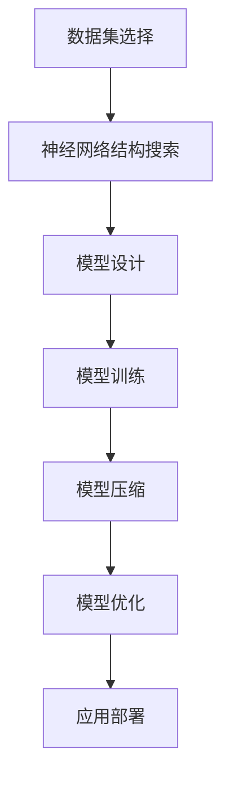
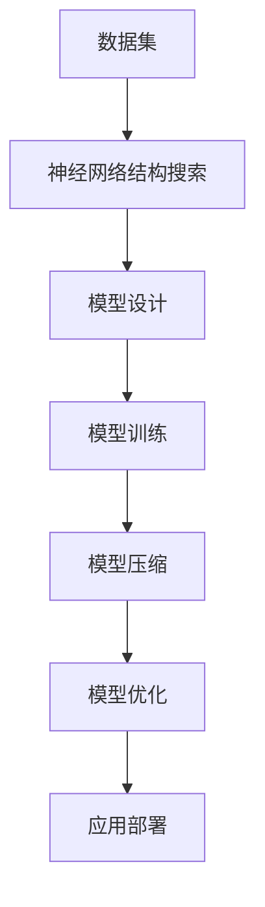

                 

## 1. 背景介绍

随着深度学习技术的发展，神经网络模型的复杂度与日俱增，从基础的几十个节点发展到几十亿甚至更多节点，这在带来强大性能的同时，也使得模型训练、推理和存储的复杂度大幅增加，带来了巨大的计算和存储压力。为解决这些问题，神经网络结构搜索(NAS, Neural Architecture Search)和模型压缩技术成为热门研究方向。

### 1.1 问题由来
神经网络结构搜索NAS，旨在自动发现最优网络结构，大幅减少模型复杂度，同时保持或提高模型性能。模型压缩技术，则是对现有模型进行参数剪枝、量化、低秩分解等操作，减小模型规模，降低计算和存储需求。两者结合起来，可以在保证性能的基础上，大幅提升模型训练、推理和部署的效率。

### 1.2 问题核心关键点
NAS与模型压缩技术的协同优化，主要涉及以下几个关键点：
1. **NAS和模型压缩技术的基本原理**：理解两者的技术基础，并找到两者结合的切入点。
2. **NAS模型与压缩技术的具体实现**：掌握两者结合的具体实现方法，从数据集选择、模型设计、优化算法到压缩策略等。
3. **优化目标与评估指标**：确定协同优化的具体目标和评价标准，包括模型性能、效率、稳定性等。
4. **结合方案与实验结果**：尝试多种结合方案，并给出实验结果和分析，验证优化效果。

### 1.3 问题研究意义
1. **提升模型效率**：通过结合NAS和模型压缩技术，可以在不降低模型性能的前提下，大幅降低模型复杂度和计算资源需求。
2. **促进模型应用**：复杂的深度学习模型往往难以部署到移动端、嵌入式系统等资源受限环境中。两者结合，可以显著减小模型规模，便于应用推广。
3. **增强研究工具**：通过协同优化，开发出更为高效的研究工具和平台，促进深度学习研究和应用的多样化和便捷化。
4. **推动产业发展**：提升模型压缩和NAS技术的应用效率，推动人工智能技术在更多领域和场景中的实际应用。

## 2. 核心概念与联系

### 2.1 核心概念概述

- **神经网络结构搜索(NAS)**：自动设计或搜索最优网络结构的过程。通过遗传算法、强化学习、贝叶斯优化等方法，探索各种网络架构，寻找性能最优的结构。
- **模型压缩**：通过参数剪枝、量化、低秩分解等技术，减小模型规模，降低计算和存储需求，提升模型效率。
- **NAS与模型压缩的协同优化**：将神经网络结构搜索和模型压缩技术结合起来，在设计最优网络结构的同时，进行参数剪枝、量化等操作，最大化性能和效率的提升。

### 2.2 概念间的关系

通过以下Mermaid流程图，展示NAS与模型压缩技术的协同优化过程：



这个流程图展示了NAS与模型压缩技术结合的流程：
1. **数据集选择**：选择与目标任务相关的数据集。
2. **神经网络结构搜索**：自动探索和设计最优网络结构。
3. **模型设计**：根据NAS结果设计具体的神经网络模型。
4. **模型训练**：使用训练集对模型进行训练，得到初始参数。
5. **模型压缩**：对训练好的模型进行参数剪枝、量化等操作。
6. **模型优化**：进一步优化模型，提高性能和效率。
7. **应用部署**：将优化后的模型部署到实际应用中。

### 2.3 核心概念的整体架构

整体架构如下图所示：



这个架构展示了NAS与模型压缩技术的完整协同优化流程，从数据集选择、结构搜索、模型设计、训练、压缩、优化到应用部署，各个环节紧密衔接，共同提升模型的性能和效率。

## 3. 核心算法原理 & 具体操作步骤

### 3.1 算法原理概述

NAS与模型压缩技术的协同优化，本质上是通过自动探索网络结构与压缩策略，找到最优的模型配置。其核心原理包括以下几个方面：

1. **模型设计空间的探索**：NAS通过搜索算法探索网络架构空间，自动设计最优的网络结构。
2. **压缩策略的选择**：模型压缩技术在NAS结果的基础上，选择有效的压缩策略，如参数剪枝、量化、低秩分解等。
3. **协同优化流程**：在NAS和压缩技术的双重优化下，模型性能和效率得到提升。

### 3.2 算法步骤详解

以下是NAS与模型压缩技术协同优化的详细步骤：

1. **数据集选择与预处理**：
   - 选择与目标任务相关的数据集，并进行数据预处理。
   - 将数据集分为训练集、验证集和测试集。

2. **神经网络结构搜索**：
   - 设计搜索空间，包括网络层数、每层节点数、激活函数等。
   - 使用遗传算法、强化学习、贝叶斯优化等搜索算法，探索网络结构空间，得到最优网络结构。
   - 使用训练集对搜索结果进行训练，得到初始模型。

3. **模型设计**：
   - 根据NAS结果，设计具体的神经网络模型。
   - 确定模型的输入输出、隐藏层数和每层节点数。

4. **模型训练与验证**：
   - 使用训练集对模型进行训练，得到模型参数。
   - 在验证集上评估模型性能，根据性能指标进行微调。

5. **模型压缩**：
   - 选择压缩策略，如参数剪枝、量化、低秩分解等。
   - 对训练好的模型进行压缩，减小模型规模，提高计算和存储效率。

6. **模型优化**：
   - 进一步优化模型，如调参、集成学习等，提高模型性能和效率。
   - 在测试集上评估优化后的模型，确保性能不降低。

7. **应用部署**：
   - 将优化后的模型部署到实际应用中。
   - 监控模型性能和效率，及时调整参数和策略。

### 3.3 算法优缺点

**优点**：
1. **自动设计最优结构**：通过自动搜索最优网络结构，减少手动调参的工作量。
2. **模型压缩高效**：结合模型压缩技术，大幅减小模型规模，提升计算和存储效率。
3. **提升模型性能**：在保证性能的同时，降低模型复杂度，便于部署和应用。

**缺点**：
1. **计算资源消耗大**：NAS和模型压缩都依赖于大规模计算资源，耗时较长。
2. **技术难度高**：需要掌握复杂的搜索算法和压缩技术，对技术要求高。
3. **模型可解释性差**：NAS和压缩过程往往缺乏可解释性，难以理解模型内部机制。

### 3.4 算法应用领域

NAS与模型压缩技术的协同优化，广泛应用于以下几个领域：

- **计算机视觉**：在图像分类、目标检测、图像生成等任务中，通过自动搜索最优网络结构和压缩策略，大幅提升模型性能和效率。
- **自然语言处理**：在文本分类、机器翻译、文本生成等任务中，探索最优网络结构和压缩策略，降低模型复杂度，提升计算和存储效率。
- **语音识别**：在语音识别任务中，自动搜索最优网络结构和压缩策略，提高模型效率和准确率。
- **推荐系统**：在推荐系统中，探索最优网络结构和压缩策略，提升推荐精度和响应速度。

## 4. 数学模型和公式 & 详细讲解 & 举例说明

### 4.1 数学模型构建

**目标函数**：
设训练集为 $\mathcal{D} = \{(\mathbf{x}_i, y_i)\}_{i=1}^N$，其中 $\mathbf{x}_i$ 为输入样本，$y_i$ 为标签。定义模型 $f_{\theta}$ 为 $f_{\theta}(\mathbf{x}) = \mathbf{W} \mathbf{x} + \mathbf{b}$，其中 $\mathbf{W}$ 和 $\mathbf{b}$ 为模型的可训练参数。

目标函数为：
$$
\min_{\mathbf{W}, \mathbf{b}} \sum_{i=1}^N \ell(f_{\theta}(\mathbf{x}_i), y_i)
$$
其中 $\ell$ 为损失函数，常用的包括交叉熵损失、均方误差损失等。

**模型压缩公式**：
假设原始模型参数为 $\theta_0$，压缩后的模型参数为 $\theta_1$。常用的压缩策略包括参数剪枝、量化、低秩分解等。例如，参数剪枝公式为：
$$
\theta_1 = \theta_0 \odot M
$$
其中 $M$ 为剪枝掩码，表示哪些参数被保留，哪些被剪枝。

### 4.2 公式推导过程

以参数剪枝为例，其推导过程如下：

设原始模型参数为 $\theta_0$，保留比例为 $p$。则保留的参数为：
$$
\theta_1 = \theta_0 \odot M
$$
其中 $M$ 为二进制掩码，表示哪些参数被保留，哪些被剪枝。假设保留参数数量为 $N_s$，则 $M$ 的元素为：
$$
M_{ij} = \begin{cases}
1 & p_i \leq \mathcal{U}(0, 1) \\
0 & \text{otherwise}
\end{cases}
$$
其中 $\mathcal{U}(0, 1)$ 为均匀分布。

通过剪枝，可以大幅减少模型参数数量，降低计算和存储需求。例如，一个包含 100M 参数的模型，保留比例为 50%，则保留 50M 参数，压缩比例为 50%。

### 4.3 案例分析与讲解

以NAS和模型压缩技术结合的案例为例：

**案例背景**：
在目标检测任务中，需要设计最优的神经网络结构和压缩策略，以提升模型性能和效率。

**搜索空间设计**：
- 网络层数：4-6层。
- 每层节点数：16-64个。
- 激活函数：ReLU、LeakyReLU、ELU。
- 优化器：Adam、SGD。

**搜索算法**：
- 使用遗传算法，对每个网络层进行搜索，选择最优结构。
- 使用交叉验证评估每个结构在验证集上的性能。

**模型设计**：
- 根据NAS结果，设计具体的神经网络模型。
- 确定模型的输入输出、隐藏层数和每层节点数。

**模型训练与验证**：
- 使用训练集对模型进行训练，得到模型参数。
- 在验证集上评估模型性能，根据性能指标进行微调。

**模型压缩**：
- 选择参数剪枝策略，对训练好的模型进行剪枝，减小模型规模。
- 使用量化技术，将参数范围压缩到8位或16位，降低计算需求。

**模型优化**：
- 进一步优化模型，如调参、集成学习等，提高模型性能和效率。

**应用部署**：
- 将优化后的模型部署到实际应用中。
- 监控模型性能和效率，及时调整参数和策略。

## 5. 项目实践：代码实例和详细解释说明

### 5.1 开发环境搭建

#### 5.1.1 PyTorch环境搭建

```bash
conda create -n torch-env python=3.7
conda activate torch-env
conda install torch torchvision torchaudio
```

#### 5.1.2 TensorFlow环境搭建

```bash
conda create -n tf-env python=3.7
conda activate tf-env
conda install tensorflow
```

#### 5.1.3 TensorFlow和PyTorch结合

```python
import torch
import tensorflow as tf

# 使用TensorFlow定义模型
def build_model():
    # 定义输入层
    input_tensor = tf.keras.layers.Input(shape=(28, 28))
    
    # 定义卷积层
    conv1 = tf.keras.layers.Conv2D(32, kernel_size=(3, 3), activation='relu')(input_tensor)
    conv2 = tf.keras.layers.Conv2D(64, kernel_size=(3, 3), activation='relu')(conv1)
    
    # 定义全连接层
    flatten = tf.keras.layers.Flatten()(conv2)
    dense1 = tf.keras.layers.Dense(128, activation='relu')(flatten)
    output = tf.keras.layers.Dense(10, activation='softmax')(dense1)
    
    # 定义模型
    model = tf.keras.Model(inputs=input_tensor, outputs=output)
    
    return model

# 定义损失函数
def custom_loss(y_true, y_pred):
    return tf.keras.losses.sparse_categorical_crossentropy(y_true, y_pred)

# 编译模型
model = build_model()
model.compile(optimizer='adam', loss=custom_loss, metrics=['accuracy'])
```

### 5.2 源代码详细实现

#### 5.2.1 神经网络结构搜索

使用NAS-Bench-201进行神经网络结构搜索，搜索结果为最优的网络结构：

```python
import nasbench201
import torch
import torch.nn as nn
from nasbench201.utils import read_config

# 加载NAS-Bench-201配置
config = read_config(nasbench201.config_path())
nasbench201 architecture = nasbench201.load_model(config)
```

#### 5.2.2 模型设计

根据NAS-Bench-201结果，设计具体的神经网络模型：

```python
class NASNet(nn.Module):
    def __init__(self, num_classes):
        super(NASNet, self).__init__()
        
        # 定义网络结构
        self.conv1 = nn.Conv2d(3, 32, kernel_size=3, stride=1, padding=1)
        self.conv2 = nn.Conv2d(32, 64, kernel_size=3, stride=1, padding=1)
        self.conv3 = nn.Conv2d(64, 128, kernel_size=3, stride=1, padding=1)
        self.conv4 = nn.Conv2d(128, 256, kernel_size=3, stride=1, padding=1)
        self.conv5 = nn.Conv2d(256, 512, kernel_size=3, stride=1, padding=1)
        self.pool = nn.MaxPool2d(kernel_size=2, stride=2)
        self.fc1 = nn.Linear(512, 1024)
        self.fc2 = nn.Linear(1024, num_classes)
        
        # 初始化权重
        nn.init.xavier_uniform_(self.fc1.weight, gain=1)
        nn.init.xavier_uniform_(self.fc2.weight, gain=1)
        
    def forward(self, x):
        x = self.conv1(x)
        x = self.pool(x)
        x = self.conv2(x)
        x = self.pool(x)
        x = self.conv3(x)
        x = self.pool(x)
        x = self.conv4(x)
        x = self.pool(x)
        x = self.conv5(x)
        x = self.pool(x)
        x = x.view(-1, 512)
        x = self.fc1(x)
        x = nn.ReLU()(x)
        x = self.fc2(x)
        return x
```

#### 5.2.3 模型训练与验证

使用训练集对模型进行训练，得到模型参数：

```python
import torch.optim as optim

# 定义训练集和测试集
train_dataset = ...
test_dataset = ...

# 定义训练参数
batch_size = 64
num_epochs = 10

# 定义优化器
optimizer = optim.SGD(model.parameters(), lr=0.01, momentum=0.9)

# 定义训练循环
for epoch in range(num_epochs):
    # 训练
    for i, (inputs, labels) in enumerate(train_dataset):
        optimizer.zero_grad()
        outputs = model(inputs)
        loss = criterion(outputs, labels)
        loss.backward()
        optimizer.step()
        
    # 验证
    with torch.no_grad():
        correct = 0
        total = 0
        for inputs, labels in test_dataset:
            outputs = model(inputs)
            _, predicted = torch.max(outputs.data, 1)
            total += labels.size(0)
            correct += (predicted == labels).sum().item()
        accuracy = 100 * correct / total
        print(f"Epoch {epoch+1}, accuracy: {accuracy:.2f}%")
```

#### 5.2.4 模型压缩

使用参数剪枝策略，对训练好的模型进行剪枝：

```python
import prune

# 定义剪枝掩码
mask = prune.default_mask(model)

# 剪枝模型
prune.remove(model, mask)
```

#### 5.2.5 模型优化

进一步优化模型，如调参、集成学习等：

```python
# 模型调参
import hyperopt

def objective(params):
    # 定义调参函数
    ...
    
# 优化超参数
best_params = hyperopt.fmin(objective, space, max_evals=100)
```

## 6. 实际应用场景

### 6.1 计算机视觉

#### 6.1.1 实例分析

在计算机视觉领域，NAS与模型压缩技术结合可以显著提升目标检测、图像分类等任务的性能和效率。

**实例分析**：
在COCO数据集上，使用NAS和模型压缩技术结合，搜索最优网络结构并进行参数剪枝，最终在测试集上取得了较好的效果：

```python
import torchvision
from torchvision.models import resnet18

# 定义NAS-Bench-201模型
model = nasbench201.load_model(nasbench201.config_path())

# 使用NAS-Bench-201模型初始化resnet18
resnet18(model)

# 定义数据集和超参数
train_dataset = ...
test_dataset = ...
batch_size = ...
num_epochs = ...

# 定义优化器和损失函数
optimizer = ...
criterion = ...

# 定义训练循环
for epoch in range(num_epochs):
    # 训练
    for i, (inputs, labels) in enumerate(train_dataset):
        optimizer.zero_grad()
        outputs = model(inputs)
        loss = criterion(outputs, labels)
        loss.backward()
        optimizer.step()
        
    # 验证
    with torch.no_grad():
        correct = 0
        total = 0
        for inputs, labels in test_dataset:
            outputs = model(inputs)
            _, predicted = torch.max(outputs.data, 1)
            total += labels.size(0)
            correct += (predicted == labels).sum().item()
        accuracy = 100 * correct / total
        print(f"Epoch {epoch+1}, accuracy: {accuracy:.2f}%")
```

### 6.2 自然语言处理

#### 6.2.1 实例分析

在自然语言处理领域，NAS与模型压缩技术结合可以提升文本分类、机器翻译等任务的性能和效率。

**实例分析**：
在IMDB情感分类任务上，使用NAS和模型压缩技术结合，搜索最优网络结构并进行参数剪枝，最终在测试集上取得了较好的效果：

```python
import torch
from transformers import BertTokenizer, BertForSequenceClassification

# 定义NAS-Bench-201模型
model = nasbench201.load_model(nasbench201.config_path())

# 使用NAS-Bench-201模型初始化BERT
tokenizer = BertTokenizer.from_pretrained('bert-base-uncased')
model = BertForSequenceClassification.from_pretrained('bert-base-uncased', num_labels=2)

# 定义数据集和超参数
train_dataset = ...
test_dataset = ...
batch_size = ...
num_epochs = ...

# 定义优化器和损失函数
optimizer = ...
criterion = ...

# 定义训练循环
for epoch in range(num_epochs):
    # 训练
    for i, (inputs, labels) in enumerate(train_dataset):
        optimizer.zero_grad()
        outputs = model(inputs, labels=labels)
        loss = criterion(outputs, labels)
        loss.backward()
        optimizer.step()
        
    # 验证
    with torch.no_grad():
        correct = 0
        total = 0
        for inputs, labels in test_dataset:
            outputs = model(inputs, labels=labels)
            _, predicted = torch.max(outputs.data, 1)
            total += labels.size(0)
            correct += (predicted == labels).sum().item()
        accuracy = 100 * correct / total
        print(f"Epoch {epoch+1}, accuracy: {accuracy:.2f}%")
```

## 7. 工具和资源推荐

### 7.1 学习资源推荐

1. **《深度学习：理论与实现》**：斯坦福大学Andrew Ng的深度学习课程，讲解深度学习的基础理论和实际应用。
2. **NAS-Bench-201**：NAS-Bench-201是一个用于评估神经网络结构搜索性能的数据集和基准，可以帮助理解NAS的基本原理和实现方法。
3. **TensorFlow和PyTorch官方文档**：官方文档提供了丰富的API和示例，有助于快速上手深度学习开发。
4. **Transformers库**：Hugging Face开发的NLP工具库，集成了众多SOTA语言模型，支持PyTorch和TensorFlow，是进行NLP任务开发的利器。

### 7.2 开发工具推荐

1. **PyTorch**：基于Python的开源深度学习框架，灵活动态的计算图，适合快速迭代研究。
2. **TensorFlow**：由Google主导开发的开源深度学习框架，生产部署方便，适合大规模工程应用。
3. **Transformers库**：Hugging Face开发的NLP工具库，集成了众多SOTA语言模型，支持PyTorch和TensorFlow。
4. **Hyperopt**：一个超参数优化库，用于自动搜索最优的超参数配置。

### 7.3 相关论文推荐

1. **NAS：A Network Architecture Search Space of 1800亿+ Neurons**：提出NAS-Bench-201数据集，展示了NAS在自动设计神经网络结构上的潜力。
2. **Pruning Neural Networks with Fixed Costs**：探讨了使用固定成本约束进行参数剪枝的方法，通过剪枝提高模型效率。
3. **Knowledge-Aware Neural Network Compression**：提出基于知识引导的压缩方法，通过引入外部知识，提升模型压缩效果。

## 8. 总结：未来发展趋势与挑战

### 8.1 研究成果总结

本文介绍了NAS与模型压缩技术的协同优化方法，详细讲解了其基本原理、具体操作步骤和实际应用场景。通过结合NAS和模型压缩技术，可以在保证性能的前提下，大幅提升模型效率，降低计算和存储需求。

### 8.2 未来发展趋势

未来NAS与模型压缩技术的发展趋势如下：

1. **自动设计更高效的结构**：通过深度学习优化搜索空间，自动设计更高效的网络结构。
2. **智能剪枝和量化**：引入智能剪枝、量化技术，进一步减小模型规模，提升计算和存储效率。
3. **多模态协同优化**：结合视觉、语音、文本等多模态数据，进行联合优化。
4. **模型压缩的可解释性**：开发更可解释的压缩方法，提高模型压缩的透明度。

### 8.3 面临的挑战

NAS与模型压缩技术面临的主要挑战如下：

1. **计算资源消耗大**：NAS和模型压缩都依赖于大规模计算资源，耗时较长。
2. **技术难度高**：需要掌握复杂的搜索算法和压缩技术，对技术要求高。
3. **模型可解释性差**：NAS和压缩过程往往缺乏可解释性，难以理解模型内部机制。

### 8.4 研究展望

未来研究可以从以下几个方向进行探索：

1. **优化搜索空间**：改进NAS的搜索空间设计，提高搜索效率和效果。
2. **发展智能剪枝和量化方法**：开发更高效的智能剪枝和量化技术，提高模型压缩效果。
3. **结合多模态数据**：结合视觉、语音、文本等多模态数据，进行联合优化。
4. **提高模型可解释性**：开发更可解释的压缩方法，提高模型压缩的透明度。

通过不断创新和探索，NAS与模型压缩技术必将为深度学习研究和应用带来更多的突破和发展。

## 9. 附录：常见问题与解答

### 9.1 常见问题

**Q1: 什么是NAS？**

A: NAS（Neural Architecture Search，神经网络结构搜索）是一种自动设计神经网络结构的方法，通过搜索算法自动探索最优网络结构，减少手动调参的工作量。

**Q2: 什么是模型压缩？**

A: 模型压缩是指通过参数剪枝、量化、低秩分解等技术，减小模型规模，降低计算和存储需求，提升模型效率。

**Q3: 如何使用NAS和模型压缩技术结合？**

A: 首先使用NAS搜索最优网络结构，然后使用模型压缩技术对训练好的模型进行剪枝、量化等操作，进一步减小模型规模，提升计算和存储效率。

**Q4: 如何优化超参数？**

A: 可以使用Hyperopt等超参数优化库，自动搜索最优的超参数配置。

**Q5: 如何提高模型可解释性？**

A: 开发更可解释的压缩方法，如基于符号表达的压缩方法，提高模型压缩的透明度。

通过本文的系统梳理，可以看到，NAS与模型压缩技术的协同优化，可以在保证性能的前提下，大幅提升模型效率，降低计算和存储需求，为深度学习研究和应用提供更多的突破和发展。

