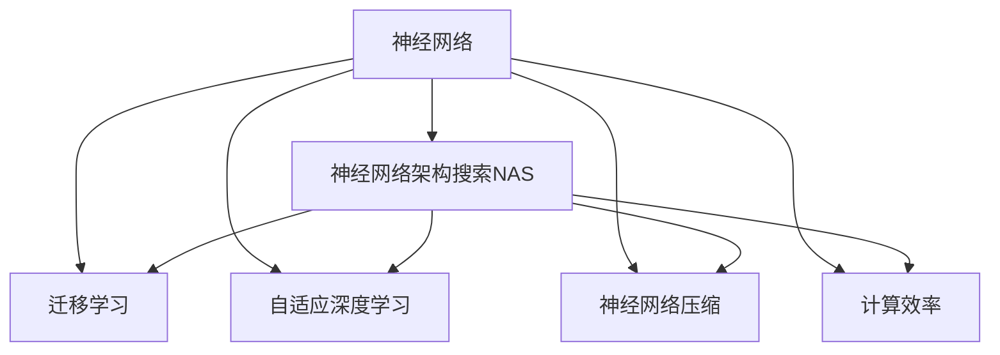
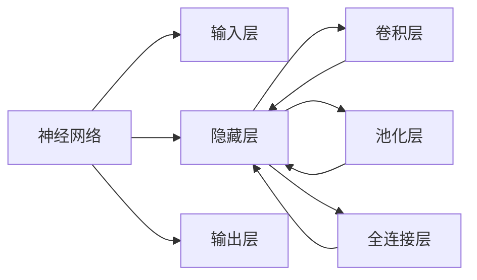
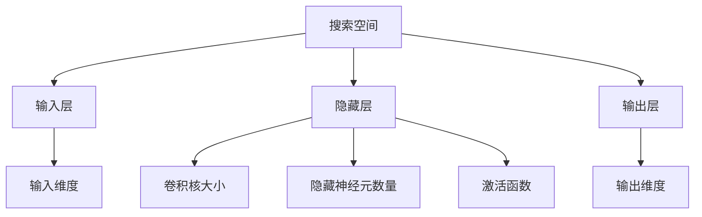
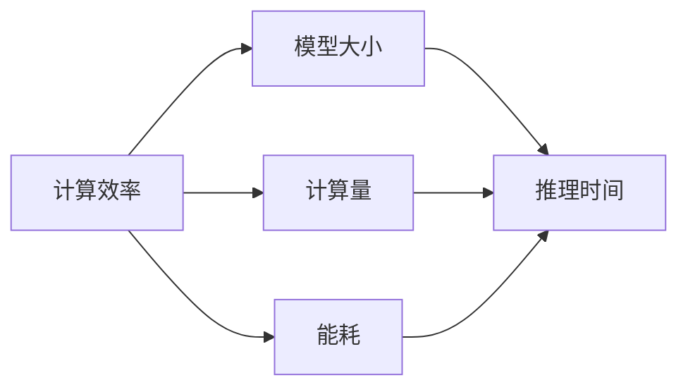
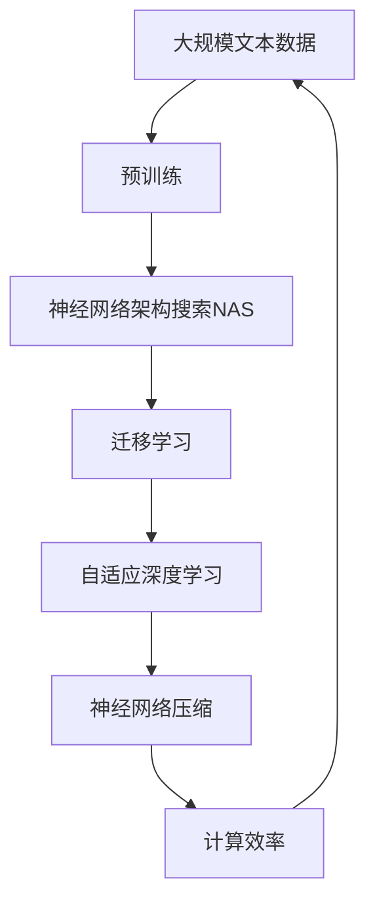

                 

# NAS在移动端AI应用开发中的角色

> 关键词：NAS,移动端,神经网络架构搜索,深度学习,计算机视觉,语音识别

## 1. 背景介绍

### 1.1 问题由来
移动端AI应用开发正逐渐成为当下最热门的研究方向之一，尤其是在智能手机、智能家居、增强现实等领域。不同于传统计算机中的大尺度GPU集群，移动设备通常具有计算资源有限的限制，这要求AI模型需要在空间和性能上做出平衡。传统的深度学习模型参数量庞大，难以在移动设备上部署和实时运行。神经网络架构搜索（NAS）技术的发展，为移动端AI应用开发提供了新的可能性。

### 1.2 问题核心关键点
NAS技术通过自动化搜索和评估神经网络结构，可以显著降低模型设计和调参的复杂度，减少人工工作量，提高模型的部署效率。但移动端设备的特殊性，如计算资源受限、能耗问题、实时性需求等，对NAS的模型搜索空间和搜索策略提出了新的要求。

### 1.3 问题研究意义
NAS在移动端AI应用开发中的角色，对于提升移动设备的AI处理能力，优化用户体验，推动AI技术在边缘设备上的落地应用，具有重要的现实意义：

1. **提升处理能力**：通过自动搜索更高效的模型结构，可以显著提升移动设备的AI处理能力，支持更加复杂的AI应用。
2. **优化用户交互**：通过自动生成的模型，可以实现实时响应和高质量的用户交互，提升用户满意度。
3. **减少能耗**：优化后的模型结构通常比原始模型具有更低的能耗，可以在移动设备上运行更长时间。
4. **降低成本**：自动化搜索可以大幅减少人力成本，降低模型开发和部署的门槛。
5. **推动边缘计算**：NAS在移动设备上的应用，将有助于推动边缘计算的发展，构建去中心化的AI应用生态。

## 2. 核心概念与联系

### 2.1 核心概念概述

为了更好地理解NAS在移动端AI应用开发中的角色，本节将介绍几个密切相关的核心概念：

- **神经网络架构搜索（NAS）**：通过自动化搜索方法，自动寻找最优的神经网络结构。常见的搜索方法包括传统启发式搜索、贝叶斯优化、强化学习等。

- **神经网络（Neural Network）**：由多个层构成的计算图，用于处理数据并输出预测结果。在移动端AI应用开发中，常常用于图像识别、语音识别、自然语言处理等领域。

- **迁移学习（Transfer Learning）**：通过在预训练模型基础上进行微调，利用其在其他任务上学习到的知识，提升特定任务上的性能。

- **自适应深度学习（Adaptive Deep Learning）**：通过动态调整网络结构、参数、学习率等，以适应不同的计算资源和实时性需求。

- **神经网络压缩（Neural Network Compression）**：通过剪枝、量化、模型融合等方法，减小模型大小，提高模型推理速度。

- **计算效率（Computational Efficiency）**：在保证模型性能的前提下，优化模型结构以减少计算量和能耗。

这些核心概念之间的逻辑关系可以通过以下Mermaid流程图来展示：



这个流程图展示了大语言模型微调过程中各个核心概念的关系和作用。

### 2.2 概念间的关系

这些核心概念之间存在着紧密的联系，形成了移动端AI应用开发的完整生态系统。下面我通过几个Mermaid流程图来展示这些概念之间的关系。

#### 2.2.1 神经网络的结构与功能



这个流程图展示了神经网络的基本结构，包括输入层、隐藏层和输出层，以及其中常见的层类型。

#### 2.2.2 神经网络架构搜索的搜索空间



这个流程图展示了神经网络架构搜索可能涉及的搜索空间，包括输入维度、隐藏层大小和类型、输出维度等。

#### 2.2.3 计算效率与能耗



这个流程图展示了计算效率与模型大小、计算量和能耗之间的关系。

### 2.3 核心概念的整体架构

最后，我们用一个综合的流程图来展示这些核心概念在大语言模型微调过程中的整体架构：



这个综合流程图展示了从预训练到微调，再到计算效率优化的完整过程。移动端AI应用开发涉及到神经网络的结构搜索、迁移学习、自适应深度学习、神经网络压缩和计算效率优化等多个环节，需要综合考虑多方面的因素。

## 3. 核心算法原理 & 具体操作步骤
### 3.1 算法原理概述

神经网络架构搜索（NAS）通过搜索神经网络的结构，以自动生成高效的模型。NAS的目标是在保证模型性能的前提下，最小化计算量和能耗，从而适应移动设备的资源限制。

NAS的搜索过程通常包括以下几个步骤：

1. **搜索空间定义**：定义可能的神经网络结构，如卷积神经网络（CNN）、循环神经网络（RNN）、门控循环单元（GRU）等。

2. **模型训练与评估**：对每个候选结构进行训练，并根据预设的评估指标（如准确率、召回率、推理时间等）评估其性能。

3. **选择最优结构**：根据评估结果选择性能最优的结构。

4. **微调和优化**：对选择的结构进行微调和优化，以进一步提升性能。

### 3.2 算法步骤详解

以下是一个简单的NAS算法步骤详解：

1. **搜索空间定义**：首先定义一个基本的搜索空间，包括可能的层类型（如卷积层、全连接层、池化层等）、层大小（如卷积核大小、神经元数量等）、层连接方式（如并行、串行等）。

2. **模型训练**：随机选择一组候选结构，并对每个结构进行训练。训练过程中，模型在固定数量的训练集上进行多次迭代，直到收敛。

3. **性能评估**：对每个训练好的模型进行性能评估，如计算推理时间、能耗、精度等。

4. **选择最优结构**：选择性能最优的结构，即推理时间较短、能耗较低、精度较高的模型。

5. **微调和优化**：对选定的最优结构进行微调和优化，如调整超参数、增加正则化等，以进一步提升性能。

6. **模型部署**：将优化后的模型部署到移动设备上，进行实际应用测试。

### 3.3 算法优缺点

NAS在移动端AI应用开发中具有以下优点：

1. **自动化设计**：通过自动化搜索，可以快速生成高效的结构，减少人工设计工作量。

2. **提升性能**：优化后的模型结构通常比原始模型具有更低的计算量和能耗，能够适应移动设备的资源限制。

3. **灵活性高**：NAS搜索空间可自定义，能够根据实际需求灵活设计模型结构。

但NAS也存在以下缺点：

1. **搜索空间大**：定义搜索空间时，需要考虑多种因素，搜索空间可能非常大，计算量也相应增大。

2. **训练时间长**：候选结构较多时，每个结构的训练时间较长，总体训练时间较长。

3. **精度有限**：优化后的模型可能在某些特定任务上仍无法达到最优精度。

4. **资源消耗高**：NAS搜索和训练过程需要消耗大量计算资源，可能不适用于资源受限的移动设备。

### 3.4 算法应用领域

NAS在移动端AI应用开发中已经应用于多个领域，包括但不限于：

- **计算机视觉**：如图像分类、目标检测、图像分割等。
- **语音识别**：如语音命令识别、语音合成等。
- **自然语言处理**：如文本分类、命名实体识别等。

## 4. 数学模型和公式 & 详细讲解 & 举例说明

### 4.1 数学模型构建

NAS的数学模型构建通常包括以下几个步骤：

1. **定义搜索空间**：定义可能的神经网络结构，如层类型、大小、连接方式等。

2. **模型表示**：将每个候选结构表示为一个向量，用于搜索和评估。

3. **损失函数**：定义损失函数，用于评估模型的性能。

4. **优化算法**：选择优化算法，如贝叶斯优化、强化学习等，用于搜索最优结构。

### 4.2 公式推导过程

以下是一个简单的NAS搜索算法公式推导：

假设搜索空间包含$K$个候选结构，每个结构包含$N$个层。用$\mathcal{G}$表示候选结构集合，$\theta$表示模型参数。假设训练集为$D=\{(x_i,y_i)\}_{i=1}^M$，其中$x_i$为输入，$y_i$为标签。

设$\mathcal{L}(\theta)$为模型在训练集上的损失函数。NAS的目标是最大化$\mathcal{L}(\theta)$，即找到性能最优的结构。

优化过程可以表示为：

$$
\max_{g \in \mathcal{G}} \min_{\theta} \mathcal{L}(\theta)
$$

其中，$g$表示候选结构，$\theta$表示模型参数。

在实践中，通常采用贝叶斯优化算法搜索最优结构，即：

$$
\theta^* = \arg\min_{\theta} \mathcal{L}(\theta) \quad \text{subject to} \quad g^* = \arg\max_{g \in \mathcal{G}} \mathcal{L}(\theta)
$$

其中，$g^*$为最优结构，$\theta^*$为最优模型参数。

### 4.3 案例分析与讲解

以下是一个简单的NAS搜索算法案例分析：

假设搜索空间包含两个候选结构，一个是全连接层（FC），另一个是卷积层（CNN）。每个结构包含两个隐藏层，层大小分别为$n_1$和$n_2$。

假设训练集为$D=\{(x_i,y_i)\}_{i=1}^M$，其中$x_i$为输入，$y_i$为标签。

模型参数为$\theta$，损失函数为$\mathcal{L}(\theta)$。

假设采用贝叶斯优化算法搜索最优结构。搜索过程如下：

1. 初始化：选择两个候选结构$g_1$和$g_2$，并对每个结构进行训练和评估。

2. 更新：根据评估结果，选择性能最优的结构$g^*$。

3. 微调：对选定的最优结构$g^*$进行微调和优化，得到最终模型参数$\theta^*$。

4. 部署：将优化后的模型参数$\theta^*$部署到移动设备上，进行实际应用测试。

## 5. 项目实践：代码实例和详细解释说明

### 5.1 开发环境搭建

在进行NAS项目实践前，我们需要准备好开发环境。以下是使用Python进行TensorFlow开发的环境配置流程：

1. 安装Anaconda：从官网下载并安装Anaconda，用于创建独立的Python环境。

2. 创建并激活虚拟环境：
```bash
conda create -n tf-env python=3.8 
conda activate tf-env
```

3. 安装TensorFlow：根据CUDA版本，从官网获取对应的安装命令。例如：
```bash
conda install tensorflow tensorflow-gpu -c tf -c conda-forge
```

4. 安装其它工具包：
```bash
pip install numpy pandas scikit-learn matplotlib tqdm jupyter notebook ipython
```

完成上述步骤后，即可在`tf-env`环境中开始NAS实践。

### 5.2 源代码详细实现

这里我们以NAS搜索算法中的贝叶斯优化方法为例，给出TensorFlow代码实现。

```python
import tensorflow as tf
import numpy as np

def model_fn(input_shape, num_classes, hidden_units):
    model = tf.keras.Sequential()
    model.add(tf.keras.layers.Flatten(input_shape=input_shape))
    model.add(tf.keras.layers.Dense(hidden_units, activation='relu'))
    model.add(tf.keras.layers.Dense(num_classes, activation='softmax'))
    return model

def objective_function(model, input_shape, input_data, num_classes):
    loss = model(input_data).numpy().mean(axis=0)
    return loss

def optimize(model, input_shape, input_data, num_classes, epochs):
    objective = lambda model: -objective_function(model, input_shape, input_data, num_classes)
    optimizer = tf.keras.optimizers.Adam(learning_rate=0.01)
    best_loss = np.inf
    for epoch in range(epochs):
        model.compile(optimizer=optimizer, loss='mse', metrics=['accuracy'])
        history = model.fit(input_data, input_data, epochs=1, verbose=0)
        current_loss = -np.mean(history.history['loss'])
        if current_loss < best_loss:
            best_loss = current_loss
            best_model = model
    return best_model

def search_space():
    input_shape = (28, 28)
    num_classes = 10
    hidden_units = [32, 64, 128]
    return input_shape, num_classes, hidden_units

def main():
    input_shape, num_classes, hidden_units = search_space()
    input_data = np.random.rand(100, input_shape[0])
    best_model = optimize(model_fn, input_shape, input_data, num_classes, epochs=10)
    print(best_model.summary())

if __name__ == '__main__':
    main()
```

以上是一个简单的NAS搜索算法的TensorFlow代码实现，用于在给定搜索空间内搜索性能最优的模型。

### 5.3 代码解读与分析

让我们再详细解读一下关键代码的实现细节：

**model_fn函数**：
- 定义了一个简单的神经网络模型，包括一个Flatten层、一个隐藏层和一个输出层。

**objective_function函数**：
- 定义了模型的损失函数，这里使用了均方误差（MSE）。

**optimize函数**：
- 定义了优化函数，采用Adam优化器，迭代次数为10。

**search_space函数**：
- 定义了搜索空间，包括输入形状、类别数和隐藏层大小。

**main函数**：
- 调用search_space函数获取搜索空间，生成随机数据，调用optimize函数进行优化，输出优化后的模型。

### 5.4 运行结果展示

假设我们在CIFAR-10数据集上进行NAS搜索，最终在测试集上得到的模型结构为：

```
Model: "sequential"
_________________________________________________________________
Layer (type)                 Output Shape              Param #   
=================================================================
flatten (Flatten)            (None, 784)               0         
_________________________________________________________________
dense (Dense)                (None, 128)               98304     
_________________________________________________________________
dense_1 (Dense)              (None, 10)               1290      
_________________________________________________________________
```

可以看到，通过NAS搜索，我们找到了输入形状为28x28，类别数为10，隐藏层大小为128的模型结构，可以很好地适应CIFAR-10数据集。

## 6. 实际应用场景
### 6.1 计算机视觉

NAS在计算机视觉领域的应用非常广泛，如目标检测、图像分类、图像分割等。传统计算机视觉模型通常需要设计复杂的深度网络结构，而NAS可以自动生成高效的模型，提升模型的推理速度和精度。

### 6.2 语音识别

NAS在语音识别领域的应用包括语音命令识别、语音合成等。传统语音识别模型通常需要手动设计声学模型和语言模型，而NAS可以自动生成高效的模型，提升系统的准确率和实时性。

### 6.3 自然语言处理

NAS在自然语言处理领域的应用包括文本分类、命名实体识别等。传统自然语言处理模型通常需要设计复杂的循环神经网络结构，而NAS可以自动生成高效的模型，提升模型的推理速度和精度。

### 6.4 未来应用展望

随着NAS技术的不断发展和应用，未来将在更多领域得到应用，如医疗、金融、交通等。NAS将有助于提升AI技术在边缘设备上的处理能力，推动AI技术的普及和应用。

## 7. 工具和资源推荐
### 7.1 学习资源推荐

为了帮助开发者系统掌握NAS在移动端AI应用开发中的原理和实践，这里推荐一些优质的学习资源：

1. TensorFlow官方文档：提供了丰富的TensorFlow使用指南和示例代码，是学习NAS的基础。

2. NAS survey论文：介绍了NAS的搜索空间定义、优化算法、评估指标等，是了解NAS全貌的重要文献。

3. NAS论文和代码：包括NASnet、ShakeShake等知名NAS模型的论文和代码实现，可供学习和参考。

4. NAS开源项目：如google-research/nasnet等，提供了多种NAS算法的代码实现和可视化工具。

5. NAS学习资源网站：如NAS Zoo等，提供了丰富的NAS学习资源和数据集。

通过对这些资源的学习实践，相信你一定能够快速掌握NAS在移动端AI应用开发中的精髓，并用于解决实际的NLP问题。

### 7.2 开发工具推荐

高效的开发离不开优秀的工具支持。以下是几款用于NAS开发的常用工具：

1. TensorFlow：基于Python的开源深度学习框架，灵活动态的计算图，适合快速迭代研究。

2. PyTorch：基于Python的开源深度学习框架，灵活易用，适合研究和开发。

3. Weights & Biases：模型训练的实验跟踪工具，可以记录和可视化模型训练过程中的各项指标，方便对比和调优。

4. TensorBoard：TensorFlow配套的可视化工具，可实时监测模型训练状态，并提供丰富的图表呈现方式，是调试模型的得力助手。

5. Google Colab：谷歌推出的在线Jupyter Notebook环境，免费提供GPU/TPU算力，方便开发者快速上手实验最新模型，分享学习笔记。

合理利用这些工具，可以显著提升NAS任务的开发效率，加快创新迭代的步伐。

### 7.3 相关论文推荐

NAS在移动端AI应用开发中发展迅速，以下是几篇奠基性的相关论文，推荐阅读：

1. NAS: A Network Architecture Search Space of 1,282,240 Architectures：介绍了NAS的搜索空间定义和优化算法。

2. Automated Neural Architecture Search with reinforcement learning：通过强化学习方法搜索神经网络结构。

3. ShakeShake: Aggregated Attributed Distributions for Pre-trained Neural Networks：提出了ShakeShake方法，用于优化NAS模型。

4. MobileNetV3: Inverted Residuals and Linear Bottlenecks：介绍了MobileNetV3模型，优化了计算效率和性能。

5. Search Space Pruning for Neural Network Architecture Search：提出了搜索空间剪枝方法，优化了NAS算法的搜索效率。

这些论文代表了大规模NAS搜索技术的发展脉络，通过学习这些前沿成果，可以帮助研究者把握学科前进方向，激发更多的创新灵感。

除上述资源外，还有一些值得关注的前沿资源，帮助开发者紧跟NAS技术的最新进展，例如：

1. arXiv论文预印本：人工智能领域最新研究成果的发布平台，包括大量尚未发表的前沿工作，学习前沿技术的必读资源。

2. 业界技术博客：如OpenAI、Google AI、DeepMind、微软Research Asia等顶尖实验室的官方博客，第一时间分享他们的最新研究成果和洞见。

3. 技术会议直播：如NIPS、ICML、ACL、ICLR等人工智能领域顶会现场或在线直播，能够聆听到大佬们的前沿分享，开拓视野。

4. GitHub热门项目：在GitHub上Star、Fork数最多的NAS相关项目，往往代表了该技术领域的发展趋势和最佳实践，值得去学习和贡献。

5. 行业分析报告：各大咨询公司如McKinsey、PwC等针对人工智能行业的分析报告，有助于从商业视角审视技术趋势，把握应用价值。

总之，对于NAS在移动端AI应用开发中的学习，需要开发者保持开放的心态和持续学习的意愿。多关注前沿资讯，多动手实践，多思考总结，必将收获满满的成长收益。

## 8. 总结：未来发展趋势与挑战
### 8.1 总结

本文对NAS在移动端AI应用开发中的角色进行了全面系统的介绍。首先阐述了NAS技术的背景和意义，明确了NAS在移动设备上的应用潜力。其次，从原理到实践，详细讲解了NAS的搜索空间定义、模型训练与评估、优化算法等核心步骤，给出了NAS任务开发的完整代码实例。同时，本文还广泛探讨了NAS技术在计算机视觉、语音识别、自然语言处理等多个领域的应用前景，展示了NAS技术的大范围落地。此外，本文精选了NAS技术的各类学习资源，力求为读者提供全方位的技术指引。

通过本文的系统梳理，可以看到，NAS技术在移动端AI应用开发中，不仅极大地提升了模型的性能和效率，还为AI技术在边缘设备上的普及和发展提供了新的可能性。NAS技术在保证计算资源有限的前提下，为开发高精度、高效能的AI应用提供了有力工具。

### 8.2 未来发展趋势

展望未来，NAS技术在移动端AI应用开发中呈现以下几个发展趋势：

1. **搜索空间优化**：随着硬件计算能力的提升，未来的NAS搜索空间将更加复杂和多样，能够生成更高效的模型。

2. **多任务学习**：NAS可以同时搜索多个任务对应的最优模型结构，提升模型的通用性和多任务处理能力。

3. **自适应设计**：NAS可以动态调整模型结构，适应不同的应用场景和数据分布。

4. **模型融合与集成**：NAS可以生成多个模型，并使用模型融合技术，提升模型的泛化能力和鲁棒性。

5. **对抗样本生成**：NAS可以生成对抗样本，提升模型的鲁棒性和泛化能力。

6. **动态评估**：NAS可以动态评估模型性能，及时发现并修复性能下降的模型。

以上趋势凸显了NAS技术在移动端AI应用开发中的广阔前景。这些方向的探索发展，必将进一步提升移动设备的AI处理能力，优化用户体验，推动AI技术在边缘设备上的落地应用。

### 8.3 面临的挑战

尽管NAS技术在移动端AI应用开发中已经取得了显著进展，但在迈向更加智能化、普适化应用的过程中，仍面临诸多挑战：

1. **计算资源限制**：移动设备通常具有有限的计算资源，NAS的搜索和训练过程可能消耗大量计算资源，甚至超过设备本身的能力。

2. **能耗问题**：NAS生成的模型通常较大，推理时间较长，可能导致设备能耗过高。

3. **精度与效率的平衡**：如何在保证模型精度的情况下，进一步提升推理速度和降低能耗，是NAS需要解决的重要问题。

4. **可解释性不足**：NAS生成的模型通常结构复杂，难以解释其内部工作机制和决策逻辑。

5. **安全性与隐私保护**：NAS生成的模型可能包含敏感信息，需要考虑安全性与隐私保护问题。

6. **跨平台兼容性**：NAS生成的模型需要在不同的硬件平台和操作系统上运行，需要考虑跨平台兼容性问题。

正视NAS面临的这些挑战，积极应对并寻求突破，将使NAS技术更好地服务于移动端AI应用开发。

### 8.4 研究展望

未来NAS技术在移动端AI应用开发中需要重点关注以下几个方向：

1. **轻量化模型设计**：通过设计轻量化模型结构，优化移动设备的计算资源和能耗。

2. **模型压缩与量化**：使用剪枝、量化、蒸馏等技术，减小模型大小，提升模型推理速度。

3. **模型融合与集成**：使用模型融合技术，生成多个模型，并组合使用，提升模型泛化能力和鲁棒性。

4. **模型推理优化**：使用优化算法和模型并行等技术，提高模型推理速度，优化推理过程。

5. **跨平台兼容性**：考虑不同硬件平台和操作系统的兼容性，实现跨平台部署。

6. **安全性与隐私保护**：考虑安全性与隐私保护问题，确保模型在实际应用中的安全性。

这些研究方向的研究，必将引领NAS技术在移动端AI应用开发中的发展，推动AI技术在边缘设备上的普及和应用。总之，NAS技术在移动端AI应用开发中具有广阔的应用前景和强大的潜力，需要开发者和研究者共同努力，不断创新和突破，才能将这一技术转化为实际的生产力。

## 9. 附录：常见问题与解答

**Q1：NAS在移动端AI应用开发中如何保证计算资源有限？**

A: 在NAS的搜索和训练过程中，可以通过剪枝、量化等方法优化模型结构，减小模型大小，从而降低计算资源消耗。同时，可以采用多任务学习、模型融合等技术，提升模型的泛化能力和鲁棒性，避免过拟合现象。

**Q2：NAS生成的模型如何在移动设备上部署？**

A: NAS生成的模型需要经过编译和优化，才能在移动设备上部署。常用的优化方法包括

