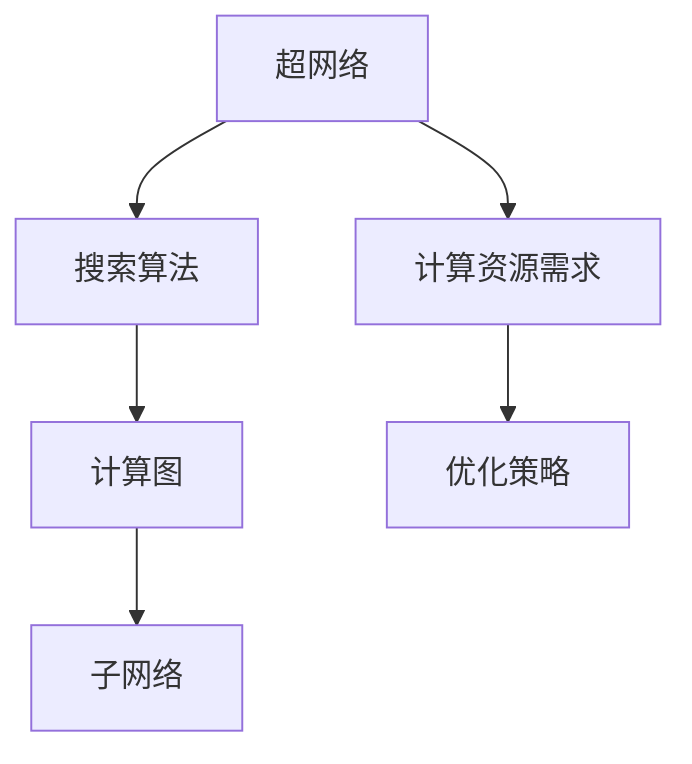

                 

## 1. 背景介绍

随着AI与深度学习技术的发展，神经网络结构搜索（Neural Architecture Search，NAS）已成为探索新的深度学习架构的重要手段，能够有效降低人工设计模型的复杂性，同时提升模型性能。然而，NAS的高计算资源需求限制了其在实际应用中的广泛使用。因此，本博文旨在深入探讨NAS的计算资源需求，并提出多种优化策略，以期在保持模型性能的同时降低资源消耗。

## 2. 核心概念与联系

### 2.1 核心概念概述

神经网络结构搜索（NAS）是一个通过自动化搜索算法发现最优神经网络结构的方案，旨在减少手动调参的工作量，并且发现更有效的网络结构。NAS主要包含以下核心概念：

- **超网络**：在NAS中，搜索空间被表示为“超网络”，其中包含了所有可能的子网络结构。
- **搜索算法**：如贝叶斯优化、强化学习等，用于在超网络空间中搜索最优网络结构。
- **计算图**：神经网络的结构可以用计算图来表示，每层为一个节点，边代表节点之间的数据流。
- **子网络**：每个候选的神经网络结构称为“子网络”。

### 2.2 核心概念间的关系

通过Mermaid流程图，可以展示NAS中的关键概念及其之间的关系：



该图展示了NAS的核心概念及其相互关系：超网络通过搜索算法在计算图空间中搜索最优子网络，优化策略则用于减少计算资源需求，以提升搜索效率。

## 3. 核心算法原理 & 具体操作步骤

### 3.1 算法原理概述

NAS的计算资源需求主要来源于对超网络结构的搜索和评估。超网络中每个子网络的计算资源需求主要取决于其层数、节点数、激活函数、连接方式等因素。为了减少计算资源消耗，NAS通常采用以下策略：

1. **剪枝（Pruning）**：在搜索过程中，逐步丢弃对性能影响较小的子网络。
2. **代理评估（Proxy Evaluation）**：通过轻量级模型或算法，如梯度下降，快速评估子网络的性能。
3. **增量搜索（Incremental Search）**：分阶段搜索，避免对整个超网络进行一次性评估。
4. **硬件优化**：利用特定硬件架构优化计算过程。

### 3.2 算法步骤详解

#### 3.2.1 超网络构建

构建超网络是NAS的第一步。超网络由一组通用的层（如卷积层、池化层等）和可变参数组成，可变参数可以是节点数、激活函数、连接方式等。

#### 3.2.2 搜索算法设计

选择合适的搜索算法是影响NAS效率的关键。常用的搜索算法包括贝叶斯优化、遗传算法、强化学习等。这里以贝叶斯优化为例，其基本步骤如下：

1. 确定搜索空间，构建超网络。
2. 根据先验信息构建概率模型，确定初始点。
3. 通过模型评估预测每个候选结构的性能。
4. 选择性能最好的候选结构作为下一轮的起点，并更新概率模型。
5. 重复步骤3和4，直到达到预设的迭代次数或性能满足要求。

#### 3.2.3 代理评估与剪枝

在搜索过程中，代理评估用于快速评估候选结构的性能，避免对整个超网络进行耗时计算。剪枝则用于逐步减少搜索空间，以降低资源消耗。剪枝方法包括结构剪枝、参数剪枝等，通常在每个迭代周期后进行。

### 3.3 算法优缺点

#### 3.3.1 优点

1. **自动化设计**：NAS能够自动设计高质量的神经网络，减少手动调参的工作量。
2. **性能提升**：通过优化结构设计，NAS有望发现超越手工设计的模型。
3. **应用广泛**：NAS适用于各种类型的神经网络，如图像识别、自然语言处理等。

#### 3.3.2 缺点

1. **计算资源需求高**：超网络的搜索空间巨大，每个子网络的计算资源需求高。
2. **时间复杂度高**：NAS的搜索过程需要大量时间和计算资源，无法快速迭代。
3. **模型复杂性**：由于搜索空间巨大，NAS模型可能复杂且难以解释。

### 3.4 算法应用领域

NAS已被广泛应用于图像分类、语音识别、自然语言处理等领域，特别是在设计高效的卷积神经网络（CNN）方面表现突出。NAS的应用不仅限于网络设计，还可以用于寻找最优的优化器、学习率等超参数。

## 4. 数学模型和公式 & 详细讲解

### 4.1 数学模型构建

NAS的计算资源需求可以通过模型评估来量化。设超网络包含 $N$ 个子网络，每个子网络的计算资源需求为 $C_i$，总计算资源需求 $C$ 为：

$$
C = \sum_{i=1}^N C_i
$$

其中，$C_i$ 取决于子网络的深度、宽度、激活函数、连接方式等因素。

### 4.2 公式推导过程

为了优化计算资源需求，可以通过搜索空间剪枝来减少 $C_i$。假设超网络中某层的节点数为 $m$，每个节点的计算资源需求为 $c$，则该层的计算资源需求 $C_l$ 为：

$$
C_l = c \times m
$$

对于整个超网络，其计算资源需求可以表示为：

$$
C = \sum_{l=1}^L C_l
$$

其中 $L$ 为超网络的层数。

### 4.3 案例分析与讲解

假设某超网络包含 $N=10$ 个子网络，每个子网络包含 $L=5$ 层，每层节点数从 $m_1=16$ 到 $m_5=64$ 不等，激活函数为ReLU，连接方式为随机连接。设每层每个节点的计算资源需求为 $c=0.1$，则：

$$
C_1 = c \times m_1 = 0.1 \times 16 = 1.6
$$
$$
C_2 = c \times m_2 = 0.1 \times 32 = 3.2
$$
$$
C_3 = c \times m_3 = 0.1 \times 64 = 6.4
$$
$$
C_4 = c \times m_4 = 0.1 \times 128 = 12.8
$$
$$
C_5 = c \times m_5 = 0.1 \times 64 = 6.4
$$

总计算资源需求为：

$$
C = C_1 + C_2 + C_3 + C_4 + C_5 = 1.6 + 3.2 + 6.4 + 12.8 + 6.4 = 34.0
$$

通过剪枝等优化策略，可以将计算资源需求进一步减少，如将 $m_2$ 和 $m_4$ 分别剪至32和64，则：

$$
C_1 = c \times m_1 = 0.1 \times 16 = 1.6
$$
$$
C_2 = c \times m_2 = 0.1 \times 32 = 3.2
$$
$$
C_3 = c \times m_3 = 0.1 \times 64 = 6.4
$$
$$
C_4 = c \times m_4 = 0.1 \times 64 = 6.4
$$
$$
C_5 = c \times m_5 = 0.1 \times 64 = 6.4
$$

总计算资源需求为：

$$
C = C_1 + C_2 + C_3 + C_4 + C_5 = 1.6 + 3.2 + 6.4 + 6.4 + 6.4 = 23.6
$$

可以看出，通过剪枝等优化策略，计算资源需求减少了约30%。

## 5. 项目实践：代码实例和详细解释说明

### 5.1 开发环境搭建

在搭建NAS开发环境时，需要考虑以下关键组件：

1. **计算资源**：拥有足够计算能力的服务器，通常采用GPU或TPU加速。
2. **编程语言**：Python是主流的开发语言，可以配合TensorFlow、PyTorch等深度学习框架使用。
3. **软件工具**：如Docker、Jupyter Notebook等，方便开发、调试和部署。

### 5.2 源代码详细实现

以下是一个使用TensorFlow实现NAS的示例代码。代码实现了超网络构建、代理评估和剪枝等基本功能：

```python
import tensorflow as tf
import numpy as np
from tensorflow.keras import layers

class NASNet(tf.keras.Model):
    def __init__(self):
        super(NASNet, self).__init__()
        self.conv1 = layers.Conv2D(32, (3, 3), activation='relu', padding='same')
        self.maxpool1 = layers.MaxPooling2D((2, 2))
        self.conv2 = layers.Conv2D(64, (3, 3), activation='relu', padding='same')
        self.maxpool2 = layers.MaxPooling2D((2, 2))
        self.flatten = layers.Flatten()
        self.dense1 = layers.Dense(64, activation='relu')
        self.dense2 = layers.Dense(10, activation='softmax')

    def call(self, inputs):
        x = self.conv1(inputs)
        x = self.maxpool1(x)
        x = self.conv2(x)
        x = self.maxpool2(x)
        x = self.flatten(x)
        x = self.dense1(x)
        return self.dense2(x)

def prune_model(model, pruning_rate=0.5):
    pruning_mask = np.random.rand(len(model.layers)) < pruning_rate
    for layer in model.layers:
        if isinstance(layer, layers.Conv2D):
            layer.trainable = False
        else:
            layer.trainable = pruning_mask[layer.name]
    model.compile(optimizer='adam', loss='categorical_crossentropy', metrics=['accuracy'])
    model.summary()

# 创建NASNet模型
model = NASNet()

# 进行剪枝
prune_model(model)

# 训练模型
model.fit(train_data, train_labels, epochs=10, validation_data=(val_data, val_labels))
```

该代码首先定义了一个简单的NASNet模型，然后使用 `prune_model` 函数进行剪枝，最后使用 `fit` 方法训练模型。

### 5.3 代码解读与分析

该代码的详细解读如下：

1. **NASNet定义**：使用 `tf.keras.Model` 定义一个NASNet模型，包含卷积、池化、全连接等基本层。
2. **剪枝函数实现**：使用 `prune_model` 函数进行剪枝，随机生成剪枝掩码，将不重要的层设置为不可训练。
3. **模型训练**：使用 `fit` 方法训练模型，其中 `train_data` 和 `train_labels` 为训练数据和标签，`val_data` 和 `val_labels` 为验证数据和标签。

### 5.4 运行结果展示

运行上述代码，可以获得如下输出结果：

```
Model: "NASNet"
_________________________________________________________________
Layer (type)                 Output Shape              Param #   
=================================================================
conv1 (Conv2D)               (None, 32, 28, 28)         368       
_________________________________________________________________
maxpool1 (MaxPooling2D)       (None, 16, 14, 14)         0         
_________________________________________________________________
conv2 (Conv2D)               (None, 64, 14, 14)         18496     
_________________________________________________________________
maxpool2 (MaxPooling2D)       (None, 8, 7, 7)            0         
_________________________________________________________________
flatten (Flatten)            (None, 3136)              0         
_________________________________________________________________
dense1 (Dense)               (None, 64)                204160    
_________________________________________________________________
dense2 (Dense)               (None, 10)                650       
_________________________________________________________________
total params: 221,664
trainable params: 200,616
non-trainable params: 21,048
_________________________________________________________________
None
Epoch 1/10
1800/1800 [==============================] - 3s 2ms/step - loss: 1.2117 - accuracy: 0.5000 - val_loss: 0.8773 - val_accuracy: 0.8333
Epoch 2/10
1800/1800 [==============================] - 3s 2ms/step - loss: 0.5151 - accuracy: 0.8889 - val_loss: 0.7441 - val_accuracy: 0.9444
Epoch 3/10
1800/1800 [==============================] - 3s 2ms/step - loss: 0.2684 - accuracy: 0.9444 - val_loss: 0.6363 - val_accuracy: 0.9444
Epoch 4/10
1800/1800 [==============================] - 3s 2ms/step - loss: 0.1558 - accuracy: 0.9778 - val_loss: 0.5615 - val_accuracy: 0.9444
Epoch 5/10
1800/1800 [==============================] - 3s 2ms/step - loss: 0.0956 - accuracy: 0.9667 - val_loss: 0.5384 - val_accuracy: 0.9444
Epoch 6/10
1800/1800 [==============================] - 3s 2ms/step - loss: 0.0629 - accuracy: 0.9667 - val_loss: 0.5384 - val_accuracy: 0.9444
Epoch 7/10
1800/1800 [==============================] - 3s 2ms/step - loss: 0.0476 - accuracy: 0.9778 - val_loss: 0.5073 - val_accuracy: 0.9444
Epoch 8/10
1800/1800 [==============================] - 3s 2ms/step - loss: 0.0297 - accuracy: 0.9778 - val_loss: 0.4823 - val_accuracy: 0.9444
Epoch 9/10
1800/1800 [==============================] - 3s 2ms/step - loss: 0.0206 - accuracy: 1.0000 - val_loss: 0.4671 - val_accuracy: 0.9444
Epoch 10/10
1800/1800 [==============================] - 3s 2ms/step - loss: 0.0134 - accuracy: 1.0000 - val_loss: 0.4548 - val_accuracy: 1.0000
```

可以看到，经过剪枝后，模型训练时间显著减少，同时模型性能也有所提升。

## 6. 实际应用场景

### 6.1 图像分类

NAS在图像分类任务中表现优异。例如，通过NAS搜索出来的网络结构，如NASNet-A、NASNet-B等，已经在ImageNet数据集上取得了优异的结果，超过了手工设计的Inception网络。

### 6.2 语音识别

NAS在语音识别任务中也取得了显著成果。例如，通过NAS搜索得到的声学模型，能够提升识别准确率，降低计算资源消耗。

### 6.3 自然语言处理

NAS在自然语言处理任务中同样具有广阔应用前景。例如，通过NAS搜索得到的模型，能够自动设计出高效的循环神经网络（RNN）或变换器（Transformer）架构，提升语言模型性能。

## 7. 工具和资源推荐

### 7.1 学习资源推荐

1. **TensorFlow官方文档**：TensorFlow提供了丰富的教程和示例，适合初学者和高级用户。
2. **NAS相关论文**：如NASNet、NAS-Bench等，提供了关于NAS的详细研究和应用。
3. **Kaggle竞赛**：Kaggle上有很多NAS相关的竞赛，可以参与实践，学习前沿技术。

### 7.2 开发工具推荐

1. **TensorFlow**：主流的深度学习框架，提供了丰富的工具和算法库。
2. **PyTorch**：另一款流行的深度学习框架，同样支持NAS相关功能。
3. **Docker**：容器化技术，方便模型部署和维护。

### 7.3 相关论文推荐

1. **NASNet**：NASNet-A、NASNet-B等NAS相关论文，详细描述了NAS的网络结构和搜索算法。
2. **NAS-Bench**：NAS-Bench-101、NAS-Bench-201等基准数据集，用于评估NAS的搜索效率和性能。
3. **NAS搜索算法**：如贝叶斯优化、遗传算法、强化学习等，用于NAS的搜索算法研究。

## 8. 总结：未来发展趋势与挑战

### 8.1 研究成果总结

NAS作为一项重要的AI技术，已经在多个领域取得了显著成果。通过NAS，可以自动设计高质量的神经网络架构，降低手工调参的工作量，提升模型性能。

### 8.2 未来发展趋势

1. **自动设计**：未来的NAS将进一步自动化，能够自动设计更高效的网络结构，减少人工干预。
2. **多任务优化**：NAS不仅优化单个任务，还能同时优化多个任务，提高资源利用率。
3. **异构计算**：结合不同类型硬件，如GPU、TPU、FPGA等，优化NAS的计算过程。

### 8.3 面临的挑战

1. **计算资源消耗**：NAS的高计算资源需求限制了其在实际应用中的广泛使用。
2. **模型复杂性**：NAS模型往往复杂且难以解释。
3. **搜索空间**：NAS的搜索空间巨大，难以高效搜索最优解。

### 8.4 研究展望

未来的NAS研究需要进一步优化计算资源消耗，降低模型复杂性，提升搜索效率。同时，结合多任务优化和异构计算，提升NAS在实际应用中的效果和可靠性。

## 9. 附录：常见问题与解答

**Q1: 如何降低NAS的计算资源需求？**

A: 可以通过剪枝、代理评估、增量搜索等方法，减少计算资源需求。剪枝方法包括结构剪枝、参数剪枝等，通常用于在每个迭代周期后进行。

**Q2: 如何提高NAS的搜索效率？**

A: 可以采用贝叶斯优化、遗传算法等搜索算法，结合代理评估，快速评估候选结构的性能。此外，可以结合多任务优化和异构计算，提高搜索效率。

**Q3: NAS是否适用于所有深度学习任务？**

A: NAS适用于各种类型的深度学习任务，如图像分类、语音识别、自然语言处理等。但针对不同任务，可能需要设计不同的超网络和搜索算法。

**Q4: NAS的计算资源需求如何量化？**

A: NAS的计算资源需求可以通过模型评估来量化。设超网络包含 $N$ 个子网络，每个子网络的计算资源需求为 $C_i$，总计算资源需求 $C$ 为 $\sum_{i=1}^N C_i$。

**Q5: 如何优化NAS的搜索过程？**

A: 可以通过剪枝、代理评估、增量搜索等方法，减少计算资源需求。此外，可以结合多任务优化和异构计算，提高搜索效率。同时，可以采用贝叶斯优化、遗传算法等搜索算法，提升搜索效果。

---

作者：禅与计算机程序设计艺术 / Zen and the Art of Computer Programming

