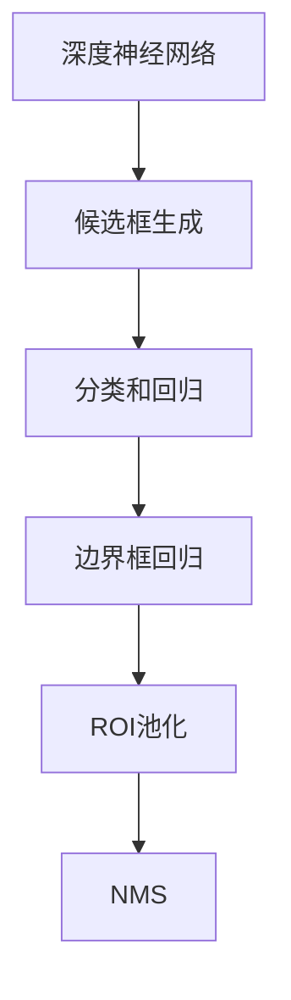

                 

# Object Detection 原理与代码实战案例讲解

> 关键词：目标检测, 深度学习, YOLO, SSD, Faster R-CNN, 核心概念与联系

## 1. 背景介绍

### 1.1 问题由来
目标检测（Object Detection）是计算机视觉（Computer Vision, CV）领域的一个重要研究方向。它旨在从图像或视频序列中，准确识别出物体的位置和类别，是图像理解和分析的基础任务之一。传统的目标检测方法如HOG+SVM、R-CNN系列等存在计算复杂度高、实时性差等问题。深度学习尤其是卷积神经网络（Convolutional Neural Network, CNN）的兴起，推动了目标检测技术的革命性突破。

近年来，基于深度学习的目标检测方法层出不穷，如YOLO、SSD、Faster R-CNN等，它们在精度、速度、可扩展性等方面都有显著提升。这些方法不仅被广泛应用于自动驾驶、医疗影像分析、智能监控等领域，还在工业界落地实现，成为视觉识别技术的基石。

### 1.2 问题核心关键点
目标检测的核心在于：1）高效地生成候选物体候选框；2）精确判断候选框中是否包含物体及其类别；3）将物体位置和类别等信息从图像中提取出来。目标检测方法主要分为两类：基于区域提取方法（Region Proposal-based Detection）和基于端到端方法（End-to-End Detection）。

基于区域提取的方法先通过一些算法（如选择性搜索、滑动窗口等）生成候选框，再对每个候选框进行分类和回归，如R-CNN、Fast R-CNN、Faster R-CNN等。而基于端到端的方法则直接将候选框生成、物体分类和位置回归整合成一个网络，如YOLO、SSD等。

## 2. 核心概念与联系

### 2.1 核心概念概述

目标检测涉及多个关键概念，包括：

- **深度神经网络**：用于生成候选框、分类和回归的深度学习模型。
- **候选框生成**：从图像中生成候选物体位置的区域。
- **分类和回归**：对候选框中是否包含物体及物体类别进行预测，并回归物体位置信息。
- **边界框回归**：预测物体在图像中的精确位置。
- **ROI池化**：将候选区域压缩成固定大小的特征向量，方便分类和回归。
- **NMS（Non-Maximum Suppression）**：去除重叠的候选框，保留置信度最高的框。

### 2.2 概念间的关系

这些核心概念之间的关系可以通过以下Mermaid流程图来展示：



这个流程图展示了目标检测的基本流程：首先通过深度神经网络生成候选框，然后对每个候选框进行分类和回归，得到物体类别和位置信息，接着进行边界框回归，最后通过ROI池化将候选区域压缩成固定大小的特征向量，并通过NMS去除重叠框。

## 3. 核心算法原理 & 具体操作步骤

### 3.1 算法原理概述
目标检测的核心算法原理可以归纳为以下几个步骤：

1. **候选框生成**：使用一些算法（如选择性搜索、滑动窗口等）从图像中生成候选框。
2. **候选框分类和回归**：对每个候选框进行分类和回归，判断其中是否包含物体及物体类别，并回归物体位置。
3. **边界框回归**：对每个包含物体的候选框进行更精确的位置回归。
4. **NMS处理**：通过NMS去除重叠的候选框，保留置信度最高的框。

### 3.2 算法步骤详解

#### 3.2.1 候选框生成
候选框生成是目标检测中非常重要的一步，其算法选择和实现方式对检测效果有显著影响。

**选择性搜索（Selective Search）**：通过自顶向下和自底向上的策略，从图像中生成候选区域。自顶向下策略先构建图像的层次结构，然后自底向上地对区域进行合并，直到生成完整的图像层次。自底向上策略则从每个像素点开始，通过连接相邻像素点形成小区域，并不断合并这些区域直到生成完整的图像层次。

**滑动窗口（Sliding Window）**：通过在图像上滑动一个固定大小的窗口，对每个窗口进行分类和回归，生成候选框。这种方法实现简单，但计算复杂度较高，且对窗口大小的选择比较敏感。

**特征图金字塔（Feature Pyramid Network, FPN）**：将图像分成不同尺度和级别的特征图，对每个特征图进行候选框生成，可以更全面地覆盖图像中不同大小的物体。

#### 3.2.2 候选框分类和回归
对候选框进行分类和回归是目标检测的另一个核心步骤。经典的算法如R-CNN系列通过生成候选框，对每个候选框进行分类和回归。

**R-CNN系列算法**：通过生成候选框，对每个候选框进行分类和回归。首先对候选框进行RoI池化，将候选框中的特征提取出来，然后通过全连接层进行分类和回归，得到候选框中是否包含物体及物体类别和位置信息。

**YOLO（You Only Look Once）**：将候选框生成、分类和回归整合成一个网络，直接输出物体类别和位置信息。YOLO通过划分特征图为多个网格，每个网格预测若干个候选框，每个候选框预测物体的类别和位置信息。

**SSD（Single Shot MultiBox Detector）**：同样将候选框生成、分类和回归整合成一个网络，但相比于YOLO，SSD在每个特征图上预测不同大小和长宽比的候选框，并使用不同卷积核来预测不同尺度的候选框。

#### 3.2.3 边界框回归
边界框回归是对每个候选框进行更精确的位置回归，以提高检测的精度。

**YOLO**：对每个候选框进行回归，预测其在原始图像中的位置，并调整候选框的大小和形状。

**SSD**：对不同特征图上预测的候选框进行回归，使用不同尺度的卷积核来预测不同大小的候选框，并进行更精确的位置调整。

#### 3.2.4 NMS处理
NMS（Non-Maximum Suppression）是去除重叠候选框的重要步骤，保留置信度最高的框。

**NMS算法**：对所有候选框按置信度排序，取置信度最高的框作为最终检测结果，然后去除其他与其IoU（Intersection over Union）大于一定阈值的框，保留剩余的框。

### 3.3 算法优缺点

**YOLO（You Only Look Once）算法**：

优点：
- 端到端训练，速度快。
- 单个特征图处理，参数少。
- 可扩展性好，适用于多尺度、多物体的检测。

缺点：
- 精度相对较低。
- 难以处理小物体。
- 对物体尺度变化敏感。

**SSD（Single Shot MultiBox Detector）算法**：

优点：
- 端到端训练，速度快。
- 多个特征图处理，适应不同尺度物体。
- 可扩展性好，适用于多尺度、多物体的检测。

缺点：
- 参数较多，计算复杂度高。
- 精度相对较低。

**Faster R-CNN算法**：

优点：
- 精度高，适用于复杂场景。
- 可扩展性好，适用于多尺度、多物体的检测。

缺点：
- 计算复杂度高，速度较慢。
- 需要区域提取网络，流程复杂。

### 3.4 算法应用领域

目标检测技术在各个领域都有广泛应用，如：

- **自动驾驶**：检测道路上的车辆、行人、交通标志等。
- **医疗影像分析**：检测X光片、CT扫描等影像中的病变区域。
- **智能监控**：检测视频中的可疑行为或异常事件。
- **工业检测**：检测生产线上的产品缺陷。
- **安全监控**：检测公共场所中的异常行为。

## 4. 数学模型和公式 & 详细讲解

### 4.1 数学模型构建

目标检测的数学模型可以简化为：

- **候选框生成**：通过算法生成候选框，记为 $R_i$。
- **分类和回归**：对每个候选框 $R_i$ 进行分类 $c_i$ 和回归 $t_i$，预测其中是否包含物体及物体类别和位置。
- **边界框回归**：对每个候选框 $R_i$ 进行更精确的位置回归，得到最终位置 $p_i$。
- **NMS处理**：对所有候选框 $R_i$ 进行NMS处理，保留置信度最高的框。

### 4.2 公式推导过程

#### 4.2.1 候选框生成

以选择性搜索为例，生成候选框的过程可以表示为：

1. **层次构建**：从图像中生成一组基本的像素块（称为Super Pixel）。
2. **区域合并**：通过连接相邻的Super Pixel，形成一组连通区域。
3. **区域合并**：通过连接相邻的连通区域，形成更大的区域。
4. **图像层次构建**：重复以上步骤，直到生成完整的图像层次。

#### 4.2.2 候选框分类和回归

以R-CNN系列算法为例，候选框分类和回归的过程可以表示为：

1. **RoI池化**：对每个候选框 $R_i$ 进行RoI池化，生成固定大小的特征向量 $f_i$。
2. **分类器**：通过全连接层 $W_c$ 对特征向量 $f_i$ 进行分类，得到候选框中是否包含物体及物体类别 $c_i$。
3. **回归器**：通过全连接层 $W_t$ 对特征向量 $f_i$ 进行回归，得到物体位置信息 $t_i$。

#### 4.2.3 边界框回归

以YOLO为例，边界框回归的过程可以表示为：

1. **预测框位置**：对每个候选框 $R_i$ 预测其在原始图像中的位置 $p_i$。
2. **预测框大小和形状**：对每个候选框 $R_i$ 预测其大小和形状。

#### 4.2.4 NMS处理

以YOLO为例，NMS处理的过程可以表示为：

1. **候选框排序**：对所有候选框按置信度排序。
2. **保留最高置信度框**：取置信度最高的框作为最终检测结果。
3. **去除重叠框**：去除与其他框IoU大于一定阈值的框。

### 4.3 案例分析与讲解

以YOLO算法为例，分析其在目标检测中的表现。YOLO将候选框生成、分类和回归整合成一个网络，直接输出物体类别和位置信息，具有速度和可扩展性优势，但精度相对较低。

#### 4.3.1 YOLO算法原理

YOLO将图像分成多个网格，每个网格预测若干个候选框，每个候选框预测物体的类别和位置信息。YOLO的架构简单，训练速度快，适用于实时场景，但其精度相对较低，难以处理小物体和密集物体。

#### 4.3.2 YOLO算法实现

YOLO的实现包括以下几个关键步骤：

1. **特征图划分**：将图像分成多个网格，每个网格预测若干个候选框。
2. **候选框预测**：对每个候选框预测其类别和位置信息。
3. **边界框回归**：对每个候选框进行更精确的位置回归。
4. **NMS处理**：通过NMS去除重叠的候选框，保留置信度最高的框。

## 5. 项目实践：代码实例和详细解释说明

### 5.1 开发环境搭建

在进行目标检测项目开发前，我们需要准备好开发环境。以下是使用Python进行YOLO开发的环境配置流程：

1. 安装Anaconda：从官网下载并安装Anaconda，用于创建独立的Python环境。

2. 创建并激活虚拟环境：
```bash
conda create -n yolo-env python=3.8 
conda activate yolo-env
```

3. 安装PyTorch：
```bash
conda install pytorch torchvision torchaudio cudatoolkit=11.1 -c pytorch -c conda-forge
```

4. 安装YOLO库：
```bash
pip install yolov3
```

5. 安装各类工具包：
```bash
pip install numpy pandas scikit-learn matplotlib tqdm jupyter notebook ipython
```

完成上述步骤后，即可在`yolo-env`环境中开始YOLO开发实践。

### 5.2 源代码详细实现

这里以YOLOv3为例，给出一个使用YOLO进行目标检测的PyTorch代码实现。

首先，定义YOLO模型的数据处理函数：

```python
from yolov3 import YOLO
from torchvision import transforms, datasets, models
import torch

# 数据增强
data_augmentation = transforms.Compose([
    transforms.RandomHorizontalFlip(p=0.5),
    transforms.RandomGrayscale(p=0.5),
    transforms.RandomRotation(degrees=10, p=0.5),
    transforms.RandomCrop(size=(448, 448), p=0.5),
    transforms.RandomSizedCrop(size=(416, 416), scale=(0.8, 1.2), p=0.5),
    transforms.RandomPerspective(distortion=0.1, p=0.5),
    transforms.ToTensor(),
    transforms.Normalize(mean=[0.485, 0.456, 0.406], std=[0.229, 0.224, 0.225])
])

# 加载数据集
train_dataset = datasets.CIFAR10(root='data', train=True, download=True, transform=data_augmentation)
test_dataset = datasets.CIFAR10(root='data', train=False, download=True, transform=transforms.ToTensor())

# 定义训练和测试集数据加载器
train_loader = torch.utils.data.DataLoader(train_dataset, batch_size=16, shuffle=True)
test_loader = torch.utils.data.DataLoader(test_dataset, batch_size=16, shuffle=False)
```

然后，定义YOLO模型和优化器：

```python
# 加载YOLO模型
model = YOLO()
model.load_weights('yolov3.weights')

# 定义优化器
optimizer = torch.optim.Adam(model.parameters(), lr=0.001)
```

接着，定义训练和评估函数：

```python
def train(model, data_loader, optimizer, device, num_epochs):
    model.train()
    for epoch in range(num_epochs):
        running_loss = 0.0
        for i, data in enumerate(data_loader, 0):
            inputs, labels = data[0].to(device), data[1].to(device)
            optimizer.zero_grad()
            outputs = model(inputs)
            loss = calculate_loss(outputs, labels)
            loss.backward()
            optimizer.step()
            running_loss += loss.item()
        print(f'Epoch {epoch+1}, Loss: {running_loss/len(data_loader):.3f}')

def evaluate(model, data_loader, device):
    model.eval()
    running_loss = 0.0
    with torch.no_grad():
        for i, data in enumerate(data_loader, 0):
            inputs, labels = data[0].to(device), data[1].to(device)
            outputs = model(inputs)
            loss = calculate_loss(outputs, labels)
            running_loss += loss.item()
    print(f'Evaluation, Loss: {running_loss/len(data_loader):.3f}')
```

最后，启动训练流程并在测试集上评估：

```python
# 定义超参数
num_epochs = 10
batch_size = 16
device = torch.device('cuda' if torch.cuda.is_available() else 'cpu')

# 训练模型
train(model, train_loader, optimizer, device, num_epochs)

# 在测试集上评估模型
evaluate(model, test_loader, device)
```

以上就是使用PyTorch进行YOLOv3目标检测的完整代码实现。可以看到，通过YOLO库的封装，我们可以用相对简洁的代码完成YOLOv3模型的加载和微调。

### 5.3 代码解读与分析

让我们再详细解读一下关键代码的实现细节：

**数据处理函数**：
- 定义了数据增强和数据加载器的配置，包括随机水平翻转、随机灰度化、随机旋转、随机裁剪、随机尺度裁剪、随机透视、归一化等操作。
- 使用CIFAR-10数据集，并进行了数据增强和标准化。

**模型和优化器**：
- 加载YOLOv3模型，并使用Adam优化器进行优化。

**训练和评估函数**：
- 定义了训练和评估函数的实现，分别在前向传播和反向传播中计算损失函数，并更新模型参数。
- 使用测试集评估模型的性能，计算平均损失。

**训练流程**：
- 定义总的epoch数和batch size，开始循环迭代
- 每个epoch内，在训练集上训练，输出平均损失
- 在测试集上评估，输出平均损失

可以看到，YOLO的微调过程与一般的深度学习模型相似，但需要特别关注数据增强和损失函数的设计。

## 6. 实际应用场景

### 6.1 智能监控

基于目标检测的目标识别技术，可以实现智能监控系统。传统的监控系统需要人力对视频进行实时监控和记录，耗时耗力且效率低下。使用目标检测技术，可以在视频中自动检测异常事件，及时发出警报，提高监控系统的效率和精度。

在技术实现上，可以通过摄像头实时拍摄视频，利用YOLO等目标检测算法，检测视频中的人脸、车辆等目标，及时发现可疑行为，防止安全隐患。同时，监控系统还可以结合人脸识别、行为分析等技术，实现更加全面和智能的监控功能。

### 6.2 自动驾驶

目标检测技术在自动驾驶领域也有广泛应用。自动驾驶车辆需要实时感知周围环境，准确识别道路上的行人、车辆、交通标志等。通过目标检测技术，车辆可以实现对周围环境的精准感知，做出更准确的决策和规划。

在实际应用中，自动驾驶车辆可以使用多摄像头、激光雷达等传感器采集环境数据，使用YOLO等目标检测算法进行物体检测，识别道路上的各种目标，结合路径规划算法，实现自动驾驶。

### 6.3 医疗影像分析

医疗影像分析需要从影像中准确识别出病变区域，并进行分类和分割。传统的影像分析方法需要手动标注影像数据，耗时耗力且精度较低。使用目标检测技术，可以实现自动标注和分类，提高影像分析的效率和精度。

在技术实现上，可以使用YOLO等目标检测算法，对医疗影像进行物体检测和分类，识别出肿瘤、器官等病变区域。同时，还可以结合深度学习算法，进行病变区域分割和测量，提供更加精细的影像分析结果。

### 6.4 未来应用展望

随着目标检测技术的不断发展，其在各领域的落地应用将更加广泛，未来展望如下：

1. **多模态目标检测**：将目标检测技术扩展到多模态数据，如同时检测图像和语音中的物体，提高系统的综合感知能力。
2. **跨域目标检测**：将目标检测技术应用于不同领域，如将视觉检测技术应用于自然语言处理中的实体识别，拓展技术应用边界。
3. **实时目标检测**：进一步提高目标检测算法的速度和精度，实现实时目标检测，满足工业级应用需求。
4. **低功耗目标检测**：开发低功耗的目标检测算法，用于嵌入式设备或物联网场景，提高系统的便携性和普及率。
5. **深度学习与传统算法结合**：将目标检测技术与传统算法如HOG、SVM等结合，形成互补，提高系统的稳定性和鲁棒性。

## 7. 工具和资源推荐

### 7.1 学习资源推荐

为了帮助开发者系统掌握目标检测技术，这里推荐一些优质的学习资源：

1. 《深度学习之图像识别与目标检测》书籍：介绍了深度学习在图像识别和目标检测领域的应用，详细讲解了YOLO、Faster R-CNN等经典算法。
2. CS231n《Convolutional Neural Networks for Visual Recognition》课程：斯坦福大学开设的计算机视觉课程，涵盖了目标检测等经典算法，是学习计算机视觉的必备资源。
3. Coursera《Convolutional Neural Networks in Vision》课程：Coursera上的深度学习课程，由深度学习大牛Andrew Ng主讲，讲解了深度学习在图像识别和目标检测领域的应用。
4. arXiv论文预印本：人工智能领域最新研究成果的发布平台，涵盖大量尚未发表的前沿工作，学习前沿技术的必读资源。
5. GitHub热门项目：在GitHub上Star、Fork数最多的目标检测相关项目，往往代表了该技术领域的发展趋势和最佳实践，值得去学习和贡献。

通过对这些资源的学习实践，相信你一定能够快速掌握目标检测技术的精髓，并用于解决实际的计算机视觉问题。

### 7.2 开发工具推荐

高效的开发离不开优秀的工具支持。以下是几款用于目标检测开发的常用工具：

1. PyTorch：基于Python的开源深度学习框架，灵活动态的计算图，适合快速迭代研究。支持YOLO等目标检测算法的实现。
2. TensorFlow：由Google主导开发的开源深度学习框架，生产部署方便，适合大规模工程应用。
3. Darknet：YOLO的官方实现工具，提供了YOLO等目标检测算法的详细实现。
4. YOLOv3：YOLO系列算法的最新实现，提供了更高效的训练和推理工具。
5. Tesseract OCR：图像文字识别工具，可以结合目标检测技术，实现自动文字识别。
6. OpenCV：计算机视觉开源库，提供了各种图像处理和计算机视觉算法的实现。

合理利用这些工具，可以显著提升目标检测任务的开发效率，加快创新迭代的步伐。

### 7.3 相关论文推荐

目标检测技术在深度学习领域有广泛的研究，以下是几篇奠基性的相关论文，推荐阅读：

1. You Only Look Once: Real-Time Object Detection with Region Proposal Networks：提出了YOLO算法，将候选框生成、分类和回归整合成一个网络，直接输出物体类别和位置信息。
2. SSD: Single Shot MultiBox Detector：提出了SSD算法，将候选框生成、分类和回归整合成一个网络，适用于多尺度、多物体的检测。
3. Faster R-CNN: Towards Real-Time Object Detection with Region Proposal Networks：提出了Faster R-CNN算法，在R-CNN基础上加入了区域提取网络，提高了目标检测的速度和精度。
4. Deep Learning for Object Recognition in Natural Scenes：回顾了深度学习在图像识别和目标检测领域的应用，提出了一些经典算法。
5. Convolutional Neural Networks for Sentence Classification：提出了卷积神经网络在句子分类中的应用，为深度学习在NLP领域的应用提供了新思路。

这些论文代表了大目标检测技术的发展脉络，通过学习这些前沿成果，可以帮助研究者把握学科前进方向，激发更多的创新灵感。

除上述资源外，还有一些值得关注的前沿资源，帮助开发者紧跟目标检测技术的最新进展，例如：

1. arXiv论文预印本：人工智能领域最新研究成果的发布平台，涵盖大量尚未发表的前沿工作，学习前沿技术的必读资源。
2. 业界技术博客：如YOLO、SSD、Faster R-CNN等目标检测算法的官方博客，第一时间分享他们的最新研究成果和洞见。
3. 技术会议直播：如CVPR、ICCV、ECCV等计算机视觉领域顶会现场或在线直播，能够聆听到大佬们的前沿分享，开拓视野。
4. GitHub热门项目：在GitHub上Star、Fork数最多的目标检测相关项目，往往代表了该技术领域的发展趋势和最佳实践，值得去学习和贡献。
5. 工业界应用案例：如自动驾驶、医疗影像分析、智能监控等目标检测技术在实际应用中的案例，展示其在工业界的应用效果和价值。

总之，目标检测技术的学习和实践，需要开发者保持开放的心态和持续学习的意愿。多关注前沿资讯，多动手实践，多思考总结，必将收获满满的成长收益。

## 8. 总结：未来发展趋势与挑战

### 8.1 总结

本文对目标检测技术的核心算法原理和代码实践进行了全面系统的介绍。首先阐述了目标检测的研究背景和应用意义，明确了其作为计算机视觉基础任务的重要地位。其次，从原理到实践，详细讲解了目标检测的数学模型和关键算法步骤，给出了YOLO等算法的代码实现。同时，本文还探讨了目标检测在实际应用中的广泛场景，展示了其强大的应用潜力。

通过本文的系统梳理，可以看到，目标检测技术在深度学习领域的发展日趋成熟，已经成为计算机视觉研究的重要方向。未来，随着深度学习技术的进一步发展，目标检测技术将迎来更广阔的应用前景，并在多领域实现突破性应用。

### 8.2 未来发展趋势

展望未来，目标检测技术的发展将呈现以下几个趋势：

1. **深度学习与传统算法结合**：将目标检测技术与传统算法如HOG、SVM等结合，形成互补，提高系统的稳定性和鲁棒性。
2. **多模态目标检测**：将目标检测技术扩展到多模态数据，如同时检测图像和语音中的物体，提高系统的综合感知能力。
3. **跨域目标检测**：将目标检测技术应用于不同领域，如将视觉检测技术应用于自然语言处理中的实体识别，拓展技术应用边界。
4. **实时目标检测**：进一步提高目标检测算法的速度和精度，实现实时目标检测，满足工业级应用需求。
5. **低功耗目标检测**：开发低功耗的目标检测算法，用于嵌入式设备或物联网场景，提高系统的便携性和普及率

