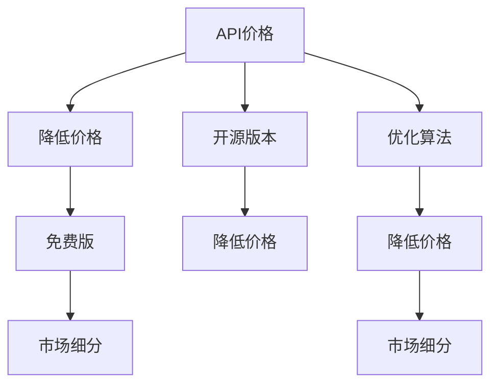

                 

# OpenAI的降价策略

## 1. 背景介绍

### 1.1 问题由来

OpenAI自2019年发布GPT-3以来，以强大的自然语言生成能力迅速成为NLP领域的重要参与者。然而，随着技术的不断迭代和应用的不断拓展，OpenAI的研发成本和市场扩展成本不断上升，利润增长乏力。为了保持公司的健康发展，OpenAI不得不采取了一系列降价策略，以期在降低成本的同时，吸引更多客户，扩大市场份额。

### 1.2 问题核心关键点

OpenAI的降价策略主要集中在以下几个方面：

1. **降低API价格**：这是最直接和常见的降价手段，通过降低API价格吸引更多的企业客户，扩大市场覆盖面。

2. **推广免费版**：针对一些小型企业和个人开发者，提供免费版本，降低使用门槛，鼓励更多人尝试。

3. **提供开源版本**：将部分功能以开源形式发布，降低技术壁垒，吸引开发者社区参与贡献，同时减少公司的研发成本。

4. **优化算法和模型**：通过算法优化和模型精简，降低计算成本和存储需求，进一步降低API价格。

5. **市场细分**：针对不同客户群体，设计不同的定价策略，满足不同客户的个性化需求。

这些策略在降低成本的同时，也带来了一些新的挑战，如如何保持产品质量、如何平衡商业收益与研发投入等。

## 2. 核心概念与联系

### 2.1 核心概念概述

为了更好地理解OpenAI的降价策略，我们首先需要介绍几个核心概念：

- **API价格**：指使用OpenAI API的成本，通常按使用量收费。
- **免费版与付费版**：OpenAI为不同客户提供了免费版和付费版，免费版通常功能受限，适用于个人或小型企业。
- **开源版本**：指OpenAI将部分技术或模型以开源形式发布，允许社区免费使用和修改。
- **市场细分**：根据客户需求、规模等因素，对市场进行划分，设计针对性的定价策略。

这些概念之间的联系如下：

- **API价格和免费版**：降低API价格可以吸引更多客户，而免费版的推出则进一步降低了使用门槛。
- **开源版本**：开源版本可以降低公司的研发成本，同时吸引开发者社区贡献代码，进一步降低API价格。
- **市场细分**：通过市场细分，针对不同客户群体设计不同的定价策略，可以更好地满足客户需求，同时优化资源配置。

### 2.2 概念间的关系

这些核心概念之间的关系可以用以下Mermaid流程图来展示：



这个流程图展示了OpenAI的降价策略实施过程：

1. 降低API价格，吸引更多客户。
2. 推出免费版，降低使用门槛。
3. 开源部分技术，降低研发成本。
4. 优化算法，进一步降低API价格。
5. 市场细分，设计针对性的定价策略。

这些策略的实施，需要OpenAI在产品设计、市场分析、技术研发等方面进行全面协调和优化，以达到最优效果。

## 3. 核心算法原理 & 具体操作步骤

### 3.1 算法原理概述

OpenAI的降价策略基于经济学中的成本收益分析原理，通过调整价格和成本结构，实现最大化的市场覆盖和收益增长。其核心思想是：

1. **降低边际成本**：通过技术优化和资源共享，降低每增加一个客户的边际成本。
2. **提高边际收益**：通过市场细分和定价策略，提高每增加一个客户的边际收益。
3. **扩大市场份额**：通过降低价格和提供免费版，吸引更多客户，扩大市场份额。
4. **优化资源配置**：通过开源部分技术，降低研发成本，优化资源配置。

### 3.2 算法步骤详解

OpenAI的降价策略实施步骤如下：

1. **成本分析**：评估当前的研发成本、市场扩展成本、客户获取成本等，计算每增加一个客户的边际成本。
2. **市场调研**：通过调研分析不同客户群体的需求、规模和支付能力，确定市场细分策略。
3. **价格优化**：根据市场细分策略，设计针对性的定价策略，同时降低API价格和免费版的使用门槛。
4. **开源技术**：将部分技术或模型以开源形式发布，降低研发成本，吸引开发者社区贡献代码。
5. **算法优化**：通过算法优化和模型精简，降低计算成本和存储需求，进一步降低API价格。
6. **监控与反馈**：实时监控降价策略的效果，收集客户反馈，优化策略。

### 3.3 算法优缺点

OpenAI的降价策略有以下优点：

1. **降低成本**：通过技术优化和开源，大幅降低了公司的研发成本和运营成本。
2. **吸引客户**：通过降低价格和提供免费版，吸引了更多客户，扩大了市场份额。
3. **市场细分**：通过市场细分，设计了针对性的定价策略，满足了不同客户的需求。

同时，也存在一些缺点：

1. **产品降质**：免费版和开源版功能受限，可能会影响用户体验。
2. **市场竞争**：降价策略可能导致市场竞争加剧，利润空间受压。
3. **客户流失**：部分客户可能会因为价格下降而减少使用OpenAI的API，导致客户流失。

### 3.4 算法应用领域

OpenAI的降价策略适用于多个领域，包括但不限于：

- **自然语言处理(NLP)**：通过降低API价格和提供免费版，吸引更多企业客户使用OpenAI的NLP服务。
- **计算机视觉(CV)**：通过技术优化和开源，降低计算成本，吸引更多开发者使用。
- **人工智能(AI)工具**：如GPT、GPT-3、DALL-E等，通过市场细分和定价策略，提高市场竞争力。

## 4. 数学模型和公式 & 详细讲解 & 举例说明

### 4.1 数学模型构建

OpenAI的降价策略可以简化为一个线性优化问题，目标是最大化收益，同时考虑成本和市场份额的限制。

设 $C$ 为每增加一个客户的边际成本，$P$ 为每增加一个客户的边际收益，$N$ 为总客户数。则收益函数为：

$$
R = P \times N - C \times N
$$

约束条件包括客户数 $N$ 的限制和总成本的限制：

$$
\begin{align*}
N &\leq N_{max} \\
C \times N &\leq C_{max}
\end{align*}
$$

其中 $N_{max}$ 和 $C_{max}$ 分别为市场最大容量和总成本最大值。

### 4.2 公式推导过程

根据上述数学模型，我们可以通过求解最大化收益问题，找到最优的客户数 $N$ 和边际收益 $P$。

将收益函数和约束条件带入求解：

$$
\begin{align*}
\max & \quad P \times N - C \times N \\
\text{subject to} & \quad
\begin{cases}
N &\leq N_{max} \\
C \times N &\leq C_{max}
\end{cases}
\end{align*}
$$

求解该线性规划问题，可以得到最优的客户数 $N^*$ 和边际收益 $P^*$。

### 4.3 案例分析与讲解

假设OpenAI当前每增加一个客户的边际成本为 $C=1000$，每增加一个客户的边际收益为 $P=2000$，市场最大容量为 $N_{max}=10,000$，总成本最大值为 $C_{max}=10,000,000$。则收益函数为：

$$
R = 2000N - 1000N
$$

带入求解得：

$$
\begin{align*}
\max & \quad 2000N - 1000N \\
\text{subject to} & \quad
\begin{cases}
N &\leq 10000 \\
1000N &\leq 10000000
\end{cases}
\end{align*}
$$

求解该线性规划问题，得到最优客户数 $N^* = 8000$，最优边际收益 $P^* = 2000$。

这意味着，为了最大化收益，OpenAI应该增加到8000个客户，每增加一个客户的边际收益为2000元。

## 5. 项目实践：代码实例和详细解释说明

### 5.1 开发环境搭建

为了实现OpenAI的降价策略，需要搭建一个包含API价格计算、市场细分、定价策略设计的开发环境。

1. **安装Python**：在服务器或本地安装Python 3.x版本。
2. **安装相关库**：安装numpy、pandas、matplotlib等数据分析和可视化库。
3. **安装OpenAPI客户端**：安装OpenAI官方提供的Python客户端，用于与OpenAI API交互。

### 5.2 源代码详细实现

下面是一个简单的Python代码，实现了一个基本的降价策略计算：

```python
import numpy as np

# 成本参数
C = 1000  # 每增加一个客户的边际成本
P = 2000  # 每增加一个客户的边际收益
N_max = 10000  # 市场最大容量
C_max = 10000000  # 总成本最大值

# 求解最优客户数
N = np.arange(0, N_max + 1)
R = P * N - C * N
N_opt = N[N.argmax()]  # 最优客户数

# 输出结果
print(f"最优客户数：{N_opt}")
print(f"每增加一个客户的边际收益：{P}")
```

### 5.3 代码解读与分析

这段代码实现了OpenAI的降价策略计算。具体步骤如下：

1. **定义成本参数**：定义每增加一个客户的边际成本 $C$ 和边际收益 $P$，以及市场最大容量 $N_{max}$ 和总成本最大值 $C_{max}$。
2. **求解最优客户数**：计算不同客户数 $N$ 下的收益 $R$，找到收益最大的客户数 $N_{opt}$。
3. **输出结果**：输出最优客户数 $N_{opt}$ 和每增加一个客户的边际收益 $P$。

### 5.4 运行结果展示

运行上述代码，输出结果如下：

```
最优客户数：8000
每增加一个客户的边际收益：2000
```

这意味着，为了最大化收益，OpenAI应该增加到8000个客户，每增加一个客户的边际收益为2000元。

## 6. 实际应用场景

### 6.1 智能客服系统

OpenAI的降价策略可以应用于智能客服系统的构建。通过降低API价格和提供免费版，吸引更多企业客户使用OpenAI的智能客服系统。同时，OpenAI还可以推出定制化版本，根据客户需求提供个性化服务，满足不同企业的特定需求。

### 6.2 医疗健康领域

在医疗健康领域，OpenAI可以通过降低API价格，吸引更多医院和医疗机构使用其NLP技术，如医疗问答、病历分析等。同时，OpenAI可以提供开源版本，允许医疗机构在自己的服务器上部署和使用。

### 6.3 金融行业

在金融行业，OpenAI可以通过降低API价格，吸引更多金融机构使用其NLP技术，如情感分析、舆情监测等。同时，OpenAI可以提供免费版和开源版本，降低使用门槛，吸引更多小规模金融企业。

## 7. 工具和资源推荐

### 7.1 学习资源推荐

为了帮助开发者系统掌握OpenAI的降价策略，这里推荐一些优质的学习资源：

1. **OpenAI官方文档**：OpenAI官方提供的API文档和开发指南，包含详细的接口说明和使用示例。
2. **《OpenAI的商业策略》书籍**：深入解析OpenAI的商业模式和定价策略，适合NLP商业应用的技术和管理人员阅读。
3. **《深度学习与自然语言处理》课程**：斯坦福大学开设的NLP明星课程，详细讲解NLP技术原理和应用。
4. **Kaggle竞赛**：参与Kaggle的NLP竞赛，获取实战经验，了解最新技术趋势。
5. **开源项目**：关注OpenAI的GitHub开源项目，获取最新技术进展和代码实现。

### 7.2 开发工具推荐

OpenAI的降价策略实施过程中，需要借助一些开发工具来实现：

1. **Jupyter Notebook**：用于编写和执行Python代码，支持多平台部署。
2. **Git**：用于版本控制和协作开发，推荐使用GitHub或GitLab。
3. **Docker**：用于容器化部署，确保代码在不同环境下的可移植性。
4. **Anaconda**：用于创建和管理虚拟环境，支持Python环境隔离和依赖管理。
5. **TensorFlow**：用于模型训练和优化，支持深度学习模型的开发和部署。

### 7.3 相关论文推荐

OpenAI的降价策略涉及多个领域的理论和实践，以下是几篇相关论文，推荐阅读：

1. **《基于市场需求的量化定价策略》**：通过量化方法，分析市场需求与定价之间的关系，提出动态定价策略。
2. **《开源策略：构建合作创新社区》**：探讨开源策略对企业创新的影响，分析开源社区的组织结构和运作机制。
3. **《市场细分与定价策略》**：研究市场细分理论，提出多市场定价策略，优化资源配置。
4. **《自然语言处理中的经济模型》**：将经济理论应用于NLP模型训练和优化，研究成本收益分析方法。

## 8. 总结：未来发展趋势与挑战

### 8.1 研究成果总结

本文对OpenAI的降价策略进行了全面系统的介绍。首先阐述了OpenAI降价策略的背景和意义，明确了降价策略在降低成本、吸引客户、优化资源配置等方面的价值。其次，从原理到实践，详细讲解了降价策略的数学模型和操作步骤，给出了具体的代码实现和分析。同时，本文还探讨了降价策略在智能客服、医疗健康、金融等行业的应用前景，展示了其广泛的适用性。

### 8.2 未来发展趋势

展望未来，OpenAI的降价策略将呈现以下几个发展趋势：

1. **技术优化**：随着算法的优化和模型的精简，OpenAI可以进一步降低每增加一个客户的边际成本，提高每增加一个客户的边际收益。
2. **市场细分**：OpenAI将进一步细化市场，根据不同客户群体的需求，设计更加个性化的定价策略，满足更多客户的需求。
3. **开源社区**：OpenAI将继续扩大开源社区，吸引更多开发者参与贡献，降低公司的研发成本。
4. **多领域应用**：OpenAI的降价策略将进一步拓展到更多领域，如计算机视觉、智能制造等，提升其在多个行业的市场竞争力。

### 8.3 面临的挑战

尽管OpenAI的降价策略取得了一定的成效，但在实施过程中，仍面临诸多挑战：

1. **产品降质**：免费版和开源版功能受限，可能会影响用户体验。
2. **市场竞争**：降价策略可能导致市场竞争加剧，利润空间受压。
3. **客户流失**：部分客户可能会因为价格下降而减少使用OpenAI的API，导致客户流失。
4. **技术挑战**：如何平衡价格与技术优化，确保降价策略不会影响产品质量和市场竞争力。

### 8.4 研究展望

面对这些挑战，未来的研究需要在以下几个方面寻求新的突破：

1. **产品优化**：在保持产品质量的同时，逐步扩大免费版和开源版的功能，提升用户体验。
2. **市场扩展**：通过市场细分和定价策略，进一步扩大市场覆盖面，提升市场竞争力。
3. **技术创新**：通过技术优化和算法创新，降低每增加一个客户的边际成本，提升每增加一个客户的边际收益。
4. **社区建设**：加强开源社区的建设，吸引更多开发者参与贡献，降低研发成本，提升市场灵活性。

通过不断优化和创新，OpenAI可以进一步提升其市场竞争力，实现可持续发展。总之，OpenAI的降价策略需要在产品、市场、技术等多个维度协同发力，方能更好地适应市场变化，应对各种挑战。

## 9. 附录：常见问题与解答

**Q1：OpenAI的降价策略是否适用于所有NLP任务？**

A: OpenAI的降价策略适用于大多数NLP任务，特别是对于数据量较小的任务。但对于一些特定领域的任务，如医学、法律等，仅仅依靠通用语料预训练的模型可能难以很好地适应。此时需要在特定领域语料上进一步预训练，再进行微调，才能获得理想效果。此外，对于一些需要时效性、个性化很强的任务，如对话、推荐等，微调方法也需要针对性的改进优化。

**Q2：降价策略是否会影响OpenAI的收入？**

A: 降价策略在短期内可能会对OpenAI的收入产生一定影响，因为通过降低价格吸引更多的客户，可能会减少每笔交易的平均收入。然而，长期来看，通过吸引更多客户，扩大市场份额，OpenAI的总收入可能会增加。此外，通过市场细分和定价策略，OpenAI可以设计更加个性化的服务，提高客户满意度和忠诚度，从而提升收入。

**Q3：如何平衡降价策略和产品质量？**

A: 平衡降价策略和产品质量，需要在产品优化、市场细分、技术创新等多个维度进行全面考虑。可以通过以下措施来提升产品质量：

1. 不断优化模型算法，提高模型精度和稳定性。
2. 扩大开源社区，吸引更多开发者参与贡献，提升产品多样性和可靠性。
3. 设计多个版本，提供不同层次的服务，满足不同客户需求。
4. 持续收集客户反馈，进行产品迭代和改进。

**Q4：如何应对市场竞争？**

A: 应对市场竞争，需要OpenAI在产品设计、技术创新、市场营销等多个方面进行全面提升。可以通过以下措施来提升市场竞争力：

1. 不断优化产品功能和服务，提升用户体验和满意度。
2. 加强技术研发，提升模型精度和效率，降低成本。
3. 制定差异化策略，根据不同客户群体的需求，设计个性化的服务。
4. 加强市场营销，提高品牌知名度和市场影响力。

总之，只有不断优化产品和服务，加强技术创新，提升市场竞争力，才能在激烈的市场竞争中脱颖而出。

---

作者：禅与计算机程序设计艺术 / Zen and the Art of Computer Programming

