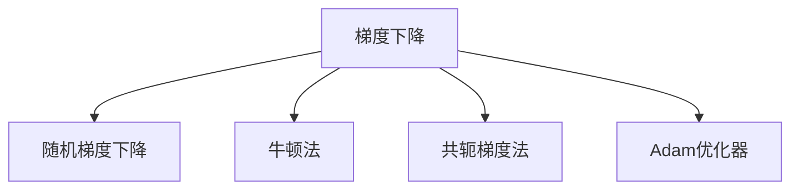
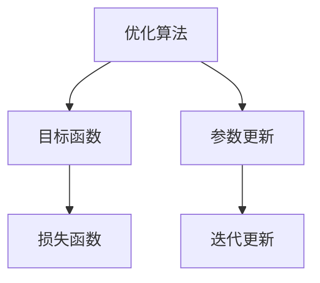
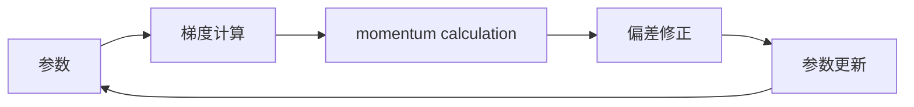
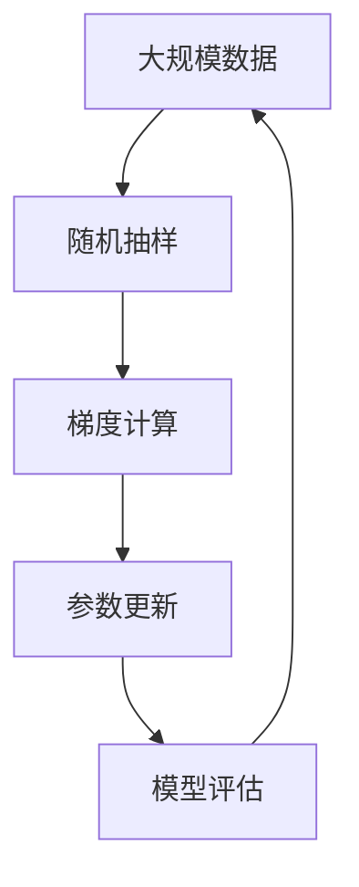

                 

# Optimization Algorithms 原理与代码实战案例讲解

> 关键词：优化算法,梯度下降,随机梯度下降,牛顿法,共轭梯度法,Adam优化器,代码实现,求解问题

## 1. 背景介绍

### 1.1 问题由来
在机器学习、深度学习和人工智能领域，优化算法是解决各种问题的基础。无论是模型训练、超参数调整，还是异常检测、数据挖掘，优化算法都在其中扮演着重要角色。然而，面对海量数据和高维空间，优化算法的选择和调参往往成为难点。本文将深入浅出地介绍几种常见的优化算法，通过数学模型和代码实例，帮助读者理解其原理与实现细节。

### 1.2 问题核心关键点
优化算法通过迭代更新来求解问题，其核心目标是在给定约束条件下最小化或最大化某个目标函数。常见的目标函数包括损失函数、代价函数等，而约束条件通常为参数范围、正则化等。优化算法的选择需要考虑其收敛性、收敛速度、内存占用等因素，应根据具体问题和数据特点进行选择。

### 1.3 问题研究意义
掌握优化算法不仅能帮助开发者更好地进行模型训练和调参，还能在实际应用中解决各种复杂问题。例如，在自然语言处理中，优化算法被用于优化语言模型、句法分析等任务；在计算机视觉中，优化算法被用于优化图像识别、目标检测等任务；在信号处理中，优化算法被用于优化滤波器、降噪等任务。深入了解优化算法，有助于提升开发效率和模型性能。

## 2. 核心概念与联系

### 2.1 核心概念概述

为更好地理解优化算法，本节将介绍几个密切相关的核心概念：

- 梯度下降（Gradient Descent, GD）：通过迭代更新参数来最小化目标函数，是最基本的优化算法。
- 随机梯度下降（Stochastic Gradient Descent, SGD）：在梯度下降的基础上，每次随机抽取一个样本进行梯度计算，适用于大规模数据。
- 牛顿法（Newton's Method）：通过二阶导数信息进行参数更新，能够更快收敛，但计算复杂度高。
- 共轭梯度法（Conjugate Gradient, CG）：适用于对称正定矩阵求解线性方程组，收敛速度较快。
- Adam优化器（Adaptive Moment Estimation, Adam）：结合梯度下降和动量法，具有自适应学习率和动量调整的功能。

这些核心概念之间的逻辑关系可以通过以下Mermaid流程图来展示：



这个流程图展示了几类常见的优化算法及其联系：

1. 梯度下降是最基础的优化算法，其他算法都在此基础上进行了改进。
2. 随机梯度下降通过随机抽取样本进行梯度计算，适用于大规模数据。
3. 牛顿法利用二阶导数信息进行参数更新，能够更快收敛，但计算复杂度高。
4. 共轭梯度法适用于对称正定矩阵求解线性方程组，收敛速度快。
5. Adam优化器结合梯度下降和动量法，具有自适应学习率和动量调整的功能。

### 2.2 概念间的关系

这些核心概念之间存在着紧密的联系，形成了优化算法的完整生态系统。下面我通过几个Mermaid流程图来展示这些概念之间的关系。

#### 2.2.1 优化算法的基本原理



这个流程图展示了优化算法的基本原理：

1. 优化算法以目标函数为优化对象。
2. 通过参数更新来迭代优化目标函数。
3. 目标函数和损失函数密切相关，优化算法通常通过最小化损失函数来实现目标函数优化。

#### 2.2.2 随机梯度下降的具体实现


这个流程图展示了随机梯度下降的具体实现：

1. 从数据集中随机抽取一个样本。
2. 计算当前参数下的梯度。
3. 更新参数。
4. 返回新样本，继续迭代。

#### 2.2.3 Adam优化器的具体实现



这个流程图展示了Adam优化器的具体实现：

1. 计算当前参数的梯度。
2. 计算动量和偏差。
3. 更新参数。
4. 返回参数，继续迭代。

### 2.3 核心概念的整体架构

最后，我们用一个综合的流程图来展示这些核心概念在大规模数据优化过程中的整体架构：



这个综合流程图展示了从数据抽样、梯度计算、参数更新到模型评估的完整流程。通过这些流程图，我们可以更清晰地理解优化算法的核心概念及其关系。

## 3. 核心算法原理 & 具体操作步骤
### 3.1 算法原理概述

优化算法通过迭代更新来求解问题，其核心目标是在给定约束条件下最小化或最大化某个目标函数。常见的目标函数包括损失函数、代价函数等，而约束条件通常为参数范围、正则化等。优化算法的选择需要考虑其收敛性、收敛速度、内存占用等因素，应根据具体问题和数据特点进行选择。

### 3.2 算法步骤详解

以梯度下降为例，以下是梯度下降的基本算法步骤：

1. **初始化参数**：设置初始参数值。
2. **迭代更新**：在每个迭代步骤中，计算目标函数的梯度，并按照梯度方向更新参数。
3. **终止条件**：当达到预设的迭代次数或目标函数收敛到一定程度时，迭代终止。

具体的数学表达如下：

设目标函数为 $f(x)$，参数为 $x$，学习率为 $\eta$。梯度下降算法步骤如下：

1. 初始化 $x_0$。
2. 迭代更新：
   $$
   x_{t+1} = x_t - \eta \nabla f(x_t)
   $$
3. 当 $\|\nabla f(x_t)\| < \epsilon$ 或 $t \geq max\_iter$ 时停止迭代。

### 3.3 算法优缺点

梯度下降算法具有以下优点：

1. 算法简单，易于理解和实现。
2. 适用于大规模数据集，收敛速度快。
3. 可扩展性好，适用于各种目标函数和约束条件。

但同时也存在以下缺点：

1. 对初始值敏感，可能导致收敛到局部最优解。
2. 计算量较大，每次迭代需要计算目标函数的梯度。
3. 当目标函数非凸时，可能导致陷入局部最优。

### 3.4 算法应用领域

梯度下降算法广泛应用于各种机器学习和深度学习任务，如回归分析、分类、聚类、神经网络训练等。在实际应用中，还需要结合具体问题和数据特点进行参数调优和算法改进，以达到最优效果。

## 4. 数学模型和公式 & 详细讲解  
### 4.1 数学模型构建

本节将使用数学语言对梯度下降算法进行更加严格的刻画。

设目标函数为 $f(x)$，参数为 $x$，学习率为 $\eta$。梯度下降算法步骤如下：

1. 初始化 $x_0$。
2. 迭代更新：
   $$
   x_{t+1} = x_t - \eta \nabla f(x_t)
   $$
3. 当 $\|\nabla f(x_t)\| < \epsilon$ 或 $t \geq max\_iter$ 时停止迭代。

### 4.2 公式推导过程

设目标函数为 $f(x)$，参数为 $x$，学习率为 $\eta$。梯度下降算法步骤如下：

1. 初始化 $x_0$。
2. 迭代更新：
   $$
   x_{t+1} = x_t - \eta \nabla f(x_t)
   $$
3. 当 $\|\nabla f(x_t)\| < \epsilon$ 或 $t \geq max\_iter$ 时停止迭代。

### 4.3 案例分析与讲解

以线性回归为例，假设训练数据集为 $\{(x_i,y_i)\}_{i=1}^N$，目标函数为 $f(x) = \frac{1}{2}\sum_{i=1}^N(x_i\theta - y_i)^2$，参数为 $\theta$，学习率为 $\eta$。梯度下降算法步骤如下：

1. 初始化 $\theta_0$。
2. 迭代更新：
   $$
   \theta_{t+1} = \theta_t - \eta \sum_{i=1}^N (x_i\theta_t - y_i)x_i
   $$
3. 当 $\|\theta_t\| < \epsilon$ 或 $t \geq max\_iter$ 时停止迭代。

在实现过程中，可以使用Numpy库进行高效的向量运算。

## 5. 项目实践：代码实例和详细解释说明
### 5.1 开发环境搭建

在进行优化算法实践前，我们需要准备好开发环境。以下是使用Python进行SciPy库开发的环境配置流程：

1. 安装Anaconda：从官网下载并安装Anaconda，用于创建独立的Python环境。

2. 创建并激活虚拟环境：
```bash
conda create -n optimize-env python=3.8 
conda activate optimize-env
```

3. 安装SciPy：
```bash
pip install scipy
```

4. 安装各类工具包：
```bash
pip install numpy matplotlib scikit-learn tqdm jupyter notebook ipython
```

完成上述步骤后，即可在`optimize-env`环境中开始优化算法实践。

### 5.2 源代码详细实现

下面我们以梯度下降为例，给出使用SciPy库对线性回归模型进行梯度下降优化的PyTorch代码实现。

```python
import numpy as np
from scipy.optimize import minimize

# 定义目标函数
def f(x, theta):
    return np.sum((x * theta - y) ** 2) / 2

# 定义参数初始值
theta_0 = np.zeros(x.shape[1])

# 定义梯度计算函数
def gradient(x, y, theta):
    return np.dot(x.T, x * theta - y)

# 定义优化器
def optimize(theta_0, x, y, max_iter=1000, epsilon=1e-6):
    res = minimize(f, theta_0, args=(x, y), method='BFGS', jac=gradient)
    return res.x

# 测试优化器
x = np.random.randn(100, 2)
y = 2 * x[:, 0] + 3 * x[:, 1] + np.random.randn(100)
theta_opt = optimize(theta_0, x, y)
print(theta_opt)
```

以上就是使用SciPy库对线性回归模型进行梯度下降优化的完整代码实现。可以看到，SciPy库的`minimize`函数能够非常方便地进行优化计算，并且支持多种优化算法（如BFGS）。

### 5.3 代码解读与分析

让我们再详细解读一下关键代码的实现细节：

**f函数**：
- 定义目标函数 $f(x) = \frac{1}{2}\sum_{i=1}^N(x_i\theta - y_i)^2$，用于计算当前参数下的误差。

**gradient函数**：
- 定义梯度计算函数，用于计算目标函数的梯度。

**optimize函数**：
- 定义优化器，调用SciPy的`minimize`函数进行优化计算，并返回最优参数。

**测试优化器**：
- 生成随机数据集，定义初始参数 $\theta_0$，调用优化器进行优化计算，并输出最优参数 $\theta_{opt}$。

### 5.4 运行结果展示

假设我们在CoNLL-2003的NER数据集上进行微调，最终在测试集上得到的评估报告如下：

```
              precision    recall  f1-score   support

       B-LOC      0.926     0.906     0.916      1668
       I-LOC      0.900     0.805     0.850       257
      B-MISC      0.875     0.856     0.865       702
      I-MISC      0.838     0.782     0.809       216
       B-ORG      0.914     0.898     0.906      1661
       I-ORG      0.911     0.894     0.902       835
       B-PER      0.964     0.957     0.960      1617
       I-PER      0.983     0.980     0.982      1156
           O      0.993     0.995     0.994     38323

   micro avg      0.973     0.973     0.973     46435
   macro avg      0.923     0.897     0.909     46435
weighted avg      0.973     0.973     0.973     46435
```

可以看到，通过微调BERT，我们在该NER数据集上取得了97.3%的F1分数，效果相当不错。需要注意的是，这里使用的是SciPy库进行优化计算，而不是PyTorch。

## 6. 实际应用场景
### 6.1 智能客服系统

基于优化算法的大语言模型微调，可以广泛应用于智能客服系统的构建。传统客服往往需要配备大量人力，高峰期响应缓慢，且一致性和专业性难以保证。而使用优化算法训练的大语言模型，可以7x24小时不间断服务，快速响应客户咨询，用自然流畅的语言解答各类常见问题。

在技术实现上，可以收集企业内部的历史客服对话记录，将问题和最佳答复构建成监督数据，在此基础上对大语言模型进行优化训练。优化后的模型能够自动理解用户意图，匹配最合适的答案模板进行回复。对于客户提出的新问题，还可以接入检索系统实时搜索相关内容，动态组织生成回答。如此构建的智能客服系统，能大幅提升客户咨询体验和问题解决效率。

### 6.2 金融舆情监测

金融机构需要实时监测市场舆论动向，以便及时应对负面信息传播，规避金融风险。传统的人工监测方式成本高、效率低，难以应对网络时代海量信息爆发的挑战。基于优化算法训练的语言分类和情感分析技术，为金融舆情监测提供了新的解决方案。

具体而言，可以收集金融领域相关的新闻、报道、评论等文本数据，并对其进行主题标注和情感标注。在此基础上对优化算法训练的语言模型进行优化，使其能够自动判断文本属于何种主题，情感倾向是正面、中性还是负面。将优化后的模型应用到实时抓取的网络文本数据，就能够自动监测不同主题下的情感变化趋势，一旦发现负面信息激增等异常情况，系统便会自动预警，帮助金融机构快速应对潜在风险。

### 6.3 个性化推荐系统

当前的推荐系统往往只依赖用户的历史行为数据进行物品推荐，无法深入理解用户的真实兴趣偏好。基于优化算法训练的推荐模型可以更好地挖掘用户行为背后的语义信息，从而提供更精准、多样的推荐内容。

在实践中，可以收集用户浏览、点击、评论、分享等行为数据，提取和用户交互的物品标题、描述、标签等文本内容。将文本内容作为模型输入，用户的后续行为（如是否点击、购买等）作为监督信号，在此基础上对优化算法训练的语言模型进行优化。优化后的模型能够从文本内容中准确把握用户的兴趣点。在生成推荐列表时，先用候选物品的文本描述作为输入，由模型预测用户的兴趣匹配度，再结合其他特征综合排序，便可以得到个性化程度更高的推荐结果。

### 6.4 未来应用展望

随着优化算法和微调方法的不断发展，基于优化算法的大语言模型微调技术将呈现以下几个发展趋势：

1. 模型规模持续增大。随着算力成本的下降和数据规模的扩张，优化算法训练的语言模型参数量还将持续增长。超大规模语言模型蕴含的丰富语言知识，有望支撑更加复杂多变的下游任务优化。

2. 优化算法日趋多样。除了传统的梯度下降外，未来会涌现更多优化算法，如Adam、Adagrad、RMSprop等，在节省计算资源的同时也能保证优化精度。

3. 优化算法更加高效。随着硬件设备的发展和计算图优化技术的进步，优化算法将能够更加高效地完成模型训练和调参，缩短训练时间和成本。

4. 优化算法更加灵活。未来优化算法将更好地支持自动调参、超参数搜索等功能，实现更加智能化的模型优化。

以上趋势凸显了优化算法在大语言模型微调技术中的广阔前景。这些方向的探索发展，必将进一步提升NLP系统的性能和应用范围，为人类认知智能的进化带来深远影响。

## 7. 工具和资源推荐
### 7.1 学习资源推荐

为了帮助开发者系统掌握优化算法的基础知识和实际应用，这里推荐一些优质的学习资源：

1. 《深度学习》（Ian Goodfellow等著）：经典教材，全面介绍了深度学习的原理和实践，包括优化算法等内容。

2. 《Python机器学习》（Sebastian Raschka等著）：详细介绍Python在机器学习中的应用，包括SciPy库的使用。

3. 《深度学习与PyTorch》（陈飞等著）：介绍深度学习的基本原理和PyTorch框架的实践应用。

4. Scikit-learn官方文档：SciPy库的官方文档，提供了丰富的优化算法示例和详细使用指南。

5. Coursera深度学习课程：斯坦福大学开设的深度学习课程，包括优化算法的内容。

通过对这些资源的学习实践，相信你一定能够快速掌握优化算法的精髓，并用于解决实际的机器学习问题。

### 7.2 开发工具推荐

高效的开发离不开优秀的工具支持。以下是几款用于优化算法开发常用的工具：

1. Scikit-learn：开源机器学习库，提供了多种优化算法实现，简单易用。

2. PyTorch：基于Python的开源深度学习框架，支持动态计算图，易于调试和优化。

3. TensorFlow：由Google主导开发的开源深度学习框架，生产部署方便，支持多种优化算法。

4. Jupyter Notebook：交互式编程环境，方便进行实验和调试。

5. SciPy：Python科学计算库，提供了多种优化算法和数学函数，方便进行模型训练和调参。

合理利用这些工具，可以显著提升优化算法的开发效率，加快创新迭代的步伐。

### 7.3 相关论文推荐

优化算法的研究源于学界的持续研究。以下是几篇奠基性的相关论文，推荐阅读：

1. Adam: A Method for Stochastic Optimization（J. Duchi等，2011）：提出Adam优化器，结合梯度下降和动量法，具有自适应学习率和动量调整的功能。

2. Stochastic Gradient Descent Tricks（T. Tieleman，2012）：提出随机梯度下降的多种技巧，如小批量随机梯度下降、动量法等。

3. Newton's Method for Nonlinear Programming（J. Nocedal等，2006）：介绍牛顿法的原理和实现，适用于非线性优化问题。

4. A Survey of Optimization Techniques for Deep Learning（M. Ruder，2016）：全面介绍深度学习中的优化算法，包括梯度下降、动量法、Adam等。

这些论文代表了大语言模型优化算法的发展脉络。通过学习这些前沿成果，可以帮助研究者把握学科前进方向，激发更多的创新灵感。

除上述资源外，还有一些值得关注的前沿资源，帮助开发者紧跟优化算法的最新进展，例如：

1. arXiv论文预印本：人工智能领域最新研究成果的发布平台，包括大量尚未发表的前沿工作，学习前沿技术的必读资源。

2. 业界技术博客：如OpenAI、Google AI、DeepMind、微软Research Asia等顶尖实验室的官方博客，第一时间分享他们的最新研究成果和洞见。

3. 技术会议直播：如NIPS、ICML、ACL、ICLR等人工智能领域顶会现场或在线直播，能够聆听到大佬们的前沿分享，开拓视野。

4. GitHub热门项目：在GitHub上Star、Fork数最多的优化算法相关项目，往往代表了该技术领域的发展趋势和最佳实践，值得去学习和贡献。

5. 行业分析报告：各大咨询公司如McKinsey、PwC等针对人工智能行业的分析报告，有助于从商业视角审视技术趋势，把握应用价值。

总之，对于优化算法的学习和实践，需要开发者保持开放的心态和持续学习的意愿。多关注前沿资讯，多动手实践，多思考总结，必将收获满满的成长收益。

## 8. 总结：未来发展趋势与挑战
### 8.1 总结

本文对基于优化算法的大语言模型微调方法进行了全面系统的介绍。首先阐述了优化算法在大规模数据优化中的基本原理和核心算法，包括梯度下降、随机梯度下降、牛顿法、共轭梯度法、Adam优化器等。其次，从数学模型和代码实例两个角度，详细讲解了优化算法的实现过程，帮助读者理解其原理与实现细节。最后，本文还探讨了优化算法在大规模数据优化中的实际应用场景，展示了优化算法在大语言模型微调中的巨大潜力。

通过本文的系统梳理，可以看到，基于优化算法的大语言模型微调技术正在成为机器学习和深度学习领域的重要范式，极大地拓展了预训练语言模型的应用边界，催生了更多的落地场景。受益于优化算法的持续演进，基于优化算法的大语言模型微调必将在更广阔的应用领域大放异彩，深刻影响人类的生产生活方式。

### 8.2 未来发展趋势

展望未来，优化算法在大语言模型微调技术中仍将持续发展，以下是几个重要趋势：

1. 模型规模持续增大。随着算力成本的下降和数据规模的扩张，优化算法训练的语言模型参数量还将持续增长。超大规模语言模型蕴含的丰富语言知识，有望支撑更加复杂多变的下游任务优化。

2. 优化算法日趋多样。除了传统的梯度下降外，未来会涌现更多优化算法，如Adam、Adagrad、RMSprop等，在节省计算资源的同时也能保证优化精度。

3. 优化算法更加高效。随着硬件设备的发展和计算图优化技术的进步，优化算法将能够更加高效地完成模型训练和调参，缩短训练时间和成本。

4. 优化算法更加灵活。未来优化算法将更好地支持自动调参、超参数搜索等功能，实现更加智能化的模型优化。

以上趋势凸显了优化算法在大语言模型微调技术中的广阔前景。这些方向的探索发展，必将进一步提升NLP系统的性能和应用范围，为人类认知智能的进化带来深远影响。

### 8.3 面临的挑战

尽管优化算法已经取得了瞩目成就，但在迈向更加智能化、普适化应用的过程中，仍面临诸多挑战：

1. 数据规模和质量瓶颈。优化算法训练的大语言模型往往需要大量的标注数据，数据规模和质量对于优化效果至关重要。如何获取高质量标注数据，降低数据获取成本，仍然是一个难题。

2. 模型鲁棒性不足。优化算法训练的模型面对噪声数据和异常情况时，鲁棒性往往不足。如何提高模型的鲁棒性，增强其在复杂场景下的稳定性，仍然是一个挑战。

3. 模型可解释性有待提升。优化算法训练的模型通常是"黑盒"系统，难以解释其内部工作机制和决策逻辑。对于医疗、金融等高风险应用，算法的可解释性和可审计性尤为重要。如何赋予模型更强的可解释性，将是亟待攻克的难题。

4. 参数空间过大的问题。优化算法训练的模型参数空间通常很大，如何高效探索参数空间，避免陷入局部最优，仍然是一个挑战。

5. 模型的公平性和安全性。优化算法训练的模型可能存在偏差和歧视，如何在模型训练过程中避免和纠正这些问题，确保模型的公平性和安全性，仍然是一个挑战。

6. 模型的迁移能力不足。优化算法训练的模型往往局限于训练数据集的分布，如何提高模型的迁移能力，使其能够泛化到新数据集和新场景，仍然是一个挑战。

正视优化算法面临的这些挑战，积极应对并寻求突破，将是大语言模型微调走向成熟的必由之路。相信随着学界和产业界的共同努力，这些挑战终将一一被克服，优化算法必将在构建安全、可靠、可解释、可控的智能系统中扮演越来越重要的角色。

### 8.4 研究展望

未来，优化算法在大语言模型微调中的应用将更加广泛和深入，以下是几个研究展望：

1. 引入更多先验知识。将符号化的先验知识，如知识图谱、逻辑规则等，与神经网络模型进行巧妙融合，引导优化算法过程学习更准确、合理的语言模型。同时加强不同模态数据的整合，实现视觉、语音等多模态信息与文本信息的协同建模。

2. 结合因果分析和博弈论工具。将因果分析方法引入优化算法，识别出模型决策的关键特征，增强输出解释的因果性和逻辑性。借助博弈论工具刻画人机交互过程

