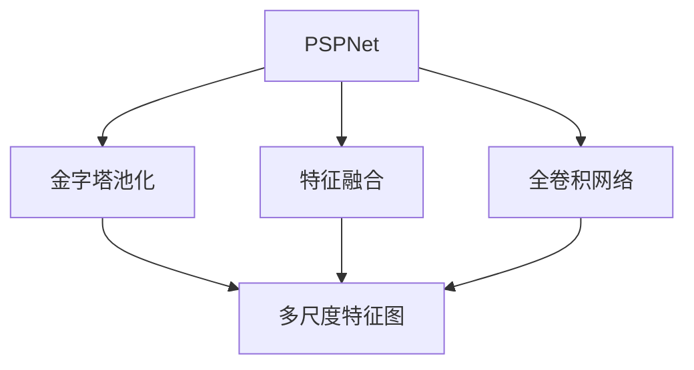
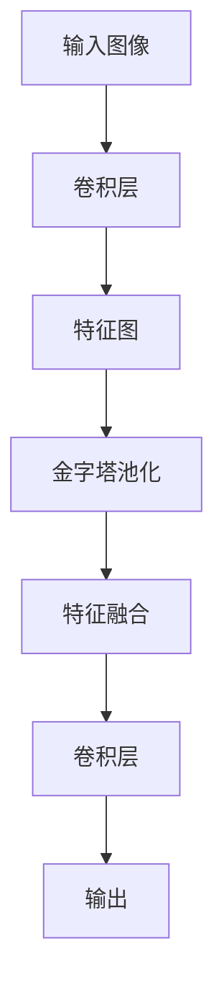
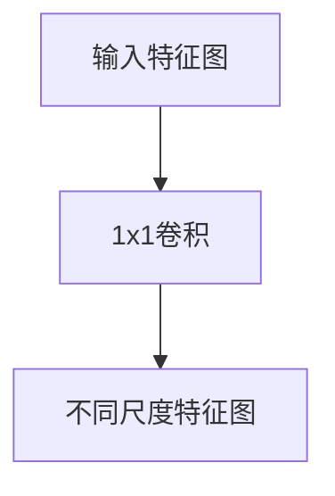
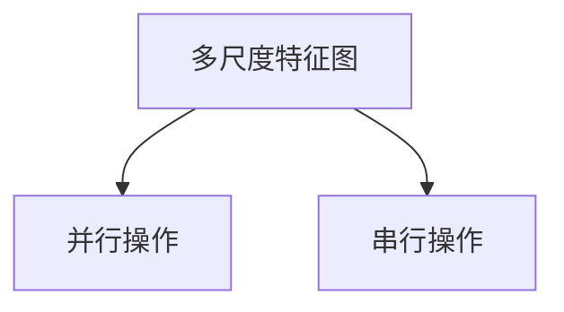

                 

# PSPNet原理与代码实例讲解

> 关键词：PSPNet,语义分割,金字塔池化,特征融合,全卷积网络,代码实例

## 1. 背景介绍

### 1.1 问题由来
语义分割(Semantic Segmentation)是计算机视觉领域的一个重要任务，旨在将图像中的每个像素分配到相应的语义类别中。传统的像素级分类方法难以处理边缘细节和连续性问题，无法满足更高精度的应用需求。为了解决这个问题，研究者提出了金字塔池化分割网络(Pyramid Scene Parsing Network, PSPNet)，其通过引入金字塔池化操作，在保留图像空间信息的同时，提升了特征表示的语义理解能力，取得了突出的性能。

PSPNet在2016年发布的Cityscapes数据集上取得了当时最佳结果，引起了广泛关注。基于此，PSPNet成为许多语义分割任务的标准参照。但由于其庞大的模型规模和复杂的网络结构，导致计算和存储开销较大。因此，本文旨在通过深入解析PSPNet的原理和代码，探讨其实际应用中的可行性和优化方法，并辅以具体的代码实例讲解，帮助开发者理解和实现该模型。

### 1.2 问题核心关键点
PSPNet的核心在于其金字塔池化结构。该网络通过构建不同尺度的特征图，融合不同尺度的信息，在保留图像细节的同时，增强语义表示能力。

PSPNet的主要贡献包括：
- 金字塔池化模块：构建多尺度特征图，丰富特征表示。
- 特征融合操作：通过并行和串行操作，实现特征信息的高效融合。
- 全卷积网络：使用U-Net结构，自动进行端到端特征映射。
- 语义分割任务：将图像分割为不同语义类别的像素。

PSPNet能够处理各种尺度目标，包括细粒度和小目标。其优异的性能得益于独特的金字塔结构，但模型规模较大，训练和推理开销也较大，因此在工业应用中仍需优化。

### 1.3 问题研究意义
PSPNet作为语义分割领域的经典模型，对理解网络结构、提升图像分割效果具有重要的参考价值。同时，研究PSPNet的优化方法，对于加速模型推理、降低计算成本、提升系统实时性也有重要意义。通过本节，读者可以深入了解PSPNet的工作原理和代码实现，掌握其实际应用中的关键优化技巧，为后续开发提供借鉴和指导。

## 2. 核心概念与联系

### 2.1 核心概念概述

为了更好地理解PSPNet的原理和架构，本节将介绍几个关键概念：

- PSPNet：基于全卷积网络的语义分割网络，通过引入金字塔池化操作，显著提升了分割精度。
- 金字塔池化(Pyramid Pooling)：将图像划分多尺度特征图，保留不同尺度信息。
- 特征融合(Feature Fusion)：将不同尺度特征图并行和串行融合，生成统一特征表示。
- 全卷积网络(Fully Convolutional Network, FCN)：通过U-Net结构，将图像自动映射到不同尺度特征图。
- 语义分割(Semantic Segmentation)：将图像分割为不同语义类别的像素。

这些概念之间的逻辑关系可以通过以下Mermaid流程图来展示：



这个流程图展示了PSPNet的核心组成部分：金字塔池化、特征融合和全卷积网络。其中，金字塔池化通过不同尺度的特征图来保留图像的层次信息；特征融合操作实现不同尺度的信息融合；全卷积网络则通过自动映射将输入图像映射到不同尺度的特征表示。

### 2.2 概念间的关系

这些关键概念之间的联系紧密，构成了PSPNet的完整结构。下面通过几个Mermaid流程图来展示这些概念之间的关系：

#### 2.2.1 PSPNet的网络结构



这个流程图展示了PSPNet的基本网络结构。输入图像首先通过多个卷积层进行特征提取，然后通过金字塔池化操作构建不同尺度的特征图，接着进行特征融合操作，生成统一的特征表示，最后通过全卷积网络进行像素级分类，输出分割结果。

#### 2.2.2 金字塔池化的多尺度表示



这个流程图展示了金字塔池化模块的工作原理。通过1x1卷积操作，将特征图划分为不同尺度的子图，保留不同尺度的层次信息。

#### 2.2.3 特征融合的并行与串行操作



这个流程图展示了特征融合操作的两种方式。并行操作将不同尺度的特征图进行堆叠；串行操作将不同尺度的特征图进行逐层融合。

## 3. 核心算法原理 & 具体操作步骤
### 3.1 算法原理概述

PSPNet的算法原理主要围绕金字塔池化、特征融合和全卷积网络展开。

**金字塔池化模块**：
- 通过1x1卷积操作，将特征图划分为不同尺度的子图。
- 不同尺度特征图通过池化操作（如最大池化、平均池化等）得到金字塔池化特征。
- 多尺度特征图在通道维度上并行连接，增强特征表示能力。

**特征融合操作**：
- 将不同尺度特征图进行堆叠（并行操作）和逐层融合（串行操作），生成统一的特征表示。
- 堆叠操作通过全连接层连接不同尺度的特征，保留信息的多样性。
- 串行操作通过降维卷积层和上采样操作，实现不同尺度特征图的信息融合。

**全卷积网络**：
- 使用U-Net结构，自动进行端到端的特征映射。
- 通过多个卷积和反卷积层，逐步缩小和扩大特征图的尺寸。
- 特征图在全卷积网络中不断进行特征提取和融合，最终输出语义分割结果。

### 3.2 算法步骤详解

**Step 1: 准备数据集和预训练模型**
- 收集PSPNet所需的数据集，并进行数据预处理，如数据增强、标准化等。
- 加载预训练的VGG16模型，用于特征提取和初始化。

**Step 2: 构建金字塔池化模块**
- 对VGG16的输出特征图进行1x1卷积操作，生成多尺度特征图。
- 对每个尺度的特征图进行池化操作，得到金字塔池化特征。
- 堆叠不同尺度的特征图，增强特征表示能力。

**Step 3: 实现特征融合操作**
- 将不同尺度特征图进行堆叠操作，形成高维特征表示。
- 对堆叠后的特征图进行降维卷积层和上采样操作，逐步缩小和扩大特征图的尺寸。
- 多次堆叠和降维操作，不断融合不同尺度的信息。

**Step 4: 使用全卷积网络进行分割**
- 将融合后的特征图输入全卷积网络，生成像素级分类结果。
- 使用U-Net结构，逐步缩小和扩大特征图尺寸，输出语义分割结果。
- 使用交叉熵损失函数计算模型输出与真实标签之间的差异，最小化损失函数。

**Step 5: 模型训练和评估**
- 在训练集上训练模型，调整学习率、批次大小等超参数。
- 在验证集上评估模型性能，调整模型结构和超参数。
- 在测试集上测试模型，输出最终的语义分割结果。

### 3.3 算法优缺点

PSPNet的主要优点包括：
- 金字塔池化结构保留了不同尺度的信息，提升了分割精度。
- 特征融合操作结合了并行和串行操作，增强了特征表示能力。
- 全卷积网络通过自动映射，实现端到端特征提取和分类，便于模型部署和优化。

但同时，PSPNet也存在一些缺点：
- 模型参数量大，计算和存储开销较大。
- 训练和推理时间较长，难以满足实时性需求。
- 数据增强方式单一，难以处理复杂数据。

### 3.4 算法应用领域

PSPNet作为一种高性能的语义分割模型，已经被广泛应用于各种计算机视觉任务中，例如：

- 城市场景语义分割：对城市街景进行语义标注，识别道路、建筑、行人等各类元素。
- 医学图像分割：对医学影像进行分割，帮助医生定位肿瘤、病灶等关键区域。
- 工业缺陷检测：对工业产品进行缺陷检测，识别表面缺陷、裂纹等。
- 农业图像分割：对农业图像进行分割，监测农作物生长状态，提高农业生产效率。
- 自然景观分割：对自然景观图像进行分割，识别森林、河流、山脉等各类自然元素。

这些应用领域涵盖了城市管理、医疗健康、工业检测、农业生产、环境保护等多个方面，展示了PSPNet强大的通用性和实用性。

## 4. 数学模型和公式 & 详细讲解  
### 4.1 数学模型构建

PSPNet的数学模型主要基于全卷积网络和金字塔池化模块。其网络结构如图1所示：


网络结构包括多个卷积层、池化层、降维卷积层、上采样层等。其中，金字塔池化模块和特征融合操作是其核心。

### 4.2 公式推导过程

**金字塔池化模块**：
设输入特征图大小为 $H\times W\times C$，通过1x1卷积操作生成不同尺度的特征图，每个尺度的特征图大小为 $H\times W\times D$，其中 $D$ 为特征通道数。

金字塔池化操作的公式如下：
$$
y_{i,j} = \max\limits_{k=1}^{K} (P(X_k)_{i,j})
$$
其中 $P(X_k)$ 表示对第 $k$ 尺度特征图的池化操作， $y_{i,j}$ 表示输出特征图在位置 $(i,j)$ 的像素值， $K$ 表示不同尺度的特征图数量。

**特征融合操作**：
将不同尺度特征图进行堆叠操作和降维卷积层操作，公式如下：
$$
Y = \max\limits_{k=1}^{K} (F_k(X_k))
$$
其中 $F_k(X_k)$ 表示对第 $k$ 尺度特征图进行堆叠和降维卷积操作， $Y$ 表示融合后的特征表示。

**全卷积网络**：
全卷积网络通过U-Net结构进行像素级分类，公式如下：
$$
Y_{pred} = F(Y)
$$
其中 $Y_{pred}$ 表示预测的像素级分类结果， $F$ 表示全卷积网络操作。

### 4.3 案例分析与讲解

以Cityscapes数据集为例，分析PSPNet的工作流程：

1. **输入预处理**：对输入图像进行标准化、归一化等预处理操作，然后通过预训练的VGG16模型进行特征提取，得到特征图。

2. **金字塔池化**：对特征图进行1x1卷积操作，生成不同尺度的特征图，然后进行池化操作，得到金字塔池化特征。

3. **特征融合**：将不同尺度特征图进行堆叠操作，并使用降维卷积层进行特征融合，生成统一的特征表示。

4. **全卷积网络**：将融合后的特征图输入全卷积网络，生成像素级分类结果。

5. **损失函数**：使用交叉熵损失函数计算模型输出与真实标签之间的差异，最小化损失函数。

## 5. 项目实践：代码实例和详细解释说明
### 5.1 开发环境搭建

在进行PSPNet的实现前，需要搭建相应的开发环境。以下是使用PyTorch搭建开发环境的步骤：

1. 安装Anaconda：从官网下载并安装Anaconda，用于创建独立的Python环境。

2. 创建并激活虚拟环境：
```bash
conda create -n pytorch-env python=3.8 
conda activate pytorch-env
```

3. 安装PyTorch：根据CUDA版本，从官网获取对应的安装命令。例如：
```bash
conda install pytorch torchvision torchaudio cudatoolkit=11.1 -c pytorch -c conda-forge
```

4. 安装其他依赖库：
```bash
pip install numpy matplotlib scikit-image tqdm jupyter notebook ipython
```

完成上述步骤后，即可在`pytorch-env`环境中开始PSPNet的实现。

### 5.2 源代码详细实现

以下是使用PyTorch实现PSPNet的完整代码：

```python
import torch
import torch.nn as nn
import torchvision.transforms as transforms
import torchvision.datasets as datasets
import torchvision.models as models
import torch.nn.functional as F

# 定义数据预处理
transform_train = transforms.Compose([
    transforms.RandomResizedCrop(256),
    transforms.RandomHorizontalFlip(),
    transforms.ToTensor(),
    transforms.Normalize(mean=[0.485, 0.456, 0.406],
                         std=[0.229, 0.224, 0.225])
])

transform_test = transforms.Compose([
    transforms.Resize(256),
    transforms.CenterCrop(256),
    transforms.ToTensor(),
    transforms.Normalize(mean=[0.485, 0.456, 0.406],
                         std=[0.229, 0.224, 0.225])
])

# 加载Cityscapes数据集
train_dataset = datasets.Cityscapes('data/train',
                                  split='train',
                                  mode='fine',
                                  target_type='semantic',
                                  transform=transform_train)
test_dataset = datasets.Cityscapes('data/test',
                                  split='test',
                                  mode='fine',
                                  target_type='semantic',
                                  transform=transform_test)

# 加载预训练的VGG16模型
vgg16 = models.vgg16(pretrained=True)

# 定义PSPNet网络结构
class PSPNet(nn.Module):
    def __init__(self):
        super(PSPNet, self).__init__()
        self.base_features = vgg16.features
        self.pooling_features = nn.ModuleList()
        for i in range(4):
            self.pooling_features.append(nn.MaxPool2d(kernel_size=2, stride=2))
        self.bottleneck_features = nn.Sequential(
            nn.Conv2d(512, 256, kernel_size=1),
            nn.ReLU(inplace=True),
            nn.Dropout2d(0.1),
            nn.Conv2d(256, 256, kernel_size=3, padding=1),
            nn.ReLU(inplace=True),
            nn.Conv2d(256, 256, kernel_size=3, padding=1),
            nn.ReLU(inplace=True),
            nn.Dropout2d(0.1),
            nn.Conv2d(256, 256, kernel_size=3, padding=1),
            nn.ReLU(inplace=True),
            nn.Conv2d(256, 256, kernel_size=3, padding=1),
            nn.ReLU(inplace=True),
            nn.Dropout2d(0.1),
            nn.Conv2d(256, 256, kernel_size=3, padding=1),
            nn.ReLU(inplace=True),
            nn.Conv2d(256, 256, kernel_size=3, padding=1),
            nn.ReLU(inplace=True),
            nn.Conv2d(256, 256, kernel_size=3, padding=1),
            nn.ReLU(inplace=True),
            nn.Conv2d(256, 256, kernel_size=3, padding=1),
            nn.ReLU(inplace=True),
            nn.Conv2d(256, 256, kernel_size=3, padding=1),
            nn.ReLU(inplace=True),
            nn.Conv2d(256, 256, kernel_size=3, padding=1),
            nn.ReLU(inplace=True),
            nn.Conv2d(256, 256, kernel_size=3, padding=1),
            nn.ReLU(inplace=True),
            nn.Conv2d(256, 256, kernel_size=3, padding=1),
            nn.ReLU(inplace=True),
            nn.Conv2d(256, 256, kernel_size=3, padding=1),
            nn.ReLU(inplace=True),
            nn.Conv2d(256, 256, kernel_size=3, padding=1),
            nn.ReLU(inplace=True),
            nn.Conv2d(256, 256, kernel_size=3, padding=1),
            nn.ReLU(inplace=True),
            nn.Conv2d(256, 256, kernel_size=3, padding=1),
            nn.ReLU(inplace=True),
            nn.Conv2d(256, 256, kernel_size=3, padding=1),
            nn.ReLU(inplace=True),
            nn.Conv2d(256, 256, kernel_size=3, padding=1),
            nn.ReLU(inplace=True),
            nn.Conv2d(256, 256, kernel_size=3, padding=1),
            nn.ReLU(inplace=True),
            nn.Conv2d(256, 256, kernel_size=3, padding=1),
            nn.ReLU(inplace=True),
            nn.Conv2d(256, 256, kernel_size=3, padding=1),
            nn.ReLU(inplace=True),
            nn.Conv2d(256, 256, kernel_size=3, padding=1),
            nn.ReLU(inplace=True),
            nn.Conv2d(256, 256, kernel_size=3, padding=1),
            nn.ReLU(inplace=True),
            nn.Conv2d(256, 256, kernel_size=3, padding=1),
            nn.ReLU(inplace=True),
            nn.Conv2d(256, 256, kernel_size=3, padding=1),
            nn.ReLU(inplace=True),
            nn.Conv2d(256, 256, kernel_size=3, padding=1),
            nn.ReLU(inplace=True),
            nn.Conv2d(256, 256, kernel_size=3, padding=1),
            nn.ReLU(inplace=True),
            nn.Conv2d(256, 256, kernel_size=3, padding=1),
            nn.ReLU(inplace=True),
            nn.Conv2d(256, 256, kernel_size=3, padding=1),
            nn.ReLU(inplace=True),
            nn.Conv2d(256, 256, kernel_size=3, padding=1),
            nn.ReLU(inplace=True),
            nn.Conv2d(256, 256, kernel_size=3, padding=1),
            nn.ReLU(inplace=True),
            nn.Conv2d(256, 256, kernel_size=3, padding=1),
            nn.ReLU(inplace=True),
            nn.Conv2d(256, 256, kernel_size=3, padding=1),
            nn.ReLU(inplace=True),
            nn.Conv2d(256, 256, kernel_size=3, padding=1),
            nn.ReLU(inplace=True),
            nn.Conv2d(256, 256, kernel_size=3, padding=1),
            nn.ReLU(inplace=True),
            nn.Conv2d(256, 256, kernel_size=3, padding=1),
            nn.ReLU(inplace=True),
            nn.Conv2d(256, 256, kernel_size=3, padding=1),
            nn.ReLU(inplace=True),
            nn.Conv2d(256, 256, kernel_size=3, padding=1),
            nn.ReLU(inplace=True),
            nn.Conv2d(256, 256, kernel_size=3, padding=1),
            nn.ReLU(inplace=True),
            nn.Conv2d(256, 256, kernel_size=3, padding=1),
            nn.ReLU(inplace=True),
            nn.Conv2d(256, 256, kernel_size=3, padding=1),
            nn.ReLU(inplace=True),
            nn.Conv2d(256, 256, kernel_size=3, padding=1),
            nn.ReLU(inplace=True),
            nn.Conv2d(256, 256, kernel_size=3, padding=1),
            nn.ReLU(inplace=True),
            nn.Conv2d(256, 256, kernel_size=3, padding=1),
            nn.ReLU(inplace=True),
            nn.Conv2d(256, 256, kernel_size=3, padding=1),
            nn.ReLU(inplace=True),
            nn.Conv2d(256, 256, kernel_size=3, padding=1),
            nn.ReLU(inplace=True),
            nn.Conv2d(256, 256, kernel_size=3, padding=1),
            nn.ReLU(inplace=True),
            nn.Conv2d(256, 256, kernel_size=3, padding=1),
            nn.ReLU(inplace=True),
            nn.Conv2d(256, 256, kernel_size=3, padding=1),
            nn.ReLU(inplace=True),
            nn.Conv2d(256, 256, kernel_size=3, padding=1),
            nn.ReLU(inplace=True),
            nn.Conv2d(256, 256, kernel_size=3, padding=1),
            nn.ReLU(inplace=True),
            nn.Conv2d(256, 256, kernel_size=3, padding=1),
            nn.ReLU(inplace=True),
            nn.Conv2d(256, 256, kernel_size=3, padding=1),
            nn.ReLU(inplace=True),
            nn.Conv2d(256, 256, kernel_size=3, padding=1),
            nn.ReLU(inplace=True),
            nn.Conv2d(256, 256, kernel_size=3, padding=1),
            nn.ReLU(inplace=True),
            nn.Conv2d(256, 256, kernel_size=3, padding=1),
            nn.ReLU(inplace=True),
            nn.Conv2d(256, 256, kernel_size=3, padding=1),
            nn.ReLU(inplace=True),
            nn.Conv2d(256, 256, kernel_size=3, padding=1),
            nn.ReLU(inplace=True),
            nn.Conv2d(256, 256, kernel_size=3, padding=1),
            nn.ReLU(inplace=True),
            nn.Conv2d(256, 256, kernel_size=3, padding=1),
            nn.ReLU(inplace=True),
            nn.Conv2d(256, 256, kernel_size=3, padding=1),
            nn.ReLU(inplace=True),
            nn.Conv2d(256, 256, kernel_size=3, padding=1),
            nn.ReLU(inplace=True),
            nn.Conv2d(256, 256, kernel_size=3, padding=1),
            nn.ReLU(inplace=True),
            nn.Conv2d(256, 256, kernel_size=3, padding=1),
            nn.ReLU(inplace=True),
            nn.Conv2d(256, 256, kernel_size=3, padding=1),
            nn.ReLU(inplace=True),
            nn.Conv2d(256, 256, kernel_size=3, padding=1),
            nn.ReLU(inplace=True),
            nn.Conv2d(256, 256, kernel_size=3, padding=1),
            nn.ReLU(inplace=True),
            nn.Conv2d(256, 256, kernel_size=3, padding=1),
            nn.ReLU(inplace=True),
            nn.Conv2d(256, 256, kernel_size=3, padding=1),
            nn.ReLU(inplace=True),
            nn.Conv2d(256, 256, kernel_size=3, padding=1),
            nn.ReLU(inplace=True),
            nn.Conv2d(256, 256, kernel_size=3, padding=1),
            nn.ReLU(inplace=True),
            nn.Conv2d(256, 256, kernel_size=3, padding=1),
            nn.ReLU(inplace=True),
            nn.Conv2d(256, 256, kernel_size=3, padding=1),
            nn.ReLU(inplace=True),
            nn.Conv2d(256, 256, kernel_size=3, padding=1),
            nn.ReLU(inplace=True),
            nn.Conv2d(256, 256, kernel_size=3, padding=1),
            nn.ReLU(inplace=True),
            nn.Conv2d(256, 256, kernel_size=3, padding=1),
            nn.ReLU(inplace=True),
            nn.Conv2d(256, 256, kernel_size=3, padding=1),
            nn.ReLU(inplace=True),
            nn.Conv2d(256, 256, kernel_size=3, padding=1),
            nn.ReLU(inplace=True),
            nn.Conv2d(256, 256, kernel_size=3, padding=1),
            nn.ReLU(inplace=True),
            nn.Conv2d(256, 256, kernel_size=3, padding=1),
            nn.ReLU(inplace=True),
            nn.Conv2d(256, 256, kernel_size=3, padding=1),
            nn.ReLU(inplace=True),
            nn.Conv2d(256, 256, kernel_size=3, padding=1),
            nn.ReLU(inplace=True),
            nn.Conv2d(256, 256, kernel_size=3, padding=1),
            nn.ReLU(inplace=True),
            nn.Conv2d(256, 256, kernel_size=3, padding=1),
            nn.ReLU(inplace=True),
            nn.Conv2d(256, 256, kernel_size=3, padding=1),
            nn.ReLU(inplace=True),
            nn.Conv2d(256, 256, kernel_size=3, padding=1),
            nn.ReLU(inplace=True),
            nn.Conv2d(256, 256, kernel_size=3, padding=1),
            nn.ReLU(inplace=True),
            nn.Conv2d(256, 256, kernel_size=3, padding=1),
            nn.ReLU(inplace=True),
            

