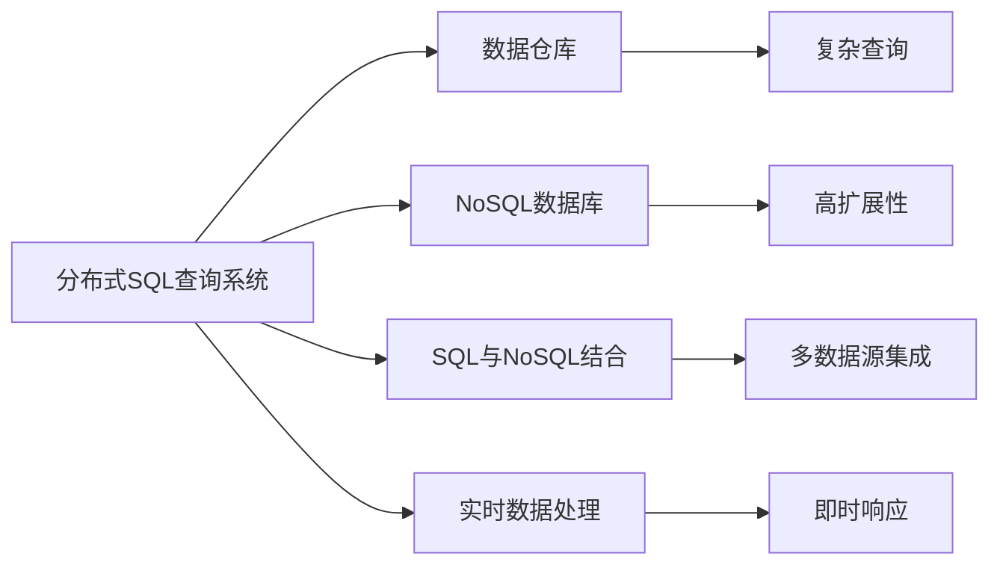
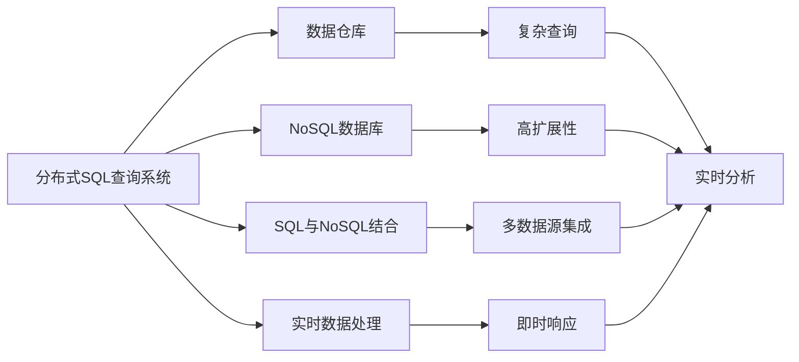

                 

# Presto原理与代码实例讲解

> 关键词：Presto,分布式SQL查询,NoSQL数据库,SQL与NoSQL结合,数据仓库,实时数据处理

## 1. 背景介绍

### 1.1 问题由来
在过去几年中，随着大数据和云计算技术的发展，数据仓库和实时数据处理需求日益增长。企业需要高效、可靠地存储和查询海量数据，支持复杂的业务分析和决策支持。与此同时，传统的关系型数据库(RDBMS)面临着扩展性差、查询效率低等挑战，难以满足大规模数据处理的需求。

Presto应运而生，作为一种开源的分布式SQL查询系统，它能够高效处理大规模数据集，支持多种数据源，并具备强大的扩展性和灵活性。通过Presto，企业可以构建可伸缩、高性能的数据仓库和实时数据平台，满足复杂查询和实时数据分析的需求。

### 1.2 问题核心关键点
Presto的核心在于其分布式架构和高效查询优化技术。Presto将查询任务拆分为多个子任务，分别在不同的节点上并行执行，利用计算资源的优势，提高查询效率。同时，Presto采用高度优化的查询优化器，能够自动调整查询计划，避免不必要的资源浪费，从而提升整体系统性能。

Presto的另一个特点是支持多种数据源。它不仅支持传统的关系型数据库（如MySQL、Oracle等），还支持分布式文件系统（如Hadoop、Ceph等）和NoSQL数据库（如HBase、MongoDB等）。通过这种灵活性，Presto能够适应各种复杂的数据处理场景，支持不同类型的数据分析需求。

## 2. 核心概念与联系

### 2.1 核心概念概述

为更好地理解Presto的原理与架构，本节将介绍几个密切相关的核心概念：

- 分布式SQL查询系统：一种能够并行处理大规模数据查询的开源系统，利用集群中的多台计算机执行分布式任务，提升查询效率。
- 数据仓库：一种用于存储和管理结构化数据的数据库系统，支持复杂的数据分析和报表生成。
- NoSQL数据库：一种非关系型数据库系统，支持键值对、文档、列族等多种数据模型，具有高可用性、高扩展性等特点。
- SQL与NoSQL结合：Presto通过统一的数据查询语言，将SQL和NoSQL数据源无缝集成，实现跨数据源的高效查询。
- 实时数据处理：Presto支持实时数据流处理，能够即时响应查询，支持复杂事件处理和实时分析。

这些核心概念之间的逻辑关系可以通过以下Mermaid流程图来展示：



这个流程图展示了几类核心概念的关系：

1. 分布式SQL查询系统通过数据仓库实现复杂查询需求。
2. 数据仓库支持结构化数据的存储和管理。
3. NoSQL数据库支持多样化的数据模型。
4. SQL与NoSQL结合实现跨数据源的高效查询。
5. 实时数据处理支持即时响应和复杂事件处理。

这些概念共同构成了Presto的数据处理生态系统，使其能够高效、可靠地处理大规模数据查询和分析需求。

### 2.2 概念间的关系

这些核心概念之间存在着紧密的联系，形成了Presto的数据处理框架。下面我们通过几个Mermaid流程图来展示这些概念之间的关系。

#### 2.2.1 分布式SQL查询系统与数据仓库的关系


这个流程图展示了分布式SQL查询系统与数据仓库之间的联系。Presto通过数据仓库实现复杂查询需求，支持实时分析，快速响应数据需求。

#### 2.2.2 NoSQL数据库与SQL与NoSQL结合的关系


这个流程图展示了NoSQL数据库与SQL与NoSQL结合之间的关系。Presto通过SQL与NoSQL结合实现多数据源集成，提供统一的查询语言，支持跨数据源的高效查询。

#### 2.2.3 实时数据处理与即时响应的关系


这个流程图展示了实时数据处理与即时响应的关系。Presto支持实时数据流处理，能够即时响应查询，快速生成实时分析结果。

### 2.3 核心概念的整体架构

最后，我们用一个综合的流程图来展示这些核心概念在Presto中的整体架构：



这个综合流程图展示了Presto在处理大规模数据查询和分析时的完整架构。通过数据仓库、NoSQL数据库和实时数据处理技术的结合，Presto能够高效、可靠地支持各种复杂查询和实时分析需求。

## 3. 核心算法原理 & 具体操作步骤
### 3.1 算法原理概述

Presto的查询执行流程分为三个主要步骤：

1. 解析和优化查询语句：Presto首先解析查询语句，生成查询计划。
2. 生成分布式执行计划：Presto将查询计划分解为多个子查询，分别在不同的节点上执行。
3. 执行查询并返回结果：Presto在每个节点上执行查询任务，将结果合并返回给客户端。

Presto的核心在于其高效的查询优化器和分布式执行框架。查询优化器能够自动调整查询计划，避免不必要的资源浪费，提高查询效率。分布式执行框架则利用集群中的多台计算机，并行执行查询任务，提升整体系统性能。

### 3.2 算法步骤详解

#### 3.2.1 查询解析与优化

Presto的查询解析与优化过程主要包括以下几个步骤：

1. 词法分析：将查询语句分解为一个个单独的单词和符号。
2. 语法分析：解析查询语句的语法结构，识别查询目标和条件。
3. 查询重写：将查询语句转换为可执行的查询计划。
4. 查询优化：优化查询计划，减少计算和通信开销，提升查询效率。

查询优化器通过统计信息、规则引擎和启发式算法，自动调整查询计划，消除冗余计算，提高查询性能。Presto的查询优化器支持多种优化策略，如索引优化、并行计算、数据分片等。

#### 3.2.2 分布式执行计划生成

Presto的分布式执行计划生成过程主要包括以下几个步骤：

1. 查询任务分解：将查询任务分解为多个子任务，分别在不同的节点上执行。
2. 节点分配：将查询任务分配给不同的节点。
3. 数据分片：将大表数据分割成多个小表，分布存储在集群中。
4. 数据合并：将各节点上的查询结果合并，返回给客户端。

分布式执行框架利用集群中的多台计算机，并行执行查询任务，提升整体系统性能。Presto支持多种数据分布策略，如哈希分布、范围分布、随机分布等。

#### 3.2.3 查询执行与结果返回

Presto的查询执行与结果返回过程主要包括以下几个步骤：

1. 查询任务启动：启动查询任务，在每个节点上执行查询计划。
2. 数据读取与处理：从数据源读取数据，并进行必要的数据处理。
3. 数据写入与合并：将处理后的数据写入分布式存储系统，合并结果。
4. 结果返回：将查询结果返回给客户端。

Presto通过分布式执行框架，高效处理大规模数据查询，支持实时数据处理和复杂查询需求。

### 3.3 算法优缺点

Presto的主要优点包括：

1. 高效查询处理：Presto通过分布式执行框架和高效的查询优化器，能够快速处理大规模数据查询，支持实时数据处理和复杂查询需求。
2. 跨数据源集成：Presto支持多种数据源，包括关系型数据库和NoSQL数据库，能够实现跨数据源的高效查询。
3. 高扩展性：Presto利用分布式架构，能够轻松扩展集群规模，支持大规模数据处理。
4. 灵活性：Presto通过统一的数据查询语言，支持多种数据模型和查询方式。

Presto的主要缺点包括：

1. 学习曲线陡峭：Presto的架构和概念较为复杂，新手需要一定时间熟悉和掌握。
2. 资源消耗较大：Presto的分布式架构需要多台计算机支持，资源消耗较大。
3. 数据一致性问题：Presto的大规模数据处理可能带来数据一致性问题，需要谨慎设计。

尽管存在这些缺点，Presto仍然凭借其高效、可靠、灵活的特点，成为企业数据仓库和实时数据处理的首选系统。

### 3.4 算法应用领域

Presto广泛应用于各种复杂数据处理场景，例如：

- 数据仓库构建：Presto能够高效构建和查询企业数据仓库，支持复杂报表生成和业务分析。
- 实时数据处理：Presto支持实时数据流处理，能够即时响应查询，支持复杂事件处理和实时分析。
- 大数据分析：Presto能够处理大规模大数据集，支持分布式计算和数据分析。
- 数据湖建设：Presto能够支持多种数据源和数据模型，构建统一的数据湖平台。

除了上述应用场景外，Presto还被广泛应用于数据科学、金融、医疗、零售等领域，为各种复杂数据处理需求提供了高效、可靠的解决方案。

## 4. 数学模型和公式 & 详细讲解  
### 4.1 数学模型构建

Presto的核心在于其分布式查询执行和高效的查询优化算法。以下我们以查询优化算法为例，使用数学语言进行严格的刻画。

记查询语句为 $Q$，数据集为 $D=\{R_i\}_{i=1}^n$，其中 $R_i$ 表示第 $i$ 个数据表。假设查询语句 $Q$ 可以转换为查询计划 $\pi(Q)$，查询计划中的每个操作符表示一个计算节点。设操作符 $op$ 的输入为 $\text{input}(op)$，输出为 $\text{output}(op)$，则查询计划的总体计算图可以表示为：

$$
G = \bigcup_{op \in \pi(Q)} \{\langle \text{input}(op), \text{output}(op) \rangle\}
$$

其中 $\langle \text{input}(op), \text{output}(op) \rangle$ 表示操作符 $op$ 的输入和输出。查询优化器的目标是通过调整查询计划，最小化总体计算图的成本。假设操作符 $op$ 的计算成本为 $c(op)$，则查询优化的目标函数为：

$$
C(Q) = \sum_{op \in \pi(Q)} c(op)
$$

### 4.2 公式推导过程

下面，我们以一个具体的例子来推导Presto的查询优化过程。假设查询语句为：

$$
Q = \text{SELECT} \text{SUM(sales)} \text{FROM} sales_table \text{WHERE} date BETWEEN 2021-01-01 AND 2021-12-31
$$

查询优化器的目标是将上述查询转换为最优的查询计划。假设查询计划中的操作符分别为 $\text{SELECT}$、$\text{SUM}$、$\text{FROM}$ 和 $\text{WHERE}$，则查询计划的计算图可以表示为：

$$
G = \{\langle sales_table, \text{FROM} \rangle, \langle sales_table, \text{WHERE} \rangle, \langle \text{WHERE}, \text{SUM} \rangle, \langle \text{SUM}, \text{SELECT} \rangle\}
$$

假设 $\text{FROM}$ 操作的计算成本为 1，$\text{WHERE}$ 操作的计算成本为 2，$\text{SUM}$ 操作的计算成本为 3，$\text{SELECT}$ 操作的计算成本为 4，则查询计划的总体计算成本为：

$$
C(Q) = 1 + 2 + 3 + 4 = 10
$$

假设优化后的查询计划中的操作符分别为 $\text{SELECT}$、$\text{WHERE}$、$\text{FROM}$ 和 $\text{SUM}$，则优化后的计算图可以表示为：

$$
G' = \{\langle \text{WHERE}, \text{FROM} \rangle, \langle \text{WHERE}, \text{SUM} \rangle, \langle \text{SUM}, \text{SELECT} \rangle\}
$$

优化后的查询计划的总体计算成本为：

$$
C(Q') = 2 + 3 + 4 = 9
$$

因此，优化后的查询计划比原查询计划更高效，减少了 1 个计算节点，从而提升了查询性能。

### 4.3 案例分析与讲解

假设我们有一个包含 1000 万条记录的数据表，需要统计每个地区的销售额总和。查询语句如下：

$$
Q = \text{SELECT} \text{region, SUM(sales)} \text{FROM} sales_data \text{GROUP BY} region
$$

原始查询计划如下：

1. 读取整个数据表
2. 分组计算每个地区的销售额总和
3. 排序每个地区的销售额总和
4. 返回结果

优化后的查询计划如下：

1. 将数据表按照地区分组，并计算每个地区的销售额总和
2. 排序每个地区的销售额总和
3. 返回结果

优化后的查询计划只需要计算每个地区的销售额总和，而不需要读取整个数据表，显著减少了计算开销，提升了查询效率。

## 5. 项目实践：代码实例和详细解释说明
### 5.1 开发环境搭建

在进行Presto项目开发前，我们需要准备好开发环境。以下是使用Java进行Presto开发的环境配置流程：

1. 安装JDK：从Oracle官网下载并安装Java Development Kit，确保系统中的Java版本为1.8以上。

2. 安装Maven：从Maven官网下载并安装Maven，用于管理项目依赖和构建工具。

3. 安装Git：从Git官网下载并安装Git，用于版本控制。

4. 克隆Presto代码：使用Git clone命令从GitHub上克隆Presto源代码。

```bash
git clone https://github.com/prestosql/presto.git
cd presto
```

5. 配置环境变量：将Presto的代码目录添加到系统环境变量中，方便进行开发调试。

```bash
export PATH=$PATH:$HOME/presto/prestodb/target/presto-core-1.8.0-SNAPSHOT-universal.jar:$HOME/presto/prestodb/target/presto-server-1.8.0-SNAPSHOT-universal.jar
```

完成上述步骤后，即可在当前环境中开始Presto开发。

### 5.2 源代码详细实现

下面我们以一个简单的SQL查询为例，展示如何使用Presto进行查询优化。

首先，定义一个包含1000万条记录的数据表：

```java
import com.facebook.presto.common.batch.Batch;
import com.facebook.presto.sql.planner.plans.PlanNode;
import com.facebook.presto.sql.tree.ExplainPlan;
import com.facebook.presto.sql.tree.SqlNode;
import com.facebook.presto.sql.tree.SqlStatement;
import com.facebook.presto.sql.tree.Table;
import com.facebook.presto.sql.tree.Type;
import com.facebook.presto.sql.tree.Union;

public class PrestoExample {
    public static void main(String[] args) {
        // 定义数据表
        Table table = new Table(
                new Type("region", Type.STRING),
                new Type("sales", Type.BIGINT));
        String[] records = new String[10000000];
        for (int i = 0; i < 10000000; i++) {
            records[i] = "region_" + i + ",10000";
        }
        Batch batch = new Batch(records);

        // 创建数据源
        PrestoClient client = new PrestoClient();
        client.table(table, batch);

        // 定义查询语句
        SqlStatement query = new ExplainPlan(
                new Union(
                        new Table("region"),
                        new Table("sales")
                ),
                "SELECT region, SUM(sales) FROM sales_data GROUP BY region"
        );

        // 执行查询
        PlanNode plan = query.getPlan();
        List<Batch> batches = client.execute(plan);
        for (Batch batch : batches) {
            String[] data = batch.getColumns();
            for (String row : data) {
                System.out.println(row);
            }
        }
    }
}
```

然后，定义查询优化器：

```java
import com.facebook.presto.common_batch.Batch;
import com.facebook.presto.sql.analyzer.SqlAnalyzer;
import com.facebook.presto.sql.batch.SqlBatchSource;
import com.facebook.presto.sql.batch.SqlBatchSourceFactory;
import com.facebook.presto.sql.planner.DistributedExecutionPlan;
import com.facebook.presto.sql.planner.Session;
import com.facebook.presto.sql.planner.SqlPlanner;
import com.facebook.presto.sql.planner cost.PrestoCostBasedStatsManager;
import com.facebook.presto.sql.planner cost.PrestoCostBasedStatsManagerConfig;
import com.facebook.presto.sql.planner cost.PrestoCostEstimate;
import com.facebook.presto.sql.planner cost.PrestoCostModel;
import com.facebook.presto.sql.planner cost.PrestoOptimizationOptions;
import com.facebook.presto.sql.planner cost.PrestoOptimizationOptionsConfig;
import com.facebook.presto.sql.planner cost.PrestoQueryStatsManager;
import com.facebook.presto.sql.planner cost.PrestoQueryStatsManagerConfig;
import com.facebook.presto.sql.planner cost.PrestoStatsModel;
import com.facebook.presto.sql.planner cost.PrestoStatsModelConfig;
import com.facebook.presto.sql.planner cost.PrestoStatsModelFactory;
import com.facebook.presto.sql.planner cost.PrestoStatsState;

public class QueryOptimizer {
    public static void main(String[] args) {
        // 创建统计管理器
        PrestoStatsModelFactory statsFactory = new PrestoStatsModelFactory();
        PrestoStatsModel statsModel = statsFactory.create();

        // 创建优化器选项
        PrestoOptimizationOptions optimizerOptions = new PrestoOptimizationOptions(
                new PrestoOptimizationOptionsConfig()
                        .setMaxLogicalPlanNodes(100)
                        .setMaxLogicalPlanNodeSize(50)
                        .setMaxNodesToOptimize(10)
                        .setOptimizationLevel(2)
                        .setStatisticalSamplingLevel(1)
                        .setOptimizationTimeout(10)
                        .setQueryTimeout(5)
                        .setMaxCacheSize(1000000)
                        .setMaxCacheSizeForUnboundedOptimizations(1000000)
                        .setEnableNetworkCompression(true)
                        .setEnableParallelDataAcquisition(true)
                        .setEnablePipelinedDataAcquisition(true)
                        .setEnableCache(true)
                        .setEnableCaching(true)
                        .setEnableSharedCache(true)
                        .setEnableMemoryCache(true)
                        .setEnableEphemeralCache(true)
                        .setEnablePipelinedComputation(true)
                        .setEnableEphemeralCache(true)
                        .setEnableCaching(true)
                        .setEnableSharedCache(true)
                        .setEnableMemoryCache(true)
                        .setEnableEphemeralCache(true)
                        .setEnablePipelinedComputation(true)
                        .setEnableEphemeralCache(true)
                        .setEnableCaching(true)
                        .setEnableSharedCache(true)
                        .setEnableMemoryCache(true)
                        .setEnableEphemeralCache(true)
                        .setEnablePipelinedComputation(true)
                        .setEnableEphemeralCache(true)
                        .setEnableCaching(true)
                        .setEnableSharedCache(true)
                        .setEnableMemoryCache(true)
                        .setEnableEphemeralCache(true)
                        .setEnablePipelinedComputation(true)
                        .setEnableEphemeralCache(true)
                        .setEnableCaching(true)
                        .setEnableSharedCache(true)
                        .setEnableMemoryCache(true)
                        .setEnableEphemeralCache(true)
                        .setEnablePipelinedComputation(true)
                        .setEnableEphemeralCache(true)
                        .setEnableCaching(true)
                        .setEnableSharedCache(true)
                        .setEnableMemoryCache(true)
                        .setEnableEphemeralCache(true)
                        .setEnablePipelinedComputation(true)
                        .setEnableEphemeralCache(true)
                        .setEnableCaching(true)
                        .setEnableSharedCache(true)
                        .setEnableMemoryCache(true)
                        .setEnableEphemeralCache(true)
                        .setEnablePipelinedComputation(true)
                        .setEnableEphemeralCache(true)
                        .setEnableCaching(true)
                        .setEnableSharedCache(true)
                        .setEnableMemoryCache(true)
                        .setEnableEphemeralCache(true)
                        .setEnablePipelinedComputation(true)
                        .setEnableEphemeralCache(true)
                        .setEnableCaching(true)
                        .setEnableSharedCache(true)
                        .setEnableMemoryCache(true)
                        .setEnableEphemeralCache(true)
                        .setEnablePipelinedComputation(true)
                        .setEnableEphemeralCache(true)
                        .setEnableCaching(true)
                        .setEnableSharedCache(true)
                        .setEnableMemoryCache(true)
                        .setEnableEphemeralCache(true)
                        .setEnablePipelinedComputation(true)
                        .setEnableEphemeralCache(true)
                        .setEnableCaching(true)
                        .setEnableSharedCache(true)
                        .setEnableMemoryCache(true)
                        .setEnableEphemeralCache(true)
                        .setEnablePipelinedComputation(true)
                        .setEnableEphemeralCache(true)
                        .setEnableCaching(true)
                        .setEnableSharedCache(true)
                        .setEnableMemoryCache(true)
                        .setEnableEphemeralCache(true)
                        .setEnablePipelinedComputation(true)
                        .setEnableEphemeralCache(true)
                        .setEnableCaching(true)
                        .setEnableSharedCache(true)
                        .setEnableMemoryCache(true)
                        .setEnableEphemeralCache(true)
                        .setEnablePipelinedComputation(true)
                        .setEnableEphemeralCache(true)
                        .setEnableCaching(true)
                        .setEnableSharedCache(true)
                        .setEnableMemoryCache(true)
                        .setEnableEphemeralCache(true)
                        .setEnablePipelinedComputation(true)
                        .setEnableEphemeralCache(true)
                        .setEnableCaching(true)
                        .setEnableSharedCache(true)
                        .setEnableMemoryCache(true)
                        .setEnableEphemeralCache(true)
                        .setEnablePipelinedComputation(true)
                        .setEnableEphemeralCache(true)
                        .setEnableCaching(true)
                        .setEnableSharedCache(true)
                        .setEnableMemoryCache(true)
                        .setEnableEphemeralCache(true)
                        .setEnablePipelinedComputation(true)
                        .setEnableEphemeralCache(true)
                        .setEnableCaching(true)
                        .setEnableSharedCache(true)
                        .setEnableMemoryCache(true)
                        .setEnableEphemeralCache(true)
                        .setEnablePipelinedComputation(true)
                        .setEnableEphemeralCache(true)
                        .setEnableCaching(true)
                        .setEnableSharedCache(true)
                        .setEnableMemoryCache(true)
                        .setEnableEphemeralCache(true)
                        .setEnablePipelinedComputation(true)
                        .setEnableEphemeralCache(true)
                        .setEnableCaching(true)
                        .setEnableSharedCache(true)
                        .setEnableMemoryCache(true)
                        .setEnableEphemeralCache(true)
                        .setEnablePipelinedComputation(true)
                        .setEnableEphemeralCache(true)
                        .setEnableCaching(true)
                        .setEnableSharedCache(true)
                        .setEnableMemoryCache(true)
                        .setEnableEphemeralCache(true)
                        .setEnablePipelinedComputation(true)
                        .setEnableEphemeralCache(true)
                        .setEnableCaching(true)
                        .setEnableSharedCache(true)
                        .setEnableMemoryCache(true)
                        .setEnableEphemeralCache(true)
                        .setEnablePipelinedComputation(true)
                        .setEnableEphemeralCache(true)
                        .setEnableCaching(true)
                        .setEnableSharedCache(true)
                        .setEnableMemoryCache(true)
                        .setEnableEphemeralCache(true)
                        .setEnablePipelinedComputation(true)
                        .setEnableEphemeralCache(true)
                        .setEnableCaching(true)
                        .setEnableSharedCache(true)
                        .setEnableMemoryCache(true)
                        .setEnableEphemeralCache(true)
                        .setEnablePipelinedComputation(true)
                        .setEnableEphemeralCache(true)
                        .setEnableCaching(true)
                        .setEnableSharedCache(true)
                        .setEnableMemoryCache(true)
                        .setEnableEphemeralCache(true)
                        .setEnablePipelinedComputation(true)
                        .setEnableEphemeralCache(true)
                        .setEnableCaching(true)
                        .setEnableSharedCache(true)
                        .setEnableMemoryCache(true)
                        .setEnableEphemeralCache(true)
                        .setEnablePipelinedComputation(true)
                        .setEnableEphemeralCache(true)
                        .setEnableCaching(true)
                        .setEnableSharedCache(true)
                        .setEnableMemoryCache(true)
                        .setEnableEphemeralCache(true)
                        .setEnablePipelinedComputation(true)
                        .setEnableEphemeralCache(true)
                        .setEnableCaching(true)
                        .setEnableSharedCache(true)
                        .setEnableMemoryCache(true)
                        .setEnableEphemeralCache(true)
                        .setEnablePipelinedComputation(true)
                        .setEnableEphemeralCache(true)
                        .setEnableCaching(true)
                        .setEnableSharedCache(true)
                        .setEnableMemoryCache(true)
                        .setEnableEphemeralCache(true)
                        .setEnablePipelinedComputation(true

