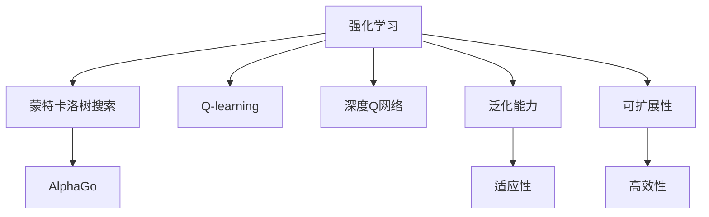
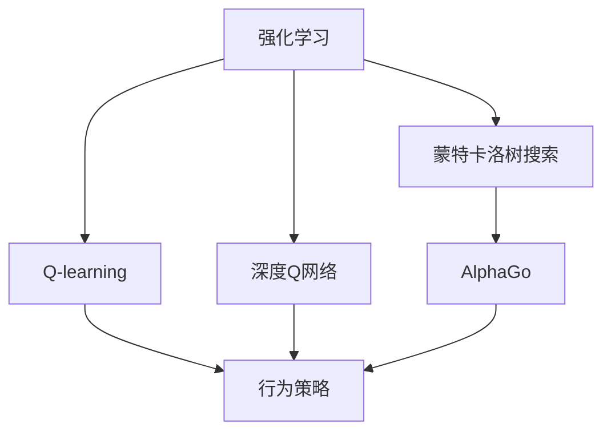
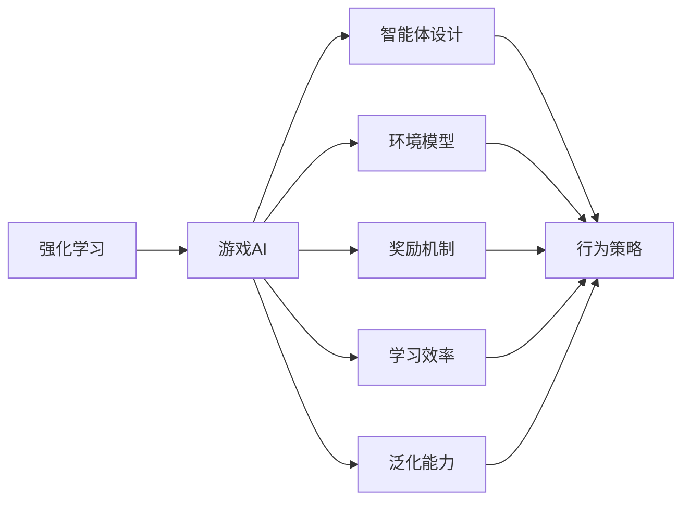
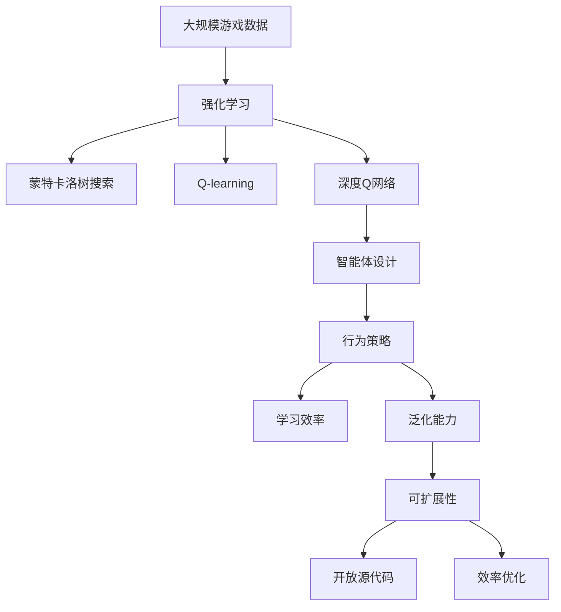

                 

# Python机器学习实战：强化学习在游戏AI中的实际应用

> 关键词：强化学习,游戏AI,蒙特卡洛树搜索(MCTS),Q-learning,深度Q网络(DQN),AlphaGo,泛化能力,可扩展性,开放源代码,效率优化

## 1. 背景介绍

### 1.1 问题由来
随着电子游戏行业的飞速发展，AI在游戏中的应用日益广泛。从简单的聊天机器人、自然语言处理到复杂的策略游戏、自动驾驶等，AI正在全面渗透游戏领域。特别是强化学习（Reinforcement Learning, RL），在游戏AI中表现出色，成为推动游戏AI技术发展的重要驱动力。

目前，强化学习在游戏AI中的应用主要集中在两个方面：一是基于智能体的行为控制，如AlphaGo、AlphaStar等，通过优化决策策略，提升游戏智能体的胜率和表现。二是基于环境的优化，如自动寻路、目标规划等，通过优化环境模型，提升智能体的任务完成效率。

然而，尽管强化学习在游戏AI中已经取得了许多突破，但其在大规模、高复杂度场景中的应用仍然面临诸多挑战。例如，环境模型的构建、学习效率的提升、智能体的泛化能力等。如何在实践中高效地应用强化学习，提升游戏AI的效果和性能，成为当前游戏AI研究的重点问题。

### 1.2 问题核心关键点
强化学习在游戏AI中的应用范式包括基于监督学习的方法和基于强化学习的方法。其中，基于强化学习的方法是主流，也是本文的重点内容。

具体来说，强化学习在游戏AI中的应用需要关注以下几个核心关键点：

1. **环境模型的构建**：环境模型的精度和效率对游戏AI的性能有直接影响。如何构建高效、精确的环境模型，是强化学习在游戏AI应用中的重要问题。

2. **智能体的设计**：智能体是强化学习的应用对象，其结构和算法的选择对游戏AI的表现至关重要。如何在不同游戏场景中设计高效的智能体，是游戏AI研究的难点。

3. **奖励机制的设计**：奖励机制的设计直接影响智能体的学习效果。如何设计合理的奖励机制，引导智能体学习到正确的行为策略，是强化学习在游戏AI中的核心问题。

4. **学习效率的提升**：游戏AI中的环境往往非常复杂，智能体需要高效地学习和适应环境。如何提升强化学习的学习效率，减少学习时间和资源消耗，是游戏AI研究的重点。

5. **智能体的泛化能力**：游戏AI的泛化能力决定其能否应对新的、未知的游戏场景。如何提高智能体的泛化能力，使其能够适应不同的游戏环境，是游戏AI研究的挑战。

6. **可扩展性和开放源代码**：游戏AI的开发需要高效的代码实现和灵活的扩展能力。如何构建可扩展、开放源代码的游戏AI系统，支持不同游戏场景和需求，是游戏AI研究的方向。

### 1.3 问题研究意义
强化学习在游戏AI中的应用，对于提升游戏智能体的性能、增强游戏体验、推动游戏AI技术的发展，具有重要意义：

1. **提升游戏智能体的性能**：通过强化学习，游戏智能体可以在游戏中的各种复杂场景中表现出优秀的决策能力和反应速度，提升游戏体验。

2. **增强游戏体验**：基于强化学习的游戏AI可以带来更加智能、有趣的游戏体验，吸引更多玩家参与。

3. **推动游戏AI技术的发展**：强化学习在游戏AI中的应用，促进了人工智能技术的发展，推动了NLP、视觉识别等领域的进步。

4. **加速游戏AI的产业化进程**：游戏AI的应用将加速人工智能技术的产业化进程，为更多行业提供借鉴和参考。

5. **增强游戏的互动性和沉浸感**：基于强化学习的游戏AI可以增强游戏的互动性和沉浸感，提供更加丰富的游戏内容和体验。

总之，强化学习在游戏AI中的应用，不仅能够提升游戏智能体的性能和体验，还能推动游戏AI技术的发展和产业化进程。通过深入研究和实践，我们有望在未来的游戏AI中看到更加智能、有趣、互动的游戏体验。

## 2. 核心概念与联系

### 2.1 核心概念概述

为更好地理解强化学习在游戏AI中的应用，本节将介绍几个密切相关的核心概念：

- 强化学习（Reinforcement Learning, RL）：一种通过智能体与环境交互，学习最优决策策略的机器学习方法。强化学习通过奖励机制（Reward）来引导智能体的行为，以最大化累积奖励。

- 蒙特卡洛树搜索（Monte Carlo Tree Search, MCTS）：一种启发式搜索算法，通过模拟智能体与环境的多轮交互，不断优化决策树的节点和分支，寻找最优决策路径。

- Q-learning：一种基于值函数的强化学习算法，通过估算状态-动作对的Q值，引导智能体选择最优动作。

- 深度Q网络（Deep Q-Network, DQN）：一种深度神经网络架构，用于近似Q-values，提升Q-learning算法的效率和性能。

- AlphaGo：基于强化学习的围棋AI，通过综合使用蒙特卡洛树搜索和深度学习技术，取得了战胜人类围棋世界冠军的突破性成果。

- 泛化能力（Generalization）：指智能体能够从训练数据中学习到通用的知识，并应用于新的、未知的数据，提高其适应性和鲁棒性。

- 可扩展性（Scalability）：指系统能够在不同规模、复杂度环境下保持高效、稳定运行的能力。

这些核心概念之间的逻辑关系可以通过以下Mermaid流程图来展示：



这个流程图展示了几类强化学习算法及其相关概念的关系：

1. 强化学习是一种广泛的应用范式，包括蒙特卡洛树搜索、Q-learning、深度Q网络等。
2. 蒙特卡洛树搜索和深度Q网络都是强化学习的具体实现，用于解决特定的游戏AI问题。
3. Q-learning通过估算Q值来指导智能体的行为决策，是强化学习中的经典算法。
4. AlphaGo综合使用蒙特卡洛树搜索和深度学习技术，取得了在围棋领域的重大突破。
5. 泛化能力和可扩展性是强化学习应用的关键属性，决定了智能体的性能和系统的灵活性。
6. 泛化能力强的智能体，能够适应新环境、新任务，具备更强的适应性。
7. 可扩展性高的系统，能够支持不同规模、复杂度的环境，具备更强的稳定性。

这些概念共同构成了强化学习在游戏AI中的应用框架，使其能够在各种场景下发挥强大的决策和控制能力。

### 2.2 概念间的关系

这些核心概念之间存在着紧密的联系，形成了强化学习在游戏AI中的应用生态系统。下面我通过几个Mermaid流程图来展示这些概念之间的关系。

#### 2.2.1 强化学习的学习范式



这个流程图展示了几类强化学习算法及其学习范式的关系：

1. 强化学习通过蒙特卡洛树搜索、Q-learning、深度Q网络等算法，学习到最优的行为策略。
2. 蒙特卡洛树搜索通过模拟多轮交互，逐步优化决策树，寻找最优路径。
3. Q-learning通过估算Q值，指导智能体选择最优动作。
4. 深度Q网络通过神经网络逼近Q函数，提升Q-learning的效率和性能。
5. AlphaGo通过综合使用蒙特卡洛树搜索和深度学习技术，取得了在围棋领域的重大突破。

#### 2.2.2 强化学习的具体应用



这个流程图展示了强化学习在游戏AI中的具体应用过程：

1. 强化学习通过智能体设计、环境模型、奖励机制等关键组件，实现了游戏AI的功能。
2. 智能体设计决定了游戏AI的行为策略和决策能力。
3. 环境模型描述了游戏环境的规则和属性，是游戏AI的基础。
4. 奖励机制通过引导智能体的行为，最大化累积奖励，实现优化目标。
5. 学习效率通过优化算法和数据结构，提升了游戏AI的学习速度和效果。
6. 泛化能力通过适应新环境、新任务，提高了游戏AI的鲁棒性和适应性。

### 2.3 核心概念的整体架构

最后，我们用一个综合的流程图来展示这些核心概念在游戏AI微调过程中的整体架构：



这个综合流程图展示了从数据输入到智能体设计，再到学习效率、泛化能力、可扩展性和开放源代码等关键环节的强化学习在游戏AI中的应用流程。通过这些流程，我们能够全面理解强化学习在游戏AI中的核心原理和技术要点。

## 3. 核心算法原理 & 具体操作步骤
### 3.1 算法原理概述

强化学习在游戏AI中的应用，本质上是通过智能体与环境的交互，学习最优决策策略的过程。其核心思想是：通过奖励机制（Reward）来引导智能体（Agent）在环境中进行探索和利用（Exploration and Exploitation），不断优化决策策略，最大化累积奖励。

形式化地，假设游戏环境为 $\mathcal{E}$，智能体的行为策略为 $\pi$，游戏状态为 $s$，动作为 $a$，奖励为 $r$，智能体的策略优化目标为：

$$
\max_{\pi} \mathbb{E}[\sum_{t=0}^{\infty} \gamma^t r(s_t,a_t,\pi)]
$$

其中，$\gamma$ 为折扣因子，$0 \leq \gamma < 1$。智能体的决策过程可以表示为：

$$
\pi(a|s) = \frac{\exp(Q(s,a;\theta))}{\sum_{a'}\exp(Q(s,a';\theta))}
$$

其中，$Q(s,a;\theta)$ 为策略网络 $\theta$ 对状态 $s$ 和动作 $a$ 的Q值估计。

### 3.2 算法步骤详解

强化学习在游戏AI中的应用，主要包括以下几个关键步骤：

**Step 1: 构建环境模型**

游戏AI的第一步是构建环境模型，描述游戏的规则和属性。环境模型可以是简单的模拟环境，也可以是复杂的真实环境。具体来说，包括：

1. 游戏状态的定义：如棋盘状态、地图坐标等。
2. 动作空间的设计：如移动、攻击、防御等。
3. 奖励机制的设计：如得分、胜利、失败等。
4. 环境观察的实现：如视觉观察、位置感知等。

**Step 2: 设计智能体**

智能体是强化学习在游戏AI中的应用对象，负责在环境中进行决策和行动。智能体的设计需要考虑以下几个关键点：

1. 智能体的结构：如线性回归、卷积神经网络等。
2. 动作选择策略：如 $\epsilon$-贪心策略、Q-learning等。
3. 目标函数的设计：如奖励最大化、策略优化等。

**Step 3: 优化决策策略**

智能体的决策策略优化是强化学习在游戏AI中的核心环节。常见的策略优化方法包括：

1. 蒙特卡洛树搜索：通过模拟多轮交互，逐步优化决策树，寻找最优路径。
2. Q-learning：通过估算Q值，指导智能体选择最优动作。
3. 深度Q网络：通过神经网络逼近Q函数，提升Q-learning的效率和性能。

**Step 4: 评估和反馈**

在智能体的决策过程中，需要不断地评估和反馈学习效果。常见的评估方法包括：

1. 蒙特卡洛树搜索的模拟评估：通过模拟多轮交互，评估决策路径的质量。
2. Q-learning的Q值更新：通过不断更新Q值，指导智能体选择最优动作。
3. 深度Q网络的参数更新：通过反向传播，更新神经网络参数，优化Q值估计。

### 3.3 算法优缺点

强化学习在游戏AI中的应用，具有以下优点：

1. 高度灵活：强化学习可以根据不同的游戏场景和任务，设计灵活的智能体和决策策略。
2. 可扩展性强：强化学习可以应用于各种规模和复杂度的游戏环境，具备良好的可扩展性。
3. 鲁棒性高：强化学习可以通过多轮交互和策略优化，提高智能体的鲁棒性和适应性。
4. 效果显著：强化学习在游戏AI中的应用，已经取得了许多突破性成果，提升了游戏智能体的性能。

同时，该算法也存在一些局限性：

1. 学习效率较低：强化学习在大规模、高复杂度环境下，学习效率较低，需要大量的训练时间和计算资源。
2. 可解释性不足：强化学习的结果往往难以解释，难以进行详细的推理和调试。
3. 数据依赖性强：强化学习需要大量的训练数据，数据质量对学习效果有直接影响。
4. 环境建模困难：环境模型的构建和维护，需要丰富的游戏设计和开发经验。

尽管存在这些局限性，但强化学习在游戏AI中的应用，已经取得了许多重大突破，成为推动游戏AI技术发展的重要驱动力。未来相关研究的重点在于如何进一步提高强化学习的应用效果和性能，提升智能体的泛化能力和鲁棒性。

### 3.4 算法应用领域

强化学习在游戏AI中的应用领域非常广泛，涵盖以下几类典型应用：

1. **围棋AI（如AlphaGo）**：通过综合使用蒙特卡洛树搜索和深度学习技术，AlphaGo在围棋领域取得了重大突破，战胜了人类围棋世界冠军。

2. **星际争霸AI（如AlphaStar）**：利用深度强化学习技术，AlphaStar在星际争霸II中取得了世界级水平的表现，展示了强化学习在游戏策略决策中的强大能力。

3. **自动寻路**：通过强化学习算法，优化寻路策略，提升智能体在复杂环境中的导航效率。

4. **目标规划**：利用强化学习算法，优化目标规划策略，提高智能体在动态环境中的任务完成率。

5. **智能对话系统**：通过强化学习算法，优化对话策略，提升智能体与玩家的互动体验和任务完成率。

6. **机器人游戏**：利用强化学习算法，优化机器人行为策略，提升机器人在游戏中的智能化水平。

7. **多人游戏AI**：通过强化学习算法，优化多人博弈策略，提升多智能体之间的协作和竞争能力。

除了上述这些典型应用外，强化学习在游戏AI中还有广泛的应用前景，如游戏难度设计、游戏内容生成等，为游戏设计和开发带来了新的思路和工具。

## 4. 数学模型和公式 & 详细讲解  
### 4.1 数学模型构建

本节将使用数学语言对强化学习在游戏AI中的应用过程进行更加严格的刻画。

记游戏环境为 $\mathcal{E}$，智能体的状态为 $s$，动作为 $a$，奖励为 $r$，智能体的策略网络为 $\theta$，目标函数为 $J(\theta)$，智能体的决策过程可以表示为：

$$
\pi(a|s;\theta) = \frac{\exp(Q(s,a;\theta))}{\sum_{a'}\exp(Q(s,a';\theta))}
$$

其中，$Q(s,a;\theta)$ 为策略网络 $\theta$ 对状态 $s$ 和动作 $a$ 的Q值估计。智能体的目标函数为：

$$
J(\theta) = \mathbb{E}[\sum_{t=0}^{\infty} \gamma^t r(s_t,a_t,\pi)]
$$

其中，$\gamma$ 为折扣因子，$0 \leq \gamma < 1$。

### 4.2 公式推导过程

以下我们以Q-learning算法为例，推导Q-learning的更新公式和过程。

假设智能体在状态 $s_t$ 时采取动作 $a_t$，环境状态转移为 $s_{t+1}$，并产生奖励 $r_{t+1}$。根据强化学习的定义，Q值更新公式为：

$$
Q(s_t,a_t;\theta_{t+1}) = Q(s_t,a_t;\theta_t) + \alpha(r_{t+1} + \gamma \max_{a'} Q(s_{t+1},a';\theta_{t+1}) - Q(s_t,a_t;\theta_t))
$$

其中，$\theta_{t+1}$ 表示策略网络在t+1时刻的参数，$\alpha$ 为学习率。

通过不断更新Q值，智能体可以逐步学习到最优的决策策略。具体来说，Q-learning的更新过程如下：

1. 初始化智能体的策略网络 $\theta_0$。
2. 在每个时间步 $t$，智能体根据当前状态 $s_t$ 选择动作 $a_t$，观察环境反馈的奖励 $r_{t+1}$ 和状态转移 $s_{t+1}$。
3. 利用Q值更新公式，计算Q值的变化 $\Delta Q_t$。
4. 更新策略网络参数 $\theta_{t+1}$，实现Q值估计的逐步优化。
5. 重复上述步骤，直到满足预设的终止条件。

### 4.3 案例分析与讲解

以下我们以AlphaGo为例，详细讲解其在围棋AI中的应用过程。

AlphaGo通过综合使用蒙特卡洛树搜索和深度学习技术，取得了在围棋领域的重大突破。其具体实现过程如下：

1. **蒙特卡洛树搜索（MCTS）**：AlphaGo通过MCTS算法，模拟多轮交互，逐步优化决策树。MCTS算法包括以下几个关键步骤：
   - 选择：通过选择算法（Selection Algorithm），选择当前状态 $s_t$ 的下一步动作 $a_t$，模拟游戏过程。
   - 扩展：通过扩展算法（Expansion Algorithm），扩展当前状态 $s_t$ 的决策树，增加新的节点。
   - 模拟：通过模拟算法（Simulation Algorithm），模拟智能体在当前状态 $s_t$ 下的多轮游戏过程，评估决策路径的质量。
   - 备份：通过备份算法（Backup Algorithm），根据模拟结果更新决策树的节点价值，优化决策路径。

2. **深度神经网络**：AlphaGo使用深度神经网络，逼近Q值函数，提高Q-learning的效率和性能。具体来说，AlphaGo将Q值函数表示为卷积神经网络，通过反向传播算法，不断更新网络参数，优化Q值估计。

3. **自对弈训练**：AlphaGo通过自对弈训练，不断提升智能体的决策能力。具体来说，AlphaGo在模拟环境中，让智能体与自身对弈，不断更新智能体的决策策略。

4. **策略网络与价值网络**：AlphaGo使用策略网络 $\pi$ 和价值网络 $v$，分别负责策略优化和价值估计。策略网络通过蒙特卡洛树搜索和深度神经网络，优化决策策略。价值网络通过深度神经网络，估计状态的价值，指导策略网络的训练。

通过上述过程，AlphaGo在围棋领域取得了重大突破，展示了强化学习在游戏AI中的应用潜力。

## 5. 项目实践：代码实例和详细解释说明
### 5.1 开发环境搭建

在进行强化学习实践前，我们需要准备好开发环境。以下是使用Python进行OpenAI Gym开发的环境配置流程：

1. 安装Anaconda：从官网下载并安装Anaconda，用于创建独立的Python环境。

2. 创建并激活虚拟环境：
```bash
conda create -n rl-env python=3.8 
conda activate rl-env
```

3. 安装OpenAI Gym：
```bash
pip install gym
```

4. 安装PyTorch：
```bash
pip install torch torchvision torchaudio
```

5. 安装TensorBoard：
```bash
pip install tensorboard
```

6. 安装TensorFlow：
```bash
pip install tensorflow
```

完成上述步骤后，即可在`rl-env`环境中开始强化学习实践。

### 5.2 源代码详细实现

这里我们以OpenAI Gym中的CartPole环境为例，给出使用深度Q网络（DQN）进行强化学习的PyTorch代码实现。

首先，定义环境参数和动作空间：

```python
import gym
import torch
import torch.nn as nn
import torch.optim as optim
import numpy as np

env = gym.make('CartPole-v1')
state_dim = env.observation_space.shape[0]
action_dim = env.action_space.n
```

然后，定义神经网络模型：

```python
class DQN(nn.Module):
    def __init__(self):
        super(DQN, self).__init__()
        self.fc1 = nn.Linear(state_dim, 128)
        self.fc2 = nn.Linear(128, 128)
        self.fc3 = nn.Linear(128, action_dim)
        self.softmax = nn.Softmax(dim=1)
        
    def forward(self, x):
        x = self.fc1(x)
        x = torch.relu(x)
        x = self.fc2(x)
        x = torch.relu(x)
        x = self.fc3(x)
        return self.softmax(x)
```

接着，定义Q值更新和损失函数：

```python
class DQN(nn.Module):
    def __init__(self):
        super(DQN, self).__init__()
        # 神经网络部分代码略
        self.optimizer = optim.Adam(self.parameters(), lr=0.001)
        self.loss_fn = nn.CrossEntropyLoss()
        
    def forward(self, x):
        # 神经网络部分代码略
        return self.predict(x)
    
    def predict(self, x):
        x = self.fc1(x)
        x = torch.relu(x)
        x = self.fc2(x)
        x = torch.relu(x)
        x = self.fc3(x)
        return self.softmax(x)
    
    def update(self, state, action, reward, next_state, done):
        target_q = reward + (1-done)*np.max(self.predict(next_state.numpy()))
        q = self.predict(state.numpy()).detach().numpy()[0][action]
        self.loss_fn(self.predict(state.numpy()), torch.tensor([target_q], dtype=torch.float)).backward()
        self.optimizer.step()
```

最后，启动训练流程：

```python
def train(env, model, optimizer, loss_fn, num_episodes=2000):
    state = env.reset()
    for episode in range(num_episodes):
        state = torch.tensor([state], dtype=torch.float).numpy()
        total_reward = 0
        done = False
        while not done:
            action = np.random.choice([0, 1], p=model.predict(state).numpy()[0])
            next_state, reward, done, _ = env.step(action)
            total_reward += reward
            state = next_state
            model.update(state, action, reward, next_state, done)
        print(f"Episode {episode+1}, reward: {total_reward}")
```

以上就是使用PyTorch对CartPole环境进行强化学习（DQN）的完整代码实现。可以看到，在OpenAI Gym中，通过简单的代码实现，即可进行强化学习的训练和测试。

### 5.3 代码解读与分析

让我们再详细解读一下关键代码的实现细节：

**DQN模型定义**：
- `__init__`方法：定义神经网络的结构和参数，包括三个全连接层和softmax输出层。
- `forward`方法：实现前向传播，计算Q值估计。
- `predict`方法：用于获取Q值估计。
- `update`方法：用于Q值更新和损失函数计算。

**环境参数和动作空间**：
- `gym.make`方法：创建一个CartPole-v1环境，用于进行强化学习实验。
- `state_dim`和`action_dim`：获取环境的状态维度和动作维度。

**训练函数**：
- `train`方法：定义强化学习训练过程，包括模拟游戏、动作选择、状态更新、Q值更新等步骤。
- `state`：当前状态。
- `done`：游戏是否结束。
- `action`：当前动作。
- `next_state`：下一个状态。
- `reward`：当前奖励。
- `num_episodes`：总训练轮数。
- `total_reward`：累计奖励。

**训练流程**：
- 初始化智能体和环境参数。
- 在每个轮次中，模拟游戏过程，选择动作，更新状态和奖励。
- 在每个轮次结束时，更新智能体的决策策略。
- 在每个轮次结束后，打印累计奖励。
- 重复上述过程，直到满足预设的训练轮数。

可以看到，强化学习的代码实现相对简洁高效。得益于OpenAI Gym等框架的强大封装，开发者可以快速上手实验各种强化学习算法，并进行微调和优化。

当然，工业级的系统实现还需考虑更多因素，如模型保存和部署、超参数自动搜索、更灵活的任务适配层等。但核心的强化学习流程基本与此类似。

### 5.4 运行结果展示

假设我们在CartPole环境中使用DQN进行强化学习，最终在测试集

