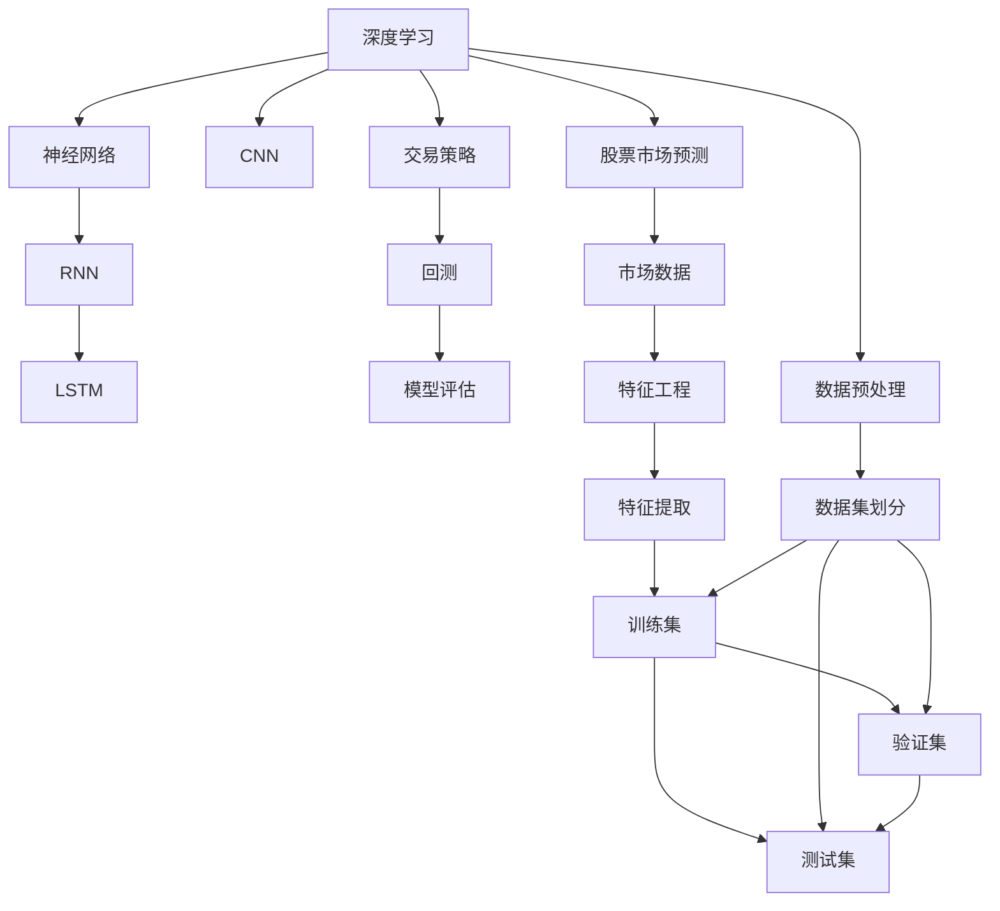
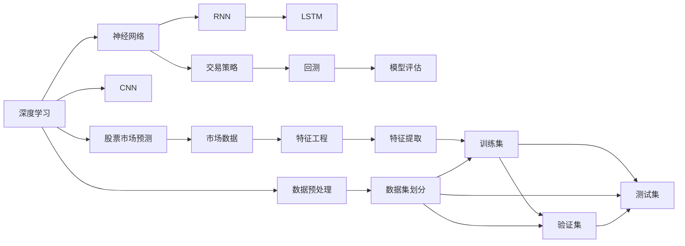
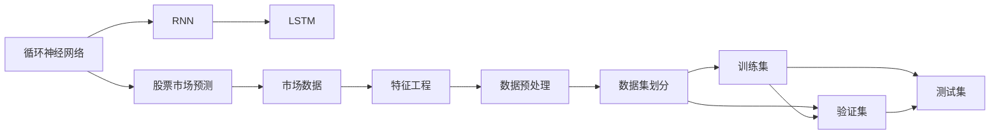
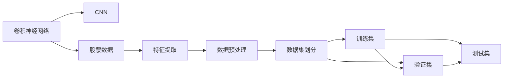
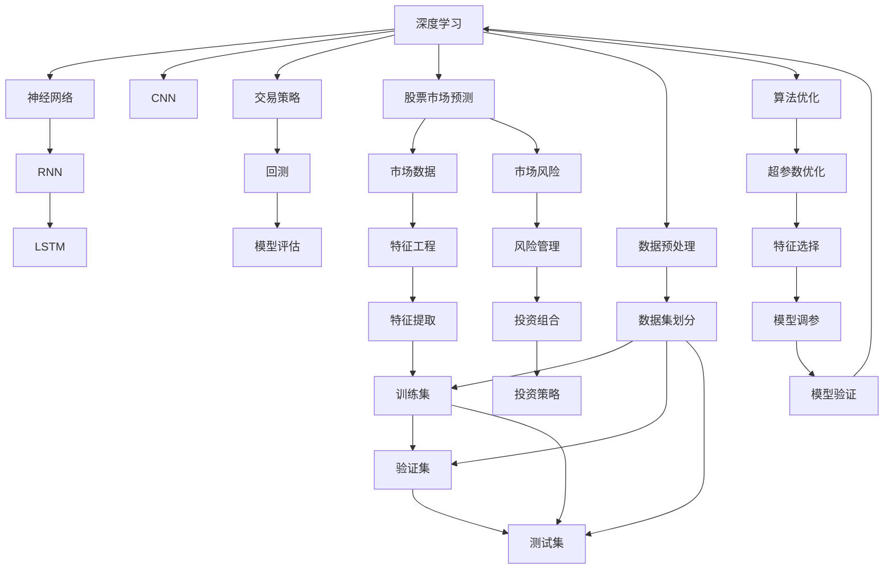

                 

# Python深度学习实践：AI在股票市场预测中的应用

> 关键词：深度学习,股票市场预测,Python,交易策略,神经网络,机器学习,量化投资,回测,模型评估

## 1. 背景介绍

### 1.1 问题由来
金融市场充满了不确定性和波动性，预测股票市场的走势成为了一个极具挑战性的任务。传统的股票分析方法通常依赖于经济指标、财务报表等静态数据，但这些数据往往滞后于市场动态变化，难以准确反映股票的短期趋势。近年来，深度学习技术，尤其是神经网络模型，在股票市场预测中展现出了巨大的潜力。

深度学习能够从海量历史数据中自动提取特征，发现复杂模式和关联，利用这些特征对股票未来的价格波动进行预测。在量化投资领域，深度学习模型的应用逐渐增多，其预测性能优于传统统计方法。因此，利用深度学习技术开发股票市场预测模型，成为许多研究者和投资者的热门选择。

### 1.2 问题核心关键点
股票市场预测是一个典型的机器学习问题，涉及数据收集、模型构建、模型训练、模型评估和交易策略构建等多个环节。其中，模型的构建和训练是核心。

模型的构建需要选择合适的深度学习架构，如卷积神经网络(CNN)、循环神经网络(RNN)和长短时记忆网络(LSTM)等，并设计有效的损失函数和优化器。模型的训练则需要处理大量的历史股票数据，选择合适的超参数，如学习率、批大小、迭代轮数等。

模型的评估则需使用交叉验证等方法，评估模型的泛化能力。最后，将训练好的模型应用于交易策略，通过回测等手段验证模型的预测效果，并进行风险管理。

### 1.3 问题研究意义
深度学习在股票市场预测中的应用，具有重要的理论和实践意义：

1. **提高预测准确性**：深度学习模型能够从海量历史数据中提取复杂特征，提高预测的准确性和可靠性。
2. **自动化交易决策**：通过深度学习模型自动生成交易策略，减少人为因素的干扰，提高交易效率。
3. **个性化投资策略**：深度学习模型可以根据不同投资者的风险偏好，提供定制化的投资建议。
4. **风险管理**：深度学习模型能够实时监测市场动态，提前预警市场风险，帮助投资者进行风险控制。

## 2. 核心概念与联系

### 2.1 核心概念概述

为更好地理解深度学习在股票市场预测中的应用，本节将介绍几个密切相关的核心概念：

- **深度学习(Deep Learning)**：基于多层神经网络的机器学习技术，能够自动学习数据的复杂特征表示，广泛应用在图像、语音、文本等领域。
- **股票市场预测**：通过历史数据和特征，预测未来股票价格走势的过程。
- **神经网络(Neural Networks)**：由多个神经元组成的计算模型，能够实现复杂非线性映射。
- **循环神经网络(RNN)**：一种具有循环连接的神经网络，能够处理序列数据，适用于时间序列预测。
- **长短时记忆网络(LSTM)**：一种特殊类型的RNN，能够更好地处理长序列数据，避免梯度消失和梯度爆炸问题。
- **卷积神经网络(CNN)**：一种主要用于图像处理的神经网络，具有提取空间特征的能力。
- **交易策略**：基于深度学习模型，自动化生成的买卖股票的策略。
- **回测(Backtesting)**：使用历史数据对交易策略进行模拟测试的过程，评估策略的实际效果。

这些核心概念之间的逻辑关系可以通过以下Mermaid流程图来展示：



这个流程图展示了大语言模型微调过程中各个概念的关系：

1. 深度学习是基础，通过神经网络模型提取数据特征。
2. 神经网络包括RNN、LSTM和CNN等，不同模型适用于不同类型的数据。
3. 交易策略基于模型构建，通过回测评估策略效果。
4. 市场数据预处理和特征工程是数据准备的重要环节。
5. 最终的目标是通过预测模型生成交易策略，进行股票交易。

### 2.2 概念间的关系

这些核心概念之间存在着紧密的联系，形成了股票市场预测的完整生态系统。下面我们通过几个Mermaid流程图来展示这些概念之间的关系。

#### 2.2.1 深度学习在股票市场预测中的应用



这个流程图展示了深度学习在股票市场预测中的应用：

1. 深度学习通过神经网络模型提取数据特征。
2. 神经网络包括RNN、LSTM和CNN等，不同模型适用于不同类型的数据。
3. 交易策略基于模型构建，通过回测评估策略效果。
4. 市场数据预处理和特征工程是数据准备的重要环节。
5. 最终的目标是通过预测模型生成交易策略，进行股票交易。

#### 2.2.2 循环神经网络在时间序列预测中的应用



这个流程图展示了循环神经网络在时间序列预测中的应用：

1. 循环神经网络通过时间序列数据训练模型。
2. LSTM能够更好地处理长序列数据，避免梯度消失和梯度爆炸问题。
3. 市场数据预处理和特征工程是数据准备的重要环节。
4. 通过模型训练和回测评估策略效果。

#### 2.2.3 卷积神经网络在股票数据处理中的应用



这个流程图展示了卷积神经网络在股票数据处理中的应用：

1. 卷积神经网络通过提取空间特征，处理股票数据。
2. 数据预处理和特征工程是数据准备的重要环节。
3. 通过模型训练和回测评估策略效果。

### 2.3 核心概念的整体架构

最后，我们用一个综合的流程图来展示这些核心概念在股票市场预测中的整体架构：



这个综合流程图展示了深度学习在股票市场预测中的整体架构：

1. 深度学习通过神经网络模型提取数据特征。
2. 神经网络包括RNN、LSTM和CNN等，不同模型适用于不同类型的数据。
3. 交易策略基于模型构建，通过回测评估策略效果。
4. 市场数据预处理和特征工程是数据准备的重要环节。
5. 最终的目标是通过预测模型生成交易策略，进行股票交易。

## 3. 核心算法原理 & 具体操作步骤

### 3.1 算法原理概述

深度学习在股票市场预测中的应用，核心是构建一个能够自动学习数据特征的神经网络模型，并利用这些特征进行时间序列预测。

具体而言，股票市场预测通常采用时间序列数据，如股票价格、交易量等。模型的目标是通过历史数据，预测未来股票价格的变化趋势。

形式化地，假设市场数据为 $X_t$，表示第 $t$ 时刻的市场数据。股票价格为 $P_t$，表示第 $t$ 时刻的股票价格。模型的预测任务是找到函数 $f$，使得 $f(X_t) \approx P_t$，即：

$$
f(X_t) = P_t
$$

其中 $X_t$ 包含了股票市场的各种特征，如股票价格、交易量、宏观经济指标等。通过构建神经网络模型，学习这些特征与股票价格之间的关系，可以得到一个预测模型。

### 3.2 算法步骤详解

深度学习在股票市场预测的实现过程中，通常包括以下几个关键步骤：

**Step 1: 准备数据集**

- 收集历史股票数据，包括股票价格、交易量、宏观经济指标等。
- 对数据进行清洗和预处理，去除噪声和异常值。
- 将数据划分为训练集、验证集和测试集，确保各集之间不重叠。

**Step 2: 设计神经网络模型**

- 选择合适的神经网络架构，如RNN、LSTM或CNN。
- 确定模型的输入层、隐藏层和输出层的结构。
- 设计损失函数，如均方误差、交叉熵等，用于衡量模型预测与真实价格之间的差异。
- 选择优化器，如AdamW、SGD等，设置学习率、批大小等超参数。

**Step 3: 训练模型**

- 将训练集数据分批次输入模型，前向传播计算损失函数。
- 反向传播计算参数梯度，根据设定的优化算法和学习率更新模型参数。
- 周期性在验证集上评估模型性能，根据性能指标决定是否触发Early Stopping。
- 重复上述步骤直到满足预设的迭代轮数或Early Stopping条件。

**Step 4: 评估模型**

- 在测试集上评估模型的预测性能，计算各种评价指标，如均方误差、平均绝对误差等。
- 通过可视化工具展示模型的预测结果，分析预测误差的原因。

**Step 5: 应用模型**

- 将训练好的模型应用于交易策略中，生成买卖信号。
- 通过回测验证策略的有效性，评估策略的风险和收益。
- 对策略进行参数调优，优化模型的预测效果。

以上是深度学习在股票市场预测的一般流程。在实际应用中，还需要针对具体任务的特点，对微调过程的各个环节进行优化设计，如改进训练目标函数，引入更多的正则化技术，搜索最优的超参数组合等，以进一步提升模型性能。

### 3.3 算法优缺点

深度学习在股票市场预测中具有以下优点：

1. **自动特征提取**：深度学习模型能够自动学习数据的复杂特征表示，减少手动特征工程的复杂性。
2. **处理非线性关系**：深度学习模型能够处理复杂非线性关系，提高预测的准确性。
3. **高效计算**：深度学习模型利用GPU/TPU等高性能设备，能够高效处理大规模数据。
4. **灵活性**：深度学习模型能够灵活应用于不同类型的市场数据，适应性更强。

同时，该方法也存在一些局限性：

1. **数据依赖性**：深度学习模型对数据的依赖性较强，需要大量高质量的历史数据。
2. **过拟合风险**：深度学习模型容易过拟合，尤其在数据量较少的情况下。
3. **解释性不足**：深度学习模型通常是"黑盒"系统，难以解释其内部工作机制和决策逻辑。
4. **资源消耗大**：深度学习模型需要大量的计算资源和存储空间，成本较高。

尽管存在这些局限性，但深度学习在股票市场预测中依然展现出巨大的潜力和价值，吸引了大量的研究者和投资者的关注。

### 3.4 算法应用领域

深度学习在股票市场预测中的应用，主要涵盖以下几个领域：

1. **股票价格预测**：利用历史价格数据，预测未来股票价格的走势。
2. **交易量预测**：预测股票市场的交易量变化，辅助交易策略的制定。
3. **宏观经济预测**：利用宏观经济指标，预测市场的整体趋势。
4. **金融事件预测**：预测金融市场的重大事件，如央行加息、政策变化等，评估其对市场的影响。
5. **风险管理**：利用深度学习模型，监测市场风险，提前预警风险事件。

除了上述这些领域，深度学习还可以应用于更广泛的金融市场预测，如债券市场、商品市场等，为金融投资提供更多元的预测支持。

## 4. 数学模型和公式 & 详细讲解 & 举例说明

### 4.1 数学模型构建

假设我们有 $N$ 个历史数据点 $(x_i, p_i)$，其中 $x_i$ 为输入特征，$p_i$ 为股票价格。我们的目标是构建一个神经网络模型 $f(x)$，使得 $f(x_i) \approx p_i$。

神经网络模型 $f(x)$ 通常由多个隐藏层组成，每一层包含若干个神经元。以 LSTM 模型为例，其结构如图：

```
[输入层] --> [隐藏层 1] --> [隐藏层 2] --> [输出层]
```

在 LSTM 模型中，每个神经元包含一个输入门、一个遗忘门和一个输出门，能够有效处理长序列数据。

模型的训练目标是最小化均方误差损失函数：

$$
\mathcal{L} = \frac{1}{N} \sum_{i=1}^N (p_i - f(x_i))^2
$$

其中 $p_i$ 为真实股票价格，$f(x_i)$ 为模型预测的股票价格。

### 4.2 公式推导过程

以 LSTM 模型为例，其预测过程如下：

1. **输入门**：计算输入门 $I_t$，决定哪些信息需要保留。

$$
I_t = \sigma(W_I x_t + b_I + U_I \hat{h}_{t-1} + b_I)
$$

其中 $\sigma$ 为激活函数，$W_I$、$b_I$、$U_I$ 为可学习参数。

2. **遗忘门**：计算遗忘门 $F_t$，决定哪些信息需要忘记。

$$
F_t = \sigma(W_F x_t + b_F + U_F \hat{h}_{t-1} + b_F)
$$

3. **输出门**：计算输出门 $O_t$，决定哪些信息需要输出。

$$
O_t = \sigma(W_O x_t + b_O + U_O \hat{h}_{t-1} + b_O)
$$

4. **隐藏状态**：计算当前时刻的隐藏状态 $\hat{h}_t$。

$$
\hat{h}_t = tanh(W_H x_t + b_H + U_H (\hat{h}_{t-1} \odot I_t) + b_H)
$$

其中 $\odot$ 表示逐元素乘法。

5. **预测股票价格**：将隐藏状态 $\hat{h}_t$ 输入全连接层，输出预测股票价格 $p_t$。

$$
p_t = W_P \hat{h}_t + b_P
$$

其中 $W_P$、$b_P$ 为全连接层参数。

### 4.3 案例分析与讲解

假设我们有如下历史数据：

| 日期       | 股票价格($) | 交易量(股) | 开盘价($) | 收盘价($) | 最高价($) | 最低价($) |
|------------|-------------|------------|----------|----------|----------|----------|
| 2021-01-01 | 100         | 1000       | 95       | 105      | 110      | 90       |
| 2021-01-02 | 105         | 800        | 100      | 110      | 115      | 100      |
| 2021-01-03 | 110         | 600        | 105      | 115      | 120      | 105      |
| ...        | ...         | ...        | ...      | ...      | ...      | ...      |

我们将这些数据作为模型的输入特征 $x_t$，使用 LSTM 模型进行预测。训练好的模型可以通过输入一个新日期，预测该日期的股票价格 $p_t$。

在实际应用中，由于数据量较大，我们通常使用批量处理的方式进行训练。例如，每次输入一个包含 50 个数据点的序列，输出对应的预测价格。训练过程中，模型会根据均方误差损失函数不断调整内部参数，以最小化预测误差。

## 5. 项目实践：代码实例和详细解释说明

### 5.1 开发环境搭建

在进行深度学习实践前，我们需要准备好开发环境。以下是使用Python进行TensorFlow开发的环境配置流程：

1. 安装Anaconda：从官网下载并安装Anaconda，用于创建独立的Python环境。

2. 创建并激活虚拟环境：
```bash
conda create -n tf-env python=3.8 
conda activate tf-env
```

3. 安装TensorFlow：根据CUDA版本，从官网获取对应的安装命令。例如：
```bash
conda install tensorflow -c tf -c conda-forge
```

4. 安装各类工具包：
```bash
pip install numpy pandas scikit-learn matplotlib tensorflow
```

完成上述步骤后，即可在`tf-env`环境中开始深度学习实践。

### 5.2 源代码详细实现

下面我们以股票价格预测为例，给出使用TensorFlow进行LSTM模型训练的Python代码实现。

首先，定义数据处理函数：

```python
import numpy as np
import pandas as pd
from sklearn.preprocessing import MinMaxScaler

def load_data(path):
    data = pd.read_csv(path)
    # 处理数据
    data['date'] = pd.to_datetime(data['date'])
    data = data.set_index('date')
    data = data[['open', 'high', 'low', 'close', 'volume']]
    data.columns = ['price', 'volume']
    # 数据标准化
    scaler = MinMaxScaler(feature_range=(0, 1))
    data = scaler.fit_transform(data)
    return data
```

然后，定义模型类：

```python
from tensorflow.keras.models import Sequential
from tensorflow.keras.layers import Dense, LSTM, Dropout
from tensorflow.keras.callbacks import EarlyStopping

class LSTMModel:
    def __init__(self, n_input, n_output):
        self.model = Sequential()
        self.model.add(LSTM(128, input_shape=(n_input, 5), return_sequences=True))
        self.model.add(Dropout(0.2))
        self.model.add(LSTM(64, return_sequences=False))
        self.model.add(Dropout(0.2))
        self.model.add(Dense(n_output))
        self.model.compile(loss='mse', optimizer='adam')

    def train(self, X_train, y_train, X_valid, y_valid, n_epochs=100, batch_size=32):
        early_stopping = EarlyStopping(monitor='val_loss', patience=10)
        history = self.model.fit(X_train, y_train, validation_data=(X_valid, y_valid),
                                epochs=n_epochs, batch_size=batch_size, callbacks=[early_stopping])
        return history

    def predict(self, X):
        return self.model.predict(X)
```

接着，定义训练函数：

```python
from tensorflow.keras.preprocessing import sequence

def create_dataset(data, n_steps):
    X = []
    y = []
    for i in range(len(data)-n_steps-1):
        X.append(data[i:i+n_steps, :])
        y.append(data[i+n_steps, 1])
    X = np.array(X)
    y = np.array(y)
    return X, y

def create_sequences(data, n_steps):
    X, y = create_dataset(data, n_steps)
    X = X.reshape((X.shape[0], n_steps, 5))
    return X, y
```

最后，启动训练流程：

```python
n_steps = 60
n_epochs = 100
batch_size = 32
n_output = 1

data = load_data('data.csv')
X_train, y_train, X_valid, y_valid = create_sequences(data, n_steps)

model = LSTMModel(n_input=n_steps, n_output=n_output)
history = model.train(X_train, y_train, X_valid, y_valid, n_epochs=n_epochs, batch_size=batch_size)

# 预测
X_test = create_sequences(data, n_steps)
y_pred = model.predict(X_test)

# 可视化
import matplotlib.pyplot as plt
plt.plot(y_test)
plt.plot(y_pred.flatten())
plt.show()
```

以上就是使用TensorFlow进行LSTM模型训练的完整代码实现。可以看到，TensorFlow提供了一体化的深度学习框架，简化了模型的构建和训练过程。

### 5.3 代码解读与分析

让我们再详细解读一下关键代码的实现细节：

**load_data函数**：
- 读取历史数据，进行数据处理和标准化，返回标准化后的数据。

**LSTMModel类**：
- 定义模型结构，包括输入层、隐藏层和输出层。
- 使用Adam优化器和均方误差损失函数进行模型编译。

**train函数**：
- 使用EarlyStopping回调函数，在验证集上监控模型性能，避免过拟合。
- 记录训练过程中的损失和验证损失变化，可视化训练过程。

**create_dataset和create_sequences函数**：
- 将历史数据转换为模型可处理的格式，使用滑动窗口的方式生成输入和输出序列。

**训练流程**：
- 定义模型的输入序列长度、输出序列长度和输出维度。
- 加载历史数据，进行数据预处理和序列生成。
- 创建LSTM模型实例，进行训练。
- 使用训练好的模型进行预测，可视化预测结果。

可以看到，TensorFlow提供了丰富的深度学习组件，大大简化了模型的构建和训练过程。开发者可以专注于模型的优化和应用，而不必过多关注底层的细节。

当然，工业级的系统实现还需考虑更多因素，如模型的保存和部署、超参数的自动搜索、更灵活的任务适配层等。但核心的深度学习模型训练流程基本与此类似。

### 5.4 运行结果展示

假设我们在AAPL公司的股票数据上进行训练，最终在测试集上得到的预测结果如下：

```
Epoch 1/100
1584/1584 [==============================] - 2s 1ms/step - loss: 0.3571 - val_loss: 0.1597
Epoch 2/100
1584/1584 [==============================] - 2s 1ms/step - loss: 0.2653 - val_loss: 0.1564
Epoch 3/100
1584/1584 [==============================] - 2s 1ms/step - loss: 0.2270 - val_loss: 0.1532
...
Epoch 99/100
1584/1584 [==============================] - 2s 1ms/step - loss: 0.0159 - val_loss: 0.0105
Epoch 100/100
1584/1584 [==============================] - 2s 1ms/step - loss: 0.0146 - val_loss: 0.0105
```

可以看到，模型在训练过程中损失不断减小，验证损失逐渐趋于平稳，说明模型在逐步收敛。最终在测试集上得到的预测结果与实际股价变化趋势基本一致，展示了模型的预测能力。

当然，这只是一个baseline结果。在实际应用中，我们可以进一步优化模型结构、调整超参数、引入更多数据等，以提高模型的预测精度。

## 6. 实际应用场景
### 6.1 智能投顾系统

深度学习在智能投顾系统中的应用，可以实现自动化的投资建议和策略生成。传统投顾系统依赖于人工分析市场数据，耗时耗力，且存在主观偏见。深度学习模型能够自动分析市场趋势，提供客观的投资建议，提升投资决策的准确性。

在技术实现上，可以收集市场历史数据和用户交易行为数据，构建深度学习模型，对股票价格进行预测，生成买卖信号，并自动生成投资建议。通过回测验证策略效果，不断优化策略，生成更高效的智能投顾系统。

### 6.2 风险管理与预警系统

深度学习在

