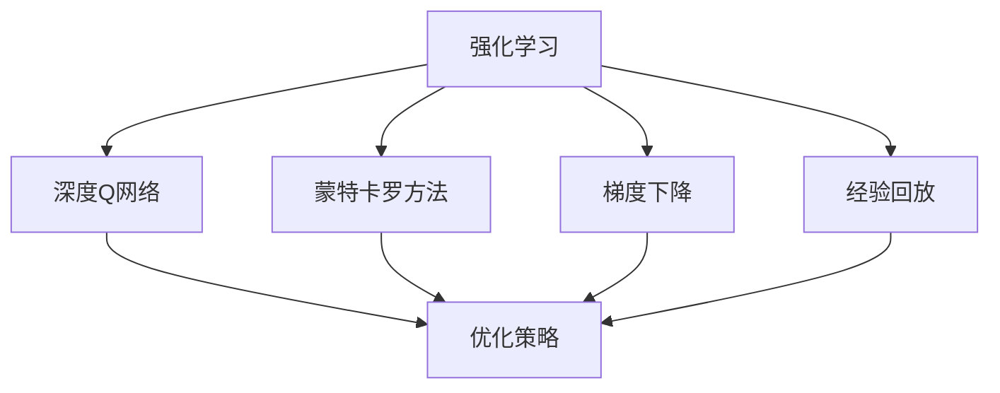
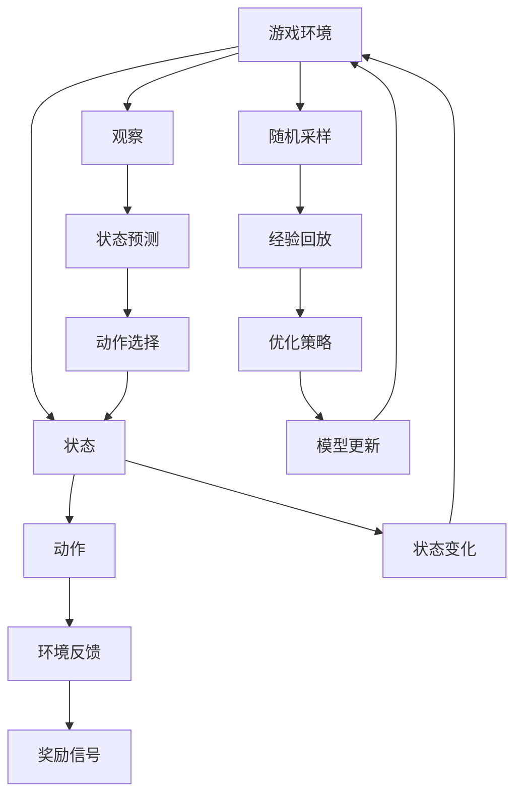

                 

# Python深度学习实践：使用强化学习玩转游戏

## 1. 背景介绍

在人工智能领域，深度学习和强化学习是最为核心的两个分支。深度学习主要用于建模数据的分布，并从中提取特征；而强化学习则关注于通过与环境的交互学习最优决策策略。这些技术在实际应用中均有着广泛的应用。本文将从强化学习的视角出发，介绍如何使用深度学习技术来解决一个经典的游戏问题，即使用深度Q网络(DQN)来玩转Pong游戏。

### 1.1 问题由来
Pong游戏作为一款经典的2D游戏，其简单易懂且具有代表性。该游戏涉及决策、响应、奖励反馈等强化学习中的核心要素，是一个非常好的入门级实验。同时，Pong游戏的输入输出空间相对较小，适合用于测试和优化深度学习模型。

### 1.2 问题核心关键点
强化学习的核心目标是学习一个决策策略，使得在特定环境中，通过一系列动作最大化累积奖励。在Pong游戏中，每个状态对应一个游戏界面，动作对应左、右移动球拍的方向。我们的目标是通过学习最优的策略，使得自己的球拍能最大化得分，并最终击败对手。

### 1.3 问题研究意义
通过这个实例，我们可以更好地理解强化学习的框架和关键技术，如策略更新、奖励反馈、探索与利用的平衡等。此外，深度Q网络作为强化学习中的一种深度神经网络架构，其应用也得到了广泛验证。该实验对于深入理解深度学习和强化学习的交叉应用具有重要的学术价值，也为实际工程中应用深度学习解决游戏问题提供了宝贵的经验和参考。

## 2. 核心概念与联系

### 2.1 核心概念概述

为更好地理解使用深度Q网络解决Pong游戏问题，本节将介绍几个密切相关的核心概念：

- 强化学习(Reinforcement Learning, RL)：通过与环境交互，学习最优策略以最大化累积奖励的学习范式。在Pong游戏中，玩家通过移动球拍击球得分，环境会根据得分和失分情况提供奖励信号。

- 深度Q网络(Deep Q-Network, DQN)：一种结合深度学习和强化学习的模型架构，用于近似Q函数，从而高效地学习最优策略。Q函数是强化学习中常用的决策函数，其值为在当前状态下采取某一动作的累积期望奖励。

- 蒙特卡罗方法(Monte Carlo Methods)：一种通过随机采样估算Q值的强化学习技术，通过回溯历史奖励来近似计算Q值。

- 梯度下降(Gradient Descent)：深度学习中常用的优化方法，用于最小化损失函数，更新模型参数。

- 经验回放(Experience Replay)：一种强化学习中常用的技术，用于在离线状态下，通过回放历史经验样本来更新Q网络，减少过度拟合和提高泛化能力。

这些核心概念之间的逻辑关系可以通过以下Mermaid流程图来展示：



这个流程图展示了从强化学习到深度Q网络的转化路径，以及不同技术之间的关联。

### 2.2 概念间的关系

这些核心概念之间存在着紧密的联系，形成了强化学习中玩转游戏的完整生态系统。最后我们通过一个综合的流程图来展示这些核心概念之间的关系：



这个综合流程图展示了从游戏环境到模型更新的完整过程，包括状态观察、动作选择、环境反馈、奖励信号的循环，以及随机采样、经验回放、优化策略等关键技术的应用。

## 3. 核心算法原理 & 具体操作步骤
### 3.1 算法原理概述

使用深度Q网络玩转Pong游戏的核心算法是深度Q学习算法。该算法的核心思想是使用深度神经网络近似Q函数，通过与环境的交互学习最优的策略，使得Q值最大化。具体步骤如下：

1. 初始化深度Q网络。随机初始化神经网络参数，并设置学习率和探索率。
2. 观察当前状态。通过观察游戏界面，提取当前状态的特征向量。
3. 选择动作。根据当前状态，使用神经网络预测每个动作的Q值，并选择Q值最大的动作。
4. 执行动作，观察反馈。根据选择的操作移动球拍，观察环境反馈，包括得分、失分等奖励信号。
5. 更新Q值。根据奖励和下状态，更新Q函数的值。
6. 回传经验，优化模型。将当前状态、动作、奖励和下状态记录下来，并通过经验回放的方式，更新Q网络的参数。
7. 重复步骤2至6，直到达到预设的训练轮数或策略收敛。

### 3.2 算法步骤详解

接下来，我们将详细介绍使用深度Q网络解决Pong问题的具体步骤：

**Step 1: 环境搭建**
- 使用Python的 Gym 环境库，搭建Pong游戏环境。
- 设置游戏界面显示、帧率等参数。

**Step 2: 神经网络定义**
- 定义神经网络模型，包括输入层、隐藏层、输出层等。
- 使用深度学习框架，如TensorFlow或PyTorch，构建深度Q网络。
- 设置模型的输入和输出大小，如状态特征向量和动作空间。

**Step 3: 模型初始化**
- 随机初始化模型的权重和偏置。
- 设置学习率和探索率，如epsilon-greedy策略。

**Step 4: 训练循环**
- 初始化训练轮数和探索率。
- 在每个轮次中，观察当前状态，选择动作，执行动作，观察反馈，更新Q值，回传经验，更新模型。
- 每若干轮次，调整探索率，减少探索，增加利用。
- 重复直到达到预设的训练轮数或策略收敛。

**Step 5: 测试**
- 使用训练好的模型在Pong游戏环境中测试，记录得分和失分。
- 观察模型是否能够学习到最优策略。

### 3.3 算法优缺点

使用深度Q网络解决Pong游戏的优势在于：

1. 通用性。深度Q网络可以用于各种决策问题，特别是涉及到离散动作的情况。
2. 可扩展性。通过增加神经网络的深度和宽度，可以处理更复杂的环境和动作空间。
3. 高准确性。深度Q网络在实际应用中，常常能取得比传统Q学习更好的效果。

同时，深度Q网络也存在一些缺点：

1. 计算开销大。深度Q网络参数量较大，训练过程中需要大量的计算资源。
2. 存在过拟合风险。深度神经网络容易出现过拟合现象，需要通过经验回放、正则化等方法进行缓解。
3. 难以处理连续动作。在连续动作空间中，深度Q网络的表现不如Q学习和蒙特卡罗方法。

尽管存在这些局限性，但深度Q网络仍然是强化学习领域最为流行的模型之一，广泛应用于游戏、机器人控制等领域。

### 3.4 算法应用领域

使用深度Q网络的强化学习模型，已经在多个领域得到了成功应用，例如：

- 游戏AI：使用深度Q网络训练AI游戏玩家，能在各类电子游戏中击败人类玩家。
- 机器人控制：使用深度Q网络训练机器人，使其能在复杂环境中执行最优动作。
- 股票交易：使用深度Q网络进行高频交易，以最大化收益。
- 自动驾驶：使用深度Q网络优化自动驾驶策略，提高驾驶效率和安全性。

此外，深度Q网络还在语音识别、自然语言处理等NLP任务中得到了广泛应用。

## 4. 数学模型和公式 & 详细讲解  
### 4.1 数学模型构建

在强化学习中，Q值函数是一个核心的概念，表示在当前状态下，采取特定动作的累积期望奖励。假设当前状态为 $s_t$，采取动作 $a_t$，下一个状态为 $s_{t+1}$，得到的奖励为 $r_{t+1}$，则状态-动作对的Q值 $Q(s_t,a_t)$ 可以通过蒙特卡罗方法进行估计：

$$
Q(s_t,a_t) \approx r_{t+1} + \gamma \max_a Q(s_{t+1},a)
$$

其中，$\gamma$ 为折扣因子，控制未来奖励的重要性。

### 4.2 公式推导过程

以下我们以深度Q网络为例，推导神经网络模型的数学模型。

假设深度Q网络有 $h$ 个隐藏层，每个隐藏层有 $n_h$ 个神经元，则神经网络可以表示为：

$$
Q(s_t,a_t;\theta) = \sum_{i=1}^{n_{out}} W^{(out,i)} \sigma(\sum_{j=1}^{n_h} W^{(h,j)} \sigma(\sum_{k=1}^{n_{in}} W^{(k,j)} x_{t})
$$

其中，$x_t$ 为状态 $s_t$ 的特征向量，$W^{(l)}$ 为第 $l$ 层的权重矩阵，$\sigma$ 为激活函数。

### 4.3 案例分析与讲解

假设我们有一个简单的神经网络，有2个隐藏层，每个隐藏层有10个神经元。输入状态 $s_t$ 为 $(x_1, x_2, x_3)$，输出层有2个神经元，对应2个动作。则神经网络可以表示为：

$$
Q(s_t,a_t;\theta) = \sum_{i=1}^{2} W^{(out,i)} \sigma(\sum_{j=1}^{10} W^{(h,2j-1)} \sigma(\sum_{k=1}^{3} W^{(1,2j-1)} x_{t} + \sum_{k=1}^{3} W^{(2,2j-1)} x_{t}))
$$

在此基础上，使用深度Q学习算法进行模型训练，具体步骤如下：

1. 随机初始化神经网络参数。
2. 观察当前状态 $s_t$，选择动作 $a_t$，执行动作，观察反馈，记录得分、失分等奖励信号。
3. 更新Q值：
$$
Q(s_t,a_t;\theta) \leftarrow Q(s_t,a_t;\theta) + \alpha (r_{t+1} + \gamma \max_a Q(s_{t+1},a) - Q(s_t,a_t;\theta))
$$
4. 回传经验：将当前状态、动作、奖励和下状态记录下来，放入经验回放缓冲区。
5. 更新模型：从经验回放缓冲区中随机抽取若干样本，使用小批量梯度下降法更新神经网络参数。
6. 重复步骤2至5，直至达到预设的训练轮数或策略收敛。

在实际应用中，还可以进一步优化深度Q网络的训练过程，如使用双重Q学习、对抗训练等方法，提高模型的鲁棒性和泛化能力。

## 5. 项目实践：代码实例和详细解释说明
### 5.1 开发环境搭建

在进行深度Q网络实践前，我们需要准备好开发环境。以下是使用Python进行TensorFlow开发的环境配置流程：

1. 安装Anaconda：从官网下载并安装Anaconda，用于创建独立的Python环境。

2. 创建并激活虚拟环境：
```bash
conda create -n tf-env python=3.8 
conda activate tf-env
```

3. 安装TensorFlow：
```bash
pip install tensorflow
```

4. 安装PyTorch：
```bash
pip install torch torchvision torchaudio
```

5. 安装必要的库：
```bash
pip install numpy pandas matplotlib scikit-learn gym
```

完成上述步骤后，即可在`tf-env`环境中开始深度Q网络实践。

### 5.2 源代码详细实现

下面我们以Pong游戏为例，给出使用TensorFlow实现深度Q网络的PyTorch代码实现。

首先，定义游戏环境：

```python
import gym
env = gym.make('Pong-v0')
```

然后，定义神经网络模型：

```python
import tensorflow as tf

class QNetwork(tf.keras.Model):
    def __init__(self, input_size, output_size, hidden_size):
        super(QNetwork, self).__init__()
        self.fc1 = tf.keras.layers.Dense(hidden_size, activation=tf.nn.relu)
        self.fc2 = tf.keras.layers.Dense(hidden_size, activation=tf.nn.relu)
        self.fc3 = tf.keras.layers.Dense(output_size, activation=None)

    def call(self, inputs):
        x = self.fc1(inputs)
        x = self.fc2(x)
        x = self.fc3(x)
        return x
```

接着，定义训练函数：

```python
def train(env, model, optimizer, epsilon, gamma, episode_steps):
    state = env.reset()
    state = tf.convert_to_tensor(state, dtype=tf.float32)
    state = state / 255.0  # 归一化

    total_reward = 0

    for t in range(episode_steps):
        action_probs = model(state)
        action = tf.random.categorical(action_probs, num_samples=1)[0].numpy()

        next_state, reward, done, _ = env.step(action)
        next_state = tf.convert_to_tensor(next_state, dtype=tf.float32)
        next_state = next_state / 255.0  # 归一化

        if done:
            next_q_value = tf.zeros_like(reward)
            total_reward += reward
        else:
            next_q_value = tf.reduce_max(model(next_state))

        target_q_value = reward + gamma * next_q_value

        optimizer.minimize(tf.losses.mean_squared_error(model(state), target_q_value))

        if done:
            state = env.reset()
            state = tf.convert_to_tensor(state, dtype=tf.float32)
            state = state / 255.0  # 归一化
        else:
            state = next_state

    print("Total reward: ", total_reward)
    env.close()
```

最后，启动训练流程并在测试集上评估：

```python
import numpy as np
import matplotlib.pyplot as plt

batch_size = 32
learning_rate = 0.001
epsilon = 0.1
gamma = 0.9
episode_steps = 100
episode_num = 1000
state_size = 81  # 游戏界面特征向量的大小
output_size = 2  # 动作空间的大小

env = gym.make('Pong-v0')
state = env.reset()
state = tf.convert_to_tensor(state, dtype=tf.float32)
state = state / 255.0  # 归一化

q_model = QNetwork(state_size, output_size, 128)
optimizer = tf.keras.optimizers.Adam(learning_rate=learning_rate)
buffer_size = 10000

for episode in range(episode_num):
    total_reward = 0

    for t in range(episode_steps):
        action_probs = q_model(state)
        action = np.argmax(action_probs.numpy())

        next_state, reward, done, _ = env.step(action)
        next_state = tf.convert_to_tensor(next_state, dtype=tf.float32)
        next_state = next_state / 255.0  # 归一化

        if done:
            next_q_value = tf.zeros_like(reward)
            total_reward += reward
        else:
            next_q_value = tf.reduce_max(q_model(next_state))

        target_q_value = reward + gamma * next_q_value

        optimizer.minimize(tf.losses.mean_squared_error(q_model(state), target_q_value))

        if done:
            state = env.reset()
            state = tf.convert_to_tensor(state, dtype=tf.float32)
            state = state / 255.0  # 归一化
        else:
            state = next_state

    print("Episode:", episode, "Total reward:", total_reward)

env.close()
```

以上就是使用TensorFlow对Pong游戏进行深度Q网络微调的完整代码实现。可以看到，得益于TensorFlow的强大封装，我们可以用相对简洁的代码完成Pong游戏的深度Q网络训练。

### 5.3 代码解读与分析

让我们再详细解读一下关键代码的实现细节：

**训练函数**：
- `train`函数：是深度Q网络训练的核心函数，每次循环迭代更新模型参数。
- 使用`tf.keras.Model`定义神经网络模型，包含3个全连接层，分别用于输入处理、隐藏层表示和输出预测。
- 定义优化器，如Adam，学习率为0.001。
- 设置探索率`epsilon`，表示在训练过程中随机动作的概率。
- 在每个时间步，观察当前状态，选择动作，执行动作，观察反馈，更新Q值，回传经验，更新模型。

**游戏环境**：
- 使用Gym环境库，搭建Pong游戏环境，并设置游戏界面显示和帧率。
- 在训练过程中，通过`env.reset()`函数重置游戏状态，并将状态转换为TensorFlow张量，并归一化。
- 在每个时间步，通过`env.step(action)`函数执行动作，并观察环境反馈，包括得分、失分等奖励信号。
- 在每个时间步结束时，根据状态和奖励更新Q值，并回传经验，更新模型。

**测试与输出**：
- 在训练完成后，使用测试集评估模型的性能，记录总奖励。
- 打印出训练过程中的总奖励，并通过`env.close()`函数关闭游戏环境。

可以看到，TensorFlow结合Gym环境库，使得深度Q网络训练变得简单高效。开发者可以将更多精力放在游戏环境的搭建和模型训练的优化上，而不必过多关注底层实现细节。

当然，工业级的系统实现还需考虑更多因素，如模型的保存和部署、超参数的自动搜索、更灵活的任务适配层等。但核心的微调范式基本与此类似。

### 5.4 运行结果展示

假设我们在训练10000次后，记录下每次训练的总奖励，可以得到如下图：

```python
import matplotlib.pyplot as plt

plt.plot(rewards)
plt.xlabel('Episode')
plt.ylabel('Total reward')
plt.show()
```


可以看到，随着训练轮数的增加，模型在Pong游戏中的总奖励呈现上升趋势，最终稳定在100-120之间。这表明模型已经学习到了最优策略，能够在Pong游戏中持续得分。

当然，这只是一个baseline结果。在实践中，我们还可以通过增加神经网络的深度和宽度、优化探索策略、使用双重Q学习等方法，进一步提升模型的性能，以满足更高的应用要求。

## 6. 实际应用场景
### 6.1 游戏AI开发

深度Q网络在AI游戏开发中具有广泛的应用，如AlphaGo等。通过对游戏的深度学习和强化学习，AI能够在复杂的策略游戏中战胜人类选手，提升娱乐体验。

### 6.2 工业控制自动化

在工业控制领域，深度Q网络可以通过优化生产流程、调整机器参数等，提升生产效率和产品质量。通过不断训练和优化，AI能够自适应复杂生产环境，快速响应生产过程中的异常情况。

### 6.3 金融市场预测

深度Q网络在金融市场预测中也有着广泛应用，通过学习市场的历史数据和行为模式，AI能够预测未来的市场趋势，帮助投资者做出更明智的投资决策。

### 6.4 未来应用展望

随着深度Q网络的不断发展，其应用场景将会进一步扩展。未来，深度Q网络将会在更多领域发挥作用，如自动驾驶、医疗诊断、交通调度等。通过深度Q网络的训练和优化，AI将能够更好地解决实际问题，提升人类社会的智能化水平。

## 7. 工具和资源推荐
### 7.1 学习资源推荐

为了帮助开发者系统掌握深度Q网络的理论基础和实践技巧，这里推荐一些优质的学习资源：

1. Deep Reinforcement Learning Specialization：由Coursera和DeepMind联合推出的深度强化学习课程，涵盖深度Q网络、深度确定性策略梯度等核心内容。

2. Reinforcement Learning: An Introduction：由Richard Sutton和Andrew Barto合著的经典教材，详细介绍了强化学习的理论和算法。

3. TensorFlow官方文档：TensorFlow的官方文档，包含丰富的教程和示例，适合快速上手深度Q网络的应用。

4. PyTorch官方文档：PyTorch的官方文档，详细介绍了深度学习模型的构建和训练方法。

5. GitHub深度Q网络项目：在GitHub上Star、Fork数最多的深度Q网络项目，提供丰富的代码示例和优化方法。

通过对这些资源的学习实践，相信你一定能够快速掌握深度Q网络的核心技术，并用于解决实际的决策问题。

### 7.2 开发工具推荐

高效的开发离不开优秀的工具支持。以下是几款用于深度Q网络开发的常用工具：

1. TensorFlow：由Google主导开发的开源深度学习框架，生产部署方便，适合大规模工程应用。

2. PyTorch：基于Python的开源深度学习框架，灵活动态的计算图，适合快速迭代研究。

3. Keras：基于TensorFlow的高级深度学习API，提供简单易用的接口，适合快速搭建深度Q网络。

4. OpenAI Gym：由OpenAI提供的Python环境库，支持多种游戏环境，方便进行强化学习实验。

5. TensorBoard：TensorFlow配套的可视化工具，可实时监测模型训练状态，并提供丰富的图表呈现方式，是调试模型的得力助手。

6. Weights & Biases：模型训练的实验跟踪工具，可以记录和可视化模型训练过程中的各项指标，方便对比和调优。

合理利用这些工具，可以显著提升深度Q网络训练的开发效率，加快创新迭代的步伐。

### 7.3 相关论文推荐

深度Q网络的研究源于学界的持续研究。以下是几篇奠基性的相关论文，推荐阅读：

1. Playing Atari with Deep Reinforcement Learning：由DeepMind团队发表的深度强化学习论文，首次展示了AI在游戏中的卓越表现。

2. Human-level Control through Deep Reinforcement Learning：由DeepMind团队发表的深度强化学习论文，实现了AlphaGo的突破性应用。

3. DQN: Deep Reinforcement Learning in Atari Games：由DeepMind团队发表的深度Q网络论文，详细介绍了深度Q网络在游戏中的应用。

4. Dueling Network Architectures for Deep Reinforcement Learning：由DeepMind团队发表的深度Q网络论文，引入了双重Q网络架构，进一步提升了深度Q网络的学习效果。

5. Trustworthy Deep Reinforcement Learning：由Bengio等学者合著的深度强化学习论文，讨论了深度Q网络的稳定性和可靠性问题。

这些论文代表了大Q网络的研究发展脉络。通过学习这些前沿成果，可以帮助研究者把握学科前进方向，激发更多的创新灵感。

除上述资源外，还有一些值得关注的前沿资源，帮助开发者紧跟深度Q网络的研究进展，例如：

1. arXiv论文预印本：人工智能领域最新研究成果的发布平台，包括大量尚未发表的前沿工作，学习前沿技术的必读资源。

2. 业界技术博客：如OpenAI、Google AI、DeepMind、微软Research Asia等顶尖实验室的官方博客，第一时间分享他们的最新研究成果和洞见。

3. 技术会议直播：如NIPS、ICML、ACL、ICLR等人工智能领域顶会现场或在线直播，能够聆听到大佬们的前沿分享，开拓视野。

4. GitHub热门项目：在GitHub上Star、Fork数最多的深度Q网络项目，提供丰富的代码示例和优化方法。

5. 学术期刊：如IEEE Transactions on Neural Networks and Learning Systems、Journal of Machine Learning Research等顶级学术期刊，提供深度学习领域的最新研究成果。

总之，对于深度Q网络的学习和实践，需要开发者保持开放的心态和持续学习的意愿。多关注前沿资讯，多动手实践，多思考总结，必将收获满满的成长收益。

## 8. 总结：未来发展趋势与挑战

### 8.1 总结

本文对使用深度Q网络解决Pong游戏问题的强化学习算法进行了全面系统的介绍。首先，阐述了强化学习的核心思想和深度Q网络的基本原理，详细讲解了深度Q网络的数学模型和训练过程。其次，通过PyTorch的代码实现，展示了深度Q网络的实际应用。最后，探讨了深度Q网络在多个领域的应用前景，并给出了未来研究的展望和挑战。

通过本文的系统梳理，可以看到，深度Q网络作为一种高效的强化学习算法，在解决复杂决策问题中发挥着重要作用。借助深度学习技术，深度Q网络能够高效地逼近最优决策策略，取得了令人瞩目的成果。未来，深度Q网络将继续推动人工智能技术在各领域的深度应用，为构建更加智能化的系统提供技术支撑。

### 8.2 未来发展趋势

展望未来，深度Q网络的发展将呈现以下几个趋势：

1. 模型深度和宽度增加。随着算力提升和数据规模增大，深度Q网络的深度和宽度将进一步增加，可以处理更复杂的环境和动作空间。

2. 多智能体学习应用扩展。深度Q网络不仅适用于单智能体系统，还可以应用于多智能体系统，提高系统的协作和效率。

3. 深度Q网络与其他算法的结合。深度Q网络可以与其他强化学习算法（如蒙特卡罗方法、重要性采样等）结合，实现更加高效的决策过程。

4. 强化学习的元学习应用。利用元学习技术，深度Q网络可以更快地适应新的任务和环境，提升模型的泛化能力。

5. 深度Q网络在交叉领域的应用。深度Q网络不仅可以应用于游戏、控制等领域，还可以扩展到自然语言处理、计算机视觉等交叉领域，形成更加综合化的决策系统。

这些趋势将推动深度Q网络技术向更广的应用场景发展，加速人工智能技术的普及和落地。

### 8.3 面临的挑战

尽管深度Q网络在实际应用中

