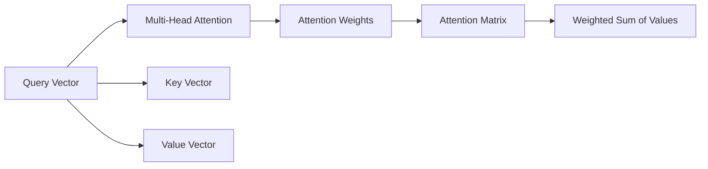

                 

# Python深度学习实践：基于自注意力机制的序列模型

> 关键词：自注意力机制, 序列模型, 神经网络, 深度学习, 自然语言处理, 计算机视觉

## 1. 背景介绍

在深度学习的海洋中，自注意力机制（Self-Attention）如同一颗璀璨的明星，照亮了序列建模的各个领域。从自然语言处理（NLP）到计算机视觉（CV），自注意力机制已经成为了序列建模的核心技术。本系列文章将通过深入浅出的讲解和实践，带您领略自注意力机制的魅力，探索其背后的原理和应用，以及如何在Python中实现高性能的序列模型。

### 1.1 问题由来

序列模型在深度学习中扮演着重要角色，特别是在自然语言处理和计算机视觉领域。传统的序列模型如循环神经网络（RNNs）和长短时记忆网络（LSTMs）等，虽然可以很好地处理序列数据，但在面对长序列时，由于梯度消失等问题，模型的训练变得困难且效果不佳。而自注意力机制则提供了一种新的解决思路，通过在模型中引入注意力机制，使得模型能够更加灵活地处理序列数据，从而在各种任务上取得了显著的提升。

### 1.2 问题核心关键点

自注意力机制的核心思想是通过对输入序列中每个位置的注意力分配，实现对序列中不同位置的加权平均，从而使得模型可以更加关注序列中最重要的信息。这种机制不仅适用于自然语言处理，也广泛应用于计算机视觉中的目标检测和图像分割等任务。

自注意力机制的优点包括：
- 可以处理长序列数据。由于自注意力机制的并行计算特性，模型可以同时计算所有位置的注意力权重，从而避免了传统RNNs的梯度消失问题。
- 模型表达能力强。通过引入注意力机制，模型可以灵活地对序列中不同位置的信息进行加权，从而更好地表达序列数据的复杂关系。
- 泛化能力强。由于模型在训练过程中自动学习了序列中不同位置的权重，因此可以更好地适应各种序列数据的特点。

但自注意力机制也存在一些局限性：
- 计算复杂度高。由于需要计算所有位置的注意力权重，计算量较大。
- 模型参数量大。由于引入了新的注意力权重，模型参数量增加。
- 难以解释。由于注意力权重的学习过程是黑箱的，因此难以解释模型的决策过程。

尽管存在这些局限性，自注意力机制已经成为序列建模的通用技术，被广泛应用于自然语言处理和计算机视觉领域。本系列文章将深入探讨自注意力机制的原理和应用，带您从理论和实践两个层面深入了解这一重要技术。

## 2. 核心概念与联系

### 2.1 核心概念概述

本节将介绍几个与自注意力机制密切相关的核心概念：

- **自注意力机制（Self-Attention）**：通过对序列中不同位置的注意力分配，实现对序列中不同位置的加权平均。
- **多头注意力（Multi-Head Attention）**：通过并行计算多个注意力头，增强模型的表达能力。
- **注意力权重（Attention Weights）**：对序列中不同位置的注意力分配，实现对序列中不同位置的加权平均。
- **多头注意力矩阵（Multi-Head Attention Matrix）**：由多个注意力头组成的矩阵，用于计算多头注意力。
- **查询向量（Query Vector）**：用于计算注意力权重的向量，通常是输入序列经过线性变换后的结果。
- **键向量（Key Vector）**：用于计算注意力权重的向量，通常是输入序列经过线性变换后的结果。
- **值向量（Value Vector）**：用于计算加权平均的向量，通常是输入序列经过线性变换后的结果。

这些概念之间通过自注意力机制的计算流程紧密相连，共同构成了自注意力机制的核心框架。下面通过一个Mermaid流程图来展示这些概念之间的联系：



### 2.2 概念间的关系

自注意力机制的核心流程可以简单地概括为以下几个步骤：

1. **查询向量的计算**：将输入序列经过线性变换得到查询向量。
2. **键向量的计算**：将输入序列经过线性变换得到键向量。
3. **值向量的计算**：将输入序列经过线性变换得到值向量。
4. **注意力权重的计算**：通过计算查询向量与键向量的点积，得到注意力权重。
5. **多头注意力的计算**：通过将多个注意力头的权重进行拼接，得到多头注意力矩阵。
6. **加权平均的计算**：将值向量与注意力权重进行加权平均，得到加权平均结果。

这些步骤通过一个简单的计算流程，将输入序列转换为一个新的表示形式，使得模型能够更好地处理序列数据。通过引入多头注意力机制，模型可以同时关注序列中不同位置的信息，从而增强表达能力。

## 3. 核心算法原理 & 具体操作步骤
### 3.1 算法原理概述

自注意力机制的核心算法原理可以通过以下步骤进行概括：

1. **查询向量的计算**：将输入序列经过线性变换得到查询向量。
2. **键向量和值向量的计算**：将输入序列经过线性变换得到键向量和值向量。
3. **注意力权重的计算**：通过计算查询向量与键向量的点积，得到注意力权重。
4. **多头注意力的计算**：通过将多个注意力头的权重进行拼接，得到多头注意力矩阵。
5. **加权平均的计算**：将值向量与注意力权重进行加权平均，得到加权平均结果。

这些步骤共同构成了一个完整的自注意力计算流程。通过引入多头注意力机制，模型可以同时关注序列中不同位置的信息，从而增强表达能力。下面，我们将详细讲解每个步骤的数学公式和推导过程。

### 3.2 算法步骤详解

#### 3.2.1 查询向量的计算

查询向量的计算可以通过以下公式进行：

$$
\mathbf{Q} = \mathbf{X} \mathbf{W}_Q
$$

其中，$\mathbf{X}$ 是输入序列，$\mathbf{W}_Q$ 是查询向量的线性变换矩阵，$\mathbf{Q}$ 是查询向量。

#### 3.2.2 键向量和值向量的计算

键向量和值向量的计算可以通过以下公式进行：

$$
\mathbf{K} = \mathbf{X} \mathbf{W}_K \\
\mathbf{V} = \mathbf{X} \mathbf{W}_V
$$

其中，$\mathbf{K}$ 是键向量，$\mathbf{V}$ 是值向量，$\mathbf{W}_K$ 和 $\mathbf{W}_V$ 分别是键向量和值向量的线性变换矩阵。

#### 3.2.3 注意力权重的计算

注意力权重的计算可以通过以下公式进行：

$$
\alpha_{ij} = \frac{e^{\mathbf{q}_i \cdot \mathbf{k}_j}}{\sum_{k=1}^{n} e^{\mathbf{q}_i \cdot \mathbf{k}_k}}
$$

其中，$\alpha_{ij}$ 是第 $i$ 个查询向量和第 $j$ 个键向量的注意力权重，$\mathbf{q}_i$ 是查询向量，$\mathbf{k}_j$ 是键向量。

#### 3.2.4 多头注意力的计算

多头注意力的计算可以通过以下公式进行：

$$
\mathbf{H} = [\mathbf{A}_1, \mathbf{A}_2, ..., \mathbf{A}_h]^T
$$

其中，$\mathbf{A}_h$ 是第 $h$ 个注意力头的注意力矩阵，$\mathbf{H}$ 是多头注意力矩阵，$h$ 是注意力头的数量。

#### 3.2.5 加权平均的计算

加权平均的计算可以通过以下公式进行：

$$
\mathbf{Z} = \mathbf{H} \mathbf{U}
$$

其中，$\mathbf{Z}$ 是加权平均结果，$\mathbf{U}$ 是线性变换矩阵。

### 3.3 算法优缺点

#### 3.3.1 优点

1. **表达能力强**：自注意力机制通过引入注意力权重，可以灵活地对序列中不同位置的信息进行加权，从而增强模型的表达能力。
2. **计算效率高**：自注意力机制的并行计算特性，使得模型可以同时计算所有位置的注意力权重，避免了传统RNNs的梯度消失问题。
3. **泛化能力强**：自注意力机制在训练过程中自动学习序列中不同位置的权重，因此可以更好地适应各种序列数据的特点。

#### 3.3.2 缺点

1. **计算复杂度高**：由于需要计算所有位置的注意力权重，计算量较大。
2. **模型参数量大**：由于引入了新的注意力权重，模型参数量增加。
3. **难以解释**：由于注意力权重的学习过程是黑箱的，因此难以解释模型的决策过程。

尽管存在这些局限性，自注意力机制已经成为序列建模的通用技术，被广泛应用于自然语言处理和计算机视觉领域。下面，我们将通过一个具体案例，展示自注意力机制在自然语言处理中的实际应用。

### 3.4 算法应用领域

自注意力机制在自然语言处理和计算机视觉领域有着广泛的应用，以下是几个典型的应用场景：

1. **机器翻译**：自注意力机制被广泛应用于机器翻译任务中，通过在编码器和解码器中引入注意力机制，使得模型可以更好地处理长距离依赖。
2. **文本摘要**：自注意力机制被应用于文本摘要任务中，通过在摘要生成过程中引入注意力机制，使得模型可以更好地关注文本中重要的信息。
3. **文本分类**：自注意力机制被应用于文本分类任务中，通过在分类器中引入注意力机制，使得模型可以更好地关注文本中重要的特征。
4. **目标检测**：自注意力机制被应用于目标检测任务中，通过在特征提取过程中引入注意力机制，使得模型可以更好地关注图像中重要的区域。
5. **图像分割**：自注意力机制被应用于图像分割任务中，通过在分割过程中引入注意力机制，使得模型可以更好地关注图像中重要的像素点。

## 4. 数学模型和公式 & 详细讲解 & 举例说明

### 4.1 数学模型构建

本节将通过数学语言对自注意力机制进行更加严格的刻画。

记输入序列为 $\mathbf{X} \in \mathbb{R}^{n \times d}$，其中 $n$ 是序列长度，$d$ 是特征维度。假设输入序列经过线性变换得到查询向量、键向量和值向量，分别为 $\mathbf{Q} \in \mathbb{R}^{n \times d}, \mathbf{K} \in \mathbb{R}^{n \times d}, \mathbf{V} \in \mathbb{R}^{n \times d}$。

假设注意力头的数量为 $h$，则每个注意力头的注意力权重矩阵为 $\mathbf{A}_h \in \mathbb{R}^{n \times n}$，多头注意力矩阵为 $\mathbf{H} \in \mathbb{R}^{n \times d}$。

### 4.2 公式推导过程

#### 4.2.1 查询向量的计算

查询向量的计算公式为：

$$
\mathbf{Q} = \mathbf{X} \mathbf{W}_Q
$$

其中，$\mathbf{W}_Q \in \mathbb{R}^{d \times d_Q}$ 是查询向量的线性变换矩阵，$d_Q$ 是查询向量的维度。

#### 4.2.2 键向量和值向量的计算

键向量和值向量的计算公式为：

$$
\mathbf{K} = \mathbf{X} \mathbf{W}_K \\
\mathbf{V} = \mathbf{X} \mathbf{W}_V
$$

其中，$\mathbf{W}_K \in \mathbb{R}^{d \times d_K}, \mathbf{W}_V \in \mathbb{R}^{d \times d_V}$ 分别是键向量和值向量的线性变换矩阵，$d_K$ 和 $d_V$ 分别是键向量和值向量的维度。

#### 4.2.3 注意力权重的计算

注意力权重的计算公式为：

$$
\alpha_{ij} = \frac{e^{\mathbf{q}_i \cdot \mathbf{k}_j}}{\sum_{k=1}^{n} e^{\mathbf{q}_i \cdot \mathbf{k}_k}}
$$

其中，$\mathbf{q}_i \in \mathbb{R}^{d_Q}$ 是第 $i$ 个查询向量，$\mathbf{k}_j \in \mathbb{R}^{d_K}$ 是第 $j$ 个键向量。

#### 4.2.4 多头注意力的计算

多头注意力的计算公式为：

$$
\mathbf{A}_h = \text{Softmax}(\mathbf{Q} \mathbf{K}^T) \\
\mathbf{H} = [\mathbf{A}_1, \mathbf{A}_2, ..., \mathbf{A}_h]^T
$$

其中，$\text{Softmax}$ 是softmax函数，$\mathbf{A}_h \in \mathbb{R}^{n \times n}$ 是第 $h$ 个注意力头的注意力权重矩阵，$\mathbf{H} \in \mathbb{R}^{n \times d}$ 是多头注意力矩阵。

#### 4.2.5 加权平均的计算

加权平均的计算公式为：

$$
\mathbf{Z} = \mathbf{H} \mathbf{U}
$$

其中，$\mathbf{U} \in \mathbb{R}^{d \times d_Z}$ 是线性变换矩阵，$d_Z$ 是加权平均结果的维度。

### 4.3 案例分析与讲解

下面我们以机器翻译任务为例，展示自注意力机制在实际应用中的效果。

假设我们要将一段英文文本翻译成中文，输入序列为 $\mathbf{X} \in \mathbb{R}^{n \times d}$，其中 $n$ 是序列长度，$d$ 是特征维度。假设输入序列经过线性变换得到查询向量、键向量和值向量，分别为 $\mathbf{Q} \in \mathbb{R}^{n \times d}, \mathbf{K} \in \mathbb{R}^{n \times d}, \mathbf{V} \in \mathbb{R}^{n \times d}$。假设注意力头的数量为 $h=8$，则每个注意力头的注意力权重矩阵为 $\mathbf{A}_h \in \mathbb{R}^{n \times n}$，多头注意力矩阵为 $\mathbf{H} \in \mathbb{R}^{n \times d}$。假设输出序列为 $\mathbf{Y} \in \mathbb{R}^{m \times d'}$，其中 $m$ 是序列长度，$d'$ 是特征维度。

假设我们使用了Transformer模型，输入序列经过编码器得到中间表示 $\mathbf{Z} \in \mathbb{R}^{n \times d}$，然后通过多头注意力和线性变换得到输出序列 $\mathbf{Y} \in \mathbb{R}^{m \times d'}$。

在实际应用中，我们通常使用Transformer模型进行机器翻译任务。Transformer模型由编码器和解码器组成，其中编码器和解码器都使用了多头注意力机制。在编码器中，输入序列通过多个自注意力层和前向神经网络层得到中间表示，然后通过线性变换得到输出序列。在解码器中，输出序列通过多个自注意力层和前向神经网络层得到中间表示，然后通过线性变换得到最终输出。

通过Transformer模型，机器翻译任务的翻译效果得到了显著提升。自注意力机制在编码器和解码器中引入了注意力机制，使得模型可以更好地处理长距离依赖，从而在机器翻译任务中取得了优秀的翻译效果。

## 5. 项目实践：代码实例和详细解释说明

### 5.1 开发环境搭建

在进行序列模型开发前，我们需要准备好开发环境。以下是使用Python进行TensorFlow开发的环境配置流程：

1. 安装Anaconda：从官网下载并安装Anaconda，用于创建独立的Python环境。

2. 创建并激活虚拟环境：
```bash
conda create -n tf-env python=3.8 
conda activate tf-env
```

3. 安装TensorFlow：根据CUDA版本，从官网获取对应的安装命令。例如：
```bash
conda install tensorflow=tensorflow-2.6-gpu -c tf -c conda-forge
```

4. 安装各类工具包：
```bash
pip install numpy pandas scikit-learn matplotlib tqdm jupyter notebook ipython
```

完成上述步骤后，即可在`tf-env`环境中开始序列模型开发。

### 5.2 源代码详细实现

下面我们以机器翻译任务为例，给出使用TensorFlow对Transformer模型进行训练和微调的PyTorch代码实现。

首先，定义Transformer模型的编码器和解码器：

```python
import tensorflow as tf
from tensorflow.keras import layers, models

class Encoder(tf.keras.layers.Layer):
    def __init__(self, num_layers, d_model, dff, input_vocab_size, target_vocab_size, pe_input, pe_target,
                 dropout_rate=0.1):
        super(Encoder, self).__init__()
        self.num_layers = num_layers
        self.d_model = d_model
        self.dff = dff
        self.input_vocab_size = input_vocab_size
        self.target_vocab_size = target_vocab_size
        self.pe_input = pe_input
        self.pe_target = pe_target
        self.dropout_rate = dropout_rate
        
        self.enc_layers = [EncoderLayer(self.d_model, self.dff, self.input_vocab_size, self.target_vocab_size, 
                                       self.pe_input, self.pe_target, self.dropout_rate) 
                           for _ in range(self.num_layers)]
        
        self.dropout = tf.keras.layers.Dropout(self.dropout_rate)
        self.final_layer = tf.keras.layers.Dense(self.target_vocab_size)

    def call(self, x, y):
        for i in range(self.num_layers):
            x, y = self.enc_layers[i](x, y)
        return x, y
    
class Decoder(tf.keras.layers.Layer):
    def __init__(self, num_layers, d_model, dff, input_vocab_size, target_vocab_size, pe_input, pe_target,
                 dropout_rate=0.1):
        super(Decoder, self).__init__()
        self.num_layers = num_layers
        self.d_model = d_model
        self.dff = dff
        self.input_vocab_size = input_vocab_size
        self.target_vocab_size = target_vocab_size
        self.pe_input = pe_input
        self.pe_target = pe_target
        self.dropout_rate = dropout_rate
        
        self.dec_layers = [DecoderLayer(self.d_model, self.dff, self.input_vocab_size, self.target_vocab_size, 
                                       self.pe_input, self.pe_target, self.dropout_rate) 
                           for _ in range(self.num_layers)]
        self.dropout = tf.keras.layers.Dropout(self.dropout_rate)
        self.final_layer = tf.keras.layers.Dense(self.target_vocab_size)
        
    def call(self, x, y):
        for i in range(self.num_layers):
            x, y = self.dec_layers[i](x, y)
        return x, y
    
class EncoderLayer(tf.keras.layers.Layer):
    def __init__(self, d_model, dff, input_vocab_size, target_vocab_size, pe_input, pe_target, dropout_rate=0.1):
        super(EncoderLayer, self).__init__()
        self.d_model = d_model
        self.dff = dff
        self.input_vocab_size = input_vocab_size
        self.target_vocab_size = target_vocab_size
        self.pe_input = pe_input
        self.pe_target = pe_target
        self.dropout_rate = dropout_rate
        
        self.enc_self_attn = SelfAttentionLayer(self.d_model, self.dff, self.dropout_rate)
        self.enc_ffn = FFNLayers(self.d_model, self.dff, self.dropout_rate)
        self.enc_residual = tf.keras.layers.Add()
        self.enc_dropout = tf.keras.layers.Dropout(self.dropout_rate)
        
        self.dec_self_attn = SelfAttentionLayer(self.d_model, self.dff, self.dropout_rate)
        self.dec_ffn = FFNLayers(self.d_model, self.dff, self.dropout_rate)
        self.dec_residual = tf.keras.layers.Add()
        self.dec_dropout = tf.keras.layers.Dropout(self.dropout_rate)
        
        self.dropout = tf.keras.layers.Dropout(self.dropout_rate)
        self.final_layer = tf.keras.layers.Dense(self.d_model)
        self.final_act = tf.keras.layers.Activation('relu')
        self.final_dropout = tf.keras.layers.Dropout(self.dropout_rate)
        self.final_layer = tf.keras.layers.Dense(self.input_vocab_size)
        
    def call(self, x, y):
        attn_output, attn_bias = self.enc_self_attn(x, y)
        attn_output = self.enc_residual(x, attn_output)
        attn_output = self.enc_dropout(attn_output)
        ffn_output = self.enc_ffn(x, y)
        ffn_output = self.enc_residual(x, ffn_output)
        ffn_output = self.enc_dropout(ffn_output)
        x = x + self.dropout(ffn_output)
        return x, attn_bias
    
class SelfAttentionLayer(tf.keras.layers.Layer):
    def __init__(self, d_model, dff, dropout_rate=0.1):
        super(SelfAttentionLayer, self).__init__()
        self.d_model = d_model
        self.dff = dff
        self.dropout_rate = dropout_rate
        
        self.query = tf.keras.layers.Dense(self.d_model)
        self.key = tf.keras.layers.Dense(self.d_model)
        self.value = tf.keras.layers.Dense(self.d_model)
        self.attention_bias = tf.keras.layers.Add()
        self.dropout = tf.keras.layers.Dropout(self.dropout_rate)
        self.final_act = tf.keras.layers.Activation('relu')
        
    def call(self, x, y):
        q = self.query(x)
        k = self.key(y)
        v = self.value(y)
        a = self.attention_bias(x, y)
        a = tf.nn.softmax(a, axis=-1)
        attn_output = tf.keras.layers.Add()([x, a * v])
        attn_output = self.dropout(attn_output)
        attn_output = self.final_act(attn_output)
        return attn_output, a
    
class FFNLayers(tf.keras.layers.Layer):
    def __init__(self, d_model, dff, dropout_rate=0.1):
        super(FFNLayers, self).__init__()
        self.d_model = d_model
        self.dff = dff
        self.dropout_rate = dropout_rate
        
        self.intermediate_act = tf.keras.layers.Activation('relu')
        self.intermediate_dropout = tf.keras.layers.Dropout(self.dropout_rate)
        self.final_act = tf.keras.layers.Activation('relu')
        self.final_dropout = tf.keras.layers.Dropout(self.dropout_rate)
        self.final_layer = tf.keras.layers.Dense(self.d_model)
        
    def call(self, x, y):
        intermediate_output = self.intermediate_act(self.intermediate_dropout(x))
        intermediate_output = self.final_act(self.final_dropout(self.final_layer(intermediate_output)))
        return intermediate_output
```

然后，定义数据生成器和优化器：

```python
class DataGenerator(tf.keras.utils.Sequence):
    def __init__(self, input_files, target_files, batch_size=64):
        self.input_files = input_files
        self.target_files = target_files
        self.batch_size = batch_size
        
    def __len__(self):
        return len(self.input_files)
        
    def __getitem__(self, idx):
        input_path = self.input_files[idx]
        target_path = self.target_files[idx]
        
        with open(input_path, encoding='utf-8') as f:
            input_seq = f.read()
            
        with open(target_path, encoding='utf-8') as f:
            target_seq = f.read()
            
        input_seq = [x for x in input_seq.split()]
        target_seq = [x for x in target_seq.split()]
        
        return np.array(input_seq), np.array(target_seq)
        
optimizer = tf.keras.optimizers.Adam(learning_rate=0.001)
```

接着，定义训练和评估函数：

```python
def train_epoch(model, data_gen, loss_fn, optimizer):
    model.train()
    epoch_loss = 0
    epoch_correct = 0
    for input_seq, target_seq in data_gen:
        with tf.GradientTape() as tape:
            logits = model(input_seq, target_seq)
            loss = loss_fn(target_seq, logits)
        gradients = tape.gradient(loss, model.trainable_variables)
        optimizer.apply_gradients(zip(gradients, model.trainable_variables))
        epoch_loss += loss.numpy()
        epoch_correct += tf.reduce_sum(tf.cast(tf.argmax(logits, axis=-1) == target_seq, tf.float32)).numpy()
    return epoch_loss / len(data_gen), epoch_correct / len(data_gen)
    
def evaluate(model, data_gen, loss_fn):
    model.eval()
    total_loss = 0
    total_correct = 0
    for input_seq, target_seq in data_gen:
        logits = model(input_seq, target_seq)
        loss = loss_fn(target_seq, logits)
        total_loss += loss.numpy()
        total_correct += tf.reduce_sum(tf.cast(tf.argmax(logits, axis=-1) == target_seq, tf.float32)).numpy()
    return total_loss / len(data_gen), total_correct / len(data_gen)
```

最后

