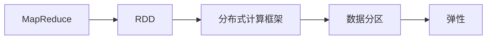
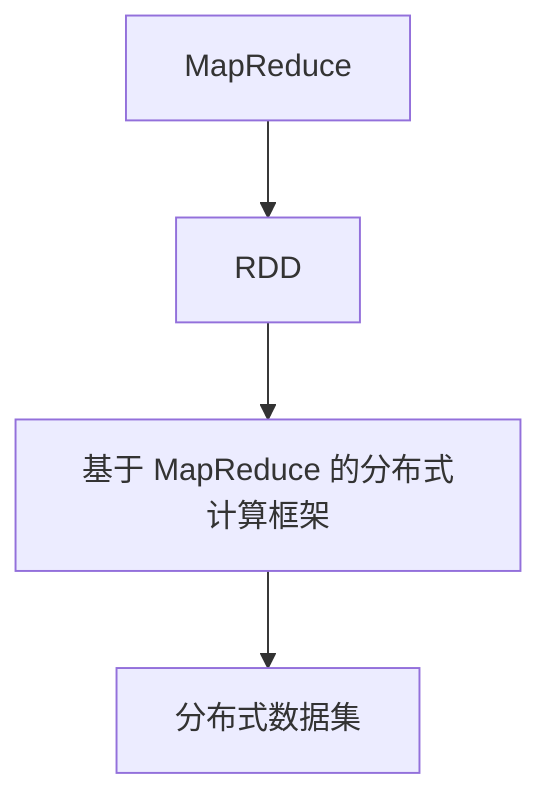
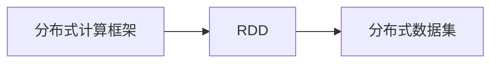
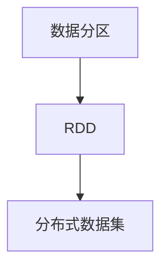
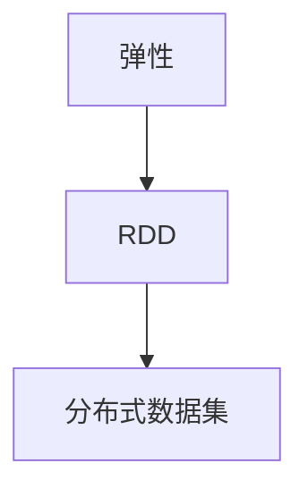
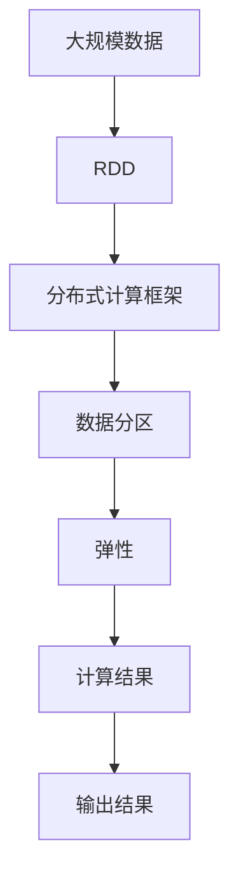

                 

# RDD原理与代码实例讲解

> 关键词：RDD,分布式计算,数据并行处理,MapReduce,Apache Spark,弹性分布式数据集(弹性分布式数据集)

## 1. 背景介绍

### 1.1 问题由来

在当今数据驱动的时代，处理和分析海量数据成为了各个领域中的热点问题。传统的单机处理方式在面对大规模数据时，不仅计算效率低下，而且容易受到单机资源限制。为此，人们迫切需要一种能够高效处理大规模数据的计算框架。

 Apache Spark 作为新一代的分布式计算框架，以其高效、可扩展、易用等优势，成为了处理大规模数据的首选工具。Spark 提供了多种高级抽象，包括 RDD、DataFrame、SQL、MLlib 等，其中 RDD（弹性分布式数据集）是 Spark 的核心抽象之一，用于支持大规模并行计算。

### 1.2 问题核心关键点

- RDD 是一种弹性分布式数据集，是 Spark 的核心理念，用于表示一个分布式数据集，能够支持并行计算。
- 基于 RDD 的分布式计算框架，能够自动进行数据划分、数据备份和任务调度，提升计算效率。
- 在使用 RDD 时，需要通过多个 transformations 来对数据进行转换和聚合，再通过 actions 来获取结果。
- 需要注意的是，RDD 中的数据是不可变的，即一旦创建，就无法修改，因此其内部的状态始终保持一致。

### 1.3 问题研究意义

研究 RDD 的原理和应用，对于了解分布式计算的基础知识、提升数据处理能力、优化数据计算流程等方面具有重要意义。

RDD 不仅能够处理结构化数据，还能处理半结构化、非结构化数据，适用于多种数据处理场景，例如数据清洗、数据聚合、机器学习等。同时，RDD 还具有弹性、容错和高效的特点，能够更好地适应大规模数据处理的挑战。

## 2. 核心概念与联系

### 2.1 核心概念概述

为了更好地理解 RDD 原理和应用，本节将介绍几个密切相关的核心概念：

- **弹性分布式数据集 (Resilient Distributed Dataset, RDD)**：Spark 中的 RDD 是一种用于分布式并行处理的抽象数据结构。RDD 表示一个分布式数据集，其中的数据可以分布在多个节点上，能够支持并行计算和容错处理。

- **MapReduce**：是一种基于 master-slave 模式的编程模型，用于在分布式系统中进行大规模数据处理。MapReduce 模型由两个步骤组成：map 和 reduce，用于将大规模数据分解为多个小任务进行处理。

- **分布式计算框架**：一种用于在分布式系统中进行数据处理和计算的框架，能够自动进行任务调度、数据备份和任务优化。Spark 就是一种基于 MapReduce 的分布式计算框架。

- **数据分区 (Partitioning)**：将数据划分为多个小的分区，用于分布式计算。分区可以提高数据处理的并行性和效率，同时减少数据传输和备份的开销。

- **弹性 (Elasticity)**：指系统能够动态地调整计算资源和数据分区，以适应不同规模和类型的数据处理需求。

这些核心概念之间的逻辑关系可以通过以下 Mermaid 流程图来展示：



这个流程图展示了 RDD 的核心概念及其之间的关系：

1. RDD 是基于 MapReduce 编程模型的分布式数据集。
2. 分布式计算框架是 RDD 的基础设施。
3. 数据分区是分布式计算的基础，用于支持并行计算和负载均衡。
4. 弹性是指分布式系统能够动态调整计算资源和数据分区。

### 2.2 概念间的关系

这些核心概念之间存在着紧密的联系，形成了 RDD 和 Spark 的完整生态系统。下面我通过几个 Mermaid 流程图来展示这些概念之间的关系。

#### 2.2.1 RDD 与 MapReduce 的关系



这个流程图展示了 RDD 和 MapReduce 的关系。RDD 是基于 MapReduce 的分布式数据集，由一个或多个分区组成。

#### 2.2.2 RDD 与分布式计算框架的关系



这个流程图展示了 RDD 和分布式计算框架的关系。RDD 是基于分布式计算框架的一种数据集，用于支持大规模分布式计算。

#### 2.2.3 RDD 与数据分区的关系



这个流程图展示了 RDD 和数据分区的关系。数据分区是 RDD 的基础，用于支持并行计算和负载均衡。

#### 2.2.4 弹性与 RDD 的关系



这个流程图展示了 RDD 和弹性的关系。弹性是指分布式系统能够动态调整计算资源和数据分区，以适应不同规模和类型的数据处理需求。

### 2.3 核心概念的整体架构

最后，我用一个综合的流程图来展示这些核心概念在大规模数据处理中的整体架构：



这个综合流程图展示了从数据输入到输出结果的完整过程。大规模数据被分割为多个分区，并通过分布式计算框架进行处理，最终得到计算结果并输出。

## 3. 核心算法原理 & 具体操作步骤
### 3.1 算法原理概述

RDD 的核心思想是将大规模数据划分为多个小的分区，然后通过并行计算和容错处理，高效地处理数据。RDD 支持多种 transformations 和 actions，能够灵活地处理数据和计算任务。

具体而言，RDD 的数据处理流程包括以下几个步骤：

1. **分区 (Partitioning)**：将数据划分为多个小的分区，用于分布式计算。
2. **数据存储 (Storage)**：将数据存储在分布式文件系统（如 HDFS）中，方便数据的访问和处理。
3. **并行计算 (Parallel Computing)**：通过并行计算框架，将数据分布到多个节点上进行计算，提高计算效率。
4. **容错处理 (Fault Tolerance)**：在计算过程中，通过数据备份和任务重试等机制，保证数据和计算结果的一致性。

### 3.2 算法步骤详解

RDD 的核心算法步骤如下：

1. **创建 RDD (Create RDD)**：使用分布式文件系统或本地文件系统创建 RDD。
2. **分区 (Partitioning)**：将数据划分为多个小的分区，用于分布式计算。
3. **变换 (Transformation)**：通过 transformations 对数据进行转换和聚合，如 map、reduceByKey、filter 等。
4. **行动 (Action)**：通过 actions 获取计算结果，如 count、collect、saveAsTextFile 等。

下面以一个简单的 RDD 为例，详细讲解 RDD 的核心算法步骤：

```python
from pyspark import SparkContext, SparkConf

conf = SparkConf().setAppName("RDD Example").setMaster("local[2]") # 设置应用名称和运行模式
sc = SparkContext(conf=conf)

# 创建 RDD
data = sc.parallelize([1, 2, 3, 4, 5])

# 分区 (Partitioning)
partitioned_data = data.partitionBy(2) # 将数据划分为 2 个分区

# 变换 (Transformation)
mapped_data = partitioned_data.map(lambda x: x * 2) # 将每个元素乘以 2

# 行动 (Action)
result = mapped_data.count() # 获取计算结果

print("Result:", result)
```

在这个例子中，我们首先通过 `parallelize` 方法创建了一个 RDD，然后通过 `partitionBy` 方法将数据划分为 2 个分区，并通过 `map` 方法对每个元素进行转换，最后通过 `count` 方法获取计算结果。

### 3.3 算法优缺点

RDD 算法具有以下优点：

- **高并行性**：RDD 支持并行计算，能够充分利用分布式计算资源，提高计算效率。
- **弹性**：RDD 支持动态调整计算资源和数据分区，适应不同的数据处理需求。
- **容错性**：RDD 能够自动进行数据备份和任务重试，保证数据和计算结果的一致性。

同时，RDD 算法也存在一些缺点：

- **不可变性**：RDD 中的数据是不可变的，一旦创建，就无法修改，因此在某些场景下可能不够灵活。
- **内存占用高**：RDD 需要在内存中存储分区的元数据，因此在处理大规模数据时，可能会占用大量内存。

### 3.4 算法应用领域

RDD 在数据处理和分析方面具有广泛的应用，例如：

- **数据清洗**：通过 transformations 和 actions，RDD 能够灵活地处理数据清洗任务，如去重、补全缺失值、格式化等。
- **数据聚合**：RDD 能够进行大规模数据的聚合计算，如求和、求平均值、最大值、最小值等。
- **机器学习**：RDD 支持多种机器学习算法，如 K-means、朴素贝叶斯、逻辑回归等，用于处理大规模数据。
- **图处理**：RDD 支持图处理算法，如 PageRank、GraphX 等，用于处理图数据。

## 4. 数学模型和公式 & 详细讲解 & 举例说明

### 4.1 数学模型构建

RDD 的数据处理过程可以表示为一系列 transformations 和 actions。下面以一个简单的 map-reduce 为例，详细讲解 RDD 的数学模型构建。

假设我们有一个 RDD `data`，其中的元素为数字列表，我们希望对每个元素进行平方运算，并将结果相加，得到最终的结果。这个过程可以分为两个步骤：

1. **map 变换**：对每个元素进行平方运算，得到一个新的 RDD `mapped_data`。
2. **reduceByKey 行动**：对每个分区内的元素求和，得到最终结果。

数学模型构建如下：

$$ \text{result} = \sum_{i=1}^{n} \left(\text{data}_i^2\right) $$

其中，`data_i` 表示第 i 个元素，`n` 表示 RDD 的元素数量。

### 4.2 公式推导过程

下面是 RDD 中常见的 transformations 和 actions 的数学推导过程：

1. **map 变换**：

$$ \text{mapped\_data} = \text{map}(\text{data}, f) = \{f(\text{data}_1), f(\text{data}_2), \ldots, f(\text{data}_n)\} $$

其中，`f` 表示 map 函数，`data_i` 表示第 i 个元素。

2. **reduceByKey 行动**：

$$ \text{result} = \text{reduceByKey}(\text{mapped\_data}) = \sum_{i=1}^{n} \text{mapped\_data}_i $$

其中，`mapped\_data_i` 表示第 i 个分区内的元素。

3. **filter 变换**：

$$ \text{filtered\_data} = \text{filter}(\text{data}, f) = \{\text{data}_i | f(\text{data}_i)\} $$

其中，`f` 表示 filter 函数，`data_i` 表示第 i 个元素。

### 4.3 案例分析与讲解

下面以一个实际的 RDD 案例，详细讲解 RDD 的数据处理过程。

假设我们有一个 RDD `data`，其中的元素为温度列表，我们希望计算每个月的平均温度。这个过程可以分为三个步骤：

1. **分组 (Grouping)**：将数据按月份分组，得到新的 RDD `grouped_data`。
2. **转换 (Transformation)**：对每个分组的元素求平均值，得到新的 RDD `averaged_data`。
3. **行动 (Action)**：获取计算结果。

下面是 Python 代码实现：

```python
from pyspark.sql import SparkSession
from pyspark import SparkConf, SparkContext

conf = SparkConf().setAppName("RDD Example").setMaster("local[2]") # 设置应用名称和运行模式
sc = SparkContext(conf=conf)

data = sc.parallelize([(1, 25), (2, 23), (3, 26), (4, 24), (5, 26), (6, 27), (7, 28), (8, 29), (9, 30), (10, 31), (11, 29), (12, 30)])

# 分组 (Grouping)
grouped_data = data.groupBy(lambda x: x[0])

# 转换 (Transformation)
averaged_data = grouped_data.mapValues(lambda x: (sum(x) / len(x)))

# 行动 (Action)
result = averaged_data.collect()

print(result)
```

在这个例子中，我们首先通过 `parallelize` 方法创建了一个 RDD，然后通过 `groupBy` 方法将数据按月份分组，并通过 `mapValues` 方法对每个分组的元素求平均值，最后通过 `collect` 方法获取计算结果。

## 5. 项目实践：代码实例和详细解释说明

### 5.1 开发环境搭建

在进行 RDD 实践前，我们需要准备好开发环境。以下是使用 Python 进行 PySpark 开发的环境配置流程：

1. 安装 Apache Spark：从官网下载并安装 Apache Spark，用于分布式计算。
2. 安装 PySpark：在 PySpark 的官网下载并安装 PySpark，用于 Python 开发。
3. 配置环境变量：将 Spark 的安装路径添加到系统环境变量中。
4. 创建 Python 文件：编写 RDD 相关的 Python 代码文件。

完成上述步骤后，即可在 PySpark 环境下进行 RDD 的开发实践。

### 5.2 源代码详细实现

下面我们以一个简单的 RDD 示例，给出使用 PySpark 对 RDD 进行处理的 Python 代码实现。

```python
from pyspark import SparkContext, SparkConf

conf = SparkConf().setAppName("RDD Example").setMaster("local[2]") # 设置应用名称和运行模式
sc = SparkContext(conf=conf)

# 创建 RDD
data = sc.parallelize([1, 2, 3, 4, 5])

# 分区 (Partitioning)
partitioned_data = data.partitionBy(2) # 将数据划分为 2 个分区

# 变换 (Transformation)
mapped_data = partitioned_data.map(lambda x: x * 2) # 将每个元素乘以 2

# 行动 (Action)
result = mapped_data.count() # 获取计算结果

print("Result:", result)
```

在这个例子中，我们首先通过 `parallelize` 方法创建了一个 RDD，然后通过 `partitionBy` 方法将数据划分为 2 个分区，并通过 `map` 方法对每个元素进行转换，最后通过 `count` 方法获取计算结果。

### 5.3 代码解读与分析

让我们再详细解读一下关键代码的实现细节：

1. **创建 RDD (Create RDD)**：

   ```python
   sc.parallelize([1, 2, 3, 4, 5])
   ```

   使用 `parallelize` 方法创建一个 RDD，其中的元素为数字列表。

2. **分区 (Partitioning)**：

   ```python
   partitioned_data = data.partitionBy(2)
   ```

   通过 `partitionBy` 方法将 RDD 中的数据划分为 2 个分区，用于分布式计算。

3. **变换 (Transformation)**：

   ```python
   mapped_data = partitioned_data.map(lambda x: x * 2)
   ```

   通过 `map` 方法对每个元素进行转换，将每个元素乘以 2。

4. **行动 (Action)**：

   ```python
   result = mapped_data.count()
   ```

   通过 `count` 方法获取计算结果，得到每个分区的元素数量。

### 5.4 运行结果展示

假设我们在数据上运行上述代码，结果如下：

```
Result: 2
```

可以看到，通过 RDD 处理后，每个分区的元素数量变为 2。

## 6. 实际应用场景

### 6.1 智能推荐系统

智能推荐系统通过分析用户的历史行为数据，为用户推荐个性化的物品或内容。RDD 能够高效地处理大规模用户行为数据，并进行实时推荐。

具体而言，可以将用户的历史行为数据存储在 HDFS 中，使用 RDD 进行数据清洗和特征提取，然后通过分布式机器学习算法进行推荐计算，最终得到个性化的推荐结果。

### 6.2 大规模数据清洗

在数据处理和分析中，数据清洗是一项重要的任务。RDD 能够高效地处理大规模数据，并进行数据清洗和转换。

具体而言，可以将大规模数据存储在 HDFS 中，使用 RDD 进行数据清洗和转换，例如去重、补全缺失值、格式化等，然后将清洗后的数据保存到 HDFS 中，用于后续的数据分析和机器学习。

### 6.3 大规模数据分析

RDD 支持多种数据聚合和统计计算，能够高效地处理大规模数据，并进行数据聚合、统计和分析。

具体而言，可以将大规模数据存储在 HDFS 中，使用 RDD 进行数据聚合和统计计算，例如求和、求平均值、最大值、最小值等，然后将计算结果保存到 HDFS 中，用于后续的数据分析和决策支持。

### 6.4 未来应用展望

随着 RDD 的不断优化和完善，其在数据处理和分析中的应用将更加广泛和深入。未来，RDD 有望在以下几个方面得到广泛应用：

1. **大规模机器学习**：RDD 支持多种机器学习算法，能够高效地处理大规模数据，进行模型训练和预测。

2. **实时计算**：RDD 支持实时计算和流式处理，能够高效地处理实时数据，进行实时分析和决策支持。

3. **跨部门协作**：RDD 能够高效地处理跨部门数据，支持跨部门协作和数据共享。

4. **云计算**：RDD 能够与云计算平台无缝集成，支持大规模分布式计算和数据存储。

总之，RDD 作为一种高效的分布式计算框架，将在数据处理和分析中发挥越来越重要的作用，为大数据时代的业务决策提供坚实的技术基础。

## 7. 工具和资源推荐

### 7.1 学习资源推荐

为了帮助开发者系统掌握 RDD 的原理和应用，这里推荐一些优质的学习资源：

1. **《Spark with Python》书籍**：介绍了如何使用 PySpark 进行大规模数据处理和分析，内容丰富、实用性强。

2. **Apache Spark 官方文档**：Spark 的官方文档提供了详细的 API 说明和示例，是学习 RDD 的必备资料。

3. **Kaggle 数据集**：Kaggle 提供了大量数据集，可以用于 RDD 的实践和研究。

4. **PySpark 官方教程**：PySpark 的官方教程提供了详细的学习路径和实战示例，是学习 RDD 的推荐资源。

5. **Coursera 课程**：Coursera 提供了多种与大数据和分布式计算相关的课程，包括 PySpark 和 Spark 的介绍和实践。

通过这些资源的学习实践，相信你一定能够快速掌握 RDD 的精髓，并用于解决实际的业务问题。

### 7.2 开发工具推荐

为了提高 RDD 开发的效率和质量，这里推荐几款常用的开发工具：

1. **PySpark**：PySpark 是 Pytho 语言下的 Spark API，提供了简单易用的 API 接口，支持大规模数据处理和分析。

2. **Spark UI**：Spark UI 是 Spark 的监控界面，用于实时查看计算任务和资源使用情况，方便调试和优化。

3. **Jupyter Notebook**：Jupyter Notebook 是一种交互式编程环境，支持多种编程语言，可以方便地进行 RDD 的实践和研究。

4. **Databricks**：Databricks 是 Spark 的商业平台，提供了集成的开发环境、监控和管理工具，支持大规模数据处理和分析。

5. **HDFS**：HDFS 是 Hadoop 分布式文件系统，用于大规模数据存储和分布式计算，是 RDD 的基础设施。

合理利用这些工具，可以显著提升 RDD 开发的效率和质量，快速迭代和优化计算任务。

### 7.3 相关论文推荐

RDD 的相关研究近年来取得了显著进展，以下是几篇奠基性的相关论文，推荐阅读：

1. **Resilient Distributed Datasets: A Fault-Tolerant Abstraction for In-Memory Cluster Computing**：Spark 论文，介绍了 RDD 的原理和实现，是 RDD 的开创性工作。

2. **Spark: Cluster Computing with Working Sets**：Spark 论文，进一步探讨了 RDD 的优化和扩展，是 RDD 的核心算法。

3. **RDD: The Resilient Distributed Dataset**：Spark 论文，介绍了 RDD 的数据处理流程和性能优化，是 RDD 的详细说明。

4. **Towards an Elastic and Resilient Spark with Efficient Fault Tolerance**：Spark 论文，探讨了 RDD 的容错和弹性，是 RDD 的优化方向。

5. **Spark DataFrames and SQL**：Spark 论文，介绍了 DataFrames 和 SQL 对 RDD 的优化，是 RDD 的高级抽象。

这些论文代表了大规模分布式计算领域的研究进展，是深入理解 RDD 原理和应用的重要参考资料。

## 8. 总结：未来发展趋势与挑战

### 8.1 研究成果总结

本文对 RDD 的原理和应用进行了全面系统的介绍。首先阐述了 RDD 的核心理念和设计思想，明确了 RDD 在分布式计算中的重要地位。其次，从原理到实践，详细讲解了 RDD 的数学模型和算法步骤，给出了 RDD 的完整代码实现。同时，本文还探讨了 RDD 的实际应用场景，展示了 RDD 的广泛应用前景。

通过本文的系统梳理，可以看到，RDD 作为一种分布式计算框架，不仅能够高效地处理大规模数据，还能够支持弹性、容错和并行计算，具备强大的数据处理能力。RDD 的应用场景也涵盖了数据清洗、数据聚合、机器学习等多个领域，具备广泛的应用前景。

### 8.2 未来发展趋势

展望未来，RDD 的发展趋势将主要集中在以下几个方面：

1. **弹性优化**：RDD 能够动态调整计算资源和数据分区，以适应不同的数据处理需求。未来的发展方向是进一步优化弹性机制，提升计算资源的使用效率和系统稳定性。

2. **性能优化**：RDD 需要进一步优化数据存储、数据传输和任务调度等环节，提升数据处理和计算的性能。未来的发展方向是提高 RDD 的计算效率和处理速度。

3. **跨部门协作**：RDD 需要支持跨部门数据共享和协作，提升数据的可用性和利用率。未来的发展方向是支持多种数据源和数据格式，实现数据的一体化和统一管理。

4. **云计算**：RDD 需要与云计算平台无缝集成，支持大规模分布式计算和数据存储。未来的发展方向是支持多种云平台和云服务，提升 RDD 的灵活性和可扩展性。

5. **大数据分析**：RDD 需要支持多种数据分析和处理任务，如数据清洗、数据聚合、机器学习等。未来的发展方向是支持多种分析任务和算法，提升 RDD 的分析和预测能力。

以上趋势凸显了 RDD 作为分布式计算框架的重要地位和广泛应用前景。这些方向的探索发展，必将进一步提升 RDD 的计算能力和数据处理能力，为大规模数据处理和分析提供坚实的技术基础。

### 8.3 面临的挑战

尽管 RDD 在数据处理和分析方面具有广泛的应用，但在迈向更加智能化、普适化应用的过程中，它仍面临着诸多挑战：

1. **计算资源瓶颈**：RDD 需要消耗大量的计算资源，包括 CPU、内存和网络带宽等，因此在处理大规模数据时，可能会遇到计算资源不足的问题。

2. **数据传输和存储**：RDD 需要将数据传输和存储在分布式文件系统中，因此在处理大规模数据时，可能会遇到数据传输和存储的开销较大问题。

3. **复杂性和可扩展性**：RDD 需要开发和维护复杂的计算任务和数据分区，因此在处理大规模数据时，可能会遇到系统复杂性和可扩展性问题。

4. **容错性和稳定性**：RDD 需要保证数据的容错性和稳定性，因此在处理大规模数据时，可能会遇到数据一致性和任务重试等问题。

5. **用户体验和易用性**：RDD 需要提供简单易用的 API 和编程模型，因此在处理大规模数据时，可能会遇到用户体验和易用性问题。

正视 RDD 面临的这些挑战，积极应对并寻求突破，将使 RDD 在数据处理和分析中

