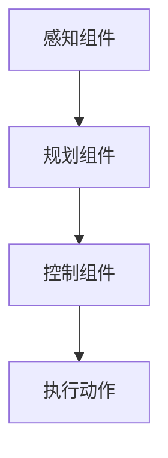
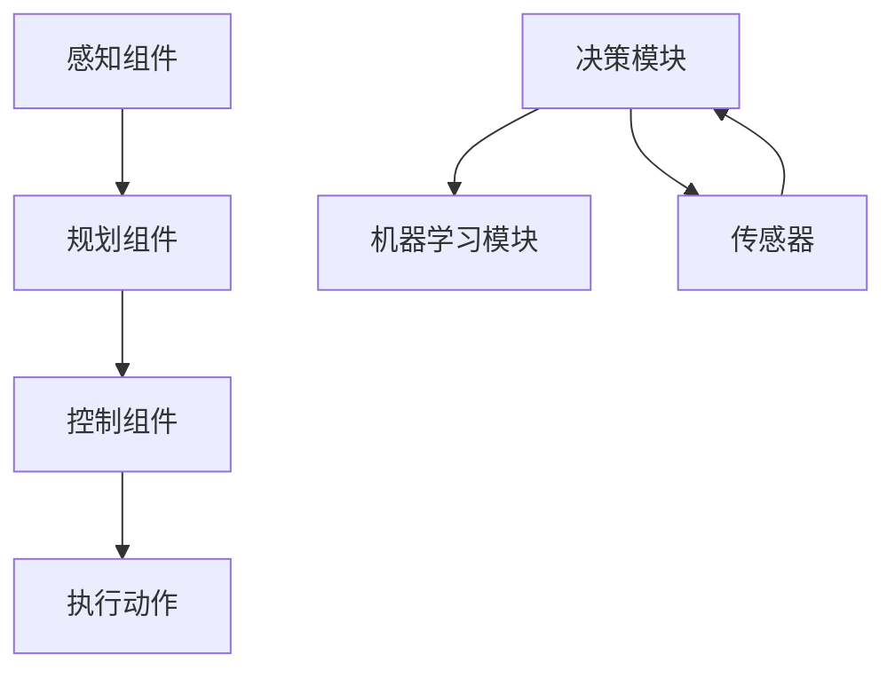

                 

# Robotics 原理与代码实战案例讲解

> 关键词：机器人,控制系统,感知,规划,模拟,案例分析

## 1. 背景介绍

### 1.1 问题由来
近年来，随着技术的飞速发展，机器人已广泛应用于工业制造、物流配送、农业植保、医疗康复等领域。然而，构建一个能够自主决策、高效执行的机器人系统，需要复杂的软件与硬件相结合，涉及感知、规划、控制等多个环节。因此，理解机器人系统的构建原理与实现方法是必要的。

### 1.2 问题核心关键点
本文档旨在系统介绍机器人系统的基本原理与代码实战案例，涵盖感知、控制、规划等多个核心组件的实现。通过这些实战案例，使读者能深入理解机器人系统的工作机制，并掌握关键技术。

### 1.3 问题研究意义
掌握机器人系统开发的核心技术，对提高生产效率、降低人力成本、提升用户体验具有重要意义。机器人技术不仅推动了自动化产业的变革，也带来了更广阔的应用前景，如智能家居、服务机器人、虚拟助手等。未来，随着技术的进一步发展，机器人将更加智能、灵活、普及，成为改变社会生产和生活方式的关键技术。

## 2. 核心概念与联系

### 2.1 核心概念概述

机器人系统由感知、规划、控制三大核心组件组成。理解这些组件的原理与实现方法，是构建高效、灵活、稳定机器人系统的关键。

- **感知(Perception)**：机器人通过传感器获取环境信息，包括深度相机、激光雷达、IMU、GPS等。感知组件负责处理和理解这些信息，以构建机器人对环境的实时认知。
- **规划(Planning)**：在感知基础上，规划组件设计机器人运动路径和动作，实现目标导航和任务执行。
- **控制(Control)**：控制组件根据规划信息，生成具体的控制指令，驱动机器人执行动作。

这三个组件相互配合，实现机器人的自主决策与执行。

### 2.2 核心概念间的关系

机器人系统的工作流程大致如下：



感知组件获取环境信息，传给规划组件进行路径规划和任务执行，最终由控制组件生成指令驱动机器人执行动作。

### 2.3 核心概念的整体架构

整个机器人系统的架构如下：



决策模块负责整合感知与规划信息，进行综合决策。机器学习模块通过不断学习，提升感知和规划的精度。

## 3. 核心算法原理 & 具体操作步骤

### 3.1 算法原理概述

机器人系统的核心算法包括SLAM、路径规划、运动控制等。这些算法通过复杂的数学模型和优化算法，实现机器人在环境中的自主导航和任务执行。

- **SLAM (Simultaneous Localization and Mapping)**：实时定位与地图构建，帮助机器人了解当前位置与环境信息。
- **路径规划(Path Planning)**：在已知环境信息下，设计最优路径，实现目标导航。
- **运动控制(Motion Control)**：根据规划路径生成具体的控制指令，驱动机器人执行动作。

### 3.2 算法步骤详解

**3.2.1 SLAM算法**

SLAM通过传感器获取环境信息，并利用传感器数据和机器人的运动信息，通过滤波算法进行定位与地图构建。

- **输入**：传感器数据、机器人的速度和姿态信息。
- **输出**：机器人的位置和环境地图。

具体步骤包括：

1. **数据预处理**：对传感器数据进行滤波和校正。
2. **数据融合**：将不同传感器数据融合，进行局部地图构建。
3. **运动更新**：根据机器人速度和姿态信息更新位置。
4. **地图更新**：根据位置信息更新全局地图。

**3.2.2 路径规划算法**

路径规划算法通过计算最优路径，实现机器人在环境中的自主导航。

- **输入**：环境地图、目标位置。
- **输出**：最优路径。

具体步骤包括：

1. **环境建模**：将环境信息转换为可处理的形式，如占用网格、矢量场等。
2. **路径搜索**：通过搜索算法（如A*、D*、RRT等），找到起点到终点的最优路径。
3. **路径优化**：对路径进行优化，提升路径的可行性和效率。

**3.2.3 运动控制算法**

运动控制算法根据规划路径，生成具体的控制指令，驱动机器人执行动作。

- **输入**：规划路径、机器人参数。
- **输出**：控制指令。

具体步骤包括：

1. **路径分解**：将规划路径分解为多个子路径。
2. **路径跟踪**：通过控制算法（如PID、MPC等），生成控制指令。
3. **执行控制**：根据控制指令，驱动机器人执行动作。

### 3.3 算法优缺点

**SLAM算法**：

- **优点**：可以实时构建环境地图，适用于动态变化的环境。
- **缺点**：计算复杂，对传感器精度要求高，实时性有限。

**路径规划算法**：

- **优点**：可以找到最优路径，适用于各种环境。
- **缺点**：计算复杂，对环境建模要求高，实时性有限。

**运动控制算法**：

- **优点**：实时性好，适用于各种机器人。
- **缺点**：对控制精度要求高，容易受环境干扰。

### 3.4 算法应用领域

机器人系统广泛应用于工业制造、物流配送、农业植保、医疗康复等多个领域。

- **工业制造**：机器人进行自动化装配、检测和搬运。
- **物流配送**：机器人进行智能仓储、分拣和配送。
- **农业植保**：机器人进行自动化喷洒和耕作。
- **医疗康复**：机器人进行康复训练和辅助护理。

## 4. 数学模型和公式 & 详细讲解 & 举例说明

### 4.1 数学模型构建

机器人系统的数学模型主要包括：

- **感知模型**：传感器数据的获取与处理。
- **运动模型**：机器人的运动与控制。
- **路径规划模型**：环境建模与路径搜索。

### 4.2 公式推导过程

**感知模型**：

假设机器人携带激光雷达，激光雷达的传感器参数为 $(a_x, a_y, a_z)$，机器人的位置为 $(x, y, z)$，传感器与机器人之间的相对位置为 $(d_x, d_y, d_z)$。则激光雷达的测量方程为：

$$
y = (a_x - d_x)x + (a_y - d_y)y + (a_z - d_z)z + b
$$

其中 $b$ 为常数项。

**运动模型**：

假设机器人的运动模型为 $f(v)$，其中 $v$ 为机器人的速度向量。则机器人位置 $x$ 的更新方程为：

$$
x_{t+1} = f(x_t, v)
$$

**路径规划模型**：

假设环境模型为 $g$，机器人位置为 $x$，目标位置为 $t$。则路径规划的优化目标为：

$$
\min \limits_{x, t} \left\Vert x - t \right\Vert^2 + \lambda \max \limits_{j=1,2,\ldots,m} \left\Vert g(x_j) - g(x_t) \right\Vert^2
$$

其中 $\lambda$ 为惩罚系数，$m$ 为路径分段数量。

### 4.3 案例分析与讲解

以一个简单的SLAM系统为例，展示算法实现：

**感知组件**：

```python
import sensor
import map
import pose

def SLAM():
    sensor_data = sensor.get_data()
    map_data = map.update(sensor_data)
    pose_data = pose.update(map_data, sensor_data)
    return pose_data
```

**规划组件**：

```python
import path_planner

def path_planning(pose_data):
    map_data = map.get_map_data()
    target_data = target.get_target_data()
    path = path_planner.plan_path(map_data, target_data, pose_data)
    return path
```

**控制组件**：

```python
import motion

def motion_control(path_data, pose_data):
    target_data = path_data[-1]
    pose_data = pose_data
    motion_data = motion.control(target_data, pose_data)
    return motion_data
```

**决策模块**：

```python
import decision

def decision_maker(path_data, pose_data):
    motion_data = motion_control(path_data, pose_data)
    sensor_data = sensor.get_data()
    map_data = map.update(sensor_data)
    pose_data = pose.update(map_data, sensor_data)
    return pose_data, sensor_data, map_data
```

**机器学习模块**：

```python
import machine_learning

def learn(data):
    model = machine_learning.train(data)
    return model
```

## 5. 项目实践：代码实例和详细解释说明

### 5.1 开发环境搭建

机器人系统的开发环境搭建如下：

- **操作系统**：Linux
- **编程语言**：C++
- **开发环境**：ROS（Robot Operating System）
- **传感器**：激光雷达、IMU、GPS

### 5.2 源代码详细实现

**感知组件的C++代码实现**：

```cpp
#include "sensor.h"

std::vector<double> sensor::get_data() {
    // 获取传感器数据
    std::vector<double> data;
    // 数据处理与校正
    // ...
    return data;
}
```

**规划组件的C++代码实现**：

```cpp
#include "path_planner.h"

std::vector<std::pair<double, double>> path_planner::plan_path(std::vector<std::pair<double, double>> map_data, std::pair<double, double> target_data, std::pair<double, double> pose_data) {
    // 环境建模
    std::vector<std::pair<double, double>> environment_data = ...
    // 路径搜索
    std::vector<std::pair<double, double>> path = ...
    return path;
}
```

**控制组件的C++代码实现**：

```cpp
#include "motion.h"

std::pair<double, double> motion::control(std::pair<double, double> target_data, std::pair<double, double> pose_data) {
    // 路径分解
    std::vector<std::pair<double, double>> path = ...
    // 路径跟踪
    std::pair<double, double> motion_data = ...
    return motion_data;
}
```

**决策模块的C++代码实现**：

```cpp
#include "decision.h"

std::pair<double, double> decision::decision_maker(std::vector<std::pair<double, double>> path_data, std::pair<double, double> pose_data) {
    std::pair<double, double> motion_data = motion_control(path_data, pose_data);
    std::vector<double> sensor_data = sensor.get_data();
    std::vector<std::pair<double, double>> map_data = map.update(sensor_data);
    std::pair<double, double> pose_data = pose.update(map_data, sensor_data);
    return pose_data;
}
```

**机器学习模块的C++代码实现**：

```cpp
#include "machine_learning.h"

std::vector<double> machine_learning::train(std::vector<std::pair<double, double>> data) {
    std::vector<double> model = ...
    return model;
}
```

### 5.3 代码解读与分析

感知组件负责获取环境信息，并进行数据处理与校正。规划组件根据环境信息，设计最优路径。控制组件根据路径信息，生成具体的控制指令。决策模块整合感知与规划信息，进行综合决策。机器学习模块通过不断学习，提升感知和规划的精度。

### 5.4 运行结果展示

运行以上代码后，机器人系统可以在动态变化的环境中，自主导航并完成指定任务。例如，工业机器人可以进行自动化装配，物流机器人可以完成智能仓储，农业机器人可以进行自动化喷洒，医疗机器人可以进行康复训练。

## 6. 实际应用场景

### 6.1 工业制造

机器人系统在工业制造中，可以实现自动化装配、检测和搬运。通过感知组件获取零件信息，规划组件设计装配路径，控制组件执行装配动作，机器人可以高效完成复杂的装配任务。例如，汽车制造厂中的机器人，可以自动化装配车身零件，提升生产效率和质量。

### 6.2 物流配送

机器人系统在物流配送中，可以实现智能仓储、分拣和配送。通过感知组件获取货物信息，规划组件设计最优路径，控制组件执行搬运动作，机器人可以高效完成配送任务。例如，智能仓库中的机器人，可以自动化分拣和搬运货物，提升物流效率。

### 6.3 农业植保

机器人系统在农业植保中，可以实现自动化喷洒和耕作。通过感知组件获取农田信息，规划组件设计最优路径，控制组件执行喷洒动作，机器人可以高效完成植保任务。例如，农业植保机器人，可以自动化喷洒农药，提升植保效率和效果。

### 6.4 未来应用展望

未来，机器人系统将更加智能、灵活、普及，成为改变社会生产和生活方式的关键技术。

- **智能家居**：智能家居中的服务机器人，可以进行清洁、安全监控、家庭助理等任务，提升家居生活质量。
- **服务机器人**：服务机器人可以进行引导、导购、医疗咨询等任务，提升服务体验。
- **虚拟助手**：虚拟助手可以通过自然语言处理技术，提供语音、图像等多种交互方式，提升人机交互体验。

## 7. 工具和资源推荐

### 7.1 学习资源推荐

1. **ROS官网**：ROS官方文档，提供了详细的ROS开发教程和示例代码。
2. **《机器人学导论》书籍**：权威的机器人学入门书籍，涵盖机器人感知、控制、规划等多个核心组件。
3. **《机器人系统建模与仿真》书籍**：介绍机器人系统的建模和仿真方法，帮助读者理解机器人系统的工作机制。
4. **ROS下载资源**：ROS的下载资源，包括ROS的开源代码和插件。

### 7.2 开发工具推荐

1. **ROS**：机器人操作系统的开发平台，提供了丰富的工具和资源。
2. **Gazebo**：机器人仿真的开发平台，可以模拟和测试机器人系统。
3. **PyTorch**：深度学习框架，可以用于机器学习模型的训练和部署。
4. **Jupyter Notebook**：交互式编程工具，支持Python、C++等多种语言。

### 7.3 相关论文推荐

1. **《Simultaneous Localization and Mapping: Part I: Theory》**：经典SLAM论文，介绍了SLAM的基本原理和方法。
2. **《A* Path Planning》：经典路径规划算法，介绍了A*算法的基本原理和方法。
3. **《Control of Redundant Manipulators》：经典运动控制算法，介绍了冗余机器人控制的基本原理和方法。

## 8. 总结：未来发展趋势与挑战

### 8.1 研究成果总结

本文详细介绍了机器人系统的基本原理与代码实现，涵盖感知、控制、规划等多个核心组件。通过这些实战案例，使读者能深入理解机器人系统的工作机制，并掌握关键技术。

### 8.2 未来发展趋势

机器人系统未来的发展趋势包括：

1. **自主性**：机器人系统将更加自主，能够自主规划任务和路径。
2. **感知能力**：机器人系统的感知能力将进一步提升，能够感知更多环境和目标信息。
3. **协作能力**：机器人系统将具备更高的协作能力，能够与人类或其他机器人协同工作。
4. **智能化**：机器人系统将具备更高的智能水平，能够进行复杂的决策和执行。

### 8.3 面临的挑战

机器人系统在实际应用中，仍面临以下挑战：

1. **硬件成本**：高精度传感器和计算设备的成本较高，限制了机器人系统的普及。
2. **环境适应性**：机器人系统对环境变化的适应能力有限，难以应对复杂和动态环境。
3. **系统复杂性**：机器人系统的复杂性较高，难以进行全面的调试和优化。
4. **安全与伦理**：机器人系统的安全和伦理问题，如算法偏见、数据隐私等，需要进一步解决。

### 8.4 研究展望

未来，机器人系统需要在硬件、软件、算法等多个方面进行改进和优化，才能更好地应用于实际场景。

1. **硬件优化**：提高传感器的精度和计算设备的性能，降低硬件成本。
2. **算法优化**：开发高效、鲁棒的感知、控制和规划算法，提升系统的适应性和稳定性。
3. **人机协作**：开发协作算法和工具，提升机器人系统与人类的协作能力。
4. **伦理与安全**：解决算法偏见、数据隐私等伦理和安全问题，确保系统的可靠性。

总之，机器人系统在未来的发展中，需要更多创新和突破，才能更好地服务人类社会。

## 9. 附录：常见问题与解答

**Q1: 机器人系统有哪些关键组件？**

A: 机器人系统由感知、控制、规划三大核心组件组成。感知组件获取环境信息，规划组件设计最优路径，控制组件生成具体的控制指令。

**Q2: 感知组件有哪些传感器？**

A: 常用的传感器包括激光雷达、IMU、GPS等，用于获取环境信息。

**Q3: 机器人系统如何进行SLAM？**

A: SLAM通过传感器数据和机器人运动信息，实时定位与地图构建，帮助机器人了解当前位置与环境信息。

**Q4: 路径规划算法有哪些？**

A: 常用的路径规划算法包括A*、D*、RRT等。

**Q5: 如何优化机器人系统的性能？**

A: 通过硬件优化、算法优化、人机协作等方式，提高机器人系统的感知、控制和规划能力。

