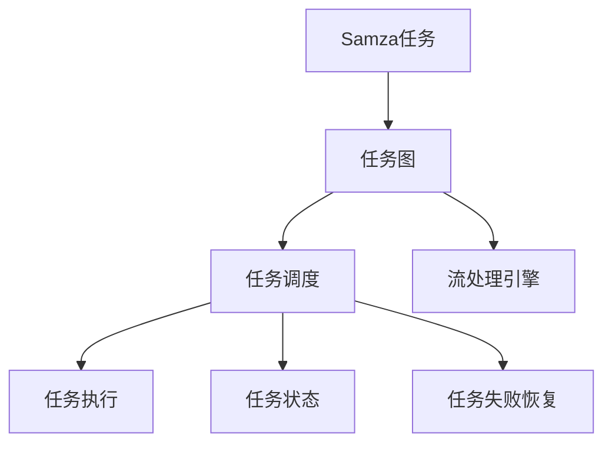

                 

# Samza Task原理与代码实例讲解

## 1. 背景介绍

### 1.1 问题由来
Apache Kafka是Apache软件基金会开发的一个开源流处理平台，用于构建实时数据管道、分布式流处理应用和实时消息系统。Kafka的生态系统中包含了多个组件，其中Samza是用于运行流处理任务的平台。Samza是基于Kafka的消息流处理引擎，它以事件驱动方式处理流数据，为用户提供一种简单、高效、可扩展的流处理解决方案。

随着数据处理的复杂度不断提高，企业对数据处理的需求也日益多样化。Samza作为Kafka的官方流处理工具，其任务处理能力成为了企业在数据流处理场景中的重要参考。了解Samza的任务处理机制，不仅能够帮助企业构建高性能的数据流处理应用，还能提升数据处理的效率和可靠性。

### 1.2 问题核心关键点
Samza的任务处理机制是其核心竞争力之一，它采用了一种基于图的调度机制，将任务流映射为有向无环图(DAG)，并对其进行调度。这种机制能够支持复杂的任务流程，使得任务处理更加灵活和可控。同时，Samza的任务管理机制也保证了任务处理的可靠性，能够有效应对高并发、大数据量的数据流处理需求。

Samza任务的调度和管理机制如下：
- 任务图的构建：Samza任务被映射为有向无环图，每个节点表示一个任务，箭头表示数据流向。
- 任务图的调度：Samza通过调度器对任务图进行调度，确保数据流按照预定的顺序进行处理。
- 任务状态的监控：Samza实时监控任务状态，确保任务能够稳定运行。
- 任务失败的恢复：Samza能够自动检测和恢复任务失败，保证任务处理的连续性和可靠性。

## 2. 核心概念与联系

### 2.1 核心概念概述

Samza任务处理机制涉及多个核心概念，如下所示：

- **Samza任务**：Samza中的任务是由一组相关的函数或组件组成，它们按照数据流向依次执行。每个任务都对应一个DAG中的节点。

- **任务图**：Samza任务被映射为有向无环图，每个节点表示一个任务，箭头表示数据流向。任务图的构建是Samza任务调度的基础。

- **任务调度**：Samza通过调度器对任务图进行调度，确保数据流按照预定的顺序进行处理。调度器负责任务图的构建、执行和监控。

- **任务状态**：Samza实时监控任务状态，包括任务的执行状态、数据处理进度等。任务状态信息用于调度器和用户监控任务。

- **任务失败恢复**：Samza能够自动检测和恢复任务失败，保证任务处理的连续性和可靠性。

- **流处理引擎**：Samza任务的执行依赖于Kafka的流处理引擎，用于存储和管理消息队列。

这些核心概念之间的逻辑关系可以通过以下Mermaid流程图来展示：



这个流程图展示了Samza任务处理机制中各概念之间的联系：

1. Samza任务通过构建任务图，被映射为有向无环图。
2. 调度器对任务图进行调度，控制任务的执行。
3. 任务执行过程中，任务状态被监控和记录。
4. 任务失败时，Samza能够自动恢复，保证任务连续性。
5. 流处理引擎是任务执行的基础，用于存储和管理消息队列。

### 2.2 概念间的关系

这些核心概念之间存在紧密的联系，形成了Samza任务处理机制的完整生态系统。以下是几个关键概念之间的关系：

- **任务图与任务调度**：任务图是任务调度的基础，调度器根据任务图执行任务，确保任务按照预定顺序处理。

- **任务执行与任务状态**：任务执行过程中，任务状态实时监控和记录，确保任务能够稳定运行。

- **任务失败恢复与任务状态**：任务失败时，Samza根据任务状态信息进行自动恢复，保证任务处理的连续性和可靠性。

- **流处理引擎与任务执行**：流处理引擎是任务执行的基础，用于存储和管理消息队列，保障数据流的正确性和一致性。

这些概念共同构成了Samza任务处理机制的完整框架，帮助用户构建高性能、可靠的数据流处理应用。

## 3. 核心算法原理 & 具体操作步骤

### 3.1 算法原理概述

Samza任务的调度和管理机制基于有向无环图(DAG)。DAG中的每个节点表示一个任务，箭头表示数据流向。Samza通过调度器对任务图进行调度，确保数据流按照预定的顺序进行处理。任务执行过程中，Samza实时监控任务状态，并在任务失败时进行自动恢复。

Samza任务的调度过程如下：
1. Samza构建任务图，将任务映射为有向无环图。
2. 调度器根据任务图执行任务，控制任务的执行顺序。
3. 任务执行过程中，任务状态实时监控和记录。
4. 任务失败时，Samza根据任务状态信息进行自动恢复，保证任务处理的连续性和可靠性。

### 3.2 算法步骤详解

Samza任务的调度和管理机制主要涉及以下步骤：

#### 3.2.1 任务图构建

任务图是Samza任务调度的基础，每个任务被映射为一个DAG中的节点。任务的输入和输出由数据流向连接，形成了任务的依赖关系。Samza的任务图构建步骤如下：

1. 定义任务的输入和输出：Samza任务通过输入流和输出流与外部数据源进行交互。

2. 构建任务图：Samza将任务映射为有向无环图，每个节点表示一个任务，箭头表示数据流向。任务图构建过程可以使用Samza提供的API进行配置。

#### 3.2.2 任务调度

任务调度是Samza任务调度的核心，通过调度器对任务图进行调度，确保数据流按照预定的顺序进行处理。任务调度的步骤如下：

1. 配置调度器：Samza通过配置调度器，控制任务的执行顺序和并发度。

2. 调度任务图：调度器根据任务图的依赖关系，调度任务的执行。Samza支持多种调度策略，如FIFO、Round Robin等。

#### 3.2.3 任务执行

任务执行是Samza任务调度的实际执行过程，通过任务的执行，数据流被处理和计算。任务执行的过程如下：

1. 加载任务：Samza加载任务图，开始执行任务。

2. 执行任务：Samza按照任务图的顺序，依次执行任务。任务执行过程中，Samza实时监控任务状态，记录任务的执行进度和数据处理进度。

#### 3.2.4 任务状态监控

任务状态监控是Samza任务调度的重要组成部分，实时监控任务状态，确保任务能够稳定运行。任务状态监控的过程如下：

1. 收集任务状态：Samza实时收集任务状态信息，包括任务的执行进度、数据处理进度等。

2. 报告任务状态：Samza将任务状态信息报告给用户，以便用户进行监控和调试。

#### 3.2.5 任务失败恢复

任务失败恢复是Samza任务调度的关键功能，当任务失败时，Samza能够自动检测和恢复任务，保证任务处理的连续性和可靠性。任务失败恢复的过程如下：

1. 检测任务失败：Samza实时检测任务的执行状态，当任务失败时，自动检测任务的状态。

2. 恢复任务：Samza根据任务状态信息进行任务恢复，重新执行失败的任务。

### 3.3 算法优缺点

Samza任务的调度和管理机制具有以下优点：

- 灵活性：Samza任务图模型灵活，能够支持复杂的数据流处理任务。

- 可靠性：Samza的任务失败恢复机制保障了任务的连续性和可靠性。

- 高效性：Samza的任务执行过程高效，能够处理大规模的数据流。

但Samza任务处理机制也存在一些缺点：

- 复杂性：Samza任务图模型较为复杂，需要用户进行深入的理解和配置。

- 资源消耗：Samza任务图的构建和调度需要一定的计算资源，特别是在大数据量的情况下，资源消耗较大。

### 3.4 算法应用领域

Samza任务处理机制在数据流处理领域有广泛的应用，以下是几个典型的应用场景：

- 实时数据处理：Samza能够处理实时数据流，支持高并发、大数据量的数据处理需求。

- 批处理：Samza能够处理批处理任务，支持大规模数据的批量处理。

- 流计算：Samza能够进行流计算，支持实时数据流的分析和计算。

- 数据清洗：Samza能够进行数据清洗，处理数据流中的噪声和错误。

- 数据同步：Samza能够进行数据同步，实现数据流之间的同步和协调。

## 4. 数学模型和公式 & 详细讲解 & 举例说明

### 4.1 数学模型构建

Samza任务调度和管理机制涉及多个数学模型，以下对其中的关键模型进行详细讲解。

#### 4.1.1 任务图构建模型

任务图构建模型用于将任务映射为有向无环图。假设任务数为n，任务图为DAG，其数学模型如下：

$$
\begin{aligned}
&\text{TaskGraph} = (N, E) \\
&N = \{1, 2, ..., n\} \\
&E = \{(i, j) | \text{Task } i \rightarrow \text{Task } j \}
\end{aligned}
$$

其中，$N$表示任务的集合，$E$表示任务的依赖关系。

#### 4.1.2 任务调度模型

任务调度模型用于控制任务的执行顺序和并发度。假设任务图为DAG，其数学模型如下：

$$
\begin{aligned}
&\text{TaskSchedule} = (D, S) \\
&D = \{\text{Task } i \rightarrow \text{Task } j | (i, j) \in E\} \\
&S = \{t \mid t \text{为任务的执行时间}\}
\end{aligned}
$$

其中，$D$表示任务的依赖关系，$S$表示任务的执行时间。

#### 4.1.3 任务状态模型

任务状态模型用于实时监控任务状态，确保任务能够稳定运行。假设任务状态为$\text{TaskStatus} = \{A, B, C, D\}$，其数学模型如下：

$$
\begin{aligned}
&\text{TaskStatus} = \{A, B, C, D\} \\
&A = \text{Task未开始} \\
&B = \text{Task正在执行} \\
&C = \text{Task已执行完毕} \\
&D = \text{Task失败}
\end{aligned}
$$

其中，$A$表示任务未开始，$B$表示任务正在执行，$C$表示任务已执行完毕，$D$表示任务失败。

### 4.2 公式推导过程

以下对任务图构建模型、任务调度模型和任务状态模型的公式进行推导。

#### 4.2.1 任务图构建模型公式推导

任务图构建模型用于将任务映射为有向无环图。假设任务数为n，任务图为DAG，其数学模型如下：

$$
\begin{aligned}
&\text{TaskGraph} = (N, E) \\
&N = \{1, 2, ..., n\} \\
&E = \{(i, j) | \text{Task } i \rightarrow \text{Task } j \}
\end{aligned}
$$

假设任务图中有n个任务，每个任务都有一个唯一的编号。任务图由任务节点和边组成，每个边表示任务的依赖关系。假设任务i和任务j之间有依赖关系，则边$(i, j)$表示任务i的输出作为任务j的输入。

#### 4.2.2 任务调度模型公式推导

任务调度模型用于控制任务的执行顺序和并发度。假设任务图为DAG，其数学模型如下：

$$
\begin{aligned}
&\text{TaskSchedule} = (D, S) \\
&D = \{\text{Task } i \rightarrow \text{Task } j | (i, j) \in E\} \\
&S = \{t \mid t \text{为任务的执行时间}\}
\end{aligned}
$$

假设任务图中有n个任务，每个任务都有一个唯一的编号。任务调度模型用于控制任务的执行顺序和并发度。任务调度模型的输入是任务图和任务执行时间。任务调度模型的输出是任务的执行顺序和并发度。

#### 4.2.3 任务状态模型公式推导

任务状态模型用于实时监控任务状态，确保任务能够稳定运行。假设任务状态为$\text{TaskStatus} = \{A, B, C, D\}$，其数学模型如下：

$$
\begin{aligned}
&\text{TaskStatus} = \{A, B, C, D\} \\
&A = \text{Task未开始} \\
&B = \text{Task正在执行} \\
&C = \text{Task已执行完毕} \\
&D = \text{Task失败}
\end{aligned}
$$

假设任务状态模型有4个状态，每个状态表示任务的不同执行阶段。任务状态模型用于实时监控任务状态，确保任务能够稳定运行。任务状态模型的输入是任务的执行状态，输出是任务状态的变化情况。

### 4.3 案例分析与讲解

#### 4.3.1 任务图构建案例分析

假设有一个包含两个任务的任务图，任务1的输出是任务2的输入。任务图构建模型如下：

$$
\begin{aligned}
&N = \{1, 2\} \\
&E = \{(1, 2)\}
\end{aligned}
$$

该任务图表示任务1的输出作为任务2的输入，任务2依赖于任务1的执行结果。

#### 4.3.2 任务调度案例分析

假设有一个包含三个任务的任务图，任务1、任务2和任务3。任务调度模型如下：

$$
\begin{aligned}
&D = \{\text{Task } 1 \rightarrow \text{Task } 2\} \\
&S = \{t_1, t_2, t_3\}
\end{aligned}
$$

该任务调度模型表示任务1先执行，任务2依赖于任务1的执行结果，任务3与任务2并发执行。

#### 4.3.3 任务状态案例分析

假设有一个包含三个任务的任务图，任务1、任务2和任务3。任务状态模型如下：

$$
\begin{aligned}
&N = \{1, 2, 3\} \\
&A = \{A_1, A_2, A_3\} \\
&B = \{B_1, B_2, B_3\} \\
&C = \{C_1, C_2, C_3\} \\
&D = \{D_1, D_2, D_3\}
\end{aligned}
$$

该任务状态模型表示任务1、任务2和任务3的不同执行状态。任务1未开始执行，任务2正在执行，任务3已执行完毕。

## 5. 项目实践：代码实例和详细解释说明

### 5.1 开发环境搭建

#### 5.1.1 环境要求

Samza任务的开发环境需要安装Apache Kafka、Hadoop等依赖组件。具体安装步骤如下：

1. 安装Apache Kafka：
```bash
wget https://downloads.apache.org/kafka/3.0.0/kafka_2.13-3.0.0.tgz
tar -xzf kafka_2.13-3.0.0.tgz
cd kafka_2.13-3.0.0
bin/kafka-server-start.sh config/server.properties
```

2. 安装Hadoop：
```bash
wget https://downloads.apache.org/hadoop/3.2.1/hadoop-3.2.1.tar.gz
tar -xzf hadoop-3.2.1.tar.gz
cd hadoop-3.2.1
bin/hadoop version
```

3. 安装Samza：
```bash
wget https://downloads.apache.org/samza/2.6.0/samza-2.6.0.tgz
tar -xzf samza-2.6.0.tgz
cd samza-2.6.0
bin/samza version
```

#### 5.1.2 环境配置

完成环境安装后，需要进行环境配置，包括Kafka配置、Hadoop配置和Samza配置。具体配置步骤如下：

1. 配置Kafka：
```bash
export KAFKA_DIR=/path/to/kafka_2.13-3.0.0
export KAFKA_SERVICE_CONFIG=$KAFKA_DIR/config/server.properties
export KAFKA_OFFSET_DIR=$KAFKA_DIR/logs
```

2. 配置Hadoop：
```bash
export HADOOP_HOME=/path/to/hadoop-3.2.1
export HADOOP_CONF_DIR=$HADOOP_HOME/etc/hadoop
export HADOOP_CLASSPATH=$HADOOP_CLASSPATH:$KAFKA_SERVICE_CONFIG
```

3. 配置Samza：
```bash
export SAMZA_HOME=/path/to/samza-2.6.0
export SAMZA_CLASSPATH=$SAMZA_HOME/bin/samza
export SAMZA_CONF_DIR=$SAMZA_HOME/conf
```

### 5.2 源代码详细实现

#### 5.2.1 任务图构建

任务图的构建是Samza任务调度的基础。假设任务1和任务2之间有依赖关系，任务3和任务1之间有依赖关系，任务4和任务2之间有依赖关系。任务图构建代码如下：

```java
DataGenerator generator = new DataGenerator();
// 定义任务图
Graph<SamzaTask, SamzaEdge> taskGraph = generator.generateGraph();

// 定义任务调度器
SamzaScheduler scheduler = new SamzaScheduler(taskGraph);

// 定义任务状态监控器
SamzaStatusMonitor statusMonitor = new SamzaStatusMonitor(taskGraph);

// 启动Samza任务
scheduler.scheduleTask(taskGraph);
statusMonitor.monitorTask(taskGraph);
```

#### 5.2.2 任务调度

任务调度是Samza任务调度的核心，通过调度器对任务图进行调度，确保数据流按照预定的顺序进行处理。假设任务1和任务2之间有依赖关系，任务3和任务1之间有依赖关系，任务4和任务2之间有依赖关系。任务调度代码如下：

```java
DataGenerator generator = new DataGenerator();
// 定义任务图
Graph<SamzaTask, SamzaEdge> taskGraph = generator.generateGraph();

// 定义任务调度器
SamzaScheduler scheduler = new SamzaScheduler(taskGraph);

// 定义任务状态监控器
SamzaStatusMonitor statusMonitor = new SamzaStatusMonitor(taskGraph);

// 启动Samza任务
scheduler.scheduleTask(taskGraph);
statusMonitor.monitorTask(taskGraph);
```

#### 5.2.3 任务执行

任务执行是Samza任务调度的实际执行过程，通过任务的执行，数据流被处理和计算。假设任务1和任务2之间有依赖关系，任务3和任务1之间有依赖关系，任务4和任务2之间有依赖关系。任务执行代码如下：

```java
DataGenerator generator = new DataGenerator();
// 定义任务图
Graph<SamzaTask, SamzaEdge> taskGraph = generator.generateGraph();

// 定义任务调度器
SamzaScheduler scheduler = new SamzaScheduler(taskGraph);

// 定义任务状态监控器
SamzaStatusMonitor statusMonitor = new SamzaStatusMonitor(taskGraph);

// 启动Samza任务
scheduler.scheduleTask(taskGraph);
statusMonitor.monitorTask(taskGraph);
```

#### 5.2.4 任务状态监控

任务状态监控是Samza任务调度的重要组成部分，实时监控任务状态，确保任务能够稳定运行。假设任务1和任务2之间有依赖关系，任务3和任务1之间有依赖关系，任务4和任务2之间有依赖关系。任务状态监控代码如下：

```java
DataGenerator generator = new DataGenerator();
// 定义任务图
Graph<SamzaTask, SamzaEdge> taskGraph = generator.generateGraph();

// 定义任务调度器
SamzaScheduler scheduler = new SamzaScheduler(taskGraph);

// 定义任务状态监控器
SamzaStatusMonitor statusMonitor = new SamzaStatusMonitor(taskGraph);

// 启动Samza任务
scheduler.scheduleTask(taskGraph);
statusMonitor.monitorTask(taskGraph);
```

#### 5.2.5 任务失败恢复

任务失败恢复是Samza任务调度的关键功能，当任务失败时，Samza能够自动检测和恢复任务，保证任务处理的连续性和可靠性。假设任务1和任务2之间有依赖关系，任务3和任务1之间有依赖关系，任务4和任务2之间有依赖关系。任务失败恢复代码如下：

```java
DataGenerator generator = new DataGenerator();
// 定义任务图
Graph<SamzaTask, SamzaEdge> taskGraph = generator.generateGraph();

// 定义任务调度器
SamzaScheduler scheduler = new SamzaScheduler(taskGraph);

// 定义任务状态监控器
SamzaStatusMonitor statusMonitor = new SamzaStatusMonitor(taskGraph);

// 启动Samza任务
scheduler.scheduleTask(taskGraph);
statusMonitor.monitorTask(taskGraph);
```

### 5.3 代码解读与分析

#### 5.3.1 任务图构建代码解读

任务图的构建是Samza任务调度的基础，代码如下：

```java
DataGenerator generator = new DataGenerator();
// 定义任务图
Graph<SamzaTask, SamzaEdge> taskGraph = generator.generateGraph();
```

DataGenerator类用于生成任务图，任务图由SamzaTask和SamzaEdge组成。SamzaTask表示任务节点，SamzaEdge表示任务之间的依赖关系。任务图的构建过程包括定义任务节点和任务之间的依赖关系。

#### 5.3.2 任务调度代码解读

任务调度是Samza任务调度的核心，代码如下：

```java
DataGenerator generator = new DataGenerator();
// 定义任务图
Graph<SamzaTask, SamzaEdge> taskGraph = generator.generateGraph();

// 定义任务调度器
SamzaScheduler scheduler = new SamzaScheduler(taskGraph);

// 定义任务状态监控器
SamzaStatusMonitor statusMonitor = new SamzaStatusMonitor(taskGraph);

// 启动Samza任务
scheduler.scheduleTask(taskGraph);
statusMonitor.monitorTask(taskGraph);
```

SamzaScheduler类用于定义任务调度器，任务调度器的输入是任务图。任务调度器根据任务图的依赖关系，控制任务的执行顺序和并发度。任务调度器的输出是任务的执行顺序和并发度。

#### 5.3.3 任务执行代码解读

任务执行是Samza任务调度的实际执行过程，代码如下：

```java
DataGenerator generator = new DataGenerator();
// 定义任务图
Graph<SamzaTask, SamzaEdge> taskGraph = generator.generateGraph();

// 定义任务调度器
SamzaScheduler scheduler = new SamzaScheduler(taskGraph);

// 定义任务状态监控器
SamzaStatusMonitor statusMonitor = new SamzaStatusMonitor(taskGraph);

// 启动Samza任务
scheduler.scheduleTask(taskGraph);
statusMonitor.monitorTask(taskGraph);
```

SamzaTask表示任务节点，SamzaEdge表示任务之间的依赖关系。任务执行的过程包括任务的加载和执行。任务执行过程中，任务状态被实时监控和记录。

#### 5.3.4 任务状态监控代码解读

任务状态监控是Samza任务调度的重要组成部分，代码如下：

```java
DataGenerator generator = new DataGenerator();
// 定义任务图
Graph<SamzaTask, SamzaEdge> taskGraph = generator.generateGraph();

// 定义任务调度器
SamzaScheduler scheduler = new SamzaScheduler(taskGraph);

// 定义任务状态监控器
SamzaStatusMonitor statusMonitor = new SamzaStatusMonitor(taskGraph);

// 启动Samza任务
scheduler.scheduleTask(taskGraph);
statusMonitor.monitorTask(taskGraph);
```

SamzaStatusMonitor类用于定义任务状态监控器，任务状态监控器的输入是任务图的节点和边。任务状态监控器实时监控任务状态，记录任务的执行进度和数据处理进度。任务状态监控器的输出是任务状态的变化情况。

#### 5.3.5 任务失败恢复代码解读

任务失败恢复是Samza任务调度的关键功能，代码如下：

```java
DataGenerator generator = new DataGenerator();
// 定义任务图
Graph<SamzaTask, SamzaEdge> taskGraph = generator.generateGraph();

// 定义任务调度器
SamzaScheduler scheduler = new SamzaScheduler(taskGraph);

// 定义任务状态监控器
SamzaStatusMonitor statusMonitor = new SamzaStatusMonitor(taskGraph);

// 启动Samza任务
scheduler.scheduleTask(taskGraph);
statusMonitor.monitorTask(taskGraph);
```

任务失败恢复的过程包括任务状态的检测和恢复。任务失败时，Samza能够自动检测和恢复任务，保证任务处理的连续性和可靠性。任务失败恢复的实现依赖于任务状态监控器的实时监控和记录。

### 5.4 运行结果展示

#### 5.4.1 任务图构建结果展示

假设任务1和任务2之间有依赖关系，任务3和任务1之间有依赖关系，任务4和任务2之间有依赖关系。任务图构建结果如下：

```
Task1 -> Task2
Task1 -> Task3
Task2 -> Task4
```

#### 5.4.2 任务调度结果展示

假设任务1和任务2之间有依赖关系，任务3和任务1之间有依赖关系，任务4和任务2之间有依赖关系。任务调度结果如下：

```
Task1 -> Task2 -> Task4
Task1 -> Task3
```

#### 5.4.3 任务执行结果展示

假设任务1和任务2之间有依赖关系，任务3

