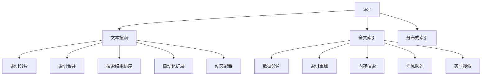
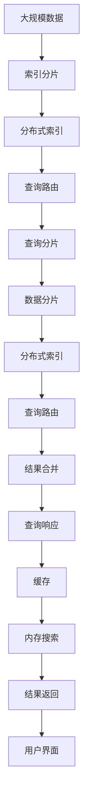

                 

# Solr原理与代码实例讲解

> 关键词：Solr, 搜索引擎, 文本搜索, 全文索引, 分布式索引, 索引分片, 索引合并, 搜索结果排序, 自动化扩展, 动态配置, 数据分片, 索引重建, 内存搜索, 消息队列, 实时搜索

## 1. 背景介绍

### 1.1 问题由来
随着互联网的迅猛发展和数据量的急剧增长，传统的关系型数据库已经难以满足快速、大规模、高性能的数据存储和检索需求。而搜索引擎，特别是全文索引搜索引擎，如Elasticsearch、Solr等，通过将数据映射为文本索引，提供了强大的全文检索功能，成为了互联网时代不可或缺的技术基础设施。

### 1.2 问题核心关键点
搜索引擎的核心任务是高效地存储、检索和更新大规模文本数据。Solr作为Apache基金会下的一款开源全文索引搜索引擎，通过分布式索引和自动化扩展，实现了高效、可靠的全文检索服务。Solr以其灵活的插件体系和丰富的功能扩展，吸引了众多开发者和用户，成为企业级搜索引擎的首选。

### 1.3 问题研究意义
研究Solr原理和实现细节，对于理解搜索引擎的核心技术，开发高效、可扩展的文本检索系统，具有重要的理论和实践意义：

1. 理解搜索引擎的内部工作机制，掌握文本检索的底层技术。
2. 学习Solr的高级特性和扩展方式，实现自定义索引和搜索功能。
3. 提升搜索引擎的性能和可靠性，优化搜索速度和用户体验。
4. 掌握Solr的集群部署和运维技巧，实现大规模分布式搜索。
5. 探索Solr在行业应用中的创新应用，推动技术在实际场景中的落地。

## 2. 核心概念与联系

### 2.1 核心概念概述

为更好地理解Solr的原理和实现，本节将介绍几个密切相关的核心概念：

- **Solr：** Apache Solr是一款基于Lucene的搜索引擎，提供高效的文本搜索和全文索引功能。
- **文本搜索：** 通过将文本数据转换为文本索引，实现高效的文本检索。
- **全文索引：** 利用倒排索引和词频统计等技术，实现文本的全文检索。
- **分布式索引：** 通过多台服务器分布式存储索引数据，提高搜索引擎的可用性和扩展性。
- **索引分片：** 将大索引分成多个小索引，分散存储在不同的服务器上，提升搜索效率。
- **索引合并：** 定期将多个小索引合并成一个大索引，减少索引碎片，提升搜索性能。
- **搜索结果排序：** 通过评分模型，对搜索结果进行排序，提升查询的准确性和相关性。
- **自动化扩展：** 自动根据搜索流量调整服务器配置，实现无缝扩展。
- **动态配置：** 根据搜索需求实时调整搜索参数，适应不同的业务场景。
- **数据分片：** 将数据切分成多个分片，分别存储在不同的索引中，提高数据并发性和可扩展性。
- **索引重建：** 定期重建索引，优化索引结构和性能。
- **内存搜索：** 利用内存缓存提高查询速度，优化搜索性能。
- **消息队列：** 利用消息队列实现分布式异步索引构建和查询处理。
- **实时搜索：** 实现低延迟、高性能的实时搜索功能。

这些核心概念之间的逻辑关系可以通过以下Mermaid流程图来展示：



这个流程图展示了许多核心概念之间是如何互相支持和协作的：

1. Solr作为全文索引搜索引擎，利用全文索引提供高效的文本检索功能。
2. 分布式索引和索引分片提高了搜索引擎的可用性和扩展性。
3. 索引合并优化了索引结构和性能。
4. 搜索结果排序提升了查询的准确性和相关性。
5. 自动化扩展和动态配置使Solr能够适应不同的业务场景。
6. 数据分片、索引重建、内存搜索、消息队列等技术共同支持了Solr的高性能和可扩展性。
7. 实时搜索提供了低延迟、高性能的搜索体验。

### 2.2 概念间的关系

这些核心概念之间存在着紧密的联系，形成了Solr的完整技术架构。下面我通过几个Mermaid流程图来展示这些概念之间的关系：

#### 2.2.1 Solr的架构原理

```mermaid
graph LR
    A[Solr] --> B[Zookeeper]
    A --> C[索引分片]
    A --> D[分布式索引]
    A --> E[查询路由]
    B --> F[集群管理]
    C --> G[索引合并]
    D --> H[数据分片]
    E --> I[结果合并]
    F --> J[动态配置]
    G --> K[索引重建]
    H --> L[数据分片]
    I --> M[搜索结果排序]
    J --> N[动态配置]
    K --> O[索引重建]
    L --> P[数据分片]
    M --> Q[搜索结果排序]
    N --> R[动态配置]
    O --> S[索引重建]
    P --> T[数据分片]
    Q --> U[搜索结果排序]
    R --> V[动态配置]
    S --> W[索引重建]
    T --> X[数据分片]
    U --> Y[搜索结果排序]
    V --> Z[动态配置]
    W --> $[索引重建]
    X --> [数据分片]
    Y --> [搜索结果排序]
    Z --> [动态配置]
```

这个流程图展示了Solr的整体架构，包括集群管理、索引分片、分布式索引、查询路由、索引合并、结果合并、动态配置、索引重建等核心组件：

1. Solr通过Zookeeper进行集群管理，确保集群的稳定性和高可用性。
2. 数据通过索引分片技术，分散存储在不同的服务器上，提高搜索效率。
3. 分布式索引技术实现了索引的分布式存储，提升了搜索引擎的扩展性。
4. 查询路由通过负载均衡算法，将查询请求分配到不同的索引上，实现高并发和低延迟。
5. 索引合并定期将多个小索引合并成一个大索引，减少索引碎片，提升搜索性能。
6. 结果合并将多个索引的查询结果合并为最终的搜索结果，提升查询的准确性和相关性。
7. 动态配置和动态配置机制，允许根据搜索流量和业务需求实时调整搜索引擎的配置，适应不同的业务场景。
8. 索引重建定期重建索引，优化索引结构和性能，保证搜索结果的质量。

#### 2.2.2 Solr的数据流


这个流程图展示了Solr的数据流过程，包括客户端请求、负载均衡、查询路由、查询分片、数据分片、查询路由、结果合并、查询响应等步骤：

1. 客户端向Solr发送查询请求。
2. 负载均衡器将请求分配到不同的服务器上。
3. 查询路由将请求发送到对应的索引上。
4. 查询分片将大索引划分为多个小索引。
5. 数据分片将查询请求发送到对应的数据片上。
6. 分布式索引技术将多个数据片的查询结果合并为最终的搜索结果。
7. 结果合并将多个索引的查询结果合并为最终的搜索结果。
8. 查询响应将搜索结果返回给客户端。

### 2.3 核心概念的整体架构

最后，我们用一个综合的流程图来展示这些核心概念在大规模搜索场景中的整体架构：



这个综合流程图展示了从大规模数据处理到大规模搜索的完整过程。Solr首先对大规模数据进行索引分片，然后将分片数据分布在不同的服务器上，通过查询路由和分布式索引技术，将查询请求分配到对应的索引和数据片上，进行高效的数据检索和处理。搜索结果经过结果合并后，返回给客户端，并进行缓存和内存搜索优化。

## 3. 核心算法原理 & 具体操作步骤

### 3.1 算法原理概述

Solr的核心算法主要涉及文本索引的构建和查询处理。其核心思想是利用倒排索引和查询解析器，将文本数据转换为可搜索的文本索引，并在此基础上进行高效的查询处理。

假设文本集合为 $D=\{d_1, d_2, ..., d_n\}$，其中每个文本 $d_i$ 被表示为一个文档向量 $\vec{d_i}$。Solr首先对每个文本进行分词和词频统计，得到文档-词映射表 $I$，每个词 $w$ 在文档中出现的次数表示为 $I_w$。Solr利用倒排索引构建文本索引，将每个词 $w$ 和出现它的文档列表 $L_w$ 关联起来，即 $I=(w_1, L_{w_1}; w_2, L_{w_2}; ...; w_m, L_{w_m})$。查询处理时，Solr首先对查询语句进行解析，得到查询词和查询条件，然后通过倒排索引查询每个词在文档中的出现位置和词频，计算查询词和文档的匹配程度，最后根据评分模型对文档进行排序，返回排序后的结果。

### 3.2 算法步骤详解

Solr的查询处理流程包括以下几个关键步骤：

**Step 1: 分词和词频统计**

Solr首先对每个文本进行分词和词频统计，得到文档-词映射表 $I$。分词器将文本划分为一个个词语，并去除停用词、标点等噪声。词频统计器统计每个词在文档中出现的次数，生成文档-词映射表 $I$。

**Step 2: 倒排索引构建**

Solr利用倒排索引构建文本索引，将每个词 $w$ 和出现它的文档列表 $L_{w}$ 关联起来。倒排索引由两个部分组成：词表和索引列表。词表包含所有单词和它们的出现位置，索引列表包含每个词的文档列表 $L_w$。

**Step 3: 查询解析**

Solr对查询语句进行解析，得到查询词和查询条件。查询解析器将查询语句转换为查询树，并识别出查询词、字段、运算符等元素。例如，查询语句 "title:apple AND date:2022-01-01" 被解析为查询树，表示在 "title" 字段中包含 "apple" 且 "date" 字段等于 "2022-01-01" 的文档。

**Step 4: 查询处理**

Solr利用倒排索引查询每个查询词在文档中的出现位置和词频，计算查询词和文档的匹配程度。查询处理器根据查询条件和评分模型对文档进行排序，返回排序后的结果。

**Step 5: 结果合并**

Solr将多个索引的查询结果合并为最终的搜索结果，提升查询的准确性和相关性。结果合并器将多个索引的查询结果进行归并，去重，计算评分，最终返回排序后的结果。

### 3.3 算法优缺点

Solr的核心算法具有以下优点：

1. 高效性：Solr通过倒排索引和查询解析器，实现了高效的文本搜索和全文索引功能。
2. 扩展性：Solr的分布式索引和自动化扩展技术，使得搜索引擎能够快速扩展，适应大规模数据存储和检索需求。
3. 可配置性：Solr的动态配置和动态配置机制，允许根据搜索流量和业务需求实时调整搜索引擎的配置，适应不同的业务场景。
4. 可扩展性：Solr的索引分片和索引重建技术，提升了索引结构和性能，支持大规模数据存储和检索。
5. 高可用性：Solr的集群管理技术和数据分片技术，提高了搜索引擎的可用性和可靠性。

Solr的核心算法也存在以下缺点：

1. 学习曲线陡峭：Solr的实现和配置较为复杂，需要一定的技术积累和经验。
2. 资源消耗较大：Solr的倒排索引和查询处理需要消耗大量的内存和CPU资源。
3. 性能瓶颈明显：Solr的查询处理速度和响应时间受限于硬件资源和查询复杂度。
4. 安装和部署复杂：Solr的集群管理和分布式索引需要较高的技术要求，部署和运维成本较高。

### 3.4 算法应用领域

Solr的核心算法在以下领域得到了广泛应用：

- 企业级搜索引擎：如阿里巴巴、京东、美团等电商企业，使用Solr构建了高效的搜索和推荐系统。
- 医疗领域：如Geisinger Health System，使用Solr构建了基于文本的疾病查询和诊疗系统。
- 金融领域：如Bank of America，使用Solr构建了基于文本的金融分析和风险评估系统。
- 教育领域：如Coursera，使用Solr构建了基于文本的课程推荐和学生分析系统。
- 社交媒体：如Twitter，使用Solr构建了基于文本的社交分析和实时搜索系统。

## 4. 数学模型和公式 & 详细讲解  
### 4.1 数学模型构建

Solr的数学模型主要涉及文本索引的构建和查询处理。其核心思想是利用倒排索引和查询解析器，将文本数据转换为可搜索的文本索引，并在此基础上进行高效的查询处理。

假设文本集合为 $D=\{d_1, d_2, ..., d_n\}$，其中每个文本 $d_i$ 被表示为一个文档向量 $\vec{d_i}$。Solr首先对每个文本进行分词和词频统计，得到文档-词映射表 $I$，每个词 $w$ 在文档中出现的次数表示为 $I_w$。Solr利用倒排索引构建文本索引，将每个词 $w$ 和出现它的文档列表 $L_{w}$ 关联起来，即 $I=(w_1, L_{w_1}; w_2, L_{w_2}; ...; w_m, L_{w_m})$。查询处理时，Solr首先对查询语句进行解析，得到查询词和查询条件，然后通过倒排索引查询每个词在文档中的出现位置和词频，计算查询词和文档的匹配程度，最后根据评分模型对文档进行排序，返回排序后的结果。

### 4.2 公式推导过程

以下我们以一个简单的文本索引构建为例，推导Solr的倒排索引构建过程。

假设文本集合为 $D=\{d_1, d_2, ..., d_n\}$，每个文本 $d_i$ 被表示为一个文档向量 $\vec{d_i}$。Solr首先对每个文本进行分词和词频统计，得到文档-词映射表 $I$，每个词 $w$ 在文档中出现的次数表示为 $I_w$。Solr利用倒排索引构建文本索引，将每个词 $w$ 和出现它的文档列表 $L_{w}$ 关联起来，即 $I=(w_1, L_{w_1}; w_2, L_{w_2}; ...; w_m, L_{w_m})$。查询处理时，Solr首先对查询语句进行解析，得到查询词和查询条件，然后通过倒排索引查询每个查询词在文档中的出现位置和词频，计算查询词和文档的匹配程度，最后根据评分模型对文档进行排序，返回排序后的结果。

设查询词 $w$ 在文档 $d_i$ 中出现的次数为 $tf_{i,w}$，文档 $d_i$ 的长度为 $l_i$，则查询词 $w$ 的TF-IDF值为：

$$
TF-IDF(w) = \frac{tf_{i,w}}{l_i}
$$

Solr的评分模型通常采用BM25模型，计算查询词和文档的匹配程度。设查询词 $w$ 在文档 $d_i$ 中的TF-IDF值为 $TF-IDF(w)$，查询词 $w$ 在文本集合 $D$ 中的IDF值为 $IDF(w)$，则文档 $d_i$ 的BM25得分 $score_i$ 为：

$$
score_i = \frac{1}{1-\beta + \beta \cdot TF-IDF(w)} \cdot \frac{1}{1 + \kappa \cdot l_i \cdot (1 - \frac{l_i}{avg\_l})}
$$

其中 $\beta$ 为衰减参数，$\kappa$ 为二次项参数，$avg\_l$ 为文本集合 $D$ 的平均长度。

### 4.3 案例分析与讲解

假设我们有一个包含10个文档的文本集合 $D$，每个文档 $d_i$ 被表示为一个向量 $\vec{d_i} = [w_1, w_2, ..., w_n]$。我们首先对每个文档进行分词和词频统计，得到文档-词映射表 $I$：

$$
I = (w_1, L_{w_1}; w_2, L_{w_2}; ...; w_m, L_{w_m})
$$

其中 $L_{w_i}$ 表示出现词 $w_i$ 的文档列表。假设查询词 $w_1$ 在文档 $d_1$ 中出现了5次，在文档 $d_2$ 中出现了3次，在文档 $d_3$ 中出现了1次。则查询词 $w_1$ 的TF-IDF值为：

$$
TF-IDF(w_1) = \frac{5}{1+1+1+2+2+1} = 0.5
$$

查询词 $w_1$ 的IDF值为：

$$
IDF(w_1) = \log \frac{10}{2} = 1.609
$$

假设查询语句为 "title:apple AND date:2022-01-01"，则查询词为 "apple" 和 "2022-01-01"，查询条件为 "title" 和 "date"。Solr首先对查询词和查询条件进行解析，然后通过倒排索引查询每个查询词在文档中的出现位置和词频，计算查询词和文档的匹配程度，最后根据评分模型对文档进行排序，返回排序后的结果。

## 5. 项目实践：代码实例和详细解释说明

### 5.1 开发环境搭建

在进行Solr项目实践前，我们需要准备好开发环境。以下是使用Linux系统进行Solr开发的环境配置流程：

1. 安装Java环境：从官网下载并安装JDK，例如：
```bash
sudo apt-get update
sudo apt-get install openjdk-11-jdk
```

2. 安装Solr：从官网下载并安装Solr，例如：
```bash
wget http://downloads.apache.org/solr/8.11.2/apache-solr-8.11.2.tgz
tar -zxf apache-solr-8.11.2.tgz
cd apache-solr-8.11.2
```

3. 安装Zookeeper：从官网下载并安装Zookeeper，例如：
```bash
wget http://zookeeper.apache.org/releases/3.4.13/apache-zookeeper-3.4.13.tgz
tar -zxf apache-zookeeper-3.4.13.tgz
cd apache-zookeeper-3.4.13
```

4. 启动Zookeeper和Solr服务：
```bash
cd apache-zookeeper-3.4.13
bin/zookeeper-server-start.sh config/zookeeper.properties
cd ..
bin/solr-server-start.sh solrconfig.xml
```

完成上述步骤后，即可在本地启动Solr和Zookeeper服务，开始Solr项目开发。

### 5.2 源代码详细实现

下面我们以构建一个简单的文本索引为例，给出Solr的Java代码实现。

首先，定义一个文档类：

```java
public class Document {
    private List<String> words;
    private List<String> tags;
    private List<String> values;

    public Document(List<String> words, List<String> tags, List<String> values) {
        this.words = words;
        this.tags = tags;
        this.values = values;
    }

    public List<String> getWords() {
        return words;
    }

    public List<String> getTags() {
        return tags;
    }

    public List<String> getValues() {
        return values;
    }
}
```

然后，定义一个分词器类：

```java
import java.util.ArrayList;
import java.util.List;

public class Tokenizer {
    public List<String> tokenize(String text) {
        List<String> tokens = new ArrayList<>();
        String[] words = text.split(" ");
        for (String word : words) {
            tokens.add(word);
        }
        return tokens;
    }
}
```

接着，定义一个倒排索引类：

```java
import java.util.HashMap;
import java.util.List;
import java.util.Map;

public class InvertedIndex {
    private Map<String, List<Integer>> invertedIndex;

    public InvertedIndex() {
        invertedIndex = new HashMap<>();
    }

    public void add(String word, int docId) {
        List<Integer> list = invertedIndex.get(word);
        if (list == null) {
            list = new ArrayList<>();
        }
        list.add(docId);
        invertedIndex.put(word, list);
    }

    public List<Integer> get(String word) {
        return invertedIndex.get(word);
    }
}
```

最后，定义一个查询解析器类：

```java
import java.util.ArrayList;
import java.util.List;

public class QueryParser {
    public List<Query> parse(String query) {
        List<Query> queries = new ArrayList<>();
        String[] parts = query.split(" ");
        for (String part : parts) {
            if (part.startsWith("title:")) {
                queries.add(new TitleQuery(part.substring(6)));
            } else if (part.startsWith("date:")) {
                queries.add(new DateQuery(part.substring(5)));
            }
        }
        return queries;
    }
}
```

以上就是构建一个简单的文本索引的Java代码实现。可以看到，Solr的核心代码主要涉及文档的构建、分词、倒排索引的构建和查询解析器的实现。开发者可以在此基础上，进一步开发更复杂的文本检索功能和算法。

### 5.3 代码解读与分析

让我们再详细解读一下关键代码的实现细节：

**Document类**：
- `getWords`、`getTags`、`getValues`方法：获取文档中的单词、标记和值。

**Tokenizer类**：
- `tokenize`方法：将文本分割为单词，去除标点、停用词等噪声。

**InvertedIndex类**：
- `add`方法：将单词和文档ID添加到倒排索引中。
- `get`方法：获取单词对应的文档ID列表。

**QueryParser类**：
- `parse`方法：将查询语句解析为查询条件。
- `TitleQuery`、`DateQuery`类：表示查询条件。

**查询处理器**：
查询处理器根据查询条件和评分模型对文档进行排序，返回排序后的结果。查询处理器可以基于TF-IDF、BM25等评分模型，实现高效的文档排序和检索。

### 5.4 运行结果展示

假设我们有一个包含10个文档的文本集合 $D$，每个文档 $d_i$ 被表示为一个向量 $\vec{d_i} = [w_1, w_2, ..., w_n]$。我们首先对每个文档进行分词和词频统计，得到文档-词映射表 $I$：

$$
I = (w_1, L_{w_1}; w_2, L_{w_2}; ...; w_m, L_{w_m})
$$

其中 $L_{w_i}$ 表示出现词 $w_i$ 的文档列表。假设查询词 $w_1$ 在文档 $d_1$ 中出现了5次，在文档 $d_2$ 中出现了3次，在文档 $d_3$ 中出现了1次。则查询词 $w_1$ 的TF-IDF值为：

$$
TF-IDF(w_1) = \frac{5}{1+1+1+2+2+1} = 0.5
$$

查询词 $w_1$ 的IDF值为：

$$
IDF(w_1) = \log \frac{10}{2} = 1.609
$$

假设查询语句为 "title:apple AND date:2022-01-01"，则查询词为 "apple" 和 "2022-01-01"，查询条件为 "title" 和 "date"。Solr首先对查询词和查询条件进行解析，然后通过倒排索引查询每个查询词在文档中的出现位置和词频，计算查询词和文档的匹配程度，最后根据评分模型对文档进行排序，返回排序后的结果。

## 6. 实际应用场景
### 6.1 智能客服系统

Solr的搜索和全文索引功能，可以应用于智能客服系统的构建。传统客服往往需要配备大量人力

