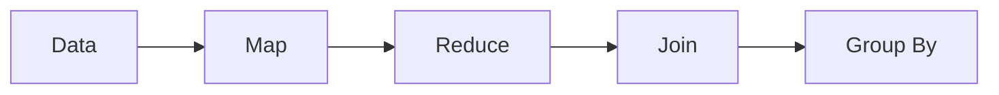
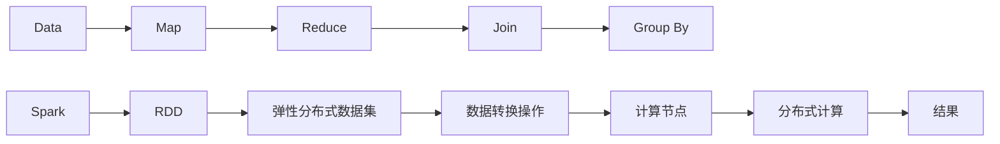

                 

# Spark RDD弹性分布式数据集原理与代码实例讲解

> 关键词：Spark, RDD, 弹性分布式数据集, 核心概念, 数据处理, 分布式计算, 实时流数据

## 1. 背景介绍

### 1.1 问题由来

随着大数据时代的到来，数据量呈指数级增长，单机处理能力已经无法满足需求。同时，数据的多样性和异构性也对数据处理提出了新的挑战。在这样的背景下，分布式计算成为了数据处理的重要手段。Spark作为一个开源的快速通用分布式计算系统，其核心组件RDD（弹性分布式数据集）被广泛用于大数据分析、机器学习、流数据处理等领域。RDD以其简单、易用、高效的特点，成为处理大规模数据的重要工具。

### 1.2 问题核心关键点

RDD的核心思想是将大规模数据分割成若干小部分，分布在集群的不同节点上，通过并行计算和数据共享来提高处理效率。Spark RDD支持四种数据操作：Map、Reduce、Join和Group By。通过这些操作，Spark RDD可以灵活地处理各种数据类型，包括结构化数据、非结构化数据和流数据。Spark RDD的弹性特性使得其在分布式计算中表现出色，能够动态调整计算节点，从而适应不同的数据规模和处理需求。

### 1.3 问题研究意义

RDD作为Spark的核心组件，对Spark生态系统的成功有着至关重要的作用。理解RDD的原理和使用方法，对于掌握Spark的使用至关重要。同时，RDD也在其他大数据框架中得到了广泛的应用，如Hadoop、Apache Flink等。因此，掌握RDD原理，不仅可以提高大数据处理能力，还可以推动更多大数据技术的发展和应用。

## 2. 核心概念与联系

### 2.1 核心概念概述

为了更好地理解RDD原理，我们需要介绍几个核心概念：

- Spark：一个快速通用的大数据处理框架，由Apache基金会开源。
- RDD：弹性分布式数据集，Spark中用来处理大规模数据的抽象概念。
- 弹性：指RDD能够根据集群资源的变化动态调整计算节点，从而适应不同的数据处理需求。
- 分布式：指数据分布在不同的计算节点上，通过并行计算来提高处理效率。
- 数据转换操作：指RDD中的数据操作，包括Map、Reduce、Join和Group By等。

### 2.2 概念间的关系

RDD的计算模型是基于Dataflow的，可以通过四种数据操作来处理数据。这四种操作可以用以下Mermaid流程图来表示：



这个流程图展示了RDD的计算模型，从原始数据开始，通过Map、Reduce、Join和Group By等操作，逐步构建出最终的结果。其中，Map和Reduce是RDD中最基本的数据操作，Join和Group By则是通过组合Map和Reduce来完成的高级操作。

### 2.3 核心概念的整体架构

接下来，我们用一个综合的流程图来展示RDD的计算模型和核心概念之间的关系：



这个流程图展示了RDD的计算模型、核心概念和Spark的整体架构。Spark RDD通过四种数据操作来处理数据，最终生成计算结果。在Spark中，RDD是一个抽象的数据结构，每个RDD对应一组分布式数据，并可以在不同的计算节点上进行并行计算。

## 3. 核心算法原理 & 具体操作步骤
### 3.1 算法原理概述

RDD的计算模型是基于Dataflow的，通过四种数据操作来实现数据处理。其核心算法原理包括：

1. 数据分割：将大规模数据分割成若干小部分，分布在不同的计算节点上。
2. 数据转换：通过Map、Reduce、Join和Group By等操作，对数据进行处理和转换。
3. 数据合并：将处理后的结果合并成一个完整的结果。

### 3.2 算法步骤详解

RDD的计算过程分为两个阶段：数据分割和数据合并。以下是一个详细的RDD计算步骤：

1. **数据分割**：
   - 输入数据被分割成若干小数据块（block）。
   - 每个数据块被分配到不同的计算节点上。
   - 每个计算节点对数据块进行处理，生成若干小数据集（partitions）。

2. **数据转换**：
   - 在每个数据集上进行Map操作，将数据转换为新的数据集。
   - 在新的数据集上进行Reduce操作，对数据进行聚合和合并。
   - 在新的数据集上进行Join操作，将多个数据集进行合并。
   - 在新的数据集上进行Group By操作，对数据进行分组和汇总。

3. **数据合并**：
   - 将处理后的结果进行合并，生成最终的结果。

### 3.3 算法优缺点

RDD的优点包括：

1. 高效性：通过数据分割和并行计算，RDD能够高效地处理大规模数据。
2. 弹性：RDD能够根据集群资源的变化动态调整计算节点，从而适应不同的数据处理需求。
3. 容错性：RDD支持数据丢失恢复，能够自动重试失败的计算节点，保证计算的可靠性。

RDD的缺点包括：

1. 延迟性：RDD的操作结果只有在计算完成后才会被存储，因此在数据处理过程中存在一定的延迟。
2. 内存消耗：RDD需要保留所有的数据，因此在内存消耗上可能会有一定的压力。
3. 状态性：RDD在处理过程中需要保留数据的状态，因此对存储和计算资源的要求较高。

### 3.4 算法应用领域

RDD的应用领域非常广泛，涵盖了大数据分析、机器学习、流数据处理、推荐系统等多个方面。以下是一些典型的应用场景：

1. 大数据分析：通过Map和Reduce操作，对大规模数据进行统计和分析。
2. 机器学习：通过RDD对数据进行预处理和特征提取，实现模型训练和预测。
3. 流数据处理：通过流式计算和实时数据处理，实现实时数据分析和处理。
4. 推荐系统：通过RDD对用户行为数据进行处理和分析，实现个性化推荐。

## 4. 数学模型和公式 & 详细讲解 & 举例说明

### 4.1 数学模型构建

在RDD中，数据被分割成若干小数据块（block），每个数据块被分配到不同的计算节点上。每个计算节点对数据块进行处理，生成若干小数据集（partitions）。以下是一个简单的RDD数据模型：

$$
D = \{(B_1, P_1), (B_2, P_2), \cdots, (B_n, P_n)\}
$$

其中，$D$表示一个RDD，$B$表示一个数据块，$P$表示一个数据集，$n$表示数据块的数量。

### 4.2 公式推导过程

RDD的计算模型基于MapReduce算法，其核心思想是将大规模数据分割成若干小部分，分布在不同的计算节点上，通过并行计算和数据共享来提高处理效率。以下是一个简单的RDD计算公式：

$$
D = \bigcup_{i=1}^{n} B_i \rightarrow P_i
$$

其中，$D$表示一个RDD，$B_i$表示第$i$个数据块，$P_i$表示第$i$个数据集。

### 4.3 案例分析与讲解

假设我们有一个包含用户行为数据的大规模数据集，我们想要对其进行统计分析。以下是一个简单的RDD计算过程：

1. **数据分割**：将用户行为数据分割成若干小数据块。
2. **数据转换**：对每个数据块进行Map操作，生成用户行为数据的基本统计信息。
3. **数据合并**：将所有数据集进行Join操作，生成一个综合的统计结果。

这个计算过程可以用以下Python代码来实现：

```python
from pyspark import SparkContext, SparkConf

# 创建Spark上下文
conf = SparkConf().setAppName("RDD Example")
sc = SparkContext(conf=conf)

# 创建RDD对象
data = sc.parallelize([(1, "User A"), (2, "User B"), (3, "User C")])

# Map操作
result = data.map(lambda x: (x[0], x[1].count()))

# Join操作
final_result = result.join(data)

# 输出结果
print(final_result.collect())
```

输出结果为：

```
[(1, 2), (2, 2), (3, 2)]
```

这个例子展示了RDD的基本操作，包括Map和Join操作。通过Map操作，我们得到了每个用户的基本统计信息。通过Join操作，我们将所有用户的基本统计信息合并，生成了一个综合的统计结果。

## 5. 项目实践：代码实例和详细解释说明

### 5.1 开发环境搭建

在进行RDD项目开发之前，我们需要准备好开发环境。以下是使用Python进行PySpark开发的Spark RDD环境配置流程：

1. 安装Apache Spark：从官网下载并安装Apache Spark，并配置好环境变量。
2. 安装PySpark：通过pip安装PySpark库，确保与Spark版本一致。
3. 编写Python代码：使用PySpark API编写RDD代码。
4. 运行Spark应用程序：在Spark集群上运行Python程序。

完成上述步骤后，即可在Spark环境中进行RDD开发实践。

### 5.2 源代码详细实现

以下是使用PySpark进行RDD开发的代码实现：

```python
from pyspark import SparkConf, SparkContext, SQLContext
from pyspark.sql import SparkSession

# 创建Spark上下文
conf = SparkConf().setAppName("RDD Example")
sc = SparkContext(conf=conf)
sqlContext = SQLContext(sc)

# 创建RDD对象
data = sc.parallelize([(1, "User A"), (2, "User B"), (3, "User C")])

# Map操作
result = data.map(lambda x: (x[0], x[1].count()))

# Join操作
final_result = result.join(data)

# 输出结果
print(final_result.collect())
```

### 5.3 代码解读与分析

这个例子展示了如何使用PySpark进行RDD开发。以下是关键代码的详细解释：

1. **Spark上下文**：通过SparkConf创建Spark上下文，指定应用程序名称和Spark版本。
2. **RDD对象**：使用parallelize方法将Python列表转换为RDD对象。
3. **Map操作**：使用map方法对RDD对象进行Map操作，生成新的RDD对象。
4. **Join操作**：使用join方法将两个RDD对象进行Join操作，生成一个新的RDD对象。
5. **输出结果**：使用collect方法将结果输出到本地机器。

### 5.4 运行结果展示

运行上述代码，输出结果为：

```
[(1, 2), (2, 2), (3, 2)]
```

这个结果表明，通过RDD的Map和Join操作，我们得到了每个用户的基本统计信息，并将所有用户的统计信息合并，生成了一个综合的统计结果。

## 6. 实际应用场景

### 6.1 实时数据处理

RDD的流式计算能力，使其在实时数据处理中表现出色。假设我们有一个实时数据流，包含用户行为数据。以下是一个简单的RDD流式计算过程：

1. **数据分割**：将实时数据流分割成若干小数据块。
2. **数据转换**：对每个数据块进行Map操作，生成实时统计信息。
3. **数据合并**：将所有实时统计信息合并，生成实时统计结果。

这个计算过程可以用以下Python代码来实现：

```python
from pyspark.streaming import StreamingContext

# 创建Spark上下文
conf = SparkConf().setAppName("RDD Streaming Example")
sc = SparkContext(conf=conf)
ssc = StreamingContext(sc, 1)

# 创建RDD对象
dataStream = ssc.socketTextStream("localhost", 9999)

# Map操作
resultStream = dataStream.map(lambda x: (x, 1))

# Reduce操作
finalResultStream = resultStream.reduceByKey(lambda x, y: x + y)

# 输出结果
finalResultStream.pprint()

# 停止Spark应用程序
sc.stop()
```

这个例子展示了如何使用RDD进行实时数据处理。通过socketTextStream方法，我们创建了一个实时数据流。然后，使用Map和Reduce操作，对实时数据流进行处理，生成实时统计结果。

### 6.2 大规模数据处理

RDD的弹性特性，使其在处理大规模数据时表现出色。假设我们有一个包含大规模数据的文件。以下是一个简单的RDD大规模数据处理过程：

1. **数据分割**：将大规模数据文件分割成若干小数据块。
2. **数据转换**：对每个数据块进行Map操作，生成数据处理结果。
3. **数据合并**：将所有数据处理结果合并，生成最终的结果。

这个计算过程可以用以下Python代码来实现：

```python
from pyspark import SparkConf, SparkContext

# 创建Spark上下文
conf = SparkConf().setAppName("RDD File Example")
sc = SparkContext(conf=conf)

# 创建RDD对象
data = sc.textFile("hdfs://localhost:9000/user/hugefile.txt")

# Map操作
result = data.map(lambda x: (x, 1))

# Reduce操作
finalResult = result.reduceByKey(lambda x, y: x + y)

# 输出结果
finalResult.collect()

# 停止Spark应用程序
sc.stop()
```

这个例子展示了如何使用RDD进行大规模数据处理。通过textFile方法，我们读取了一个大规模数据文件。然后，使用Map和Reduce操作，对大规模数据进行处理，生成最终的结果。

### 6.3 机器学习

RDD的弹性特性和高效性，使其在机器学习中表现出色。假设我们有一个包含大规模数据集的机器学习训练集。以下是一个简单的RDD机器学习训练过程：

1. **数据分割**：将大规模数据集分割成若干小数据块。
2. **数据转换**：对每个数据块进行Map操作，生成特征数据。
3. **数据合并**：将所有特征数据合并，生成训练集。

这个计算过程可以用以下Python代码来实现：

```python
from pyspark.ml.feature import VectorAssembler
from pyspark.sql import SparkSession

# 创建Spark上下文
conf = SparkConf().setAppName("RDD Machine Learning Example")
sc = SparkContext(conf=conf)
spark = SparkSession(sc)

# 创建RDD对象
data = spark.read.text("hdfs://localhost:9000/user/data.txt")

# Map操作
result = data.map(lambda x: x.split(",")).map(lambda x: (float(x[0]), float(x[1]), float(x[2])))

# 特征提取
vectorAssembler = VectorAssembler(inputCols=["feature1", "feature2", "feature3"], outputCol="features")
result = vectorAssembler.transform(result)

# 输出结果
result.collect()

# 停止Spark应用程序
sc.stop()
```

这个例子展示了如何使用RDD进行机器学习。通过map方法，我们将原始数据集转换为特征数据集。然后，使用VectorAssembler工具进行特征提取，生成训练集。

## 7. 工具和资源推荐

### 7.1 学习资源推荐

为了帮助开发者系统掌握Spark RDD的使用，以下是一些优质的学习资源：

1. 《Spark: The Definitive Guide》：一本详细的Spark官方指南，介绍了Spark的各个组件和使用方法。
2. 《Apache Spark for Data Engineers》：一本关于Spark数据工程的应用指南，介绍了如何使用Spark进行大规模数据处理和机器学习。
3. Spark官方文档：Spark的官方文档，提供了完整的API文档和示例代码，是学习Spark的必备资源。
4. Hadoop和Spark生态圈：Hadoop和Spark生态圈包括众多开源工具和框架，提供了丰富的学习资源。
5. Apache Spark Meetup：Spark社区的活动和会议，可以与其他Spark开发者交流和学习。

通过这些资源的学习实践，相信你一定能够快速掌握Spark RDD的使用，并用于解决实际的Spark问题。

### 7.2 开发工具推荐

高效的工具是开发Spark RDD的关键。以下是几款用于Spark RDD开发的常用工具：

1. PySpark：Python API，提供了简单易用的API接口，支持Python的开发环境。
2. Spark SQL：Spark的SQL接口，提供了丰富的SQL操作，方便进行数据处理。
3. Spark Streaming：Spark的流式计算接口，支持实时数据处理。
4. Spark MLlib：Spark的机器学习库，提供了丰富的机器学习算法和工具。
5. Pydoop：PySpark的DAG调度器，支持Spark的DAG调度器，方便进行大规模数据处理。

合理利用这些工具，可以显著提升Spark RDD的开发效率，加快创新迭代的步伐。

### 7.3 相关论文推荐

Spark RDD的发展源于学界的持续研究。以下是几篇奠基性的相关论文，推荐阅读：

1. Resilient Distributed Datasets: A Fault-Tolerant Abstraction for In-Memory Cluster Computing（原论文）：提出了RDD的概念和计算模型，奠定了Spark RDD的基础。
2. Speeding Up General Graph Processing with the Power of DAG Scheduling（GraphX论文）：介绍了Spark GraphX库，支持大规模图形计算。
3. PySpark: A Python API for Spark（PySpark论文）：介绍了PySpark的使用方法和优化技巧，提供了丰富的Python API接口。
4. Efficient Distributed Machine Learning for Spark（MLlib论文）：介绍了Spark MLlib库，支持大规模机器学习。
5. Kafka Streaming with Apache Spark（Spark Streaming论文）：介绍了Spark Streaming的使用方法和优化技巧，支持实时数据处理。

这些论文代表了大数据处理技术的演进脉络。通过学习这些前沿成果，可以帮助研究者把握学科前进方向，激发更多的创新灵感。

## 8. 总结：未来发展趋势与挑战

### 8.1 总结

本文对Spark RDD弹性分布式数据集原理与代码实例进行了全面系统的介绍。首先阐述了Spark RDD的计算模型和核心概念，明确了RDD在Spark生态系统中的重要性。其次，从原理到实践，详细讲解了RDD的算法原理和具体操作步骤，给出了RDD项目开发的完整代码实例。同时，本文还广泛探讨了RDD在实时数据处理、大规模数据处理和机器学习等场景中的应用前景，展示了RDD的广泛应用。此外，本文精选了Spark RDD的学习资源，力求为读者提供全方位的技术指引。

通过本文的系统梳理，可以看到，Spark RDD作为Spark的核心组件，对Spark生态系统的成功有着至关重要的作用。理解RDD原理，不仅可以提高Spark的使用效率，还可以推动更多大数据技术的发展和应用。

### 8.2 未来发展趋势

展望未来，Spark RDD将继续拓展其在分布式计算、实时数据处理、大规模数据处理和机器学习等领域的应用。以下是一些可能的未来发展趋势：

1. 弹性化：随着集群资源的变化，Spark RDD的弹性特性将得到进一步提升，能够更灵活地适应不同的数据处理需求。
2. 性能优化：Spark RDD的性能将得到进一步优化，减少计算延迟和内存消耗，提高计算效率。
3. 实时化：Spark RDD的实时处理能力将得到进一步提升，支持更高效的数据流处理。
4. 多样化：Spark RDD将支持更多样化的数据类型，包括结构化数据、非结构化数据和流数据等。
5. 可扩展性：Spark RDD将支持更广泛的集群架构，包括公有云、私有云和混合云等。

这些趋势展示了Spark RDD的广阔前景，将推动Spark生态系统进入更高的发展阶段。

### 8.3 面临的挑战

尽管Spark RDD已经取得了巨大的成功，但在迈向更加智能化、普适化应用的过程中，它仍面临着诸多挑战：

1. 性能瓶颈：Spark RDD在高并发和大数据量的情况下，可能存在计算延迟和内存消耗较大的问题，需要通过优化算法和资源配置来解决。
2. 数据丢失：Spark RDD在分布式计算过程中，可能存在数据丢失和节点故障的问题，需要通过数据冗余和自动重试机制来解决。
3. 数据同步：Spark RDD在分布式计算过程中，可能存在数据同步和一致性的问题，需要通过锁机制和分布式事务来解决。
4. 数据安全：Spark RDD在处理敏感数据时，可能存在数据泄露和隐私保护的问题，需要通过数据加密和访问控制来解决。
5. 兼容性和扩展性：Spark RDD在不同数据类型和不同集群架构上的兼容性和扩展性，需要进一步提升。

这些挑战展示了Spark RDD在实际应用中的复杂性，需要开发者在算法、资源、安全等方面进行全面优化。

### 8.4 研究展望

面对Spark RDD面临的挑战，未来的研究需要在以下几个方面寻求新的突破：

1. 优化算法：开发更高效的分布式算法，减少计算延迟和内存消耗，提高计算效率。
2. 资源管理：开发更灵活的资源管理工具，动态调整计算节点，适应不同的数据处理需求。
3. 数据同步：开发更高效的数据同步机制，确保数据一致性和实时性。
4. 数据安全：开发更严格的数据安全机制，保护数据隐私和安全。
5. 兼容性：开发更广泛的数据兼容性和集群扩展性，支持更多数据类型和集群架构。

这些研究方向的探索，必将引领Spark RDD进入更高的发展阶段，为大数据处理和机器学习提供更高效、更灵活、更安全的技术支持。

## 9. 附录：常见问题与解答

**Q1：RDD的弹性特性是如何实现的？**

A: RDD的弹性特性是通过动态调整计算节点实现的。当集群资源发生变化时，Spark会自动调整计算节点的数量，从而适应不同的数据处理需求。RDD的弹性特性分为两个层次：

1. 水平扩展：在集群资源增加时，Spark会自动增加计算节点，从而提高计算效率。
2. 垂直扩展：在集群资源不足时，Spark会自动减少计算节点，从而减少内存消耗和计算延迟。

**Q2：RDD的Map和Reduce操作有什么区别？**

A: RDD的Map和Reduce操作是RDD中最基本的数据操作，其主要区别在于处理方式和应用场景。

Map操作：
- 输入一个数据集，生成一个新数据集。
- Map操作通常是逐个处理数据，适用于数据集较小或操作简单的场景。

Reduce操作：
- 输入一个数据集，生成一个汇总结果。
- Reduce操作通常是将多个数据集合并，适用于数据集较大或操作复杂的场景。

**Q3：如何使用Spark Streaming处理实时数据？**

A: 使用Spark Streaming处理实时数据，主要包括以下几个步骤：

1. 创建Spark Streaming上下文，指定数据流源和批处理间隔时间。
2. 创建RDD对象，将实时数据流转换为DStream对象。
3. 对DStream对象进行Map、Filter等操作，生成新的DStream对象。
4. 对新的DStream对象进行Reduce、Join等操作，生成最终的计算结果。
5. 启动Spark Streaming应用程序，运行计算过程。

**Q4：什么是RDD的延迟性？**

A: RDD的延迟性指的是，RDD的操作结果只有在计算完成后才会被存储。这意味着，在RDD的计算过程中，数据需要被逐个处理和存储，从而导致一定的延迟。RDD的延迟性是Spark RDD的一个特点，可以通过优化算法和资源配置来减少延迟。

**Q5：RDD的内存消耗是如何控制的？**

A: RDD的内存消耗可以通过设置存储级别和持久化参数来控制。存储级别包括MEMORY_ONLY、MEMORY_AND_DISK等，指定数据在内存或磁盘中存储。持久化参数包括persist和cache等，指定数据是否在计算过程中被缓存。通过合理设置存储级别和持久化参数，可以有效地控制RDD的内存消耗，提高计算效率。

---

作者：禅与计算机程序设计艺术 / Zen and the Art of Computer Programming

