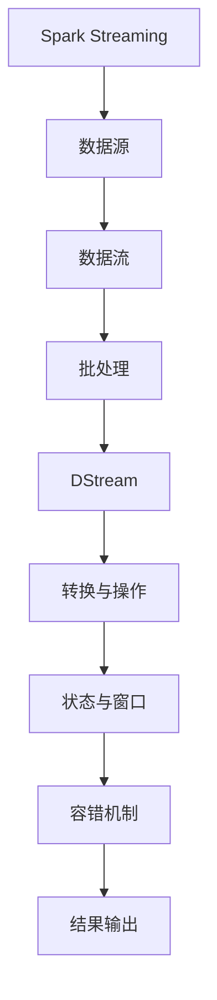

                 

# Spark Streaming实时流处理原理与代码实例讲解

> 关键词：Spark Streaming, 实时流处理, 核心概念, 算法原理, 代码实例

## 1. 背景介绍

### 1.1 问题由来

在现代数据处理领域，实时流处理（Stream Processing）已成为了一项热门技术。随着物联网、社交媒体、金融交易等领域中数据的爆炸性增长，实时流处理应用的范围愈发广泛。传统的数据处理技术如批处理无法满足实时性要求，因此实时流处理技术应运而生。

Spark Streaming是一种基于Apache Spark的大数据流处理框架，能够高效地处理实时数据流，并且提供丰富的API用于构建复杂的数据处理流水线。Spark Streaming的核心原理是将数据流分割为离散的时间段（batch）进行处理，从而实现了低延迟、高吞吐量的实时数据处理。

本文将从Spark Streaming的核心概念入手，详细讲解其原理与实现，并通过代码实例进行具体分析。

## 2. 核心概念与联系

### 2.1 核心概念概述

Spark Streaming主要包括以下几个核心概念：

- **批处理与流处理**：Spark Streaming基于批处理的思想，将数据流分割为固定长度的时间片段（batch）进行处理。这种方法可以保证低延迟和高吞吐量。

- **微批处理**：Spark Streaming采用微批处理（Micro-batching）方式，将每个时间片段（batch）拆分为多个小批（mini-batch），确保数据的实时处理。

- **DStream**：Spark Streaming的核心概念是DStream（Discretized Stream），一种能够处理连续数据流的RDD（Resilient Distributed Dataset）。DStream由一系列的时间片段组成，每个时间片段包含一段数据。

- **转换与操作**：Spark Streaming支持多种数据转换与操作，如map、reduce、filter、join等。这些操作可以组合成复杂的数据处理流水线。

- **状态与窗口**：Spark Streaming通过状态（State）和窗口（Window）管理状态信息，以支持诸如聚合、滑动窗口等高级应用。

- **容错机制**：Spark Streaming采用了类似于Spark的弹性计算框架，能够自动进行故障恢复和数据重放，确保系统高可用性和数据一致性。

以上概念构成了Spark Streaming的核心框架，使得其能够高效处理实时流数据。

### 2.2 核心概念原理与架构

以下是一个简单的Spark Streaming架构图，展示了Spark Streaming的基本组成：



这个架构图展示了Spark Streaming的基本流程：数据源生成数据流，数据流经过批处理后形成DStream，DStream通过转换与操作生成中间结果，中间结果通过状态与窗口进行聚合和分析，最终得到处理结果并输出。

接下来，我们详细探讨Spark Streaming的核心原理。

## 3. 核心算法原理 & 具体操作步骤

### 3.1 算法原理概述

Spark Streaming的算法原理基于批处理，但其与传统的批处理算法有所不同。Spark Streaming的核心在于将数据流分割为固定长度的时间片段（batch）进行处理。

在Spark Streaming中，数据流首先被分割成一个个时间片段（batch），每个batch包含固定数量的记录。然后，Spark Streaming通过批处理算法对每个batch进行处理，生成中间结果。中间结果经过转换与操作后，进行状态与窗口管理，最终得到处理结果。

这种处理方式结合了批处理的高吞吐量和流处理的低延迟，能够满足大部分实时数据处理的需要。

### 3.2 算法步骤详解

Spark Streaming的算法步骤主要包括数据分割、批处理、转换与操作、状态与窗口、容错机制等。

#### 3.2.1 数据分割

Spark Streaming将数据流分割为固定长度的时间片段（batch），每个batch包含固定数量的记录。分割的粒度可以根据实际需求进行调整，一般为1到10秒。

```scala
val input = StreamingContext(spark, batchDuration, numWorkers)
```

#### 3.2.2 批处理

Spark Streaming使用批处理算法对每个batch进行处理。批处理算法包括map、reduce、filter等。

```scala
val result = input.map(...)
```

#### 3.2.3 转换与操作

Spark Streaming支持多种数据转换与操作，如map、reduce、filter、join等。这些操作可以组合成复杂的数据处理流水线。

```scala
val result = input.filter(...).join(...).reduce(...)
```

#### 3.2.4 状态与窗口

Spark Streaming通过状态（State）和窗口（Window）管理状态信息，以支持聚合、滑动窗口等高级应用。

```scala
val result = input.groupByKey(...).reduce(...)
val result = input.mapWindow(...)
```

#### 3.2.5 容错机制

Spark Streaming采用了类似于Spark的弹性计算框架，能够自动进行故障恢复和数据重放，确保系统高可用性和数据一致性。

```scala
input.foreachRDD(...)
```

### 3.3 算法优缺点

#### 优点

- **低延迟**：Spark Streaming通过批处理算法，能够实现低延迟的数据处理。
- **高吞吐量**：Spark Streaming使用批处理算法，能够处理大量数据，实现高吞吐量。
- **灵活性**：Spark Streaming支持多种数据转换与操作，能够灵活构建复杂的数据处理流水线。

#### 缺点

- **复杂性**：Spark Streaming的架构复杂，需要一定的开发经验。
- **资源消耗大**：Spark Streaming需要较多的计算资源，对于小数据流可能造成资源浪费。
- **容错性问题**：Spark Streaming的容错机制需要依赖于Spark的弹性计算框架，可能会影响实时性。

### 3.4 算法应用领域

Spark Streaming在实时数据处理领域得到了广泛应用，主要包括以下几个领域：

- **物联网**：Spark Streaming可以处理传感器数据、设备状态等实时数据，实现设备监控、故障预测等应用。
- **社交媒体**：Spark Streaming可以处理Twitter、Facebook等社交媒体平台上的实时数据，实现舆情分析、用户行为分析等应用。
- **金融交易**：Spark Streaming可以处理股票交易数据，实现实时交易监控、风险控制等应用。
- **实时广告**：Spark Streaming可以处理用户行为数据，实现实时广告投放、广告效果评估等应用。

## 4. 数学模型和公式 & 详细讲解  
### 4.1 数学模型构建

Spark Streaming的数学模型可以简化为以下形式：

$$
\text{DStream} = \text{Batch}(\text{DataSource})
$$

其中，$\text{DStream}$表示DStream，$\text{Batch}$表示批处理算法，$\text{DataSource}$表示数据源。

### 4.2 公式推导过程

Spark Streaming的批处理算法可以表示为：

$$
\text{Result} = \text{map}(\text{input})
$$

其中，$\text{Result}$表示中间结果，$\text{map}$表示map操作。

### 4.3 案例分析与讲解

假设我们有一个实时流数据源，数据源每秒生成1000条记录。我们使用Spark Streaming对数据进行处理，将数据分割成1秒的batch，并对每个batch进行map操作。

```scala
val input = StreamingContext(spark, 1000)
val result = input.map(...)
```

## 5. 项目实践：代码实例和详细解释说明

### 5.1 开发环境搭建

在搭建Spark Streaming开发环境时，需要安装Apache Spark和Python环境。以下是一个简单的环境搭建步骤：

1. 下载并安装Apache Spark：
   ```
   wget http://spark.apache.org/downloads/latest/apache-spark-3.0.2-bin-hadoop2.7.tgz
   tar -xvf apache-spark-3.0.2-bin-hadoop2.7.tgz
   ```

2. 安装Python环境：
   ```
   sudo apt-get update
   sudo apt-get install python3
   ```

3. 配置Spark环境变量：
   ```
   export SPARK_HOME=/path/to/spark
   export PATH=$SPARK_HOME/bin:$PATH
   ```

4. 安装Spark Streaming依赖：
   ```
   pip install pyspark
   ```

完成上述步骤后，即可在Python环境中使用Spark Streaming进行实时流处理开发。

### 5.2 源代码详细实现

以下是一个简单的Spark Streaming代码实现，用于处理实时流数据：

```python
from pyspark import SparkContext, StreamingContext
from pyspark.streaming import StreamingContext

sc = SparkContext(appName="StreamingDemo")
ssc = StreamingContext(sc, batchDuration=1)

lines = sc.textFile("flume-sink.txt")
words = lines.flatMap(lambda line: line.split(" "))
streamingContext = StreamingContext(sc, batchDuration=1)

pairs = streamingContext.parallelize(words) \
    .map(lambda word: (word, 1)) \
    .reduceByKey(lambda x, y: x + y)

print("Streaming output...")
pairs.pprint()

streamingContext.start()
streamingContext.awaitTermination()
```

在这个例子中，我们首先创建一个Spark Streaming上下文，然后读取一个实时流数据源（flume-sink.txt），对数据进行split操作，生成单个单词。接着，我们使用reduceByKey操作对这些单词进行聚合，最后输出结果。

### 5.3 代码解读与分析

在代码中，我们使用了`textFile`方法读取实时流数据源，使用`flatMap`方法对数据进行split操作，生成单个单词。然后，我们使用`reduceByKey`方法对这些单词进行聚合，最终输出结果。

## 6. 实际应用场景

### 6.1 实时广告

Spark Streaming可以处理实时广告数据，实现实时广告投放和效果评估。具体而言，我们可以使用Spark Streaming处理用户点击数据、广告展示数据等，进行实时数据分析和预测，优化广告投放策略。

### 6.2 金融交易

Spark Streaming可以处理金融交易数据，实现实时交易监控和风险控制。具体而言，我们可以使用Spark Streaming处理交易数据、订单数据等，进行实时数据分析和预测，监控交易异常和风险事件。

### 6.3 物联网

Spark Streaming可以处理物联网设备数据，实现设备监控和故障预测。具体而言，我们可以使用Spark Streaming处理传感器数据、设备状态等实时数据，进行实时数据分析和预测，监控设备运行状态和预测故障事件。

### 6.4 未来应用展望

随着物联网、社交媒体、金融交易等领域的不断发展，实时流处理的需求日益增加。Spark Streaming作为一项高效、灵活的流处理技术，未来必将得到更广泛的应用。同时，Spark Streaming也面临着更高的实时性和更低延迟的挑战，需要持续进行技术创新和优化。

## 7. 工具和资源推荐

### 7.1 学习资源推荐

以下是一些学习Spark Streaming的资源：

- Apache Spark官方文档：Spark Streaming的官方文档提供了详细的API文档和示例代码，是学习Spark Streaming的最佳资源。
- PySpark官方文档：PySpark是Spark的Python API，提供了丰富的Spark Streaming API。
- Spark Streaming教程：一些网站提供了Spark Streaming的详细教程和示例代码，如Big Data University、Apache Spark官方网站等。

### 7.2 开发工具推荐

Spark Streaming支持多种编程语言，包括Java、Scala、Python等。以下是一些常用的开发工具：

- IntelliJ IDEA：IntelliJ IDEA是一款流行的Java开发工具，支持Spark Streaming开发。
- Eclipse：Eclipse是一款流行的Java开发工具，支持Spark Streaming开发。
- PyCharm：PyCharm是一款流行的Python开发工具，支持Spark Streaming开发。

### 7.3 相关论文推荐

以下是一些Spark Streaming的相关论文：

- "Resilient Distributed Datasets: A Fault-Tolerant Framework for Big Data Processing"：Spark的核心论文，介绍了Spark的基本原理和实现。
- "Stream Processing with Apache Spark"：Spark Streaming的官方论文，介绍了Spark Streaming的基本原理和实现。
- "Stream Processing with Apache Spark: Algorithms, Fault Tolerance, and Scalability"：Spark Streaming的深入论文，介绍了Spark Streaming的算法、故障恢复和可扩展性。

## 8. 总结：未来发展趋势与挑战

### 8.1 研究成果总结

Spark Streaming作为一项高效的流处理技术，已经在实时数据处理领域得到了广泛应用。Spark Streaming的核心原理是批处理和流处理相结合，能够实现低延迟和高吞吐量的数据处理。Spark Streaming的架构复杂，需要一定的开发经验。Spark Streaming的优点包括低延迟、高吞吐量、灵活性等，缺点包括复杂性、资源消耗大、容错性问题等。

### 8.2 未来发展趋势

Spark Streaming的未来发展趋势包括：

- **低延迟**：未来的Spark Streaming将更加注重低延迟，进一步提高实时处理能力。
- **高吞吐量**：未来的Spark Streaming将更加注重高吞吐量，进一步提高数据处理能力。
- **灵活性**：未来的Spark Streaming将更加注重灵活性，支持更多的数据转换与操作。
- **自动化**：未来的Spark Streaming将更加注重自动化，支持自动调优和故障恢复。

### 8.3 面临的挑战

Spark Streaming的未来发展面临以下挑战：

- **低延迟**：低延迟是Spark Streaming需要解决的核心问题之一。未来的Spark Streaming需要进一步优化批处理算法和数据分割策略，以实现更低延迟的数据处理。
- **高吞吐量**：高吞吐量是Spark Streaming需要解决的核心问题之一。未来的Spark Streaming需要进一步优化批处理算法和资源调度策略，以实现更高吞吐量的数据处理。
- **可扩展性**：可扩展性是Spark Streaming需要解决的核心问题之一。未来的Spark Streaming需要进一步优化分布式计算框架和资源调度策略，以实现更高的可扩展性。
- **容错性**：容错性是Spark Streaming需要解决的核心问题之一。未来的Spark Streaming需要进一步优化容错机制和数据恢复策略，以实现更高的容错性。

### 8.4 研究展望

未来的Spark Streaming需要进一步研究和探索，主要方向包括：

- **低延迟优化**：进一步优化批处理算法和数据分割策略，实现更低延迟的数据处理。
- **高吞吐量优化**：进一步优化批处理算法和资源调度策略，实现更高吞吐量的数据处理。
- **灵活性提升**：支持更多的数据转换与操作，提升Spark Streaming的灵活性。
- **自动化增强**：支持自动调优和故障恢复，提升Spark Streaming的自动化程度。

总之，Spark Streaming作为一项高效的流处理技术，未来将在实时数据处理领域发挥更大的作用。同时，Spark Streaming也面临着更高的实时性和更低延迟的挑战，需要持续进行技术创新和优化。

## 9. 附录：常见问题与解答

**Q1：Spark Streaming与Apache Flink等流处理框架相比，有哪些优缺点？**

A: Spark Streaming与Apache Flink等流处理框架相比，有以下优缺点：

- **优点**：Spark Streaming使用Spark的弹性计算框架，能够实现低延迟和高吞吐量的数据处理。Spark Streaming支持多种数据转换与操作，能够灵活构建复杂的数据处理流水线。
- **缺点**：Spark Streaming的架构复杂，需要一定的开发经验。Spark Streaming的容错机制需要依赖于Spark的弹性计算框架，可能会影响实时性。

**Q2：如何使用Spark Streaming进行状态管理？**

A: 使用Spark Streaming进行状态管理，可以使用状态操作（State Operations）和窗口操作（Window Operations）。例如，可以使用reduceByKey操作对数据进行聚合，使用foreachRDD操作对数据进行状态管理。

```python
from pyspark.streaming import StreamingContext

ssc = StreamingContext(spark, batchDuration=1000)

lines = sc.textFile("flume-sink.txt")
words = lines.flatMap(lambda line: line.split(" "))
streamingContext = StreamingContext(sc, batchDuration=1000)

state = StreamingContext(sc, batchDuration=1000)

state.map(lambda (word, count): (word, count))
```

**Q3：如何优化Spark Streaming的性能？**

A: 优化Spark Streaming的性能可以从以下几个方面入手：

- **批处理策略**：调整批处理策略，优化批处理算法和数据分割策略，以实现更低延迟和高吞吐量的数据处理。
- **资源调度**：优化资源调度策略，合理分配计算资源，以实现更高的可扩展性和性能。
- **数据压缩**：压缩数据，减少数据传输和存储开销，以实现更高的效率。
- **状态管理**：优化状态管理策略，减少状态存储和更新开销，以实现更低的延迟和高吞吐量的数据处理。

通过以上优化措施，可以显著提升Spark Streaming的性能和实时处理能力。

---

作者：禅与计算机程序设计艺术 / Zen and the Art of Computer Programming

