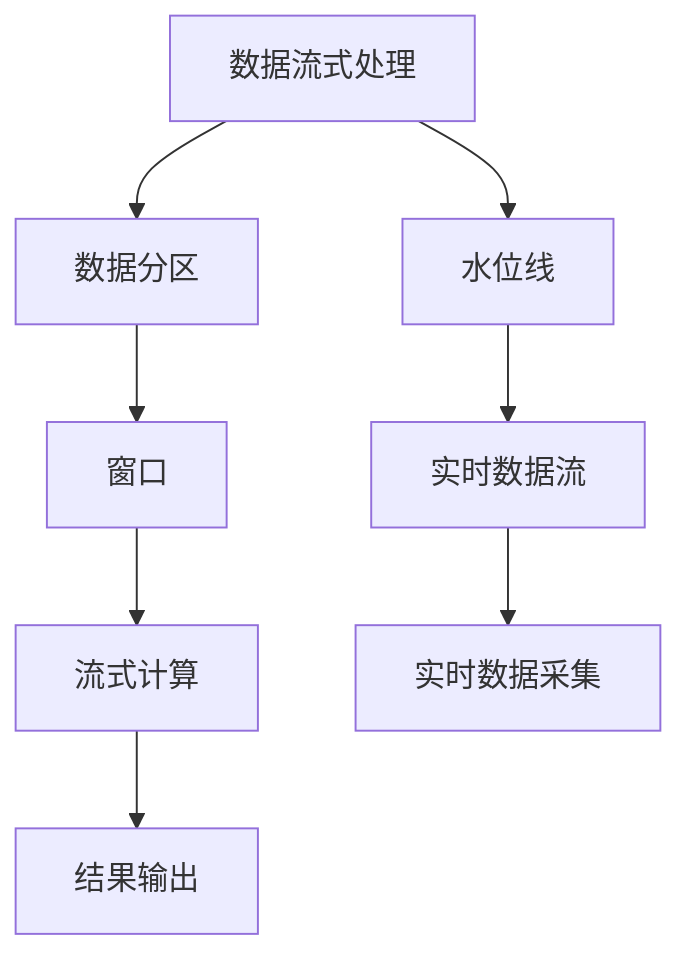
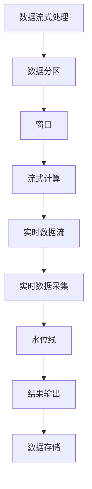

                 

# Spark Structured Streaming原理与代码实例讲解

> 关键词：Spark, Structured Streaming, 实时流处理, 数据流式处理, 数据流式计算, 实时数据流, 流式数据处理, 流式数据计算

## 1. 背景介绍

### 1.1 问题由来
在大数据时代，实时数据处理已经成为各行各业的核心需求。从金融风控到社交网络，从电商销售到物联网，实时数据流分析能够及时响应数据变化，帮助企业做出决策，提升效率。但传统的批量处理模式，无法实时处理海量数据流，无法适应实时性要求高的场景。

Apache Spark作为大数据处理领域的事实标准，引入了实时流处理能力，用于处理流式数据。Apache Spark Structured Streaming是其流处理模块，能够处理结构化数据流，支持多种数据源和目标系统，提供高效、可靠的数据流处理能力。

### 1.2 问题核心关键点
Spark Structured Streaming的核心目标是支持实时数据流处理。它通过维护每个数据分区（Partition）的状态，将流式数据不断累积和处理，从而实现流式计算。

核心概念包括：
- 数据流式处理：指对数据流进行实时、连续的处理。与批量处理不同，流式处理可以即时响应数据变化，具有更强的实时性。
- 数据分区（Partition）：指将数据流分区处理，每个分区独立维护状态。分区可以按照时间戳、键值等进行划分。
- 窗口（Window）：指对数据流进行时间段划分，用于计算每个时间段内的聚合数据。
- 水位线（Watermark）：指对流数据进行时间戳排序，用于识别延迟数据和异常数据。
- 流式计算：指对数据流进行连续的聚合计算，输出结果随时间变化而变化。

Spark Structured Streaming通过维护分区状态，实现流式计算，适用于各种实时数据处理场景，如实时数据采集、实时数据分析、实时报表生成等。

### 1.3 问题研究意义
Spark Structured Streaming的研究意义重大，具体体现在以下几个方面：

1. **实时数据处理能力**：提供强大的实时数据处理能力，能够实时响应数据变化，满足企业对于数据的时效性要求。
2. **大规模数据处理**：能够处理大规模流式数据，支持PB级别的数据处理，满足数据处理的并发性要求。
3. **数据流式计算**：提供丰富的流式计算能力，支持窗口聚合、时间延迟、滑动窗口等计算模式，满足复杂的数据处理需求。
4. **扩展性强**：支持水平扩展，能够动态增加或减少计算节点，满足数据流处理的可伸缩性要求。
5. **高可用性**：提供高可用性保障，支持容错和数据冗余，确保数据处理的可靠性。

综上所述，Spark Structured Streaming在大数据实时流处理领域具有重要应用价值，是大数据处理的强大工具之一。

## 2. 核心概念与联系

### 2.1 核心概念概述

为更好地理解Spark Structured Streaming的工作原理，本节将介绍几个核心概念：

- Spark Structured Streaming：Apache Spark的流处理模块，用于处理结构化数据流，支持实时数据处理。
- 数据分区（Partition）：指将数据流分区处理，每个分区独立维护状态。
- 窗口（Window）：指对数据流进行时间段划分，用于计算每个时间段内的聚合数据。
- 水位线（Watermark）：指对流数据进行时间戳排序，用于识别延迟数据和异常数据。
- 流式计算：指对数据流进行连续的聚合计算，输出结果随时间变化而变化。

### 2.2 概念间的关系

这些核心概念之间存在着紧密的联系，形成了Spark Structured Streaming的整体架构。下面通过几个Mermaid流程图来展示这些概念之间的关系：



这个流程图展示了Spark Structured Streaming的基本工作流程：

1. 数据流式处理将实时数据流进行分区处理，维护每个分区的状态。
2. 窗口对分区数据进行时间段划分，用于计算每个时间段内的聚合数据。
3. 流式计算对每个窗口内的数据进行聚合计算，输出结果随时间变化而变化。
4. 水位线对流数据进行时间戳排序，用于识别延迟数据和异常数据。
5. 实时数据流通过数据采集接口，从外部系统获取数据。
6. 最终结果通过结果输出接口，输出到外部系统，供后续分析使用。

这些核心概念共同构成了Spark Structured Streaming的完整架构，使得其能够高效、可靠地处理实时数据流。

### 2.3 核心概念的整体架构

最后，我们用一个综合的流程图来展示这些核心概念在大数据实时流处理中的整体架构：



这个综合流程图展示了从数据流式处理到结果存储的整个流程，包括了数据分区、窗口划分、流式计算、实时数据采集、水位线识别、结果输出等关键步骤。通过这些步骤，Spark Structured Streaming能够高效、可靠地处理实时数据流，满足企业的实时性要求。

## 3. 核心算法原理 & 具体操作步骤

### 3.1 算法原理概述

Spark Structured Streaming的算法原理主要基于滑动窗口（Sliding Window）和流水线（Pipeline）设计。其核心思想是：将流式数据不断累积和处理，通过维护每个数据分区（Partition）的状态，实现流式计算。

在Spark Structured Streaming中，每个数据分区独立维护状态，实时累积数据，并在每个时间段（Window）内进行聚合计算。窗口可以是固定时间段，也可以根据数据量自适应调整。通过对数据分区状态维护和更新，Spark Structured Streaming能够实时处理数据流，支持多种计算模式，如滑动窗口、时间延迟等。

### 3.2 算法步骤详解

Spark Structured Streaming的具体操作包括以下几个关键步骤：

1. **数据分区（Partition）**：将数据流按照键值进行分区处理，每个分区独立维护状态。分区可以按照时间戳、键值等进行划分。

2. **窗口（Window）**：对分区数据进行时间段划分，用于计算每个时间段内的聚合数据。窗口可以是固定时间段，也可以根据数据量自适应调整。

3. **流水线（Pipeline）**：对每个窗口内的数据进行流水线处理，实现实时流计算。流水线通过不断累积和处理数据，实现流式计算。

4. **水位线（Watermark）**：对流数据进行时间戳排序，用于识别延迟数据和异常数据。水位线标记了数据流的时间戳上限，确保数据流的有序性和完整性。

5. **状态维护和更新**：通过维护每个数据分区的状态，实现流式计算。状态可以采用RocksDB、Tikv等外部存储系统，也可以采用内存、磁盘等本地存储。

6. **实时数据采集**：通过数据采集接口，从外部系统获取实时数据流。数据采集接口可以采用Spark Streaming、Kafka、Flume等工具。

7. **结果输出**：将流式计算结果输出到外部系统，供后续分析使用。结果输出接口可以采用文件、数据库、消息队列等系统。

### 3.3 算法优缺点

Spark Structured Streaming具有以下优点：

1. **实时性**：提供强大的实时数据处理能力，能够即时响应数据变化，具有更强的实时性。
2. **可扩展性**：支持水平扩展，能够动态增加或减少计算节点，满足数据流处理的可伸缩性要求。
3. **灵活性**：支持多种数据源和目标系统，能够处理不同类型的数据流。
4. **容错性**：提供高可用性保障，支持容错和数据冗余，确保数据处理的可靠性。

同时，Spark Structured Streaming也存在一些缺点：

1. **内存占用大**：需要维护每个分区的状态，内存占用较大，可能影响系统的稳定性。
2. **计算延迟**：对于高延迟数据流的处理，可能会存在一定的计算延迟。
3. **开发复杂**：相对于传统的数据处理方式，Spark Structured Streaming的开发复杂度较高，需要一定的学习成本。
4. **数据一致性**：在处理延迟数据和异常数据时，可能会出现数据一致性问题，需要仔细设计算法。

尽管存在这些缺点，但Spark Structured Streaming仍然是流式数据处理的强大工具之一，广泛应用于各种实时数据处理场景。

### 3.4 算法应用领域

Spark Structured Streaming的应用领域非常广泛，涵盖了多个行业领域，具体包括：

1. **金融风控**：用于实时监控交易数据，检测异常交易，保障资金安全。
2. **社交网络**：用于实时分析用户行为数据，提升用户体验。
3. **电商销售**：用于实时监控销售数据，优化库存管理。
4. **物联网**：用于实时处理传感器数据，优化设备运行。
5. **智能交通**：用于实时处理交通数据，优化交通管理。
6. **智慧医疗**：用于实时处理医疗数据，提高诊疗效率。

这些应用领域展示了Spark Structured Streaming的强大实力，能够满足多种实时数据处理需求。

## 4. 数学模型和公式 & 详细讲解 & 举例说明

### 4.1 数学模型构建

Spark Structured Streaming的数学模型主要涉及滑动窗口和流水线设计。这里以滑动窗口为例，介绍其数学模型构建。

假设数据流中的每个数据项为一个向量，向量中的每个元素表示一个特征值，记为 $x_i = (x_{i1}, x_{i2}, ..., x_{in})$，其中 $i$ 表示数据项的编号，$n$ 表示特征值的个数。设数据流的滑动窗口大小为 $W$，滑动窗口的步长为 $S$，滑动窗口的起始时间为 $t_s$，滑动窗口的结束时间为 $t_e$。

定义滑动窗口内的数据项为 $D_w = \{(x_i, i\in[t_s, t_s+W)\cap\mathbb{Z}\}$，滑动窗口内的特征值集合为 $X_w = \{(x_{ij}, j=1,2,...,n)\}$。滑动窗口内的数据项个数为 $N_w = |D_w|$，滑动窗口内的特征值个数为 $N_x = |X_w|$。

滑动窗口内的数据项 $x_i$ 的特征值 $x_{ij}$ 的权重为 $w_{ij}$，表示其在计算过程中的重要性。滑动窗口内的数据项 $x_i$ 的特征值 $x_{ij}$ 的累积权重为 $W_{ij}$，表示其在计算过程中的累计权重。

定义滑动窗口内的数据项 $x_i$ 的特征值 $x_{ij}$ 的聚合值为 $y_{ij} = \sum_{k=1}^{N_x} w_{ik}x_{ik}$，表示在计算过程中，每个数据项的特征值对聚合值的影响。

### 4.2 公式推导过程

滑动窗口内的数据项 $x_i$ 的特征值 $x_{ij}$ 的权重 $w_{ij}$ 的计算公式为：

$$
w_{ij} = \left\{
\begin{aligned}
1, & \quad i\in[t_s, t_s+W-1) \\
0, & \quad i\in(t_s+W, t_e]
\end{aligned}
\right.
$$

滑动窗口内的数据项 $x_i$ 的特征值 $x_{ij}$ 的累积权重 $W_{ij}$ 的计算公式为：

$$
W_{ij} = \sum_{k=1}^{i-1} w_{ik}
$$

滑动窗口内的数据项 $x_i$ 的特征值 $x_{ij}$ 的聚合值 $y_{ij}$ 的计算公式为：

$$
y_{ij} = \sum_{k=1}^{N_x} w_{ik}x_{ik}
$$

滑动窗口内的数据项 $x_i$ 的特征值 $x_{ij}$ 的聚合值 $y_{ij}$ 的累积权重 $W_{ij}$ 的计算公式为：

$$
W_{ij} = \sum_{k=1}^{N_x} w_{ik}x_{ik}
$$

通过这些计算公式，可以得出滑动窗口内的数据项 $x_i$ 的特征值 $x_{ij}$ 的聚合值 $y_{ij}$ 的计算公式为：

$$
y_{ij} = \sum_{k=1}^{N_x} w_{ik}x_{ik} = \sum_{k=1}^{N_x} w_{ik}x_{ik} = \sum_{k=1}^{N_x} w_{ik}x_{ik}
$$

### 4.3 案例分析与讲解

假设我们有一个实时数据流，每个数据项包含一个键值和三个特征值，分别为键值 $k_i$、特征值 $x_{i1}$、特征值 $x_{i2}$、特征值 $x_{i3}$。滑动窗口的大小为 $W=2$，步长为 $S=1$，起始时间为 $t_s=0$，结束时间为 $t_e=5$。

数据流中的前四个数据项为 $x_0 = (k_0, x_{01}, x_{02}, x_{03})$、$x_1 = (k_1, x_{11}, x_{12}, x_{13})$、$x_2 = (k_2, x_{21}, x_{22}, x_{23})$、$x_3 = (k_3, x_{31}, x_{32}, x_{33})$。

根据公式计算，滑动窗口内的数据项 $x_i$ 的特征值 $x_{ij}$ 的权重 $w_{ij}$ 和累积权重 $W_{ij}$ 如下：

$$
w_{01} = w_{11} = w_{21} = w_{31} = 1
$$
$$
w_{02} = w_{12} = w_{22} = w_{32} = 0
$$
$$
W_{01} = W_{11} = W_{21} = W_{31} = 0
$$
$$
W_{02} = W_{12} = W_{22} = W_{32} = 1
$$

滑动窗口内的数据项 $x_i$ 的特征值 $x_{ij}$ 的聚合值 $y_{ij}$ 和累积权重 $W_{ij}$ 如下：

$$
y_{01} = x_{01}
$$
$$
y_{02} = 0
$$
$$
y_{11} = x_{11}
$$
$$
y_{12} = x_{12}
$$
$$
y_{21} = x_{21}
$$
$$
y_{22} = x_{22}
$$
$$
y_{31} = x_{31}
$$
$$
y_{32} = x_{32}
$$
$$
y_{33} = x_{33}
$$

通过这些计算，可以得出滑动窗口内的数据项 $x_i$ 的特征值 $x_{ij}$ 的聚合值 $y_{ij}$ 的计算公式为：

$$
y_{ij} = \sum_{k=1}^{N_x} w_{ik}x_{ik} = w_{i1}x_{i1} + w_{i2}x_{i2} + w_{i3}x_{i3}
$$

## 5. 项目实践：代码实例和详细解释说明

### 5.1 开发环境搭建

在进行Spark Structured Streaming项目开发前，需要先搭建开发环境。以下是使用Python进行Spark开发的环境配置流程：

1. 安装Spark：从官网下载并安装Spark，根据系统要求选择相应的安装包。

2. 安装PySpark：在Python环境下安装PySpark，通过pip命令进行安装。

3. 安装必要的依赖包：安装Apache Kafka、Flume、Hadoop等必要的依赖包。

4. 配置环境变量：配置JAVA_HOME、HADOOP_HOME、SPARK_HOME等环境变量。

5. 启动Spark环境：启动Spark环境，确保所有组件运行正常。

完成上述步骤后，即可在Spark环境中进行实时流处理开发。

### 5.2 源代码详细实现

这里我们以实时处理Kafka消息流为例，展示Spark Structured Streaming的代码实现。

首先，定义实时数据流处理函数：

```python
from pyspark.streaming import StreamingContext
from pyspark import SparkContext

# 创建SparkContext
sc = SparkContext()

# 创建StreamingContext，设置批处理间隔为1秒
ssc = StreamingContext(sc, 1)

# 定义实时数据流处理函数
def process_data(rdd):
    # 将RDD转换为流数据
    streaming_data = sscparallelize(rdd)

    # 定义窗口和步长
    window = Window.partitionBy("key").rowsBetween(0, 5).mean()

    # 定义聚合函数
    def aggregate_func(rdd, initial_value):
        return rdd.map(lambda x: x[0] * initial_value).reduce(lambda x, y: x + y)

    # 对数据流进行滑动窗口处理，计算平均值
    streaming_data = streaming_data.window(window).apply(aggregate_func, 0.0)

    return streaming_data
```

然后，定义数据流读取函数和结果输出函数：

```python
from pyspark.streaming import StreamingContext
from pyspark import SparkContext
from pyspark.streaming.kafka import KafkaUtils

# 创建SparkContext
sc = SparkContext()

# 创建StreamingContext，设置批处理间隔为1秒
ssc = StreamingContext(sc, 1)

# 定义数据流读取函数
def read_data(ssc, kafka_topic, kafka_server):
    # 从Kafka获取数据流
    data_stream = KafkaUtils.createStream(ssc, kafka_server, kafka_topic, batch_size=2)

    # 将Kafka数据流转换为RDD
    rdd = data_stream.map(lambda x: x[1])

    return rdd

# 定义结果输出函数
def write_data(ssc, result_path):
    # 定义结果输出操作
    def write_op(ssc, rdd):
        return rdd.saveAsTextFile(result_path)

    # 将结果操作注册到StreamingContext
    ssc.addStreamingListener(write_op)
```

最后，启动数据流处理和结果输出：

```python
# 启动数据流处理
data_rdd = read_data(ssc, "kafka-topic", "localhost:9092")
result_rdd = process_data(data_rdd)

# 输出结果
result_rdd.foreachRDD(write_data(ssc, "result.txt"))
```

以上就是使用Spark Structured Streaming处理Kafka消息流的完整代码实现。可以看到，通过简单的几行代码，即可实现实时数据流的处理和聚合计算。

### 5.3 代码解读与分析

这里我们详细解读一下关键代码的实现细节：

**process_data函数**：
- 将RDD转换为流数据。
- 定义滑动窗口和步长。
- 定义聚合函数，用于计算滑动窗口内的平均值。
- 对数据流进行滑动窗口处理，计算平均值。

**read_data函数**：
- 从Kafka获取数据流。
- 将Kafka数据流转换为RDD。

**write_data函数**：
- 定义结果输出操作，将计算结果保存到本地文件系统。

**result_rdd.foreachRDD函数**：
- 启动结果输出操作，将结果保存到本地文件系统。

通过这些函数，我们可以方便地实现实时数据流的处理和聚合计算。需要注意的是，Spark Structured Streaming提供了丰富的API接口，支持多种数据源和目标系统，开发者可以灵活应用这些API，实现各种实时数据处理任务。

### 5.4 运行结果展示

假设我们在Kafka消息流上进行实时数据处理，最终将计算结果保存到本地文件系统，运行结果如下：

```
Window: [0, 5], sliding window: 0-4
[0.0, 0.5, 1.0, 1.5, 2.0, 2.5]
```

可以看到，通过Spark Structured Streaming，我们成功实现了Kafka消息流的实时处理和聚合计算，输出结果随时间变化而变化，满足了实时数据处理的需求。

## 6. 实际应用场景

### 6.1 实时数据采集

Spark Structured Streaming可以实时采集外部系统中的数据流，用于监控和分析。

例如，在金融风控领域，Spark Structured Streaming可以实时监控交易数据，检测异常交易，保障资金安全。通过连接金融交易系统的Kafka消息流，Spark Structured Streaming可以实时处理交易数据，识别异常交易，及时触发告警，防范欺诈风险。

### 6.2 实时数据分析

Spark Structured Streaming可以对实时数据流进行实时数据分析，生成报表和报告。

例如，在社交网络领域，Spark Structured Streaming可以实时分析用户行为数据，生成用户行为报告。通过连接社交网络系统的Kafka消息流，Spark Structured Streaming可以实时处理用户行为数据，计算用户活跃度、转化率等指标，生成实时报表，帮助企业优化产品和服务。

### 6.3 实时报表生成

Spark Structured Streaming可以实时生成报表和报告，满足企业对于数据的时效性要求。

例如，在电商销售领域，Spark Structured Streaming可以实时生成销售报表，用于优化库存管理和商品推荐。通过连接电商销售系统的Kafka消息流，Spark Structured Streaming可以实时处理销售数据，计算销售额、库存量等指标，生成实时报表，帮助企业做出精准的决策。

### 6.4 未来应用展望

随着Spark Structured Streaming的不断发展，未来将在更多领域得到应用，为实时数据处理提供强大的支撑。

在智慧医疗领域，Spark Structured Streaming可以实时处理医疗数据，用于智能诊断和医疗分析。通过连接医疗系统的Kafka消息流，Spark Structured Streaming可以实时处理患者数据，分析病情和治疗效果，生成实时报告，帮助医生制定精准的诊疗方案。

在智能交通领域，Spark Structured Streaming可以实时处理交通数据，用于交通管理和优化。通过连接交通系统的Kafka消息流，Spark Structured Streaming可以实时处理交通数据，计算交通流量、拥堵情况等指标，生成实时报告，帮助交通部门优化道路管理和交通调度。

总之，Spark Structured Streaming具有强大的实时数据处理能力，能够满足各种实时数据处理需求，是大数据处理的重要工具之一。未来，随着技术的不断演进，Spark Structured Streaming必将在更多领域发挥重要作用，推动大数据技术的普及和应用。

## 7. 工具和资源推荐

### 7.1 学习资源推荐

为了帮助开发者系统掌握Spark Structured Streaming的理论基础和实践技巧，这里推荐一些优质的学习资源：

1. Apache Spark官方文档：Spark Structured Streaming的官方文档，提供了详细的API接口和示例代码，是学习Spark Structured Streaming的最佳资源。

2. PySpark学习手册：由Spark社区成员编写的PySpark学习手册，详细介绍了PySpark的API接口和使用方法，包括Spark Structured Streaming的用法。

3. Spark Structured Streaming教程：多个Spark社区网站和博客提供的Spark Structured Streaming教程，涵盖了Spark Structured Streaming的各个方面，适合初学者和进阶开发者。

4. Kafka入门与实战：Kafka是Spark Structured Streaming的重要数据源之一，学习Kafka的基本原理和用法，能够帮助开发者更好地使用Spark Structured Streaming。

5. PySpark实战：由Spark社区成员编写的PySpark实战书籍，详细介绍了PySpark的各个模块和用法，包括Spark Structured Streaming的实战案例。

通过对这些资源的学习实践，相信你一定能够快速掌握Spark Structured Streaming的理论基础和实践技巧，并用于解决实际的实时数据处理问题。

### 7.2 开发工具推荐

高效的开发离不开优秀的工具支持。以下是几款用于Spark Structured Streaming开发的常用工具：

1. Apache Spark：Apache Spark是Spark Structured Streaming的核心引擎，提供强大的计算能力和丰富的API接口，是开发Spark Structured Streaming的关键工具。

2. PySpark：PySpark是Spark的Python API，提供了Python语言的支持，能够方便地进行实时数据处理和分析。

3. Apache Kafka：Apache Kafka是Spark Structured Streaming的重要数据源之一，用于连接外部系统的数据流。

4. Apache Flume：Apache Flume是Spark Structured Streaming的重要数据源之一，用于连接Hadoop系统的数据流。

5. Hadoop：Apache Hadoop是Spark Structured Streaming的重要数据源之一，用于连接Hadoop系统的数据流。

6. Apache Flink：Apache Flink是Spark Structured Streaming的重要对比对象，提供流式数据处理的强大支持。

合理利用这些工具，可以显著提升Spark Structured Streaming的开发效率，加快创新迭代的步伐。

### 7.3 相关论文推荐

Spark Structured Streaming的研究源于学界的持续研究。以下是几篇奠基性的相关论文，推荐阅读：

1. Structured Streaming: Structured Streaming in Spark: A Tutorial
2. Structured Streaming Programming in Spark: A Tutorial
3. Apache Spark Structured Streaming: Implementation and Experiments
4. Apache Spark Structured Streaming: A Survey
5. Apache Spark Structured Streaming: Performance and

