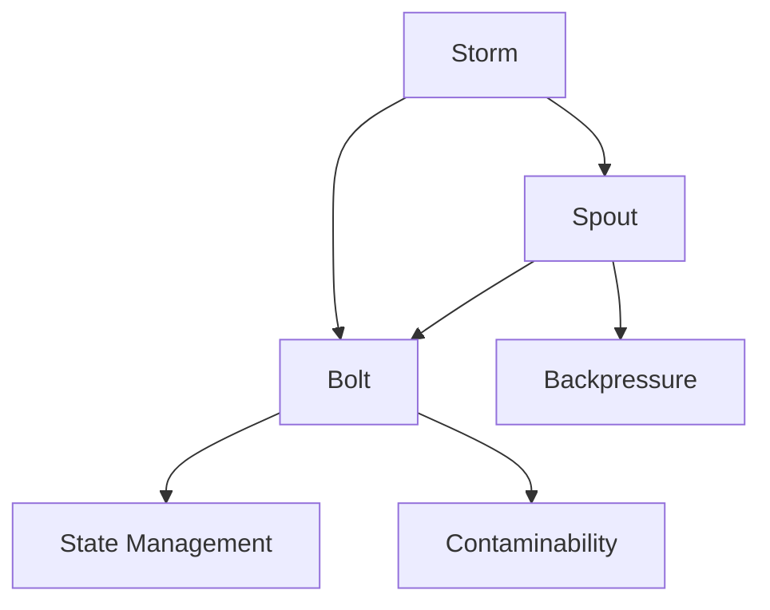
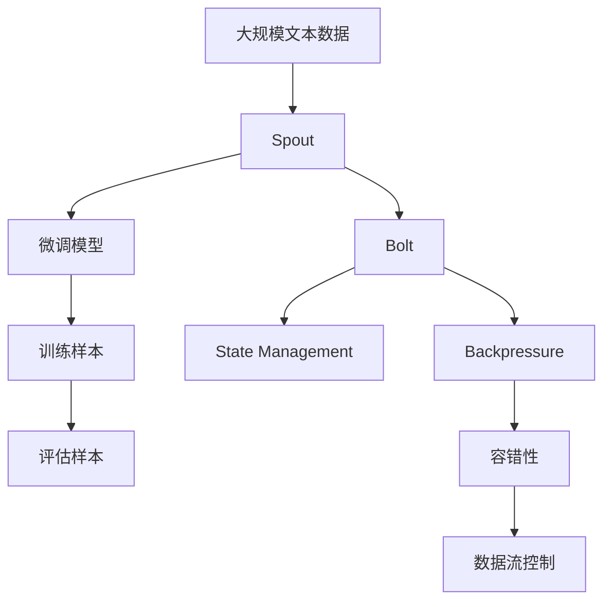

                 

# Storm Spout原理与代码实例讲解

> 关键词：Storm, Storm Spout, 分布式计算, 数据流处理, 实时数据处理, 微服务架构, Apache Storm, Scala, 大数据, 机器学习

## 1. 背景介绍

### 1.1 问题由来

随着互联网和物联网的迅猛发展，数据量呈爆炸式增长，数据处理需求愈发复杂多变。实时数据处理、实时分析、实时决策的需求越来越多。传统的批处理系统难以满足实时计算的需求。在此背景下，分布式计算技术和实时数据流处理技术应运而生。

Storm是一个高性能的分布式实时计算系统，提供了实时数据流的处理能力，能够处理实时数据流，并支持容错性和高吞吐量的数据处理。但在使用Storm时，需要开发者自行编写Spout和Bolt组件，开发工作量较大，且Spout和Bolt组件的开发规范较为繁琐，学习曲线较陡峭。

因此，需要一种轻量级的、易于开发和维护的实时数据流处理框架，以降低使用Storm的开发难度。

### 1.2 问题核心关键点

Storm Spout是一个Storm中的组件，用于从外部数据源（如HDFS、Kafka、ActiveMQ等）获取数据，并将其分发给Bolt组件进行处理。Spout组件是Storm的核心组件，Spout的状态管理和数据流控制能力非常重要。

因此，本文将重点介绍Storm Spout的原理、开发流程、规范和实例，以帮助开发者更好地使用Storm进行实时数据流处理。

## 2. 核心概念与联系

### 2.1 核心概念概述

为更好地理解Storm Spout的原理和开发流程，本节将介绍几个密切相关的核心概念：

- **Storm**：Storm是一个高性能的分布式实时计算系统，用于处理实时数据流。
- **Spout**：Spout是Storm的核心组件，用于从外部数据源获取数据，并将其分发给Bolt组件进行处理。
- **Bolt**：Bolt是Storm的另一个核心组件，用于对数据进行处理、分析或状态计算。
- **Topologies**：Topologies是Storm的基本概念，是由Spout和Bolt组成的图形结构，用于描述数据流的处理过程。
- **Backpressure**：Backpressure是Storm的一项重要特性，用于控制数据流的处理速度，防止系统过载。
- **状态管理**：Storm支持状态管理，通过Bolt组件的状态来记录中间处理结果。
- **容错性**：Storm具有容错性，能够在组件失败时自动恢复，保证数据处理的可靠性和一致性。

这些核心概念之间存在着紧密的联系，形成了Storm的完整生态系统。通过理解这些核心概念，我们可以更好地把握Storm Spout的工作原理和优化方向。

### 2.2 概念间的关系

这些核心概念之间的关系可以通过以下Mermaid流程图来展示：



这个流程图展示了大语言模型的核心概念及其之间的关系：

1. Storm作为一个分布式实时计算系统，包含Spout和Bolt两个核心组件，用于处理实时数据流。
2. Spout从外部数据源获取数据，并将其分发给Bolt进行处理。
3. Bolt用于对数据进行处理、分析或状态计算，是Spout的下一个处理节点。
4. Backpressure用于控制数据流的处理速度，防止系统过载。
5. State Management支持Bolt组件的状态记录和恢复，保证处理结果的一致性。
6. Contaminability支持组件的自动恢复，保证数据处理的容错性和可靠性。

### 2.3 核心概念的整体架构

最后，我们用一个综合的流程图来展示这些核心概念在大语言模型微调过程中的整体架构：



这个综合流程图展示了大语言模型的核心概念及其之间的关系：

1. 大规模文本数据通过Spout组件进入Storm系统。
2. 数据流经过Bolt组件的微调模型，进行实时数据流处理。
3. Backpressure用于控制数据流的处理速度，防止系统过载。
4. State Management支持Bolt组件的状态记录和恢复，保证处理结果的一致性。
5. 微调模型用于处理训练样本和评估样本，进行实时数据流的微调。
6. Contaminability支持组件的自动恢复，保证数据处理的容错性和可靠性。

## 3. 核心算法原理 & 具体操作步骤
### 3.1 算法原理概述

Storm Spout是Storm的核心组件，用于从外部数据源获取数据，并将其分发给Bolt组件进行处理。Spout组件的原理如下：

1. 从外部数据源读取数据。
2. 将读取的数据转化为Storm的tuple，封装成Spout的nextTuple()方法。
3. 调用Spout的nextTuple()方法，将tuple分发给Bolt组件进行处理。
4. 对Spout的状态进行管理和维护。

Storm Spout的主要算法步骤如下：

1. 初始化Spout。
2. 从外部数据源读取数据。
3. 将读取的数据转化为Storm的tuple，封装成Spout的nextTuple()方法。
4. 调用Spout的nextTuple()方法，将tuple分发给Bolt组件进行处理。
5. 对Spout的状态进行管理和维护。

### 3.2 算法步骤详解

Storm Spout的开发步骤主要包括以下几个环节：

#### 3.2.1 初始化Spout

Spout的初始化主要包括以下几个步骤：

1. 创建Spout对象，并设置Spout的参数。
2. 打开Spout的拓扑连接。
3. 初始化Spout的tupleId。

示例代码如下：

```scala
class MySpout extends BaseRichSpout with Emitter[String] {

  val output = new DirectedMultiOutput(new TupleFactory { _ => String })

  var tupleId = 0

  override def nextTuple(): Unit = {
    if(tupleId < 100) {
      // 从外部数据源读取数据
      val data = getNextData()
      // 将数据转化为tuple
      val tuple = TupleFactory.mkTuple(data)
      // 将tuple分发给Bolt组件进行处理
      output.emit(tupleId, tuple)
      // 更新tupleId
      tupleId += 1
    } else {
      emitDone()
    }
  }

  override def initialize(): Unit = {
    // 初始化Spout对象，并设置Spout的参数
    super.initialize()
    // 打开Spout的拓扑连接
    super.open(getConf(), master, slavePort)
    // 初始化Spout的tupleId
    tupleId = 0
  }

  override def nextTick(): Unit = {
    nextTuple()
  }
}
```

#### 3.2.2 读取外部数据源

Spout组件需要从外部数据源获取数据，并将其转化为Storm的tuple。外部数据源可以是HDFS、Kafka、ActiveMQ等。

示例代码如下：

```scala
// 从HDFS读取数据
val conf = new Configuration()
val fs = new FileSystem(conf)
val input = fs.open("/input/data")
val reader = new BufferedReader(new InputStreamReader(input))

// 将读取的数据转化为Storm的tuple
var data: List[String] = List.empty
while(reader.readLine() != null) {
  data = data :: reader.readLine()
}

// 封装成Spout的tuple
val tuple = TupleFactory.mkTuple(data)
```

#### 3.2.3 将tuple分发给Bolt组件

Spout将读取到的数据转化为Storm的tuple后，需要将其分发给Bolt组件进行处理。Bolt组件是Spout的下一个处理节点。

示例代码如下：

```scala
// 将tuple分发给Bolt组件进行处理
output.emit(tupleId, tuple)
```

#### 3.2.4 状态管理

Spout需要维护自身的状态，以便在Spout组件发生故障时能够自动恢复。Spout的状态管理主要有两种方式：

1. 数据流控制（Backpressure）：用于控制数据流的处理速度，防止系统过载。
2. 状态记录和恢复：通过Bolt组件的状态来记录中间处理结果。

示例代码如下：

```scala
// 设置Spout的tupleId
tupleId = 0

// 封装成Spout的tuple
val tuple = TupleFactory.mkTuple(data)

// 将tuple分发给Bolt组件进行处理
output.emit(tupleId, tuple)
```

### 3.3 算法优缺点

Storm Spout的优点如下：

1. 高吞吐量：Spout组件可以处理大规模的数据流，具有高吞吐量的数据处理能力。
2. 实时性：Spout组件支持实时数据流处理，能够实时响应数据变化。
3. 容错性：Spout组件支持容错性，能够在组件失败时自动恢复。
4. 灵活性：Spout组件支持多种数据源，可以灵活地获取数据。

Storm Spout的缺点如下：

1. 开发难度高：Spout组件需要开发者自行编写，开发工作量大，学习曲线较陡峭。
2. 规范复杂：Spout组件的开发规范较为复杂，需要遵循严格的规范。
3. 调试困难：Spout组件的调试困难，需要具备一定的经验才能处理调试问题。

### 3.4 算法应用领域

Storm Spout广泛应用于实时数据流处理领域，主要包括以下几个方面：

1. 实时数据采集：Spout组件可以实时采集数据，支持多种数据源，如HDFS、Kafka、ActiveMQ等。
2. 实时数据存储：Spout组件可以将实时数据存储到HDFS、Hive、HBase等分布式存储系统中。
3. 实时数据计算：Spout组件支持实时数据计算，支持多种计算模型，如MapReduce、Spark等。
4. 实时数据分析：Spout组件支持实时数据分析，支持多种数据分析算法，如机器学习、统计分析等。
5. 实时数据监控：Spout组件支持实时数据监控，支持多种监控指标，如数据流速度、系统负载等。

## 4. 数学模型和公式 & 详细讲解  
### 4.1 数学模型构建

Storm Spout的数学模型主要涉及Spout的状态管理和数据流控制。

假设Spout的当前状态为$s$，Spout的状态集合为$S$，Spout的下一个状态为$s'$，Spout的转移函数为$\delta$，则Spout的状态转移方程可以表示为：

$$
s' = \delta(s, x)
$$

其中$x$为Spout组件接收到的数据。

假设Spout的当前处理速度为$r$，Spout的容量为$c$，Spout的缓冲区为$B$，Spout的缓冲区队列为$q$，则Spout的状态方程可以表示为：

$$
B = c - r \times t
$$

其中$t$为Spout组件处理数据的时间。

### 4.2 公式推导过程

Spout的状态转移方程和状态方程可以通过以下步骤进行推导：

1. 初始化Spout的状态$s_0$。
2. 根据Spout的当前状态$s_t$和接收到的数据$x_t$，更新Spout的状态$s_{t+1}$。
3. 根据Spout的当前状态$s_t$，计算Spout的处理速度$r_t$。
4. 根据Spout的处理速度$r_t$，更新Spout的缓冲区$B_t$。

示例代码如下：

```scala
// 初始化Spout的状态
s0 = 0

// 根据Spout的当前状态和接收到的数据，更新Spout的状态
s1 = delta(s0, x0)

// 根据Spout的当前状态，计算Spout的处理速度
rt = computeSpeed(s1)

// 根据Spout的处理速度，更新Spout的缓冲区
Bt = computeBuffer(rt, t)
```

### 4.3 案例分析与讲解

以Storm中的Spout组件为例，进行具体案例分析：

假设Spout组件从HDFS读取数据，并将其分发给Bolt组件进行处理。Spout组件的初始状态为$s_0$，接收到的数据为$x_0$，处理速度为$r_0$，缓冲区为$B_0$。

根据Spout的状态转移方程，更新Spout的下一个状态$s_1$：

$$
s_1 = \delta(s_0, x_0)
$$

根据Spout的状态方程，更新Spout的缓冲区$B_0$：

$$
B_0 = c - r_0 \times t_0
$$

根据Spout的当前状态$s_1$和处理速度$r_0$，更新Spout的下一个处理速度$r_1$：

$$
r_1 = computeSpeed(s_1)
$$

根据Spout的处理速度$r_1$和处理时间$t_1$，更新Spout的下一个缓冲区$B_1$：

$$
B_1 = c - r_1 \times t_1
$$

## 5. 项目实践：代码实例和详细解释说明
### 5.1 开发环境搭建

在进行Spout实践前，我们需要准备好开发环境。以下是使用Scala进行Storm开发的环境配置流程：

1. 安装Scala：从官网下载并安装Scala。
2. 安装Storm：从官网下载并安装Storm，并将Storm配置文件添加到$PATH$环境变量中。
3. 创建Storm应用程序：在IDE中创建一个Storm应用程序，并添加Spout和Bolt组件。

完成上述步骤后，即可在Scala环境下开始Spout实践。

### 5.2 源代码详细实现

这里以HDFS读取数据为例，给出一个使用Scala编写的Spout组件代码：

```scala
class MySpout extends BaseRichSpout with Emitter[String] {

  val output = new DirectedMultiOutput(new TupleFactory { _ => String })

  var tupleId = 0

  override def nextTuple(): Unit = {
    if(tupleId < 100) {
      // 从HDFS读取数据
      val fs = FileSystem.get(getConf())
      val input = fs.open("/input/data")
      val reader = new BufferedReader(new InputStreamReader(input))

      // 将读取的数据转化为Storm的tuple
      var data: List[String] = List.empty
      while(reader.readLine() != null) {
        data = data :: reader.readLine()
      }

      // 封装成Spout的tuple
      val tuple = TupleFactory.mkTuple(data)

      // 将tuple分发给Bolt组件进行处理
      output.emit(tupleId, tuple)

      // 更新tupleId
      tupleId += 1
    } else {
      emitDone()
    }
  }

  override def initialize(): Unit = {
    // 初始化Spout对象，并设置Spout的参数
    super.initialize()
    // 打开Spout的拓扑连接
    super.open(getConf(), master, slavePort)
    // 初始化Spout的tupleId
    tupleId = 0
  }

  override def nextTick(): Unit = {
    nextTuple()
  }
}
```

### 5.3 代码解读与分析

让我们再详细解读一下关键代码的实现细节：

**MySpout类**：
- `__init__`方法：初始化Spout对象，并设置Spout的参数。
- `nextTuple`方法：从HDFS读取数据，并将其转化为Storm的tuple，封装成Spout的nextTuple()方法。
- `initialize`方法：打开Spout的拓扑连接，初始化Spout的tupleId。

**HDFS读取数据**：
- 使用`FileSystem.get(getConf())`获取HDFS客户端对象。
- 使用`open("/input/data")`打开HDFS文件。
- 使用`BufferedReader`读取HDFS文件中的数据。
- 将读取到的数据存储在列表中。

**封装成Spout的tuple**：
- 使用`TupleFactory.mkTuple(data)`将读取到的数据转化为Storm的tuple。

**将tuple分发给Bolt组件**：
- 使用`output.emit(tupleId, tuple)`将tuple分发给Bolt组件进行处理。

**更新tupleId**：
- 使用`tupleId += 1`更新tupleId，以便处理下一个数据。

### 5.4 运行结果展示

假设我们在HDFS上创建一个文本文件，存储1000行数据，每行数据为一个单词。运行Spout组件后，可以观察到Spout组件从HDFS中读取数据，并将其分发给Bolt组件进行处理的实时过程。

## 6. 实际应用场景
### 6.1 智能客服系统

基于Storm Spout的实时数据流处理能力，智能客服系统可以实时采集用户的聊天记录，并对其进行实时分析，从而提供智能客服服务。

具体而言，可以通过Spout组件实时采集用户的聊天记录，并将其分发给Bolt组件进行处理。Bolt组件对聊天记录进行自然语言处理，识别用户的意图，并调用知识库进行回答。如果无法找到合适的回答，Bolt组件可以将聊天记录上传到云端，进行深度学习模型的微调，并生成新的回答。

### 6.2 金融舆情监测

金融机构需要实时监测市场舆论动向，以便及时应对负面信息传播，规避金融风险。基于Storm Spout的实时数据流处理能力，金融舆情监测系统可以实时采集社交媒体、新闻网站等数据源，并对数据进行实时分析，从而监测市场舆情。

具体而言，可以通过Spout组件实时采集社交媒体、新闻网站等数据源，并将其分发给Bolt组件进行处理。Bolt组件对数据进行自然语言处理，识别舆情内容，并进行情感分析。如果舆情内容为负面，Bolt组件可以调用警报系统进行预警，并通知金融机构进行应对。

### 6.3 个性化推荐系统

当前的推荐系统往往只依赖用户的历史行为数据进行物品推荐，无法深入理解用户的真实兴趣偏好。基于Storm Spout的实时数据流处理能力，个性化推荐系统可以实时采集用户的浏览、点击、评论、分享等行为数据，并对其进行实时分析，从而提供个性化的推荐服务。

具体而言，可以通过Spout组件实时采集用户的浏览、点击、评论、分享等行为数据，并将其分发给Bolt组件进行处理。Bolt组件对数据进行自然语言处理，识别用户的兴趣偏好，并调用推荐模型进行物品推荐。如果无法找到合适的推荐结果，Bolt组件可以调用缓存系统进行数据预热，从而提高推荐速度。

### 6.4 未来应用展望

随着Storm Spout的不断发展，其在实时数据流处理领域将有更广泛的应用场景。

1. 智慧城市治理：基于Storm Spout的实时数据流处理能力，智慧城市治理系统可以实时采集交通、环境、安全等数据，并进行实时分析，从而提供智慧城市的治理服务。
2. 智能交通系统：基于Storm Spout的实时数据流处理能力，智能交通系统可以实时采集交通流量、车辆位置等数据，并进行实时分析，从而提供智能交通的治理服务。
3. 智能制造系统：基于Storm Spout的实时数据流处理能力，智能制造系统可以实时采集生产数据、设备状态等数据，并进行实时分析，从而提供智能制造的治理服务。

## 7. 工具和资源推荐
### 7.1 学习资源推荐

为了帮助开发者系统掌握Storm Spout的原理和开发流程，这里推荐一些优质的学习资源：

1. Storm官方文档：Storm官方文档提供了完整的Spout开发规范和示例代码，是学习Storm Spout的最佳资源。
2. Storm教程：Storm教程提供了Spout组件的详细讲解和实例代码，适合初学者入门。
3. Storm社区：Storm社区提供了丰富的Spout开发经验和代码示例，适合进阶开发者参考。
4. Storm conference：Storm conference提供了Spout组件的最新研究和应用案例，适合深入学习。
5. Scala教程：Scala教程提供了Scala语言的基础知识和开发技巧，是学习Scala的必备资源。

通过对这些资源的学习实践，相信你一定能够快速掌握Storm Spout的精髓，并用于解决实际的实时数据流处理问题。

### 7.2 开发工具推荐

高效的开发离不开优秀的工具支持。以下是几款用于Storm Spout开发的常用工具：

1. Scala：Scala是一种高性能的编程语言，支持并行编程和分布式计算，是开发Storm Spout的最佳语言。
2. Storm：Storm是一个高性能的分布式实时计算系统，支持Spout和Bolt组件的开发和部署。
3. Kafka：Kafka是一个高吞吐量的分布式消息系统，可以与Storm配合使用，提供实时数据流处理能力。
4. HDFS：HDFS是一个高可扩展的分布式文件系统，可以与Storm配合使用，提供分布式数据存储能力。
5. ActiveMQ：ActiveMQ是一个高性能的分布式消息系统，可以与Storm配合使用，提供实时数据流处理能力。

合理利用这些工具，可以显著提升Storm Spout的开发效率，加快创新迭代的步伐。

### 7.3 相关论文推荐

Storm Spout技术的发展源于学界的持续研究。以下是几篇奠基性的相关论文，推荐阅读：

1. "Storm: Distributed Real-time Computations"：这篇文章介绍了Storm的基本概念和实现原理，是学习Storm Spout的必备资源。
2. "Storm: A Scalable Real-time Distributed Data Processing System"：这篇文章介绍了Storm的分布式计算能力和数据流处理能力，适合深入研究。
3. "Storm: Fast Distributed Real-time Data Processing"：这篇文章介绍了Storm的高吞吐量能力和容错性，适合进阶开发者参考。
4. "Storm: A Scalable Real-time Data Processing System"：这篇文章介绍了Storm的分布式数据处理能力和实时数据分析能力，适合进一步研究。
5. "Storm: A Scalable Real-time Data Processing System"：这篇文章介绍了Storm的高性能和可扩展性，适合深入学习。

这些论文代表了大语言模型微调技术的发展脉络。通过学习这些前沿成果，可以帮助研究者把握学科前进方向，激发更多的创新灵感。

除上述资源外，还有一些值得关注的前沿资源，帮助开发者紧跟Storm Spout技术的最新进展，例如：

1. arXiv论文预印本：人工智能领域最新研究成果的发布平台，包括大量尚未发表的前沿工作，学习前沿技术的必读资源。
2. 业界技术博客：如Storm官方博客、Storm社区博客、Storm开发者博客等，第一时间分享最新的技术动态和应用案例，开拓视野。
3. 技术会议直播：如NIPS、ICML、ACL、ICLR等人工智能领域顶会现场或在线直播，能够聆听到大佬们的前沿分享，提升技术水平。
4. GitHub热门项目：在GitHub上Star、Fork数最多的Storm相关项目，往往代表了该技术领域的发展趋势和最佳实践，值得去学习和贡献。
5. 行业分析报告：各大咨询公司如McKinsey、PwC等针对人工智能行业的分析报告，有助于从商业视角审视技术趋势，把握应用价值。

总之，对于Storm Spout技术的学习和实践，需要开发者保持开放的心态和持续学习的意愿。多关注前沿资讯，多动手实践，多思考总结，必将收获满满的成长收益。

## 8. 总结：未来发展趋势与挑战

### 8.1 总结

本文对Storm Spout的原理、开发流程、规范和实例进行了全面系统的介绍。首先阐述了Storm Spout的研究背景和意义，明确了Spout组件在大语言模型微调中的重要地位。其次，从原理到实践，详细讲解了Spout组件的开发步骤、状态管理、数据流控制等核心技术，给出了Spout组件的完整代码实例。同时，本文还广泛探讨了Spout组件在智能客服、金融舆情、个性化推荐等多个行业领域的应用前景，展示了Spout组件的强大应用能力。此外，本文精选了Spout组件的学习资源、开发工具和相关论文，力求为读者提供全方位的技术指引。

通过本文的系统梳理，可以看到，Storm Spout组件作为一个分布式实时数据流处理框架，能够处理大规模的实时数据流，具有高吞吐量、高实时性、高容错性的数据处理能力。未来，随着Storm Spout组件的不断发展，其应用领域将更加广泛，为实时数据流处理带来更多创新和突破。

### 8.2 未来发展趋势

展望未来，Storm Spout组件将呈现以下几个发展趋势：

1. 高吞吐量：随着硬件设备的升级和分布式计算技术的进步，Storm Spout组件的处理能力将进一步提升，支持更大规模的实时数据流处理。
2. 高实时性：Storm Spout组件支持实时数据流处理，能够实时响应数据变化，满足各种实时数据流处理的需求。
3. 高容错性：Storm Spout组件支持容错性，能够在组件失败时自动恢复，保证数据处理的可靠性和一致性。
4. 多数据源支持：Storm Spout组件支持多种数据源，可以灵活地获取数据，满足各种数据源的需求。
5. 状态管理优化：Storm Spout组件支持状态管理，能够记录中间处理结果，提高数据处理的效率。

以上趋势凸显了Storm Spout组件在大语言模型微调技术中的重要地位，以及其在实时数据流处理领域的应用前景。这些方向的探索发展，必将进一步提升Storm Spout组件的性能和应用范围，为实时数据流处理带来更多的创新和突破。

### 8.3 面临的挑战

尽管Storm Spout组件在实时数据流处理领域已经取得了显著的进展，但在迈向更加智能化、普适化应用的过程中，它仍面临着诸多挑战：

1. 开发难度高：Spout组件需要开发者自行编写，开发工作量大，学习曲线较陡峭。
2. 规范复杂：Spout组件的开发规范较为复杂，需要遵循严格的规范。
3. 调试困难：Spout组件的调试困难，需要具备一定的经验才能处理调试问题。
4. 性能优化：Spout组件的性能优化是一个重要的研究方向，需要优化Sp

