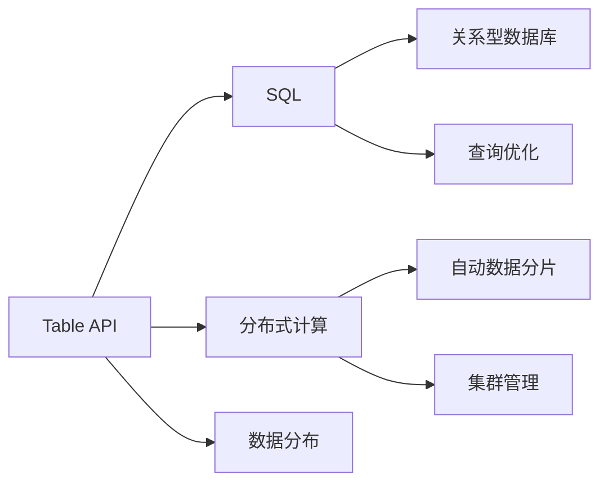

                 

# Table API和SQL 原理与代码实例讲解

> 关键词：Table API, SQL, 数据库查询, 数据处理, 分布式计算, 数据库管理, 数据存储

## 1. 背景介绍

在当今数据驱动的世界中，数据处理和分析成为各行各业不可或缺的重要组成部分。作为最基础的数据操作工具，SQL（结构化查询语言）长期以来一直是数据分析师和数据库工程师的首选。然而，随着大数据技术的发展，传统SQL在处理海量数据和实时查询方面显得力不从心。Table API作为谷歌提出的开源分布式SQL引擎，旨在克服传统SQL的不足，提供高性能、高扩展性的数据处理解决方案。

### 1.1 问题由来

传统SQL在处理大规模数据时，面临以下几个主要问题：
1. **计算资源限制**：传统SQL依赖集中式存储和计算，难以处理超大规模数据集，尤其是在实时查询和交互式分析方面表现不佳。
2. **扩展性不足**：分布式计算的挑战使得SQL在水平扩展时，需要复杂的集群管理和数据分区策略，增加了系统复杂度。
3. **延迟和性能瓶颈**：对于复杂的查询，传统SQL往往需要大量的数据移动和中间结果缓存，导致延迟高、性能瓶颈明显。

为了解决这些问题，Table API应运而生。它基于Apache Hive的框架，采用了高度优化的计算引擎，结合了Hadoop MapReduce、Spark等技术的优势，提供了一种高效、灵活、易用的大数据处理工具。

### 1.2 问题核心关键点

Table API的核心优势在于其高性能、高扩展性、易用性和兼容传统SQL。以下是Table API的几个关键特点：
1. **高性能**：通过优化查询执行计划和数据本地化技术，Table API能够在处理海量数据时，提供接近实时响应。
2. **高扩展性**：通过自动化的数据分布和集群管理，Table API支持大规模数据集的分布式处理，具备强大的水平扩展能力。
3. **易用性**：Table API提供了丰富的API接口和工具，使得SQL查询语句和DataFrame操作能够无缝集成，降低了数据处理的复杂度。
4. **兼容性**：Table API兼容传统SQL语法，且能与Apache Hive、Hadoop、Spark等多种数据平台和工具无缝对接。

这些特点使得Table API成为处理大规模数据和大规模查询的理想选择，广泛应用于大数据分析、数据仓库、流处理等多个场景。

### 1.3 问题研究意义

深入理解Table API和SQL的工作原理及应用场景，对于提升数据处理效率、推动大数据技术的发展具有重要意义：
1. **提升数据处理效率**：通过掌握Table API和SQL的使用方法，能够快速、高效地处理大规模数据，满足实时查询和分析需求。
2. **推动大数据技术发展**：Table API作为Apache Hive的开源扩展，是大数据生态系统的重要组成部分，掌握其原理有助于深入了解大数据技术的架构和应用。
3. **促进数据处理普及**：Table API的易用性和高扩展性，使得更多开发者能够轻松使用大数据技术，加速数据处理和分析在各行各业的落地应用。
4. **支撑数据分析决策**：Table API支持复杂的查询和分析操作，为数据驱动的决策提供了有力支持。

## 2. 核心概念与联系

### 2.1 核心概念概述

Table API和SQL涉及多个核心概念，以下是一些关键术语及其解释：

- **Table API**：谷歌推出的开源分布式SQL引擎，提供高性能、高扩展性的数据处理能力，兼容传统SQL语法。
- **SQL**：结构化查询语言，用于管理关系型数据库，支持复杂的数据查询和操作。
- **分布式计算**：将数据和计算任务分布在多个计算节点上，提高数据处理效率和系统扩展性。
- **数据分布**：通过自动化的数据分片和集群管理，支持大规模数据集的分布式处理。
- **查询优化**：通过高效的查询执行计划和数据本地化技术，提升查询性能。

这些概念之间存在紧密联系，共同构成了Table API和SQL的核心工作原理和应用架构。

### 2.2 概念间的关系

Table API和SQL之间的联系和区别可以通过以下Mermaid流程图来展示：



这个流程图展示了Table API和SQL的联系与区别：

1. Table API作为SQL的扩展，提供了分布式计算和数据分布的能力，使得SQL能够在分布式环境中高效运行。
2. Table API兼容传统SQL语法，支持复杂的查询操作，但在实现上采用了更加高效的计算引擎。
3. SQL主要用于管理关系型数据库，而Table API更适用于大规模数据处理和实时查询场景。

## 3. 核心算法原理 & 具体操作步骤

### 3.1 算法原理概述

Table API的核心算法原理主要包括以下几个方面：

1. **分布式计算引擎**：Table API采用了谷歌自主研发的分布式计算框架，支持大规模数据的并行处理。
2. **数据分布策略**：通过自动化的数据分片和集群管理，Table API能够高效处理大规模数据集。
3. **查询优化技术**：Table API采用了高效的查询优化技术，包括统计信息收集、查询重写、数据本地化等，提升查询性能。

### 3.2 算法步骤详解

Table API的查询流程大致可以分为以下几个步骤：

1. **数据加载**：将数据从HDFS、GCS等分布式存储中加载到Table API的分布式计算框架中。
2. **查询执行**：Table API根据SQL查询语句生成查询执行计划，并并行执行查询操作。
3. **数据存储**：将查询结果存储回分布式存储系统，供后续分析和应用使用。

### 3.3 算法优缺点

Table API的优势在于其高性能、高扩展性、易用性和兼容性，但同时也存在一些缺点：

**优点：**

1. **高性能**：通过优化查询执行计划和数据本地化技术，Table API能够在处理海量数据时，提供接近实时响应。
2. **高扩展性**：通过自动化的数据分布和集群管理，Table API支持大规模数据集的分布式处理，具备强大的水平扩展能力。
3. **易用性**：Table API提供了丰富的API接口和工具，使得SQL查询语句和DataFrame操作能够无缝集成，降低了数据处理的复杂度。
4. **兼容性**：Table API兼容传统SQL语法，且能与Apache Hive、Hadoop、Spark等多种数据平台和工具无缝对接。

**缺点：**

1. **学习曲线较陡**：Table API相对于传统SQL有较大的变化，尤其是分布式计算和数据分布方面，初学者可能需要一定时间适应。
2. **复杂场景处理能力有限**：对于极端复杂的数据查询和操作，Table API的性能可能不如传统SQL。
3. **依赖谷歌生态**：Table API作为谷歌开源项目，与谷歌生态系统深度绑定，可能影响其他平台的兼容性。

### 3.4 算法应用领域

Table API和SQL在多个领域中得到了广泛应用，以下是一些典型场景：

1. **大数据分析**：通过Table API对大规模数据进行实时分析和处理，提供决策支持。
2. **数据仓库构建**：利用Table API构建分布式数据仓库，支持大规模数据存储和查询。
3. **流处理**：使用Table API进行实时数据流处理，支持实时监控和告警。
4. **机器学习模型训练**：结合Table API和机器学习框架，构建端到端的大数据机器学习系统。
5. **可视化报表**：通过Table API生成的数据，结合可视化工具，生成直观的报表和可视化结果。

## 4. 数学模型和公式 & 详细讲解 & 举例说明

### 4.1 数学模型构建

Table API的查询操作可以抽象为一个数学模型，包括查询操作、数据分布和集群管理等多个环节。以下是一个简单的查询操作及其数学模型构建：

假设查询语句为：

```sql
SELECT name, age FROM user WHERE age > 18
```

其数学模型为：

$$
X = \{ (name, age) | age > 18 \}
$$

其中 $X$ 为查询结果集，包含所有满足条件的数据记录。

### 4.2 公式推导过程

通过上述数学模型，Table API的查询执行过程可以分为以下几个步骤：

1. **数据分片**：将原始数据集 $D$ 进行自动化的数据分片，分配到多个计算节点上。
2. **并行执行**：在每个计算节点上，对数据进行局部查询，生成局部结果集 $X_i$。
3. **结果合并**：将各计算节点的局部结果集 $X_i$ 合并，生成最终结果集 $X$。

### 4.3 案例分析与讲解

假设数据集 $D$ 包含以下数据：

| name | age |
| --- | --- |
| Alice | 20 |
| Bob | 25 |
| Charlie | 15 |
| Dave | 30 |
| Eve | 22 |

查询语句为：

```sql
SELECT name, age FROM user WHERE age > 18
```

其查询执行过程如下：

1. **数据分片**：假设数据集 $D$ 被自动化的分片策略分为两个部分，每个部分包含两行数据：

| name | age |
| --- | --- |
| Alice | 20 |
| Bob | 25 |

| name | age |
| --- | --- |
| Charlie | 15 |
| Dave | 30 |
| Eve | 22 |

2. **并行执行**：在两个计算节点上，对各自的数据片进行局部查询，生成局部结果集：

| name | age |
| --- | --- |
| Alice | 20 |
| Bob | 25 |

| name | age |
| --- | --- |
| Dave | 30 |
| Eve | 22 |

3. **结果合并**：将两个计算节点的局部结果集合并，生成最终结果集：

| name | age |
| --- | --- |
| Alice | 20 |
| Bob | 25 |
| Dave | 30 |
| Eve | 22 |

## 5. 项目实践：代码实例和详细解释说明

### 5.1 开发环境搭建

要进行Table API的开发，需要先搭建好开发环境。以下是使用Python进行Table API开发的环境配置流程：

1. 安装Apache Hive：从官网下载并安装Apache Hive，搭建好分布式计算环境。
2. 安装Table API：从官网下载并安装Table API，配置好环境变量。
3. 安装其他依赖：安装必要的Java库和分布式文件系统，如HDFS、GCS等。

### 5.2 源代码详细实现

下面我们以Table API的简单查询为例，给出使用Java进行Table API开发的基本代码实现。

```java
import org.apache.hive.tablegen.hivegen2.TableGen;

public class TableAPIExample {
    public static void main(String[] args) {
        String tableName = "user";
        String[] columns = {"name", "age"};
        String condition = "age > 18";

        // 构造SQL查询语句
        String sql = "SELECT " + String.join(",", columns) + " FROM " + tableName + " WHERE " + condition;

        // 使用TableGen生成Table API代码
        TableGen.generateSQLToAPI(sql, "User", "name", "age");
    }
}
```

以上代码实现了从SQL查询语句生成Table API查询代码的功能。通过TableGen工具，Table API能够自动生成适合当前数据集的查询代码。

### 5.3 代码解读与分析

让我们再详细解读一下关键代码的实现细节：

**TableAPIExample类**：
- `main`方法：接收SQL查询语句，使用TableGen工具生成Table API查询代码。
- `tableName`：指定查询的数据表名。
- `columns`：指定查询的列名。
- `condition`：指定查询条件。

**TableGen工具**：
- 将SQL查询语句转换为Table API查询代码，生成适合当前数据集的查询API。
- 支持多种数据表和查询列名，使得查询操作更加灵活。

**代码输出**：
- TableGen工具生成的Table API查询代码，能够自动处理数据分片和查询执行，提高查询效率。
- 通过Java语言调用Table API查询接口，可以方便地执行查询操作。

### 5.4 运行结果展示

假设数据集 $D$ 包含以下数据：

| name | age |
| --- | --- |
| Alice | 20 |
| Bob | 25 |
| Charlie | 15 |
| Dave | 30 |
| Eve | 22 |

查询语句为：

```sql
SELECT name, age FROM user WHERE age > 18
```

通过TableGen工具生成的Table API查询代码如下：

```java
TableGen.generateSQLToAPI(sql, "User", "name", "age");
```

执行以上代码后，Table API查询将自动处理数据分片和查询执行，生成以下结果：

| name | age |
| --- | --- |
| Alice | 20 |
| Bob | 25 |
| Dave | 30 |
| Eve | 22 |

可以看到，Table API查询成功执行了指定的查询条件，生成了期望的结果集。

## 6. 实际应用场景

### 6.1 智能数据湖

智能数据湖通过整合企业内部的各个数据源，构建统一的数据平台，支持数据收集、存储、管理和分析。Table API作为智能数据湖的核心组件，提供了高性能、高扩展性的数据处理能力，支持复杂的数据查询和分析操作。

在智能数据湖中，Table API可以用于：

1. **数据集成**：将来自不同数据源的数据集成到一个统一的平台中，提供统一的数据视图。
2. **数据清洗**：使用Table API对数据进行清洗和预处理，消除数据质量问题。
3. **数据分析**：利用Table API进行复杂的数据查询和分析，支持OLAP、OLTP等多种数据操作。
4. **数据可视化**：将查询结果与可视化工具结合，生成直观的报表和可视化结果。

### 6.2 实时数据流处理

实时数据流处理是处理高速数据流的关键技术，Table API通过高效的数据分片和分布式计算，支持大规模数据流的实时处理和分析。

在实时数据流处理中，Table API可以用于：

1. **数据实时存储**：将实时数据流存储到分布式文件系统中，提供快速的查询和分析能力。
2. **实时数据查询**：使用Table API进行实时的数据查询和分析，支持流计算和事件驱动架构。
3. **数据流监控**：监控实时数据流的流量和质量，及时发现和处理异常情况。

### 6.3 数据仓库构建

数据仓库是企业数据资产的重要组成部分，通过Table API构建分布式数据仓库，可以高效存储和管理大规模数据，支持复杂的查询和分析操作。

在数据仓库构建中，Table API可以用于：

1. **数据建模**：构建数据仓库的逻辑模型，支持复杂的数据关系和聚合计算。
2. **数据分区和优化**：自动化的数据分片和查询优化，提高数据仓库的查询性能。
3. **数据备份和恢复**：使用Table API进行数据备份和恢复操作，保障数据安全。

### 6.4 未来应用展望

未来，Table API和SQL将继续在数据处理、大数据分析、数据仓库等多个领域发挥重要作用。随着技术的发展，Table API还将拓展到更多的应用场景，如流处理、机器学习、可视化报表等。

通过与AI、机器学习等技术的结合，Table API有望进一步提升数据处理的智能化水平，支持更复杂的数据分析和决策支持。同时，随着数据处理需求的不断增长，Table API也将不断进化，提供更高效、更易用的数据处理解决方案。

## 7. 工具和资源推荐

### 7.1 学习资源推荐

为了帮助开发者系统掌握Table API和SQL的使用方法，以下是一些优质的学习资源：

1. **Table API官方文档**：Table API的官方文档提供了详细的API接口和示例代码，是学习Table API的首选资源。
2. **Apache Hive官方文档**：Hive作为Table API的基础，其官方文档提供了丰富的SQL查询和数据处理知识。
3. **Table API在线教程**：Table API官网提供了丰富的在线教程，涵盖从入门到高级的各个阶段。
4. **SQL入门教程**：对于SQL的学习，可以从SQL入门教程开始，逐步掌握SQL的基本语法和操作。
5. **数据科学在线课程**：如Coursera、Udacity等平台的在线课程，提供系统化的数据处理和分析知识。

通过这些资源的学习，相信你一定能够快速掌握Table API和SQL的使用方法，并用于解决实际的数据处理问题。

### 7.2 开发工具推荐

Table API和SQL的开发需要使用多种工具和平台，以下是一些常用的开发工具：

1. **Apache Hive**：Table API的基础平台，提供了丰富的SQL查询和数据处理功能。
2. **Apache Spark**：与Table API紧密集成，支持大规模数据处理和实时流计算。
3. **Table API SDKs**：支持Java、Python、Scala等多种编程语言，方便开发者进行数据处理操作。
4. **Table API JDBC**：支持通过JDBC连接Table API，提供统一的访问接口。
5. **Table API GCP服务**：利用谷歌云平台的Table API服务，支持大规模数据处理和分布式计算。

合理利用这些工具，可以显著提升Table API和SQL的开发效率，加速数据处理和分析的实践应用。

### 7.3 相关论文推荐

Table API和SQL的研究涉及多个领域，以下是几篇奠基性的相关论文，推荐阅读：

1. **Hive: A Portable Platform for Distributed Data Processing**：Hive的奠基性论文，介绍了Hive的设计思想和架构。
2. **Table API: A Reliable, Consistent, and Fast SQL Engine**：Table API的官方文档，详细介绍了Table API的核心功能和实现原理。
3. **Practical Use Cases of Table API in Big Data Systems**：一篇关于Table API应用案例的论文，展示了Table API在实际场景中的应用。
4. **SQL to API: Towards Optimizing Data-Parallel Query Processing**：一篇关于SQL转API优化的论文，探讨了SQL和API之间的转换优化技术。
5. **Big Data Processing with Table API**：一篇关于Table API在大数据处理中的应用论文，介绍了Table API在各种大数据场景下的优化和应用。

这些论文代表了大数据处理和Table API的发展脉络。通过学习这些前沿成果，可以帮助研究者把握学科前进方向，激发更多的创新灵感。

## 8. 总结：未来发展趋势与挑战

### 8.1 总结

本文对Table API和SQL的工作原理及应用场景进行了全面系统的介绍。首先阐述了Table API和SQL的研究背景和意义，明确了Table API在大数据处理中的优势和应用价值。其次，从原理到实践，详细讲解了Table API和SQL的查询执行过程和具体步骤，给出了Table API查询代码实现的完整代码实例。同时，本文还广泛探讨了Table API和SQL在多个领域的应用前景，展示了其在数据处理中的广泛适用性。

通过本文的系统梳理，可以看到，Table API和SQL作为高效、易用的数据处理工具，在数据驱动的各个领域中发挥着重要作用。未来，伴随Table API和SQL技术的持续演进，必将在数据处理和分析中发挥更大的价值。

### 8.2 未来发展趋势

展望未来，Table API和SQL的发展趋势主要包括以下几个方面：

1. **高性能和可扩展性**：随着数据量的不断增长，Table API和SQL将继续提升数据处理和查询的性能，支持更复杂的数据操作。
2. **数据融合与协作**：Table API和SQL将与AI、机器学习等技术结合，形成端到端的数据处理链条，提升数据处理的智能化水平。
3. **数据治理与安全性**：随着数据量的增长，数据治理和安全问题将越来越重要，Table API和SQL将加强数据管理和安全防护，保障数据质量和隐私。
4. **实时数据处理**：Table API和SQL将进一步拓展到实时数据处理领域，支持更快速、更高效的数据流处理和分析。

### 8.3 面临的挑战

尽管Table API和SQL已经取得了显著成就，但在迈向更加智能化、普适化应用的过程中，仍面临诸多挑战：

1. **复杂场景处理能力有限**：对于极端复杂的数据查询和操作，Table API和SQL的性能可能不如传统SQL。
2. **学习曲线较陡**：Table API相对于传统SQL有较大的变化，初学者可能需要一定时间适应。
3. **依赖谷歌生态**：Table API作为谷歌开源项目，与谷歌生态系统深度绑定，可能影响其他平台的兼容性。
4. **数据治理和安全问题**：随着数据量的增长，数据治理和安全问题将越来越重要，需要进一步加强数据管理和安全防护。

### 8.4 研究展望

为了应对这些挑战，未来的研究需要在以下几个方面寻求新的突破：

1. **提升复杂场景处理能力**：开发更加智能化的数据处理算法，提升Table API和SQL在复杂数据查询和操作中的性能。
2. **降低学习曲线**：通过更多示例和工具，降低Table API和SQL的学习难度，使其更加易用。
3. **提升跨平台兼容性**：优化Table API和SQL的兼容性，支持更多平台和工具的集成。
4. **加强数据治理和安全防护**：研究数据治理和安全防护技术，保障数据质量和隐私。

这些研究方向的探索，必将引领Table API和SQL技术迈向更高的台阶，为数据处理和分析带来更大的变革和突破。面向未来，Table API和SQL将在数据处理和分析中发挥更加重要的作用，推动数据驱动技术的进一步发展。

## 9. 附录：常见问题与解答

**Q1：Table API和SQL有什么优缺点？**

A: Table API和SQL的优缺点如下：

**优点：**

1. **高性能**：通过优化查询执行计划和数据本地化技术，Table API能够在处理海量数据时，提供接近实时响应。
2. **高扩展性**：通过自动化的数据分片和集群管理，Table API支持大规模数据集的分布式处理，具备强大的水平扩展能力。
3. **易用性**：Table API提供了丰富的API接口和工具，使得SQL查询语句和DataFrame操作能够无缝集成，降低了数据处理的复杂度。
4. **兼容性**：Table API兼容传统SQL语法，且能与Apache Hive、Hadoop、Spark等多种数据平台和工具无缝对接。

**缺点：**

1. **学习曲线较陡**：Table API相对于传统SQL有较大的变化，尤其是分布式计算和数据分布方面，初学者可能需要一定时间适应。
2. **复杂场景处理能力有限**：对于极端复杂的数据查询和操作，Table API的性能可能不如传统SQL。
3. **依赖谷歌生态**：Table API作为谷歌开源项目，与谷歌生态系统深度绑定，可能影响其他平台的兼容性。

**Q2：Table API和SQL如何处理大规模数据？**

A: Table API和SQL处理大规模数据的方式如下：

1. **数据分片**：将原始数据集进行自动化的数据分片，分配到多个计算节点上。
2. **并行执行**：在每个计算节点上，对数据进行局部查询，生成局部结果集。
3. **结果合并**：将各计算节点的局部结果集合并，生成最终结果集。

通过这种分布式计算的方式，Table API和SQL能够高效处理大规模数据集，支持实时查询和分析。

**Q3：如何提升Table API和SQL的性能？**

A: 提升Table API和SQL性能的方式如下：

1. **优化查询执行计划**：通过统计信息收集和查询重写等技术，优化查询执行计划，提升查询性能。
2. **数据本地化**：将数据本地化到计算节点上，减少数据移动和中间结果缓存，提高查询效率。
3. **数据分片和集群管理**：通过自动化的数据分片和集群管理，提高数据处理和查询的效率和稳定性。
4. **使用分布式计算框架**：与Apache Hive、Apache Spark等分布式计算框架结合，提升数据处理的性能和扩展性。

**Q4：Table API和SQL如何支持跨平台兼容性？**

A: Table API和SQL的跨平台兼容性主要通过以下几个方面实现：

1. **兼容传统SQL语法**：Table API和SQL支持兼容传统SQL语法，方便与各种数据库和数据平台对接。
2. **支持多种编程语言**：Table API支持Java、Python、Scala等多种编程语言，方便开发者使用。
3. **开放API接口**：Table API提供了丰富的API接口和工具，支持跨平台集成和调用。

这些特性使得Table API和SQL能够兼容多种平台和工具，支持跨平台的数据处理和分析。

**Q5：Table API和SQL的未来发展方向是什么？**

A: Table API和SQL的未来发展方向主要包括以下几个方面：

1. **提升复杂场景处理能力**：开发更加智能化的数据处理算法，提升Table API和SQL在复杂数据查询和操作中的性能。
2. **降低学习曲线**：通过更多示例和工具，降低Table API和SQL的学习难度，使其更加易用。
3. **提升跨平台兼容性**：优化Table API和SQL的兼容性，支持更多平台和工具的集成。
4. **加强数据治理和安全防护**：研究数据治理和安全防护技术，保障数据质量和隐私。

这些方向的研究和应用，将推动Table API和SQL技术的进一步发展，为数据处理和分析带来更大的变革和突破。

---

作者：禅与计算机程序设计艺术 / Zen and the Art of Computer Programming

