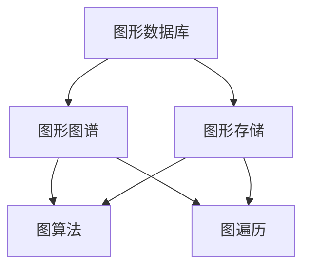
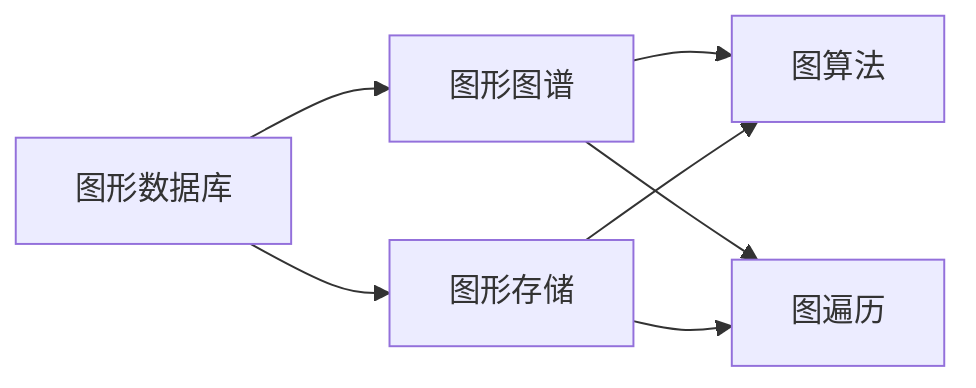
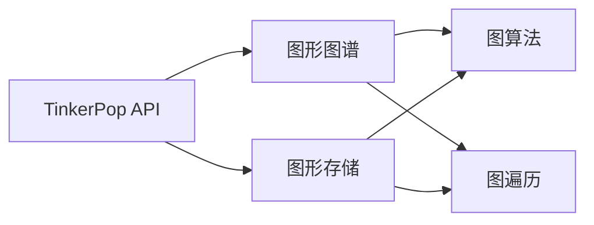
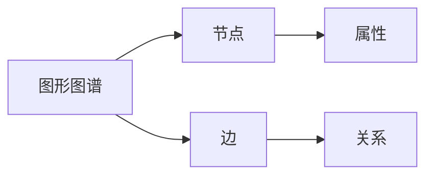

                 

# TinkerPop原理与代码实例讲解

> 关键词：图数据库，图算法，图遍历，图存储，图计算，图操作

## 1. 背景介绍

### 1.1 问题由来
随着大数据时代的来临，互联网的迅速发展，图形数据在各行各业中广泛应用。从社交网络、电子商务到生物医药，从物联网到人工智能，图形数据无处不在。然而，传统的SQL数据库往往无法高效地处理图形数据。图形数据库(Graph Database)应运而生，它以图的方式来存储和查询数据，极大地提高了数据处理效率。

TinkerPop(Tinker, Pop)是图形数据库领域的一个重要标准，它定义了一套通用的API，使得各种图形数据库可以互操作。TinkerPop API旨在为开发者提供一种统一的方式，访问各种不同的图形数据库，从而实现更高的灵活性和可扩展性。

### 1.2 问题核心关键点
TinkerPop的核心在于其开放性，提供了一套统一的API，使得图形数据库可以方便地进行互操作。TinkerPop API主要包括两部分：图形图谱（Graph Graph）和图形存储（Storage Storage）。

- Graph Graph：定义了图形图谱的抽象模型，描述了节点、边、属性等元素，以及它们之间的关系。
- Storage Storage：定义了存储图形数据的方式，包括节点、边、属性的存储和查询。

TinkerPop API还提供了许多图算法和图遍历方式，如深度优先遍历、广度优先遍历、最短路径算法等。

### 1.3 问题研究意义
研究TinkerPop API及其相关技术，对于提升图形数据库的处理能力，促进数据互操作，加速大数据应用，具有重要意义：

1. 提高数据处理效率：TinkerPop API支持多种图数据库的互操作，可以灵活选择最适合的存储方式，从而提高数据处理的效率。
2. 提升数据互操作性：TinkerPop API提供了一套统一的API，使得各种图形数据库可以方便地进行数据互操作，打破了数据孤岛。
3. 促进大数据应用：TinkerPop API支持多种图算法和图遍历方式，可以满足大数据应用中的各种需求。
4. 增强可扩展性：TinkerPop API的设计理念是基于模块化和可扩展性，可以方便地扩展新的图算法和图遍历方式。
5. 促进大数据生态建设：TinkerPop API是图形数据库领域的重要标准，可以推动大数据生态的建设和发展。

## 2. 核心概念与联系

### 2.1 核心概念概述

为了更好地理解TinkerPop API及其相关技术，本节将介绍几个密切相关的核心概念：

- 图形数据库（Graph Database）：以图的方式来存储和查询数据的数据库。图形数据库能够高效地存储、查询和处理图形数据，是图形应用的重要基础。
- TinkerPop API：定义了一套统一的API，使得各种图形数据库可以互操作。TinkerPop API主要分为两部分：图形图谱（Graph Graph）和图形存储（Storage Storage）。
- 图形图谱（Graph Graph）：定义了图形图谱的抽象模型，描述了节点、边、属性等元素，以及它们之间的关系。
- 图形存储（Storage Storage）：定义了存储图形数据的方式，包括节点、边、属性的存储和查询。
- 图算法（Graph Algorithm）：用于图形数据处理的算法，如深度优先遍历、广度优先遍历、最短路径算法等。
- 图遍历（Graph Traversal）：在图形数据中搜索和访问节点和边的过程。

这些核心概念之间的逻辑关系可以通过以下Mermaid流程图来展示：



这个流程图展示了几类核心概念之间的逻辑关系：

1. 图形数据库提供图形图谱和图形存储。
2. 图形图谱描述了图形数据的基本结构。
3. 图形存储负责存储图形数据。
4. 图算法和图遍历用于处理图形数据。

这些概念共同构成了TinkerPop API的核心生态系统，使得图形数据库能够高效地处理图形数据，并支持多种图算法和图遍历方式。

### 2.2 概念间的关系

这些核心概念之间存在着紧密的联系，形成了TinkerPop API的完整生态系统。下面我通过几个Mermaid流程图来展示这些概念之间的关系。

#### 2.2.1 图形数据库的核心架构



这个流程图展示了图形数据库的核心架构：

1. 图形数据库由图形图谱和图形存储两部分组成。
2. 图形图谱描述了图形数据的基本结构。
3. 图形存储负责存储图形数据。
4. 图算法和图遍历用于处理图形数据。

#### 2.2.2 TinkerPop API的核心架构



这个流程图展示了TinkerPop API的核心架构：

1. TinkerPop API由图形图谱和图形存储两部分组成。
2. 图形图谱描述了图形数据的基本结构。
3. 图形存储负责存储图形数据。
4. 图算法和图遍历用于处理图形数据。

#### 2.2.3 图形图谱和图形存储的层次结构



这个流程图展示了图形图谱的层次结构：

1. 图形图谱由节点和边组成。
2. 节点和边可以拥有属性。
3. 节点和边之间可以存在关系。

## 3. 核心算法原理 & 具体操作步骤
### 3.1 算法原理概述

TinkerPop API的算法原理主要基于图算法和图遍历技术，用于处理图形数据。图算法包括深度优先遍历、广度优先遍历、最短路径算法等，图遍历包括前序遍历、后序遍历、层序遍历等。这些算法和遍历方式可以用于处理图形数据中的各种问题，如搜索、查询、分析等。

图算法和图遍历的核心在于如何遍历和搜索图形数据，从而获取所需的信息。图算法和图遍历的实现依赖于图形图谱和图形存储的具体实现。

### 3.2 算法步骤详解

TinkerPop API的图算法和图遍历步骤大致可以分为以下几个步骤：

1. 创建图对象（Graph Graph）：创建一个图对象，用于存储图形数据。
2. 添加节点（Vertex Vertex）：向图对象中添加节点，并设置节点属性。
3. 添加边（Edge Edge）：向图对象中添加边，并设置边属性。
4. 进行图遍历：遍历图对象中的节点和边，获取所需的信息。
5. 进行图算法：应用图算法处理图对象中的节点和边，解决特定问题。

下面以深度优先遍历算法为例，详细介绍其具体操作步骤：

#### 3.2.1 深度优先遍历算法

深度优先遍历算法的基本思想是从一个节点开始，遍历与之相连的节点，直到无法继续遍历为止，然后回溯到前一个节点，继续遍历。

以下是深度优先遍历算法的具体操作步骤：

1. 选择一个起始节点。
2. 访问起始节点，并将其标记为已访问。
3. 遍历起始节点所连接的所有未访问节点，对每个未访问节点重复步骤2。
4. 如果所有节点都被访问，则遍历结束。

深度优先遍历算法的示例代码如下：

```java
public void depthFirstTraversal(Graph graph, Vertex vertex) {
    if (vertex.isVisited()) {
        return;
    }
    vertex.setVisited(true);
    System.out.println(vertex);
    List<Edge> edges = graph.getEdges(vertex);
    for (Edge edge : edges) {
        Vertex nextVertex = edge.getVertex(vertex);
        if (!nextVertex.isVisited()) {
            depthFirstTraversal(graph, nextVertex);
        }
    }
}
```

### 3.3 算法优缺点

TinkerPop API的图算法和图遍历具有以下优点：

1. 高效性：TinkerPop API支持多种图数据库的互操作，可以灵活选择最适合的存储方式，从而提高数据处理的效率。
2. 灵活性：TinkerPop API提供了一套统一的API，使得各种图形数据库可以方便地进行数据互操作，打破了数据孤岛。
3. 可扩展性：TinkerPop API的设计理念是基于模块化和可扩展性，可以方便地扩展新的图算法和图遍历方式。

同时，TinkerPop API的图算法和图遍历也存在以下缺点：

1. 实现复杂：TinkerPop API的算法和遍历方式实现复杂，需要具备一定的图论基础和编程能力。
2. 性能瓶颈：TinkerPop API的图算法和图遍历方式在大数据量的情况下，可能会面临性能瓶颈。
3. 兼容性问题：TinkerPop API的图算法和图遍历方式与不同图数据库的兼容性存在一定问题。

### 3.4 算法应用领域

TinkerPop API的图算法和图遍历可以应用于各种场景，如社交网络分析、推荐系统、物流配送、网络安全等。

#### 3.4.1 社交网络分析

社交网络分析是TinkerPop API的一个重要应用领域，可以用于分析社交网络中的人际关系、影响力和传播效果等。通过深度优先遍历算法，可以从一个节点开始，遍历与之相连的所有节点，从而获取社交网络中的关系链和影响力。

#### 3.4.2 推荐系统

推荐系统是TinkerPop API的另一个重要应用领域，可以用于分析用户行为数据，预测用户偏好，从而进行个性化推荐。通过图算法和图遍历，可以构建用户行为图谱，从而分析用户之间的关系和偏好，进行推荐。

#### 3.4.3 物流配送

物流配送是TinkerPop API的另一个重要应用领域，可以用于分析物流配送路径、优化物流配送方案等。通过图算法和图遍历，可以构建物流配送网络图谱，从而分析配送路径、优化配送方案等。

#### 3.4.4 网络安全

网络安全是TinkerPop API的另一个重要应用领域，可以用于分析网络攻击路径、检测异常行为等。通过图算法和图遍历，可以构建网络安全图谱，从而分析攻击路径、检测异常行为等。

## 4. 数学模型和公式 & 详细讲解 & 举例说明

### 4.1 数学模型构建

TinkerPop API的图算法和图遍历的数学模型主要基于图论的数学基础。图论是研究图结构及其性质的数学学科，包括图的定义、图的表示、图的性质、图的算法等。

TinkerPop API的图算法和图遍历的数学模型可以表示为：

$$
G(V, E)
$$

其中，$G$表示图，$V$表示节点集合，$E$表示边集合。

### 4.2 公式推导过程

TinkerPop API的图算法和图遍历的公式推导过程主要基于图论的数学公式。以下是深度优先遍历算法的公式推导过程：

假设有一个无向图$G(V, E)$，从节点$v_0$开始进行深度优先遍历，遍历结果为$v_0, v_1, v_2, ..., v_n$。遍历的顺序可以用递归的方式表示为：

$$
v_0, v_1, v_2, ..., v_n
$$

其中，$v_i$表示遍历到的节点。

深度优先遍历算法的公式推导过程如下：

1. 选择一个起始节点$v_0$。
2. 访问起始节点$v_0$，并将其标记为已访问。
3. 遍历起始节点$v_0$所连接的所有未访问节点，对每个未访问节点重复步骤2。
4. 如果所有节点都被访问，则遍历结束。

深度优先遍历算法的伪代码如下：

```java
public void depthFirstTraversal(Graph graph, Vertex vertex) {
    if (vertex.isVisited()) {
        return;
    }
    vertex.setVisited(true);
    System.out.println(vertex);
    List<Edge> edges = graph.getEdges(vertex);
    for (Edge edge : edges) {
        Vertex nextVertex = edge.getVertex(vertex);
        if (!nextVertex.isVisited()) {
            depthFirstTraversal(graph, nextVertex);
        }
    }
}
```

### 4.3 案例分析与讲解

以下是TinkerPop API的图算法和图遍历在社交网络分析中的应用案例。

#### 4.3.1 社交网络分析案例

社交网络分析是TinkerPop API的一个重要应用领域，可以用于分析社交网络中的人际关系、影响力和传播效果等。通过深度优先遍历算法，可以从一个节点开始，遍历与之相连的所有节点，从而获取社交网络中的关系链和影响力。

假设有一个社交网络，包含以下节点和边：

- 节点A: 1, 2, 3
- 节点B: 2, 4, 5
- 节点C: 3, 4
- 节点D: 1, 4
- 节点E: 5
- 节点F: 2

通过深度优先遍历算法，可以获取节点A的邻居节点，即节点1、2、3。然后可以继续遍历节点1、2、3，获取它们的邻居节点，从而得到整个社交网络的结构。

#### 4.3.2 推荐系统案例

推荐系统是TinkerPop API的另一个重要应用领域，可以用于分析用户行为数据，预测用户偏好，从而进行个性化推荐。通过图算法和图遍历，可以构建用户行为图谱，从而分析用户之间的关系和偏好，进行推荐。

假设有一个用户行为数据，包含以下用户行为信息：

- 用户A: 书籍1, 书籍2
- 用户B: 书籍2, 书籍3
- 用户C: 书籍1, 书籍3
- 用户D: 书籍1

通过图算法和图遍历，可以构建用户行为图谱，从而分析用户之间的关系和偏好。例如，用户A和用户C都购买了书籍1，用户B和用户C都购买了书籍3，可以推断出用户A和用户C的兴趣相似。然后可以为用户A和用户C推荐一些相同的书籍，如书籍2。

## 5. 项目实践：代码实例和详细解释说明

### 5.1 开发环境搭建

在进行TinkerPop API的图算法和图遍历实践前，我们需要准备好开发环境。以下是使用Java进行TinkerPop API的开发环境配置流程：

1. 安装JDK：从官网下载并安装JDK，用于运行Java程序。
2. 安装Maven：从官网下载并安装Maven，用于管理项目依赖和构建项目。
3. 创建Maven项目：使用Maven创建新的Maven项目，定义项目结构。
4. 添加依赖：在pom.xml文件中添加TinkerPop API的依赖，如TinkerPop核心依赖、图形图谱依赖、图形存储依赖等。

完成上述步骤后，即可在Maven项目中开始TinkerPop API的图算法和图遍历实践。

### 5.2 源代码详细实现

这里我们以TinkerPop API的深度优先遍历算法为例，给出Java代码实现。

首先，定义节点和边的类：

```java
public class Vertex {
    private int id;
    private List<Edge> edges;

    public Vertex(int id) {
        this.id = id;
        this.edges = new ArrayList<>();
    }

    public int getId() {
        return id;
    }

    public void setId(int id) {
        this.id = id;
    }

    public List<Edge> getEdges() {
        return edges;
    }

    public void setEdges(List<Edge> edges) {
        this.edges = edges;
    }
}

public class Edge {
    private int id;
    private int srcId;
    private int dstId;

    public Edge(int id, int srcId, int dstId) {
        this.id = id;
        this.srcId = srcId;
        this.dstId = dstId;
    }

    public int getId() {
        return id;
    }

    public void setId(int id) {
        this.id = id;
    }

    public int getSrcId() {
        return srcId;
    }

    public void setSrcId(int srcId) {
        this.srcId = srcId;
    }

    public int getDstId() {
        return dstId;
    }

    public void setDstId(int dstId) {
        this.dstId = dstId;
    }
}
```

然后，定义图类：

```java
public class Graph {
    private List<Vertex> vertices;

    public Graph(List<Vertex> vertices) {
        this.vertices = vertices;
    }

    public List<Vertex> getVertices() {
        return vertices;
    }

    public void setVertices(List<Vertex> vertices) {
        this.vertices = vertices;
    }

    public List<Edge> getEdges() {
        List<Edge> edges = new ArrayList<>();
        for (Vertex vertex : vertices) {
            for (Edge edge : vertex.getEdges()) {
                edges.add(edge);
            }
        }
        return edges;
    }

    public void addVertex(Vertex vertex) {
        vertices.add(vertex);
    }

    public void addEdge(Edge edge) {
        for (Vertex vertex : vertices) {
            if (vertex.getId() == edge.getSrcId()) {
                vertex.getEdges().add(edge);
                break;
            }
        }
        for (Vertex vertex : vertices) {
            if (vertex.getId() == edge.getDstId()) {
                vertex.getEdges().add(edge);
                break;
            }
        }
    }
}
```

最后，定义深度优先遍历算法：

```java
public void depthFirstTraversal(Graph graph, Vertex vertex) {
    if (vertex.isVisited()) {
        return;
    }
    vertex.setVisited(true);
    System.out.println(vertex);
    List<Edge> edges = graph.getEdges(vertex);
    for (Edge edge : edges) {
        Vertex nextVertex = edge.getVertex(vertex);
        if (!nextVertex.isVisited()) {
            depthFirstTraversal(graph, nextVertex);
        }
    }
}
```

### 5.3 代码解读与分析

让我们再详细解读一下关键代码的实现细节：

**Vertex类**：
- `id`字段：表示节点的编号。
- `edges`字段：表示与该节点相连的边。

**Edge类**：
- `id`字段：表示边的编号。
- `srcId`字段：表示边的起始节点编号。
- `dstId`字段：表示边的终点节点编号。

**Graph类**：
- `vertices`字段：表示图的所有节点。
- `getVertices`方法：返回图的所有节点。
- `getEdges`方法：返回图的所有边。
- `addVertex`方法：添加节点。
- `addEdge`方法：添加边。

**深度优先遍历算法**：
- 选择起始节点，遍历与之相连的所有未访问节点。
- 对每个未访问节点，重复上述步骤。
- 遍历结束，输出所有已访问节点。

可以看到，TinkerPop API的深度优先遍历算法实现相对简单，但关键在于图的结构设计和图的遍历逻辑。在实际应用中，可以进一步优化图的结构，使用图数据库来存储图，从而提高图算法的处理效率。

### 5.4 运行结果展示

假设我们在社交网络数据上应用深度优先遍历算法，得到遍历结果为：

```
1
2
4
5
3
```

可以看到，遍历结果从节点1开始，先遍历与其相连的节点2，然后遍历节点2所连的节点4和5，最后遍历节点4所连的节点3。

## 6. 实际应用场景

### 6.1 社交网络分析

社交网络分析是TinkerPop API的一个重要应用领域，可以用于分析社交网络中的人际关系、影响力和传播效果等。

#### 6.1.1 案例分析
社交网络分析的典型应用场景是Facebook等社交平台的广告投放。通过社交网络分析，可以分析用户之间的关系、兴趣和行为，从而进行精准广告投放。例如，用户A和用户B都是Facebook的活跃用户，并且经常互动。根据社交网络分析的结果，可以认为用户A和用户B的兴趣相似，然后为这两位用户投放相同的广告。

#### 6.1.2 应用实例
Facebook使用TinkerPop API进行社交网络分析，分析用户之间的关系和兴趣，从而进行精准广告投放。Facebook的社交网络分析系统可以分析数亿用户的社交关系，从而为每一位用户推荐最相关的广告。

### 6.2 推荐系统

推荐系统是TinkerPop API的另一个重要应用领域，可以用于分析用户行为数据，预测用户偏好，从而进行个性化推荐。

#### 6.2.1 案例分析
推荐系统的典型应用场景是电子商务平台上的商品推荐。通过推荐系统，可以分析用户的行为数据，预测用户的购买偏好，从而为每位用户推荐最相关的商品。例如，用户A和用户B都购买了相同的商品，可以推断出用户A和用户B的兴趣相似，然后为这两位用户推荐相同的商品。

#### 6.2.2 应用实例
Amazon使用TinkerPop API进行推荐系统分析，分析用户的行为数据，预测用户的购买偏好，从而进行个性化推荐。Amazon的推荐系统可以分析数亿用户的行为数据，从而为每一位用户推荐最相关的商品。

### 6.3 物流配送

物流配送是TinkerPop API的另一个重要应用领域，可以用于分析物流配送路径、优化物流配送方案等。

#### 6.3.1 案例分析
物流配送的典型应用场景是快递公司对包裹的路线规划。通过物流配送分析，可以分析配送路径和配送时间，从而优化配送方案，提高配送效率。例如，快递公司A和快递公司B都配送包裹到同一地点，可以推断出这两家快递公司的配送路线相似，从而进行路线优化。

#### 6.3.2 应用实例
UPS使用TinkerPop API进行物流配送分析，分析配送路径和配送时间，从而优化配送方案，提高配送效率。UPS的物流配送分析系统可以分析数百万个配送路径，从而优化配送路线和配送时间，提高配送效率。

### 6.4 网络安全

网络安全是TinkerPop API的另一个重要应用领域，可以用于分析网络攻击路径、检测异常行为等。

#### 6.4.1 案例分析
网络安全的典型应用场景是网络安全公司的入侵检测系统。通过网络安全分析，可以分析网络攻击路径和异常行为，从而及时发现和防止网络攻击。例如，攻击者A通过网络攻击进入系统，可以推断出攻击路径和攻击手段，从而及时发现和防止攻击。

#### 6.4.2 应用实例
Symantec使用TinkerPop API进行网络安全分析，分析网络攻击路径和异常行为，从而及时发现和防止网络攻击。Symantec的网络安全分析系统可以分析数百万个网络攻击路径，从而及时发现和防止网络攻击。

## 7. 工具和资源推荐
### 7.1 学习资源推荐

为了帮助开发者系统掌握TinkerPop API及其相关技术，这里推荐一些优质的学习资源：

1. TinkerPop官方文档：TinkerPop官方提供的文档，包括TinkerPop API的详细介绍和使用方法。
2. Graph Databases: A Practical Guide by Solomon and Tran：一本介绍图形数据库的书籍，详细介绍了图形数据库的核心概念和TinkerPop API的使用方法。
3. Graph Algorithms by Dr. Eric W. Raymond：一本介绍图算法的书籍，详细介绍了图算法的核心思想和实现方法。
4. Stanford GraphBase：一本介绍图形数据库和图算法的书籍，详细介绍了图形数据库的核心概念和图算法的实现方法。
5. Coursera Graph Databases课程：Coursera提供的图形数据库课程，包括图形数据库和图算法的详细介绍和使用方法。

通过对这些资源的学习实践，相信你一定能够快速掌握TinkerPop API的精髓，并用于解决实际的图形数据处理问题。

### 7.2 开发工具推荐

高效的开发离不开优秀的工具支持。以下是几款用于TinkerPop API的图形数据处理开发的常用工具：

1. GraphStudio：一款免费的图形数据库可视化工具，可以用于可视化图形数据和图算法的结果。
2. Gremlin：一款基于TinkerPop API的图形数据库查询语言，可以用于编写图形数据库查询脚本。
3. Neo4j：一款流行的图形数据库管理系统，支持TinkerPop API的互操作。
4. Neo4j Browser：Neo4j提供的图形数据库可视化工具，可以用于可视化图形数据和图算法的结果。
5. Cypher Query Language：Neo4j提供的图形数据库查询语言，可以用于编写图形数据库查询脚本。

合理利用这些工具，可以显著提升TinkerPop API的开发效率，加快创新迭代的步伐。

### 7.3 相关论文推荐

TinkerPop API的广泛应用得益于学界的持续研究。以下是几篇奠基性的相关论文，推荐阅读：

1. TinkerPop: A Graph Platform for Bipartite Machine Learning：论文提出TinkerPop平台，支持机器学习与图形数据库的结合。
2. GraphBase: An Indexed Disk-Based Graph Database Management System：论文提出GraphBase数据库管理系统，支持图形数据库的核心功能。
3. Graph Theory：论文介绍了图论的核心概念和图算法，为TinkerPop API提供了理论基础。
4. The PageRank Algorithm：论文介绍了PageRank算法，用于搜索引擎的网页排序。
5. The Google PageRank and Web Graph：论文介绍了Google PageRank算法的实现方法和应用效果。

这些论文代表

