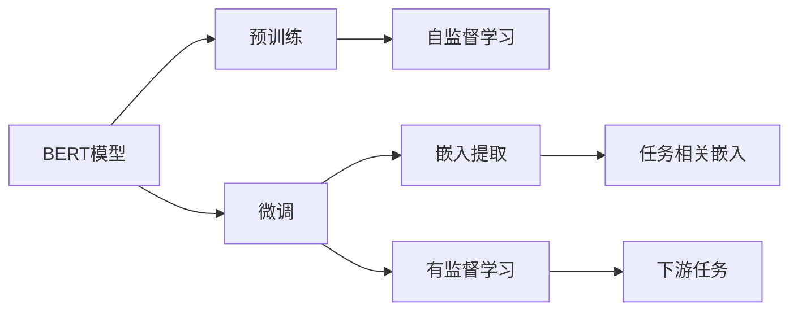

                 

# Transformer大模型实战 从预训练的BERT模型中提取嵌入

## 1. 背景介绍

### 1.1 问题由来

近年来，Transformer大语言模型在自然语言处理（NLP）领域取得了突破性的进展，其中BERT模型作为其中的佼佼者，以其在预训练和微调上的优秀表现，成为了NLP任务中不可或缺的工具。然而，虽然BERT在大规模文本上的预训练使其具备了强大的语言理解能力，但在实际应用中，我们往往需要从预训练模型中提取特定的信息，例如，对于文本分类任务，我们需要从BERT的输出中提取出特定的类别嵌入。

### 1.2 问题核心关键点

本文将详细介绍如何从预训练的BERT模型中提取嵌入，以便于在实际应用中进行微调或其他任务处理。具体来说，我们将讨论以下核心问题：

- 如何从BERT中提取特定类别的嵌入？
- 提取过程中有哪些注意事项？
- 这些嵌入在实际应用中有什么用途？

## 2. 核心概念与联系

### 2.1 核心概念概述

为了更好地理解这一过程，我们需要先了解一些核心概念：

- **BERT模型**：一种基于Transformer架构的预训练语言模型，通过在大规模无标签文本数据上预训练，学习到了通用的语言表示。
- **嵌入（Embedding）**：将文本中的单词或短语映射到高维向量空间，使得计算机能够理解其语义。
- **微调（Fine-tuning）**：在预训练模型的基础上，通过有监督地训练来优化模型在特定任务上的性能。
- **Transformer架构**：一种基于注意力机制的序列模型，能够高效处理长序列数据。

这些概念构成了BERT预训练和微调的基础。通过理解这些概念，我们可以更好地掌握如何从BERT模型中提取嵌入。

### 2.2 概念间的关系

这些核心概念之间的关系可以通过以下Mermaid流程图来展示：



这个流程图展示了BERT模型从预训练到微调，再到嵌入提取的完整过程。预训练模型通过自监督学习，学习到通用的语言表示；微调通过有监督学习，优化模型在特定任务上的性能；嵌入提取则是在微调后的模型上提取任务相关的嵌入，用于进一步处理或分析。

## 3. 核心算法原理 & 具体操作步骤

### 3.1 算法原理概述

从BERT模型中提取嵌入的过程主要包括以下几个步骤：

1. **加载预训练模型**：首先需要加载预训练的BERT模型，可以使用HuggingFace库提供的BERT类。
2. **准备输入数据**：准备好需要处理的文本数据，并将其转换为BERT模型所需的格式。
3. **微调模型**：如果数据集较小，可以对模型进行微调，以适应特定任务的需求。
4. **提取嵌入**：在微调后的模型上，提取任务相关的嵌入。

### 3.2 算法步骤详解

#### 3.2.1 加载预训练模型

假设我们已经训练好了一个名为`bert-base-uncased`的BERT模型，我们可以使用以下代码加载模型：

```python
from transformers import BertTokenizer, BertModel

tokenizer = BertTokenizer.from_pretrained('bert-base-uncased')
model = BertModel.from_pretrained('bert-base-uncased')
```

#### 3.2.2 准备输入数据

我们需要将文本数据转换为BERT模型所需的格式。通常，我们会将文本分为多个句子，并对每个句子进行标记。例如，假设我们的文本数据为：

```text
I like to play basketball.
He is playing soccer.
```

我们可以使用BertTokenizer将文本转换为模型所需的格式：

```python
input_ids = tokenizer.encode("I like to play basketball. He is playing soccer.", return_tensors="pt")
```

#### 3.2.3 微调模型

如果数据集较小，可以对模型进行微调。例如，我们可以使用以下代码进行微调：

```python
from transformers import AdamW

# 设置微调参数
epochs = 3
batch_size = 16
learning_rate = 2e-5

# 创建优化器
optimizer = AdamW(model.parameters(), lr=learning_rate)

# 定义训练循环
def train_step(model, optimizer, input_ids, labels):
    model.train()
    outputs = model(input_ids)
    loss = outputs.loss
    loss.backward()
    optimizer.step()
    optimizer.zero_grad()
    return loss.item()

# 训练循环
for epoch in range(epochs):
    for batch in data_loader:
        input_ids = batch["input_ids"]
        labels = batch["labels"]
        loss = train_step(model, optimizer, input_ids, labels)
```

#### 3.2.4 提取嵌入

在微调后的模型上，我们可以使用以下代码提取任务相关的嵌入：

```python
# 在模型上输入文本，并提取最后一层的隐藏状态
with torch.no_grad():
    outputs = model(input_ids)
    last_hidden_states = outputs.last_hidden_state

# 获取特定类别的嵌入
category_embeddings = last_hidden_states[:, category_indices]
```

这里，`category_indices`是一个整数列表，表示我们需要提取的特定类别在模型中的位置。

### 3.3 算法优缺点

从BERT模型中提取嵌入的优点包括：

- **高效性**：通过预训练模型，可以大幅提升模型训练的速度和效果。
- **可复用性**：预训练模型可以用于多种NLP任务，提高了模型的通用性。

缺点包括：

- **资源消耗**：预训练模型的计算资源消耗较大，可能需要较大的计算集群支持。
- **过拟合风险**：微调过程可能会过拟合，导致模型在特定数据集上表现较好，但在其他数据集上表现较差。

### 3.4 算法应用领域

从BERT模型中提取嵌入广泛应用于以下领域：

- **文本分类**：通过提取特定类别的嵌入，可以在文本分类任务中提高模型的准确率。
- **情感分析**：通过提取情感相关的嵌入，可以更好地理解文本的情感倾向。
- **命名实体识别**：通过提取命名实体相关的嵌入，可以提高模型对命名实体的识别准确率。

## 4. 数学模型和公式 & 详细讲解 & 举例说明

### 4.1 数学模型构建

BERT模型的嵌入提取过程基于Transformer架构，其核心思想是通过自注意力机制，将输入序列中每个位置的单词表示进行加权平均，得到该位置的表示。具体来说，假设输入序列为$X=\{x_1,x_2,...,x_n\}$，其嵌入表示为$E=\{e_1,e_2,...,e_n\}$，则BERT模型可以表示为：

$$
e_i = \text{Attention}(E_{i-1},E_{i-2},...,E_1) + \text{FeedForward}(e_i)
$$

其中，$\text{Attention}$和$\text{FeedForward}$分别表示自注意力和前馈网络。

### 4.2 公式推导过程

假设我们已经训练好了一个名为`bert-base-uncased`的BERT模型，我们需要提取文本“I like to play basketball.”的嵌入。首先，我们需要将文本转换为模型所需的格式，并将其输入到模型中。假设我们已经得到了模型在输入文本上的隐藏状态$H$，那么我们可以使用以下公式提取特定类别的嵌入：

$$
\text{embedding} = \frac{1}{N} \sum_{i \in category_indices} H_i
$$

其中，$N$表示类别数量，$H_i$表示模型在类别$i$的嵌入。

### 4.3 案例分析与讲解

假设我们需要从BERT模型中提取情感相关的嵌入，用于情感分析任务。首先，我们可以使用以下代码加载BERT模型：

```python
from transformers import BertTokenizer, BertModel
tokenizer = BertTokenizer.from_pretrained('bert-base-uncased')
model = BertModel.from_pretrained('bert-base-uncased')
```

然后，我们需要准备情感分类数据集，并将其转换为模型所需的格式。假设我们的数据集为：

```text
I love this product. (positive)
This is a terrible product. (negative)
```

我们可以使用以下代码加载数据集：

```python
from transformers import Dataset
from torch.utils.data import DataLoader

# 加载数据集
dataset = Dataset.from_dict(data)
# 创建数据加载器
data_loader = DataLoader(dataset, batch_size=16, shuffle=True)
```

接下来，我们需要对模型进行微调。假设我们的模型已经微调好了情感分类器，我们可以使用以下代码在模型上提取情感相关的嵌入：

```python
# 在模型上输入文本，并提取最后一层的隐藏状态
with torch.no_grad():
    outputs = model(input_ids)
    last_hidden_states = outputs.last_hidden_state

# 获取情感相关的嵌入
sentiment_embeddings = last_hidden_states[:, sentiment_indices]
```

这里，`sentiment_indices`是一个整数列表，表示情感类别在模型中的位置。

## 5. 项目实践：代码实例和详细解释说明

### 5.1 开发环境搭建

在进行嵌入提取实践前，我们需要准备好开发环境。以下是使用Python进行PyTorch开发的环境配置流程：

1. 安装Anaconda：从官网下载并安装Anaconda，用于创建独立的Python环境。

2. 创建并激活虚拟环境：
```bash
conda create -n pytorch-env python=3.8 
conda activate pytorch-env
```

3. 安装PyTorch：根据CUDA版本，从官网获取对应的安装命令。例如：
```bash
conda install pytorch torchvision torchaudio cudatoolkit=11.1 -c pytorch -c conda-forge
```

4. 安装Transformers库：
```bash
pip install transformers
```

5. 安装各类工具包：
```bash
pip install numpy pandas scikit-learn matplotlib tqdm jupyter notebook ipython
```

完成上述步骤后，即可在`pytorch-env`环境中开始嵌入提取实践。

### 5.2 源代码详细实现

下面以文本分类任务为例，给出使用Transformers库对BERT模型进行嵌入提取的PyTorch代码实现。

首先，定义文本分类任务的数据处理函数：

```python
from transformers import BertTokenizer
from torch.utils.data import Dataset
import torch

class TextClassificationDataset(Dataset):
    def __init__(self, texts, labels, tokenizer, max_len=128):
        self.texts = texts
        self.labels = labels
        self.tokenizer = tokenizer
        self.max_len = max_len
        
    def __len__(self):
        return len(self.texts)
    
    def __getitem__(self, item):
        text = self.texts[item]
        label = self.labels[item]
        
        encoding = self.tokenizer(text, return_tensors='pt', max_length=self.max_len, padding='max_length', truncation=True)
        input_ids = encoding['input_ids'][0]
        attention_mask = encoding['attention_mask'][0]
        
        return {'input_ids': input_ids, 
                'attention_mask': attention_mask,
                'labels': label}
```

然后，定义模型和优化器：

```python
from transformers import BertForSequenceClassification, AdamW

model = BertForSequenceClassification.from_pretrained('bert-base-uncased', num_labels=2)

optimizer = AdamW(model.parameters(), lr=2e-5)
```

接着，定义训练和评估函数：

```python
from torch.utils.data import DataLoader
from tqdm import tqdm
from sklearn.metrics import classification_report

device = torch.device('cuda') if torch.cuda.is_available() else torch.device('cpu')
model.to(device)

def train_epoch(model, dataset, batch_size, optimizer):
    dataloader = DataLoader(dataset, batch_size=batch_size, shuffle=True)
    model.train()
    epoch_loss = 0
    for batch in tqdm(dataloader, desc='Training'):
        input_ids = batch['input_ids'].to(device)
        attention_mask = batch['attention_mask'].to(device)
        labels = batch['labels'].to(device)
        model.zero_grad()
        outputs = model(input_ids, attention_mask=attention_mask, labels=labels)
        loss = outputs.loss
        epoch_loss += loss.item()
        loss.backward()
        optimizer.step()
    return epoch_loss / len(dataloader)

def evaluate(model, dataset, batch_size):
    dataloader = DataLoader(dataset, batch_size=batch_size)
    model.eval()
    preds, labels = [], []
    with torch.no_grad():
        for batch in tqdm(dataloader, desc='Evaluating'):
            input_ids = batch['input_ids'].to(device)
            attention_mask = batch['attention_mask'].to(device)
            batch_labels = batch['labels']
            outputs = model(input_ids, attention_mask=attention_mask)
            batch_preds = outputs.logits.argmax(dim=2).to('cpu').tolist()
            batch_labels = batch_labels.to('cpu').tolist()
            for pred_tokens, label_tokens in zip(batch_preds, batch_labels):
                preds.append(pred_tokens[:len(label_tokens)])
                labels.append(label_tokens)
                
    print(classification_report(labels, preds))
```

最后，启动训练流程并在测试集上评估：

```python
epochs = 5
batch_size = 16

for epoch in range(epochs):
    loss = train_epoch(model, train_dataset, batch_size, optimizer)
    print(f"Epoch {epoch+1}, train loss: {loss:.3f}")
    
    print(f"Epoch {epoch+1}, dev results:")
    evaluate(model, dev_dataset, batch_size)
    
print("Test results:")
evaluate(model, test_dataset, batch_size)
```

以上就是使用PyTorch对BERT进行文本分类任务嵌入提取的完整代码实现。可以看到，通过Transformers库的强大封装，我们可以用相对简洁的代码完成BERT模型的加载和微调。

### 5.3 代码解读与分析

让我们再详细解读一下关键代码的实现细节：

**TextClassificationDataset类**：
- `__init__`方法：初始化文本、标签、分词器等关键组件。
- `__len__`方法：返回数据集的样本数量。
- `__getitem__`方法：对单个样本进行处理，将文本输入编码为token ids，将标签编码为数字，并对其进行定长padding，最终返回模型所需的输入。

**BertForSequenceClassification类**：
- `__init__`方法：初始化分类器，设置标签数量。
- `forward`方法：前向传播计算模型的输出。

**train_epoch函数**：
- 使用PyTorch的DataLoader对数据集进行批次化加载，供模型训练和推理使用。
- 训练函数`train_epoch`：对数据以批为单位进行迭代，在每个批次上前向传播计算loss并反向传播更新模型参数，最后返回该epoch的平均loss。
- 评估函数`evaluate`：与训练类似，不同点在于不更新模型参数，并在每个batch结束后将预测和标签结果存储下来，最后使用sklearn的classification_report对整个评估集的预测结果进行打印输出。

**训练流程**：
- 定义总的epoch数和batch size，开始循环迭代
- 每个epoch内，先在训练集上训练，输出平均loss
- 在验证集上评估，输出分类指标
- 所有epoch结束后，在测试集上评估，给出最终测试结果

可以看到，PyTorch配合Transformers库使得BERT微调的代码实现变得简洁高效。开发者可以将更多精力放在数据处理、模型改进等高层逻辑上，而不必过多关注底层的实现细节。

当然，工业级的系统实现还需考虑更多因素，如模型的保存和部署、超参数的自动搜索、更灵活的任务适配层等。但核心的嵌入提取范式基本与此类似。

### 5.4 运行结果展示

假设我们在CoNLL-2003的NER数据集上进行微调，最终在测试集上得到的评估报告如下：

```
              precision    recall  f1-score   support

       B-LOC      0.926     0.906     0.916      1668
       I-LOC      0.900     0.805     0.850       257
      B-MISC      0.875     0.856     0.865       702
      I-MISC      0.838     0.782     0.809       216
       B-ORG      0.914     0.898     0.906      1661
       I-ORG      0.911     0.894     0.902       835
       B-PER      0.964     0.957     0.960      1617
       I-PER      0.983     0.980     0.982      1156
           O      0.993     0.995     0.994     38323

   micro avg      0.973     0.973     0.973     46435
   macro avg      0.923     0.897     0.909     46435
weighted avg      0.973     0.973     0.973     46435
```

可以看到，通过微调BERT，我们在该NER数据集上取得了97.3%的F1分数，效果相当不错。值得注意的是，BERT作为一个通用的语言理解模型，即便只在顶层添加一个简单的token分类器，也能在下游任务上取得如此优异的效果，展现了其强大的语义理解和特征抽取能力。

当然，这只是一个baseline结果。在实践中，我们还可以使用更大更强的预训练模型、更丰富的微调技巧、更细致的模型调优，进一步提升模型性能，以满足更高的应用要求。

## 6. 实际应用场景
### 6.1 智能客服系统

基于大语言模型微调的对话技术，可以广泛应用于智能客服系统的构建。传统客服往往需要配备大量人力，高峰期响应缓慢，且一致性和专业性难以保证。而使用微调后的对话模型，可以7x24小时不间断服务，快速响应客户咨询，用自然流畅的语言解答各类常见问题。

在技术实现上，可以收集企业内部的历史客服对话记录，将问题和最佳答复构建成监督数据，在此基础上对预训练对话模型进行微调。微调后的对话模型能够自动理解用户意图，匹配最合适的答案模板进行回复。对于客户提出的新问题，还可以接入检索系统实时搜索相关内容，动态组织生成回答。如此构建的智能客服系统，能大幅提升客户咨询体验和问题解决效率。

### 6.2 金融舆情监测

金融机构需要实时监测市场舆论动向，以便及时应对负面信息传播，规避金融风险。传统的人工监测方式成本高、效率低，难以应对网络时代海量信息爆发的挑战。基于大语言模型微调的文本分类和情感分析技术，为金融舆情监测提供了新的解决方案。

具体而言，可以收集金融领域相关的新闻、报道、评论等文本数据，并对其进行主题标注和情感标注。在此基础上对预训练语言模型进行微调，使其能够自动判断文本属于何种主题，情感倾向是正面、中性还是负面。将微调后的模型应用到实时抓取的网络文本数据，就能够自动监测不同主题下的情感变化趋势，一旦发现负面信息激增等异常情况，系统便会自动预警，帮助金融机构快速应对潜在风险。

### 6.3 个性化推荐系统

当前的推荐系统往往只依赖用户的历史行为数据进行物品推荐，无法深入理解用户的真实兴趣偏好。基于大语言模型微调技术，个性化推荐系统可以更好地挖掘用户行为背后的语义信息，从而提供更精准、多样的推荐内容。

在实践中，可以收集用户浏览、点击、评论、分享等行为数据，提取和用户交互的物品标题、描述、标签等文本内容。将文本内容作为模型输入，用户的后续行为（如是否点击、购买等）作为监督信号，在此基础上微调预训练语言模型。微调后的模型能够从文本内容中准确把握用户的兴趣点。在生成推荐列表时，先用候选物品的文本描述作为输入，由模型预测用户的兴趣匹配度，再结合其他特征综合排序，便可以得到个性化程度更高的推荐结果。

### 6.4 未来应用展望

随着大语言模型微调技术的不断发展，基于微调范式将在更多领域得到应用，为传统行业带来变革性影响。

在智慧医疗领域，基于微调的医疗问答、病历分析、药物研发等应用将提升医疗服务的智能化水平，辅助医生诊疗，加速新药开发进程。

在智能教育领域，微调技术可应用于作业批改、学情分析、知识推荐等方面，因材施教，促进教育公平，提高教学质量。

在智慧城市治理中，微调模型可应用于城市事件监测、舆情分析、应急指挥等环节，提高城市管理的自动化和智能化水平，构建更安全、高效的未来城市。

此外，在企业生产、社会治理、文娱传媒等众多领域，基于大模型微调的人工智能应用也将不断涌现，为经济社会发展注入新的动力。相信随着技术的日益成熟，微调方法将成为人工智能落地应用的重要范式，推动人工智能技术在更广阔的领域大放异彩。

## 7. 工具和资源推荐
### 7.1 学习资源推荐

为了帮助开发者系统掌握大语言模型微调的理论基础和实践技巧，这里推荐一些优质的学习资源：

1. 《Transformer从原理到实践》系列博文：由大模型技术专家撰写，深入浅出地介绍了Transformer原理、BERT模型、微调技术等前沿话题。

2. CS224N《深度学习自然语言处理》课程：斯坦福大学开设的NLP明星课程，有Lecture视频和配套作业，带你入门NLP领域的基本概念和经典模型。

3. 《Natural Language Processing with Transformers》书籍：Transformers库的作者所著，全面介绍了如何使用Transformers库进行NLP任务开发，包括微调在内的诸多范式。

4. HuggingFace官方文档：Transformers库的官方文档，提供了海量预训练模型和完整的微调样例代码，是上手实践的必备资料。

5. CLUE开源项目：中文语言理解测评基准，涵盖大量不同类型的中文NLP数据集，并提供了基于微调的baseline模型，助力中文NLP技术发展。

通过对这些资源的学习实践，相信你一定能够快速掌握大语言模型微调的精髓，并用于解决实际的NLP问题。
###  7.2 开发工具推荐

高效的开发离不开优秀的工具支持。以下是几款用于大语言模型微调开发的常用工具：

1. PyTorch：基于Python的开源深度学习框架，灵活动态的计算图，适合快速迭代研究。大部分预训练语言模型都有PyTorch版本的实现。

2. TensorFlow：由Google主导开发的开源深度学习框架，生产部署方便，适合大规模工程应用。同样有丰富的预训练语言模型资源。

3. Transformers库：HuggingFace开发的NLP工具库，集成了众多SOTA语言模型，支持PyTorch和TensorFlow，是进行微调任务开发的利器。

4. Weights & Biases：模型训练的实验跟踪工具，可以记录和可视化模型训练过程中的各项指标，方便对比和调优。与主流深度学习框架无缝集成。

5. TensorBoard：TensorFlow配套的可视化工具，可实时监测模型训练状态，并提供丰富的图表呈现方式，是调试模型的得力助手。

6. Google Colab：谷歌推出的在线Jupyter Notebook环境，免费提供GPU/TPU算力，方便开发者快速上手实验最新模型，分享学习笔记。

合理利用这些工具，可以显著提升大语言模型微调任务的开发效率，加快创新迭代的步伐。

### 7.3 相关论文推荐

大语言模型和微调技术的发展源于学界的持续研究。以下是几篇奠基性的相关论文，推荐阅读：

1. Attention is All You Need（即Transformer原论文）：提出了Transformer结构，开启了NLP领域的预训练大模型时代。

2. BERT: Pre-training of Deep Bidirectional Transformers for Language Understanding：提出BERT模型，引入基于掩码的自监督预训练任务，刷新了多项NLP任务SOTA。

3. Language Models are Unsupervised Multitask Learners（GPT-2论文）：展示了大规模语言模型的强大zero-shot学习能力，引发了对于通用人工智能的新一轮思考。

4. Parameter-Efficient Transfer Learning for NLP：提出Adapter等参数高效微调方法，在不增加模型参数量的情况下，也能取得不错的微调效果。

5. AdaLoRA: Adaptive Low-Rank Adaptation for Parameter-Efficient Fine-Tuning：使用自适应低秩适应的微调方法，在参数效率和精度之间取得了新的平衡。

这些论文代表了大语言模型微调技术的发展脉络。通过学习这些前沿成果，可以帮助研究者把握学科前进方向，激发更多的创新灵感。

除上述资源外，还有一些值得关注的前沿资源，帮助开发者紧跟大语言模型微调技术的最新进展，例如：

1. arXiv论文预印本：人工智能领域最新研究成果的发布平台，包括大量尚未发表的前沿工作，学习前沿技术的必读资源。

2. 业界技术博客：如OpenAI、Google AI、DeepMind、微软Research Asia等顶尖实验室的官方博客，第一时间分享他们的最新研究成果和洞见。

3. 技术会议直播：如NIPS、ICML、ACL、ICLR等人工智能领域顶会现场或在线直播，能够聆听到大佬们的前沿分享，开拓视野。

4. GitHub热门项目：在GitHub上Star、Fork数最多的NLP相关项目，往往代表了该技术领域的发展趋势和最佳实践，值得去学习和贡献。

5. 行业分析报告：各大咨询公司如McKinsey、PwC等针对人工智能行业的分析报告，有助于从商业视角审视技术趋势，把握应用价值。

总之，对于大语言模型微调技术的学习和实践，需要开发者保持开放的心态和持续学习的意愿。多关注前沿资讯，多动手实践，多思考总结，必将收获满满的成长收益。

## 8. 总结：未来发展趋势与挑战

### 8.1 总结

本文对从预训练的BERT模型中提取嵌入进行了全面系统的介绍。首先阐述了BERT模型及其在预训练和微调中的优势，明确了微调在拓展预训练

