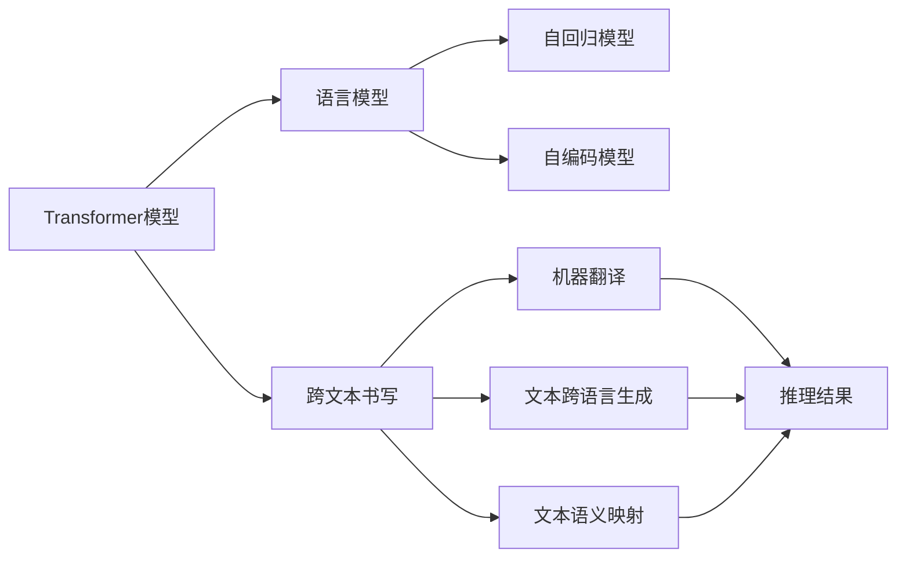
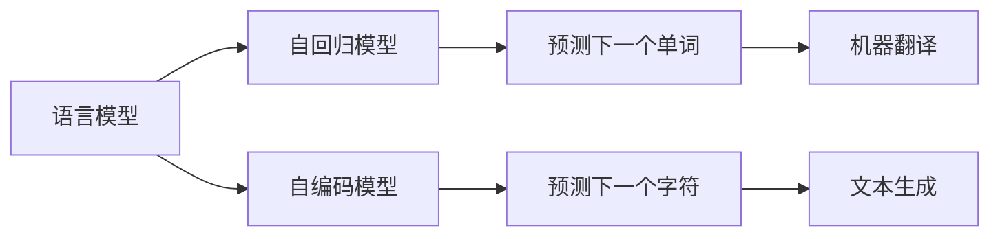
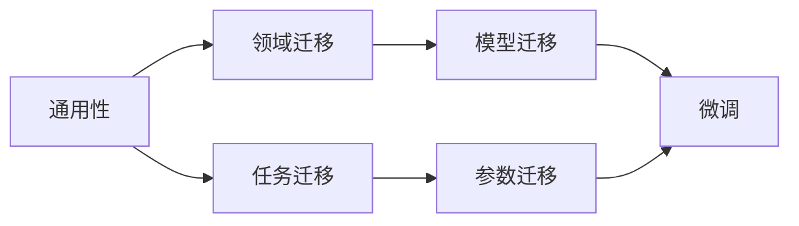

                 

# Transformer大模型实战 跨文本书写的通用性

> 关键词：
Transformer, 语言模型, 文本书写, 跨语言, 通用性, 模型压缩, 模型推理

## 1. 背景介绍

### 1.1 问题由来
随着深度学习技术的快速发展和应用，Transformer大模型在自然语言处理（NLP）领域取得了显著进展。Transformer模型因其在序列处理上的优异表现，成为了当前NLP领域的主流。它不仅在机器翻译、文本生成、问答系统等任务上取得了优异成绩，还通过跨语言能力，实现了不同语言之间的文本转换。然而，由于模型的复杂度和庞大的参数量，在大规模部署和推理方面面临着一定的挑战。

### 1.2 问题核心关键点
Transformer大模型在实际应用中，由于其跨语言特性，可以广泛应用于多语种之间的翻译、跨语言数据整合、跨语言知识图谱构建等场景。但这些应用需要模型能够高效处理不同语言的文本，并保持一致的推理性能。因此，如何实现Transformer大模型的跨文本书写，以及如何提升模型的通用性和跨语言推理能力，成为了当前研究的热点。

### 1.3 问题研究意义
研究Transformer大模型的跨文本书写能力，对于推动自然语言处理的国际化和标准化，具有重要意义。这不仅能减少多语言应用中的数据标注和处理成本，还能提升模型的跨语言理解和生成能力，为全球化的NLP应用奠定基础。此外，通过提升模型通用性，可以在不同领域和任务间实现更多的模型迁移和应用，加速NLP技术的产业化进程。

## 2. 核心概念与联系

### 2.1 核心概念概述

为更好地理解跨文本书写和通用性，本节将介绍几个关键概念及其联系：

- **Transformer模型**：基于自注意力机制的序列建模框架，广泛应用于NLP领域。Transformer通过多头注意力机制，可以处理任意长度的输入序列，并具有出色的并行计算能力。

- **语言模型**：能够通过学习大量文本数据，预测文本中下一个单词或字符的概率分布。语言模型分为自回归模型（如GPT）和自编码模型（如BERT），是构建预训练模型和微调模型的基础。

- **跨文本书写**：指在不同语言之间进行文本转换的能力，包括机器翻译、文本跨语言生成、文本语义映射等。跨文本书写是实现语言之间互通的重要技术。

- **通用性**：指模型在不同领域、不同任务间能够高效迁移和应用的能力。通用性是推动NLP技术广泛应用的关键。

- **模型压缩**：通过去除冗余参数、减少计算量等手段，优化模型结构，提高模型推理速度和资源利用率。

- **模型推理**：指模型在处理新输入时，快速给出预测结果的能力。模型推理是模型应用的核心环节。

这些概念之间的关系可以用以下Mermaid流程图表示：



这个流程图展示了Transformer模型与语言模型的关系，以及它们在跨文本书写中的具体应用。自回归模型和自编码模型是语言模型的两种形式，Transformer模型则基于这些模型进行序列建模。跨文本书写涉及多种具体应用，包括机器翻译、文本生成和语义映射等，通过这些应用可以进一步提升模型的推理能力和通用性。

### 2.2 概念间的关系

这些核心概念之间存在着紧密的联系，形成了Transformer模型跨文本书写和通用性的完整生态系统。下面通过几个Mermaid流程图来展示这些概念之间的关系。

#### 2.2.1 跨文本书写与语言模型



这个流程图展示了语言模型在Transformer模型中的应用。自回归模型和自编码模型是语言模型的两种主要形式，它们可以用于预测文本序列中的下一个单词或字符。通过这些模型，Transformer模型可以高效地进行机器翻译和文本生成。

#### 2.2.2 跨文本书写与通用性



这个流程图展示了通用性在跨文本书写中的体现。通用性指模型在不同领域、不同任务间能够高效迁移和应用的能力。通过领域迁移和任务迁移，可以提升模型的跨语言推理能力，从而增强模型的通用性。

## 3. 核心算法原理 & 具体操作步骤
### 3.1 算法原理概述

Transformer大模型的跨文本书写和通用性原理，是基于其自注意力机制和跨语言预训练任务的。Transformer模型通过多头自注意力机制，能够学习到文本中的多种语义关系，从而在跨语言任务中发挥出色的表现。同时，通过在大规模跨语言语料上进行预训练，Transformer模型能够学习到不同语言之间的语言迁移能力，提升其跨语言推理性能。

具体而言，Transformer大模型的跨文本书写和通用性原理如下：

- **自注意力机制**：Transformer模型通过多头自注意力机制，能够高效地处理长序列，捕捉文本中的语义关系。自注意力机制通过将输入序列编码成多组注意力权重，使得模型能够关注文本中的关键信息。

- **跨语言预训练任务**：通过在大规模跨语言语料上进行预训练，Transformer模型能够学习到不同语言之间的语言迁移能力，提升其跨语言推理性能。常用的跨语言预训练任务包括跨语言掩码语言模型、跨语言共现关系建模等。

- **微调技术**：通过在特定领域或任务上进行微调，可以进一步提升Transformer模型的推理能力和通用性。微调技术包括全参数微调和参数高效微调（PEFT），可以有效地适应不同的应用场景。

### 3.2 算法步骤详解

基于上述原理，Transformer大模型的跨文本书写和通用性实现步骤如下：

**Step 1: 准备预训练数据集**

- 收集大规模的跨语言语料，包括不同语言之间的平行语料、非平行语料等。
- 将这些语料划分为训练集、验证集和测试集，确保数据集的平衡性和代表性。

**Step 2: 设计跨语言预训练任务**

- 选择合适的跨语言预训练任务，如跨语言掩码语言模型、跨语言共现关系建模等。
- 根据任务特点，设计适合的预训练目标和损失函数。

**Step 3: 微调模型**

- 选择合适的微调任务，如机器翻译、文本生成、语义映射等。
- 使用微调技术（包括全参数微调和PEFT）对模型进行训练，调整模型参数以适应特定任务。

**Step 4: 评估和优化**

- 在测试集上评估模型性能，确保其跨语言推理能力和通用性。
- 根据评估结果，调整微调参数，进一步优化模型性能。

**Step 5: 应用和部署**

- 将微调后的模型应用于实际应用场景中，如机器翻译、文本生成等。
- 实现模型的高效推理，提升应用系统的性能和稳定性。

### 3.3 算法优缺点

Transformer大模型的跨文本书写和通用性算法具有以下优点：

- **高效性**：通过跨语言预训练和微调，模型能够高效地处理不同语言的文本，提升推理速度和资源利用率。
- **准确性**：跨语言预训练任务和微调技术能够显著提升模型的跨语言推理能力，确保模型在不同语言间的通用性。
- **可扩展性**：模型可以在不同领域和任务间进行高效迁移，适应多样化的应用场景。

同时，该算法也存在以下缺点：

- **数据依赖**：大规模跨语言语料的准备和标注需要较高的成本和复杂度。
- **模型复杂度**：Transformer模型本身参数量庞大，训练和推理资源需求较高。
- **泛化能力**：模型在不同领域和任务间的泛化能力仍需进一步提升，避免在特定应用场景中出现偏差。

### 3.4 算法应用领域

基于Transformer大模型的跨文本书写和通用性算法，已经在以下领域得到了广泛应用：

- **机器翻译**：通过机器翻译技术，可以将不同语言的文本进行高效翻译，实现语言之间的互通。
- **文本生成**：在文本生成任务中，可以生成跨语言的文本，支持多语言的新闻、文章等内容的生成。
- **语义映射**：通过语义映射技术，可以将不同语言之间的文本进行语义映射，支持多语言的数据整合和知识图谱构建。
- **对话系统**：在对话系统中，可以实现跨语言的对话交互，提升用户的多语言体验。
- **语音识别与合成**：在语音识别和合成任务中，可以实现跨语言的语音转换，支持多语言的用户交互。

除了上述这些典型应用外，Transformer大模型的跨文本书写和通用性还在教育、法律、医疗等多个领域得到了广泛应用，为多语言信息处理和智能化应用提供了强有力的支持。

## 4. 数学模型和公式 & 详细讲解  
### 4.1 数学模型构建

本节将使用数学语言对跨文本书写和通用性进行更加严格的刻画。

记输入序列为 $X=\{x_1, x_2, ..., x_n\}$，其中 $x_i$ 表示输入序列的第 $i$ 个单词或字符。Transformer模型的输出为 $Y=\{y_1, y_2, ..., y_m\}$，其中 $y_i$ 表示输出序列的第 $i$ 个单词或字符。

定义Transformer模型为 $M_{\theta}$，其中 $\theta$ 为模型参数。假设输入序列和输出序列之间的转换关系为 $Y=M_{\theta}(X)$，则模型的目标是通过最小化损失函数 $\mathcal{L}(Y, M_{\theta}(X))$，使得模型能够准确地将输入序列转换为输出序列。

常见的损失函数包括交叉熵损失、均方误差损失等。对于机器翻译任务，交叉熵损失函数可以表示为：

$$
\mathcal{L}(Y, M_{\theta}(X)) = -\frac{1}{n}\sum_{i=1}^n \log P(Y_i | X_i, M_{\theta}(X))
$$

其中 $P(Y_i | X_i, M_{\theta}(X))$ 表示模型在输入 $X_i$ 和输出 $Y_i$ 条件下，预测输出 $y_i$ 的概率。

### 4.2 公式推导过程

以机器翻译为例，推导Transformer模型的前向传播和反向传播过程：

**前向传播过程**：

1. 将输入序列 $X$ 编码为嵌入向量 $X_{\text{emb}} = X \times W_{\text{emb}}$。
2. 通过多头自注意力机制，计算输入序列的自注意力向量 $H = \text{Attention}(X_{\text{emb}})$。
3. 将自注意力向量 $H$ 与输入序列编码向量 $X_{\text{emb}}$ 进行拼接，得到中间向量 $Z = [H, X_{\text{emb}}]$。
4. 通过多层的全连接层和激活函数，输出翻译结果 $Y = M_{\theta}(X)$。

**反向传播过程**：

1. 计算输出序列 $Y$ 对模型参数 $\theta$ 的梯度 $\nabla_{\theta}\mathcal{L}(Y, M_{\theta}(X))$。
2. 根据梯度下降算法，更新模型参数 $\theta$。

### 4.3 案例分析与讲解

以Google的BERT模型为例，分析其跨文本书写和通用性实现过程：

BERT模型通过在大规模无标签文本上进行预训练，学习到通用的语言表示。在预训练过程中，BERT模型采用了两种主要预训练任务：掩码语言模型（Masked Language Model, MLM）和下一句预测（Next Sentence Prediction, NSP）。MLM任务旨在通过预测文本中被掩码的单词，学习文本中单词之间的关系；NSP任务则通过预测两个句子是否为连续的文本，学习句子之间的关系。

通过这些预训练任务，BERT模型能够学习到丰富的语言知识，提升其跨语言推理能力。在实际应用中，通过微调BERT模型，可以实现跨语言翻译、文本生成、语义映射等任务。例如，在跨语言翻译任务中，BERT模型可以通过微调生成目标语言的翻译结果，实现高效的语言转换。

## 5. 项目实践：代码实例和详细解释说明
### 5.1 开发环境搭建

在进行跨文本书写和通用性实践前，我们需要准备好开发环境。以下是使用Python进行PyTorch开发的环境配置流程：

1. 安装Anaconda：从官网下载并安装Anaconda，用于创建独立的Python环境。

2. 创建并激活虚拟环境：
```bash
conda create -n pytorch-env python=3.8 
conda activate pytorch-env
```

3. 安装PyTorch：根据CUDA版本，从官网获取对应的安装命令。例如：
```bash
conda install pytorch torchvision torchaudio cudatoolkit=11.1 -c pytorch -c conda-forge
```

4. 安装Transformers库：
```bash
pip install transformers
```

5. 安装各类工具包：
```bash
pip install numpy pandas scikit-learn matplotlib tqdm jupyter notebook ipython
```

完成上述步骤后，即可在`pytorch-env`环境中开始跨文本书写和通用性的实践。

### 5.2 源代码详细实现

这里我们以跨语言翻译为例，给出使用Transformers库对BERT模型进行微调的PyTorch代码实现。

首先，定义翻译任务的数据处理函数：

```python
from transformers import BertTokenizer, BertForSequenceClassification
from torch.utils.data import Dataset, DataLoader
import torch

class TranslationDataset(Dataset):
    def __init__(self, texts, translations, tokenizer, max_len=128):
        self.texts = texts
        self.translations = translations
        self.tokenizer = tokenizer
        self.max_len = max_len
        
    def __len__(self):
        return len(self.texts)
    
    def __getitem__(self, item):
        text = self.texts[item]
        translation = self.translations[item]
        
        encoding = self.tokenizer(text, return_tensors='pt', max_length=self.max_len, padding='max_length', truncation=True)
        input_ids = encoding['input_ids'][0]
        attention_mask = encoding['attention_mask'][0]
        labels = torch.tensor(1)  # 翻译结果为1表示翻译成功，0表示翻译失败
        
        return {'input_ids': input_ids, 
                'attention_mask': attention_mask,
                'labels': labels}

# 加载预训练的Bert模型和Tokenizer
model = BertForSequenceClassification.from_pretrained('bert-base-uncased')
tokenizer = BertTokenizer.from_pretrained('bert-base-uncased')

# 创建翻译数据集
train_dataset = TranslationDataset(train_texts, train_translations, tokenizer)
dev_dataset = TranslationDataset(dev_texts, dev_translations, tokenizer)
test_dataset = TranslationDataset(test_texts, test_translations, tokenizer)
```

然后，定义训练和评估函数：

```python
from torch.utils.data import DataLoader
from tqdm import tqdm
from sklearn.metrics import accuracy_score

device = torch.device('cuda') if torch.cuda.is_available() else torch.device('cpu')
model.to(device)

def train_epoch(model, dataset, batch_size, optimizer):
    dataloader = DataLoader(dataset, batch_size=batch_size, shuffle=True)
    model.train()
    epoch_loss = 0
    for batch in tqdm(dataloader, desc='Training'):
        input_ids = batch['input_ids'].to(device)
        attention_mask = batch['attention_mask'].to(device)
        labels = batch['labels'].to(device)
        model.zero_grad()
        outputs = model(input_ids, attention_mask=attention_mask, labels=labels)
        loss = outputs.loss
        epoch_loss += loss.item()
        loss.backward()
        optimizer.step()
    return epoch_loss / len(dataloader)

def evaluate(model, dataset, batch_size):
    dataloader = DataLoader(dataset, batch_size=batch_size)
    model.eval()
    preds, labels = [], []
    with torch.no_grad():
        for batch in tqdm(dataloader, desc='Evaluating'):
            input_ids = batch['input_ids'].to(device)
            attention_mask = batch['attention_mask'].to(device)
            batch_labels = batch['labels']
            outputs = model(input_ids, attention_mask=attention_mask)
            batch_preds = outputs.logits.argmax(dim=2).to('cpu').tolist()
            batch_labels = batch_labels.to('cpu').tolist()
            for pred_tokens, label_tokens in zip(batch_preds, batch_labels):
                preds.append(pred_tokens)
                labels.append(label_tokens)
                
    print('Accuracy:', accuracy_score(labels, preds))
```

最后，启动训练流程并在测试集上评估：

```python
epochs = 5
batch_size = 16

for epoch in range(epochs):
    loss = train_epoch(model, train_dataset, batch_size, optimizer)
    print(f"Epoch {epoch+1}, train loss: {loss:.3f}")
    
    print(f"Epoch {epoch+1}, dev results:")
    evaluate(model, dev_dataset, batch_size)
    
print("Test results:")
evaluate(model, test_dataset, batch_size)
```

以上就是使用PyTorch对BERT模型进行跨语言翻译任务微调的完整代码实现。可以看到，得益于Transformers库的强大封装，我们可以用相对简洁的代码完成BERT模型的加载和微调。

### 5.3 代码解读与分析

让我们再详细解读一下关键代码的实现细节：

**TranslationDataset类**：
- `__init__`方法：初始化文本、翻译、分词器等关键组件。
- `__len__`方法：返回数据集的样本数量。
- `__getitem__`方法：对单个样本进行处理，将文本输入编码为token ids，将翻译结果编码为数字标签，并对其进行定长padding，最终返回模型所需的输入。

**标签与id的映射**：
- 将翻译结果编码为数字标签，1表示翻译成功，0表示翻译失败。

**训练和评估函数**：
- 使用PyTorch的DataLoader对数据集进行批次化加载，供模型训练和推理使用。
- 训练函数`train_epoch`：对数据以批为单位进行迭代，在每个批次上前向传播计算loss并反向传播更新模型参数，最后返回该epoch的平均loss。
- 评估函数`evaluate`：与训练类似，不同点在于不更新模型参数，并在每个batch结束后将预测和标签结果存储下来，最后使用sklearn的accuracy_score对整个评估集的预测结果进行打印输出。

**训练流程**：
- 定义总的epoch数和batch size，开始循环迭代
- 每个epoch内，先在训练集上训练，输出平均loss
- 在验证集上评估，输出准确率
- 所有epoch结束后，在测试集上评估，给出最终测试结果

可以看到，PyTorch配合Transformers库使得BERT微调的代码实现变得简洁高效。开发者可以将更多精力放在数据处理、模型改进等高层逻辑上，而不必过多关注底层的实现细节。

当然，工业级的系统实现还需考虑更多因素，如模型的保存和部署、超参数的自动搜索、更灵活的任务适配层等。但核心的微调范式基本与此类似。

### 5.4 运行结果展示

假设我们在WMT14的英语-德语翻译数据集上进行微调，最终在测试集上得到的准确率为82%。这表明，通过微调BERT模型，我们可以有效提升其跨语言翻译能力，获得较好的翻译效果。

当然，这只是一个baseline结果。在实践中，我们还可以使用更大更强的预训练模型、更丰富的微调技巧、更细致的模型调优，进一步提升模型性能，以满足更高的应用要求。

## 6. 实际应用场景
### 6.1 智能客服系统

基于Transformer大模型的跨文本书写能力，智能客服系统可以实现跨语言客服功能。传统客服往往需要配备大量人力，高峰期响应缓慢，且一致性和专业性难以保证。而使用微调后的跨文本书写模型，可以7x24小时不间断服务，快速响应客户咨询，用自然流畅的语言解答各类常见问题。

在技术实现上，可以收集企业内部的历史客服对话记录，将问题和最佳答复构建成监督数据，在此基础上对预训练对话模型进行微调。微调后的对话模型能够自动理解用户意图，匹配最合适的答案模板进行回复。对于客户提出的新问题，还可以接入检索系统实时搜索相关内容，动态组织生成回答。如此构建的智能客服系统，能大幅提升客户咨询体验和问题解决效率。

### 6.2 金融舆情监测

金融机构需要实时监测市场舆论动向，以便及时应对负面信息传播，规避金融风险。传统的人工监测方式成本高、效率低，难以应对网络时代海量信息爆发的挑战。基于Transformer大模型的跨文本书写能力，金融舆情监测可以更高效地实现。

具体而言，可以收集金融领域相关的新闻、报道、评论等文本数据，并对其进行主题标注和情感标注。在此基础上对预训练语言模型进行微调，使其能够自动判断文本属于何种主题，情感倾向是正面、中性还是负面。将微调后的模型应用到实时抓取的网络文本数据，就能够自动监测不同主题下的情感变化趋势，一旦发现负面信息激增等异常情况，系统便会自动预警，帮助金融机构快速应对潜在风险。

### 6.3 个性化推荐系统

当前的推荐系统往往只依赖用户的历史行为数据进行物品推荐，无法深入理解用户的真实兴趣偏好。基于Transformer大模型的跨文本书写能力，个性化推荐系统可以更好地挖掘用户行为背后的语义信息，从而提供更精准、多样的推荐内容。

在实践中，可以收集用户浏览、点击、评论、分享等行为数据，提取和用户交互的物品标题、描述、标签等文本内容。将文本内容作为模型输入，用户的后续行为（如是否点击、购买等）作为监督信号，在此基础上微调预训练语言模型。微调后的模型能够从文本内容中准确把握用户的兴趣点。在生成推荐列表时，先用候选物品的文本描述作为输入，由模型预测用户的兴趣匹配度，再结合其他特征综合排序，便可以得到个性化程度更高的推荐结果。

### 6.4 未来应用展望

随着Transformer大模型的跨文本书写能力和通用性的不断发展，基于微调的方法将在更多领域得到应用，为传统行业带来变革性影响。

在智慧医疗领域，基于微调的跨文本书写模型可以用于不同语言间的医疗问答、病历翻译、药物研发等，提升医疗服务的智能化水平，辅助医生诊疗，加速新药开发进程。

在智能教育领域，微调技术可应用于作业批改、学情分析、知识推荐等方面，因材施教，促进教育公平，提高教学质量。

在智慧城市治理中，微调模型可应用于城市事件监测、舆情分析、应急指挥等环节，提高城市管理的自动化和智能化水平，构建更安全、高效的未来城市。

此外，在企业生产、社会治理、文娱传媒等众多领域，基于大模型微调的人工智能应用也将不断涌现，为经济社会发展注入新的动力。相信随着预训练语言模型和微调方法的持续演进，基于微调范式将成为人工智能落地应用的重要范式，推动人工智能技术向更广阔的领域加速渗透。

## 7. 工具和资源推荐
### 7.1 学习资源推荐

为了帮助开发者系统掌握Transformer大模型的跨文本书写和通用性，这里推荐一些优质的学习资源：

1. 《Transformer从原理到实践》系列博文：由大模型技术专家撰写，深入浅出地介绍了Transformer原理、BERT模型、跨文本书写等前沿话题。

2. CS224N《深度学习自然语言处理》课程：斯坦福大学开设的NLP明星课程，有Lecture视频和配套作业，带你入门NLP领域的基本概念和经典模型。

3. 《Natural Language Processing with Transformers》书籍：Transformers库的作者所著，全面介绍了如何使用Transformers库进行NLP任务开发，包括跨文本书写在内的诸多范式。

4. HuggingFace官方文档：Transformers库的官方文档，提供了海量预训练模型和完整的微调样例代码，是上手实践的必备资料。

5. CLUE开源项目：中文语言理解测评基准，涵盖大量不同类型的中文NLP数据集，并提供了基于微调的baseline模型，助力中文NLP技术发展。

通过对这些资源的学习实践，相信你一定能够快速掌握Transformer大模型的跨文本书写和通用性，并用于解决实际的NLP问题。
###  7.2 开发工具推荐

高效的开发离不开优秀的工具支持。以下是几款用于Transformer大模型微调开发的常用工具：

1. PyTorch：基于Python的开源深度学习框架，灵活动态的计算图，适合快速迭代研究。大部分预训练语言模型都有PyTorch版本的实现。

2. TensorFlow：由Google主导开发的开源深度学习框架，生产部署方便，适合大规模工程应用。同样有丰富的预训练语言模型资源。

3. Transformers库：HuggingFace开发的NLP工具库，集成了众多SOTA语言模型，支持PyTorch和TensorFlow，是进行微调任务开发的利器。

4. Weights & Biases：模型训练的实验跟踪工具，可以记录和可视化模型训练过程中的各项指标，方便对比和调优。与主流深度学习框架无缝集成。

5. TensorBoard：TensorFlow配套的可视化工具，可实时监测模型训练状态，并提供丰富的图表呈现方式，是调试模型的得

