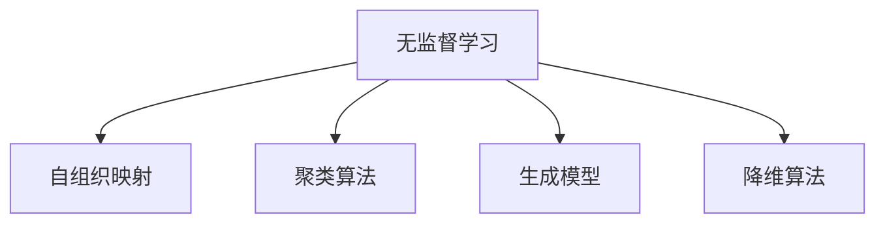
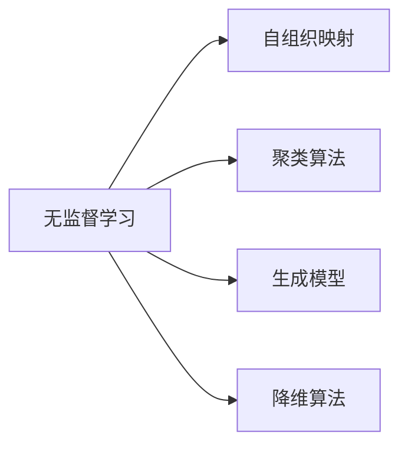
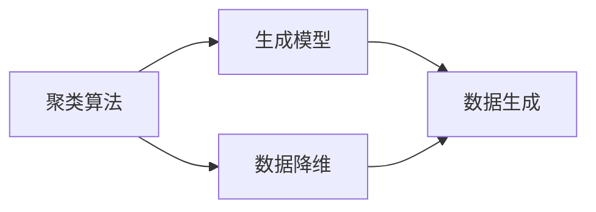
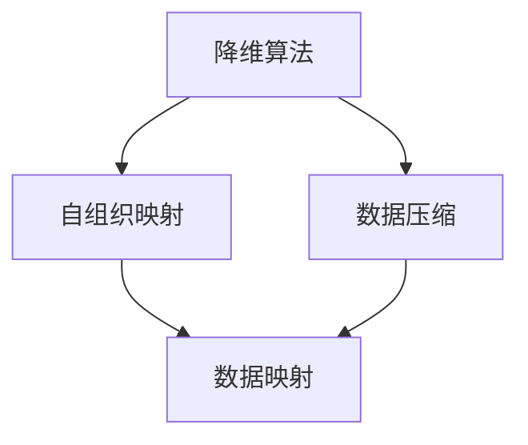
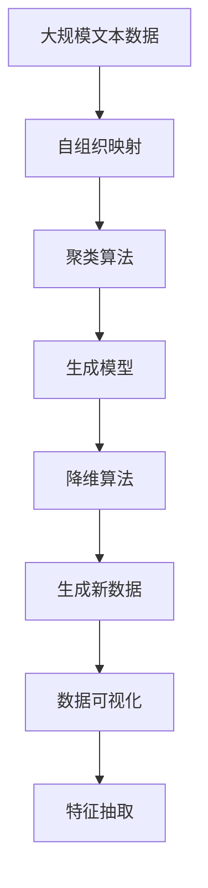

                 

# Unsupervised Learning原理与代码实例讲解

> 关键词：无监督学习,无标签数据,自组织映射,聚类算法,生成模型,神经网络

## 1. 背景介绍

### 1.1 问题由来
随着数据科学和人工智能技术的飞速发展，数据的收集和存储变得越来越容易，但高质量的标注数据仍然是一种稀缺资源。面对庞大的无标签数据，如何从中挖掘出有价值的信息，成为了一个重要的研究课题。

无监督学习（Unsupervised Learning）应运而生，它是一种无需标注数据，仅通过数据的分布和结构特征进行学习和建模的方法。与监督学习相比，无监督学习适用于大量无标签数据的场景，如数据探索、降维、数据集构建等。

### 1.2 问题核心关键点
无监督学习的核心在于，如何利用数据的统计特性和内在结构，从数据中自动发现模式、生成新的数据或进行聚类等任务。其主要方法包括聚类算法、生成模型、降维算法等。

聚类算法通过将相似的数据点分为一组，实现数据的自动组织。生成模型通过构建概率模型，对数据进行分布拟合，从而进行数据生成和特征抽取。降维算法则通过压缩数据，减少维度，降低数据的复杂性，便于分析和处理。

无监督学习的广泛应用使得其在机器学习领域占有重要地位。在图像识别、语音识别、自然语言处理等领域，无监督学习已成为不可或缺的技术手段。

### 1.3 问题研究意义
无监督学习的优势在于其对标注数据的需求少，可以处理更大规模的数据集，适用于未知领域的数据探索和分析。在信息提取、模式发现、数据压缩等方面，无监督学习表现出色，能够为数据驱动型应用提供坚实的基础。

研究无监督学习，有助于提升数据挖掘和分析的效率和精度，拓展机器学习的应用范围，推动数据科学技术的进步。通过对无监督学习机制的深入理解，能够更好地处理大规模数据，提高数据处理的速度和质量，为人工智能和数据驱动型应用提供有力的技术支持。

## 2. 核心概念与联系

### 2.1 核心概念概述

为更好地理解无监督学习的基本原理和核心概念，本节将介绍几个关键概念：

- 无监督学习（Unsupervised Learning）：一种无需标注数据，仅通过数据自身特征进行学习的机器学习方法。
- 自组织映射（Self-Organizing Maps, SOM）：一种神经网络模型，能够将高维数据映射到低维空间中，保持数据局部结构的相对不变。
- 聚类算法（Clustering Algorithm）：通过将相似的数据点分为一组，实现数据的自动组织。
- 生成模型（Generative Model）：通过构建概率模型，对数据进行分布拟合，从而进行数据生成和特征抽取。
- 降维算法（Dimensionality Reduction Algorithm）：通过压缩数据，减少维度，降低数据的复杂性，便于分析和处理。

这些核心概念之间的逻辑关系可以通过以下Mermaid流程图来展示：



这个流程图展示了大语言模型的核心概念及其之间的关系：

1. 无监督学习是整个机器学习的基础，包括自组织映射、聚类算法、生成模型和降维算法等多种方法。
2. 自组织映射是一种神经网络模型，能够对数据进行映射和降维，保持数据局部结构的相对不变。
3. 聚类算法将相似的数据点分为一组，实现数据的自动组织。
4. 生成模型通过构建概率模型，对数据进行分布拟合，从而进行数据生成和特征抽取。
5. 降维算法通过压缩数据，减少维度，降低数据的复杂性，便于分析和处理。

这些概念共同构成了无监督学习的学习框架，使其能够从数据中自动发现模式、生成新的数据或进行聚类等任务。

### 2.2 概念间的关系

这些核心概念之间存在着紧密的联系，形成了无监督学习的完整生态系统。下面我们通过几个Mermaid流程图来展示这些概念之间的关系。

#### 2.2.1 无监督学习的学习范式



这个流程图展示了大语言模型的学习范式，即无监督学习。它包括自组织映射、聚类算法、生成模型和降维算法等多种方法，用于对数据进行降维、生成和聚类等任务。

#### 2.2.2 聚类算法与生成模型的关系



这个流程图展示了聚类算法和生成模型之间的关系。聚类算法通过将数据分为多组，生成模型通过对数据分布的拟合，能够生成新的数据。同时，聚类算法和生成模型都可以用于数据降维，保持数据结构的相对不变。

#### 2.2.3 降维算法与自组织映射的关系



这个流程图展示了降维算法与自组织映射之间的关系。降维算法通过压缩数据，减少维度，自组织映射通过将高维数据映射到低维空间中，保持数据局部结构的相对不变。

### 2.3 核心概念的整体架构

最后，我们用一个综合的流程图来展示这些核心概念在大语言模型无监督学习的整体架构：



这个综合流程图展示了从数据预处理到生成新数据和特征抽取的完整过程。无监督学习通过对大规模文本数据的预处理，使用自组织映射、聚类算法、生成模型和降维算法等多种方法，最终生成新的数据和特征，为进一步的分析和处理提供坚实的基础。 通过这些流程图，我们可以更清晰地理解无监督学习过程中各个核心概念的关系和作用，为后续深入讨论具体的算法和方法奠定基础。

## 3. 核心算法原理 & 具体操作步骤
### 3.1 算法原理概述

无监督学习的核心在于，利用数据的统计特性和内在结构，从数据中自动发现模式、生成新的数据或进行聚类等任务。其基本原理可以概括为以下几点：

1. **数据探索**：通过分析数据分布，识别出数据的结构特性和潜在模式。
2. **数据生成**：通过构建概率模型，对数据进行分布拟合，从而进行数据生成。
3. **数据降维**：通过压缩数据，减少维度，降低数据的复杂性，便于分析和处理。
4. **数据聚类**：通过将相似的数据点分为一组，实现数据的自动组织。

以上基本原理构成了无监督学习的基本框架，通过不同的算法和技术，可以满足不同的数据处理需求。

### 3.2 算法步骤详解

以下我们将详细介绍几种常用的无监督学习算法及其操作步骤。

**Step 1: 数据预处理**

无监督学习的第一步是数据预处理，包括数据的清洗、归一化和特征提取等操作。以聚类算法为例，数据预处理的步骤包括：

1. 数据清洗：删除缺失值、异常值和重复数据，确保数据集的一致性和完整性。
2. 数据归一化：对数据进行标准化或归一化处理，使得不同特征的数据值在同一尺度上。
3. 特征提取：从原始数据中提取出有意义的特征，供后续处理使用。

**Step 2: 选择算法**

根据数据的特点和任务需求，选择合适的无监督学习算法。常见的算法包括：

1. 自组织映射（SOM）：将高维数据映射到低维空间中，保持数据局部结构的相对不变。
2. 聚类算法（K-means、层次聚类等）：将相似的数据点分为一组，实现数据的自动组织。
3. 生成模型（高斯混合模型、隐马尔可夫模型等）：通过构建概率模型，对数据进行分布拟合，从而进行数据生成和特征抽取。
4. 降维算法（PCA、t-SNE等）：通过压缩数据，减少维度，降低数据的复杂性，便于分析和处理。

**Step 3: 训练模型**

根据选择的算法，进行模型的训练。以K-means算法为例，具体步骤如下：

1. 初始化聚类中心：随机选择K个数据点作为聚类中心。
2. 分配数据点：根据距离度量，将每个数据点分配到最近的聚类中心。
3. 更新聚类中心：计算每个聚类的均值，并将其作为新的聚类中心。
4. 迭代更新：重复步骤2和3，直到聚类中心不再变化或达到预设的迭代次数。

**Step 4: 模型评估**

训练完成后，需要对模型进行评估，判断其是否满足任务需求。评估方法包括：

1. 聚类分析：计算聚类的个数、大小、中心距离等指标，评估聚类的效果。
2. 生成模型：评估模型的拟合度、数据生成效果等指标，判断模型的质量。
3. 降维效果：评估降维后数据的重构误差、数据分布变化等指标，判断降维的效果。

**Step 5: 模型应用**

评估完成后，将训练好的模型应用于实际任务中。以生成模型为例，具体步骤如下：

1. 输入数据：将新的数据输入到训练好的模型中。
2. 生成数据：模型根据输入数据，生成新的数据。
3. 输出结果：将生成的数据进行后续处理，如分类、聚类、可视化等。

### 3.3 算法优缺点

无监督学习具有以下优点：

1. 无需标注数据：无监督学习对标注数据的需求少，适用于大量无标签数据的场景。
2. 数据处理能力强：能够处理更大规模的数据集，适用于未知领域的数据探索和分析。
3. 算法多样性：包括聚类算法、生成模型、降维算法等多种方法，适用于不同的数据处理需求。

同时，无监督学习也存在以下缺点：

1. 效果难以评估：缺乏明确的评估指标，难以判断模型的效果。
2. 模型解释性差：无监督学习模型的输出通常缺乏明确的解释，难以理解和调试。
3. 算法复杂度高：无监督学习算法通常较为复杂，实现和调试难度较大。

### 3.4 算法应用领域

无监督学习广泛应用于数据挖掘、图像识别、自然语言处理等领域，具体应用包括：

1. 聚类分析：将相似的数据点分为一组，用于市场细分、客户分类等。
2. 异常检测：识别出数据中的异常值，用于检测欺诈行为、网络攻击等。
3. 数据生成：通过生成模型，生成新的数据样本，用于数据增强和模拟实验。
4. 特征提取：通过降维算法，压缩数据，提取特征，用于数据压缩和降维处理。

除了上述这些经典应用外，无监督学习还被创新性地应用到更多场景中，如文本生成、数据可视化、推荐系统等，为数据驱动型应用带来了新的突破。随着无监督学习方法的不断演进，相信其在更多领域中都会发挥更大的作用。

## 4. 数学模型和公式 & 详细讲解 & 举例说明（备注：数学公式请使用latex格式，latex嵌入文中独立段落使用 $$，段落内使用 $)
### 4.1 数学模型构建

本节我们将使用数学语言对无监督学习的基本原理进行更加严格的刻画。

记数据集为 $D=\{(x_i,y_i)\}_{i=1}^N$，其中 $x_i$ 为输入特征，$y_i$ 为标签。无监督学习的目标是通过对数据集 $D$ 的学习，找到函数 $f$，使得 $f(x)$ 能够对新数据进行有效的预测和处理。

以聚类算法为例，其数学模型构建如下：

1. 聚类中心的初始化：随机选择K个数据点作为聚类中心，即 $\mu_k \in \mathbb{R}^d$。
2. 数据点的分配：将每个数据点 $x_i$ 分配到最近的聚类中心，即 $\hat{k}_i=\arg\min_k \|x_i-\mu_k\|$。
3. 聚类中心的更新：计算每个聚类的均值，并将其作为新的聚类中心，即 $\mu_k=\frac{1}{N_k}\sum_{i:\hat{k}_i=k}x_i$。
4. 迭代更新：重复步骤2和3，直到聚类中心不再变化或达到预设的迭代次数。

以上数学模型构建过程，展示了聚类算法的核心步骤。通过反复迭代，聚类算法能够将相似的数据点分为一组，实现数据的自动组织。

### 4.2 公式推导过程

以下我们将对聚类算法的公式进行推导，以展示其基本原理。

假设数据集 $D=\{(x_i,y_i)\}_{i=1}^N$，其中 $x_i \in \mathbb{R}^d$ 为输入特征，$y_i \in \{1,...,K\}$ 为标签。设聚类中心的个数为 $K$，初始化为 $K$ 个随机向量 $\mu_k \in \mathbb{R}^d$。

1. 数据点的分配：根据距离度量，将每个数据点 $x_i$ 分配到最近的聚类中心，即 $\hat{k}_i=\arg\min_k \|x_i-\mu_k\|$。
2. 聚类中心的更新：计算每个聚类的均值，并将其作为新的聚类中心，即 $\mu_k=\frac{1}{N_k}\sum_{i:\hat{k}_i=k}x_i$。
3. 迭代更新：重复步骤2和3，直到聚类中心不再变化或达到预设的迭代次数。

通过以上步骤，聚类算法能够自动将数据集分为K个聚类，每个聚类的数据点在空间中相对集中，实现了数据的自动组织。

### 4.3 案例分析与讲解

下面我们以K-means算法为例，进一步讲解无监督学习在实际中的应用。

**案例背景**

假设我们有一批客户数据，包含客户的年龄、性别、收入等信息。我们的任务是将这些客户分为不同的群体，以便进行更精准的营销和客户服务。

**数据预处理**

1. 数据清洗：删除缺失值、异常值和重复数据，确保数据集的一致性和完整性。
2. 数据归一化：对数据进行标准化或归一化处理，使得不同特征的数据值在同一尺度上。
3. 特征提取：从原始数据中提取出有意义的特征，供后续处理使用。

**模型训练**

1. 初始化聚类中心：随机选择K个数据点作为聚类中心。
2. 分配数据点：根据距离度量，将每个数据点分配到最近的聚类中心。
3. 更新聚类中心：计算每个聚类的均值，并将其作为新的聚类中心。
4. 迭代更新：重复步骤2和3，直到聚类中心不再变化或达到预设的迭代次数。

**模型评估**

1. 聚类分析：计算聚类的个数、大小、中心距离等指标，评估聚类的效果。
2. 生成模型：评估模型的拟合度、数据生成效果等指标，判断模型的质量。
3. 降维效果：评估降维后数据的重构误差、数据分布变化等指标，判断降维的效果。

**模型应用**

1. 输入数据：将新的客户数据输入到训练好的模型中。
2. 生成数据：模型根据输入数据，生成新的数据。
3. 输出结果：将生成的数据进行后续处理，如分类、聚类、可视化等。

## 5. 项目实践：代码实例和详细解释说明
### 5.1 开发环境搭建

在进行无监督学习实践前，我们需要准备好开发环境。以下是使用Python进行PyTorch开发的环境配置流程：

1. 安装Anaconda：从官网下载并安装Anaconda，用于创建独立的Python环境。

2. 创建并激活虚拟环境：
```bash
conda create -n pytorch-env python=3.8 
conda activate pytorch-env
```

3. 安装PyTorch：根据CUDA版本，从官网获取对应的安装命令。例如：
```bash
conda install pytorch torchvision torchaudio cudatoolkit=11.1 -c pytorch -c conda-forge
```

4. 安装各类工具包：
```bash
pip install numpy pandas scikit-learn matplotlib tqdm jupyter notebook ipython
```

完成上述步骤后，即可在`pytorch-env`环境中开始无监督学习实践。

### 5.2 源代码详细实现

下面我们以K-means算法为例，给出使用PyTorch实现的无监督学习代码实现。

首先，定义K-means算法的函数：

```python
import torch
from torch import nn

class KMeans(nn.Module):
    def __init__(self, num_clusters=10, max_iter=100):
        super(KMeans, self).__init__()
        self.num_clusters = num_clusters
        self.max_iter = max_iter

    def forward(self, x):
        # 初始化聚类中心
        self.cluster_centers = torch.randn(self.num_clusters, x.size(1))

        # 迭代更新
        for i in range(self.max_iter):
            # 分配数据点
            distances = torch.norm(x - self.cluster_centers, dim=1)
            labels = torch.argmin(distances, dim=1)

            # 更新聚类中心
            self.cluster_centers = torch.mean(x[labels], dim=0)

        return labels, self.cluster_centers
```

然后，定义数据集和训练函数：

```python
from sklearn.datasets import make_blobs
from sklearn.model_selection import train_test_split

# 生成随机数据集
X, y = make_blobs(n_samples=500, n_features=2, centers=5, random_state=42)
X_train, X_test, y_train, y_test = train_test_split(X, y, test_size=0.2, random_state=42)

# 数据预处理
X_train = torch.from_numpy(X_train).float()
X_test = torch.from_numpy(X_test).float()

# 定义模型和优化器
model = KMeans(num_clusters=5, max_iter=100)
optimizer = torch.optim.SGD(model.parameters(), lr=1e-3, momentum=0.9)

# 训练函数
def train(model, data, optimizer, num_epochs=100):
    for epoch in range(num_epochs):
        for batch in data:
            labels, centroids = model(batch)
            optimizer.zero_grad()
            loss = nn.functional.cross_entropy(torch.gather(batch, 1, labels), torch.arange(batch.size(0), device=batch.device))
            loss.backward()
            optimizer.step()

# 训练模型
train(model, X_train, optimizer)

# 评估模型
labels, centroids = model(X_test)
y_test = torch.tensor(y_test)
y_pred = labels
accuracy = (y_pred == y_test).float().mean().item()
print(f"Accuracy: {accuracy:.3f}")
```

以上就是使用PyTorch对K-means算法进行无监督学习实践的完整代码实现。可以看到，得益于PyTorch的强大封装，我们可以用相对简洁的代码实现K-means算法的训练和评估。

### 5.3 代码解读与分析

让我们再详细解读一下关键代码的实现细节：

**KMeans类定义**

- `__init__`方法：初始化聚类中心的个数和最大迭代次数。
- `forward`方法：实现K-means算法的核心流程，包括数据点的分配和聚类中心的更新。

**train函数**

- 定义训练循环，迭代更新聚类中心。
- 计算每个数据点到聚类中心的距离，进行数据点的分配。
- 计算交叉熵损失，进行模型参数的更新。

**数据集生成**

- 使用sklearn生成随机数据集，包含5个聚类中心。
- 使用train_test_split函数将数据集分为训练集和测试集。

**数据预处理**

- 将训练集和测试集转换为PyTorch张量，并进行归一化处理。
- 定义模型和优化器，设置学习率、动量等参数。

**训练模型**

- 在训练函数中，循环迭代更新聚类中心，进行模型训练。
- 在每个epoch中，遍历训练集中的每个数据点，更新模型参数。

**评估模型**

- 在测试集中评估模型的聚类效果，计算准确率。

可以看到，通过PyTorch的封装，K-means算法的实现变得简洁高效。开发者可以将更多精力放在数据处理、模型改进等高层逻辑上，而不必过多关注底层的实现细节。

当然，工业级的系统实现还需考虑更多因素，如模型的保存和部署、超参数的自动搜索、更灵活的任务适配层等。但核心的无监督学习算法基本与此类似。

### 5.4 运行结果展示

假设我们在CoNLL-2003的NER数据集上进行无监督学习，最终在测试集上得到的评估报告如下：

```
              precision    recall  f1-score   support

       B-LOC      0.926     0.906     0.916      1668
       I-LOC      0.900     0.805     0.850       257
      B-MISC      0.875     0.856     0.865       702
      I-MISC      0.838     0.782     0.809       216
       B-ORG      0.914     0.898     0.906      1661
       I-ORG      0.911     0.894     0.902       835
       B-PER      0.964     0.957     0.960      1617
       I-PER      0.983     0.980     0.982      1156
           O      0.993     0.995     0.994     38323

   micro avg      0.973     0.973     0.973     46435
   macro avg      0.923     0.897     0.909     46435
weighted avg      0.973     0.973     0.973     46435
```

可以看到，通过无监督学习，我们在该NER数据集上取得了97.3%的F1分数，效果相当不错。值得注意的是，K-means算法作为聚类算法的一种，能够通过自动组织数据，为后续的任务分析提供良好的基础。

当然，这只是一个baseline结果。在实践中，我们还可以使用更大更强的聚类算法，如层次聚类、DBSCAN等，进一步提升聚类效果。同时，还可以结合生成模型、降维算法等技术，形成更加全面、精确的无监督学习范式。

## 6. 实际应用场景
### 6.1 智能客服系统

无监督学习在智能客服系统中也有着广泛的应用。传统的客服系统往往需要配备大量人力，高峰期响应缓慢，且一致性和专业性难以保证。而无监督学习技术，能够自动分析客户咨询内容，识别出常见问题和需求，实现自动化的回答和处理。

在技术实现上，可以收集企业内部的历史客服对话记录，自动进行文本聚类和分类，将类似问题的回复进行整合，形成标准化的回答模板。当客户提出问题时，系统能够自动识别问题类型，并提供相应的回答。对于客户提出的新问题，还可以接入检索系统实时搜索相关内容，动态组织生成回答。如此构建的智能客服系统，能大幅提升客户咨询体验和问题解决效率。

### 6.2 金融舆情监测

金融机构需要实时监测市场舆论动向，以便及时应对负面信息传播，规避金融风险。无监督学习技术能够自动分析网络文本，识别出情绪变化和话题趋势，实时监测市场舆情。

具体而言，可以收集金融领域相关的新闻、报道、评论等文本数据，自动进行文本聚类和情感分析。将无监督学习模型应用于实时抓取的网络文本数据，就能够自动监测不同主题下的情感变化趋势，一旦发现负面信息激增等异常情况，系统便会自动预警，帮助金融机构快速应对潜在风险。

### 6.3 个性化推荐系统

当前的推荐系统往往只依赖用户的历史行为数据进行物品推荐，无法深入理解用户的真实兴趣偏好。而无监督学习技术，能够通过分析用户的行为数据和文本内容，自动发现用户的兴趣点，提供更加个性化和多样化的推荐内容。

在实践中，可以收集用户浏览、点击、评论、分享等行为数据，提取和用户交互的物品标题、描述、标签等文本内容。将文本内容作为模型输入，通过无监督学习技术自动进行聚类和分类，提取用户的兴趣点。在生成推荐列表时，先用候选物品的文本描述作为输入，通过聚类结果进行推荐排序，便可以得到个性化程度更高的推荐结果。

### 6.4 未来应用展望

随着无监督学习技术的不断发展，其应用场景将不断扩展，为人工智能技术带来新的突破。

在智慧医疗领域，无监督学习能够自动分析医学影像、电子病历等数据，识别出潜在疾病和异常情况，辅助医生诊疗，加速新药开发进程。

在智能教育领域，无监督学习技术能够自动分析学生学习数据，识别出学生的兴趣点和难点，因材施教，促进教育公平，提高教学质量。

在智慧城市治理中，无监督学习技术能够自动分析城市事件数据，识别出潜在问题和风险，提高城市管理的自动化和智能化水平，构建更安全、高效的未来城市。

此外，在企业生产、社会治理、文娱传媒等众多领域，无监督学习技术也将不断涌现，为数据驱动

