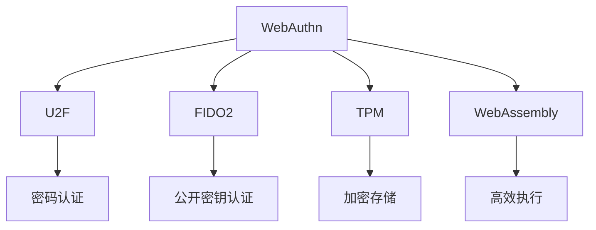

                 

# WebAuthn 的优势

在当前数字化时代，随着在线服务的普及和移动设备的广泛应用，密码学在保证网络安全方面的重要性日益凸显。传统的密码学技术，如密码登录、令牌验证等，已经无法完全满足用户对安全性和便捷性的需求。而 WebAuthn（Web身份认证标准）的提出，正是为了解决这些问题，为用户提供一种更加安全、便捷的认证方式。

本文将全面介绍 WebAuthn 的技术原理和优势，并探讨其在实际应用中的广泛前景。我们将从技术背景、核心概念、算法原理、具体步骤、优缺点等多个维度深入剖析 WebAuthn，并结合实际案例进行分析。

## 1. 背景介绍

### 1.1 问题由来

在过去，用户通过网站或应用进行身份认证时，通常需要输入用户名和密码。这种方式存在诸多问题：

- **易受攻击**：密码容易被猜测、截取或字典攻击，严重影响用户账户安全。
- **不便记忆**：密码长度、复杂度要求高，用户难以记住且容易忘记。
- **跨设备问题**：不同设备上的密码不互通，导致在不同设备上登录困难。

针对这些问题，WebAuthn 提供了统一的认证标准，允许用户在多个设备之间共享同一个认证密钥，从而提高账户安全性，同时提供便捷的跨设备认证体验。

### 1.2 问题核心关键点

WebAuthn 的核心在于通过一种安全的、标准化的方式，允许用户使用硬件身份验证器（如 U2F、FIDO2 密钥等）进行身份认证。WebAuthn 的关键点包括：

- 支持多种认证方式，如密码、指纹、面部识别等。
- 允许用户使用硬件设备进行认证，提升安全性。
- 提供跨设备认证能力，解决跨设备登录问题。

## 2. 核心概念与联系

### 2.1 核心概念概述

为了更好地理解 WebAuthn 的核心概念，下面将详细介绍几个关键概念及其联系。

- **WebAuthn**：Web身份认证标准，旨在提供一种安全、可互操作的身份验证方式。
- **U2F**：双因素身份验证，一种使用 USB 硬件密钥进行身份验证的方式。
- **FIDO2**：快速身份在线（Fast Identity Online），一种基于公共密钥密码学的身份验证协议。
- **TPM**：可信平台模块，一种安全硬件，用于存储和保护加密密钥。
- **WebAssembly**：在 Web 浏览器中运行二进制代码的标准化环境，用于优化 WebAuthn 的执行效率。

这些概念通过 Mermaid 流程图进行展示：



通过这个流程图，可以看出 WebAuthn 与其他身份验证方式之间的联系和差异。

### 2.2 概念间的关系

WebAuthn 与上述概念之间的关系如下：

- WebAuthn 支持 U2F 和 FIDO2，但并不局限于这两种方式，可以基于多种身份验证方式。
- TPM 提供了一个安全的硬件环境，用于存储和管理 WebAuthn 的密钥，增强了认证的安全性。
- WebAssembly 在 Web 浏览器中提供了一个执行二进制代码的环境，用于优化 WebAuthn 的执行效率，尤其是在移动设备上。

## 3. 核心算法原理 & 具体操作步骤

### 3.1 算法原理概述

WebAuthn 的核心算法原理可以概括为以下几个步骤：

1. 用户输入用户名和密码，进行身份验证。
2. 浏览器生成一个随机挑战（Challenge）。
3. 浏览器将挑战发送给用户，用户使用其硬件身份验证器进行签名。
4. 浏览器将签名结果和挑战信息发送给服务器进行验证。
5. 服务器根据签名结果和挑战信息验证用户的身份。

这些步骤通过 WebAuthn 协议进行标准化，确保认证过程的安全和一致性。

### 3.2 算法步骤详解

以下是 WebAuthn 的详细步骤：

1. **用户登录**：用户输入用户名和密码，发起身份验证请求。
2. **浏览器生成挑战**：浏览器随机生成一个挑战（Challenge），发送到服务器。
3. **用户硬件认证**：用户使用其硬件身份验证器（如 USB 密钥、指纹、面部识别等）进行签名，生成签名结果（Signature）。
4. **浏览器发送签名结果**：浏览器将签名结果和挑战信息一起发送到服务器。
5. **服务器验证签名**：服务器使用 WebAuthn 协议解析签名结果，验证其有效性。
6. **服务器生成响应**：服务器根据签名结果和挑战信息，生成响应（AuthenticatorResponse），返回给浏览器。
7. **浏览器完成身份验证**：浏览器根据响应完成身份验证，允许用户访问其账户。

### 3.3 算法优缺点

WebAuthn 的优点：

- **安全性高**：使用硬件设备进行认证，提供双因素认证，增强了安全性。
- **便捷性**：一次认证可以在多个设备上使用，避免了重复输入密码的问题。
- **标准化**：采用标准化协议，兼容性良好，易于在不同浏览器和设备上部署。

WebAuthn 的缺点：

- **硬件成本**：硬件身份验证器的成本较高，限制了在某些场景下的应用。
- **用户体验**：对于不熟悉硬件身份验证器的用户，初次使用体验可能较差。
- **跨设备兼容性**：虽然标准统一，但在不同浏览器和设备上的实现可能存在差异。

### 3.4 算法应用领域

WebAuthn 的应用领域广泛，涵盖了以下几个方面：

- **网站登录**：通过 WebAuthn，用户可以使用硬件身份验证器登录各种网站和应用，提升账户安全性。
- **移动设备认证**：在移动设备上，WebAuthn 提供了便捷的跨设备认证方式，支持多设备登录。
- **企业内部认证**：企业可以采用 WebAuthn 进行员工身份认证，确保内部系统的安全性。
- **第三方应用认证**：WebAuthn 还支持与第三方应用的集成，提供统一的认证解决方案。

## 4. 数学模型和公式 & 详细讲解

### 4.1 数学模型构建

WebAuthn 的数学模型主要涉及以下几个方面：

- **椭圆曲线密码学**：用于生成公私钥对，用于签名验证。
- **哈希算法**：用于生成挑战和签名结果的哈希值。
- **随机数生成**：用于生成挑战和随机数，确保每次认证的独特性。

### 4.2 公式推导过程

假设用户使用椭圆曲线密码学生成的公私钥对为 $P$ 和 $Q$，椭圆曲线为 $E$，则签名过程如下：

1. 随机生成一个私钥 $k$。
2. 计算公钥 $K=kG$，其中 $G$ 为椭圆曲线上的一个点。
3. 计算哈希值 $h=SHA-256(挑战)$。
4. 计算签名 $R=kG$，并计算 $S=k^{-1}(h+R.x)$，其中 $k^{-1}$ 为 $k$ 的逆元。

验证过程如下：

1. 计算哈希值 $h=SHA-256(挑战)$。
2. 计算公钥 $K=R+x$，其中 $R$ 为签名结果，$x$ 为验证器的身份。
3. 验证签名 $k=S^{-1}(h+R.x)$，如果验证通过，则认证成功。

### 4.3 案例分析与讲解

以下是一个具体的应用案例：

假设用户 A 使用 USB 密钥进行认证，其公私钥对为 $P$ 和 $Q$，椭圆曲线为 $E$。当用户 A 登录网站时，步骤如下：

1. 浏览器随机生成一个挑战 $c$，并将其发送到服务器。
2. 用户 A 使用 USB 密钥进行签名，生成签名结果 $R$ 和 $S$。
3. 浏览器将 $R$ 和 $S$ 以及 $c$ 发送到服务器。
4. 服务器根据 $R$ 和 $S$，计算 $k$ 和 $h$，并验证签名是否通过。
5. 如果验证通过，服务器生成响应，允许用户 A 访问其账户。

通过这个案例，可以看出 WebAuthn 如何通过标准化的协议和算法，实现安全、便捷的身份认证。

## 5. 项目实践：代码实例和详细解释说明

### 5.1 开发环境搭建

要进行 WebAuthn 的实践，首先需要搭建开发环境。具体步骤如下：

1. **安装 Node.js**：WebAuthn 依赖 Node.js，因此需要安装最新版本的 Node.js。
2. **安装相关库**：安装 WebAuthn 相关的库，如 `webauthn-duo` 和 `webauthn-trust-broker`。
3. **创建项目**：创建一个新的 Node.js 项目，并初始化项目依赖。
4. **配置环境**：配置环境变量，设置 WebAuthn 相关的选项。

### 5.2 源代码详细实现

以下是一个使用 Node.js 实现 WebAuthn 认证的代码示例：

```javascript
const WebAuthn = require('webauthn-duo');

const credential = {
  publicKey: {
    name: 'example.com',
    userVerification: 'required'
  }
};

const authenticator = new WebAuthn({
  name: 'example.com',
  credential,
  options: {
    challenge: 'example-challenge'
  }
});

authenticator.sign()
  .then(signature => {
    // 将签名结果发送给服务器进行验证
  })
  .catch(err => {
    console.error(err);
  });
```

### 5.3 代码解读与分析

上述代码实现了一个简单的 WebAuthn 认证过程。具体来说：

- `WebAuthn` 是一个 Node.js 库，用于实现 WebAuthn 认证。
- `credential` 对象定义了认证器的公钥和验证选项。
- `authenticator` 对象用于创建认证器，并调用 `sign()` 方法进行签名。
- `sign()` 方法返回签名结果，可以将其发送到服务器进行验证。

### 5.4 运行结果展示

假设服务器验证通过签名结果，返回响应 `AuthenticatorResponse`，则浏览器可以继续完成认证过程，允许用户访问其账户。

## 6. 实际应用场景

### 6.1 网站登录

WebAuthn 在网站登录中的应用非常广泛。用户可以使用硬件身份验证器，如 USB 密钥、指纹等，进行安全登录。这不仅能提升账户安全性，还能避免多次输入密码的繁琐操作。

### 6.2 移动设备认证

在移动设备上，WebAuthn 提供了便捷的跨设备认证方式。用户可以在多个设备上注册和使用同一认证器，实现无缝切换。这对于经常需要在不同设备上登录的用户来说，非常方便。

### 6.3 企业内部认证

企业可以使用 WebAuthn 进行员工身份认证，确保内部系统的安全性。员工可以使用企业发放的硬件设备，进行便捷安全的登录。

### 6.4 第三方应用认证

WebAuthn 还支持与第三方应用的集成，提供统一的认证解决方案。这对于跨应用使用的用户来说，非常有用。

## 7. 工具和资源推荐

### 7.1 学习资源推荐

以下是几个推荐的 WebAuthn 学习资源：

- **WebAuthn 官方文档**：详细介绍了 WebAuthn 的核心概念和协议。
- **FIDO2 Alliance 网站**：提供了关于 FIDO2 的最新动态和技术细节。
- **WebAuthn 入门教程**：由 WebAuthn 社区维护的入门教程，帮助新手快速上手。
- **WebAssembly 入门教程**：介绍了 WebAssembly 的基本概念和应用场景，有助于理解 WebAuthn 的执行效率。

### 7.2 开发工具推荐

以下是几个推荐的 WebAuthn 开发工具：

- **WebAuthn 库**：如 `webauthn-duo` 和 `webauthn-trust-broker`，提供了 WebAuthn 认证的实现。
- **WebAssembly 运行环境**：如 `wasabee`，用于在 Web 浏览器中运行 WebAuthn 认证器。
- **HTML 和 JavaScript 库**：如 `webauthn-polyfill`，提供了 WebAuthn 认证的 polyfill 实现。

### 7.3 相关论文推荐

以下是几篇推荐的 WebAuthn 相关论文：

- **WebAuthn: Secure and Efficient Authentication**：介绍了 WebAuthn 的核心算法和协议。
- **FIDO Alliance 的 Whitepaper**：详细介绍了 FIDO2 的技术细节和应用场景。
- **WebAuthn: A Secure Authentication Protocol for the Web**：探讨了 WebAuthn 的安全性和性能。

## 8. 总结：未来发展趋势与挑战

### 8.1 研究成果总结

WebAuthn 通过标准化的认证协议，实现了安全、便捷的身份认证。其核心在于使用硬件身份验证器进行认证，提升了账户安全性。同时，WebAuthn 提供了跨设备认证能力，解决了不同设备之间的登录问题。

### 8.2 未来发展趋势

未来，WebAuthn 将继续发展和完善，其发展趋势如下：

- **跨平台支持**：WebAuthn 将支持更多的设备和浏览器，提升其应用范围。
- **更多的身份验证方式**：除了硬件设备，WebAuthn 还将支持更多的身份验证方式，如生物识别等。
- **自动化认证**：WebAuthn 将支持自动化认证，实现更便捷的用户体验。

### 8.3 面临的挑战

WebAuthn 在发展过程中也面临一些挑战：

- **硬件设备的普及**：硬件设备的成本较高，需要更多的用户和企业投入资金。
- **浏览器兼容性**：不同浏览器的实现可能存在差异，需要更多的兼容性测试。
- **安全性问题**：WebAuthn 的安全性需要不断提升，防止攻击者通过伪造签名等方式进行攻击。

### 8.4 研究展望

未来，WebAuthn 需要在以下几个方面进行改进：

- **改进安全性**：提升 WebAuthn 的安全性，防止攻击者通过伪造签名等方式进行攻击。
- **增强兼容性**：提升 WebAuthn 在不同浏览器和设备上的兼容性，确保广泛应用。
- **支持更多身份验证方式**：除了硬件设备，WebAuthn 还需要支持更多的身份验证方式，提升用户体验。

总之，WebAuthn 作为一种新的身份认证标准，具有广泛的应用前景和发展潜力。通过不断改进和完善，WebAuthn 必将在未来成为保障用户账户安全的重要手段。

## 9. 附录：常见问题与解答

**Q1：WebAuthn 和传统密码登录有何不同？**

A: WebAuthn 相比传统密码登录，具有更高的安全性、便捷性和标准化。它使用硬件设备进行认证，提供双因素认证，增强了安全性。同时，WebAuthn 提供了跨设备认证能力，避免了多次输入密码的繁琐操作。

**Q2：WebAuthn 的缺点是什么？**

A: WebAuthn 的缺点主要在于硬件设备的成本较高，以及对于不熟悉硬件身份验证器的用户，初次使用体验可能较差。此外，不同浏览器和设备上的实现可能存在差异，需要更多的兼容性测试。

**Q3：WebAuthn 的优点是什么？**

A: WebAuthn 的优点在于安全性高、便捷性高、标准化。它使用硬件设备进行认证，提供双因素认证，增强了安全性。同时，WebAuthn 提供了跨设备认证能力，解决了不同设备之间的登录问题。

**Q4：WebAuthn 的实际应用场景有哪些？**

A: WebAuthn 的实际应用场景包括网站登录、移动设备认证、企业内部认证、第三方应用认证等。通过 WebAuthn，用户可以使用硬件设备进行安全认证，提升了账户安全性。

**Q5：WebAuthn 的未来发展方向是什么？**

A: WebAuthn 的未来发展方向包括跨平台支持、更多的身份验证方式、自动化认证等。通过不断改进和完善，WebAuthn 必将在未来成为保障用户账户安全的重要手段。

---

作者：禅与计算机程序设计艺术 / Zen and the Art of Computer Programming

