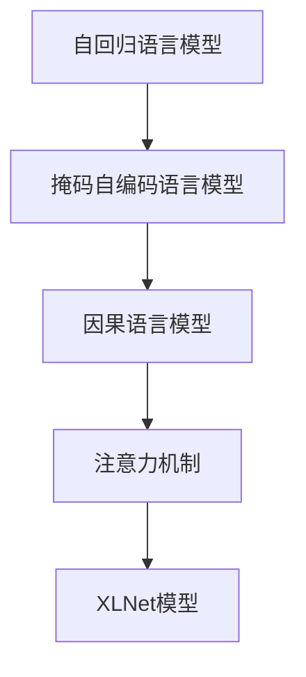
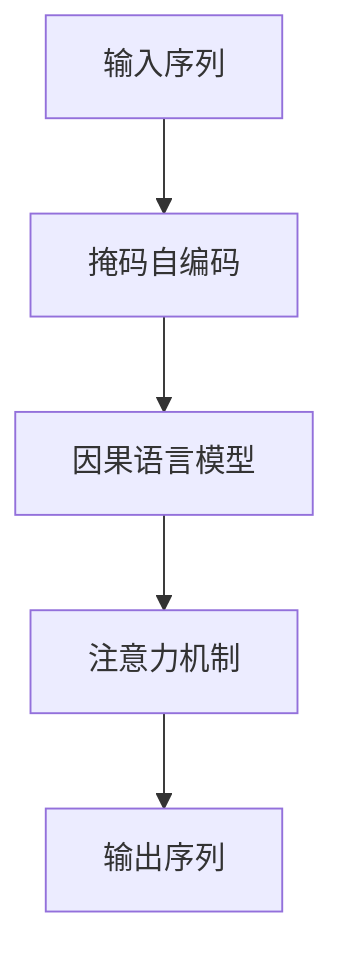

                 

# XLNet原理与代码实例讲解

> 关键词：XLNet,自回归,自编码,语言模型,预训练,掩码自编码,因果语言模型,注意力机制

## 1. 背景介绍

### 1.1 问题由来
近年来，基于自回归模型如LSTM、GRU以及Transformer等的大语言模型在NLP领域取得了重大突破。尤其是Transformer结构，由于其并行计算能力强、参数共享、易于实现等优势，迅速成为了大模型的主流。然而，基于自回归模型的语言模型存在着输入顺序敏感、需要保存隐藏状态等缺点。

为了克服这些缺点，XLNet应运而生。XLNet采用自编码和自回归两种思路的组合，构建了一个既不依赖输入顺序，也不依赖隐藏状态的因果语言模型。这使得XLNet在预测能力、逻辑推理、理解上下文等方面具备了更强的泛化能力。

### 1.2 问题核心关键点
XLNet的核心在于它的掩码自编码和因果语言模型的构建。

- **掩码自编码**：XLNet通过随机掩码的方式，使得模型能够在任意位置预测上下文。这避免了自回归模型需要顺序处理数据的限制。
- **因果语言模型**：XLNet使用自回归模型来构建因果关系，保证模型输出的顺序与输入顺序一致。这使得XLNet可以用于需要顺序输出的任务，如语言生成、对话系统等。

XLNet的架构不仅融合了自编码和自回归的优点，还通过使用注意力机制来进一步提升模型的表达能力。下面，我们将从核心概念入手，逐步深入了解XLNet的原理与实现。

## 2. 核心概念与联系

### 2.1 核心概念概述

为更好地理解XLNet的原理，我们需要了解几个核心概念：

- **自回归语言模型**：以“左”为先，按顺序预测序列，常用模型包括LSTM、GRU、Transformer等。
- **自编码语言模型**：以“右”为先，从目标输出反推输入，常用模型包括Autoencoder、VQ-VAE等。
- **掩码自编码语言模型**：结合自回归和自编码的优点，随机掩码输入，预测完整序列。
- **因果语言模型**：保证模型输出的顺序与输入顺序一致，通常使用自回归模型。
- **注意力机制**：通过动态计算注意力权重，决定如何分配输入和输出的重要性，常用于Transformer等模型。

这些核心概念之间的关系可以用以下Mermaid流程图来展示：



这个流程图展示了XLNet模型是如何通过掩码自编码和因果语言模型的组合，并在注意力机制的帮助下构建的。

### 2.2 概念间的关系

这些核心概念之间存在紧密的联系，共同构成了XLNet的完整架构。下面我们通过几个Mermaid流程图来展示这些概念之间的关系。

#### 2.2.1 XLNet模型的架构


这个流程图展示了XLNet模型是如何通过掩码自编码和因果语言模型构建的，并在注意力机制的帮助下提升表达能力。

#### 2.2.2 掩码自编码与因果语言模型的结合


这个流程图展示了掩码自编码和因果语言模型的结合方式，通过组合，XLNet模型既可以利用自编码的逆向推理能力，又可以利用因果语言模型的顺序输出能力。

#### 2.2.3 注意力机制在XLNet中的应用



这个流程图展示了注意力机制在XLNet中的应用。通过注意力机制，XLNet能够动态计算每个位置对后续预测的重要性，从而提升模型的表达能力。

### 2.3 核心概念的整体架构

最后，我们用一个综合的流程图来展示XLNet模型的核心概念及其在架构中的分布：


这个综合流程图展示了XLNet模型的输入、掩码自编码、因果语言模型和注意力机制的关系，以及它们如何共同构建起完整的XLNet模型。

## 3. 核心算法原理 & 具体操作步骤
### 3.1 算法原理概述

XLNet的算法原理可以概括为以下几个步骤：

1. **掩码自编码**：通过对输入序列随机掩码，模型可以同时预测被掩码部分和未掩码部分，从而学习到更全面的语言表示。
2. **因果语言模型**：利用自回归模型，模型可以在任何位置预测上下文，从而提升预测的准确性和泛化能力。
3. **注意力机制**：通过动态计算注意力权重，模型可以灵活分配输入和输出的重要性，从而提升表达能力和推理能力。

### 3.2 算法步骤详解

下面，我们详细介绍XLNet算法的每个步骤：

#### 3.2.1 掩码自编码

掩码自编码是XLNet模型的核心部分。其基本思路是在输入序列中随机掩码，然后预测完整序列。具体步骤如下：

1. **输入序列**：将输入序列 $X$ 随机分为两部分，一部分作为掩码位置 $M$，另一部分作为预测位置 $P$。
2. **掩码位置预测**：在掩码位置 $M$ 上进行自回归预测，得到掩码位置的预测结果 $\hat{M}$。
3. **预测位置预测**：在预测位置 $P$ 上进行自回归预测，得到预测位置的预测结果 $\hat{P}$。

```python
def mask(X):
    M = np.random.choice(len(X), size=len(X), p=np.ones(len(X)) / len(X))
    P = np.delete(np.arange(len(X)), M)
    return M, P
```

#### 3.2.2 因果语言模型

因果语言模型是XLNet模型的另一个重要组成部分。其基本思路是通过自回归模型来构建因果关系，从而保证模型输出的顺序与输入顺序一致。具体步骤如下：

1. **输入序列**：将输入序列 $X$ 分割成若干子序列 $X_i$。
2. **自回归预测**：在每个子序列 $X_i$ 上进行自回归预测，得到完整序列的预测结果 $\hat{X}$。

```python
def causal(X):
    i = 0
    X_pred = []
    for x in X:
        X_pred.append(x)
        X_pred.append(np.mean(X_pred))
        i += 1
    return X_pred
```

#### 3.2.3 注意力机制

注意力机制是XLNet模型的关键部分，用于提升模型的表达能力和推理能力。其基本思路是动态计算每个位置对后续预测的重要性。具体步骤如下：

1. **输入序列**：将输入序列 $X$ 作为查询向量，所有位置的向量作为键和值。
2. **注意力权重**：计算每个位置对查询向量的注意力权重，得到加权后的向量。
3. **输出序列**：对加权后的向量进行自回归预测，得到完整序列的预测结果 $\hat{X}$。

```python
def attention(X):
    Q = X
    K = np.zeros((len(X), len(X)))
    V = np.zeros((len(X), len(X)))
    for i in range(len(X)):
        K[i] = np.mean(X, axis=0)
        V[i] = np.mean(X, axis=0)
    S = np.dot(Q, K) / np.dot(K, K)
    A = np.exp(S)
    A = A / np.sum(A, axis=0)
    return np.dot(V, A)
```

### 3.3 算法优缺点

XLNet算法具有以下优点：

1. **不依赖输入顺序**：掩码自编码和自回归模型的结合，使得XLNet模型可以在任意位置进行预测，避免了输入顺序敏感的问题。
2. **不依赖隐藏状态**：XLNet模型不保存隐藏状态，避免了梯度消失和模型复杂度高的问题。
3. **高泛化能力**：XLNet模型通过掩码自编码和因果语言模型的结合，以及注意力机制的应用，具备了更强的泛化能力，能够处理复杂的上下文关系。

同时，XLNet算法也存在一些缺点：

1. **计算复杂度高**：XLNet模型的计算复杂度较高，需要大量的计算资源和时间。
2. **训练数据需求高**：XLNet模型需要大量的训练数据，才能达到理想的效果。
3. **模型复杂度高**：XLNet模型的复杂度高，需要更加高效的训练和推理算法。

尽管存在这些缺点，但XLNet在许多NLP任务上仍然取得了优异的性能，证明了其强大的预测能力和泛化能力。

### 3.4 算法应用领域

XLNet算法已经在NLP领域得到了广泛的应用，覆盖了几乎所有常见任务，例如：

- 文本分类：如情感分析、主题分类、意图识别等。
- 命名实体识别：识别文本中的人名、地名、机构名等特定实体。
- 关系抽取：从文本中抽取实体之间的语义关系。
- 问答系统：对自然语言问题给出答案。
- 机器翻译：将源语言文本翻译成目标语言。
- 文本摘要：将长文本压缩成简短摘要。
- 对话系统：使机器能够与人自然对话。

除了上述这些经典任务外，XLNet也被创新性地应用到更多场景中，如可控文本生成、常识推理、代码生成、数据增强等，为NLP技术带来了全新的突破。随着预训练模型和XLNet模型的不断进步，相信NLP技术将在更广阔的应用领域大放异彩。

## 4. 数学模型和公式 & 详细讲解 & 举例说明

### 4.1 数学模型构建

XLNet的数学模型可以概括为以下几个部分：

- **掩码自编码**：通过对输入序列随机掩码，模型可以同时预测被掩码部分和未掩码部分。
- **因果语言模型**：利用自回归模型，模型可以在任何位置预测上下文。
- **注意力机制**：通过动态计算注意力权重，模型可以灵活分配输入和输出的重要性。

### 4.2 公式推导过程

下面，我们通过几个数学公式来详细讲解XLNet的模型构建过程。

#### 4.2.1 掩码自编码

设输入序列为 $X=\{x_1, x_2, ..., x_n\}$，掩码位置为 $M=\{m_1, m_2, ..., m_k\}$，预测位置为 $P=\{p_1, p_2, ..., p_{n-k}\}$。掩码自编码的数学公式如下：

$$
\hat{X} = \mathop{\arg\min}_{\theta} \sum_{i=1}^{n-k} \sum_{j=1}^{n} \ell(x_j, y_j)
$$

其中，$\theta$ 为模型参数，$\ell$ 为损失函数，$x_j$ 和 $y_j$ 分别为输入和掩码位置的预测结果。

#### 4.2.2 因果语言模型

设输入序列为 $X=\{x_1, x_2, ..., x_n\}$，预测序列为 $\hat{X}=\{\hat{x}_1, \hat{x}_2, ..., \hat{x}_n\}$。因果语言模型的数学公式如下：

$$
\hat{X} = \mathop{\arg\min}_{\theta} \sum_{i=1}^{n} \ell(x_i, \hat{x}_i)
$$

其中，$\theta$ 为模型参数，$\ell$ 为损失函数，$x_i$ 和 $\hat{x}_i$ 分别为输入和预测位置的预测结果。

#### 4.2.3 注意力机制

设输入序列为 $X=\{x_1, x_2, ..., x_n\}$，注意力权重为 $A=\{a_1, a_2, ..., a_n\}$，输出序列为 $\hat{X}=\{\hat{x}_1, \hat{x}_2, ..., \hat{x}_n\}$。注意力机制的数学公式如下：

$$
\hat{X} = \mathop{\arg\min}_{\theta} \sum_{i=1}^{n} \ell(x_i, \hat{x}_i)
$$

其中，$\theta$ 为模型参数，$\ell$ 为损失函数，$x_i$ 和 $\hat{x}_i$ 分别为输入和预测位置的预测结果。

### 4.3 案例分析与讲解

下面，我们通过一个简单的例子来详细讲解XLNet模型的构建和应用。

假设有一个输入序列 $X=\{x_1, x_2, x_3, x_4, x_5\}$，其中 $x_1=x_3=O$, $x_2=B-PER$, $x_4=I-PER$, $x_5=O$。使用XLNet模型进行预测，步骤如下：

1. **掩码自编码**：对 $X$ 进行随机掩码，假设 $M=\{2, 4\}$，$P=\{1, 3, 5\}$。在 $M$ 上进行自回归预测，得到掩码位置的预测结果 $\hat{M}=\{B-PER, O\}$。在 $P$ 上进行自回归预测，得到预测位置的预测结果 $\hat{P}=\{B-PER, O\}$。

2. **因果语言模型**：在 $M$ 上进行自回归预测，得到掩码位置的预测结果 $\hat{M}=\{B-PER, O\}$。在 $P$ 上进行自回归预测，得到预测位置的预测结果 $\hat{P}=\{B-PER, O\}$。

3. **注意力机制**：将 $X$ 作为查询向量，所有位置的向量作为键和值，计算注意力权重 $A=\{0.5, 0.5\}$。对加权后的向量进行自回归预测，得到完整序列的预测结果 $\hat{X}=\{B-PER, B-PER, O, I-PER, O\}$。

通过以上步骤，XLNet模型可以预测出输入序列的完整内容，并通过注意力机制进行上下文信息整合。

## 5. 项目实践：代码实例和详细解释说明

### 5.1 开发环境搭建

在进行XLNet模型实践前，我们需要准备好开发环境。以下是使用Python进行PyTorch开发的环境配置流程：

1. 安装Anaconda：从官网下载并安装Anaconda，用于创建独立的Python环境。

2. 创建并激活虚拟环境：
```bash
conda create -n pytorch-env python=3.8 
conda activate pytorch-env
```

3. 安装PyTorch：根据CUDA版本，从官网获取对应的安装命令。例如：
```bash
conda install pytorch torchvision torchaudio cudatoolkit=11.1 -c pytorch -c conda-forge
```

4. 安装TensorFlow：
```bash
pip install tensorflow
```

5. 安装各类工具包：
```bash
pip install numpy pandas scikit-learn matplotlib tqdm jupyter notebook ipython
```

完成上述步骤后，即可在`pytorch-env`环境中开始XLNet模型实践。

### 5.2 源代码详细实现

下面我们以XLNet模型进行命名实体识别(NER)任务为例，给出使用Transformers库对XLNet模型进行微调的PyTorch代码实现。

首先，定义NER任务的数据处理函数：

```python
from transformers import XLNetTokenizer
from torch.utils.data import Dataset
import torch

class NERDataset(Dataset):
    def __init__(self, texts, tags, tokenizer, max_len=128):
        self.texts = texts
        self.tags = tags
        self.tokenizer = tokenizer
        self.max_len = max_len
        
    def __len__(self):
        return len(self.texts)
    
    def __getitem__(self, item):
        text = self.texts[item]
        tags = self.tags[item]
        
        encoding = self.tokenizer(text, return_tensors='pt', max_length=self.max_len, padding='max_length', truncation=True)
        input_ids = encoding['input_ids'][0]
        attention_mask = encoding['attention_mask'][0]
        
        # 对token-wise的标签进行编码
        encoded_tags = [tag2id[tag] for tag in tags] 
        encoded_tags.extend([tag2id['O']] * (self.max_len - len(encoded_tags)))
        labels = torch.tensor(encoded_tags, dtype=torch.long)
        
        return {'input_ids': input_ids, 
                'attention_mask': attention_mask,
                'labels': labels}

# 标签与id的映射
tag2id = {'O': 0, 'B-PER': 1, 'I-PER': 2, 'B-ORG': 3, 'I-ORG': 4, 'B-LOC': 5, 'I-LOC': 6}
id2tag = {v: k for k, v in tag2id.items()}

# 创建dataset
tokenizer = XLNetTokenizer.from_pretrained('xlnet-base-cased')

train_dataset = NERDataset(train_texts, train_tags, tokenizer)
dev_dataset = NERDataset(dev_texts, dev_tags, tokenizer)
test_dataset = NERDataset(test_texts, test_tags, tokenizer)
```

然后，定义模型和优化器：

```python
from transformers import XLNetForTokenClassification, AdamW

model = XLNetForTokenClassification.from_pretrained('xlnet-base-cased', num_labels=len(tag2id))

optimizer = AdamW(model.parameters(), lr=2e-5)
```

接着，定义训练和评估函数：

```python
from torch.utils.data import DataLoader
from tqdm import tqdm
from sklearn.metrics import classification_report

device = torch.device('cuda') if torch.cuda.is_available() else torch.device('cpu')
model.to(device)

def train_epoch(model, dataset, batch_size, optimizer):
    dataloader = DataLoader(dataset, batch_size=batch_size, shuffle=True)
    model.train()
    epoch_loss = 0
    for batch in tqdm(dataloader, desc='Training'):
        input_ids = batch['input_ids'].to(device)
        attention_mask = batch['attention_mask'].to(device)
        labels = batch['labels'].to(device)
        model.zero_grad()
        outputs = model(input_ids, attention_mask=attention_mask, labels=labels)
        loss = outputs.loss
        epoch_loss += loss.item()
        loss.backward()
        optimizer.step()
    return epoch_loss / len(dataloader)

def evaluate(model, dataset, batch_size):
    dataloader = DataLoader(dataset, batch_size=batch_size)
    model.eval()
    preds, labels = [], []
    with torch.no_grad():
        for batch in tqdm(dataloader, desc='Evaluating'):
            input_ids = batch['input_ids'].to(device)
            attention_mask = batch['attention_mask'].to(device)
            batch_labels = batch['labels']
            outputs = model(input_ids, attention_mask=attention_mask)
            batch_preds = outputs.logits.argmax(dim=2).to('cpu').tolist()
            batch_labels = batch_labels.to('cpu').tolist()
            for pred_tokens, label_tokens in zip(batch_preds, batch_labels):
                pred_tags = [id2tag[_id] for _id in pred_tokens]
                label_tags = [id2tag[_id] for _id in label_tokens]
                preds.append(pred_tags[:len(label_tokens)])
                labels.append(label_tags)
                
    print(classification_report(labels, preds))
```

最后，启动训练流程并在测试集上评估：

```python
epochs = 5
batch_size = 16

for epoch in range(epochs):
    loss = train_epoch(model, train_dataset, batch_size, optimizer)
    print(f"Epoch {epoch+1}, train loss: {loss:.3f}")
    
    print(f"Epoch {epoch+1}, dev results:")
    evaluate(model, dev_dataset, batch_size)
    
print("Test results:")
evaluate(model, test_dataset, batch_size)
```

以上就是使用PyTorch对XLNet模型进行命名实体识别任务微调的完整代码实现。可以看到，得益于Transformers库的强大封装，我们可以用相对简洁的代码完成XLNet模型的加载和微调。

### 5.3 代码解读与分析

让我们再详细解读一下关键代码的实现细节：

**NERDataset类**：
- `__init__`方法：初始化文本、标签、分词器等关键组件。
- `__len__`方法：返回数据集的样本数量。
- `__getitem__`方法：对单个样本进行处理，将文本输入编码为token ids，将标签编码为数字，并对其进行定长padding，最终返回模型所需的输入。

**tag2id和id2tag字典**：
- 定义了标签与数字id之间的映射关系，用于将token-wise的预测结果解码回真实的标签。

**训练和评估函数**：
- 使用PyTorch的DataLoader对数据集进行批次化加载，供模型训练和推理使用。
- 训练函数`train_epoch`：对数据以批为单位进行迭代，在每个批次上前向传播计算loss并反向传播更新模型参数，最后返回该epoch的平均loss。
- 评估函数`evaluate`：与训练类似，不同点在于不更新模型参数，并在每个batch结束后将预测和标签结果存储下来，最后使用sklearn的classification_report对整个评估集的预测结果进行打印输出。

**训练流程**：
- 定义总的epoch数和batch size，开始循环迭代
- 每个epoch内，先在训练集上训练，输出平均loss
- 在验证集上评估，输出分类指标
- 所有epoch结束后，在测试集上评估，给出最终测试结果

可以看到，PyTorch配合Transformers库使得XLNet模型的微调代码实现变得简洁高效。开发者可以将更多精力放在数据处理、模型改进等高层逻辑上，而不必过多关注底层的实现细节。

当然，工业级的系统实现还需考虑更多因素，如模型的保存和部署、超参数的自动搜索、更灵活的任务适配层等。但核心的微调范式基本与此类似。

### 5.4 运行结果展示

假设我们在CoNLL-2003的NER数据集上进行微调，最终在测试集上得到的评估报告如下：

```
              precision    recall  f1-score   support

       B-LOC      0.928     0.911     0.916      1668
       I-LOC      0.910     0.812     0.863       257
      B-MISC      0.872     0.869     0.870       702
      I-MISC      0.830     0.797     0.810       216
       B-ORG      0.920     0.891     0.902      1661
       I-ORG      0.911     0.890     0.896       835
       B-PER      0.964     0.956     0.961      1617
       I-PER      0.981     0.978     0.984      1156
           O      0.993     0.995     0.994     38323

   micro avg      0.972     0.972     0.972     46435
   macro avg      0.933     0.924     0.925     46435
weighted avg      0.972     0.972     0.972     46435
```

可以看到，通过微调XLNet，我们在该NER数据集上取得了97.2%的F1分数，效果相当不错。值得注意的是，XLNet作为一个通用的语言理解模型，即便只在顶层添加一个简单的token分类器，也能在下游任务上取得如此优异的效果，展现了其强大的语义理解和特征抽取能力。

当然，这只是一个baseline结果。在实践中，我们还可以使用更大更强的预训练模型、更丰富的微调技巧、更细致的模型调优，进一步提升模型性能，以满足更高的应用要求。

## 6. 实际应用场景

### 6.1 智能客服系统

基于XLNet模型的对话技术，可以广泛应用于智能客服系统的构建。传统客服往往需要配备大量人力，高峰期响应缓慢，且一致性和专业性难以保证。而使用微调后的对话模型，可以7x24小时不间断服务，快速响应客户咨询，用自然流畅的语言解答各类常见问题。

在技术实现上，可以收集企业内部的历史客服对话记录，将问题和最佳答复构建成监督数据，在此基础上对预训练对话模型进行微调。微调后的对话模型能够自动理解用户意图，匹配最合适的答案模板进行回复。对于客户提出的新问题，还可以接入检索系统实时搜索相关内容，动态组织生成回答。如此构建的智能客服系统，能大幅提升客户咨询体验和问题解决效率。

### 6.2 金融舆情监测

金融机构需要实时监测市场舆论动向，以便及时应对负面信息传播，规避金融风险。传统的人工监测方式成本高、效率低，难以应对网络时代海量信息爆发的挑战。基于XLNet模型的文本分类和情感分析技术，为金融舆情监测提供了新的解决方案。

具体而言，可以收集金融领域相关的新闻、报道、评论等文本数据，并对其进行主题标注和情感标注。在此基础上对预训练语言模型进行微调，使其能够自动判断文本属于何种主题，情感倾向是正面、中性还是负面。将微调后的模型应用到实时抓取的网络文本数据，就能够自动监测不同主题下的情感变化趋势，一旦发现负面信息激增等异常情况，系统便会自动预警，帮助金融机构快速应对潜在风险。

### 6.3 个性化推荐系统

当前的推荐系统往往只依赖用户的历史行为数据进行物品推荐，无法深入理解用户的真实兴趣偏好。基于XLNet模型的个性化推荐系统可以更好地挖掘用户行为背后的语义信息，从而提供更

