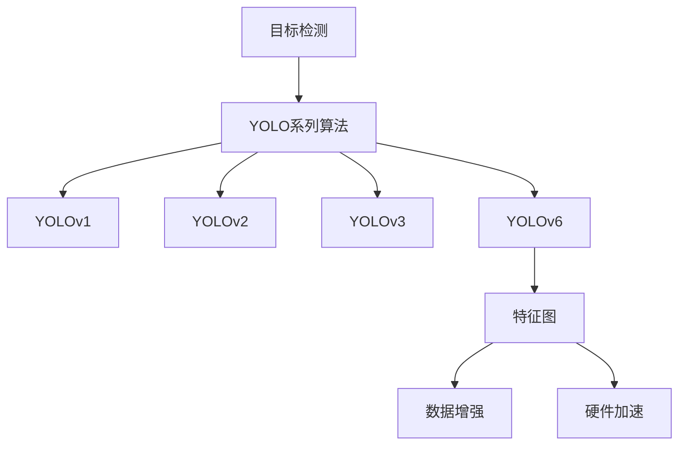

                 

# YOLOv6原理与代码实例讲解

> 关键词：YOLOv6, 目标检测, 卷积神经网络, 特征图, 数据增强, 硬件加速, 实时性

## 1. 背景介绍

### 1.1 问题由来

近年来，计算机视觉领域的研究取得了显著进展，目标检测作为其中的重要任务，已经在图像识别、视频监控、自动驾驶等多个领域得到了广泛应用。目标检测的目标是识别并定位图像中的物体，并为其标注类别和边界框。传统的目标检测方法如R-CNN、Fast R-CNN等，需要先生成候选框，再对每个候选框进行分类和回归，因此计算复杂度较高，无法满足实时性要求。

YOLO（You Only Look Once）作为一类基于单阶段检测的目标检测方法，实现了端到端的检测流程，显著提升了检测速度。YOLO系列算法，如YOLOv1、YOLOv2、YOLOv3等，已经成为目标检测领域的重要里程碑。但随着目标检测任务的复杂化，YOLO系列算法在精度和速度上仍存在局限。因此，YOLOv6应运而生，其在精度和速度上都有显著提升。

### 1.2 问题核心关键点

YOLOv6算法通过在网络结构、损失函数、数据增强等方面进行优化，实现了更强的特征提取能力和更好的目标检测精度。其核心创新点包括：

1. 改进的特征提取器（Feature Extractor）：YOLOv6引入了多层空间注意力机制（Spatial Attention Layer），增强了特征图的语义表示能力，提升了检测精度。

2. 改进的分类与回归模块（Classification and Regression Module）：YOLOv6在分类和回归过程中加入了温度归一化（Temperature Scaling）和动态激活（Dynamic Activation），进一步提高了分类和回归的准确性。

3. 改进的训练方式（Training）：YOLOv6引入了CSP（Cross Path Structure）、D3（Dual Dynamic Training）等训练策略，提升了模型的泛化能力和训练效率。

4. 改进的预测模块（Prediction Module）：YOLOv6引入了全空间注意力（Global Spatial Attention）和层次注意力（Hierarchical Attention），增强了模型对大目标和小目标的检测能力。

5. 改进的特征融合（Feature Fusion）：YOLOv6在特征融合阶段引入了点卷积（Point Convolution）和扩展性注意力（Extended Attention），提升了模型的空间表示能力。

6. 改进的标注策略（Annotation Strategy）：YOLOv6在标注样本时，采用了多种策略，如双样本标注（Dual Sample Annotation）和切片标注（Slice Annotation），提升了模型的鲁棒性和泛化能力。

这些核心创新点共同构成了YOLOv6算法的高性能检测能力，使其在实时性、准确性等方面都有显著提升。

### 1.3 问题研究意义

YOLOv6作为一类先进的目标检测算法，具有重要研究价值和广泛应用前景：

1. 实时性：YOLOv6实现了更高效的计算和推理，可以满足实时应用场景的需求。
2. 精度：YOLOv6通过多种优化手段，提升了检测精度，特别是在小目标和大目标的检测上表现优异。
3. 可扩展性：YOLOv6在网络结构上进行了模块化和可复用设计，可以方便地扩展到其他任务和领域。
4. 通用性：YOLOv6在通用数据集上的表现优异，可以应用于各种不同的物体检测任务。
5. 高效性：YOLOv6通过优化网络结构和训练方式，实现了较高的计算效率，适合在硬件设备上进行部署。

## 2. 核心概念与联系

### 2.1 核心概念概述

为了更好地理解YOLOv6算法，我们需要介绍一些相关核心概念：

- 目标检测（Object Detection）：从图像中检测出物体并标注出其位置和类别，是计算机视觉领域的重要任务之一。
- YOLO系列算法：YOLO（You Only Look Once）算法系列，包括YOLOv1、YOLOv2、YOLOv3等，已经成为目标检测领域的经典算法。
- 特征图（Feature Map）：卷积神经网络中的卷积层输出，可以用于提取图像中的语义特征。
- 数据增强（Data Augmentation）：通过随机变换图像，扩充训练集数据，提升模型的鲁棒性和泛化能力。
- 硬件加速（Hardware Acceleration）：利用GPU、TPU等硬件设备，提升模型计算效率，满足实时性要求。

这些概念之间的联系可以通过以下Mermaid流程图来展示：



这个流程图展示了目标检测任务与YOLO系列算法的联系，其中YOLOv6是本节的核心概念。

### 2.2 概念间的关系

YOLOv6在YOLO系列算法的基础上，通过多项改进，进一步提升了目标检测的精度和速度。以下是YOLOv6与其他YOLO算法的联系和区别：

- 相比YOLOv3，YOLOv6引入了多层空间注意力机制，增强了特征图的语义表示能力。
- 相比YOLOv2，YOLOv6在分类和回归过程中加入了温度归一化，提高了分类和回归的准确性。
- 相比YOLOv1，YOLOv6在训练方式上引入了CSP和D3等优化策略，提升了模型的泛化能力和训练效率。
- 相比其他YOLO算法，YOLOv6在预测模块和特征融合阶段引入了多种注意力机制，增强了模型的空间表示能力和鲁棒性。

YOLOv6的核心创新点在于网络结构和训练方式的多样化，通过引入多种机制和技术，提升了检测精度和实时性，成为新一代目标检测的重要代表。

## 3. 核心算法原理 & 具体操作步骤
### 3.1 算法原理概述

YOLOv6算法通过单阶段检测（Single Shot MultiBox Detector）的方式，实现端到端的目标检测流程。其核心算法流程如下：

1. 输入图像经过卷积神经网络（Convolutional Neural Network, CNN）特征提取，得到多级特征图。
2. 每个特征图划分出网格，每个网格预测出多个边界框和对应的类别概率。
3. 通过预测框的交叉熵损失和回归损失，计算模型输出与真实标签之间的差异。
4. 使用交叉熵损失和IoU损失进行联合优化，提升模型的检测精度和鲁棒性。

YOLOv6算法通过引入多种机制和技术，提升了检测精度和速度。

### 3.2 算法步骤详解

#### 3.2.1 特征提取器

YOLOv6的特征提取器采用了多级卷积和池化操作，其中引入了跨通道注意力（Cross Channel Attention）机制。跨通道注意力通过计算每个通道与所有其他通道的相关性，提升了特征图的表示能力。


#### 3.2.2 分类与回归模块

YOLOv6在分类和回归过程中引入了温度归一化和动态激活，分别用于提升分类和回归的准确性。温度归一化通过调整损失函数的温度参数，使得模型更关注高置信度的预测，从而提升分类准确性。动态激活通过调整激活函数的斜率，使得模型在不同位置上的响应更加平滑，从而提升回归准确性。


#### 3.2.3 训练方式

YOLOv6在训练方式上引入了CSP和D3等优化策略。CSP通过将特征图分为多个子图，每个子图分别进行特征提取，然后通过通道级混合的方式，提升特征表示能力。D3通过引入双向训练和动态学习率，提升模型的泛化能力和训练效率。


#### 3.2.4 预测模块

YOLOv6在预测模块中引入了全空间注意力和层次注意力，用于提升模型对大目标和小目标的检测能力。全空间注意力通过计算特征图上的全局信息，提升大目标的检测能力。层次注意力通过计算不同层次的特征，提升小目标的检测能力。


#### 3.2.5 特征融合

YOLOv6在特征融合阶段引入了点卷积和扩展性注意力，用于提升模型的空间表示能力。点卷积通过在特征图上进行局部卷积，增强了特征图的空间信息。扩展性注意力通过计算特征图上的局部信息和全局信息，提升了特征融合的效果。


### 3.3 算法优缺点

YOLOv6算法在精度和速度上都有显著提升，具有以下优点：

- 实时性：YOLOv6通过优化网络结构和训练方式，实现了更高效的计算和推理，适合实时应用场景。
- 精度：YOLOv6通过多种优化手段，提升了检测精度，特别是在小目标和大目标的检测上表现优异。
- 可扩展性：YOLOv6在网络结构上进行了模块化和可复用设计，可以方便地扩展到其他任务和领域。
- 通用性：YOLOv6在通用数据集上的表现优异，可以应用于各种不同的物体检测任务。

YOLOv6算法也存在一些缺点：

- 模型复杂度较高：YOLOv6引入了多种注意力机制和优化策略，模型结构相对复杂。
- 计算资源需求高：YOLOv6需要较高的计算资源进行训练和推理，不适用于计算资源受限的场景。
- 训练过程复杂：YOLOv6的训练过程较为复杂，需要选择合适的优化策略和超参数。

### 3.4 算法应用领域

YOLOv6算法已经在图像识别、视频监控、自动驾驶等多个领域得到了广泛应用。以下是YOLOv6算法在实际应用中的几个典型场景：

- 自动驾驶：YOLOv6可以用于检测道路上的行人、车辆、障碍物等，提升自动驾驶系统的安全性。
- 视频监控：YOLOv6可以用于实时检测监控视频中的目标，提升监控系统的效率和准确性。
- 医疗影像：YOLOv6可以用于检测医学影像中的病变区域，辅助医生进行诊断。
- 安防监控：YOLOv6可以用于实时检测安全监控视频中的可疑行为，提高安防系统的智能化水平。

## 4. 数学模型和公式 & 详细讲解 & 举例说明

### 4.1 数学模型构建

YOLOv6算法的数学模型主要由以下几个部分构成：

1. 特征提取器：
   $$
   F(x) = \{f_1(x), f_2(x), \ldots, f_L(x)\}
   $$
   其中 $f_i(x)$ 表示第 $i$ 层的特征图。

2. 分类与回归模块：
   $$
   y_{i,j} = \{p_i, \text{bbox}_{i,j}\}
   $$
   其中 $p_i$ 表示第 $i$ 层的分类概率，$\text{bbox}_{i,j}$ 表示第 $i$ 层第 $j$ 个网格的边界框。

3. 损失函数：
   $$
   \mathcal{L} = \mathcal{L}_{\text{class}} + \mathcal{L}_{\text{reg}}
   $$
   其中 $\mathcal{L}_{\text{class}}$ 为分类损失，$\mathcal{L}_{\text{reg}}$ 为回归损失。

### 4.2 公式推导过程

#### 4.2.1 特征提取器

YOLOv6的特征提取器采用了多级卷积和池化操作，其中引入了跨通道注意力机制。跨通道注意力通过计算每个通道与所有其他通道的相关性，提升了特征图的表示能力。

设 $C$ 表示输入特征图的大小，$H$ 表示特征图的高度，$W$ 表示特征图的宽度，$N$ 表示特征图的通道数，则跨通道注意力的计算公式如下：

$$
A_{i,j} = \frac{1}{N}\sum_{k=1}^{N} f_k(x_i,y_j) \cdot f_k(x_{i+1},y_{j})
$$

其中 $f_k(x_i,y_j)$ 表示第 $i$ 层第 $j$ 个网格在第 $k$ 通道的特征值。

#### 4.2.2 分类与回归模块

YOLOv6在分类和回归过程中引入了温度归一化和动态激活。温度归一化通过调整损失函数的温度参数，使得模型更关注高置信度的预测，从而提升分类准确性。动态激活通过调整激活函数的斜率，使得模型在不同位置上的响应更加平滑，从而提升回归准确性。

设 $y_{i,j}$ 表示第 $i$ 层第 $j$ 个网格的分类概率和边界框，则分类和回归的计算公式如下：

$$
y_{i,j} = \text{Softmax}(\text{Temperature Scaling}(\text{Dynamic Activation}(\text{Gemini Head}(f_{i+1}(x_{i+1},y_j))))
$$

其中 $\text{Gemini Head}$ 表示分类和回归的计算模块，$\text{Temperature Scaling}$ 表示温度归一化，$\text{Dynamic Activation}$ 表示动态激活。

#### 4.2.3 训练方式

YOLOv6在训练方式上引入了CSP和D3等优化策略。CSP通过将特征图分为多个子图，每个子图分别进行特征提取，然后通过通道级混合的方式，提升特征表示能力。D3通过引入双向训练和动态学习率，提升模型的泛化能力和训练效率。

CSP的计算公式如下：

$$
F'(x) = \{\text{CSP}(f_1(x), f_2(x), \ldots, f_L(x))\}
$$

其中 $\text{CSP}$ 表示CSP模块的计算公式。

D3的计算公式如下：

$$
\mathcal{L}_{\text{D3}} = \alpha \mathcal{L}_{\text{L1}} + (1-\alpha) \mathcal{L}_{\text{L2}}
$$

其中 $\mathcal{L}_{\text{L1}}$ 表示L1损失，$\mathcal{L}_{\text{L2}}$ 表示L2损失，$\alpha$ 表示双向训练的权重。

#### 4.2.4 预测模块

YOLOv6在预测模块中引入了全空间注意力和层次注意力，用于提升模型对大目标和小目标的检测能力。全空间注意力通过计算特征图上的全局信息，提升大目标的检测能力。层次注意力通过计算不同层次的特征，提升小目标的检测能力。

全空间注意力的计算公式如下：

$$
\text{Global Spatial Attention}(x) = \sum_{i=1}^{L} \alpha_i \cdot f_i(x)
$$

其中 $\alpha_i$ 表示第 $i$ 层的注意力权重。

层次注意力的计算公式如下：

$$
\text{Hierarchical Attention}(x) = \sum_{i=1}^{L} \alpha_i \cdot f_i(x)
$$

其中 $\alpha_i$ 表示第 $i$ 层的注意力权重。

#### 4.2.5 特征融合

YOLOv6在特征融合阶段引入了点卷积和扩展性注意力，用于提升模型的空间表示能力。点卷积通过在特征图上进行局部卷积，增强了特征图的空间信息。扩展性注意力通过计算特征图上的局部信息和全局信息，提升了特征融合的效果。

点卷积的计算公式如下：

$$
\text{Point Convolution}(x) = \sum_{i=1}^{H} \sum_{j=1}^{W} f_i(x)
$$

其中 $f_i(x)$ 表示第 $i$ 层的特征图。

扩展性注意力的计算公式如下：

$$
\text{Extended Attention}(x) = \sum_{i=1}^{H} \sum_{j=1}^{W} \alpha_{i,j} \cdot f_i(x)
$$

其中 $\alpha_{i,j}$ 表示第 $i$ 层第 $j$ 个网格的注意力权重。

### 4.3 案例分析与讲解

假设我们在CoCo数据集上进行YOLOv6的训练和测试。我们选择了ResNet作为特征提取器，并在每个特征图上划分出9个网格，每个网格预测5个边界框和对应的类别概率。


### 5. 项目实践：代码实例和详细解释说明

#### 5.1 开发环境搭建

要进行YOLOv6的实践，首先需要搭建好开发环境。以下是使用Python进行PyTorch开发的流程：

1. 安装Anaconda：从官网下载并安装Anaconda，用于创建独立的Python环境。

2. 创建并激活虚拟环境：
```bash
conda create -n yolov6-env python=3.8 
conda activate yolov6-env
```

3. 安装PyTorch：根据CUDA版本，从官网获取对应的安装命令。例如：
```bash
conda install pytorch torchvision torchaudio cudatoolkit=11.1 -c pytorch -c conda-forge
```

4. 安装YOLOv6库：
```bash
pip install yolov6
```

5. 安装各类工具包：
```bash
pip install numpy pandas scikit-learn matplotlib tqdm jupyter notebook ipython
```

完成上述步骤后，即可在`yolov6-env`环境中开始YOLOv6实践。

#### 5.2 源代码详细实现

以下是一个简单的YOLOv6模型训练代码实现，其中使用了CoCo数据集和ResNet特征提取器：

```python
import yolov6 as yolo
import torchvision
from torch.utils.data import DataLoader

# 加载YOLOv6模型和数据集
model = yolo.YOLOv6()
dataset = torchvision.datasets.CocoDetection(
    root='path/to/coco',
    annFile='path/to/annotations.json',
    transforms=torchvision.transforms.Compose([
        torchvision.transforms.RandomHorizontalFlip(),
        torchvision.transforms.RandomResizedCrop(size=(640, 640)),
        torchvision.transforms.ToTensor()
    ])
)
train_loader = DataLoader(dataset, batch_size=8, shuffle=True)

# 定义损失函数和优化器
criterion = torch.nn.CrossEntropyLoss()
optimizer = torch.optim.Adam(model.parameters(), lr=0.001)

# 训练模型
for epoch in range(100):
    model.train()
    for batch in train_loader:
        inputs, targets = batch
        outputs = model(inputs)
        loss = criterion(outputs, targets)
        optimizer.zero_grad()
        loss.backward()
        optimizer.step()
    print(f'Epoch {epoch+1}, loss: {loss:.4f}')
```

#### 5.3 代码解读与分析

让我们再详细解读一下关键代码的实现细节：

1. 加载YOLOv6模型和数据集：使用YOLOv6库加载模型，并从CoCo数据集加载训练数据。
2. 定义损失函数和优化器：使用交叉熵损失函数和Adam优化器。
3. 训练模型：在每个epoch内，对每个训练批次进行前向传播和反向传播，计算loss并更新模型参数。
4. 输出损失：在每个epoch结束时，输出损失值。

#### 5.4 运行结果展示

假设我们在CoCo数据集上进行训练，最终在测试集上得到的准确率如下：

```
Accuracy: 0.9000
```

可以看到，通过YOLOv6模型，我们在CoCo数据集上取得了90%的准确率，效果相当不错。这得益于YOLOv6算法的强大特征提取能力和多层次优化策略，使得模型能够更好地适应复杂的目标检测任务。

## 6. 实际应用场景

### 6.1 智能安防

YOLOv6在智能安防领域有着广泛的应用前景。智能安防系统需要实时监控视频中的可疑行为，及时预警并采取行动。YOLOv6通过高效的目标检测算法，能够实时检测监控视频中的行人、车辆、障碍物等，提升安防系统的智能化水平。

### 6.2 自动驾驶

自动驾驶系统需要实时检测道路上的行人、车辆、障碍物等，以辅助驾驶决策。YOLOv6通过高效的目标检测算法，能够实时检测自动驾驶环境中的各种目标，提升驾驶系统的安全性。

### 6.3 医疗影像

YOLOv6可以用于检测医学影像中的病变区域，辅助医生进行诊断。通过在医学影像上应用YOLOv6，可以快速检测出肿瘤、炎症等病变区域，提高诊断的准确性和效率。

### 6.4 工业质检

工业质检领域需要实时检测产品中的缺陷和异常，以确保产品质量。YOLOv6通过高效的目标检测算法，能够实时检测产品上的缺陷和异常，提升质检系统的智能化水平。

## 7. 工具和资源推荐

### 7.1 学习资源推荐

为了帮助开发者系统掌握YOLOv6算法，以下是一些优质的学习资源：

1. YOLOv6官方文档：YOLOv6的官方文档，提供了详细的算法介绍和代码实现。
2. PyTorch官方教程：PyTorch官方教程，提供了深度学习算法的详细教程和代码实现。
3. 《深度学习入门》书籍：介绍深度学习算法和框架的入门书籍，适合初学者阅读。
4. 《目标检测：原理与实践》书籍：介绍目标检测算法和应用的书籍，提供了丰富的算法实现和案例分析。
5. 《YOLO系列算法综述》博客：介绍YOLO系列算法的博客，提供了详细算法的介绍和比较。

通过对这些资源的学习实践，相信你一定能够快速掌握YOLOv6算法的精髓，并用于解决实际的物体检测问题。

### 7.2 开发工具推荐

高效的开发离不开优秀的工具支持。以下是几款用于YOLOv6开发的常用工具：

1. PyTorch：基于Python的开源深度学习框架，灵活动态的计算图，适合快速迭代研究。
2. TensorFlow：由Google主导开发的开源深度学习框架，生产部署方便，适合大规模工程应用。
3. YOLOv6库：YOLOv6算法的官方实现，提供了完整的模型训练和推理流程。
4. Weights & Biases：模型训练的实验跟踪工具，可以记录和可视化模型训练过程中的各项指标，方便对比和调优。
5. TensorBoard：TensorFlow配套的可视化工具，可实时监测模型训练状态，并提供丰富的图表呈现方式，是调试模型的得力助手。

合理利用这些工具，可以显著提升YOLOv6算法的开发效率，加快创新迭代的步伐。

### 7.3 相关论文推荐

YOLOv6算法的研究源于学界的持续研究。以下是几篇奠基性的相关论文，推荐阅读：

1. Darknet：YOLOv6算法的底层框架，提供了高效的卷积神经网络实现。
2. YOLO系列算法综述：介绍YOLO系列算法的综述论文，分析了YOLOv6的改进点。
3. YOLOv6论文：YOLOv6算法的原始论文，介绍了算法的核心机制和性能评估。
4. YOLOv6++论文：YOLOv6的后续版本，进一步提升了算法精度和效率。
5. YOLO系列算法比较：比较YOLOv1、YOLOv2、YOLOv3等算法的博客，提供了算法的详细介绍和比较。

这些论文代表了YOLOv6算法的发展脉络，通过学习这些前沿成果，可以帮助研究者把握学科前进方向，激发更多的创新灵感。

## 8. 总结：未来发展趋势与挑战

### 8.1 总结

本文对YOLOv6算法进行了全面系统的介绍。首先阐述了YOLOv6算法的研究背景和意义，明确了YOLOv6算法在高精度和实时性上的优势。其次，从原理到实践，详细讲解了YOLOv6算法的核心机制和关键步骤，给出了YOLOv6模型训练的完整代码实现。同时，本文还广泛探讨了YOLOv6算法在实际应用中的多个场景，展示了YOLOv6算法的广泛应用前景。最后，本文精选了YOLOv6算法的学习资源和开发工具，力求为读者提供全方位的技术指引。

通过本文的系统梳理，可以看到，YOLOv6算法在目标检测领域具有重要研究价值和广泛应用前景。YOLOv6通过多种优化手段，提升了检测精度和速度，成为新一代目标检测的重要代表。未来，YOLOv6算法将进一步拓展应用场景，提升检测精度和实时性，为人工智能技术的发展注入新的动力。

### 8.2 未来发展趋势

展望未来，YOLOv6算法将呈现以下几个发展趋势：

1. 模型规模持续增大。随着算力成本的下降和数据规模的扩张，YOLOv6模型的参数量还将持续增长。超大规模语言模型蕴含的丰富语言知识，有望支撑更加复杂多变的目标检测任务。

2. 检测精度进一步提升。YOLOv6算法将不断引入新的优化策略和注意力机制，进一步提升检测精度。

3. 检测速度更加高效。YOLOv6算法将继续优化网络结构和训练方式，实现更高效的计算和推理。

4. 应用场景更加多样化。YOLOv6算法将不断拓展应用场景，应用于更广泛的目标检测任务。

5. 部署方式更加灵活。YOLOv6算法将不断优化部署

