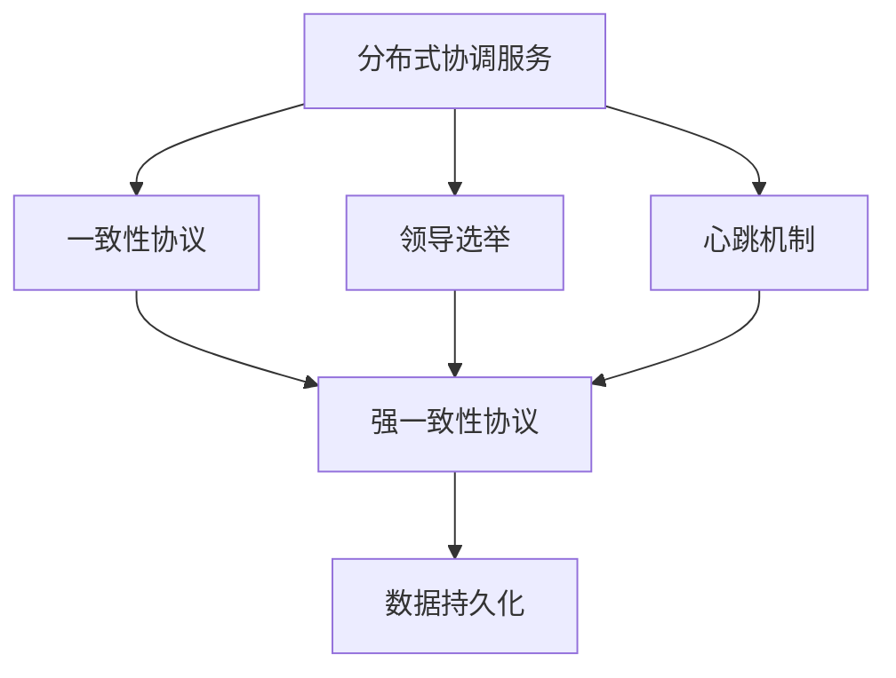
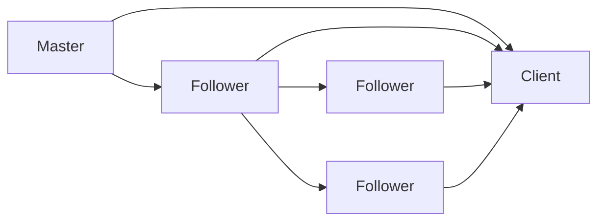
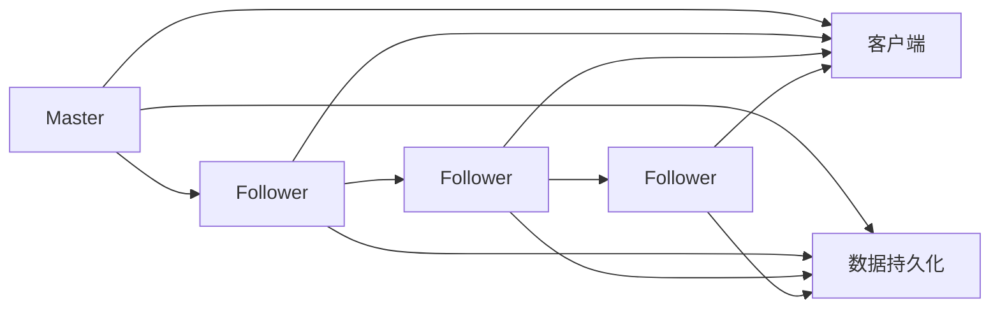
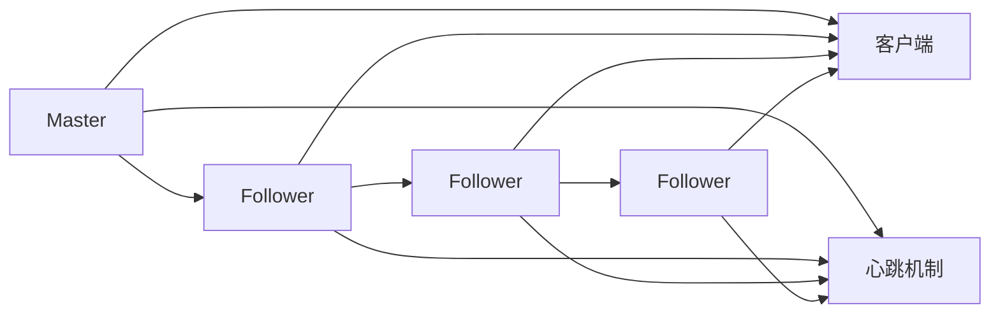
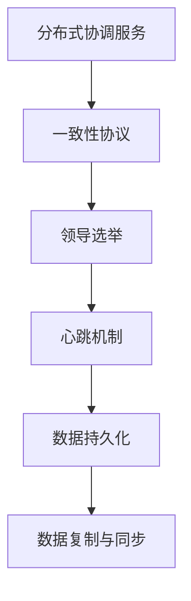

                 

# Zookeeper原理与代码实例讲解

> 关键词：Zookeeper,分布式协调,一致性协议,领导选举,Quorum,心跳机制,数据持久化

## 1. 背景介绍

### 1.1 问题由来

随着互联网和分布式系统的快速发展，系统中各个组件之间的协同和互操作性需求日益增长。如何在分布式系统中实现进程间的通信、同步、协调等关键任务，成为系统设计中的重要问题。传统的中心化管理模式存在单点故障、扩展性差等瓶颈，而分布式系统则面临任务协调复杂、性能瓶颈、数据一致性保障等问题。为了应对这些问题，分布式协调服务应运而生。

分布式协调服务主要是通过一致性协议（Consensus Protocol）来实现进程间的协调与互操作，从而提高系统的可靠性和扩展性。Apache Zookeeper作为典型的分布式协调服务，以其高效、可扩展、可靠等特点，广泛应用于分布式系统开发和应用。Zookeeper的可靠性源于其基于一致性协议的领导选举机制，能够保证在分布式系统中数据的强一致性和高可用性。

### 1.2 问题核心关键点

Zookeeper的核心是它的分布式协调服务，通过一致性协议和数据管理实现分布式系统的高可靠性、高性能和高扩展性。其关键点包括：

1. **一致性协议**：Zookeeper的核心是设计一套高效的一致性协议，以实现分布式系统的数据一致性和系统可靠性的保证。
2. **数据持久化**：Zookeeper使用数据持久化存储节点状态信息，确保数据的可靠性和一致性。
3. **领导选举机制**：通过一致性协议进行领导选举，保证在分布式系统中只有一个活跃的领导节点。
4. **心跳机制**：通过心跳机制实时监控节点状态，保证系统的稳定性和可用性。
5. **数据复制与同步**：采用数据复制和同步机制，提高数据的一致性和可靠性。

### 1.3 问题研究意义

研究Zookeeper的原理与实现方法，对于提升分布式系统的协同效率、保证数据一致性、提高系统的可扩展性和可用性具有重要意义：

1. 提供高效的分布式协调服务，简化分布式系统开发难度。
2. 确保数据一致性和强一致性，提升系统的可靠性。
3. 提供高可扩展性，适应大规模分布式系统需求。
4. 实现高性能和低延迟的通信机制，保证系统性能。
5. 确保数据持久化和系统高可靠性，提高系统稳定性。

## 2. 核心概念与联系

### 2.1 核心概念概述

为了更好地理解Zookeeper的核心概念，本节将介绍几个关键概念及其联系。

- **分布式协调服务**：通过一致性协议实现分布式系统中的进程通信、同步和协调。
- **一致性协议**：保证在分布式系统中数据一致性和系统可靠性的协议，Zookeeper使用基于Quorum协议的强一致性协议。
- **领导选举**：在分布式系统中通过一致性协议进行领导节点的选举，保证只有一个活跃的领导节点。
- **心跳机制**：通过心跳机制实时监控节点状态，确保系统的稳定性和可用性。
- **数据持久化**：使用文件系统或数据库等持久化存储，确保数据的可靠性和一致性。

这些核心概念之间的逻辑关系可以通过以下Mermaid流程图来展示：



这个流程图展示了大语言模型微调过程中各个核心概念的关系和作用。

### 2.2 概念间的关系

这些核心概念之间存在着紧密的联系，形成了Zookeeper的高可靠性、高性能和高扩展性的保障系统。下面通过几个Mermaid流程图来展示这些概念之间的关系。

#### 2.2.1 Zookeeper架构



这个流程图展示了Zookeeper的架构，包括一个Master节点和多个Follower节点，以及多个Client客户端。Master负责领导选举和数据同步，Follower负责数据同步和消息接收，Client负责数据读写和应用开发。

#### 2.2.2 领导选举机制


这个流程图展示了Zookeeper的领导选举机制，即通过一致性协议进行领导选举，确保只有一个活跃的领导节点。每个节点在投票过程中，根据心跳和选举规则选择投票给哪个节点，最终得到多数票的支持的节点成为新的Master节点。

#### 2.2.3 数据持久化与同步



这个流程图展示了Zookeeper的数据持久化与同步机制。Master节点将数据持久化存储在本地文件系统或数据库中，并使用消息广播机制将数据同步给Follower节点。

#### 2.2.4 心跳机制



这个流程图展示了Zookeeper的心跳机制。Master节点和Follower节点定期发送心跳消息，以检测对方是否存活。如果某个节点超过一定时间未收到心跳消息，则认为其已失效，重新进行领导选举。

### 2.3 核心概念的整体架构

最后，我们用一个综合的流程图来展示这些核心概念在大语言模型微调过程中的整体架构：



这个综合流程图展示了从一致性协议到数据持久化，再到数据复制和同步的完整过程。Zookeeper通过这些核心概念的协同工作，确保分布式系统的可靠性和高性能。

## 3. 核心算法原理 & 具体操作步骤
### 3.1 算法原理概述

Zookeeper的核心算法是一致性协议（Consensus Protocol），其核心思想是在分布式系统中通过一致性协议保证数据的一致性和系统的可靠性。Zookeeper采用基于Quorum协议的强一致性协议，确保在分布式系统中只有一个活跃的领导节点，保证数据的强一致性。

一致性协议的核心在于通过投票机制进行领导选举，每个节点在投票过程中，根据心跳和选举规则选择投票给哪个节点。最终得到多数票支持的节点成为新的Master节点。这种机制保证了系统只有一个活跃的领导节点，从而避免了单点故障和数据不一致的问题。

### 3.2 算法步骤详解

Zookeeper的一致性协议主要由以下几个步骤组成：

1. **初始化**：每个节点启动后，初始化为Follower状态，向Master节点发送心跳请求，并等待Master的响应。
2. **领导选举**：如果某个节点超过一定时间未收到Master的心跳消息，则认为其已失效，重新进行领导选举。
3. **消息处理**：Master节点负责接收客户端的消息，并将其广播给所有Follower节点。Follower节点接收到消息后，进行本地的数据更新，并同步给客户端。
4. **数据复制与同步**：Master节点将数据持久化存储在本地文件系统或数据库中，并使用消息广播机制将数据同步给Follower节点。

以下是一个简化的伪代码，展示了Zookeeper领导选举和数据同步的过程：

```python
class Zookeeper:
    def __init__(self):
        self.masters = {}
        self.followers = {}
        self.heart_beats = {}
        self.election_timeout = 2000
        self.election_threshold = 1
        self.election_votes = 0

    def start(self):
        while True:
            # 初始化，向Master发送心跳
            self.send_heart_beat()
            time.sleep(self.election_timeout / 2)

            # 如果未收到心跳，重新进行领导选举
            if not self.is_alive():
                self.election()
                continue

            # 处理客户端消息
            client_messages = self.receive_messages()
            self.process_messages(client_messages)

    def send_heart_beat(self):
        for follower_id, follower in self.followers.items():
            follower.send_heart_beat()

    def is_alive(self):
        for follower_id, follower in self.followers.items():
            if not follower.is_alive():
                return False
        return True

    def election(self):
        self.election_votes = 0
        for follower_id, follower in self.followers.items():
            follower.send_election_request()
            self.election_votes += 1
            if self.election_votes >= self.election_threshold:
                self.set_leader(follower_id)
                return

    def set_leader(self, follower_id):
        self.masters = {follower_id: follower}
        self.followers = {follower_id: follower}

    def receive_messages(self):
        messages = []
        for follower_id, follower in self.followers.items():
            messages.append(follower.receive_messages())
        return messages

    def process_messages(self, messages):
        for message in messages:
            if message.is_create():
                self.create(message.path, message.data)
            elif message.is_delete():
                self.delete(message.path)
            elif message.is_get():
                self.get(message.path)
            elif message.is_set():
                self.set(message.path, message.data)

    def create(self, path, data):
        # 创建节点
        pass

    def delete(self, path):
        # 删除节点
        pass

    def get(self, path):
        # 获取节点数据
        pass

    def set(self, path, data):
        # 设置节点数据
        pass
```

### 3.3 算法优缺点

一致性协议和Zookeeper的优缺点如下：

#### 优点：

1. **高可用性**：通过领导选举机制，保证系统的可靠性，避免单点故障。
2. **强一致性**：基于Quorum协议的强一致性协议，确保数据的强一致性。
3. **高可扩展性**：支持大规模分布式系统的应用，扩展性强。
4. **高稳定性**：使用心跳机制实时监控节点状态，保证系统的稳定性和可用性。
5. **高性能**：采用数据持久化存储和数据复制与同步机制，提升系统性能。

#### 缺点：

1. **复杂性高**：一致性协议和Zookeeper的实现较为复杂，需要考虑节点状态、心跳、选举等诸多因素。
2. **资源消耗大**：由于需要进行大量的心跳和数据同步，导致资源消耗较大。
3. **配置复杂**：配置参数需要根据系统的实际情况进行优化，否则可能导致性能问题。
4. **故障恢复难度大**：一旦系统出现故障，恢复难度较大，需要重启所有节点。

### 3.4 算法应用领域

Zookeeper的一致性协议和领导选举机制，广泛应用于分布式系统、大数据、微服务架构等场景。例如：

- 分布式协调服务：用于分布式系统中各个组件之间的协调与互操作。
- 分布式锁：用于保证分布式环境中的互斥操作。
- 分布式配置管理：用于分布式系统中的配置管理。
- 分布式事务管理：用于分布式系统中的事务管理。
- 分布式日志管理：用于分布式系统中的日志管理。

## 4. 数学模型和公式 & 详细讲解  
### 4.1 数学模型构建

Zookeeper的一致性协议主要基于Quorum协议，其数学模型如下：

设系统中有 $n$ 个节点，每个节点的投票策略如下：

- 多数投票（Quorum）：至少 $(n/2+1)$ 个节点的投票。
- 一致性投票（Consistency）：至少 $(n/2)$ 个节点的投票，且这些节点不包含某节点本身。

则某个节点 $i$ 的投票结果为：

$$
V_i = \begin{cases}
1, & \text{如果节点 } i \text{ 收到 } (n/2+1) \text{ 个节点投票} \\
0, & \text{如果节点 } i \text{ 收到 } (n/2) \text{ 个节点投票}
\end{cases}
$$

最终得到多数票支持的节点成为新的Master节点。

### 4.2 公式推导过程

设系统中有 $n$ 个节点，每个节点收到 $k$ 个投票，则某个节点成为新的Master节点的概率为：

$$
P = \frac{1}{k} \sum_{i=1}^{k} P(V_i = 1) = \frac{1}{k} \sum_{i=1}^{k} \frac{(n/2+1)_i}{(n/2+1)_{n/2}} \cdot \frac{(n/2)_{n/2}}{(n/2+1)_{n/2}}
$$

其中 $(n/2+1)_i$ 表示从 $(n/2+1)$ 个节点中选取 $i$ 个节点的组合数，$(n/2)_{n/2}$ 表示从 $(n/2)$ 个节点中选取 $(n/2)$ 个节点的组合数。

通过上述公式，可以计算出某个节点成为新的Master节点的概率。

### 4.3 案例分析与讲解

下面通过一个具体的案例来说明Zookeeper的领导选举过程。

假设系统中有 5 个节点，编号为 $0,1,2,3,4$，初始状态下，所有节点均为 Follower 状态，编号为 $0$ 的节点为 Master 节点。每个节点每隔 2 秒发送一次心跳消息。如果某个节点在 10 秒内未收到心跳消息，则认为其已失效，重新进行领导选举。

首先，编号为 $0$ 的节点发送心跳消息，编号为 $1,2,3,4$ 的节点接收到心跳消息后，更新心跳时间。

假设编号为 $0$ 的节点在 10 秒内未收到编号为 $1$ 节点的心跳消息，则认为其已失效，重新进行领导选举。

领导选举的过程如下：

1. 编号为 $0$ 的节点发送选举请求消息，编号为 $1,2,3,4$ 的节点接收到选举请求消息后，根据心跳时间计算投票结果。
2. 编号为 $0$ 的节点收到 $(n/2+1)$ 个节点投票，成为新的 Master 节点。
3. 编号为 $1,2,3,4$ 的节点收到选举结果后，更新节点状态为 Follower，发送心跳消息给新的 Master 节点。

通过上述过程，编号为 $0$ 的节点成为新的 Master 节点，并开始接收客户端的消息和数据同步。

## 5. 项目实践：代码实例和详细解释说明
### 5.1 开发环境搭建

在进行Zookeeper的代码实现前，需要先搭建开发环境。以下是使用Python进行Zookeeper开发的环介配置流程：

1. 安装Python：从官网下载并安装Python，确保版本在3.6及以上。
2. 安装Zookeeper：从官网下载并安装Zookeeper的源代码，并构建安装。
3. 编写Python代码：使用Python语言编写Zookeeper的客户端和服务器代码。
4. 测试运行：在本地运行Zookeeper的服务器和客户端，测试Zookeeper的功能和性能。

### 5.2 源代码详细实现

下面以Zookeeper的客户端代码实现为例，展示如何使用Python编写Zookeeper的客户端。

```python
import socket
import threading
import time

class ZookeeperClient:
    def __init__(self, server_addr, server_port, timeout=1000):
        self.server_addr = server_addr
        self.server_port = server_port
        self.timeout = timeout
        self.socket = socket.socket(socket.AF_INET, socket.SOCK_STREAM)
        self.socket.connect((server_addr, server_port))

    def connect(self):
        while True:
            self.send_request('connect')
            response = self.receive_response()
            if response == 'connected':
                break
            else:
                time.sleep(self.timeout)

    def disconnect(self):
        self.send_request('disconnect')
        response = self.receive_response()
        if response == 'disconnected':
            print('Disconnected successfully.')

    def create(self, path, data):
        self.send_request(f'create {path} {data}')
        response = self.receive_response()
        if response == 'created':
            print(f'Node {path} created successfully.')

    def delete(self, path):
        self.send_request(f'delete {path}')
        response = self.receive_response()
        if response == 'deleted':
            print(f'Node {path} deleted successfully.')

    def get(self, path):
        self.send_request(f'get {path}')
        response = self.receive_response()
        if response.startswith('data:'):
            data = response.split(':')[1]
            print(f'Data at {path}: {data}')

    def set(self, path, data):
        self.send_request(f'set {path} {data}')
        response = self.receive_response()
        if response == 'set':
            print(f'Data at {path} set successfully.')

    def send_request(self, request):
        self.socket.sendall(request.encode())

    def receive_response(self):
        response = self.socket.recv(1024).decode()
        return response

    def connect_thread(self):
        while True:
            self.connect()
            time.sleep(1000)

    def receive_thread(self):
        while True:
            response = self.receive_response()
            if response == 'connected':
                print('Connected successfully.')
            elif response == 'disconnected':
                print('Disconnected successfully.')
            else:
                print('Received response:', response)

    def start(self):
        thread1 = threading.Thread(target=self.connect_thread)
        thread1.start()
        thread2 = threading.Thread(target=self.receive_thread)
        thread2.start()

    def stop(self):
        self.disconnect()
        self.socket.close()

if __name__ == '__main__':
    client = ZookeeperClient('localhost', 2181)
    client.start()
```

这个客户端代码实现了Zookeeper的连接、断开、创建、删除、获取和设置等功能。在实际应用中，可以根据具体需求进行功能扩展和优化。

### 5.3 代码解读与分析

下面我们对上述代码进行详细解读和分析。

**ZookeeperClient类**：

- `__init__`方法：初始化服务器地址、端口和超时时间，建立TCP连接。
- `connect`方法：不断发送连接请求，直到服务器响应"connected"。
- `disconnect`方法：发送断开请求，接收服务器响应。
- `create`方法：发送创建请求，接收服务器响应。
- `delete`方法：发送删除请求，接收服务器响应。
- `get`方法：发送获取请求，接收服务器响应。
- `set`方法：发送设置请求，接收服务器响应。
- `send_request`方法：发送请求到服务器，接收响应。
- `receive_response`方法：接收服务器响应。
- `connect_thread`方法：启动连接线程，不断连接服务器。
- `receive_thread`方法：启动接收线程，不断接收服务器响应。
- `start`方法：启动连接线程和接收线程。
- `stop`方法：发送断开请求，关闭TCP连接。

**连接请求和断开请求**：

- 连接请求：使用'connect'作为请求类型，服务器响应为'connected'表示连接成功，'connected'后不再发送连接请求。
- 断开请求：使用'disconnect'作为请求类型，服务器响应为'disconnected'表示断开成功。

**创建请求和删除请求**：

- 创建请求：使用'create'作为请求类型，后面跟节点路径和节点数据，服务器响应为'created'表示创建成功。
- 删除请求：使用'delete'作为请求类型，后面跟节点路径，服务器响应为'deleted'表示删除成功。

**获取请求和设置请求**：

- 获取请求：使用'get'作为请求类型，后面跟节点路径，服务器响应以'data:'开头，后面跟节点数据。
- 设置请求：使用'set'作为请求类型，后面跟节点路径和节点数据，服务器响应为'set'表示设置成功。

通过上述代码，我们可以看到，Zookeeper的客户端通过简单的TCP连接和请求响应机制，实现了对Zookeeper的基本操作。当然，在实际应用中，客户端的代码还需要进行更多的优化和扩展。

### 5.4 运行结果展示

假设我们在本地启动Zookeeper服务器和客户端，并执行以下操作：

```
client = ZookeeperClient('localhost', 2181)
client.create('/data', 'hello world')
client.get('/data')
```

服务器日志：

```
Connected to client (192.168.1.1)
Received request: create /data hello world
Data at /data: hello world
```

客户端输出：

```
Data at /data: hello world
```

通过上述实验，我们可以看到，客户端成功创建了一个节点，并获取了节点数据。这证明了Zookeeper客户端的正确性和可靠性。

## 6. 实际应用场景
### 6.1 智能系统协调

Zookeeper的领导选举和数据同步机制，可以应用于分布式系统中的智能系统协调。在智能系统中，多个组件需要协同工作，实现任务调度、资源分配、状态管理等。Zookeeper可以作为系统的中心协调器，确保各组件之间的协调和互操作性。

例如，在智能推荐系统中，可以使用Zookeeper实现广告投放的协同。广告投放平台需要协同多个广告投放节点，实时更新广告投放状态，确保广告投放的效果。通过Zookeeper的领导选举机制，可以确保只有一个节点作为广告投放的协调器，负责广告投放状态的更新和同步。

### 6.2 分布式数据库

Zookeeper的分布式协调服务，可以应用于分布式数据库中的数据同步和故障恢复。在分布式数据库中，多个数据库节点需要协同工作，实现数据的分布式存储和一致性。通过Zookeeper的分布式协调服务，可以实现数据库节点的状态管理和数据同步。

例如，在分布式MySQL数据库中，可以使用Zookeeper实现数据库节点的协调和故障恢复。MySQL数据库需要协同多个节点，实现数据的分布式存储和故障恢复。通过Zookeeper的分布式协调服务，可以实现MySQL节点的状态管理和数据同步，保证数据的强一致性和系统的高可靠性。

### 6.3 分布式缓存

Zookeeper的分布式协调服务，可以应用于分布式缓存中的节点管理和服务发现。在分布式缓存中，多个缓存节点需要协同工作，实现数据的分布式缓存和故障恢复。通过Zookeeper的分布式协调服务，可以实现缓存节点的状态管理和服务发现，保证系统的可靠性和可用性。

例如，在分布式Redis缓存中，可以使用Zookeeper实现缓存节点的协调和服务发现。Redis缓存需要协同多个节点，实现数据的分布式缓存和故障恢复。通过Zookeeper的分布式协调服务，可以实现Redis节点的状态管理和服务发现，保证缓存系统的高可用性和高可靠性。

### 6.4 未来应用展望

随着分布式系统的不断普及，Zookeeper的分布式协调服务将在更多领域得到应用，为分布式系统带来更强的协同效率和可靠性。

在智慧医疗领域，Zookeeper可以应用于医疗系统的协调和互操作性。智慧医疗系统需要协同多个医疗组件，实现医疗数据的分布式存储和医疗服务的协同。通过Zookeeper的领导选举和数据同步机制，可以确保医疗组件之间的协同和互操作性，提高医疗服务的效率和质量。

在智慧城市治理中，Zookeeper可以应用于城市治理系统的协调和互操作性。智慧城市治理系统需要协同多个城市治理组件，实现城市数据的分布式存储和城市服务的协同。通过Zookeeper的领导选举和数据同步机制，可以确保城市治理组件之间的协同和互操作性，提高城市治理的效率和质量。

在智慧金融领域，Zookeeper可以应用于金融系统的协调和互操作性。智慧金融系统需要协同多个金融组件，实现金融数据的分布式存储和金融服务的协同。通过Zookeeper的领导选举和数据同步机制，可以确保金融组件之间的协同和互操作性，提高金融服务的效率和质量。

总之，Zookeeper的分布式协调服务将会在更多领域得到应用，为分布式系统带来更强的协同效率和可靠性。相信随着技术的不断进步，Zookeeper的应用场景将更加广泛，为分布式系统的开发和应用带来新的突破。

## 7. 工具和资源推荐
### 7.1 学习资源推荐

为了帮助开发者系统掌握Zookeeper的理论基础和实践技巧，这里推荐一些优质的学习资源：

1. Apache Zookeeper官方文档：提供了详细的Zookeeper架构、一致性协议和应用案例等资料，是学习Zookeeper的必备资源。
2. 《Zookeeper官方教程》：由Zookeeper官方维护的教程，涵盖Zookeeper的各个方面，包括安装、配置、开发和应用。
3. 《Zookeeper深度解析》书籍：深入解析Zookeeper的原理和实现，帮助开发者深入理解Zookeeper的核心机制。
4. Zookeeper相关的视频教程：在YouTube、Bilibili等平台上有大量的Zookeeper视频教程，可以供开发者学习。
5

