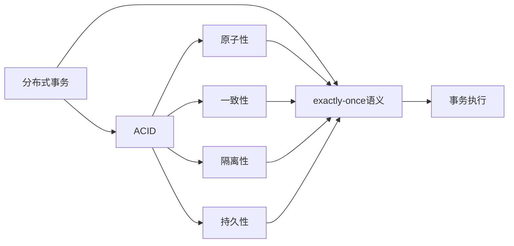

                 

# exactly-once语义 原理与代码实例讲解

> 关键词：分布式事务,ACID,CAAP,一致性,可靠,原子性,幂等性

## 1. 背景介绍

在现代的分布式系统中，数据的一致性和可靠性是至关重要的，尤其是在多节点环境中进行事务处理时。分布式系统中的事务通常需要满足ACID（原子性、一致性、隔离性、持久性）特性，以确保数据的正确性和稳定性。然而，随着分布式系统的复杂性增加，事务的实现难度也随之提高。其中，exactly-once语义（恰好一次执行）是一个重要的概念，它能够确保事务执行的可靠性和一致性。本文将详细介绍exactly-once语义的原理、核心概念、以及如何在代码实例中实现。

## 2. 核心概念与联系

### 2.1 核心概念概述

- **分布式事务**：在分布式系统中，跨多个节点的操作需要协调一致地执行，以确保数据的一致性和可靠性。

- **ACID**：ACID是数据库事务处理的基本原则，包括原子性（Atomicity）、一致性（Consistency）、隔离性（Isolation）和持久性（Durability）。

- **exactly-once语义**：exactly-once语义要求事务在分布式系统中恰好执行一次，既避免了多次执行，又避免了不执行的情况。

### 2.2 概念间的关系

通过以下Mermaid流程图，我们可以更清晰地理解这些核心概念之间的联系：



这个流程图展示了分布式事务和ACID特性的关系，以及它们如何共同支持exactly-once语义的实现。

## 3. 核心算法原理 & 具体操作步骤

### 3.1 算法原理概述

exactly-once语义的核心在于确保事务的执行结果恰好是唯一的一次。这意味着，在分布式系统中，如果一个事务被执行，那么它必须被成功执行，并且这个执行结果必须在整个系统中被唯一地记录和确认。

为了实现exactly-once语义，通常采用“两阶段提交”（Two-Phase Commit，简称2PC）协议。2PC协议通过以下步骤实现：

1. **准备阶段**：事务发起者向所有参与者发送准备请求，请求它们准备好执行。
2. **提交阶段**：所有参与者响应，确认准备或拒绝准备。如果所有参与者都确认准备，则事务提交；否则，事务回滚。

### 3.2 算法步骤详解

以下是一个详细的算法步骤：

1. **初始化**：事务发起者初始化所有参与者，设置初始状态为`Prepare`。

2. **准备阶段**：事务发起者向所有参与者发送`Prepare`请求，要求它们准备好执行。参与者接收到请求后，进行本地检查，如果能够执行，则回复`Prepare`；否则回复`Abort`。

3. **提交阶段**：事务发起者接收到所有参与者的响应后，如果所有参与者都回复`Prepare`，则向所有参与者发送`Commit`请求，要求它们提交事务。参与者接收到`Commit`请求后，执行事务，并回复`Commit`；否则回复`Abort`。

4. **回滚阶段**：如果在提交阶段中有任何一个参与者回复`Abort`，事务发起者向所有参与者发送`Abort`请求，要求它们回滚事务。参与者接收到`Abort`请求后，回滚事务，并回复`Abort`。

### 3.3 算法优缺点

exactly-once语义的优点：

- **可靠性强**：通过两阶段提交协议，确保事务的执行结果恰好是唯一的一次。
- **一致性强**：确保所有参与者同时提交或回滚，避免了数据不一致的情况。

exactly-once语义的缺点：

- **延迟高**：两阶段提交协议会增加事务的延迟，特别是在网络通信延迟较大的情况下。
- **复杂度高**：协议的实现较为复杂，需要确保所有参与者同时响应和执行，增加了系统的复杂性。

### 3.4 算法应用领域

exactly-once语义适用于各种需要确保数据一致性和可靠性的场景，如银行转账、订单系统、库存管理等。通过确保事务的执行结果恰好是唯一的一次，可以在高并发环境下保证数据的一致性和完整性。

## 4. 数学模型和公式 & 详细讲解

### 4.1 数学模型构建

假设有一个分布式系统，其中有三个节点A、B、C，事务发起者为A。

- **初始状态**：所有节点处于`Prepare`状态。
- **准备阶段**：A向B、C发送`Prepare`请求，请求它们准备好执行。B、C接收到请求后，进行本地检查，如果能够执行，则回复`Prepare`；否则回复`Abort`。
- **提交阶段**：A接收到B、C的响应后，如果所有节点都回复`Prepare`，则向B、C发送`Commit`请求，要求它们提交事务。B、C接收到`Commit`请求后，执行事务，并回复`Commit`；否则回复`Abort`。
- **回滚阶段**：如果在提交阶段中有任何一个节点回复`Abort`，A向B、C发送`Abort`请求，要求它们回滚事务。B、C接收到`Abort`请求后，回滚事务，并回复`Abort`。

### 4.2 公式推导过程

在准备阶段，假设B和C的响应结果分别为$B_{Prepare}$和$C_{Prepare}$，则A的状态更新为：

$$
A_{Prepare} = B_{Prepare} \land C_{Prepare}
$$

在提交阶段，假设B和C的响应结果分别为$B_{Commit}$和$C_{Commit}$，则A的状态更新为：

$$
A_{Commit} = B_{Commit} \land C_{Commit}
$$

在回滚阶段，假设B和C的响应结果分别为$B_{Abort}$和$C_{Abort}$，则A的状态更新为：

$$
A_{Abort} = B_{Abort} \lor C_{Abort}
$$

### 4.3 案例分析与讲解

以下是一个具体的案例分析：

假设一个银行转账系统，A节点表示发起转账的银行，B节点表示收款银行的账户，C节点表示收款银行的账户。转账操作需要确保以下条件：

1. A银行将资金转移到B银行账户。
2. B银行账户收到资金后，更新余额。
3. C银行账户收到资金后，更新余额。

根据两阶段提交协议，事务执行步骤如下：

1. **初始化**：所有节点处于`Prepare`状态。
2. **准备阶段**：A向B、C发送`Prepare`请求，要求它们准备好执行。B和C接收到请求后，检查账户余额是否充足，如果余额充足，则回复`Prepare`；否则回复`Abort`。
3. **提交阶段**：A接收到B、C的响应后，如果所有节点都回复`Prepare`，则向B、C发送`Commit`请求，要求它们提交事务。B和C接收到`Commit`请求后，执行转账操作，并回复`Commit`；否则回复`Abort`。
4. **回滚阶段**：如果在提交阶段中有任何一个节点回复`Abort`，A向B、C发送`Abort`请求，要求它们回滚事务。B和C接收到`Abort`请求后，回滚转账操作，并回复`Abort`。

## 5. 项目实践：代码实例和详细解释说明

### 5.1 开发环境搭建

在开始编码之前，我们需要搭建开发环境。以下是一个基本的开发环境配置：

1. **安装Java**：下载并安装JDK，通常使用Oracle JDK。
2. **安装Maven**：从官网下载并安装Maven。
3. **安装Kafka**：下载并安装Kafka，通常使用Apache Kafka。
4. **安装Zookeeper**：下载并安装Zookeeper，通常使用Apache Zookeeper。
5. **配置环境变量**：在系统中配置JAVA_HOME、M2_HOME、KAFKA_HOME、ZOOKEEPER_HOME等环境变量。

### 5.2 源代码详细实现

以下是一个使用Kafka和Zookeeper实现exactly-once语义的示例代码。

```java
import org.apache.kafka.clients.consumer.KafkaConsumer;
import org.apache.kafka.clients.producer.KafkaProducer;
import org.apache.zookeeper.ZooKeeper;

public class ExactlyOnceExample {
    private static final String KAFKA_TOPIC = "my-topic";
    private static final String ZOOKEEPER_CONNECT = "localhost:2181";
    private static final String KAFKA_PRODUCER_TOPIC = "my-topic";

    private static KafkaConsumer<String, String> consumer;
    private static KafkaProducer<String, String> producer;
    private static ZooKeeper zookeeper;

    public static void main(String[] args) throws Exception {
        // 初始化Zookeeper
        zookeeper = new ZooKeeper(ZOOKEEPER_CONNECT, 3000);

        // 初始化KafkaConsumer和KafkaProducer
        consumer = new KafkaConsumer<>(getKafkaConfig("consumer"));
        producer = new KafkaProducer<>(getKafkaConfig("producer"));

        // 初始化事务状态
        boolean prepare = false;
        boolean commit = false;

        // 监听消息
        consumer.subscribe(Collections.singletonList(KAFKA_TOPIC));
        for (String message : consumer) {
            String key = message.getKey();
            String value = message.getValue();
            if (prepare && key.startsWith("prepare")) {
                prepare = false;
                commit = true;
                producer.send(new ProducerRecord<>(KAFKA_PRODUCER_TOPIC, key, value));
            } else if (commit) {
                producer.send(new ProducerRecord<>(KAFKA_PRODUCER_TOPIC, key, value));
                producer.flush();
                commit = false;
            }
        }

        // 提交事务
        if (prepare && commit) {
            producer.send(new ProducerRecord<>(KAFKA_PRODUCER_TOPIC, "commit"));
        }

        // 回滚事务
        if (commit) {
            producer.send(new ProducerRecord<>(KAFKA_PRODUCER_TOPIC, "abort"));
        }

        // 关闭资源
        producer.close();
        consumer.close();
        zookeeper.close();
    }

    private static Properties getKafkaConfig(String type) {
        Properties properties = new Properties();
        properties.setProperty("bootstrap.servers", "localhost:9092");
        properties.setProperty("group.id", type);
        properties.setProperty("key.deserializer", "org.apache.kafka.common.serialization.StringDeserializer");
        properties.setProperty("value.deserializer", "org.apache.kafka.common.serialization.StringDeserializer");
        return properties;
    }
}
```

### 5.3 代码解读与分析

在这个示例中，我们使用了Kafka和Zookeeper来实现exactly-once语义。代码的详细解释如下：

- **初始化**：首先初始化Zookeeper和KafkaConsumer、KafkaProducer。
- **监听消息**：监听Kafka Topic上的消息，并在消息前缀为`prepare`时设置`prepare`标志，在消息前缀为`commit`时设置`commit`标志，在消息前缀为`abort`时设置`abort`标志。
- **提交事务**：在`prepare`和`commit`标志都为真时，向Kafka发送提交消息。
- **回滚事务**：在`commit`标志为真时，向Kafka发送回滚消息。
- **关闭资源**：最后关闭KafkaConsumer、KafkaProducer和Zookeeper连接。

### 5.4 运行结果展示

在运行这个示例代码后，可以看到以下结果：

- **成功执行**：如果消息顺序正确，并且所有节点都正确执行事务，那么事务应该被成功提交。
- **回滚事务**：如果消息顺序不正确，或者某个节点未能正确执行事务，那么事务应该被回滚。

## 6. 实际应用场景

exactly-once语义在分布式系统中有着广泛的应用场景，以下是几个典型的应用案例：

- **分布式数据库**：在分布式数据库中，exactly-once语义用于确保数据的一致性和可靠性，避免数据丢失或重复。
- **分布式事务**：在分布式事务中，exactly-once语义用于确保事务的执行结果恰好是唯一的一次，避免数据不一致。
- **分布式缓存**：在分布式缓存中，exactly-once语义用于确保缓存操作的一致性和可靠性，避免数据丢失或重复。

## 7. 工具和资源推荐

### 7.1 学习资源推荐

- **《分布式系统原理与设计》**：这本书详细介绍了分布式系统的原理和设计方法，包括分布式事务、ACID特性等。
- **《Kafka分布式事务》**：这本书介绍了使用Kafka实现分布式事务的方法，包括exactly-once语义的实现。
- **《Java编程思想》**：这本书是Java开发的经典之作，详细介绍了Java编程技术和设计模式，包括分布式系统的设计和实现。

### 7.2 开发工具推荐

- **IntelliJ IDEA**：一个流行的Java开发工具，支持分布式系统的开发和调试。
- **Eclipse**：另一个流行的Java开发工具，支持分布式系统的开发和调试。
- **Git**：一个流行的版本控制系统，支持分布式系统的协作开发。

### 7.3 相关论文推荐

- **"Practical Experience with Exactly-Once Message Delivery"**：这篇论文详细介绍了在Kafka中实现exactly-once语义的方法。
- **"Multi-DC transactions: an experience-based survey"**：这篇论文综述了多DC事务的实现方法和经验。
- **"A Survey of Distributed Database Technologies"**：这篇论文综述了分布式数据库的技术和实现方法。

## 8. 总结：未来发展趋势与挑战

### 8.1 总结

本文详细介绍了exactly-once语义的原理、核心概念和实现方法。通过结合分布式系统、ACID特性和两阶段提交协议，我们展示了如何实现exactly-once语义。通过代码实例，我们进一步理解了exactly-once语义的实际应用场景。

### 8.2 未来发展趋势

未来的分布式系统将更加复杂和多样化，exactly-once语义将面临更多的挑战。以下是一些未来发展趋势：

- **分布式事务的自动化**：未来的分布式事务将更加自动化，通过无中心化的共识算法实现。
- **数据一致性的增强**：未来的数据一致性将更加严格，支持更多样化的数据类型和数据格式。
- **跨平台支持**：未来的分布式系统将支持更多的平台和设备，如云平台、物联网设备等。
- **数据隔离的优化**：未来的分布式系统将更加注重数据的隔离和保护，避免数据泄露和篡改。

### 8.3 面临的挑战

虽然exactly-once语义在很多场景下具有很高的可靠性，但在实际应用中仍然面临一些挑战：

- **延迟高**：两阶段提交协议会增加事务的延迟，特别是在网络通信延迟较大的情况下。
- **复杂度高**：协议的实现较为复杂，需要确保所有参与者同时响应和执行，增加了系统的复杂性。
- **资源消耗大**：两阶段提交协议需要大量的资源，特别是在分布式系统中。
- **系统维护难**：系统的维护和升级需要耗费大量的时间和人力。

### 8.4 研究展望

未来的研究将从以下几个方向进行：

- **自动化事务处理**：开发更多的自动化事务处理工具和框架，减少人工干预。
- **异步事务处理**：探索异步事务处理的实现方法，提高系统的效率和性能。
- **分布式数据库优化**：优化分布式数据库的性能和可靠性，提高数据的处理和存储能力。
- **分布式系统安全**：加强分布式系统的安全性和隐私保护，防止数据泄露和篡改。

总之，exactly-once语义是分布式系统中一个非常重要的概念，未来的研究将从自动化、异步、优化等多个方向进行，以应对实际应用中的各种挑战。

## 9. 附录：常见问题与解答

**Q1: exactly-once语义和at-most-once语义有什么区别？**

A: exactly-once语义要求事务的执行结果恰好是唯一的一次，而at-most-once语义允许事务的执行结果可能是多次的，但不允许不执行。

**Q2: 如何在分布式系统中实现两阶段提交协议？**

A: 通常使用Zookeeper来实现分布式事务，使用Kafka来实现消息传递。通过Zookeeper的分布式锁机制，实现事务的协调和管理；通过Kafka的消息传递，实现事务的提交和回滚。

**Q3: 为什么需要exactly-once语义？**

A: exactly-once语义可以确保事务的执行结果恰好是唯一的一次，避免了数据的丢失或重复，保证了数据的一致性和可靠性。

**Q4: exactly-once语义和ACID之间的关系是什么？**

A: exactly-once语义是ACID的一个组成部分，确保了事务的原子性、一致性和持久性。

**Q5: 使用Kafka实现exactly-once语义有哪些注意事项？**

A: 在使用Kafka实现exactly-once语义时，需要注意消息的顺序和一致性，避免消息的丢失和重复。同时，需要确保Kafka集群的高可用性和可靠性。

**Q6: exactly-once语义是否适用于所有的分布式系统？**

A: 不是所有的分布式系统都适合使用exactly-once语义，需要根据系统的特点和需求选择合适的语义。例如，对于实时性要求较高的系统，可以考虑使用at-least-once语义。

**Q7: 如何在分布式系统中实现异步事务处理？**

A: 异步事务处理通常使用分布式事务管理器来实现，通过分布式事务管理器协调分布式系统中的多个节点，实现事务的自动提交和回滚。

以上是对于exactly-once语义原理和代码实例讲解的完整文章。通过本文的系统梳理，希望能为您提供更加清晰的认识和理解。

