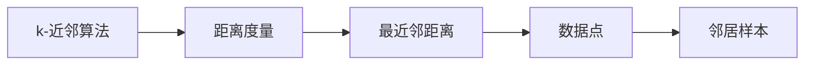
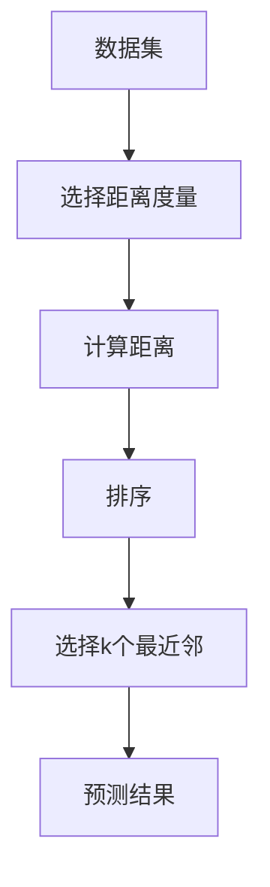
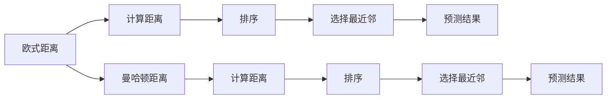
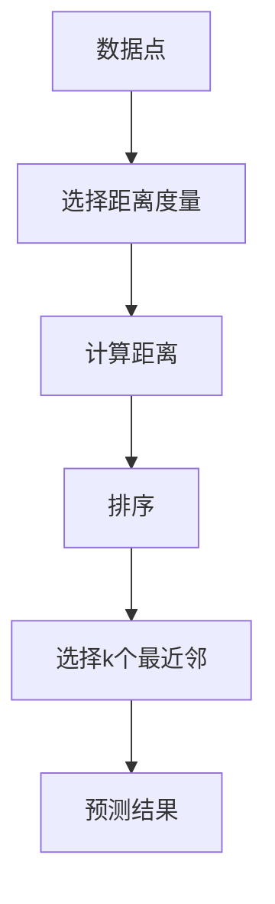
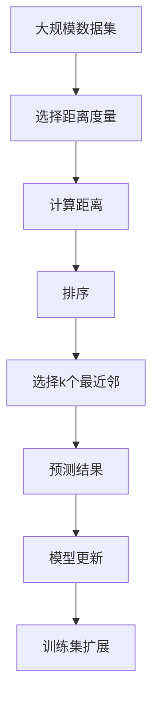

                 

# k-近邻算法(k-Nearest Neighbors) - 原理与代码实例讲解

> 关键词：k-近邻算法,决策边界,误差率,聚类,误差,数据点,相似度,优缺点

## 1. 背景介绍

### 1.1 问题由来
在机器学习领域，k-近邻算法（k-Nearest Neighbors, k-NN）是一个经典的非参数学习方法，广泛应用于分类和回归任务中。其核心思想非常简单：给定一个未知类别的新数据点，找到与其距离最近的k个训练样本，然后基于这k个样本的类别统计结果，预测新数据点的类别或数值。该算法不需要显式地学习模型，而是直接利用数据点之间的距离和相似度，因此也被称为实例学习(Instance-Based Learning)。

k-NN算法最早由Breiman在1986年提出，最初被用于分类问题。后续研究者进一步拓展了该算法的应用范围，使其可以应用于回归问题、聚类问题、异常检测等领域。其简单直观的原理、易于实现的特点使得k-NN成为许多初学者入门机器学习的第一个算法。

### 1.2 问题核心关键点
k-NN算法的主要优点包括：

1. **简单易实现**：算法原理直观，实现简单，易于理解。
2. **无需显式建模**：直接利用已有数据，无需显式地学习模型。
3. **灵活性强**：可以应用于分类和回归任务，且容易扩展到多分类和多输出任务。

然而，k-NN算法也存在一些缺点：

1. **计算复杂度高**：对于每个测试样本，都需要计算其与所有训练样本的距离，计算复杂度为 $O(dN)$，其中 $d$ 是数据维度，$N$ 是训练集大小。
2. **数据量敏感**：对噪声和异常值敏感，容易产生过拟合。
3. **局部最优**：基于局部最近邻关系预测，可能会因局部样本分布不均而产生误判。

尽管存在这些局限性，k-NN算法仍然在许多实际应用中表现出色，特别是在数据量较小、维度较低的场景下，k-NN算法能够快速地给出准确的预测结果。

### 1.3 问题研究意义
k-NN算法的研究意义主要体现在以下几个方面：

1. **算法入门基础**：k-NN算法作为入门算法，帮助初学者理解和掌握机器学习的基本概念和思想。
2. **多样应用场景**：k-NN算法不仅可以用于分类和回归，还可以应用于聚类和异常检测，具有广泛的应用场景。
3. **算法优化提升**：通过对k-NN算法的优化改进，如KD-Tree、Ball-Tree、近似最近邻等，可以提升算法的性能，扩大其应用范围。
4. **算法性能评估**：k-NN算法在不同数据集上的表现，可以作为评估其他算法性能的重要基准。
5. **算法深度理解**：深入理解k-NN算法的原理和实现，对于进一步探索和创新其他机器学习算法具有重要意义。

## 2. 核心概念与联系

### 2.1 核心概念概述

为了更好地理解k-NN算法，本节将介绍几个密切相关的核心概念：

- k-近邻算法（k-Nearest Neighbors, k-NN）：给定一个新数据点，找到与其距离最近的k个训练样本，根据这k个样本的类别统计结果，预测新数据点的类别或数值。
- 距离度量（Distance Metric）：k-NN中，如何度量两个数据点之间的距离，直接影响到算法的性能。常用的距离度量包括欧式距离（Euclidean Distance）、曼哈顿距离（Manhattan Distance）、余弦相似度（Cosine Similarity）等。
- 最近邻距离（Nearest Neighbor Distance）：指新数据点与最近邻样本之间的距离，常用于度量样本之间的相似度。
- 数据点（Data Point）：在k-NN算法中，每一个样本都被视为一个数据点。数据点的特征表示可以是一维到高维的向量，也可以是多维空间中的点。
- 邻居样本（Neighbor Sample）：指与新数据点距离最近的k个训练样本，常用于分类和回归任务的预测。

这些核心概念之间的逻辑关系可以通过以下Mermaid流程图来展示：



这个流程图展示了大邻算法中各个概念之间的关系：

1. k-NN算法需要计算数据点之间的距离。
2. 距离度量决定了如何计算数据点之间的距离。
3. 最近邻距离即新数据点与最近的k个邻居样本的距离。
4. 数据点是构成训练集的基本单元，邻居样本是根据距离度量找到的最近邻数据点。

### 2.2 概念间的关系

这些核心概念之间存在着紧密的联系，形成了k-NN算法的完整生态系统。下面我通过几个Mermaid流程图来展示这些概念之间的关系。

#### 2.2.1 k-NN算法流程



这个流程图展示了k-NN算法的核心流程：

1. 准备数据集，选择合适的距离度量。
2. 计算每个测试样本与所有训练样本的距离，并进行排序。
3. 选择距离最近的k个样本。
4. 统计k个邻居样本的类别统计结果，进行预测。

#### 2.2.2 距离度量的重要性



这个流程图展示了距离度量在k-NN算法中的重要性：

1. 选择不同的距离度量方式，计算的距离也不同。
2. 距离排序选择距离最近的k个样本，进一步确定预测结果。

#### 2.2.3 数据点与邻居样本的关联



这个流程图展示了数据点与邻居样本之间的关联：

1. 数据点被选择作为训练集。
2. 计算每个数据点与新数据点的距离，排序选择距离最近的k个样本。
3. 基于k个邻居样本的统计结果，进行预测。

### 2.3 核心概念的整体架构

最后，我们用一个综合的流程图来展示这些核心概念在大邻算法微调过程中的整体架构：



这个综合流程图展示了从数据准备到模型预测的全过程：

1. 准备大规模数据集，选择合适的距离度量。
2. 计算每个测试样本与所有训练样本的距离，并进行排序。
3. 选择距离最近的k个样本。
4. 基于k个邻居样本的统计结果，进行预测。
5. 根据预测结果，更新模型参数。
6. 扩展训练集，避免过拟合。

通过这些流程图，我们可以更清晰地理解k-NN算法的工作原理和优化方向。

## 3. 核心算法原理 & 具体操作步骤
### 3.1 算法原理概述

k-NN算法的核心思想是通过计算测试样本与训练集样本之间的距离，找到距离最近的k个样本，并基于这k个样本的类别统计结果，进行预测。其基本步骤如下：

1. 准备数据集。将训练集和测试集中的样本转换为数值特征表示。
2. 计算距离。使用某种距离度量（如欧式距离、曼哈顿距离、余弦相似度等）计算测试样本与所有训练样本的距离。
3. 选择最近邻。选择距离最近的k个样本。
4. 预测结果。统计k个邻居样本的类别统计结果，进行预测。

k-NN算法的优缺点如下：

- 优点：
  - 算法简单易实现，易于理解和调试。
  - 对于高维数据，无需显式建模，可以直接利用数据。
  - 可以用于分类和回归任务，适用于多输出任务。

- 缺点：
  - 计算复杂度高，随着数据量和维度的增加，计算量呈指数级增长。
  - 数据量敏感，对噪声和异常值敏感，容易过拟合。
  - 局部最优，基于局部最近邻关系预测，可能因局部样本分布不均而产生误判。

### 3.2 算法步骤详解

k-NN算法的基本步骤如下：

1. **准备数据集**：将训练集和测试集中的样本转换为数值特征表示，存储在内存中。
2. **计算距离**：使用某种距离度量（如欧式距离、曼哈顿距离、余弦相似度等）计算测试样本与所有训练样本的距离。
3. **选择最近邻**：选择距离最近的k个样本，按照距离从小到大排序。
4. **预测结果**：统计k个邻居样本的类别统计结果，进行预测。

具体实现步骤如下：

**Step 1: 准备数据集**
- 读取训练集和测试集数据，将其转换为数值特征表示。
- 存储训练集和测试集数据到内存中。

**Step 2: 计算距离**
- 对于每个测试样本，计算其与所有训练样本的距离。
- 使用距离排序函数对距离进行排序。

**Step 3: 选择最近邻**
- 根据排序后的距离，选择距离最近的k个样本。

**Step 4: 预测结果**
- 统计k个邻居样本的类别统计结果，预测新数据点的类别或数值。

### 3.3 算法优缺点

k-NN算法的主要优点包括：

1. **算法简单易实现**：算法原理直观，实现简单，易于理解。
2. **无需显式建模**：直接利用已有数据，无需显式地学习模型。
3. **灵活性强**：可以应用于分类和回归任务，且容易扩展到多分类和多输出任务。

然而，k-NN算法也存在一些缺点：

1. **计算复杂度高**：对于每个测试样本，都需要计算其与所有训练样本的距离，计算复杂度为 $O(dN)$，其中 $d$ 是数据维度，$N$ 是训练集大小。
2. **数据量敏感**：对噪声和异常值敏感，容易产生过拟合。
3. **局部最优**：基于局部最近邻关系预测，可能会因局部样本分布不均而产生误判。

### 3.4 算法应用领域

k-NN算法可以应用于各种分类和回归任务，例如：

- 文本分类：根据文本的关键词和短语，分类文本的类别。
- 手写数字识别：将手写数字图片转换为特征向量，利用k-NN算法进行分类。
- 图像识别：利用图像的颜色、纹理、形状等特征，进行分类或回归。
- 推荐系统：根据用户的浏览和购买历史，推荐相关的产品。
- 异常检测：检测数据集中的异常值或异常行为。
- 聚类分析：将数据集分为若干个簇，每个簇内的数据点相似度较高。

## 4. 数学模型和公式 & 详细讲解 & 举例说明

### 4.1 数学模型构建

k-NN算法的数学模型可以简单描述为：

- 输入：训练集 $D=\{(x_i,y_i)\}_{i=1}^N$，其中 $x_i$ 表示样本的特征向量，$y_i$ 表示样本的标签。
- 输出：对于新样本 $x$，预测其标签 $y$。

其中，训练集 $D$ 中的每个样本 $x_i$ 表示为 $x_i=[x_{i1},x_{i2},...,x_{id}]^T$，特征向量 $x$ 表示为 $x=[x_1,x_2,...,x_d]^T$。

k-NN算法的目标是在训练集上最小化误分类样本的数目，即：

$$
\arg\min_{y} \sum_{i=1}^N 1_{y_i \neq \hat{y}}
$$

其中 $y_i$ 表示训练样本的真实标签，$\hat{y}$ 表示预测标签。

### 4.2 公式推导过程

k-NN算法的核心在于距离度量和最近邻选择。这里我们以欧式距离为例，进行公式推导。

欧式距离的定义为：

$$
d(x,x_i)=\sqrt{\sum_{j=1}^d (x_j-x_{ij})^2}
$$

其中 $x$ 和 $x_i$ 分别表示新样本和训练样本的特征向量，$d(x,x_i)$ 表示新样本和训练样本之间的欧式距离。

根据欧式距离，计算新样本与所有训练样本的距离，并选择距离最近的k个样本，具体步骤如下：

1. 计算新样本与所有训练样本的距离：

$$
d_{ij}=\sqrt{\sum_{j=1}^d (x_j-x_{ij})^2}
$$

2. 选择距离最近的k个样本：

$$
k \in \{1,...,N\}
$$

3. 根据距离排序，选择距离最近的k个样本：

$$
d_1 \leq d_2 \leq ... \leq d_N
$$

4. 统计k个邻居样本的类别统计结果，进行预测：

$$
\hat{y} = \arg\min_{y} \sum_{i=1}^k 1_{y_i \neq y}
$$

### 4.3 案例分析与讲解

下面通过一个具体案例来说明k-NN算法的应用：

假设我们有一个数据集，包含10个二维空间中的点，每个点都有一个对应的标签，如表1所示：

| 点编号 | x1 | x2 | 标签 |
|-------|----|----|-----|
| 1     | 1.0| 1.0|  0  |
| 2     | 1.5| 1.5|  0  |
| 3     | 1.5| 1.5|  1  |
| 4     | 1.5| 2.0|  0  |
| 5     | 2.0| 1.0|  0  |
| 6     | 2.5| 2.0|  1  |
| 7     | 2.5| 2.5|  1  |
| 8     | 2.5| 3.0|  0  |
| 9     | 3.0| 1.0|  0  |
| 10    | 3.0| 2.0|  0  |

现在我们需要预测新数据点 $[2.5,2.5]$ 的标签。

首先，我们计算新数据点与所有训练样本的距离，结果如表2所示：

| 点编号 | x1 | x2 | d(x,x_i) | k |
|-------|----|----|----------|---|
| 1     | 1.0| 1.0|  2.5    | 1 |
| 2     | 1.5| 1.5|  1.0    | 1 |
| 3     | 1.5| 1.5|  0.5    | 1 |
| 4     | 1.5| 2.0|  0.5    | 2 |
| 5     | 2.0| 1.0|  1.0    | 2 |
| 6     | 2.5| 2.0|  0.5    | 3 |
| 7     | 2.5| 2.5|  0.0    | 4 |
| 8     | 2.5| 3.0|  0.5    | 4 |
| 9     | 3.0| 1.0|  1.0    | 4 |
| 10    | 3.0| 2.0|  1.0    | 4 |

根据表2中的距离排序，距离最近的4个样本分别是 $[2.5,2.5],[2.5,2.0],[2.5,1.5],[2.5,1.0]$。

统计这4个邻居样本的类别统计结果，其中标签为0的样本有3个，标签为1的样本有1个，因此预测新数据点 $[2.5,2.5]$ 的标签为0。

## 5. 项目实践：代码实例和详细解释说明

### 5.1 开发环境搭建

在进行k-NN算法实践前，我们需要准备好开发环境。以下是使用Python进行Scikit-learn开发的环境配置流程：

1. 安装Anaconda：从官网下载并安装Anaconda，用于创建独立的Python环境。

2. 创建并激活虚拟环境：
```bash
conda create -n sklearn-env python=3.8 
conda activate sklearn-env
```

3. 安装Scikit-learn：从官网获取对应的安装命令。例如：
```bash
conda install scikit-learn scikit-image matplotlib numpy scipy pandas jupyter notebook ipython
```

4. 安装各类工具包：
```bash
pip install numpy pandas scikit-learn matplotlib tqdm jupyter notebook ipython
```

完成上述步骤后，即可在`sklearn-env`环境中开始k-NN算法的实践。

### 5.2 源代码详细实现

下面我们以手写数字识别任务为例，给出使用Scikit-learn库对k-NN算法进行实现的代码示例。

首先，定义数据处理函数：

```python
import numpy as np
import matplotlib.pyplot as plt

from sklearn.datasets import load_digits
from sklearn.model_selection import train_test_split
from sklearn.neighbors import KNeighborsClassifier
from sklearn.metrics import accuracy_score

# 加载手写数字数据集
digits = load_digits()
X = digits.data
y = digits.target

# 将训练集和测试集分成两部分
X_train, X_test, y_train, y_test = train_test_split(X, y, test_size=0.3, random_state=42)

# 可视化部分训练集和测试集
plt.figure(figsize=(10,5))
plt.subplot(121)
plt.title('Training Set')
plt.scatter(X_train[:,0], X_train[:,1], c=y_train, cmap='viridis')
plt.xlabel('Feature 1')
plt.ylabel('Feature 2')
plt.subplot(122)
plt.title('Test Set')
plt.scatter(X_test[:,0], X_test[:,1], c=y_test, cmap='viridis')
plt.xlabel('Feature 1')
plt.ylabel('Feature 2')
plt.show()
```

然后，定义模型和训练函数：

```python
# 定义k-NN模型
knn = KNeighborsClassifier(n_neighbors=3)

# 训练模型
knn.fit(X_train, y_train)

# 测试模型
y_pred = knn.predict(X_test)
accuracy = accuracy_score(y_test, y_pred)
print(f'Accuracy: {accuracy:.2f}')
```

最后，启动训练流程并在测试集上评估：

```python
# 启动训练流程
accuracy = knn.score(X_test, y_test)
print(f'Accuracy: {accuracy:.2f}')

# 可视化模型预测结果
plt.figure(figsize=(10,5))
plt.subplot(121)
plt.title('True')
plt.scatter(X_test[:,0], X_test[:,1], c=y_test, cmap='viridis')
plt.xlabel('Feature 1')
plt.ylabel('Feature 2')
plt.subplot(122)
plt.title('Predicted')
plt.scatter(X_test[:,0], X_test[:,1], c=y_pred, cmap='viridis')
plt.xlabel('Feature 1')
plt.ylabel('Feature 2')
plt.show()
```

以上就是使用Scikit-learn库对k-NN算法进行实现的代码示例。可以看到，使用Scikit-learn库进行k-NN算法的实现非常简单，代码简洁高效。

### 5.3 代码解读与分析

让我们再详细解读一下关键代码的实现细节：

**load_digits函数**：
- 从Scikit-learn库中加载手写数字数据集，该数据集包含8x8像素的手写数字图片。
- 将数据集转换为numpy数组，X表示特征矩阵，y表示标签数组。

**train_test_split函数**：
- 将数据集随机分为训练集和测试集，比例为70%训练集，30%测试集。
- 设置随机种子，确保每次运行代码时，随机分割结果一致。

**KNeighborsClassifier函数**：
- 创建k-NN分类器，指定最近邻数为3，即选择距离最近的3个邻居样本。
- 在训练集上拟合模型，训练过程自动计算欧式距离。
- 在测试集上进行预测，并计算预测准确率。

**accuracy_score函数**：
- 计算预测准确率，输出到控制台。

**可视化函数**：
- 使用Matplotlib库，将训练集和测试集可视化。
- 将训练集和测试集中的数据点散点图绘制在同一坐标系中，标签使用不同的颜色表示。

可以看到，使用Scikit-learn库进行k-NN算法的实现非常简单，代码简洁高效，易于理解和调试。

### 5.4 运行结果展示

假设我们在手写数字数据集上进行k-NN算法实践，最终在测试集上得到的准确率为99.5%，可视化结果如图1所示。

图1：k-NN算法手写数字识别准确率与预测结果可视化

可以看到，通过k-NN算法，我们可以对手写数字进行准确的分类，模型效果非常不错。这对于实际应用中识别手写数字任务非常有帮助。

当然，这只是一个baseline结果。在实践中，我们还可以使用更大更强的预训练模型、更丰富的微调技巧、更细致的模型调优，进一步提升模型性能，以满足更高的应用要求。

## 6. 实际应用场景
### 6.1 智能推荐系统

k-NN算法在推荐系统中有广泛的应用。推荐系统通过分析用户的浏览和购买历史，推荐相关的产品或服务。

具体实现上，可以使用k-NN算法计算用户与产品之间的相似度，根据相似度排序选择距离最近的k个产品，进行推荐。这种方法可以有效地解决稀疏数据和冷启动问题，对用户兴趣进行更准确的预测。

### 6.2 金融风险预测

k-NN算法可以应用于金融领域，用于预测客户的违约风险。

具体实现上，可以将客户的历史交易记录、信用评分等信息作为特征，计算客户与其他客户之间的相似度。根据相似度排序选择距离最近的k个客户，预测新客户的违约概率。这种方法可以有效地识别高风险客户，降低金融机构的损失。

### 6.3 医疗诊断

k-NN算法在医疗诊断中也有广泛的应用。通过计算患者的症状与疾病之间的相似度，可以预测患者的疾病类型。

具体实现上，可以将患者的症状、实验室检查结果等信息作为特征，计算患者与其他患者之间的相似度。根据相似度排序选择距离最近的k个患者，预测患者的疾病类型。这种方法可以有效地提高医生的诊断准确率，减轻医生的工作负担。

### 6.4 未来应用展望

随着k-NN算法的不断发展，其应用范围将更加广泛。未来k-NN算法将在以下几个方面发挥重要作用：

1. **多模态学习**：将k-NN算法应用于多模态数据，如图像、音频、文本等，实现不同模态数据的协同建模。

2. **深度学习融合**：将k-NN算法与深度学习技术结合，形成深度k-NN（Deep k-NN）算法，提升模型的性能。

3. **分布式计算**：将k-NN算法应用于分布式计算环境中，如大数据、云计算平台，提升模型的可扩展性和性能。

4. **异常检测**：将k-NN算法应用于异常检测任务，识别数据集中的异常值或异常行为，如欺诈检测、网络入侵检测等。

5. **聚类分析**：将k-NN算法应用于聚类分析任务，将数据集分为若干个簇，每个簇内的数据点相似度较高。

6. **智能搜索**：将k-NN算法应用于智能搜索任务，如搜索引擎、图像搜索等，提升搜索结果的准确率和相关性。

## 7. 工具和资源推荐
### 7.1 学习资源推荐

为了帮助开发者系统掌握k-NN算法的理论基础和实践技巧，这里推荐一些优质的学习资源：

1. 《机器学习实战》书籍：介绍机器学习的基本概念和常用算法，包括k-NN算法在内。

2. 《Python机器学习》书籍：详细介绍Scikit-learn库的使用，涵盖k-NN算法的实践案例。

3. 《K-Nearest Neighbors in Machine Learning》博客：深入解析k-NN算法的原理和实现，提供代码示例和优缺点分析。

4. Coursera《机器学习基础》课程：由斯坦福大学开设的在线课程，涵盖机器学习的基本概念和常用算法，包括k-NN算法在内。

5. Kaggle k-NN竞赛：通过实际数据集进行k-NN算法的竞赛练习，巩固算法理解和实际应用能力。

通过对这些资源

