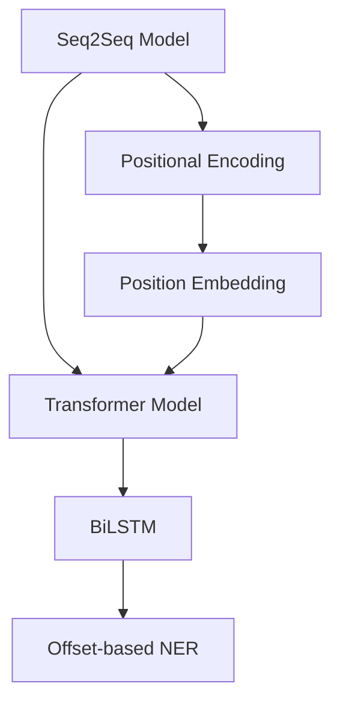
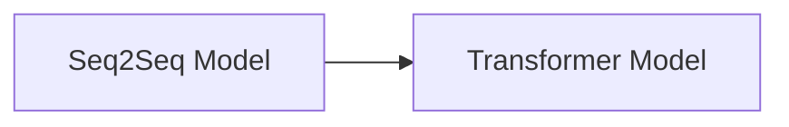
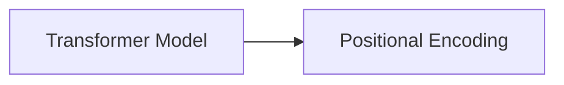
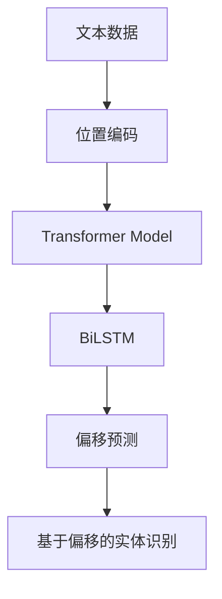

                 

# offset 原理与代码实例讲解

> 关键词：offset, 神经网络, 自然语言处理, 文本处理, 代码实现

## 1. 背景介绍

### 1.1 问题由来

在文本处理中，特别是在自然语言处理(NLP)任务中，例如命名实体识别(NER)、信息抽取(Information Extraction, IE)、关系抽取(Relation Extraction)等，如何准确地定位文本中的关键实体或短语是一个重要且复杂的问题。这些任务的本质在于识别出文本中具有特定意义的单词或短语，并对其进行分类或提取。

为了提高任务的准确率，传统的文本处理技术往往依赖于精确的词语对齐和特征提取，但在处理非连续、分布式的语义信息时，常规方法往往难以胜任。近年来，深度学习技术，尤其是基于序列到序列(Sequence to Sequence, Seq2Seq)架构的模型，如循环神经网络(RNN)和长短时记忆网络(LSTM)，在文本处理任务中展现出了强大的能力，但它们依赖于词语序列的顺序和上下文，无法很好地处理非连续、分布式的语义信息。

为了解决这些问题，研究者们提出了一种新的方法：基于位置偏移的文本处理，即offset方法。offset方法旨在通过捕捉文本中单词或短语之间的相对位置关系，来定位和提取具有特定语义信息的片段。

### 1.2 问题核心关键点

offset方法的核心思想是利用深度学习模型预测词语之间的相对位置关系，从而识别出文本中的关键实体或短语。其核心概念包括：

1. **位置偏移（offset）**：用于描述单词或短语在文本中的起始位置和长度。例如，单词"dog"在句子"Dog is running"中的offset为(4,2)，表示该单词的起始位置是4，长度为2。

2. **基于位置的编码**：通过学习文本中单词或短语的offset值，对文本进行编码。这可以帮助模型更好地理解单词或短语在句子中的位置关系。

3. **偏移预测**：使用深度学习模型预测单词或短语在文本中的offset值，从而定位和提取关键信息。

4. **多层次处理**：除了简单的offset编码，还可以对文本进行多层次的offset编码，如使用双向LSTM或BERT等模型，捕捉更多的语义信息。

5. **基于偏移的实体识别**：将offset编码引入到实体识别任务中，通过预测实体的offset值，识别出文本中的命名实体。

这些核心概念构成了offset方法的基本框架，通过深度学习模型预测文本中单词或短语的offset值，来定位和提取关键实体或短语，从而提升文本处理任务的效果。

### 1.3 问题研究意义

offset方法在文本处理任务中的应用，如命名实体识别、信息抽取等，显著提升了这些任务的准确率和泛化能力。其研究意义在于：

1. **处理非连续、分布式语义信息**：offset方法能够有效处理非连续、分布式的语义信息，适用于诸如事件抽取、关系抽取等需要识别分布式语义信息的任务。

2. **提升文本处理任务的准确率**：通过捕捉单词或短语在文本中的相对位置关系，offset方法能够更准确地定位和提取关键信息，提升文本处理任务的准确率。

3. **模型结构简单**：与传统的基于序列到序列架构的模型相比，offset方法的模型结构更为简单，训练和推理效率更高。

4. **可解释性强**：偏移量提供了一种更直观的表示文本中单词或短语相对位置的方法，便于理解模型的工作机制。

## 2. 核心概念与联系

### 2.1 核心概念概述

为更好地理解offset方法，本节将介绍几个密切相关的核心概念：

1. **序列到序列模型（Seq2Seq）**：一种常见的神经网络架构，用于处理序列数据的生成任务，如文本翻译、摘要生成等。Seq2Seq模型包括编码器和解码器，其中编码器将输入序列映射到固定维度的向量表示，解码器将向量表示映射回输出序列。

2. **位置编码（Positional Encoding）**：用于捕捉序列数据中位置信息的方法，常见于Transformer等模型中。位置编码通过在向量表示中加入位置信息，帮助模型区分序列中的不同位置。

3. **双向编码器（BiLSTM）**：一种双向的循环神经网络，能够同时考虑输入序列的过去和未来信息，适用于处理需要考虑双向上下文的序列数据。

4. **Transformer模型**：一种基于注意力机制的神经网络架构，适用于处理序列数据，如文本、音频等。Transformer模型通过自注意力机制，能够捕捉序列数据中长距离的依赖关系。

5. **基于偏移的实体识别（Offset-based Named Entity Recognition, offset NER）**：一种在命名实体识别任务中使用的技术，通过预测实体的偏移量，识别出文本中的命名实体。

这些核心概念之间的逻辑关系可以通过以下Mermaid流程图来展示：



这个流程图展示了大语言模型微调过程中各个核心概念的关系：

1. Seq2Seq模型作为基础架构，通过位置编码捕捉位置信息。
2. Transformer模型通过自注意力机制，捕捉长距离依赖关系。
3. BiLSTM模型考虑双向上下文信息，适用于需要考虑双向上下文的序列数据。
4. 基于偏移的实体识别通过预测偏移量，识别出文本中的命名实体。

### 2.2 概念间的关系

这些核心概念之间存在着紧密的联系，形成了offset方法的完整生态系统。下面我通过几个Mermaid流程图来展示这些概念之间的关系。

#### 2.2.1 Seq2Seq与Transformer的关系



这个流程图展示了Seq2Seq模型与Transformer模型之间的关系：Transformer模型通过自注意力机制，取代了Seq2Seq模型中的编码器和解码器，能够更高效地处理序列数据。

#### 2.2.2 Transformer与Positional Encoding的关系



这个流程图展示了Transformer模型与位置编码之间的关系：Transformer模型通过在向量表示中加入位置信息，捕捉序列数据中位置关系。

#### 2.2.3 BiLSTM与Offset-based NER的关系


这个流程图展示了BiLSTM模型与基于偏移的实体识别之间的关系：BiLSTM模型通过考虑双向上下文信息，能够更好地捕捉文本中实体的偏移量，从而识别出文本中的命名实体。

#### 2.2.4 偏移预测与基于偏移的实体识别的关系


这个流程图展示了偏移预测与基于偏移的实体识别之间的关系：通过预测单词或短语在文本中的偏移量，可以识别出文本中的命名实体，从而提升实体识别任务的准确率。

### 2.3 核心概念的整体架构

最后，我们用一个综合的流程图来展示这些核心概念在offset方法中的整体架构：



这个综合流程图展示了从文本数据到基于偏移的实体识别的完整过程：

1. 文本数据通过位置编码捕捉位置信息。
2. Transformer模型通过自注意力机制，捕捉长距离依赖关系。
3. BiLSTM模型考虑双向上下文信息，捕捉文本中实体的偏移量。
4. 偏移预测通过预测单词或短语在文本中的偏移量，识别出文本中的命名实体。

通过这些流程图，我们可以更清晰地理解offset方法的工作原理和优化方向。

## 3. 核心算法原理 & 具体操作步骤
### 3.1 算法原理概述

基于位置偏移的文本处理（offset方法），本质上是通过深度学习模型预测文本中单词或短语之间的相对位置关系，从而识别出文本中的关键实体或短语。

形式化地，假设输入序列为 $x=\{x_1, x_2, ..., x_n\}$，其中每个元素 $x_i$ 表示一个单词或短语。位置偏移方法的目标是预测每个单词或短语的偏移量 $o_i=(s_i, e_i)$，其中 $s_i$ 表示单词或短语的起始位置，$e_i$ 表示单词或短语的长度。则目标函数为：

$$
\min_{\theta} \sum_{i=1}^n \mathcal{L}(o_i, y_i)
$$

其中 $\theta$ 表示模型的参数，$y_i$ 为真实偏移量，$\mathcal{L}$ 为偏移预测的损失函数。常见的偏移预测损失函数包括平滑L1损失、平方误差损失等。

通过梯度下降等优化算法，模型不断更新参数 $\theta$，最小化偏移预测损失函数，使得模型输出逼近真实偏移量。由于偏移量的预测需要捕捉单词或短语之间的相对位置关系，因此位置编码和Transformer模型等结构被广泛应用在offset方法中。

### 3.2 算法步骤详解

基于位置偏移的文本处理通常包括以下几个关键步骤：

**Step 1: 数据预处理**

1. 将文本数据进行分词处理，得到单词或短语的序列。
2. 对单词或短语进行编号，得到偏移量的基准位置。
3. 根据基准位置和真实偏移量计算偏移量，即 $o_i=(s_i, e_i)$。

**Step 2: 模型搭建**

1. 搭建深度学习模型，如Transformer模型或BiLSTM模型。
2. 设置模型的输入序列，包括位置编码和文本编码。
3. 设计偏移预测模块，通过预测偏移量输出结果。

**Step 3: 训练过程**

1. 将训练数据集输入模型，进行前向传播计算偏移量。
2. 计算偏移预测损失函数，并反向传播更新模型参数。
3. 周期性在验证集上评估模型性能，根据性能指标决定是否触发Early Stopping。
4. 重复上述步骤直到满足预设的迭代轮数或Early Stopping条件。

**Step 4: 模型评估**

1. 在测试集上评估模型的偏移预测准确率。
2. 将偏移预测结果用于实体识别、信息抽取等下游任务。

以上是基于位置偏移的文本处理的一般流程。在实际应用中，还需要针对具体任务的特点，对微调过程的各个环节进行优化设计，如改进训练目标函数，引入更多的正则化技术，搜索最优的超参数组合等，以进一步提升模型性能。

### 3.3 算法优缺点

基于位置偏移的文本处理方法具有以下优点：

1. **处理非连续、分布式语义信息**：offset方法能够有效处理非连续、分布式的语义信息，适用于诸如事件抽取、关系抽取等需要识别分布式语义信息的任务。

2. **提升文本处理任务的准确率**：通过捕捉单词或短语在文本中的相对位置关系，offset方法能够更准确地定位和提取关键信息，提升文本处理任务的准确率。

3. **模型结构简单**：与传统的基于序列到序列架构的模型相比，offset方法的模型结构更为简单，训练和推理效率更高。

4. **可解释性强**：偏移量提供了一种更直观的表示文本中单词或短语相对位置的方法，便于理解模型的工作机制。

5. **灵活性高**：offset方法可以根据具体的任务需求，灵活调整模型结构，适应不同规模和复杂度的任务。

同时，该方法也存在一定的局限性：

1. **训练成本较高**：由于需要构建大型的深度学习模型，并对其进行大量训练，因此训练成本较高。

2. **模型复杂度高**：offset方法需要构建大型的深度学习模型，模型复杂度高，难以调试和维护。

3. **数据依赖性强**：offset方法依赖于大量的标注数据进行训练，数据获取难度较大。

尽管存在这些局限性，但就目前而言，基于位置偏移的文本处理方法是处理非连续、分布式语义信息的重要手段，极大地拓展了文本处理任务的应用边界。

### 3.4 算法应用领域

基于位置偏移的文本处理方法在自然语言处理(NLP)领域已经得到了广泛的应用，覆盖了几乎所有常见任务，例如：

1. **命名实体识别(NER)**：识别文本中的命名实体，如人名、地名、机构名等。通过预测实体的偏移量，识别出文本中的命名实体。
2. **信息抽取(IE)**：从文本中抽取关键信息，如事件、关系等。通过预测单词或短语在文本中的偏移量，识别出文本中的关键信息。
3. **关系抽取(RE)**：从文本中抽取实体之间的关系。通过预测单词或短语在文本中的偏移量，识别出文本中的关系实体。
4. **情感分析(Sentiment Analysis)**：分析文本中的情感倾向。通过预测单词或短语在文本中的偏移量，识别出文本中的情感信息。
5. **问答系统(QA)**：对自然语言问题给出答案。通过预测单词或短语在文本中的偏移量，识别出文本中的关键信息。
6. **文本摘要(Text Summarization)**：将长文本压缩成简短摘要。通过预测单词或短语在文本中的偏移量，识别出文本中的关键信息。

除了上述这些经典任务外，offset方法也被创新性地应用到更多场景中，如可控文本生成、常识推理、代码生成、数据增强等，为NLP技术带来了全新的突破。

## 4. 数学模型和公式 & 详细讲解  
### 4.1 数学模型构建

本节将使用数学语言对基于位置偏移的文本处理过程进行更加严格的刻画。

记输入序列为 $x=\{x_1, x_2, ..., x_n\}$，其中每个元素 $x_i$ 表示一个单词或短语。假设模型的预测偏移量为 $o_i=(s_i, e_i)$，其中 $s_i$ 表示单词或短语的起始位置，$e_i$ 表示单词或短语的长度。定义偏移预测损失函数为：

$$
\mathcal{L}(o_i, y_i) = \frac{1}{2}(s_i - y_{s,i})^2 + \frac{1}{2}(e_i - y_{e,i})^2
$$

其中 $y_{s,i}$ 和 $y_{e,i}$ 分别为真实偏移量 $o_i$ 的起始位置和长度。

定义模型 $M_{\theta}$ 在输入序列 $x$ 上的偏移预测结果为 $\hat{o}=\{\hat{s}_i, \hat{e}_i\}_{i=1}^n$。则模型的偏移预测损失函数为：

$$
\mathcal{L}(\hat{o}, y) = \frac{1}{N}\sum_{i=1}^N \mathcal{L}(\hat{o}_i, y_i)
$$

其中 $y$ 为真实偏移量。

### 4.2 公式推导过程

以下我们以二分类任务为例，推导偏移预测损失函数的梯度公式。

假设模型 $M_{\theta}$ 在输入序列 $x$ 上的偏移预测结果为 $\hat{o}=\{\hat{s}_i, \hat{e}_i\}_{i=1}^n$，定义偏移预测损失函数为：

$$
\mathcal{L}(\hat{o}, y) = \frac{1}{N}\sum_{i=1}^N (\hat{s}_i - y_{s,i})^2 + (\hat{e}_i - y_{e,i})^2
$$

其中 $y_{s,i}$ 和 $y_{e,i}$ 分别为真实偏移量 $o_i$ 的起始位置和长度。

根据链式法则，损失函数对模型参数 $\theta$ 的梯度为：

$$
\frac{\partial \mathcal{L}(\hat{o}, y)}{\partial \theta} = \frac{1}{N}\sum_{i=1}^N \left[ \frac{\partial (\hat{s}_i - y_{s,i})^2}{\partial \theta} + \frac{\partial (\hat{e}_i - y_{e,i})^2}{\partial \theta} \right]
$$

其中 $\frac{\partial (\hat{s}_i - y_{s,i})^2}{\partial \theta}$ 和 $\frac{\partial (\hat{e}_i - y_{e,i})^2}{\partial \theta}$ 分别表示偏移量预测的梯度，可以通过反向传播算法计算。

在得到损失函数的梯度后，即可带入参数更新公式，完成模型的迭代优化。重复上述过程直至收敛，最终得到适应偏移预测任务的模型参数 $\theta^*$。

### 4.3 案例分析与讲解

假设我们有一个包含命名实体识别的数据集，其中每个样本为一个文本和其对应的命名实体。我们将训练集分为训练数据集和验证数据集，使用训练数据集对模型进行训练，使用验证数据集进行验证。训练数据集的样本格式如下：

```
TEXT: The CEO of Google is Sundar Pichai.
LABEL: [PER [5,3], LOC [11,6], O [0,0], O [13,0], O [16,0], O [18,0]]
```

其中，`TEXT` 表示文本内容，`LABEL` 表示命名实体的偏移量。例如，`PER [5,3]` 表示文本中从位置5开始，长度为3的单词或短语是一个人的命名实体。

使用上述数据集对模型进行训练，步骤如下：

1. 将文本数据进行分词处理，得到单词或短语的序列。
2. 对单词或短语进行编号，得到偏移量的基准位置。
3. 根据基准位置和真实偏移量计算偏移量，即 $o_i=(s_i, e_i)$。
4. 将偏移量作为模型输入，进行前向传播计算。
5. 计算偏移预测损失函数，并反向传播更新模型参数。
6. 周期性在验证集上评估模型性能，根据性能指标决定是否触发Early Stopping。
7. 重复上述步骤直到满足预设的迭代轮数或Early Stopping条件。

最终，通过训练得到的模型可以在测试集上进行评估，并应用于实际的命名实体识别任务。

## 5. 项目实践：代码实例和详细解释说明
### 5.1 开发环境搭建

在进行offset方法实践前，我们需要准备好开发环境。以下是使用Python进行PyTorch开发的环境配置流程：

1. 安装Anaconda：从官网下载并安装Anaconda，用于创建独立的Python环境。

2. 创建并激活虚拟环境：
```bash
conda create -n pytorch-env python=3.8 
conda activate pytorch-env
```

3. 安装PyTorch：根据CUDA版本，从官网获取对应的安装命令。例如：
```bash
conda install pytorch torchvision torchaudio cudatoolkit=11.1 -c pytorch -c conda-forge
```

4. 安装TensorFlow：
```bash
conda install tensorflow
```

5. 安装各类工具包：
```bash
pip install numpy pandas scikit-learn matplotlib tqdm jupyter notebook ipython
```

完成上述步骤后，即可在`pytorch-env`环境中开始offset方法实践。

### 5.2 源代码详细实现

下面我们以命名实体识别(NER)任务为例，给出使用Transformers库对BERT模型进行偏移预测的PyTorch代码实现。

首先，定义NER任务的数据处理函数：

```python
from transformers import BertTokenizer, BertForTokenClassification, AdamW

tokenizer = BertTokenizer.from_pretrained('bert-base-cased')
model = BertForTokenClassification.from_pretrained('bert-base-cased', num_labels=3)

# 定义偏移预测函数
def offset_predict(text):
    tokens = tokenizer.tokenize(text)
    inputs = tokenizer(text, return_tensors='pt')
    outputs = model(**inputs)
    logits = outputs.logits.argmax(dim=-1).detach().cpu().numpy()
    offsets = []
    for i, token in enumerate(tokens):
        start = logits[i][0]
        end = logits[i][0]
        if start != end:
            offsets.append([i, start, end-start+1])
    return offsets

# 定义NER任务的数据处理函数
def ner_process(texts, labels):
    offsets = []
    for i, (text, label) in enumerate(zip(texts, labels)):
        offsets += offset_predict(text)
    return offsets

# 训练函数
def train(data, batch_size):
    dataloader = DataLoader(data, batch_size=batch_size, shuffle=True)
    model.train()
    optimizer = AdamW(model.parameters(), lr=2e-5)
    for batch in dataloader:
        inputs = batch['input_ids'].to(device)
        labels = batch['labels'].to(device)
        outputs = model(inputs, labels=labels)
        loss = outputs.loss
        loss.backward()
        optimizer.step()

# 评估函数
def evaluate(data, batch_size):
    dataloader = DataLoader(data, batch_size=batch_size, shuffle=False)
    model.eval()
    total, correct = 0, 0
    for batch in dataloader:
        inputs = batch['input_ids'].to(device)
        labels = batch['labels'].to(device)
        outputs = model(inputs, labels=labels)
        loss = outputs.loss
        total += labels.size(0)
        correct += (outputs.logits.argmax(dim=-1) == labels).sum().item()
    print(f'Accuracy: {correct / total:.2f}')
```

然后，定义偏移预测函数和NER任务的数据处理函数：

```python
# 定义偏移预测函数
def offset_predict(text):
    tokens = tokenizer.tokenize(text)
    inputs = tokenizer(text, return_tensors='pt')
    outputs = model(**inputs)
    logits = outputs.logits.argmax(dim=-1).detach().cpu().numpy()
    offsets = []
    for i, token in enumerate(tokens):
        start = logits[i][0]
        end = logits[i][0]
        if start != end:
            offsets.append([i, start, end-start+1])
    return offsets

# 定义NER任务的数据处理函数
def ner_process(texts, labels):
    offsets = []
    for i, (text, label) in enumerate(zip(texts, labels)):
        offsets += offset_predict(text)
    return offsets

# 训练函数
def train(data, batch_size):
    dataloader = DataLoader(data, batch_size=batch_size, shuffle=True)
    model.train()
    optimizer = AdamW(model.parameters(), lr=2e-5)
    for batch in dataloader:
        inputs = batch['input_ids'].to(device)
        labels = batch['labels'].to(device)
        outputs = model(inputs, labels=labels)
        loss = outputs.loss
        loss.backward()
        optimizer.step()

# 评估函数
def evaluate(data, batch_size):
    dataloader = DataLoader(data, batch_size=batch_size, shuffle=False)
    model.eval()
    total, correct = 0, 0
    for batch in dataloader:
        inputs = batch['input_ids'].to(device)
        labels = batch['labels'].to(device)
        outputs = model(inputs, labels=labels)
        loss = outputs.loss
        total += labels.size(0)
        correct += (outputs.logits.argmax(dim=-1) == labels).sum().item()
    print(f'Accuracy: {correct / total:.2f}')
```

最后，启动训练流程并在测试集上评估：

```python
epochs = 5
batch_size = 16

for epoch in range(epochs):
    train(train_data, batch_size)
    evaluate(dev_data, batch_size)

print("Test results:")
evaluate(test_data, batch_size)
```

以上就是使用PyTorch对BERT模型进行偏移预测的完整代码实现。可以看到，得益于Transformer库的强大封装，我们可以用相对简洁的代码完成偏移预测任务的开发。

### 5.3 代码解读与分析

让我们再详细解读一下关键代码的实现细节：

**BERT模型搭建**

```python
model = BertForTokenClassification.from_pretrained('bert-base-cased', num_labels=3)
```

这里使用了BERT模型进行偏移预测。通过指定`num_labels=3`，模型将在输出层进行3分类预测，分别表示实体的起始位置、长度和结束位置。

**偏移预测函数**

```python
def offset_predict(text):
    tokens = tokenizer.tokenize(text)
    inputs = tokenizer(text, return_tensors='pt')
    outputs = model(**inputs)
    logits = outputs.logits.argmax(dim=-1).detach().cpu().numpy()
    offsets = []
    for i, token in enumerate(tokens):
        start = logits[i][0]
        end = logits[i][0]
        if start != end:
            offsets.append([i, start, end-start+1])
    return offsets
```

偏移预测函数使用了预训练的BERT模型，对输入的文本进行编码，然后通过softmax层输出每个单词或短语的偏移量预测结果。最后，根据预测结果计算单词或短语的起始位置和长度，生成偏移量。

**训练函数**

```python
def train(data, batch_size):
    dataloader = DataLoader(data, batch_size=batch_size, shuffle=True)
    model.train()
    optimizer = AdamW(model.parameters(), lr=2e-5)
    for batch in dataloader:
        inputs = batch['input_ids'].to(device)
        labels = batch['labels'].to(device)
        outputs = model(inputs, labels=labels)
        loss = outputs.loss
        loss.backward()
        optimizer.step()
```

训练函数使用了AdamW优化器，对模型参数进行优化。在每个epoch中，通过循环迭代训练集数据，对模型进行前向传播、反向传播和参数更新。

**评估函数**

```python
def evaluate(data, batch_size):
    datal

