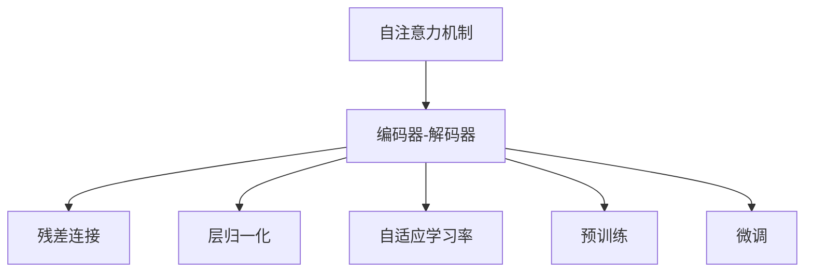
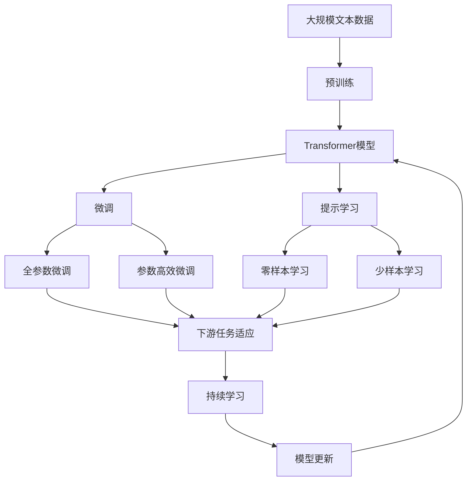

                 

## 1. 背景介绍

### 1.1 问题由来

Transformer是一种广泛应用于自然语言处理（Natural Language Processing, NLP）领域中的深度学习架构。自Attention机制被引入到深度学习中以来，Transformer模型在各种语言任务中取得了巨大的成功。该模型最初由Google Brain团队在2017年提出，并在随后的两年内广泛应用于机器翻译、文本生成、问答等任务。其核心思想是通过自注意力机制（Self-Attention）在文本序列之间直接建立关联，从而取代了传统的循环神经网络（Recurrent Neural Networks, RNNs）和卷积神经网络（Convolutional Neural Networks, CNNs）在序列建模上的局限性。

### 1.2 问题核心关键点

Transformer模型之所以能够在自然语言处理任务中表现出色，主要有以下几个关键点：

1. 自注意力机制：通过并行化的方式在文本序列之间建立关联，大大提升了模型的并行计算能力。
2. 编码器-解码器结构：利用多层编码器和解码器，能够处理不同长度的输入和输出序列。
3. 残差连接和层归一化：通过残差连接（Residual Connections）和层归一化（Layer Normalization）技术，缓解了梯度消失和爆炸问题。
4. 自适应学习率：使用自适应学习率方法（如Adaptive Moment Estimation, AdamW），在训练过程中自动调整学习率。
5. 预训练和微调：通过在大规模语料上预训练，然后在特定任务上进行微调，显著提升了模型性能。

这些关键点使得Transformer模型在各种语言任务中表现优异，推动了深度学习在自然语言处理领域的应用。

### 1.3 问题研究意义

Transformer模型的出现，不仅在学术界引起了广泛的关注，还在工业界得到了广泛的应用。其研究意义和应用价值主要体现在以下几个方面：

1. 提升了模型性能：Transformer模型在多项NLP任务上取得了最先进的结果，推动了自然语言处理技术的快速发展。
2. 降低了模型复杂度：相比于传统的RNNs和CNNs，Transformer模型通过自注意力机制简化了模型结构，降低了复杂度。
3. 加速了技术落地：Transformer模型的并行化特性，使得模型训练和推理过程更加高效，加速了技术在实际应用中的落地。
4. 促进了跨领域融合：Transformer模型的通用性，推动了NLP与其他领域的深度融合，如计算机视觉、语音处理等。
5. 激发了新研究方向：Transformer模型引发了众多前沿研究方向，如自监督学习、提示学习、少样本学习等。

## 2. 核心概念与联系

### 2.1 核心概念概述

为了更好地理解Transformer模型的原理和架构，我们先介绍几个关键概念：

- 自注意力机制（Self-Attention）：通过计算文本序列中每个位置的注意力权重，从而捕捉不同位置之间的关联。
- 编码器-解码器结构（Encoder-Decoder Architecture）：由多层编码器和解码器组成，能够处理不同长度的输入和输出序列。
- 残差连接（Residual Connection）：通过将输入与输出相加，缓解了梯度消失和爆炸问题。
- 层归一化（Layer Normalization）：对每一层的输入进行标准化，加速了模型训练。
- 自适应学习率（Adaptive Learning Rate）：根据梯度变化自动调整学习率，提高训练效率。
- 预训练（Pre-training）：在大规模无标签语料上训练模型，学习语言知识。
- 微调（Fine-tuning）：在预训练模型上添加任务特定的输出层，进行有监督学习。

这些核心概念构成了Transformer模型的基础架构，使其能够在自然语言处理任务中发挥强大的能力。

### 2.2 概念间的关系

这些核心概念之间存在着紧密的联系，形成了Transformer模型的完整生态系统。我们通过以下Mermaid流程图来展示它们之间的关系：



这个流程图展示了Transformer模型的核心概念及其之间的关系：

1. 自注意力机制是Transformer模型的核心，通过在文本序列中计算注意力权重，捕捉不同位置之间的关联。
2. 编码器-解码器结构由多层编码器和解码器组成，能够处理不同长度的输入和输出序列。
3. 残差连接和层归一化技术，通过并行化的方式，加速了模型的训练和推理过程。
4. 自适应学习率方法，根据梯度变化自动调整学习率，提高训练效率。
5. 预训练和微调方法，通过在大规模语料上预训练，然后在特定任务上进行微调，显著提升了模型性能。

这些概念共同构成了Transformer模型的学习范式，使其能够在各种自然语言处理任务中发挥强大的能力。

### 2.3 核心概念的整体架构

最后，我们用一个综合的流程图来展示这些核心概念在大语言模型微调过程中的整体架构：



这个综合流程图展示了从预训练到微调，再到持续学习的完整过程。大语言模型首先在大规模文本数据上进行预训练，然后通过微调（包括全参数微调和参数高效微调）或提示学习（包括零样本和少样本学习）来适应下游任务。最后，通过持续学习技术，模型可以不断学习新知识，同时保持已学习的知识，而不会出现灾难性遗忘。 通过这些流程图，我们可以更清晰地理解Transformer模型的微调过程中各个核心概念的关系和作用。

## 3. 核心算法原理 & 具体操作步骤

### 3.1 算法原理概述

Transformer模型的核心算法原理基于自注意力机制和编码器-解码器结构，通过多层自注意力和前馈神经网络（Feedforward Neural Networks）的组合，实现了文本序列之间的复杂关联。其原理如下：

1. 输入序列编码：将输入文本序列进行分词、向量化等预处理，生成一组输入特征向量。
2. 自注意力机制：通过计算注意力权重，捕捉不同位置之间的关联，生成一组注意力权重向量。
3. 多头自注意力：通过多头（Multi-Head）注意力机制，同时计算多个注意力权重向量，并合并成一个特征向量。
4. 前馈神经网络：通过一层或多层的全连接网络，对特征向量进行非线性变换，生成输出特征向量。
5. 层归一化：对每一层的输入进行标准化，加速模型训练。
6. 残差连接：将输入与输出相加，缓解梯度消失和爆炸问题。
7. 编码器-解码器结构：由多层编码器和解码器组成，能够处理不同长度的输入和输出序列。

### 3.2 算法步骤详解

Transformer模型的算法步骤如下：

1. 输入序列编码：将输入文本序列进行分词、向量化等预处理，生成一组输入特征向量。
2. 多头自注意力计算：计算每个位置的注意力权重向量，并将多个注意力权重向量合并成一个特征向量。
3. 前馈神经网络计算：对特征向量进行非线性变换，生成输出特征向量。
4. 残差连接和层归一化：将输入与输出相加，并对每一层的输入进行标准化，加速模型训练。
5. 堆叠多层自注意力和前馈神经网络：通过堆叠多层自注意力和前馈神经网络，实现复杂的文本序列建模。
6. 编码器-解码器结构：由多层编码器和解码器组成，能够处理不同长度的输入和输出序列。
7. 预训练和微调：在预训练模型上添加任务特定的输出层，进行有监督学习。

具体实现时，可以采用PyTorch等深度学习框架，实现上述步骤。以下是一个简单的PyTorch代码示例：

```python
import torch
import torch.nn as nn
import torch.nn.functional as F

class Transformer(nn.Module):
    def __init__(self, n_heads, n_features, d_model, d_ff, n_layers):
        super(Transformer, self).__init__()
        self.n_heads = n_heads
        self.n_features = n_features
        self.d_model = d_model
        self.d_ff = d_ff
        self.n_layers = n_layers
        
        self.embedding = nn.Embedding(n_features, d_model)
        self.pos_encoding = positional_encoding(n_features, d_model)
        self.layers = nn.ModuleList([TransformerLayer(d_model, d_ff) for _ in range(n_layers)])
        
    def forward(self, x):
        x = self.embedding(x) + self.pos_encoding
        x = F.relu(self.layers(x))
        return x
    
class TransformerLayer(nn.Module):
    def __init__(self, d_model, d_ff):
        super(TransformerLayer, self).__init__()
        self.attention = MultiHeadAttention(d_model)
        self.feedforward = Feedforward(d_model, d_ff)
        self.layer_norm = nn.LayerNorm(d_model)
        self.activation = nn.ReLU()
        self.residual = nn.Sequential(nn.Linear(d_model, d_model), nn.ReLU(), nn.Linear(d_model, d_model))
        
    def forward(self, x):
        attn_output = self.attention(x)
        ff_output = self.feedforward(self.layer_norm(x))
        x = self.layer_norm(x + self.residual(attn_output + ff_output))
        return x
    
class MultiHeadAttention(nn.Module):
    def __init__(self, d_model):
        super(MultiHeadAttention, self).__init__()
        self.d_model = d_model
        self.n_heads = d_model // 64
        self.W_Q = nn.Linear(d_model, self.n_heads * d_model)
        self.W_K = nn.Linear(d_model, self.n_heads * d_model)
        self.W_V = nn.Linear(d_model, self.n_heads * d_model)
        self.fc = nn.Linear(self.n_heads * d_model, d_model)
        
    def forward(self, x):
        Q = self.W_Q(x)
        K = self.W_K(x)
        V = self.W_V(x)
        
        Q = Q.view(Q.size(0), Q.size(1), self.n_heads, self.d_model // self.n_heads).permute(0, 2, 1, 3)
        K = K.view(K.size(0), K.size(1), self.n_heads, self.d_model // self.n_heads).permute(0, 2, 1, 3)
        V = V.view(V.size(0), V.size(1), self.n_heads, self.d_model // self.n_heads).permute(0, 2, 1, 3)
        
        energy = torch.bmm(Q, K.permute(0, 1, 3, 2))
        attention = F.softmax(energy, dim=-1)
        output = torch.bmm(attention, V)
        output = output.permute(0, 2, 1, 3).contiguous()
        output = self.fc(output)
        return output

class Feedforward(nn.Module):
    def __init__(self, d_model, d_ff):
        super(Feedforward, self).__init__()
        self.fc1 = nn.Linear(d_model, d_ff)
        self.fc2 = nn.Linear(d_ff, d_model)
        
    def forward(self, x):
        x = F.relu(self.fc1(x))
        x = self.fc2(x)
        return x
```

### 3.3 算法优缺点

Transformer模型在自然语言处理任务中表现优异，其优缺点如下：

优点：

1. 并行计算能力强：Transformer模型通过自注意力机制，能够并行计算多个位置的注意力权重，提高了模型的并行计算能力。
2. 结构简单：相比于传统的RNNs和CNNs，Transformer模型结构简单，易于实现和优化。
3. 训练效率高：Transformer模型通过残差连接和层归一化技术，缓解了梯度消失和爆炸问题，提高了模型的训练效率。
4. 泛化能力强：Transformer模型在大规模语料上预训练，具有较强的泛化能力，能够适应多种自然语言处理任务。

缺点：

1. 模型参数量大：由于Transformer模型通常具有大量的参数，对硬件资源要求较高。
2. 对长序列敏感：当输入序列过长时，Transformer模型容易出现梯度消失问题。
3. 难以理解：由于Transformer模型内部机制复杂，难以理解其内部工作原理和决策过程。
4. 依赖标注数据：Transformer模型的微调依赖大量的标注数据，标注成本较高。

尽管存在这些局限性，Transformer模型仍因其出色的性能，成为了自然语言处理领域的主流模型。

### 3.4 算法应用领域

Transformer模型在自然语言处理领域中有着广泛的应用，主要包括以下几个方面：

1. 机器翻译：利用编码器-解码器结构，将源语言文本翻译成目标语言文本。
2. 文本生成：通过自注意力机制，生成与输入文本相关的文本。
3. 问答系统：利用编码器-解码器结构，生成对输入问题的回答。
4. 文本摘要：通过自注意力机制，从长文本中提取重要信息，生成摘要。
5. 命名实体识别：利用编码器-解码器结构和注意力机制，识别文本中的命名实体。
6. 文本分类：利用编码器-解码器结构和注意力机制，将文本分类为不同的类别。
7. 情感分析：利用编码器-解码器结构和注意力机制，判断文本的情感倾向。

除了上述这些经典应用外，Transformer模型还在语音识别、图像描述生成等任务中取得了优异的性能，推动了人工智能技术在更多领域的应用。

## 4. 数学模型和公式 & 详细讲解

### 4.1 数学模型构建

Transformer模型的数学模型主要基于自注意力机制和编码器-解码器结构，其核心思想是通过多头的自注意力机制，捕捉文本序列中不同位置之间的关联，并通过多层编码器和解码器，实现复杂的文本序列建模。

记输入文本序列为 $X=\{x_1, x_2, ..., x_T\}$，输出文本序列为 $Y=\{y_1, y_2, ..., y_T\}$，其中 $x_t$ 和 $y_t$ 表示第 $t$ 个位置的输入和输出。Transformer模型的数学模型构建如下：

1. 输入序列编码：将输入文本序列进行分词、向量化等预处理，生成一组输入特征向量 $X_{in}=\{x_{in}^1, x_{in}^2, ..., x_{in}^T\}$。
2. 自注意力机制：通过计算注意力权重，捕捉不同位置之间的关联，生成一组注意力权重向量 $A=\{a_1, a_2, ..., a_T\}$。
3. 多头自注意力：通过多头（Multi-Head）注意力机制，同时计算多个注意力权重向量 $H=\{h_1, h_2, ..., h_T\}$，其中 $h_t=\sum_{k=1}^H a_k \cdot V_k$。
4. 前馈神经网络：对特征向量进行非线性变换，生成输出特征向量 $X_{out}=\{x_{out}^1, x_{out}^2, ..., x_{out}^T\}$。
5. 层归一化：对每一层的输入进行标准化，加速模型训练。
6. 残差连接：将输入与输出相加，缓解梯度消失和爆炸问题。
7. 编码器-解码器结构：由多层编码器和解码器组成，能够处理不同长度的输入和输出序列。

### 4.2 公式推导过程

以下是对Transformer模型中几个关键公式的详细推导过程：

1. 自注意力计算公式：

$$
A = \text{Attention}(Q, K, V) = \text{Softmax}(QK^T)V
$$

其中 $Q=\{q_1, q_2, ..., q_T\}$ 表示查询向量，$K=\{k_1, k_2, ..., k_T\}$ 表示键向量，$V=\{v_1, v_2, ..., v_T\}$ 表示值向量，$A=\{a_1, a_2, ..., a_T\}$ 表示注意力权重向量。

2. 多头自注意力计算公式：

$$
H = \text{MultiHeadAttention}(Q, K, V) = \sum_{i=1}^H a_i \cdot V_i
$$

其中 $H$ 表示多头注意力机制的数量，$h_t=\sum_{k=1}^H a_k \cdot V_k$ 表示第 $t$ 个位置的多头注意力向量。

3. 前馈神经网络计算公式：

$$
X_{out} = \text{Feedforward}(X_{in}) = \text{GELU}(\text{Linear}(X_{in})) + X_{in}
$$

其中 $\text{GELU}$ 表示Gaussian Error Linear Unit函数，$\text{Linear}$ 表示线性变换。

### 4.3 案例分析与讲解

假设我们利用Transformer模型进行机器翻译任务。首先，将源语言文本 $x_1$ 和目标语言文本 $x_2$ 进行编码，生成输入特征向量 $X_{in}=\{x_{in}^1, x_{in}^2, ..., x_{in}^T\}$，然后利用自注意力机制和多头自注意力机制，生成注意力权重向量 $A=\{a_1, a_2, ..., a_T\}$ 和多头注意力向量 $H=\{h_1, h_2, ..., h_T\}$，最后通过前馈神经网络和残差连接，生成输出特征向量 $X_{out}=\{x_{out}^1, x_{out}^2, ..., x_{out}^T\}$，经过解码器，生成目标语言文本 $y_1$ 和 $y_2$。

在实际应用中，Transformer模型的训练过程通常采用自监督学习任务，如语言模型预训练，然后利用微调方法，在特定任务上进行有监督学习。例如，在机器翻译任务中，利用大规模双语文本数据进行预训练，然后利用微调方法，在翻译任务上添加任务特定的输出层，进行有监督学习，从而提升模型性能。

## 5. 项目实践：代码实例和详细解释说明

### 5.1 开发环境搭建

在进行Transformer模型开发前，我们需要准备好开发环境。以下是使用Python进行PyTorch开发的环境配置流程：

1. 安装Anaconda：从官网下载并安装Anaconda，用于创建独立的Python环境。

2. 创建并激活虚拟环境：
```bash
conda create -n pytorch-env python=3.8 
conda activate pytorch-env
```

3. 安装PyTorch：根据CUDA版本，从官网获取对应的安装命令。例如：
```bash
conda install pytorch torchvision torchaudio cudatoolkit=11.1 -c pytorch -c conda-forge
```

4. 安装相关库：
```bash
pip install torchtext datasets transformers
```

完成上述步骤后，即可在`pytorch-env`环境中开始Transformer模型开发。

### 5.2 源代码详细实现

下面我们以机器翻译为例，给出使用PyTorch实现Transformer模型的代码实现。

首先，定义Transformer模型的结构：

```python
import torch
import torch.nn as nn
import torch.nn.functional as F

class Transformer(nn.Module):
    def __init__(self, n_heads, n_features, d_model, d_ff, n_layers):
        super(Transformer, self).__init__()
        self.n_heads = n_heads
        self.n_features = n_features
        self.d_model = d_model
        self.d_ff = d_ff
        self.n_layers = n_layers
        
        self.embedding = nn.Embedding(n_features, d_model)
        self.pos_encoding = positional_encoding(n_features, d_model)
        self.layers = nn.ModuleList([TransformerLayer(d_model, d_ff) for _ in range(n_layers)])
        
    def forward(self, x):
        x = self.embedding(x) + self.pos_encoding
        x = F.relu(self.layers(x))
        return x
    
class TransformerLayer(nn.Module):
    def __init__(self, d_model, d_ff):
        super(TransformerLayer, self).__init__()
        self.attention = MultiHeadAttention(d_model)
        self.feedforward = Feedforward(d_model, d_ff)
        self.layer_norm = nn.LayerNorm(d_model)
        self.activation = nn.ReLU()
        self.residual = nn.Sequential(nn.Linear(d_model, d_model), nn.ReLU(), nn.Linear(d_model, d_model))
        
    def forward(self, x):
        attn_output = self.attention(x)
        ff_output = self.feedforward(self.layer_norm(x))
        x = self.layer_norm(x + self.residual(attn_output + ff_output))
        return x
    
class MultiHeadAttention(nn.Module):
    def __init__(self, d_model):
        super(MultiHeadAttention, self).__init__()
        self.d_model = d_model
        self.n_heads = d_model // 64
        self.W_Q = nn.Linear(d_model, self.n_heads * d_model)
        self.W_K = nn.Linear(d_model, self.n_heads * d_model)
        self.W_V = nn.Linear(d_model, self.n_heads * d_model)
        self.fc = nn.Linear(self.n_heads * d_model, d_model)
        
    def forward(self, x):
        Q = self.W_Q(x)
        K = self.W_K(x)
        V = self.W_V(x)
        
        Q = Q.view(Q.size(0), Q.size(1), self.n_heads, self.d_model // self.n_heads).permute(0, 2, 1, 3)
        K = K.view(K.size(0), K.size(1), self.n_heads, self.d_model // self.n_heads).permute(0, 2, 1, 3)
        V = V.view(V.size(0), V.size(1), self.n_heads, self.d_model // self.n_heads).permute(0, 2, 1, 3)
        
        energy = torch.bmm(Q, K.permute(0, 1, 3, 2))
        attention = F.softmax(energy, dim=-1)
        output = torch.bmm(attention, V)
        output = output.permute(0, 2, 1, 3).contiguous()
        output = self.fc(output)
        return output

class Feedforward(nn.Module):
    def __init__(self, d_model, d_ff):
        super(Feedforward, self).__init__()
        self.fc1 = nn.Linear(d_model, d_ff)
        self.fc2 = nn.Linear(d_ff, d_model)
        
    def forward(self, x):
        x = F.relu(self.fc1(x))
        x = self.fc2(x)
        return x
```

然后，定义训练函数：

```python
import torch
import torch.nn as nn
import torch.optim as optim
from torch.utils.data import DataLoader
from tqdm import tqdm

def train_epoch(model, optimizer, criterion, train_loader, device):
    model.train()
    loss = 0
    for batch in tqdm(train_loader, desc='Training'):
        input_ids, target_ids = batch
        input_ids = input_ids.to(device)
        target_ids = target_ids.to(device)
        optimizer.zero_grad()
        output = model(input_ids)
        loss += criterion(output, target_ids).item()
        loss.backward()
        optimizer.step()
    return loss / len(train_loader)

def evaluate(model, criterion, test_loader, device):
    model.eval()
    loss = 0
    for batch in tqdm(test_loader, desc='Evaluating'):
        input_ids, target_ids = batch
        input_ids = input_ids.to(device)
        target_ids = target_ids.to(device)
        with torch.no_grad():
            output = model(input_ids)
            loss += criterion(output, target_ids).item()
    return loss / len(test_loader)
```

最后，启动训练流程：

```python
epochs = 5
batch_size = 16
learning_rate = 2e-5
device = torch.device('cuda' if torch.cuda.is_available() else 'cpu')
model.to(device)

criterion = nn.CrossEntropyLoss()
optimizer = optim.AdamW(model.parameters(), lr=learning_rate)

train_loader = DataLoader(train_dataset, batch_size=batch_size, shuffle=True)
test_loader = DataLoader(test_dataset, batch_size=batch_size, shuffle=False)

for epoch in range(epochs):
    loss = train_epoch(model, optimizer, criterion, train_loader, device)
    print(f'Epoch {epoch+1}, train loss: {loss:.3f}')
    
    print(f'Epoch {epoch+1}, test loss: {evaluate(model, criterion, test_loader, device):.3f}')
```

以上就是使用PyTorch实现Transformer模型进行机器翻译的完整代码实现。可以看到，Transformer模型结构简单，易于实现和优化。

### 5.3 代码解读与分析

让我们再详细解读一下关键代码的实现细节：

**Transformer类**：
- `__init__`方法：初始化Transformer模型的参数和结构。
- `forward`方法：实现Transformer模型的前向传播。

**TransformerLayer类**：
- `__init__`方法：初始化TransformerLayer的参数和结构。
- `forward`方法：实现TransformerLayer的前向传播。

**MultiHeadAttention类**：
- `__init__`方法：初始化MultiHeadAttention的参数和结构。
- `forward`方法：实现MultiHeadAttention的前向传播。

**Feedforward类**：
- `__init__`方法：初始化Feedforward的参数和结构。

