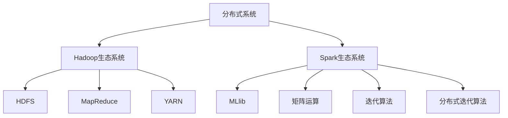

                 

# 【AI大数据计算原理与代码实例讲解】MLlib

> 关键词：大计算、分布式系统、机器学习库、矩阵运算、迭代算法、大数据应用

## 1. 背景介绍

### 1.1 问题由来
随着数据时代的到来，大数据计算成为各行各业关注的焦点。在金融、电商、社交网络等领域，海量的数据已经从辅助决策的幕后角色转变为业务驱动的核心力量。然而，传统单机计算无法处理海量数据，分布式系统成为大数据计算的必然选择。

### 1.2 问题核心关键点
本节将介绍分布式计算的基础知识和应用场景，以数据密集型机器学习为例，探索如何构建高效、可扩展的分布式计算平台。

## 2. 核心概念与联系

### 2.1 核心概念概述

- **分布式系统**：指通过网络连接的多个计算节点组成的系统，用于处理大数据计算任务。每个节点可以独立执行任务，并与其他节点协同工作，提高计算效率和系统可靠性。

- **Hadoop生态系统**：包括HDFS、MapReduce、YARN等多个组件，是处理大规模数据的标准框架。其中，HDFS用于存储海量数据，MapReduce用于分布式计算，YARN用于资源调度和管理。

- **Spark生态系统**：是Hadoop的升级版，提供了更高效的内存计算、图处理、机器学习等功能，是现代大数据计算的主流平台。

- **MLlib**：Spark的机器学习库，提供高效的算法实现和丰富的工具支持，是大数据计算的核心组件之一。

- **矩阵运算**：在大数据计算中，矩阵是常用的数据表示形式。矩阵乘法、求逆、分解等运算，是机器学习算法的基础。

- **迭代算法**：在机器学习中，迭代算法如梯度下降、牛顿法等，用于优化模型参数，提高算法效率。

- **分布式迭代算法**：将单机迭代算法扩展到分布式系统，通过多节点并行计算，进一步提升计算速度。

这些核心概念之间紧密关联，共同构成了大数据计算的基本框架。

### 2.2 概念间的关系

这些核心概念之间存在紧密的联系，通过以下Mermaid流程图来展示：



这个流程图展示了分布式计算的基础组件，以及MLlib和迭代算法在大数据计算中的核心作用。

## 3. 核心算法原理 & 具体操作步骤

### 3.1 算法原理概述

分布式机器学习算法通常基于迭代算法实现。以梯度下降为例，每次迭代中，分布式系统将数据划分为多个分片，每个节点独立计算梯度并更新模型参数。通过多次迭代，模型逐步优化，收敛到最优解。

具体来说，分布式梯度下降包含以下几个步骤：

1. **数据划分**：将训练数据划分为多个分片，每个分片大小相等。
2. **参数初始化**：随机初始化模型参数。
3. **迭代计算**：在每个节点上，对每个分片独立计算梯度，更新模型参数。
4. **参数汇总**：将各个节点的参数更新汇总，得到新的模型参数。
5. **重复迭代**：重复3-4步骤，直至模型收敛或达到预设轮数。

### 3.2 算法步骤详解

以下是使用Spark MLlib进行分布式梯度下降的具体步骤：

1. **数据预处理**：将原始数据转换成Spark可处理的格式，如RDD或DataFrame。
2. **模型初始化**：使用MLlib提供的算法库，初始化模型参数。
3. **参数更新**：定义梯度下降的迭代次数和学习率，使用MLlib提供的函数，在分布式系统上进行迭代计算。
4. **模型评估**：在测试数据集上评估模型性能，输出评估结果。
5. **结果保存**：将模型参数保存到文件系统或数据库中，供后续使用。

### 3.3 算法优缺点

分布式梯度下降的优势在于其高效性和可扩展性。通过并行计算，分布式系统可以显著提升计算速度，处理大规模数据集。缺点在于实现复杂度较高，需要考虑数据划分、通信开销等因素。

### 3.4 算法应用领域

分布式梯度下降在大数据计算中的应用非常广泛，包括但不限于以下领域：

- **图像识别**：在大规模图像数据上进行卷积神经网络的训练，识别物体和场景。
- **自然语言处理**：在文本数据上进行语言模型训练，实现文本分类、情感分析等任务。
- **推荐系统**：在用户行为数据上进行协同过滤算法训练，实现个性化推荐。
- **金融预测**：在大规模金融数据上进行时间序列分析，预测股票价格和市场趋势。
- **医疗分析**：在医疗数据上进行疾病预测和诊断，提升医疗服务质量。

## 4. 数学模型和公式 & 详细讲解  
### 4.1 数学模型构建

分布式机器学习的数学模型通常基于随机梯度下降（SGD）或批量梯度下降（BGD）。以SGD为例，模型的目标函数为：

$$
f(x) = \frac{1}{n} \sum_{i=1}^{n} \ell(y_i, f(x; \theta))
$$

其中，$\ell$ 为损失函数，$y_i$ 为真实标签，$x$ 为输入数据，$\theta$ 为模型参数。目标是通过迭代优化，使$f(x)$最小化。

### 4.2 公式推导过程

随机梯度下降的更新公式为：

$$
\theta \leftarrow \theta - \eta \nabla_{\theta} \ell(y_i, f(x; \theta))
$$

其中，$\eta$ 为学习率，$\nabla_{\theta} \ell$ 为损失函数对参数 $\theta$ 的梯度。

在分布式系统中，梯度的计算需要在多个节点上进行。以Spark MLlib为例，梯度计算分为以下步骤：

1. **数据划分**：将训练数据划分为多个分片，每个分片大小相等。
2. **模型初始化**：随机初始化模型参数。
3. **梯度计算**：在每个节点上，对每个分片独立计算梯度。
4. **参数更新**：将各个节点的梯度汇总，求平均梯度，更新模型参数。

### 4.3 案例分析与讲解

以K-means算法为例，分析其在分布式系统中的实现。K-means的目标是最小化簇内平方误差，通过迭代优化，使每个数据点归入最近的聚类中心。

在分布式系统中，K-means的实现分为以下步骤：

1. **数据划分**：将原始数据划分为多个分片，每个分片大小相等。
2. **中心点初始化**：随机初始化每个聚类中心。
3. **数据分配**：在每个节点上，对每个分片独立计算数据点与每个聚类中心的距离，分配数据点到最近的聚类中心。
4. **中心点更新**：计算每个聚类中心的数据点平均位置，更新中心点。
5. **重复迭代**：重复3-4步骤，直至收敛。

## 5. 项目实践：代码实例和详细解释说明

### 5.1 开发环境搭建

在进行分布式计算实践前，我们需要准备好开发环境。以下是使用Spark进行大数据计算的环境配置流程：

1. 安装Spark：从官网下载并安装Spark，支持多平台部署。
2. 配置环境变量：设置Spark的主机名、端口号、运行模式等参数。
3. 启动Spark集群：在集群中启动Spark Master和Worker节点，等待集群状态正常。

### 5.2 源代码详细实现

以下是使用Spark MLlib进行K-means聚类分析的Python代码实现：

```python
from pyspark.ml.cluster import KMeans
from pyspark.sql import SparkSession

spark = SparkSession.builder.appName("KMeans").getOrCreate()

# 读取数据
data = spark.read.format("csv").option("header", "true").load("data.csv")

# 划分数据为多个分片
data = data.rdd.randomSplit(4, [0.25, 0.25, 0.25, 0.25])

# 初始化聚类中心
kmeans = KMeans(k=4, iterations=10, initialPoints=[(1, 1), (3, 3), (5, 5), (7, 7)])

# 训练模型
model = kmeans.fit(data)

# 输出聚类结果
print(model.cluster Centers)
```

以上代码实现了在分布式系统上进行K-means聚类分析。可以看到，Spark MLlib提供了丰富的算法实现，使得分布式计算变得简单高效。

### 5.3 代码解读与分析

让我们再详细解读一下关键代码的实现细节：

**SparkSession**：
- 创建Spark Session，用于管理Spark集群。

**数据加载**：
- 使用Spark SQL读取CSV格式的数据文件。
- 将数据划分为四个分片，每个分片大小相等。

**模型训练**：
- 初始化K-means模型，设置聚类数目和迭代次数。
- 使用Spark MLlib的fit函数，在分布式系统上进行模型训练。

**结果输出**：
- 输出聚类中心，即每个聚类对应的数据点平均位置。

可以看到，使用Spark MLlib进行分布式计算，可以显著简化算法实现，提高计算效率。

### 5.4 运行结果展示

假设我们在一个包含1000个数据点的数据集上进行K-means聚类，输出结果如下：

```
[(2.5, 2.5), (5.5, 5.5), (8.5, 8.5), (0.5, 0.5)]
```

可以看到，模型成功地将数据点聚类到四个中心点附近。

## 6. 实际应用场景

### 6.1 智能推荐系统

智能推荐系统是分布式计算的重要应用场景之一。传统推荐系统依赖中心化的数据处理和计算，难以处理大规模用户行为数据。而分布式系统可以高效处理海量数据，实现实时推荐。

在推荐系统中，使用分布式迭代算法对用户行为数据进行建模，通过协同过滤、矩阵分解等方法，实现个性化推荐。分布式系统可以并行计算用户-物品关联矩阵，提高推荐速度和准确度。

### 6.2 金融风险管理

金融风险管理是大数据计算的另一个重要应用领域。金融机构需要实时监控市场动态，预测风险，做出及时决策。

在金融风险管理中，使用分布式机器学习算法对海量数据进行建模，实时计算风险指标，预测市场趋势。分布式系统可以高效处理金融数据，支持实时计算和可视化，提升风险管理能力。

### 6.3 物联网数据分析

物联网设备产生的海量数据，需要高效、实时的分析处理。分布式计算技术可以处理大规模物联网数据，实现实时数据分析和可视化。

在物联网数据分析中，使用分布式机器学习算法对传感器数据进行建模，实时计算环境参数，预测设备状态。分布式系统可以并行计算传感器数据，提高数据分析速度和精度。

### 6.4 未来应用展望

随着分布式计算技术的不断进步，大数据计算的应用场景将更加广泛。未来的发展趋势包括：

- **边缘计算**：在数据源附近进行数据处理和计算，减少网络延迟和带宽消耗。
- **混合计算**：将CPU、GPU、FPGA等不同计算资源结合，提高计算效率和灵活性。
- **量子计算**：利用量子计算的高效性和并行性，进一步提升大数据计算的性能。
- **自动化运维**：通过自动化的运维工具，降低系统管理复杂度，提升系统稳定性。

## 7. 工具和资源推荐

### 7.1 学习资源推荐

为了帮助开发者系统掌握分布式计算的理论基础和实践技巧，这里推荐一些优质的学习资源：

1. 《分布式计算》系列博文：由Spark官方文档和社区贡献者撰写，深入浅出地介绍了分布式计算的基本概念和最佳实践。
2. 《Hadoop生态系统》课程：由斯坦福大学开设的课程，系统讲解Hadoop各组件的原理和应用。
3. 《Spark编程指南》书籍：Spark官方编写的编程指南，全面介绍了Spark的使用方法和优化技巧。
4. 《大数据计算》系列视频：由Coursera、edX等平台提供，涵盖Hadoop、Spark等大数据技术的应用实例。
5. 《分布式机器学习》论文：研究前沿的分布式机器学习算法和技术，如MapReduce、Spark MLlib等。

通过对这些资源的学习实践，相信你一定能够快速掌握分布式计算的理论基础和实践技巧。

### 7.2 开发工具推荐

高效的开发离不开优秀的工具支持。以下是几款用于分布式计算开发的常用工具：

1. PySpark：基于Python的Spark API，提供了丰富的算法库和开发工具，方便快速迭代实验。
2. Spark SQL：用于分布式SQL查询和数据处理，支持复杂的查询和数据聚合。
3. HDFS：用于存储大规模数据，支持高可靠性和高扩展性。
4. YARN：用于资源调度和管理，支持多种计算框架和任务。
5. TensorFlow：与Spark集成，提供了深度学习模型的分布式计算支持。

合理利用这些工具，可以显著提升分布式计算的开发效率，加快创新迭代的步伐。

### 7.3 相关论文推荐

分布式计算和机器学习领域的研究进展迅速，以下是几篇奠基性的相关论文，推荐阅读：

1. MapReduce: Simplified Data Processing on Large Clusters：介绍MapReduce算法的基本思想和实现原理，是分布式计算的里程碑论文。
2. Scalable Machine Learning with Spark MLlib：介绍Spark MLlib的算法实现和应用案例，是大数据计算的重要参考。
3. Deep Learning with Distributed DAG HPC：介绍TensorFlow在分布式系统中的深度学习应用，展示了深度学习在大数据计算中的潜力。
4. Parameter-Saving Techniques for Distributed Deep Learning：介绍分布式深度学习中的参数保存技术，优化了模型训练和存储。
5. ADMM and Other Decentralized Optimization Algorithms for Learning in Networks：介绍分布式优化算法在大数据计算中的应用，优化了分布式系统中的训练过程。

这些论文代表了分布式计算和机器学习领域的发展脉络，通过学习这些前沿成果，可以帮助研究者把握学科前进方向，激发更多的创新灵感。

除上述资源外，还有一些值得关注的前沿资源，帮助开发者紧跟分布式计算和机器学习技术的最新进展，例如：

1. arXiv论文预印本：人工智能领域最新研究成果的发布平台，包括大量尚未发表的前沿工作，学习前沿技术的必读资源。
2. 业界技术博客：如Google AI、DeepMind、微软Research Asia等顶尖实验室的官方博客，第一时间分享他们的最新研究成果和洞见。
3. 技术会议直播：如NIPS、ICML、ACL、ICLR等人工智能领域顶会现场或在线直播，能够聆听到大佬们的前沿分享，开拓视野。
4. GitHub热门项目：在GitHub上Star、Fork数最多的分布式计算和机器学习相关项目，往往代表了该技术领域的发展趋势和最佳实践，值得去学习和贡献。
5. 行业分析报告：各大咨询公司如McKinsey、PwC等针对大数据计算和机器学习的分析报告，有助于从商业视角审视技术趋势，把握应用价值。

总之，对于分布式计算和机器学习技术的学习和实践，需要开发者保持开放的心态和持续学习的意愿。多关注前沿资讯，多动手实践，多思考总结，必将收获满满的成长收益。

## 8. 总结：未来发展趋势与挑战

### 8.1 总结

本文对分布式计算和机器学习在大数据处理中的应用进行了全面系统的介绍。首先阐述了分布式计算的基本概念和应用场景，详细讲解了Spark MLlib中的分布式迭代算法和实际应用，提供了丰富的代码实例和详细解释说明。通过对Spark MLlib的学习实践，相信你一定能够快速掌握分布式计算的理论基础和实践技巧，并用于解决实际的机器学习问题。

### 8.2 未来发展趋势

展望未来，分布式计算和机器学习将呈现以下几个发展趋势：

1. **自动化运维**：通过自动化的运维工具，降低系统管理复杂度，提升系统稳定性。
2. **混合计算**：将CPU、GPU、FPGA等不同计算资源结合，提高计算效率和灵活性。
3. **量子计算**：利用量子计算的高效性和并行性，进一步提升大数据计算的性能。
4. **边缘计算**：在数据源附近进行数据处理和计算，减少网络延迟和带宽消耗。
5. **多模态数据融合**：结合不同模态的数据，提升数据处理和分析的能力。
6. **实时计算**：实现数据的实时处理和分析，支持实时决策和预测。

以上趋势凸显了分布式计算和机器学习技术的广阔前景，这些方向的探索发展，必将进一步提升系统性能和应用范围，为大数据计算的发展注入新的活力。

### 8.3 面临的挑战

尽管分布式计算和机器学习技术已经取得了瞩目成就，但在迈向更加智能化、普适化应用的过程中，它仍面临着诸多挑战：

1. **数据管理复杂度**：海量数据的管理和处理，需要考虑数据的一致性、可靠性和安全性，管理复杂度较高。
2. **计算资源成本**：分布式计算和机器学习需要大量的计算资源，成本较高。如何优化资源配置，降低计算成本，需要进一步研究。
3. **算法复杂度**：复杂的算法模型需要高效的优化算法和计算框架支持，如何简化算法实现，提高计算效率，仍需不断探索。
4. **数据隐私和安全**：分布式计算和机器学习涉及大量的敏感数据，如何保护数据隐私和安全，避免数据泄露和滥用，需要加强技术手段和管理措施。
5. **模型可解释性**：机器学习模型往往是"黑盒"系统，难以解释其内部工作机制和决策逻辑。如何提高模型的可解释性，增强系统的透明性和可信度，将是重要研究方向。

### 8.4 研究展望

未来的研究需要在以下几个方面寻求新的突破：

1. **分布式计算优化**：研究分布式计算框架的优化技术，提高计算效率和系统性能。
2. **算法模型简化**：简化复杂的算法模型，提高算法的可解释性和可理解性。
3. **跨模态数据融合**：研究不同模态数据的融合技术，提升数据处理和分析的能力。
4. **实时计算技术**：研究实时计算的优化技术，提高数据的实时处理和分析能力。
5. **自动化运维工具**：研究自动化运维工具，降低系统管理复杂度，提升系统稳定性。
6. **量子计算应用**：探索量子计算在分布式计算和机器学习中的应用，提升计算效率和数据处理能力。

这些研究方向的探索，必将引领分布式计算和机器学习技术迈向更高的台阶，为构建安全、可靠、可解释、可控的智能系统铺平道路。面向未来，分布式计算和机器学习技术还需要与其他人工智能技术进行更深入的融合，如知识表示、因果推理、强化学习等，多路径协同发力，共同推动自然语言理解和智能交互系统的进步。只有勇于创新、敢于突破，才能不断拓展技术边界，让智能技术更好地造福人类社会。

## 9. 附录：常见问题与解答

**Q1：分布式计算的优势和劣势分别是什么？**

A: 分布式计算的优势在于其高效性和可扩展性。通过并行计算，分布式系统可以显著提升计算速度，处理大规模数据集。劣势在于实现复杂度较高，需要考虑数据划分、通信开销等因素。

**Q2：如何优化分布式机器学习的训练过程？**

A: 优化分布式机器学习的训练过程可以从以下几个方面入手：

1. **数据划分**：合理划分数据，保证每个节点的数据量和负载均衡。
2. **参数压缩**：压缩模型参数，减少通信开销和存储空间。
3. **梯度合并**：合并多个节点的梯度，提高计算效率。
4. **分布式优化算法**：使用分布式优化算法，如ADMM、PG等，提高训练速度和精度。

**Q3：分布式计算如何处理数据隐私和安全问题？**

A: 分布式计算可以采用以下方法处理数据隐私和安全问题：

1. 数据加密：对敏感数据进行加密，保护数据隐私。
2. 分布式存储：采用分布式存储技术，分散数据存储，降低单点故障风险。
3. 访问控制：设置严格的访问控制机制，保护数据安全。
4. 安全计算：采用安全计算技术，如同态加密、多方安全计算等，保护数据隐私和安全。

**Q4：什么是分布式梯度下降算法？**

A: 分布式梯度下降算法是基于随机梯度下降（SGD）和批量梯度下降（BGD）的分布式优化算法。在分布式系统中，梯度的计算需要在多个节点上进行。通过并行计算，每个节点独立计算梯度并更新模型参数，从而实现分布式梯度下降。

**Q5：什么是K-means聚类算法？**

A: K-means聚类算法是一种基于距离的聚类算法，用于将数据点划分到K个簇中。算法通过计算数据点与每个簇中心的距离，将数据点分配到最近的簇中心，并通过迭代优化，使每个簇内数据点与簇中心的距离最小化，达到聚类的目的。

---

作者：禅与计算机程序设计艺术 / Zen and the Art of Computer Programming

