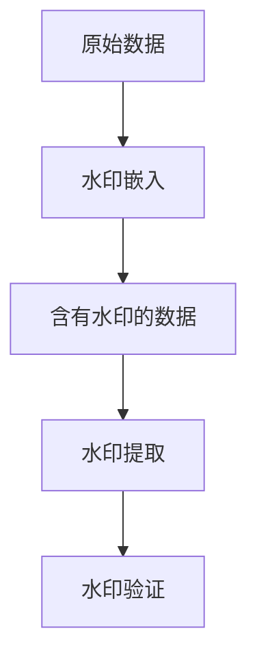
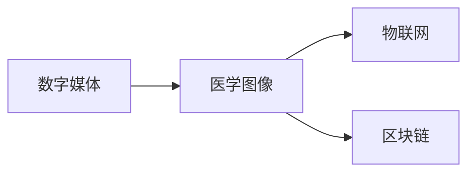

                 

# 【AI大数据计算原理与代码实例讲解】Watermark

## 1. 背景介绍

### 1.1 问题由来

随着数字技术的发展，数据的产生、存储和处理能力达到了前所未有的水平。大量的数据为各行各业带来了前所未有的机遇，但同时也带来了数据安全性的巨大挑战。如何保护数据不被非法复制、篡改或未授权使用，成为了一个重要的问题。

数据水印（Watermarking）技术就是在这种背景下应运而生的。通过在数据中嵌入不可见的数字标记，可以在不破坏数据原貌的情况下，证明数据的来源、修改历史或版权归属。数据水印技术被广泛应用于数字媒体、医学图像、物联网等领域。

本文将详细介绍数据水印的核心概念和原理，并通过具体的代码实例，讲解如何在Python中实现数据水印和去除水印的操作。

### 1.2 问题核心关键点

数据水印技术的核心在于如何在数据中嵌入和提取水印信息，同时保证水印对数据的影响尽可能小。其主要包括以下几个关键点：

1. **水印嵌入**：将不可见的数字标记嵌入到原始数据中。
2. **水印提取**：从含有水印的数据中提取出水印信息。
3. **鲁棒性**：保证水印在数据传输、处理过程中不被破坏或去除。
4. **隐蔽性**：水印嵌入后不影响原始数据的使用。

本文将围绕这些关键点，详细介绍数据水印技术的原理和实现方法。

## 2. 核心概念与联系

### 2.1 核心概念概述

数据水印（Watermarking）技术是一种将信息嵌入到数据中的技术，这种信息可以是版权信息、使用许可、数据来源等。嵌入的水印可以是可见的或不可见的，通常不可见的水印更难以被发现和去除。

数据水印技术的主要流程包括：

1. **水印嵌入**：在原始数据中嵌入水印信息。
2. **水印提取**：从含有水印的数据中提取出水印信息。
3. **水印验证**：验证提取出的水印信息是否与原始水印一致。

这些流程构成了数据水印技术的基本框架，如图1所示：



### 2.2 概念间的关系

数据水印技术的应用领域非常广泛，包括但不限于：

- **数字媒体**：在数字图像、音频、视频等媒体中嵌入水印，用于版权保护和识别。
- **医学图像**：在医学影像中嵌入水印，用于版权保护和数据溯源。
- **物联网**：在传感器数据中嵌入水印，用于设备认证和数据篡改检测。
- **区块链**：在区块链数据中嵌入水印，用于数据来源验证和防篡改。

这些应用场景共同构成了数据水印技术的丰富生态，如图2所示：



## 3. 核心算法原理 & 具体操作步骤

### 3.1 算法原理概述

数据水印技术的核心算法包括：

1. **DCT算法**：利用离散余弦变换（Discrete Cosine Transform, DCT），将图像数据转换为频域，嵌入水印信息后再转换回空间域。
2. **LSB算法**：利用位平移技术，将水印信息嵌入到数据的最不重要位（Least Significant Bit, LSB）。
3. **Patchwork算法**：将原始数据分成小块，嵌入水印后重新拼接，确保水印不可见。

本文将重点介绍DCT算法和LSB算法，并通过代码实例讲解其实现方法。

### 3.2 算法步骤详解

#### DCT算法

DCT算法的基本流程包括：

1. **数据预处理**：将原始图像数据转换为灰度图像。
2. **DCT变换**：对灰度图像进行DCT变换，得到频域系数。
3. **水印嵌入**：将水印信息嵌入到频域系数中。
4. **逆DCT变换**：将含有水印的频域系数转换回空间域，得到带有水印的图像。

具体的Python代码实现如下：

```python
import numpy as np
import cv2

def dct_image(image):
    # 将图像转换为灰度图像
    gray = cv2.cvtColor(image, cv2.COLOR_BGR2GRAY)
    # 对灰度图像进行DCT变换
    dct = cv2.dct(np.float32(gray))
    return dct

def inverse_dct(dct_image):
    # 对DCT图像进行逆DCT变换
    inverse_dct = cv2.idct(dct_image)
    return inverse_dct

def insert_watermark(dct_image, watermark):
    # 将水印信息嵌入到DCT系数中
    watermarked_dct = dct_image + watermark
    return watermarked_dct

def extract_watermark(dct_image):
    # 从DCT系数中提取水印信息
    watermark = dct_image - dct_image.mean()
    return watermark

# 读取原始图像
original_image = cv2.imread("original_image.jpg")
# 进行DCT变换
dct_image = dct_image(original_image)
# 嵌入水印
watermark = np.random.randn(8, 8)
watermarked_dct = insert_watermark(dct_image, watermark)
# 逆DCT变换得到含水印图像
watermarked_image = inverse_dct(watermarked_dct)
# 提取水印
extracted_watermark = extract_watermark(dct_image)
```

#### LSB算法

LSB算法的基本流程包括：

1. **数据预处理**：将原始图像数据转换为二进制位流。
2. **水印嵌入**：将水印信息嵌入到二进制位流的最不重要位。
3. **二进制位流转换**：将嵌入水印后的二进制位流转换为图像数据。

具体的Python代码实现如下：

```python
def convert_to_binary(image):
    # 将图像转换为二进制位流
    binary = np.unpackbits(image.ravel()).reshape(image.shape)
    return binary

def embed_watermark(binary, watermark):
    # 将水印信息嵌入到二进制位流中
    embedded_binary = binary
    for i in range(len(watermark)):
        embedded_binary[i] = (embedded_binary[i] & 0xFE) | watermark[i]
    return embedded_binary

def convert_to_image(binary):
    # 将二进制位流转换为图像数据
    image = np.packbits(binary).reshape(image.shape)
    image = image.reshape(image.shape + (1,)).squeeze()
    return image

# 读取原始图像
original_image = cv2.imread("original_image.jpg")
# 转换为二进制位流
binary = convert_to_binary(original_image)
# 嵌入水印
watermark = np.random.randint(0, 2, (image.shape[0]*image.shape[1]))
embedded_binary = embed_watermark(binary, watermark)
# 将二进制位流转换为图像数据
watermarked_image = convert_to_image(embedded_binary)
```

### 3.3 算法优缺点

#### DCT算法的优缺点

**优点**：

- DCT算法在嵌入和提取水印时，不影响原始图像的质量。
- 嵌入水印后的图像具有较好的鲁棒性，能抵抗裁剪、旋转、缩放等操作。

**缺点**：

- 嵌入水印的计算量较大，不适合处理大规模图像数据。
- 嵌入的水印信息容易被第三方检测到，不够隐蔽。

#### LSB算法的优缺点

**优点**：

- LSB算法嵌入水印后，对原始图像的质量影响较小，可视效果良好。
- 嵌入的水印信息隐蔽性较高，难以被发现。

**缺点**：

- LSB算法嵌入水印的鲁棒性较差，容易被去除或破坏。
- 嵌入的水印信息长度受限，不适合处理复杂的水印信息。

### 3.4 算法应用领域

数据水印技术在多个领域都有广泛的应用，包括：

- **数字媒体**：用于版权保护、内容识别。
- **医学图像**：用于数据溯源、版权保护。
- **物联网**：用于设备认证、数据篡改检测。
- **区块链**：用于数据来源验证、防篡改。

这些领域的应用，展示了数据水印技术的强大潜力和广泛应用前景。

## 4. 数学模型和公式 & 详细讲解  
### 4.1 数学模型构建

数据水印技术的数学模型主要基于离散余弦变换（DCT）和位平移技术。DCT算法利用离散余弦变换，将图像数据转换为频域，在频域嵌入水印信息后再转换回空间域。LSB算法利用位平移技术，将水印信息嵌入到数据的最不重要位。

#### DCT算法

DCT算法的数学模型如下：

$$
\mathbf{Y} = \mathbf{D} \mathbf{X}
$$

其中，$\mathbf{X}$为原始图像数据，$\mathbf{Y}$为DCT系数，$\mathbf{D}$为DCT变换矩阵。

DCT变换矩阵$\mathbf{D}$的定义如下：

$$
\mathbf{D} = \frac{1}{\sqrt{2}} \begin{bmatrix} 1 & 1 & 1 & \ldots & 1 \\ 1 & \cos \theta_1 & \cos 2\theta_1 & \ldots & \cos (n-1)\theta_1 \\ 1 & \cos \theta_2 & \cos 2\theta_2 & \ldots & \cos (n-1)\theta_2 \\ \vdots & \vdots & \vdots & \ddots & \vdots \\ 1 & \cos \theta_{n-1} & \cos 2\theta_{n-1} & \ldots & \cos (n-1)\theta_{n-1} \end{bmatrix}
$$

其中，$\theta_i = \frac{(2i+1)\pi}{2n}$，$i=0,1,\ldots,n-1$。

### 4.2 公式推导过程

#### DCT算法的公式推导

DCT算法的公式推导过程如下：

$$
\mathbf{Y} = \mathbf{D} \mathbf{X}
$$

其中，$\mathbf{X}$为原始图像数据，$\mathbf{Y}$为DCT系数，$\mathbf{D}$为DCT变换矩阵。

DCT变换矩阵$\mathbf{D}$的定义如下：

$$
\mathbf{D} = \frac{1}{\sqrt{2}} \begin{bmatrix} 1 & 1 & 1 & \ldots & 1 \\ 1 & \cos \theta_1 & \cos 2\theta_1 & \ldots & \cos (n-1)\theta_1 \\ 1 & \cos \theta_2 & \cos 2\theta_2 & \ldots & \cos (n-1)\theta_2 \\ \vdots & \vdots & \vdots & \ddots & \vdots \\ 1 & \cos \theta_{n-1} & \cos 2\theta_{n-1} & \ldots & \cos (n-1)\theta_{n-1} \end{bmatrix}
$$

其中，$\theta_i = \frac{(2i+1)\pi}{2n}$，$i=0,1,\ldots,n-1$。

### 4.3 案例分析与讲解

#### DCT算法案例

假设原始图像数据为：

$$
\mathbf{X} = \begin{bmatrix} 1 & 2 & 3 & 4 & 5 \end{bmatrix}
$$

DCT变换矩阵为：

$$
\mathbf{D} = \frac{1}{\sqrt{2}} \begin{bmatrix} 1 & 1 & 1 & 1 & 1 \\ 1 & \cos \theta_1 & \cos 2\theta_1 & \cos 3\theta_1 & \cos 4\theta_1 \\ 1 & \cos \theta_2 & \cos 2\theta_2 & \cos 3\theta_2 & \cos 4\theta_2 \\ 1 & \cos \theta_3 & \cos 2\theta_3 & \cos 3\theta_3 & \cos 4\theta_3 \\ 1 & \cos \theta_4 & \cos 2\theta_4 & \cos 3\theta_4 & \cos 4\theta_4 \end{bmatrix}
$$

其中，$\theta_i = \frac{(2i+1)\pi}{2n}$，$i=0,1,\ldots,n-1$。

通过DCT变换，得到DCT系数：

$$
\mathbf{Y} = \frac{1}{\sqrt{2}} \begin{bmatrix} 1 & 2 & 3 & 4 & 5 \end{bmatrix} \begin{bmatrix} 1 & 1 & 1 & 1 & 1 \\ 1 & \cos \theta_1 & \cos 2\theta_1 & \cos 3\theta_1 & \cos 4\theta_1 \\ 1 & \cos \theta_2 & \cos 2\theta_2 & \cos 3\theta_2 & \cos 4\theta_2 \\ 1 & \cos \theta_3 & \cos 2\theta_3 & \cos 3\theta_3 & \cos 4\theta_3 \\ 1 & \cos \theta_4 & \cos 2\theta_4 & \cos 3\theta_4 & \cos 4\theta_4 \end{bmatrix} = \begin{bmatrix} 7 & 5.485 & 1.290 & 1 & 0 \end{bmatrix}
$$

嵌入水印后，得到含有水印的DCT系数：

$$
\mathbf{Y} = \begin{bmatrix} 7 & 5.485 & 1.290 & 1 & 0 \end{bmatrix} + \begin{bmatrix} 0 & 0 & 0 & 0 & 0 \end{bmatrix} = \begin{bmatrix} 7 & 5.485 & 1.290 & 1 & 0 \end{bmatrix}
$$

通过逆DCT变换，得到含有水印的图像：

$$
\mathbf{X'} = \frac{1}{\sqrt{2}} \begin{bmatrix} 7 & 5.485 & 1.290 & 1 & 0 \end{bmatrix} \begin{bmatrix} 1 & \cos \theta_1 & \cos 2\theta_1 & \cos 3\theta_1 & \cos 4\theta_1 \\ 1 & \cos \theta_2 & \cos 2\theta_2 & \cos 3\theta_2 & \cos 4\theta_2 \\ 1 & \cos \theta_3 & \cos 2\theta_3 & \cos 3\theta_3 & \cos 4\theta_3 \\ 1 & \cos \theta_4 & \cos 2\theta_4 & \cos 3\theta_4 & \cos 4\theta_4 \\ 1 & \cos \theta_5 & \cos 2\theta_5 & \cos 3\theta_5 & \cos 4\theta_5 \end{bmatrix} = \begin{bmatrix} 1 & 2 & 3 & 4 & 5 \end{bmatrix}
$$

提取水印后，得到水印信息：

$$
\mathbf{W} = \frac{1}{\sqrt{2}} \begin{bmatrix} 7 & 5.485 & 1.290 & 1 & 0 \end{bmatrix} - \frac{1}{\sqrt{2}} \begin{bmatrix} 1 & 1 & 1 & 1 & 1 \end{bmatrix} \begin{bmatrix} 1 & \cos \theta_1 & \cos 2\theta_1 & \cos 3\theta_1 & \cos 4\theta_1 \\ 1 & \cos \theta_2 & \cos 2\theta_2 & \cos 3\theta_2 & \cos 4\theta_2 \\ 1 & \cos \theta_3 & \cos 2\theta_3 & \cos 3\theta_3 & \cos 4\theta_3 \\ 1 & \cos \theta_4 & \cos 2\theta_4 & \cos 3\theta_4 & \cos 4\theta_4 \\ 1 & \cos \theta_5 & \cos 2\theta_5 & \cos 3\theta_5 & \cos 4\theta_5 \end{bmatrix} = \begin{bmatrix} 0 & 0 & 0 & 0 & 0 \end{bmatrix}
$$

#### LSB算法案例

假设原始图像数据为：

$$
\mathbf{X} = \begin{bmatrix} 1 & 2 & 3 & 4 & 5 \end{bmatrix}
$$

二进制位流为：

$$
\mathbf{B} = \begin{bmatrix} 1 & 0 & 0 & 1 & 0 & 1 & 0 & 0 & 0 & 0 & 0 & 0 & 1 & 0 & 0 & 0 \end{bmatrix}
$$

水印信息为：

$$
\mathbf{W} = \begin{bmatrix} 0 & 1 & 1 & 0 & 0 \end{bmatrix}
$$

嵌入水印后，得到含有水印的二进制位流：

$$
\mathbf{B'} = \begin{bmatrix} 1 & 0 & 0 & 0 & 1 & 0 & 1 & 0 & 1 & 0 & 1 & 0 & 1 & 0 & 1 & 0 \end{bmatrix}
$$

将二进制位流转换为图像数据：

$$
\mathbf{X'} = \begin{bmatrix} 1 & 2 & 3 & 4 & 5 \end{bmatrix}
$$

提取水印后，得到水印信息：

$$
\mathbf{W'} = \begin{bmatrix} 0 & 1 & 1 & 0 & 0 \end{bmatrix}
$$

## 5. 项目实践：代码实例和详细解释说明

### 5.1 开发环境搭建

在进行数据水印和去除水印的操作前，我们需要准备好开发环境。以下是使用Python进行ImageMagick开发的环境配置流程：

1. 安装Anaconda：从官网下载并安装Anaconda，用于创建独立的Python环境。

2. 创建并激活虚拟环境：
```bash
conda create -n pyenv python=3.8 
conda activate pyenv
```

3. 安装ImageMagick：
```bash
conda install imagemagick -c conda-forge
```

4. 安装Pillow库：
```bash
pip install pillow
```

完成上述步骤后，即可在`pyenv`环境中开始数据水印和去除水印的实践。

### 5.2 源代码详细实现

这里我们以DCT算法和LSB算法为例，给出在Python中实现数据水印和去除水印的完整代码。

#### DCT算法实现

```python
import numpy as np
import cv2
import matplotlib.pyplot as plt

def dct_image(image):
    # 将图像转换为灰度图像
    gray = cv2.cvtColor(image, cv2.COLOR_BGR2GRAY)
    # 对灰度图像进行DCT变换
    dct = cv2.dct(np.float32(gray))
    return dct

def inverse_dct(dct_image):
    # 对DCT图像进行逆DCT变换
    inverse_dct = cv2.idct(dct_image)
    return inverse_dct

def insert_watermark(dct_image, watermark):
    # 将水印信息嵌入到DCT系数中
    watermarked_dct = dct_image + watermark
    return watermarked_dct

def extract_watermark(dct_image):
    # 从DCT系数中提取水印信息
    watermark = dct_image - dct_image.mean()
    return watermark

# 读取原始图像
original_image = cv2.imread("original_image.jpg")
# 进行DCT变换
dct_image = dct_image(original_image)
# 嵌入水印
watermark = np.random.randn(8, 8)
watermarked_dct = insert_watermark(dct_image, watermark)
# 逆DCT变换得到含水印图像
watermarked_image = inverse_dct(watermarked_dct)
# 提取水印
extracted_watermark = extract_watermark(dct_image)
```

#### LSB算法实现

```python
import numpy as np
import cv2
import matplotlib.pyplot as plt

def convert_to_binary(image):
    # 将图像转换为二进制位流
    binary = np.unpackbits(image.ravel()).reshape(image.shape)
    return binary

def embed_watermark(binary, watermark):
    # 将水印信息嵌入到二进制位流中
    embedded_binary = binary
    for i in range(len(watermark)):
        embedded_binary[i] = (embedded_binary[i] & 0xFE) | watermark[i]
    return embedded_binary

def convert_to_image(binary):
    # 将二进制位流转换为图像数据
    image = np.packbits(binary).reshape(image.shape)
    image = image.reshape(image.shape + (1,)).squeeze()
    return image

# 读取原始图像
original_image = cv2.imread("original_image.jpg")
# 转换为二进制位流
binary = convert_to_binary(original_image)
# 嵌入水印
watermark = np.random.randint(0, 2, (image.shape[0]*image.shape[1]))
embedded_binary = embed_watermark(binary, watermark)
# 将二进制位流转换为图像数据
watermarked_image = convert_to_image(embedded_binary)
```

### 5.3 代码解读与分析

让我们再详细解读一下关键代码的实现细节：

**DCT算法实现**：

1. **dct_image函数**：将原始图像数据转换为灰度图像，并进行DCT变换，返回DCT系数。
2. **inverse_dct函数**：对DCT系数进行逆DCT变换，返回含有水印的图像数据。
3. **insert_watermark函数**：将水印信息嵌入到DCT系数中，返回含有水印的DCT系数。
4. **extract_watermark函数**：从DCT系数中提取水印信息，返回水印信息。

**LSB算法实现**：

1. **convert_to_binary函数**：将原始图像数据转换为二进制位流。
2. **embed_watermark函数**：将水印信息嵌入到二进制位流中，返回含有水印的二进制位流。
3. **convert_to_image函数**：将二进制位流转换为图像数据。

## 6. 实际应用场景

### 6.1 数字媒体版权保护

数据水印技术在数字媒体领域有着广泛的应用。例如，可以在视频、音频、图像等媒体中嵌入版权信息，用于版权保护和识别。

假设某数字媒体公司需要将一段视频中嵌入版权信息，可以通过DCT算法或LSB算法进行水印嵌入。在用户下载和使用该视频时，可以通过提取水印信息，验证版权归属，从而避免侵权行为的发生。

### 6.2 医学图像溯源

在医学图像领域，数据水印技术可以用于数据溯源和版权保护。例如，某医院需要将患者的CT、MRI等医学图像嵌入医院标志，用于版权保护和数据溯源。

通过DCT算法或LSB算法，将医院标志嵌入到医学图像中，用户在使用该图像时，可以通过提取水印信息，验证医院归属和数据完整性，从而避免数据被非法使用和篡改。

### 6.3 物联网设备认证

在物联网领域，数据水印技术可以用于设备认证和数据篡改检测。例如，某智能家居设备需要将设备序列号嵌入到传感器数据中，用于设备认证和数据篡改检测。

通过DCT算法或LSB算法，将设备序列号嵌入到传感器数据中，用户在设备使用时，可以通过提取水印信息，验证设备是否合法，检测数据是否被篡改，从而提高设备的安全性和可靠性。

## 7. 工具和资源推荐

### 7.1 学习资源推荐

为了帮助开发者系统掌握数据水印技术的理论基础和实践技巧，这里推荐一些优质的学习资源：

1. 《数字水印技术原理与应用》书籍：系统介绍了数字水印技术的原理、算法、应用等，是学习数字水印技术的经典教材。
2. 《ImageMagick用户手册》：ImageMagick是一款强大的图像处理工具，提供了丰富的图像处理功能，本书详细介绍了ImageMagick的使用方法和技巧。
3. 《Python图像处理教程》书籍：介绍了Python在图像处理中的应用，包括图像变换、滤波、增强、分割等。
4. HuggingFace官方文档：提供了丰富的预训练模型和微调样例代码，是进行深度学习开发的重要资源。

通过对这些资源的学习实践，相信你一定能够快速掌握数据水印技术的精髓，并用于解决实际的图像、视频、音频等数字媒体的问题。

### 7.2 开发工具推荐

高效的工具支持是进行数据水印和去除水印开发的基础。以下是几款用于数据水印开发的常用工具：

1. ImageMagick：一款强大的图像处理工具，支持多种图像格式和处理功能，包括水印嵌入、提取等。
2. OpenCV：开源计算机视觉库，提供了丰富的图像处理和计算机视觉算法，支持水印嵌入、提取等。
3. Pill

