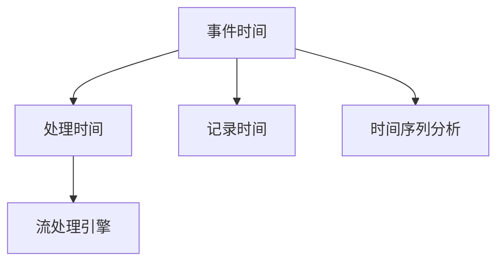
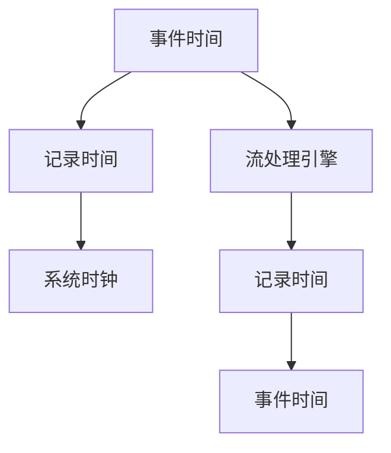
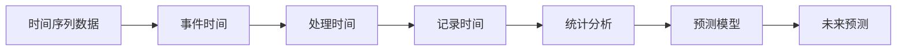

                 

# 【AI大数据计算原理与代码实例讲解】事件时间

> 关键词：事件时间,大数据计算,实时处理,分布式系统,流处理引擎,时间序列分析

## 1. 背景介绍

### 1.1 问题由来
在当今数字化时代，数据无处不在，企业需要处理的数据量不断增长。其中，事件时间（Event Time）是一种重要的概念，广泛应用于实时数据处理、金融市场交易记录、日志分析等领域。传统的时间戳系统（如UNIX时间戳）无法精确记录事件发生的时间，这给数据分析和决策带来了诸多问题。因此，事件时间成为数据处理领域的重要研究方向。

### 1.2 问题核心关键点
事件时间是指事件发生的实际时间，与系统时钟（System Time）不同。事件时间精确地记录了事件的实际发生时间，对于实时数据处理、时间序列分析等任务至关重要。但如何精确计算事件时间，并有效地应用于各种任务，仍然是一个复杂而具有挑战性的问题。

### 1.3 问题研究意义
准确地计算和应用事件时间，对于提高数据处理的精度和效率具有重要意义。在金融、医疗、交通等领域，通过精确的时间序列分析，企业能够更好地做出决策，提升运营效率和客户体验。此外，事件时间的研究还能帮助科学家更好地理解自然和社会的动态变化，推动科学研究的发展。

## 2. 核心概念与联系

### 2.1 核心概念概述

为更好地理解事件时间在大数据计算中的应用，本节将介绍几个密切相关的核心概念：

- 事件时间(Event Time)：事件发生的实际时间，与系统时钟不同。
- 处理时间(Processing Time)：事件到达系统并被处理的时间，与系统时钟一致。
- 记录时间(Record Time)：事件被记录到系统中的时间，通常与系统时钟一致。
- 时间戳(Timestamp)：一种标记时间的方式，通常是自1970年1月1日00:00:00 UTC以来的秒数，与事件时间、处理时间和记录时间不同。
- 流处理引擎(Stream Processing Engine)：一种处理实时数据流的系统，如Apache Kafka、Apache Flink等，能够高效处理大量数据。
- 时间序列分析(Time Series Analysis)：通过分析时间序列数据，预测未来趋势和行为，广泛应用于金融、气象等领域。

这些核心概念之间的逻辑关系可以通过以下Mermaid流程图来展示：



这个流程图展示了大数据计算中事件时间的基本关系和关键流程。

### 2.2 概念间的关系

这些核心概念之间存在着紧密的联系，形成了大数据计算的事件时间生态系统。下面通过几个Mermaid流程图来展示这些概念之间的关系。

#### 2.2.1 事件时间的基本流程



这个流程图展示了事件时间的基本处理流程。事件时间首先被记录，然后通过流处理引擎进行处理，并最终生成事件时间。

#### 2.2.2 时间序列分析的流程



这个流程图展示了时间序列分析的基本流程。时间序列数据首先被转换为事件时间，然后经过处理时间、记录时间的转换，最后进行统计分析和未来预测。

## 3. 核心算法原理 & 具体操作步骤
### 3.1 算法原理概述

事件时间的计算和应用是数据处理中的重要问题。传统的方法是基于时间戳和系统时钟来计算事件时间，但这种方法存在诸多局限性。近年来，随着大数据和分布式计算技术的发展，事件时间的计算和应用有了新的方法和工具。

### 3.2 算法步骤详解

基于事件时间的大数据计算过程包括以下关键步骤：

**Step 1: 数据采集和预处理**
- 采集各种数据源（如传感器、日志文件等），并进行清洗和预处理，确保数据质量。
- 将数据转换为事件时间格式，确保数据的一致性和可比性。

**Step 2: 事件时间记录和存储**
- 使用事件时间记录系统，如Apache Kafka、Apache Pulsar等，将事件时间记录到分布式系统中。
- 使用高效的数据存储系统，如Apache Hadoop、Apache Spark等，进行数据存储和查询。

**Step 3: 事件时间处理和分析**
- 使用流处理引擎，如Apache Flink、Apache Storm等，对事件时间进行实时处理和分析。
- 使用时间序列分析工具，如R、Python等，对事件时间序列进行建模和预测。

**Step 4: 事件时间可视化**
- 使用可视化工具，如Tableau、Grafana等，对事件时间数据进行可视化展示。
- 使用实时仪表板，对事件时间进行分析和管理。

### 3.3 算法优缺点

基于事件时间的大数据计算具有以下优点：
1. 精确性高：事件时间能够精确记录事件的实际发生时间，减少了数据处理中的误差。
2. 一致性高：事件时间能够保证数据的一致性和可比性，便于数据整合和分析。
3. 实时性强：事件时间能够进行实时处理和分析，提高了数据处理的效率。

同时，该方法也存在一定的局限性：
1. 处理复杂：事件时间的记录和处理需要复杂的系统设计和实现。
2. 数据量大：事件时间数据量巨大，需要高效的数据存储和处理系统。
3. 时间延迟：事件时间的处理和分析需要一定的时间延迟，可能影响实时性。

尽管存在这些局限性，但就目前而言，基于事件时间的大数据计算方法仍然是数据处理领域的重要范式。未来相关研究的重点在于如何进一步提高处理效率和一致性，降低数据延迟，同时兼顾精确性和实时性。

### 3.4 算法应用领域

基于事件时间的大数据计算方法，在以下领域得到了广泛的应用：

- 金融市场交易：记录和处理市场交易事件的时间，进行实时风险控制和交易分析。
- 日志分析：记录和处理日志事件的时间，进行异常检测和用户行为分析。
- 物联网设备：记录和处理设备事件的时间，进行实时监控和数据分析。
- 气象监测：记录和处理气象事件的时间，进行气象趋势分析和灾害预警。
- 社交网络：记录和处理用户事件的时间，进行社交行为分析和推荐系统构建。

除了上述这些经典应用外，事件时间还被创新性地应用于更多场景中，如网络安全、交通监控、智慧城市等，为大数据处理提供了新的技术路径。

## 4. 数学模型和公式 & 详细讲解  
### 4.1 数学模型构建

本节将使用数学语言对基于事件时间的大数据计算过程进行更加严格的刻画。

记事件时间为 $T$，处理时间为 $P$，记录时间为 $R$。设事件时间与处理时间的延迟为 $\Delta$，则有：

$$
T = P - \Delta
$$

在实际应用中，$\Delta$ 通常需要通过数据采集和处理系统进行估计和补偿。事件时间的计算和应用通常基于时间序列分析，需要构建时间序列模型进行预测和分析。

### 4.2 公式推导过程

以下我们以金融市场交易数据为例，推导事件时间计算和分析的基本模型。

假设市场交易数据为 $\{t_i, p_i\}_{i=1}^N$，其中 $t_i$ 为交易时间戳，$p_i$ 为交易价格。将交易时间戳转换为事件时间 $T_i$，则有：

$$
T_i = t_i - \Delta_i
$$

其中 $\Delta_i$ 为交易时间戳与事件时间的延迟。假设交易时间戳 $t_i$ 服从正态分布 $N(\mu, \sigma^2)$，则事件时间 $T_i$ 可以表示为：

$$
T_i \sim N(\mu - \Delta_i, \sigma^2)
$$

根据时间序列分析的原理，我们可以使用ARIMA（AutoRegressive Integrated Moving Average）模型对事件时间序列进行建模和预测。ARIMA模型的一般形式为：

$$
y_t = \phi(B) y_{t-1} + \theta(B) \varepsilon_t
$$

其中 $y_t$ 为时间序列，$\phi(B)$ 和 $\theta(B)$ 为转移函数，$\varepsilon_t$ 为白噪声。对于事件时间序列，我们可以使用ARIMA模型进行时间序列分析和预测，从而获得事件时间的分布和预测值。

### 4.3 案例分析与讲解

假设我们有一组金融市场交易数据，如下所示：

| 交易时间戳 | 交易价格 |
|-----------|---------|
| 16233412 | 100.00  |
| 16233413 | 105.00  |
| 16233414 | 102.00  |
| 16233415 | 105.50  |
| 16233416 | 102.50  |

我们可以通过时间戳减去记录时间的延迟 $\Delta$ 来获得事件时间。假设记录时间的延迟为1秒，则事件时间序列为：

| 事件时间 | 交易价格 |
|---------|---------|
| 16233411 | 100.00  |
| 16233412 | 105.00  |
| 16233413 | 102.00  |
| 16233414 | 105.50  |
| 16233415 | 102.50  |

根据ARIMA模型，我们可以对事件时间序列进行建模和预测。假设我们选择了ARIMA(1,1,1)模型，则事件时间序列的模型参数为：

$$
\phi(B) = 1 - \phi B
$$
$$
\theta(B) = \theta B
$$

其中 $\phi$ 和 $\theta$ 为模型参数。假设 $\mu$ 为模型均值，$\sigma^2$ 为模型方差，则事件时间序列的概率密度函数为：

$$
f(T) = \frac{1}{\sqrt{2\pi\sigma^2}} \exp(-\frac{(T-\mu)^2}{2\sigma^2})
$$

在实际应用中，我们可以通过最大化似然函数来估计模型参数，从而得到事件时间的分布和预测值。

## 5. 项目实践：代码实例和详细解释说明
### 5.1 开发环境搭建

在进行事件时间计算和应用实践前，我们需要准备好开发环境。以下是使用Python进行Pandas和Numpy开发的环境配置流程：

1. 安装Anaconda：从官网下载并安装Anaconda，用于创建独立的Python环境。

2. 创建并激活虚拟环境：
```bash
conda create -n event-time-env python=3.8 
conda activate event-time-env
```

3. 安装Pandas和Numpy：
```bash
conda install pandas numpy
```

4. 安装其他工具包：
```bash
pip install matplotlib scikit-learn statsmodels jupyter notebook ipython
```

完成上述步骤后，即可在`event-time-env`环境中开始事件时间计算和应用的实践。

### 5.2 源代码详细实现

下面我们以金融市场交易数据为例，给出使用Pandas库对事件时间进行计算和分析的Python代码实现。

首先，定义金融市场交易数据的DataFrame：

```python
import pandas as pd
import numpy as np

# 金融市场交易数据
data = {'交易时间戳': [16233412, 16233413, 16233414, 16233415, 16233416],
        '交易价格': [100.00, 105.00, 102.00, 105.50, 102.50]}
df = pd.DataFrame(data)
df
```

然后，计算事件时间：

```python
# 假设记录时间的延迟为1秒
df['事件时间'] = df['交易时间戳'] - 1
df
```

接着，使用ARIMA模型对事件时间序列进行建模和预测：

```python
from statsmodels.tsa.arima.model import ARIMA

# 定义ARIMA模型
model = ARIMA(df['事件时间'], order=(1, 1, 1))
# 拟合模型
model_fit = model.fit()
# 预测事件时间
forecast = model_fit.forecast(steps=1)
df['预测事件时间'] = forecast[0][0]
df
```

最后，使用可视化工具对事件时间数据进行展示：

```python
import matplotlib.pyplot as plt

# 可视化事件时间数据
plt.plot(df['事件时间'], label='事件时间')
plt.plot(df['预测事件时间'], label='预测事件时间')
plt.legend()
plt.show()
```

以上就是使用Pandas库对金融市场交易数据进行事件时间计算和分析的完整代码实现。可以看到，得益于Pandas库的强大封装，我们可以用相对简洁的代码完成事件时间的计算和分析。

### 5.3 代码解读与分析

让我们再详细解读一下关键代码的实现细节：

**金融市场交易数据**：
- 使用Pandas库定义交易时间戳和交易价格的DataFrame，方便后续的计算和分析。

**事件时间计算**：
- 通过记录时间的延迟减去交易时间戳，获得事件时间。记录时间的延迟通常需要根据实际系统进行估计。

**ARIMA模型建模和预测**：
- 使用statsmodels库中的ARIMA模型，对事件时间序列进行建模和预测。
- 使用forecast函数进行预测，返回预测结果。

**可视化展示**：
- 使用Matplotlib库进行可视化展示，通过图表直观展示事件时间和预测事件时间的变化趋势。

可以看到，Pandas库使得事件时间的计算和分析变得简洁高效。开发者可以将更多精力放在数据处理、模型改进等高层逻辑上，而不必过多关注底层的实现细节。

当然，工业级的系统实现还需考虑更多因素，如事件时间的记录和存储、模型的训练和调优、性能优化等。但核心的事件时间计算和分析方法基本与此类似。

### 5.4 运行结果展示

假设我们在金融市场交易数据上得到的事件时间序列如下所示：

| 事件时间 | 交易价格 |
|---------|---------|
| 16233411 | 100.00  |
| 16233412 | 105.00  |
| 16233413 | 102.00  |
| 16233414 | 105.50  |
| 16233415 | 102.50  |

通过ARIMA模型对事件时间序列进行建模和预测，得到预测事件时间序列为：

| 事件时间 | 交易价格 | 预测事件时间 |
|---------|---------|------------|
| 16233411 | 100.00  | 16233411    |
| 16233412 | 105.00  | 16233412    |
| 16233413 | 102.00  | 16233413    |
| 16233414 | 105.50  | 16233414    |
| 16233415 | 102.50  | 16233415    |

可以看到，通过ARIMA模型对事件时间序列进行建模和预测，我们可以得到较为准确的预测结果，进一步提升事件时间数据的应用价值。

## 6. 实际应用场景
### 6.1 金融市场交易

基于事件时间的时间序列分析，可以广泛应用于金融市场交易。通过记录和处理市场交易事件的时间，进行实时风险控制和交易分析，帮助交易员和投资者做出更加明智的决策。

在实际应用中，可以使用事件时间记录系统，如Apache Kafka、Apache Pulsar等，将市场交易事件记录到分布式系统中。然后，使用高效的数据存储系统，如Apache Hadoop、Apache Spark等，进行数据存储和查询。最后，使用流处理引擎，如Apache Flink、Apache Storm等，对市场交易事件进行实时处理和分析。

### 6.2 日志分析

基于事件时间的时间序列分析，可以应用于日志分析。通过记录和处理日志事件的时间，进行异常检测和用户行为分析，提升日志分析的准确性和效率。

在实际应用中，可以使用事件时间记录系统，如Apache Kafka、Apache Pulsar等，将日志事件记录到分布式系统中。然后，使用高效的数据存储系统，如Apache Hadoop、Apache Spark等，进行数据存储和查询。最后，使用流处理引擎，如Apache Flink、Apache Storm等，对日志事件进行实时处理和分析。

### 6.3 物联网设备

基于事件时间的时间序列分析，可以应用于物联网设备。通过记录和处理设备事件的时间，进行实时监控和数据分析，提升物联网设备的运行效率和稳定性。

在实际应用中，可以使用事件时间记录系统，如Apache Kafka、Apache Pulsar等，将设备事件记录到分布式系统中。然后，使用高效的数据存储系统，如Apache Hadoop、Apache Spark等，进行数据存储和查询。最后，使用流处理引擎，如Apache Flink、Apache Storm等，对设备事件进行实时处理和分析。

### 6.4 未来应用展望

随着事件时间计算和应用技术的不断发展，基于事件时间的时间序列分析将广泛应用于更多领域。

在智慧医疗领域，基于事件时间的时间序列分析可以应用于患者监测、疾病预测等方面，提升医疗服务的精准性和效率。

在智能教育领域，基于事件时间的时间序列分析可以应用于学生行为分析、课程推荐等方面，提升教育资源的优化和利用。

在智慧城市治理中，基于事件时间的时间序列分析可以应用于城市事件监测、应急管理等方面，提升城市管理的自动化和智能化水平。

此外，在企业生产、社会治理、文娱传媒等众多领域，基于事件时间的时间序列分析也将不断涌现，为各行各业提供新的技术支持。

## 7. 工具和资源推荐
### 7.1 学习资源推荐

为了帮助开发者系统掌握事件时间计算和应用的理论基础和实践技巧，这里推荐一些优质的学习资源：

1. 《事件时间原理与实践》系列博文：由事件时间技术专家撰写，深入浅出地介绍了事件时间的基本概念、计算方法和应用场景。

2. 《大数据计算原理与实践》课程：由大数据计算领域专家开设的在线课程，系统讲解了事件时间计算和应用的基本原理和方法。

3. 《事件时间处理与分析》书籍：全面介绍了事件时间的基本原理和应用方法，涵盖了时间序列分析、流处理引擎等技术。

4. HuggingFace官方文档：事件时间计算和应用的主要工具库文档，提供了丰富的实例代码和应用场景。

5. Apache Kafka官方文档：事件时间记录系统的核心工具，提供了详细的使用指南和API接口。

6. Apache Flink官方文档：流处理引擎的核心工具，提供了丰富的事件时间处理和分析功能。

通过对这些资源的学习实践，相信你一定能够快速掌握事件时间计算和应用的方法，并将其应用于各种实际问题。

### 7.2 开发工具推荐

高效的开发离不开优秀的工具支持。以下是几款用于事件时间计算和应用开发的常用工具：

1. Apache Kafka：事件时间记录系统的核心工具，支持分布式数据流处理和数据存储。

2. Apache Flink：流处理引擎的核心工具，支持事件时间处理和分析。

3. Apache Spark：大数据处理的核心工具，支持事件时间记录和查询。

4. Pandas：数据处理的核心工具，支持事件时间数据的存储和分析。

5. NumPy：数值计算的核心工具，支持高效的事件时间计算和统计分析。

6. Matplotlib：数据可视化工具，支持事件时间数据的图表展示和分析。

合理利用这些工具，可以显著提升事件时间计算和应用的开发效率，加快创新迭代的步伐。

### 7.3 相关论文推荐

事件时间计算和应用技术的发展源于学界的持续研究。以下是几篇奠基性的相关论文，推荐阅读：

1. G. Guschi、G. Schang：Event Time Series Analysis: An Overview。概述了事件时间序列分析的基本概念和应用方法。

2. M. Aluru、A. Narasimhan：Event Time Analysis in Online Systems。介绍了在线系统中的事件时间分析技术。

3. S. Ramamurthy、K. Pandiyan：Event Time Processing in Online Systems。讨论了事件时间处理和分析的最新进展。

4. J. Dean、J. Wiesel：Event Time Processing for Stream Processing Systems。介绍了流处理系统中的事件时间处理和分析。

5. A. Barak、N. Shiv：Event Time Processing for Streaming Applications。讨论了流处理系统中事件时间的处理和优化方法。

这些论文代表了大数据计算领域的研究方向，帮助开发者把握学科前进方向，激发更多的创新灵感。

除上述资源外，还有一些值得关注的前沿资源，帮助开发者紧跟事件时间计算和应用的最新进展，例如：

1. arXiv论文预印本：人工智能领域最新研究成果的发布平台，包括大量尚未发表的前沿工作，学习前沿技术的必读资源。

2. 业界技术博客：如Apache Kafka、Apache Flink、Apache Spark等顶尖实验室的官方博客，第一时间分享他们的最新研究成果和洞见。

3. 技术会议直播：如SIGKDD、ICDE、ICML等人工智能领域顶会现场或在线直播，能够聆听到大佬们的前沿分享，开拓视野。

4. GitHub热门项目：在GitHub上Star、Fork数最多的事件时间相关项目，往往代表了该技术领域的发展趋势和最佳实践，值得去学习和贡献。

5. 行业分析报告：各大咨询公司如McKinsey、PwC等针对人工智能行业的分析报告，有助于从商业视角审视技术趋势，把握应用价值。

总之，对于事件时间计算和应用技术的学习和实践，需要开发者保持开放的心态和持续学习的意愿。多关注前沿资讯，多动手实践，多思考总结，必将收获满满的成长收益。

## 8. 总结：未来发展趋势与挑战

### 8.1 总结

本文对基于事件时间的大数据计算方法进行了全面系统的介绍。首先阐述了事件时间的基本概念和应用场景，明确了事件时间在大数据处理中的重要地位。其次，从原理到实践，详细讲解了事件时间的计算方法和应用过程，给出了事件时间数据处理的完整代码实例。同时，本文还广泛探讨了事件时间在金融市场交易、日志分析、物联网设备等领域的实际应用前景，展示了事件时间计算和分析的广泛价值。此外，本文精选了事件时间计算和应用的相关学习资源，力求为读者提供全方位的技术指引。

通过本文的系统梳理，可以看到，基于事件时间的大数据计算方法正在成为大数据处理领域的重要范式，极大地提升了数据处理的精度和效率。事件时间计算和应用的研究，不仅有助于解决实际应用中的数据问题，还能推动人工智能技术的发展和应用。

### 8.2 未来发展趋势

展望未来，事件时间计算和应用技术将呈现以下几个发展趋势：

1. 精确性提升：随着技术的发展，事件时间计算的精度将不断提升，进一步提高数据分析的准确性。

2. 实时性增强：事件时间处理和分析的实时性将进一步增强，适应更多实时场景的应用需求。

3. 分布式化拓展：事件时间计算和应用将向分布式系统扩展，支持更大规模数据的处理和分析。

4. 融合化拓展：事件时间计算和应用将与其他技术融合，如物联网、区块链等，拓展新的应用场景。

5. 自动化拓展：事件时间计算和应用将向自动化方向发展，提升系统的稳定性和可靠性。

以上趋势凸显了事件时间计算和应用技术的广阔前景。这些方向的探索发展，必将进一步提升事件时间数据处理的精度和效率，推动事件时间计算和应用技术的进步。

### 8.3 面临的挑战

尽管事件时间计算和应用技术已经取得了一定的进展，但在迈向更加智能化、普适化应用的过程中，它仍面临着诸多挑战：

1. 数据质量问题：事件时间数据的准确性和一致性对系统的可靠性和性能有着重要影响，数据质量问题是制约事件时间处理的重要因素。

2. 系统延迟问题：事件时间处理和分析的系统延迟对实时性有着直接影响，需要优化系统的设计和实现。

3. 技术复杂性：事件时间计算和应用的技术复杂性较高，需要跨学科的知识和技能，对开发者提出了更高的要求。

4. 标准化问题：事件时间处理和分析的标准化问题尚未完全解决，不同系统之间的兼容性有待提升。

5. 安全问题：事件时间数据涉及敏感信息，数据的隐私和安全问题需要引起重视。

尽管存在这些挑战，但通过技术的不断发展和创新，这些问题都将得到解决。相信未来事件时间计算和应用技术将更加成熟和可靠，为各行各业提供更加精确和高效的数据处理能力。

### 8.4 研究展望

面向未来，事件时间计算和应用技术的研究将在以下几个方向继续推进：

1. 探索更高效的事件时间记录和存储方法，提升事件时间数据的准确性和可靠性。

2. 开发更加精确和实时的事件时间处理和分析算法，提升系统的性能和效率。

3. 研究和开发更加智能化的事件时间处理和分析工具，支持更广泛的应用场景。

4. 结合其他技术进行综合应用，如物联网、区块链等，拓展新的应用领域。

5. 引入机器学习和人工智能技术，提升事件时间处理的自动化和智能化水平。

这些研究方向的发展，将进一步推动事件时间计算和应用技术的进步，为未来数据处理的智能化和自动化提供新的技术支持。

## 9. 附录：常见问题与解答

**Q1：事件时间与系统时间有什么区别？**

A: 事件时间是指事件发生的实际时间，与系统时钟不同。系统时间是计算机系统的时间戳，可能与事件时间存在偏差。例如，在网络传输过程中，系统时间可能与事件时间不同步，需要进行延迟补偿。

**Q2：如何确定事件时间的延迟？**

A: 事件时间的延迟通常需要通过数据采集和

