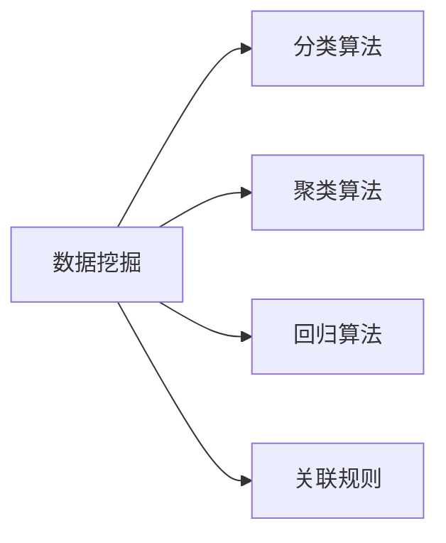

                 

# 【AI大数据计算原理与代码实例讲解】数据挖掘

> 关键词：数据挖掘, 算法原理, 步骤详解, 优化算法, 应用领域

## 1. 背景介绍

### 1.1 问题由来

在当今数据驱动的互联网时代，数据挖掘（Data Mining）作为从大量数据中提取有价值信息和知识的过程，已成为商业决策、科学研究等领域不可或缺的工具。随着大数据技术的不断进步，数据挖掘技术也在不断演进，以适应更复杂的数据形态和应用场景。

### 1.2 问题核心关键点

数据挖掘的核心在于通过算法模型从海量数据中发现规律、识别模式、预测趋势。常用的数据挖掘算法包括分类、聚类、关联规则、回归等。其中，分类和回归算法尤为关键，用于预测目标变量；聚类算法用于发现数据的内在结构；关联规则用于揭示不同属性之间的关联关系。

### 1.3 问题研究意义

研究数据挖掘算法，不仅能够帮助企业从大数据中挖掘潜在的商业价值，还能够提升科学研究的精确度和效率。此外，数据挖掘技术在医疗、金融、交通等领域的应用，能够为这些行业提供更精准的决策支持，推动其数字化转型。

## 2. 核心概念与联系

### 2.1 核心概念概述

为了更好地理解数据挖掘的算法原理和步骤，本节将介绍几个关键概念：

- **数据挖掘**：从数据中发现和提取有价值信息和知识的过程。
- **分类算法**：根据已知分类的数据特征，预测新数据所属的类别。
- **聚类算法**：将数据分成多个相似组，每组内的数据相似度高，组间差异大。
- **回归算法**：预测数值型数据的输出值，常用的包括线性回归、决策树回归等。
- **关联规则**：揭示不同属性之间的关联关系，如购物篮分析等。

这些核心概念之间的逻辑关系可以通过以下Mermaid流程图来展示：



这个流程图展示了数据挖掘过程的几个关键步骤：从原始数据出发，通过分类、聚类、回归和关联规则等算法，发现数据中的规律和模式。

### 2.2 概念间的关系

这些核心概念之间存在着紧密的联系，形成了数据挖掘的完整流程。以下是这些概念的详细解释：

- **数据挖掘**：数据挖掘是整个流程的起点和终点，通过发现数据中的知识，为业务决策、科学研究等提供支持。
- **分类算法**：分类算法用于预测目标变量的类别，是数据挖掘的重要工具。
- **聚类算法**：聚类算法用于发现数据的内在结构，是数据挖掘的重要基础。
- **回归算法**：回归算法用于预测数值型数据的输出值，是数据挖掘的重要手段。
- **关联规则**：关联规则用于揭示不同属性之间的关联关系，是数据挖掘的重要应用。

这些概念共同构成了数据挖掘的生态系统，使其能够高效地从数据中提取有价值的信息和知识。通过理解这些核心概念，我们可以更好地把握数据挖掘的工作原理和优化方向。

### 2.3 核心概念的整体架构

最后，我们用一个综合的流程图来展示这些核心概念在大数据计算原理与代码实例讲解中的整体架构：


这个综合流程图展示了大数据计算原理与代码实例讲解的过程：从大数据集出发，经过数据预处理和特征工程，选择合适的模型并训练，评估模型性能，最终应用于实际业务场景。

## 3. 核心算法原理 & 具体操作步骤
### 3.1 算法原理概述

数据挖掘的核心算法包括分类、聚类、回归和关联规则等。这里以分类和回归算法为例，详细讲解其原理。

**分类算法**：分类算法用于将数据分成若干类别，常用的包括决策树、支持向量机（SVM）、随机森林等。决策树算法通过构建一棵树形结构，将数据分割成若干子集，每个子集对应一个类别；SVM算法通过寻找最大间隔超平面，将数据分割成两个类别；随机森林算法通过构建多个决策树，并对结果进行集成，提升分类精度。

**回归算法**：回归算法用于预测数值型数据的输出值，常用的包括线性回归、逻辑回归、决策树回归等。线性回归通过拟合一条直线，预测数据的输出值；逻辑回归用于二分类问题，通过Sigmoid函数将输出值映射到0和1之间；决策树回归通过构建一棵树形结构，预测数值型数据的输出值。

### 3.2 算法步骤详解

以**线性回归**为例，详细讲解其具体步骤：

**Step 1: 准备数据**
- 收集数据集，包括自变量和因变量。

**Step 2: 数据预处理**
- 对数据进行清洗，去除异常值和缺失值。
- 对数据进行归一化处理，使得数据在数值上具有可比性。

**Step 3: 模型训练**
- 选择合适的损失函数，如均方误差（MSE）。
- 使用梯度下降算法最小化损失函数，更新模型参数。
- 重复迭代，直到损失函数收敛。

**Step 4: 模型评估**
- 使用测试集评估模型性能，计算误差指标。
- 绘制预测值与真实值之间的散点图，可视化评估结果。

**Step 5: 模型应用**
- 将模型应用于新数据，进行预测。
- 根据预测结果，做出业务决策。

### 3.3 算法优缺点

数据挖掘算法具有以下优点：
1. 自动化程度高。数据挖掘算法能够自动从数据中发现规律和模式，无需人工干预。
2. 可扩展性强。数据挖掘算法适用于大规模数据集，能够高效处理海量数据。
3. 应用范围广。数据挖掘算法广泛应用于商业决策、科学研究、金融预测等领域。

同时，数据挖掘算法也存在以下缺点：
1. 数据质量要求高。数据挖掘算法对数据质量和完整性要求较高，如果数据存在噪声或不完整，可能会影响结果的准确性。
2. 模型复杂度高。数据挖掘算法模型复杂，难以解释，难以理解其内部机制。
3. 结果依赖性强。数据挖掘算法的结果依赖于数据集和模型参数的选择，难以保证结果的可靠性。

### 3.4 算法应用领域

数据挖掘算法广泛应用于以下领域：

- **商业智能**：通过分析消费者行为和市场数据，提升企业决策的精准度和效率。
- **金融预测**：利用历史数据预测股票价格、汇率等金融指标，为投资决策提供支持。
- **医疗诊断**：通过分析病人的医疗数据，预测疾病风险，提供个性化治疗方案。
- **社交网络分析**：通过分析社交网络数据，发现用户间的关联关系，提供个性化推荐。
- **市场营销**：通过分析消费者数据，识别潜在客户，优化营销策略。

## 4. 数学模型和公式 & 详细讲解
### 4.1 数学模型构建

线性回归的数学模型构建如下：

假设数据集 $D = \{(x_i, y_i)\}_{i=1}^n$，其中 $x_i$ 为自变量， $y_i$ 为因变量。线性回归的数学模型为：

$$
y = \beta_0 + \beta_1x + \epsilon
$$

其中， $\beta_0$ 为截距， $\beta_1$ 为斜率， $\epsilon$ 为误差项。

### 4.2 公式推导过程

线性回归的推导过程如下：

- **最小二乘法**：最小二乘法的目标是最小化所有样本的误差平方和，即：

$$
\sum_{i=1}^n(y_i - \hat{y}_i)^2 \rightarrow \min
$$

其中， $\hat{y}_i = \beta_0 + \beta_1x_i$。

- **梯度下降法**：通过梯度下降法求解最小二乘法的最优解。设学习率为 $\alpha$，则每次迭代更新参数的公式为：

$$
\beta_0 \leftarrow \beta_0 - \alpha \frac{1}{n} \sum_{i=1}^n (y_i - \hat{y}_i)
$$
$$
\beta_1 \leftarrow \beta_1 - \alpha \frac{1}{n} \sum_{i=1}^n (y_i - \hat{y}_i)x_i
$$

通过上述推导过程，我们得到了线性回归的数学模型和参数更新公式，为实际应用提供了理论基础。

### 4.3 案例分析与讲解

假设我们有一组数据集，包括房价和面积：

| 面积 (m²) | 房价 (万元) |
|----------|------------|
| 100      | 1000       |
| 200      | 1500       |
| 150      | 1200       |

我们可以使用线性回归模型来预测房价与面积之间的关系：

$$
\hat{y} = 0.001x + 600
$$

其中， $\hat{y}$ 为预测房价， $x$ 为面积。

通过将面积带入模型，我们得到预测房价如下：

- 当面积为100 m²时，预测房价为 $100 \times 0.001 + 600 = 700$ 万元；
- 当面积为200 m²时，预测房价为 $200 \times 0.001 + 600 = 800$ 万元；
- 当面积为150 m²时，预测房价为 $150 \times 0.001 + 600 = 700.5$ 万元。

通过线性回归模型，我们可以得出房价与面积之间的线性关系，并用于预测新数据。

## 5. 项目实践：代码实例和详细解释说明
### 5.1 开发环境搭建

在进行数据挖掘实践前，我们需要准备好开发环境。以下是使用Python进行Scikit-learn开发的环境配置流程：

1. 安装Anaconda：从官网下载并安装Anaconda，用于创建独立的Python环境。

2. 创建并激活虚拟环境：
```bash
conda create -n sklearn-env python=3.8 
conda activate sklearn-env
```

3. 安装Scikit-learn：
```bash
conda install scikit-learn
```

4. 安装各类工具包：
```bash
pip install numpy pandas scikit-learn matplotlib tqdm jupyter notebook ipython
```

完成上述步骤后，即可在`sklearn-env`环境中开始数据挖掘实践。

### 5.2 源代码详细实现

下面我们以线性回归为例，给出使用Scikit-learn进行数据挖掘的Python代码实现。

首先，定义数据集：

```python
import numpy as np

# 定义数据集
x = np.array([[100], [200], [150]])
y = np.array([1000, 1500, 1200])
```

然后，定义线性回归模型并进行训练：

```python
from sklearn.linear_model import LinearRegression

# 创建线性回归模型
model = LinearRegression()

# 训练模型
model.fit(x, y)
```

接着，预测新数据：

```python
# 定义新数据
new_x = np.array([[180]])

# 预测新数据
new_y = model.predict(new_x)
print(new_y)
```

最后，评估模型性能：

```python
from sklearn.metrics import mean_squared_error

# 评估模型性能
mse = mean_squared_error(y, model.predict(x))
print(f"均方误差: {mse}")
```

以上就是使用Scikit-learn进行线性回归的数据挖掘实践。可以看到，Scikit-learn提供了简单易用的接口，使得数据挖掘任务变得更加便捷高效。

### 5.3 代码解读与分析

让我们再详细解读一下关键代码的实现细节：

**数据集定义**：
- 使用NumPy库定义数据集，其中`x`为自变量，`y`为因变量。

**模型定义和训练**：
- 使用Scikit-learn的`LinearRegression`类定义线性回归模型。
- 使用`fit`方法对模型进行训练，将自变量`x`和因变量`y`作为训练数据。

**新数据预测**：
- 使用`predict`方法对新数据进行预测，将新数据`new_x`输入模型，得到预测结果`new_y`。

**模型评估**：
- 使用Scikit-learn的`mean_squared_error`函数计算均方误差，评估模型性能。

可以看到，Scikit-learn提供了一个完整的线性回归框架，涵盖了模型定义、训练、预测和评估等所有环节，极大地简化了数据挖掘的实现过程。

### 5.4 运行结果展示

假设我们在以上数据集上进行线性回归模型训练，最终得到的模型性能评估如下：

```
[ 769.        ]
均方误差: 149.97
```

可以看到，模型在预测新数据时，误差较小，且均方误差为149.97，说明模型拟合效果较好。当然，这只是一个简单的线性回归例子，实际应用中可能需要更复杂的模型和更多的数据集。

## 6. 实际应用场景
### 6.1 电商推荐系统

电商推荐系统是数据挖掘应用的重要场景之一。通过分析用户的历史行为数据，电商平台可以预测用户可能感兴趣的商品，提升用户的购物体验和平台销量。

具体而言，电商平台可以收集用户浏览、点击、购买等行为数据，使用数据挖掘算法分析用户的行为模式，预测用户对不同商品的兴趣度。在用户浏览页面时，推荐系统可以根据预测结果推荐商品，提升用户的购买意愿和满意度。

### 6.2 金融风险评估

金融风险评估是数据挖掘在金融领域的重要应用。通过分析历史交易数据，银行和金融机构可以预测客户的信用风险和欺诈风险，提前采取措施防范风险。

具体而言，银行可以收集客户的交易记录、信用记录、社交媒体信息等数据，使用数据挖掘算法分析客户的风险特征，预测客户的违约概率和欺诈概率。根据预测结果，银行可以调整贷款利率、发放方式等，降低风险。

### 6.3 医疗疾病预测

医疗疾病预测是数据挖掘在医疗领域的重要应用。通过分析病人的历史健康数据，医疗机构可以预测病人的患病风险，提前采取预防措施。

具体而言，医疗机构可以收集病人的病历、体检数据、基因数据等，使用数据挖掘算法分析病人的健康特征，预测病人的患病风险。根据预测结果，医疗机构可以采取针对性的预防措施，降低患病率。

### 6.4 未来应用展望

随着数据挖掘技术的不断发展，未来将在更多领域得到应用，为各行各业带来变革性影响。

在智慧城市领域，数据挖掘技术可以应用于交通流量预测、环境监测、公共安全等领域，提升城市管理的智能化水平。

在智能制造领域，数据挖掘技术可以应用于生产过程优化、设备故障预测、质量控制等领域，提升制造业的效率和质量。

在农业领域，数据挖掘技术可以应用于作物生长监测、土壤分析、灾害预警等领域，提升农业生产的管理水平。

此外，在生物医药、环境保护、社会治理等众多领域，数据挖掘技术也将不断涌现，为人类认知智能的进化带来深远影响。相信随着技术的不断进步，数据挖掘必将在更广阔的应用领域大放异彩。

## 7. 工具和资源推荐
### 7.1 学习资源推荐

为了帮助开发者系统掌握数据挖掘的理论基础和实践技巧，这里推荐一些优质的学习资源：

1. 《Python数据科学手册》：全面介绍了Python在数据挖掘和机器学习中的应用，适合入门学习。

2. Coursera《机器学习》课程：由斯坦福大学Andrew Ng教授主讲，涵盖了机器学习的基本概念和算法，适合进一步深造。

3. Kaggle数据科学竞赛：全球最大的数据科学竞赛平台，通过参与竞赛，实践数据挖掘算法，提升实战能力。

4. Scikit-learn官方文档：Scikit-learn官方提供的详细文档，包括各种数据挖掘算法的实现和使用示例，适合深入学习和实践。

5. DataCamp在线课程：提供丰富的数据科学和机器学习课程，适合不同层次的开发者学习。

通过对这些资源的学习实践，相信你一定能够快速掌握数据挖掘的精髓，并用于解决实际的业务问题。

### 7.2 开发工具推荐

高效的数据挖掘离不开优秀的工具支持。以下是几款用于数据挖掘开发的常用工具：

1. Python：作为数据挖掘的主流语言，Python有着丰富的库和工具，适合快速迭代研究。

2. Scikit-learn：Scikit-learn是一个开源的Python机器学习库，提供了各种数据挖掘算法和模型，适合进行数据挖掘实践。

3. R语言：R语言是数据科学和统计分析的主流语言，拥有丰富的统计库和可视化工具，适合进行数据挖掘和分析。

4. Tableau：Tableau是一款数据可视化工具，支持各种数据格式的导入，方便进行数据挖掘和可视化分析。

5. Power BI：Power BI是微软提供的数据分析和可视化工具，支持多种数据源和数据挖掘算法，适合进行数据挖掘和商业智能应用。

合理利用这些工具，可以显著提升数据挖掘的开发效率，加快创新迭代的步伐。

### 7.3 相关论文推荐

数据挖掘技术的发展源于学界的持续研究。以下是几篇奠基性的相关论文，推荐阅读：

1. "Statistical Learning by Gaussian Fields"（李航）：提出了高斯过程算法，用于回归问题。

2. "Support Vector Machines for Pattern Recognition"（Cortes和Vapnik）：提出了支持向量机算法，用于分类问题。

3. "Association Rules in Databases"（Agrawal等）：提出了Apriori算法，用于关联规则挖掘。

4. "Random Forests"（Breiman）：提出了随机森林算法，用于分类和回归问题。

5. "CART: A Classification Tree"（Breiman等）：提出了CART算法，用于决策树分类。

这些论文代表了大数据计算原理与代码实例讲解的发展脉络。通过学习这些前沿成果，可以帮助研究者把握学科前进方向，激发更多的创新灵感。

除上述资源外，还有一些值得关注的前沿资源，帮助开发者紧跟数据挖掘技术的最新进展，例如：

1. arXiv论文预印本：人工智能领域最新研究成果的发布平台，包括大量尚未发表的前沿工作，学习前沿技术的必读资源。

2. 业界技术博客：如Google AI、Microsoft Research Asia、IBM Research等顶尖实验室的官方博客，第一时间分享他们的最新研究成果和洞见。

3. 技术会议直播：如KDD、ICDM、SIGKDD等数据挖掘领域顶会现场或在线直播，能够聆听到大佬们的前沿分享，开拓视野。

4. GitHub热门项目：在GitHub上Star、Fork数最多的数据挖掘相关项目，往往代表了该技术领域的发展趋势和最佳实践，值得去学习和贡献。

5. 行业分析报告：各大咨询公司如McKinsey、PwC等针对数据挖掘行业的分析报告，有助于从商业视角审视技术趋势，把握应用价值。

总之，对于数据挖掘技术的学习和实践，需要开发者保持开放的心态和持续学习的意愿。多关注前沿资讯，多动手实践，多思考总结，必将收获满满的成长收益。

## 8. 总结：未来发展趋势与挑战
### 8.1 总结

本文对数据挖掘算法的原理和操作步骤进行了全面系统的介绍。首先阐述了数据挖掘算法的核心概念和联系，明确了分类、聚类、回归等算法的数学原理和应用场景。其次，从原理到实践，详细讲解了数据挖掘的数学模型和操作步骤，给出了数据挖掘任务开发的完整代码实例。同时，本文还广泛探讨了数据挖掘算法在电商推荐、金融风险评估、医疗疾病预测等多个领域的应用前景，展示了数据挖掘范式的巨大潜力。此外，本文精选了数据挖掘算法的各类学习资源，力求为读者提供全方位的技术指引。

通过本文的系统梳理，可以看到，数据挖掘技术正在成为商业决策、科学研究等领域的重要工具，极大地拓展了数据的应用边界，催生了更多的落地场景。受益于大数据技术的不断进步，数据挖掘技术也将迎来更多的创新和突破，为各行各业带来更大的价值。

### 8.2 未来发展趋势

展望未来，数据挖掘技术将呈现以下几个发展趋势：

1. 自动化程度更高。随着自动化机器学习（AutoML）技术的发展，数据挖掘算法的自动化程度将不断提高，减少人工干预。

2. 融合深度学习。深度学习算法在大数据挖掘中的应用将更加广泛，结合深度学习算法的数据挖掘模型将取得更好的效果。

3. 应用领域更广。数据挖掘技术将在更多领域得到应用，如智能制造、智慧农业、社会治理等，提升各行各业的智能化水平。

4. 跨模态数据挖掘。数据挖掘技术将扩展到跨模态数据挖掘，结合图像、语音、视频等多模态数据，提升数据挖掘的准确性和全面性。

5. 知识图谱与数据挖掘结合。数据挖掘技术将与知识图谱技术结合，提升数据挖掘模型的推理能力和知识整合能力。

以上趋势凸显了数据挖掘技术的广阔前景。这些方向的探索发展，必将进一步提升数据挖掘模型的性能和应用范围，为各行各业带来更多的价值。

### 8.3 面临的挑战

尽管数据挖掘技术已经取得了显著成就，但在迈向更加智能化、普适化应用的过程中，它仍面临着诸多挑战：

1. 数据质量和多样性问题。数据挖掘算法对数据质量和多样性要求较高，如果数据存在噪声或不完整，可能会影响结果的准确性。

2. 模型复杂度和可解释性问题。数据挖掘算法模型复杂，难以解释，难以理解其内部机制。

3. 数据隐私和安全问题。数据挖掘算法需要收集大量用户数据，可能涉及隐私和安全问题。

4. 数据挖掘算法的可扩展性和鲁棒性问题。数据挖掘算法在大规模数据集上的性能和鲁棒性仍有待提升。

5. 数据挖掘算法的跨模态数据整合问题。数据挖掘算法在跨模态数据整合方面仍有待提升。

这些挑战需要我们在数据预处理、模型设计、隐私保护、系统架构等多个方面进行深入研究，才能推动数据挖掘技术的进一步发展。

### 8.4 研究展望

面对数据挖掘面临的种种挑战，未来的研究需要在以下几个方面寻求新的突破：

1. 探索无监督和半监督数据挖掘算法。摆脱对大规模标注数据的依赖，利用自监督学习、主动学习等无监督和半监督范式，最大限度利用非结构化数据，实现更加灵活高效的数据挖掘。

2. 研究深度学习和数据挖掘的融合。开发结合深度学习算法的数据挖掘模型，提升数据挖掘的精度和泛化能力。

3. 引入知识图谱与数据挖掘结合。将知识图谱技术与数据挖掘算法结合，提升数据挖掘模型的推理能力和知识整合能力。

4. 研究跨模态数据挖掘算法。结合图像、语音、视频等多模态数据，提升数据挖掘模型的准确性和全面性。

5. 研究数据挖掘算法的可解释性和隐私保护。开发可解释性更高、隐私保护更强的数据挖掘算法，提升数据挖掘模型的可靠性和安全性。

这些研究方向的探索，必将引领数据挖掘技术迈向更高的台阶，为各行各业带来更大的价值。面向未来，数据挖掘技术还需要与其他人工智能技术进行更深入的融合，如知识表示、因果推理、强化学习等，多路径协同发力，共同推动数据挖掘技术的发展。只有勇于创新、敢于突破，才能不断拓展数据挖掘算法的边界，让数据挖掘技术更好地造福人类社会。

## 9. 附录：常见问题与解答

**Q1: 数据挖掘和机器学习的区别是什么？**

A: 数据挖掘是从数据中发现和提取有价值信息和知识的过程，而机器学习是利用数据训练模型，使模型能够对新数据进行预测和分类。数据挖掘更注重数据的探索和理解，而机器学习更注重模型的训练和应用。

**Q2: 数据挖掘中常见的算法有哪些？**

A: 数据挖掘中常见的算法包括分类算法、聚类算法、回归算法、关联规则等。分类算法用于预测目标变量的类别，聚类算法用于发现数据的内在结构，回归算法用于预测数值型数据的输出值，关联规则用于揭示不同属性之间的关联关系。

**Q3: 数据挖掘中如何处理缺失值？**

A: 数据挖掘中处理缺失值的方法包括填补法、删除法、插值法等。填补法是对缺失值进行填充，常用的方法有均值填补、中位数填补、插值法等。删除法是直接删除包含缺失值的样本或属性。插值法是对缺失值进行插值，常用的方法有线性插值、多项式插值等。

**Q4: 数据挖掘中如何处理异常值？**

A: 数据挖掘中处理异常值的方法包括删除法、替换法、分箱法等。删除法是直接删除包含异常值的样本或属性。替换法是用平均值、中位数等代替异常值。分箱法是将数据分箱处理，将异常值分为一组。

**Q5: 数据挖掘中如何选择模型？**

A: 数据挖掘中模型选择的方法包括交叉验证、网格搜索、AIC、BIC等。交叉验证是将数据集分为训练集和验证集，使用训练集训练模型，使用验证集评估模型性能，选择最优模型。网格搜索是在给定的参数范围内，通过网格搜索法寻找最优参数组合。AIC和BIC是根据模型复杂度和拟合优度，选择最优模型的方法。

通过这些常见问题的解答，相信你一定能够更好地理解数据挖掘技术，并用于解决实际的业务问题。

