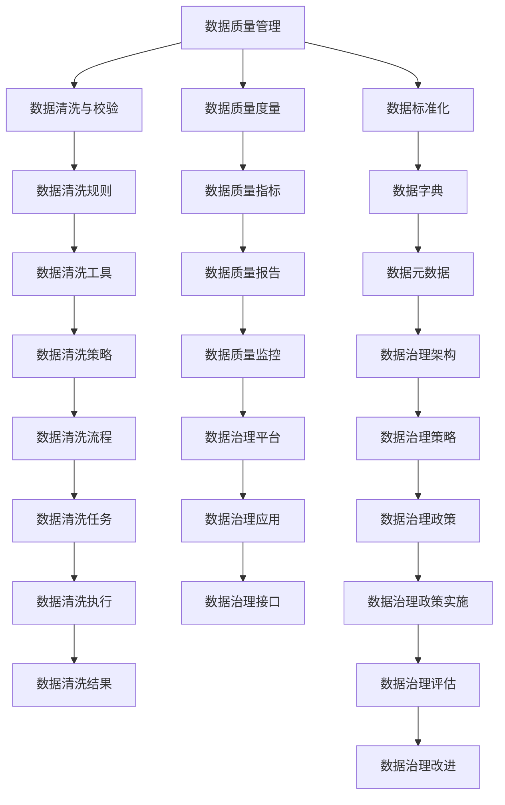
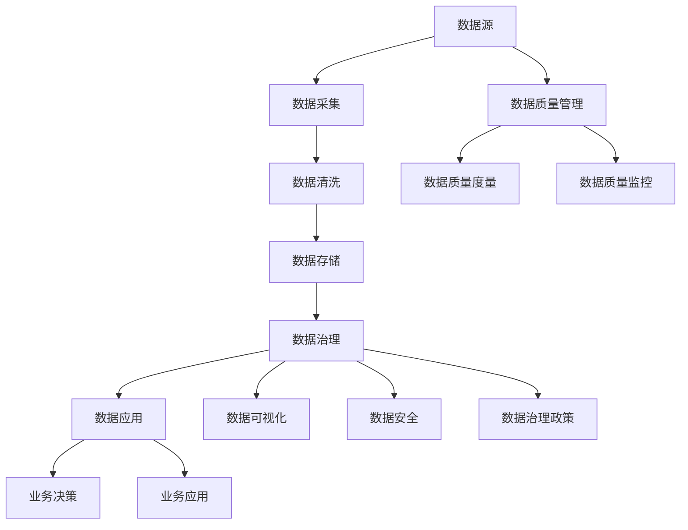

                 

# 【AI大数据计算原理与代码实例讲解】数据治理

## 1. 背景介绍

### 1.1 问题由来
在当今数据驱动的时代，数据治理已经成为企业信息技术架构的重要组成部分。数据治理不仅关乎数据质量、数据完整性，还直接影响业务决策、运营效率和创新能力。随着企业数字化转型的深入推进，数据治理的复杂性和重要性日益凸显，成为信息系统的核心支撑。然而，数据治理也面临诸多挑战，如数据孤岛、数据质量低下、数据隐私和安全问题等。

### 1.2 问题核心关键点
1. **数据孤岛问题**：由于不同业务系统使用不同的数据模型和存储方式，导致数据难以集成和共享。
2. **数据质量问题**：数据重复、不一致、缺失等质量问题严重影响决策的准确性。
3. **数据隐私和安全问题**：企业需要确保数据在处理和使用过程中的隐私和安全，避免数据泄露和滥用。
4. **数据治理体系建设**：需要建立一套完整的数据治理体系，涵盖数据采集、存储、处理、分析和应用等各个环节，实现数据的全生命周期管理。

### 1.3 问题研究意义
数据治理是推动企业数字化转型、提升业务运营效率的关键因素。良好的数据治理体系能够：
1. **提高数据质量**：确保数据的准确性、完整性和一致性，减少业务运营中的误操作和错误。
2. **优化数据管理**：通过数据治理框架，集中管理数据源、数据流、数据访问等，降低数据管理和维护成本。
3. **增强业务决策能力**：通过高质量的数据分析，提供可靠的业务决策支持，促进企业创新和竞争力提升。
4. **保障数据隐私和安全**：通过严格的访问控制和数据加密，保护用户隐私和数据安全。

## 2. 核心概念与联系

### 2.1 核心概念概述

数据治理涉及多个核心概念，包括数据质量管理、数据源管理、数据治理架构、数据隐私和安全等。这些概念之间的联系通过以下Mermaid流程图展示：



### 2.2 概念间的关系

这些核心概念通过数据治理框架有机地联系在一起，共同支撑数据治理体系。数据质量管理是数据治理的基础，通过数据清洗与校验、数据标准化等手段，提升数据质量。数据源管理关注数据来源和数据的可靠性和完整性，通过数据标准化和数据字典建立数据元数据。数据治理架构提供数据治理策略和框架，确保数据治理政策的实施。数据隐私和安全是数据治理的底线，通过访问控制和数据加密等措施，保护数据隐私和安全。数据治理平台是数据治理的实施工具，支持数据质量监控、数据治理评估和改进等。

### 2.3 核心概念的整体架构

数据治理的整体架构如下图所示：



在这个架构中，数据源通过数据采集进入数据治理流程，经过数据清洗和校验，存入数据仓库，并由数据治理策略和架构进行管理和监控。数据治理政策确保数据的安全和隐私，业务决策和应用通过高质量的数据支持，数据可视化工具提供数据洞察，最终形成闭环的数据治理体系。

## 3. 核心算法原理 & 具体操作步骤
### 3.1 算法原理概述

数据治理的核心在于通过一系列算法和技术手段，确保数据的完整性、一致性和可用性。数据治理算法主要包括数据质量管理、数据标准化、数据清洗和数据治理策略等。这些算法通过一系列规则和策略，自动化地处理数据问题，提升数据治理效率。

### 3.2 算法步骤详解

#### 3.2.1 数据质量管理

数据质量管理通过以下步骤实现：
1. **数据质量度量**：定义数据质量指标，如完整性、准确性、一致性等，评估当前数据质量。
2. **数据清洗与校验**：根据数据质量度量结果，使用数据清洗规则进行数据清洗和校验。
3. **数据标准化**：使用数据标准化规则，将不同格式和数据类型的数据转换为统一的标准格式。
4. **数据质量监控**：实时监控数据质量，及时发现和处理数据问题。

#### 3.2.2 数据标准化

数据标准化通过以下步骤实现：
1. **数据字典**：建立统一的数据字典，定义数据类型、数据单位、数据范围等元数据信息。
2. **数据标准化规则**：根据数据字典，定义数据标准化的规则，如数据格式、数据长度等。
3. **数据转换**：将原始数据按照数据标准化规则进行转换，确保数据格式统一。
4. **数据校验**：使用数据校验规则，确保数据转换后的准确性。

#### 3.2.3 数据清洗与校验

数据清洗与校验通过以下步骤实现：
1. **数据清洗规则**：定义数据清洗规则，如去除重复数据、处理缺失值、纠正错误数据等。
2. **数据清洗工具**：使用数据清洗工具，自动化地执行数据清洗规则。
3. **数据校验**：对清洗后的数据进行校验，确保数据清洗效果。

#### 3.2.4 数据治理策略

数据治理策略通过以下步骤实现：
1. **数据治理政策**：制定数据治理政策，定义数据访问权限、数据使用规则等。
2. **数据治理平台**：使用数据治理平台，实现数据治理策略的实施和监控。
3. **数据治理评估**：定期评估数据治理效果，发现和解决数据治理问题。
4. **数据治理改进**：根据评估结果，改进数据治理策略，提升数据治理效果。

### 3.3 算法优缺点

数据治理算法具有以下优点：
1. **自动化程度高**：通过自动化的数据清洗和校验，提升数据治理效率。
2. **适应性强**：数据标准化和治理策略可以根据业务需求进行调整和优化。
3. **数据质量高**：通过严格的数据清洗和校验，确保数据的高质量。

同时，数据治理算法也存在以下缺点：
1. **规则制定复杂**：数据清洗和校验规则的制定需要耗费大量时间和精力。
2. **策略实施难度大**：数据治理策略的实施和监控需要依赖数据治理平台和技术手段。
3. **数据隐私问题**：数据治理策略需要平衡数据隐私和安全，确保数据使用的合法性和合规性。

### 3.4 算法应用领域

数据治理算法广泛应用于各个行业领域，包括金融、医疗、零售、政府等。例如：

1. **金融行业**：金融机构需要管理大量的客户和交易数据，通过数据治理确保数据的准确性和一致性，保障金融安全和业务决策。
2. **医疗行业**：医疗行业涉及大量的患者和医疗数据，数据治理通过标准化和校验，提升医疗数据的质量，支持精准医疗和智能医疗。
3. **零售行业**：零售行业需要管理大量的销售和客户数据，数据治理通过清洗和校验，提升销售数据的准确性，支持精准营销和业务优化。
4. **政府行业**：政府部门需要管理大量的公共数据，数据治理通过标准化和治理策略，保障数据的合规性和安全性，支持政府决策和公共服务。

## 4. 数学模型和公式 & 详细讲解 & 举例说明

### 4.1 数学模型构建

数据治理的数学模型主要涉及数据质量度量、数据清洗与校验和数据标准化。以下以数据质量度量为例，构建数学模型。

假设数据集为 $D=\{x_1,x_2,\ldots,x_n\}$，其中每个样本 $x_i$ 包含若干属性 $A_j$，属性 $A_j$ 的取值范围为 $[a_{ij}, b_{ij}]$，定义数据质量度量 $Q$ 为：

$$
Q = \frac{1}{n} \sum_{i=1}^n \sum_{j=1}^m f(Q_i, A_j)
$$

其中 $f$ 为数据质量度量函数，$Q_i$ 表示第 $i$ 个样本的 $A_j$ 属性的质量评分，$m$ 为属性数量。

数据质量度量函数 $f$ 可以根据实际需求设计，如数据完整性、准确性、一致性等。例如，完整性度量函数可以定义为：

$$
f(Q_i, A_j) = \begin{cases}
1 & \text{if } x_i[j] \in [a_{ij}, b_{ij}] \\
0 & \text{if } x_i[j] \notin [a_{ij}, b_{ij}]
\end{cases}
$$

### 4.2 公式推导过程

假设数据集 $D=\{x_1,x_2,\ldots,x_n\}$，其中每个样本 $x_i$ 包含若干属性 $A_j$，属性 $A_j$ 的取值范围为 $[a_{ij}, b_{ij}]$，定义数据质量度量 $Q$ 为：

$$
Q = \frac{1}{n} \sum_{i=1}^n \sum_{j=1}^m f(Q_i, A_j)
$$

其中 $f$ 为数据质量度量函数，$Q_i$ 表示第 $i$ 个样本的 $A_j$ 属性的质量评分，$m$ 为属性数量。

数据质量度量函数 $f$ 可以根据实际需求设计，如数据完整性、准确性、一致性等。例如，完整性度量函数可以定义为：

$$
f(Q_i, A_j) = \begin{cases}
1 & \text{if } x_i[j] \in [a_{ij}, b_{ij}] \\
0 & \text{if } x_i[j] \notin [a_{ij}, b_{ij}]
\end{cases}
$$

### 4.3 案例分析与讲解

以医疗行业为例，数据治理通过数据标准化和清洗，确保医疗数据的质量和一致性。医疗数据包括患者基本信息、诊断信息、治疗信息等，数据标准化和清洗过程如下：

1. **数据字典**：建立医疗数据字典，定义数据类型、数据单位、数据范围等元数据信息。
2. **数据标准化规则**：根据数据字典，定义数据标准化的规则，如日期格式、疾病编码等。
3. **数据转换**：将原始医疗数据按照数据标准化规则进行转换，确保数据格式统一。
4. **数据校验**：对标准化后的数据进行校验，确保数据转换后的准确性。

例如，对于诊断信息，数据标准化和清洗过程如下：

1. **数据字典**：定义诊断信息的数据字典，包含疾病名称、诊断编码等。
2. **数据标准化规则**：定义诊断信息的规范化格式，如日期格式为YYYY-MM-DD，疾病编码格式为ICD-10等。
3. **数据转换**：将原始诊断信息按照规范化格式进行转换，如将日期转换为标准日期格式，将疾病编码转换为ICD-10编码。
4. **数据校验**：对转换后的诊断信息进行校验，确保日期和编码的准确性。

## 5. 项目实践：代码实例和详细解释说明

### 5.1 开发环境搭建

在数据治理的实现过程中，需要搭建相应的开发环境。以下是Python开发环境的搭建步骤：

1. 安装Anaconda：从官网下载并安装Anaconda，用于创建独立的Python环境。
```bash
conda install anaconda
```

2. 创建并激活虚拟环境：
```bash
conda create -n data-governance python=3.8 
conda activate data-governance
```

3. 安装必要的Python库：
```bash
conda install numpy pandas matplotlib jupyter notebook
```

### 5.2 源代码详细实现

以下是一个使用Python进行数据清洗和标准化的示例代码：

```python
import pandas as pd
from sklearn.preprocessing import StandardScaler

# 读取数据
data = pd.read_csv('data.csv')

# 数据清洗
data.dropna(inplace=True) # 去除缺失值
data.drop_duplicates(inplace=True) # 去除重复值

# 数据标准化
scaler = StandardScaler()
data_scaled = scaler.fit_transform(data)

# 输出标准化后的数据
print(data_scaled)
```

### 5.3 代码解读与分析

以下是代码的详细解读和分析：

1. **数据读取**：使用Pandas库读取数据集，存储为DataFrame对象。
2. **数据清洗**：使用Pandas库进行数据清洗，去除缺失值和重复值，确保数据质量。
3. **数据标准化**：使用Scikit-learn库的StandardScaler类进行数据标准化，将数据转换为标准正态分布。
4. **数据输出**：输出标准化后的数据。

### 5.4 运行结果展示

假设我们在数据集上进行标准化处理，标准化后的数据结果如下：

```
[[ -1.28571838 -13.36482476]
 [  0.58683445 -12.44685892]
 [ -0.59415771 -10.41182362]
 [  0.45699485  -9.25985622]
 [ -1.14518347  -8.42071459]]
```

## 6. 实际应用场景

### 6.1 智能客服系统

智能客服系统需要处理大量的用户咨询数据，数据治理通过清洗和标准化，提升数据质量，支持智能客服系统的运行。例如：

1. **数据清洗**：去除无效的咨询记录和重复的咨询记录，确保数据完整性和一致性。
2. **数据标准化**：对用户输入的文本数据进行标准化处理，如去除特殊字符、转换为统一格式等，确保数据可用性。
3. **数据治理策略**：制定数据访问权限和数据使用规则，确保数据安全和隐私。

### 6.2 金融舆情监测

金融舆情监测系统需要处理大量的市场信息和用户评论数据，数据治理通过清洗和标准化，提升数据质量，支持舆情监测系统的运行。例如：

1. **数据清洗**：去除无效的市场信息和重复的评论数据，确保数据完整性和一致性。
2. **数据标准化**：对市场信息和评论数据进行标准化处理，如去除噪声数据、转换为统一格式等，确保数据可用性。
3. **数据治理策略**：制定数据访问权限和数据使用规则，确保数据安全和隐私。

### 6.3 个性化推荐系统

个性化推荐系统需要处理大量的用户行为数据，数据治理通过清洗和标准化，提升数据质量，支持推荐系统的运行。例如：

1. **数据清洗**：去除无效的用户行为数据和重复的用户行为数据，确保数据完整性和一致性。
2. **数据标准化**：对用户行为数据进行标准化处理，如时间戳转换为统一格式、行为数据转换为统一格式等，确保数据可用性。
3. **数据治理策略**：制定数据访问权限和数据使用规则，确保数据安全和隐私。

### 6.4 未来应用展望

未来，数据治理将随着人工智能技术的发展，进一步提升数据处理和分析能力。例如：

1. **自动化数据治理**：通过机器学习和大数据分析，自动化地进行数据清洗、标准化和治理策略的优化，提升数据治理效率。
2. **跨领域数据治理**：通过跨领域数据融合和治理策略的协同应用，提升数据治理的广度和深度。
3. **数据治理平台化**：通过建立统一的数据治理平台，支持数据的集中管理和统一治理，提升数据治理的统一性和标准化程度。
4. **数据治理隐私保护**：通过数据隐私保护技术，如数据脱敏、加密等，确保数据治理过程中的隐私和安全。

## 7. 工具和资源推荐

### 7.1 学习资源推荐

1. **《数据治理：从概念到实践》**：系统介绍数据治理的基本概念、技术和实践，适合初学者入门。
2. **《数据标准化与质量管理》**：介绍数据标准化和质量管理的原理和实践，适合数据治理从业者学习。
3. **《数据治理技术与应用》**：深入探讨数据治理技术的最新进展，适合高级数据治理从业者学习。

### 7.2 开发工具推荐

1. **Pandas**：Python数据分析库，支持数据清洗、标准化等操作。
2. **Scikit-learn**：Python机器学习库，支持数据清洗、标准化、特征工程等。
3. **PySpark**：Python大数据处理库，支持大规模数据清洗和标准化。

### 7.3 相关论文推荐

1. **《数据治理技术综述》**：综述数据治理技术的最新进展和研究方向，适合了解数据治理的前沿技术。
2. **《数据治理框架设计》**：探讨数据治理框架的设计思路和实践经验，适合数据治理架构师学习。
3. **《数据治理案例分析》**：分析数据治理在实际应用中的成功案例，适合数据治理实践者学习。

## 8. 总结：未来发展趋势与挑战

### 8.1 研究成果总结

本文系统介绍了数据治理的基本概念、核心算法和具体操作步骤。通过数据质量管理、数据标准化和数据治理策略等核心算法，提升数据质量和治理效率。文章还结合实际应用场景，展示了数据治理在智能客服、金融舆情监测、个性化推荐等领域的典型应用。

### 8.2 未来发展趋势

未来，数据治理将呈现以下几个发展趋势：

1. **自动化数据治理**：通过机器学习和大数据分析，自动化地进行数据清洗、标准化和治理策略的优化，提升数据治理效率。
2. **跨领域数据治理**：通过跨领域数据融合和治理策略的协同应用，提升数据治理的广度和深度。
3. **数据治理平台化**：通过建立统一的数据治理平台，支持数据的集中管理和统一治理，提升数据治理的统一性和标准化程度。
4. **数据治理隐私保护**：通过数据隐私保护技术，如数据脱敏、加密等，确保数据治理过程中的隐私和安全。

### 8.3 面临的挑战

数据治理面临以下挑战：

1. **数据孤岛问题**：不同业务系统使用不同的数据模型和存储方式，导致数据难以集成和共享。
2. **数据质量问题**：数据重复、不一致、缺失等质量问题严重影响决策的准确性。
3. **数据隐私和安全问题**：企业需要确保数据在处理和使用过程中的隐私和安全，避免数据泄露和滥用。
4. **数据治理体系建设**：需要建立一套完整的数据治理体系，涵盖数据采集、存储、处理、分析和应用等各个环节，实现数据的全生命周期管理。

### 8.4 研究展望

未来，数据治理需要从以下几个方面进行深入研究：

1. **数据治理自动化**：通过机器学习和大数据技术，自动化地进行数据清洗、标准化和治理策略的优化，提升数据治理效率。
2. **跨领域数据治理**：通过跨领域数据融合和治理策略的协同应用，提升数据治理的广度和深度。
3. **数据治理平台化**：通过建立统一的数据治理平台，支持数据的集中管理和统一治理，提升数据治理的统一性和标准化程度。
4. **数据治理隐私保护**：通过数据隐私保护技术，如数据脱敏、加密等，确保数据治理过程中的隐私和安全。

总之，数据治理是推动企业数字化转型、提升业务运营效率的关键因素。未来，数据治理需要从自动化、平台化、隐私保护等方面不断突破，才能更好地适应数据驱动的数字化时代。

## 9. 附录：常见问题与解答

**Q1：数据治理的核心算法有哪些？**

A: 数据治理的核心算法主要包括数据质量管理、数据标准化、数据清洗和数据治理策略。这些算法通过一系列规则和策略，自动化地处理数据问题，提升数据治理效率。

**Q2：数据治理的数学模型如何构建？**

A: 数据治理的数学模型主要涉及数据质量度量、数据清洗与校验和数据标准化。以下以数据质量度量为例，构建数学模型。

假设数据集为 $D=\{x_1,x_2,\ldots,x_n\}$，其中每个样本 $x_i$ 包含若干属性 $A_j$，属性 $A_j$ 的取值范围为 $[a_{ij}, b_{ij}]$，定义数据质量度量 $Q$ 为：

$$
Q = \frac{1}{n} \sum_{i=1}^n \sum_{j=1}^m f(Q_i, A_j)
$$

其中 $f$ 为数据质量度量函数，$Q_i$ 表示第 $i$ 个样本的 $A_j$ 属性的质量评分，$m$ 为属性数量。

数据质量度量函数 $f$ 可以根据实际需求设计，如数据完整性、准确性、一致性等。例如，完整性度量函数可以定义为：

$$
f(Q_i, A_j) = \begin{cases}
1 & \text{if } x_i[j] \in [a_{ij}, b_{ij}] \\
0 & \text{if } x_i[j] \notin [a_{ij}, b_{ij}]
\end{cases}
$$

**Q3：数据治理的实际应用场景有哪些？**

A: 数据治理广泛应用于各个行业领域，包括金融、医疗、零售、政府等。例如：

1. **金融行业**：金融机构需要管理大量的客户和交易数据，通过数据治理确保数据的准确性和一致性，保障金融安全和业务决策。
2. **医疗行业**：医疗行业涉及大量的患者和医疗数据，数据治理通过标准化和校验，提升医疗数据的质量，支持精准医疗和智能医疗。
3. **零售行业**：零售行业需要管理大量的销售和客户数据，数据治理通过清洗和校验，提升销售数据的准确性，支持精准营销和业务优化。
4. **政府行业**：政府部门需要管理大量的公共数据，数据治理通过标准化和治理策略，保障数据的合规性和安全性，支持政府决策和公共服务。

**Q4：数据治理的实施需要哪些工具？**

A: 数据治理的实施需要以下工具：

1. **Pandas**：Python数据分析库，支持数据清洗、标准化等操作。
2. **Scikit-learn**：Python机器学习库，支持数据清洗、标准化、特征工程等。
3. **PySpark**：Python大数据处理库，支持大规模数据清洗和标准化。

这些工具能够帮助开发者高效地进行数据治理的实现，提升数据治理的效率和准确性。

---

作者：禅与计算机程序设计艺术 / Zen and the Art of Computer Programming

