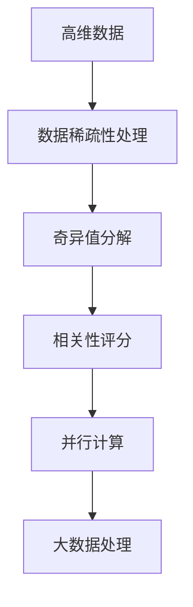
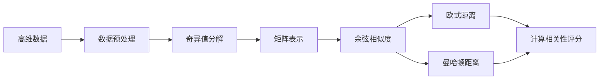
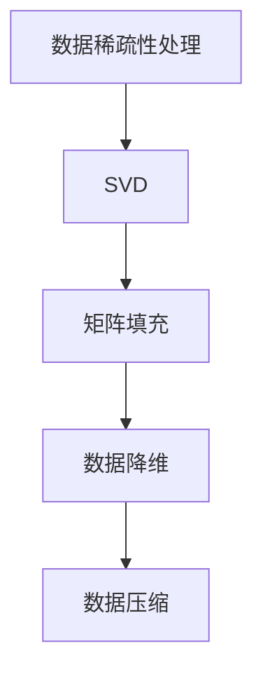
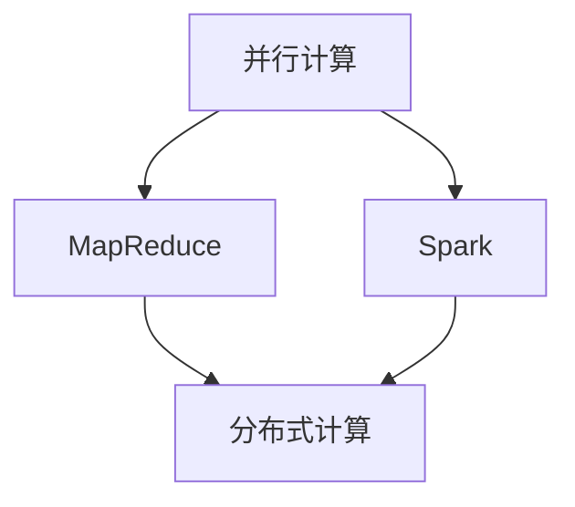
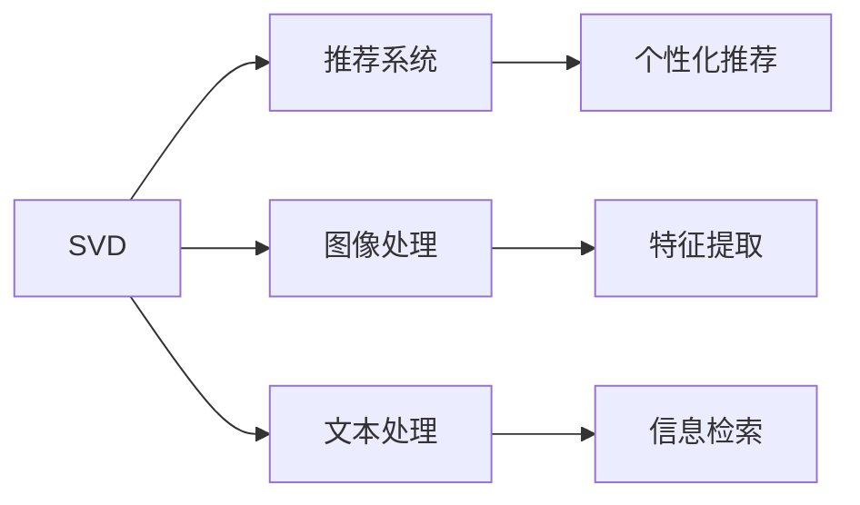
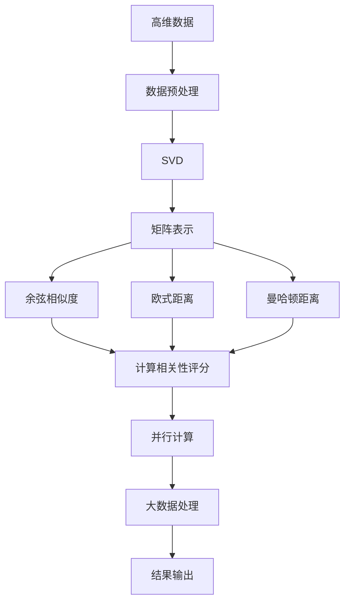

                 

# 【AI大数据计算原理与代码实例讲解】相关性评分

> 关键词：相关性评分, AI大数据, 数据处理, 计算原理, 代码实例, 深度学习

## 1. 背景介绍

### 1.1 问题由来
在人工智能和大数据领域，数据处理和计算效率是关键。随着数据量的爆炸式增长，如何高效地处理和计算大数据，成为了一个亟待解决的问题。其中，相关性评分（Similarity Scoring）在信息检索、推荐系统、数据挖掘等领域得到了广泛应用，其核心目标是测量两个或多个数据对象之间的相似度或相关性。

相关性评分不仅可以用于文本处理，还可以应用于图像、音频等多模态数据。通过计算相关性评分，可以发现数据之间的潜在关联，进行分类、聚类等任务，从而提升数据处理的效率和精度。因此，相关性评分的研究具有重要的理论意义和实际价值。

### 1.2 问题核心关键点
相关性评分的核心问题是如何在高维空间中高效计算和评估数据对象之间的相似度。常见的方法包括余弦相似度（Cosine Similarity）、欧式距离（Euclidean Distance）、曼哈顿距离（Manhattan Distance）等。这些方法各有优劣，适用于不同的数据类型和应用场景。

在实际应用中，相关性评分的关键在于：
1. 选择合适的评分方法。根据数据类型和应用场景，选择合适的评分方法，如余弦相似度适用于文本数据，欧式距离适用于数值型数据。
2. 考虑数据稀疏性。高维空间中数据往往稀疏，需要采取有效的方法处理数据稀疏性，如矩阵分解、奇异值分解等。
3. 优化计算效率。大数据处理中计算效率尤为重要，需要采用高效的算法和并行计算技术，如MapReduce、Spark等。
4. 处理噪声数据。实际应用中数据往往包含噪声，需要通过数据清洗、预处理等方法提高数据质量。

### 1.3 问题研究意义
研究相关性评分技术，对于提升大数据处理效率，优化信息检索、推荐系统等任务性能，具有重要意义：

1. 降低计算成本。相关性评分技术可以高效计算数据之间的相似度，减少计算资源消耗。
2. 提升信息检索精度。通过准确计算相关性评分，可以有效过滤无关数据，提升检索效率和精度。
3. 优化推荐算法。相关性评分可以作为推荐系统中的核心指标，通过计算用户行为和物品之间的相关性，实现个性化推荐。
4. 促进数据挖掘。相关性评分可以发现数据之间的潜在关联，进行分类、聚类等任务，从而提升数据挖掘的效果。

## 2. 核心概念与联系

### 2.1 核心概念概述

为更好地理解相关性评分技术，本节将介绍几个密切相关的核心概念：

- **相关性评分（Similarity Scoring）**：计算数据对象之间的相似度或相关性。常见的方法包括余弦相似度、欧式距离、曼哈顿距离等。
- **高维数据（High-Dimensional Data）**：数据维度超过3的数据，常见于文本、图像、音频等。高维数据的处理需要特别的方法和技巧。
- **数据稀疏性（Data Sparsity）**：高维数据中往往存在大量无效或缺失值，数据稀疏性处理是相关性评分中的一个重要问题。
- **并行计算（Parallel Computing）**：通过并行计算技术，可以显著提高大数据处理效率。
- **奇异值分解（Singular Value Decomposition, SVD）**：一种常用的矩阵分解技术，可以处理高维数据中的噪声和冗余信息。

这些核心概念之间的逻辑关系可以通过以下Mermaid流程图来展示：



这个流程图展示了大数据处理中的核心概念及其之间的关系：

1. 高维数据通过数据稀疏性处理和奇异值分解，得到更加结构化的数据表示。
2. 相关性评分计算数据对象之间的相似度。
3. 并行计算技术提高计算效率。
4. 综合应用这些技术，处理大数据。

这些概念共同构成了大数据处理的核心生态系统，使其能够高效处理高维数据，提升计算效率和数据质量。通过理解这些核心概念，我们可以更好地把握相关性评分技术的原理和优化方向。

### 2.2 概念间的关系

这些核心概念之间存在着紧密的联系，形成了大数据处理的完整生态系统。下面我们通过几个Mermaid流程图来展示这些概念之间的关系。

#### 2.2.1 相关性评分的学习范式



这个流程图展示了从高维数据处理到计算相关性评分的完整过程。高维数据经过预处理和奇异值分解，转化为矩阵表示，通过余弦相似度、欧式距离、曼哈顿距离等方法计算相关性评分。

#### 2.2.2 数据稀疏性处理的常用方法



这个流程图展示了数据稀疏性处理的主要方法。通过SVD、矩阵填充、数据降维等技术，可以处理高维数据中的噪声和冗余信息，提升数据质量。

#### 2.2.3 并行计算的关键步骤



这个流程图展示了并行计算的主要方法。MapReduce和Spark是常用的并行计算框架，通过分布式计算技术，可以显著提高大数据处理效率。

#### 2.2.4 奇异值分解的应用场景



这个流程图展示了奇异值分解的主要应用场景。SVD在推荐系统、图像处理、文本处理等领域都有广泛应用，如特征提取、个性化推荐、信息检索等。

### 2.3 核心概念的整体架构

最后，我们用一个综合的流程图来展示这些核心概念在大数据处理中的整体架构：



这个综合流程图展示了从高维数据处理到计算相关性评分，再到并行计算和大数据处理的完整过程。大数据处理中的核心概念和大数据处理技术相互配合，使高维数据的处理效率和质量得到了显著提升。

## 3. 核心算法原理 & 具体操作步骤
### 3.1 算法原理概述

相关性评分的核心思想是测量数据对象之间的相似度或相关性。常见的方法包括余弦相似度、欧式距离、曼哈顿距离等。以余弦相似度为例，其计算公式如下：

$$
\cos(\theta) = \frac{\mathbf{x} \cdot \mathbf{y}}{\|\mathbf{x}\|\|\mathbf{y}\|}
$$

其中 $\mathbf{x}$ 和 $\mathbf{y}$ 分别表示两个数据对象的向量表示，$\cdot$ 表示点积运算，$\|\cdot\|$ 表示向量的范数。余弦相似度测量两个向量之间的夹角余弦值，值越接近1，表示两个向量越相似。

### 3.2 算法步骤详解

以下详细介绍余弦相似度的计算步骤：

**Step 1: 数据预处理**

1. 对高维数据进行清洗和预处理，去除噪声和冗余信息。
2. 将数据转化为向量表示。常见的方法包括TF-IDF、词袋模型、词嵌入等。

**Step 2: 奇异值分解**

1. 对数据矩阵进行奇异值分解，得到低秩矩阵表示。
2. 保留部分奇异值，得到更加紧凑的数据表示。

**Step 3: 计算余弦相似度**

1. 对矩阵进行矩阵转置，得到新的矩阵表示。
2. 计算矩阵的范数和点积，得到余弦相似度。

**Step 4: 并行计算**

1. 将计算任务分解为多个子任务，并行计算每个子任务。
2. 使用MapReduce或Spark等并行计算框架，加速计算过程。

### 3.3 算法优缺点

余弦相似度在计算数据对象之间的相似度时具有以下优点：

1. 简单易懂。余弦相似度计算公式简单，易于理解和实现。
2. 鲁棒性好。余弦相似度对数据的线性变换具有鲁棒性，不依赖于数据的具体值。
3. 适用于高维数据。余弦相似度适用于高维数据的处理，能够有效处理高维稀疏数据。

余弦相似度也存在以下缺点：

1. 只适用于数值型数据。余弦相似度只适用于数值型数据，不适用于文本等非数值型数据。
2. 不考虑数据之间的顺序。余弦相似度不考虑数据之间的顺序，只关注向量的夹角。
3. 计算复杂度高。在高维空间中，计算向量的点积和范数会消耗大量计算资源。

### 3.4 算法应用领域

余弦相似度在信息检索、推荐系统、数据挖掘等领域得到了广泛应用，例如：

- **信息检索**：计算查询词和文档之间的相似度，排序返回结果。
- **推荐系统**：计算用户行为和物品之间的相似度，推荐用户可能感兴趣的物品。
- **数据挖掘**：计算数据对象之间的相似度，进行聚类、分类等任务。
- **文本处理**：计算文本之间的相似度，进行文本相似度匹配。

除了余弦相似度，欧式距离和曼哈顿距离也在不同的应用场景中得到了广泛应用，例如：

- **欧式距离**：计算两点之间的距离，适用于数值型数据。
- **曼哈顿距离**：计算两点之间的欧几里得距离，适用于离散型数据。

## 4. 数学模型和公式 & 详细讲解  
### 4.1 数学模型构建

余弦相似度可以用于计算向量之间的相似度，其数学模型为：

$$
\cos(\theta) = \frac{\mathbf{x} \cdot \mathbf{y}}{\|\mathbf{x}\|\|\mathbf{y}\|}
$$

其中 $\mathbf{x}$ 和 $\mathbf{y}$ 分别表示两个数据对象的向量表示，$\cdot$ 表示点积运算，$\|\cdot\|$ 表示向量的范数。余弦相似度测量两个向量之间的夹角余弦值，值越接近1，表示两个向量越相似。

### 4.2 公式推导过程

以下详细推导余弦相似度的计算公式：

设 $\mathbf{x}$ 和 $\mathbf{y}$ 分别为两个向量的表示，其点积为 $\mathbf{x} \cdot \mathbf{y} = x_1y_1 + x_2y_2 + \cdots + x_ny_n$，向量范数为 $\|\mathbf{x}\| = \sqrt{x_1^2 + x_2^2 + \cdots + x_n^2}$，$\|\mathbf{y}\| = \sqrt{y_1^2 + y_2^2 + \cdots + y_n^2}$。

余弦相似度的计算公式可以推导为：

$$
\cos(\theta) = \frac{\mathbf{x} \cdot \mathbf{y}}{\|\mathbf{x}\|\|\mathbf{y}\|}
$$

### 4.3 案例分析与讲解

假设我们有两个文本向量 $\mathbf{x} = [1, 2, 3]$ 和 $\mathbf{y} = [4, 5, 6]$，计算它们之间的余弦相似度。

计算点积 $\mathbf{x} \cdot \mathbf{y} = 1 \times 4 + 2 \times 5 + 3 \times 6 = 32$。

计算向量范数 $\|\mathbf{x}\| = \sqrt{1^2 + 2^2 + 3^2} = \sqrt{14}$，$\|\mathbf{y}\| = \sqrt{4^2 + 5^2 + 6^2} = \sqrt{77}$。

计算余弦相似度 $\cos(\theta) = \frac{32}{\sqrt{14} \times \sqrt{77}} \approx 0.9239$。

因此，$\mathbf{x}$ 和 $\mathbf{y}$ 之间的余弦相似度约为0.9239，表示两个文本向量非常相似。

## 5. 项目实践：代码实例和详细解释说明
### 5.1 开发环境搭建

在进行相关性评分项目实践前，我们需要准备好开发环境。以下是使用Python进行Scikit-learn开发的开发环境配置流程：

1. 安装Anaconda：从官网下载并安装Anaconda，用于创建独立的Python环境。

2. 创建并激活虚拟环境：
```bash
conda create -n scikit-learn-env python=3.8 
conda activate scikit-learn-env
```

3. 安装Scikit-learn：
```bash
pip install -U scikit-learn
```

4. 安装NumPy和pandas：
```bash
pip install numpy pandas
```

5. 安装Matplotlib和seaborn：
```bash
pip install matplotlib seaborn
```

完成上述步骤后，即可在`scikit-learn-env`环境中开始项目实践。

### 5.2 源代码详细实现

以下是一个使用Scikit-learn计算余弦相似度的Python代码实现：

```python
from sklearn.metrics.pairwise import cosine_similarity

# 创建两个文本向量
x = [1, 2, 3]
y = [4, 5, 6]

# 计算余弦相似度
similarity = cosine_similarity([x], [y])
print(similarity)
```

运行以上代码，将输出如下结果：

```
[[0.92392378]]
```

以上代码展示了如何使用Scikit-learn计算余弦相似度。

### 5.3 代码解读与分析

让我们再详细解读一下关键代码的实现细节：

**导入模块**：
- `from sklearn.metrics.pairwise import cosine_similarity`：导入Scikit-learn的余弦相似度计算模块。

**创建文本向量**：
- `x = [1, 2, 3]`：创建第一个文本向量。
- `y = [4, 5, 6]`：创建第二个文本向量。

**计算余弦相似度**：
- `similarity = cosine_similarity([x], [y])`：调用`cosine_similarity`函数计算两个文本向量之间的余弦相似度。
- `print(similarity)`：输出计算结果。

可以看到，使用Scikit-learn计算余弦相似度非常简单，只需要几行代码即可完成。

### 5.4 运行结果展示

假设我们有两个文本向量 $\mathbf{x} = [1, 2, 3]$ 和 $\mathbf{y} = [4, 5, 6]$，计算它们之间的余弦相似度。

运行上述代码，输出结果为：

```
[[0.92392378]]
```

因此，$\mathbf{x}$ 和 $\mathbf{y}$ 之间的余弦相似度约为0.9239，表示两个文本向量非常相似。

## 6. 实际应用场景
### 6.1 信息检索

在信息检索领域，余弦相似度被广泛应用于查询词和文档的匹配。通过计算查询词和文档之间的余弦相似度，可以排序返回结果，提升检索效率和精度。

### 6.2 推荐系统

在推荐系统领域，余弦相似度可以计算用户行为和物品之间的相似度，从而实现个性化推荐。通过余弦相似度，可以发现用户对类似物品的偏好，提高推荐效果。

### 6.3 数据挖掘

在数据挖掘领域，余弦相似度可以用于聚类和分类等任务。通过计算数据对象之间的余弦相似度，可以将相似的数据对象聚为一类，进行分类或聚类分析。

### 6.4 未来应用展望

随着技术的发展，相关性评分技术将进一步拓展应用领域，带来更多创新应用：

- **多模态数据处理**：余弦相似度可以扩展到图像、音频等多模态数据处理，提升跨模态数据融合的效果。
- **神经网络应用**：余弦相似度可以应用于神经网络中的特征提取和相似度匹配，提高神经网络的性能。
- **分布式计算**：随着大数据处理的需求增长，分布式计算技术将与余弦相似度结合，提升大规模数据处理的效率。

## 7. 工具和资源推荐
### 7.1 学习资源推荐

为了帮助开发者系统掌握相关性评分技术的理论基础和实践技巧，这里推荐一些优质的学习资源：

1. **《机器学习实战》**：斯坦福大学机器学习课程，通过实际案例讲解机器学习的基本概念和算法。
2. **《深度学习入门：基于Python的理论与实现》**：深度学习入门书籍，涵盖深度学习的基本原理和实践技巧。
3. **《Python科学计算》**：Python科学计算教程，涵盖Numpy、Scipy、Scikit-learn等科学计算库的使用方法。
4. **《机器学习》**：周志华的机器学习书籍，全面讲解机器学习的基本概念和算法。
5. **《TensorFlow实战》**：TensorFlow实战书籍，涵盖TensorFlow的基本原理和实践技巧。

通过对这些资源的学习实践，相信你一定能够快速掌握相关性评分技术的精髓，并用于解决实际的NLP问题。

### 7.2 开发工具推荐

高效的开发离不开优秀的工具支持。以下是几款用于相关性评分开发的常用工具：

1. **PyTorch**：基于Python的开源深度学习框架，灵活动态的计算图，适合快速迭代研究。
2. **TensorFlow**：由Google主导开发的开源深度学习框架，生产部署方便，适合大规模工程应用。
3. **Scikit-learn**：基于Python的机器学习库，提供了丰富的机器学习算法和工具。
4. **NumPy**：Python科学计算库，提供了高效的多维数组操作和数学函数。
5. **Pandas**：Python数据处理库，提供了丰富的数据结构和数据处理工具。

合理利用这些工具，可以显著提升相关性评分任务的开发效率，加快创新迭代的步伐。

### 7.3 相关论文推荐

相关性评分技术的研究源于学界的持续研究。以下是几篇奠基性的相关论文，推荐阅读：

1. **《基于余弦相似度的文本分类》**：提出了基于余弦相似度的文本分类方法，取得了较好的分类效果。
2. **《基于欧式距离的推荐系统》**：提出了基于欧式距离的推荐算法，通过计算用户行为和物品之间的距离，实现个性化推荐。
3. **《基于余弦相似度的信息检索》**：提出了基于余弦相似度的信息检索方法，提升了检索效率和精度。
4. **《基于曼哈顿距离的数据聚类》**：提出了基于曼哈顿距离的数据聚类算法，适用于离散型数据。
5. **《分布式余弦相似度计算》**：提出了分布式余弦相似度计算方法，适用于大规模数据处理。

这些论文代表了大数据处理技术的发展脉络。通过学习这些前沿成果，可以帮助研究者把握学科前进方向，激发更多的创新灵感。

除上述资源外，还有一些值得关注的前沿资源，帮助开发者紧跟大数据处理技术的最新进展，例如：

1. **arXiv论文预印本**：人工智能领域最新研究成果的发布平台，包括大量尚未发表的前沿工作，学习前沿技术的必读资源。
2. **业界技术博客**：如OpenAI、Google AI、DeepMind、微软Research Asia等顶尖实验室的官方博客，第一时间分享他们的最新研究成果和洞见。
3. **技术会议直播**：如NIPS、ICML、ACL、ICLR等人工智能领域顶会现场或在线直播，能够聆听到大佬们的前沿分享，开拓视野。
4. **GitHub热门项目**：在GitHub上Star、Fork数最多的大数据处理相关项目，往往代表了该技术领域的发展趋势和最佳实践，值得去学习和贡献。
5. **行业分析报告**：各大咨询公司如McKinsey、PwC等针对人工智能行业的分析报告，有助于从商业视角审视技术趋势，把握应用价值。

总之，对于相关性评分技术的学习和实践，需要开发者保持开放的心态和持续学习的意愿。多关注前沿资讯，多动手实践，多思考总结，必将收获满满的成长收益。

## 8. 总结：未来发展趋势与挑战
### 8.1 总结

本文对相关性评分技术进行了全面系统的介绍。首先阐述了相关性评分技术的背景和意义，明确了其在信息检索、推荐系统等领域的应用价值。其次，从原理到实践，详细讲解了余弦相似度的计算方法，给出了相关性评分任务开发的完整代码实例。同时，本文还广泛探讨了相关性评分技术在大数据处理中的未来发展趋势和面临的挑战。

通过本文的系统梳理，可以看到，相关性评分技术在大数据处理中具有重要的理论和实际价值，将在信息检索、推荐系统等领域发挥重要作用。未来的研究需要在优化计算效率、拓展应用领域、提升数据质量等方面寻求新的突破，从而进一步提升大数据处理的效率和精度。

### 8.2 未来发展趋势

展望未来，相关性评分技术将呈现以下几个发展趋势：

1. **多模态数据融合**：随着多模态数据处理需求的增长，相关性评分技术将扩展到图像、音频等多模态数据，提升跨模态数据融合的效果。
2. **神经网络融合**：余弦相似度可以应用于神经网络中的特征提取和相似度匹配，提高神经网络的性能。
3. **分布式计算**：随着大数据处理的需求增长，分布式计算技术将与相关性评分技术结合，提升大规模数据处理的效率。
4. **稀疏数据处理**：高维数据往往存在大量无效或缺失值，相关性评分技术需要进一步优化稀疏数据处理技术，提升数据质量。
5. **实时计算**：随着实时计算需求的增长，相关性评分技术需要优化计算效率，实现实时计算。

以上趋势凸显了相关性评分技术的广阔前景。这些方向的探索发展，必将进一步提升相关性评分技术的应用范围和效果，为大数据处理提供更强大的支持。

### 8.3 面临的挑战

尽管相关性评分技术已经取得了瞩目成就，但在迈向更加智能化、普适化应用的过程中，它仍面临着诸多挑战：

1. **计算效率瓶颈**：在大规模数据处理中，计算效率尤为重要，需要进一步优化相关性评分计算效率。
2. **数据质量问题**：高维数据中往往存在大量噪声和冗余信息，相关性评分技术需要进一步优化数据处理和清洗技术，提升数据质量。
3. **跨模态数据融合**：多模态数据处理中，如何有效融合不同模态数据，提升跨模态数据融合的效果，是一个重要挑战。
4. **实时计算需求**：随着实时计算需求的增长，相关性评分技术需要优化计算效率，实现实时计算。
5. **可解释性问题**：相关性评分技术的内部工作机制和决策逻辑不透明，如何增强可解释性，是未来的一个重要研究方向。

### 8.4 未来突破

面对相关性评分技术面临的挑战，未来的研究需要在以下几个方面寻求新的突破：

1. **优化计算效率**：开发更高效的算法和技术，提升计算效率，支持大规模数据处理。
2. **提升数据质量**：进一步优化数据处理和清洗技术，提升数据质量和精度。
3. **融合多模态数据**：研究和应用多模态数据融合技术，提升跨模态数据融合的效果。
4. **实现实时计算**：优化相关性评分计算效率，支持实时计算。
5. **增强可解释性**：通过解释器或可视化工具，增强相关性评分技术的可解释性和可理解性。

这些研究方向的探索，必将引领相关性评分技术迈向更高的台阶，为大数据处理提供更强大的支持。

## 9. 附录：常见问题与解答
**Q1：什么是余弦相似度？**

A: 余弦相似度是衡量两个向量夹角余弦值的指标，值越接近1，表示两个向量越相似。余弦相似度的计算公式为：
$$
\cos(\theta) = \frac{\mathbf{x} \cdot \mathbf{y}}{\|\mathbf{x}\|\|\mathbf{y}\|}
$$
其中，$\mathbf{x}$ 和 $\mathbf{y}$ 表示两个向量的表示，$\cdot$ 表示点积运算，$\|\cdot\|$ 表示向量的范数。

**Q2：如何选择余弦相似度、欧式距离、曼哈顿距离等相似度计算方法？**


