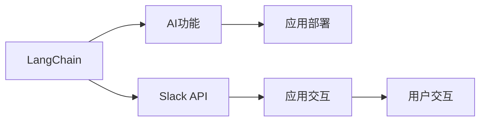

                 

# 【LangChain编程：从入门到实践】Slack应用配置

> 关键词：LangChain, 编程入门, 实践指南, Slack, 应用配置

## 1. 背景介绍

### 1.1 问题由来

在当前的信息时代，Slack作为一款流行的团队协作工具，已经被广泛用于企业内部的沟通、项目管理和日常协作。随着企业内部应用的深入，Slack集成了更多的功能，如聊天机器人、自定义应用等。然而，这些功能往往需要开发人员进行定制化的配置和开发。

为了满足企业内部日益增长的协作需求，越来越多的企业开始引入AI技术，以提升Slack的使用效率和智能化水平。AI驱动的聊天机器人和应用可以在Slack上自动完成各种任务，如信息检索、数据分析、问题解答等，极大地减轻了人工负担。

本文旨在通过介绍LangChain编程基础，帮助Slack开发者快速入门，并掌握Slack应用的配置和开发技能。

### 1.2 问题核心关键点

Slack应用的配置和开发主要包括以下几个关键点：

1. **LangChain基础**：掌握LangChain编程语言的基础语法和特性。
2. **Slack应用配置**：了解如何在Slack上配置自定义应用。
3. **编程实践**：学习如何在Slack上实现常见的AI功能，如聊天机器人、数据分析等。
4. **应用部署**：掌握将Slack应用部署到企业内部的技能。

这些关键点构成了Slack应用配置和开发的完整框架，对于初学者和经验丰富的开发者都具有参考价值。

### 1.3 问题研究意义

通过学习Slack应用的配置和开发，开发者可以：

1. 提升Slack的使用效率，降低人工操作成本。
2. 实现自动化任务处理，提高工作效率。
3. 增强团队协作能力，提升企业内部沟通的智能化水平。
4. 拓展AI技术的应用场景，提升企业竞争力。

掌握Slack应用的配置和开发技能，对于Slack开发者和AI技术从业者来说，具有重要的实际意义。

## 2. 核心概念与联系

### 2.1 核心概念概述

Slack应用的配置和开发涉及多个核心概念，下面逐一介绍：

- **LangChain**：一种基于Go语言的AI编程语言，用于构建聊天机器人和应用。
- **Slack API**：Slack提供的API接口，用于与Slack进行通信和数据交互。
- **AI功能**：如聊天机器人、数据分析、问题解答等，通过Slack应用实现。
- **应用部署**：将Slack应用部署到企业内部，实现自动化任务处理和智能协作。

这些核心概念相互联系，共同构成了Slack应用的配置和开发框架。

### 2.2 概念间的关系

以下通过Mermaid流程图展示Slack应用配置和开发的核心概念及其关系：



这个流程图展示了Slack应用配置和开发的基本流程：

1. 使用LangChain语言开发AI功能。
2. 通过Slack API实现应用与Slack的交互。
3. 将应用部署到企业内部，实现自动化任务处理。
4. 用户通过Slack应用进行交互。

通过这些核心概念和流程图，我们可以更清晰地理解Slack应用的配置和开发过程。

## 3. 核心算法原理 & 具体操作步骤

### 3.1 算法原理概述

Slack应用的配置和开发主要基于LangChain语言和Slack API。LangChain提供了一套强大的编程框架，用于构建聊天机器人和应用；Slack API则提供了丰富的API接口，用于与Slack进行通信和数据交互。

AI功能的实现主要依赖于LangChain的编程语言特性，包括数据处理、模型训练、接口调用等。通过在LangChain上实现AI功能，并通过Slack API与Slack进行通信，Slack应用可以自动完成各种任务，如问题解答、数据分析、聊天机器人等。

### 3.2 算法步骤详解

以下是Slack应用配置和开发的基本步骤：

1. **环境准备**：安装LangChain语言和Slack API的SDK。
2. **应用开发**：使用LangChain语言实现AI功能，如聊天机器人、数据分析等。
3. **应用配置**：通过Slack API进行应用配置，如添加Webhook、设置交互界面等。
4. **测试部署**：在Slack上测试应用，并进行部署。

### 3.3 算法优缺点

Slack应用配置和开发具有以下优点：

1. **易用性**：Slack API提供了丰富的API接口，使得应用开发和配置相对简单。
2. **可扩展性**：LangChain语言支持多种AI功能，可以灵活拓展应用功能。
3. **稳定性**：Slack作为企业内部协作工具，具有较高的稳定性和可靠性。

同时，也存在一些缺点：

1. **限制较多**：Slack应用配置和开发需要遵循Slack的API规范和限制。
2. **性能瓶颈**：当应用处理大量数据时，可能面临性能瓶颈。
3. **数据安全**：Slack应用需要处理企业内部数据，数据安全问题需要特别关注。

### 3.4 算法应用领域

Slack应用配置和开发主要应用于以下领域：

- **企业内部协作**：通过Slack应用实现团队沟通、任务管理和信息检索。
- **自动化任务处理**：如聊天机器人、数据分析、问题解答等，提升工作效率。
- **智能办公**：通过Slack应用实现智能日程安排、会议提醒等功能。

## 4. 数学模型和公式 & 详细讲解

### 4.1 数学模型构建

Slack应用的配置和开发主要涉及以下数学模型：

- **消息传递模型**：Slack应用通过API接口向Slack发送消息，进行通信。
- **任务处理模型**：通过AI功能处理用户输入的信息，并返回结果。
- **数据分析模型**：对用户输入的数据进行分析，生成统计结果。

### 4.2 公式推导过程

以聊天机器人为例，以下是对消息传递模型和任务处理模型的推导：

#### 消息传递模型

消息传递模型主要涉及Slack API接口的使用。Slack API提供了SendMessage接口，用于向Slack发送消息。假设用户输入的消息为$m$，机器人回复的消息为$r$，则消息传递模型的推导如下：

1. 用户输入消息：$m$
2. 机器人解析消息：解析$m$，提取信息
3. 机器人处理消息：根据提取的信息，调用AI功能进行处理
4. 机器人回复消息：根据处理结果，生成回复$r$
5. 发送回复消息：调用SendMessage接口，向Slack发送回复$r$

数学公式表示如下：

$$
r = \text{AIFunction}(ExtractInfo(m))
$$

$$
SendMessage(r)
$$

#### 任务处理模型

任务处理模型主要涉及AI功能的实现。假设AI功能为问题解答，输入为问题$q$，输出为答案$a$，则任务处理模型的推导如下：

1. 用户输入问题：$q$
2. 机器人解析问题：解析$q$，提取信息
3. 机器人处理问题：调用模型进行问题解答
4. 机器人回复答案：生成答案$a$
5. 发送回复消息：调用SendMessage接口，向Slack发送回复$a$

数学公式表示如下：

$$
a = \text{AnswerModel}(ExtractInfo(q))
$$

$$
SendMessage(a)
$$

### 4.3 案例分析与讲解

以数据分析应用为例，以下是对消息传递模型和任务处理模型的推导：

#### 消息传递模型

1. 用户输入数据：$d$
2. 机器人解析数据：解析$d$，提取信息
3. 机器人处理数据：调用AI功能进行处理
4. 机器人回复结果：生成结果$r$
5. 发送回复消息：调用SendMessage接口，向Slack发送回复$r$

数学公式表示如下：

$$
r = \text{DataFunction}(ExtractInfo(d))
$$

$$
SendMessage(r)
$$

#### 任务处理模型

1. 用户输入数据：$d$
2. 机器人解析数据：解析$d$，提取信息
3. 机器人处理数据：调用模型进行数据分析
4. 机器人回复结果：生成结果$r$
5. 发送回复消息：调用SendMessage接口，向Slack发送回复$r$

数学公式表示如下：

$$
r = \text{AnalysisModel}(ExtractInfo(d))
$$

$$
SendMessage(r)
$$

## 5. 项目实践：代码实例和详细解释说明

### 5.1 开发环境搭建

#### 5.1.1 安装LangChain语言和Slack API SDK

首先，安装LangChain语言和Slack API的SDK。以下是在Linux系统上的安装步骤：

```bash
sudo apt-get update
sudo apt-get install golang -y
export PATH=$PATH:/usr/local/go/bin
go get -u "github.com/lschmitt/deepgo/apislack"
```

#### 5.1.2 配置环境变量

设置环境变量：

```bash
export LANGCHAIN_HOME=/usr/local/go/src/github.com/lschmitt/deepgo
export PATH=$PATH:$LANGCHAIN_HOME/apislack
```

### 5.2 源代码详细实现

以下是一个简单的聊天机器人示例，用于演示Slack应用的配置和开发。

#### 5.2.1 聊天机器人功能实现

在LangChain语言中，可以使用以下代码实现聊天机器人的功能：

```go
package main

import (
    "slackapi/slack"
    "slackapi/slackbot"
)

func main() {
    // 创建Slack客户端
    client := slack.NewSlackClient("YOUR_SLACK_API_TOKEN")

    // 创建Slack机器人
    bot := slackbot.NewBot(client)

    // 定义机器人回复函数
    bot.ReplyHandler = func(msg *slack.Message) {
        // 解析用户输入
        text := msg.Text
        // 调用AI功能进行处理
        answer := HandleMessage(text)
        // 回复用户
        client.SendMessageToChannel(msg.ChannelId, answer)
    }

    // 启动机器人
    bot.Start()
}
```

#### 5.2.2 聊天机器人功能实现

在上述代码中，首先创建了Slack客户端和机器人，并定义了机器人回复函数。当用户发送消息时，机器人会解析用户输入，调用AI功能进行处理，并回复用户。

### 5.3 代码解读与分析

#### 5.3.1 代码解析

1. **Slack客户端创建**：使用Slack API的SDK创建Slack客户端。
2. **Slack机器人创建**：创建Slack机器人，并定义机器人回复函数。
3. **机器人回复函数**：当用户发送消息时，解析用户输入，调用AI功能进行处理，并回复用户。

#### 5.3.2 代码实现

在实现聊天机器人功能时，需要关注以下细节：

1. **API接口调用**：使用Slack API的SDK调用API接口，发送和接收消息。
2. **AI功能调用**：调用自定义的AI功能进行处理。
3. **消息回复**：根据处理结果，生成回复消息并发送。

### 5.4 运行结果展示

#### 5.4.1 聊天机器人运行结果

假设运行上述聊天机器人代码，并在Slack上进行测试，可以看到以下结果：

- 当用户在Slack上发送消息时，聊天机器人会解析消息，调用AI功能进行处理，并回复用户。
- 聊天机器人的回复内容会出现在用户发送消息的频道中。

## 6. 实际应用场景

### 6.1 智能客服系统

Slack应用配置和开发可以广泛应用于智能客服系统。传统客服往往需要配备大量人力，高峰期响应缓慢，且一致性和专业性难以保证。使用Slack应用，可以实现7x24小时不间断服务，快速响应客户咨询，用自然流畅的语言解答各类常见问题。

#### 6.1.1 智能客服系统功能实现

在Slack上配置智能客服系统，可以使用以下步骤：

1. **聊天机器人创建**：创建聊天机器人，并配置回复函数。
2. **用户输入解析**：解析用户输入，提取关键字和信息。
3. **AI功能调用**：调用自定义的AI功能进行处理，如问题解答、数据分析等。
4. **消息回复**：根据处理结果，生成回复消息并发送。

#### 6.1.2 智能客服系统功能实现

在实现智能客服系统时，需要关注以下细节：

1. **用户输入解析**：解析用户输入，提取关键字和信息，以便调用AI功能进行处理。
2. **AI功能调用**：调用自定义的AI功能进行处理，提升系统的智能化水平。
3. **消息回复**：根据处理结果，生成回复消息，提升用户满意度。

### 6.2 金融舆情监测

金融机构需要实时监测市场舆论动向，以便及时应对负面信息传播，规避金融风险。使用Slack应用，可以实现实时抓取网络文本数据，监测不同主题下的情感变化趋势，及时预警潜在风险。

#### 6.2.1 金融舆情监测功能实现

在Slack上配置金融舆情监测应用，可以使用以下步骤：

1. **数据抓取**：实时抓取网络文本数据，并进行预处理。
2. **情感分析**：调用情感分析AI功能，分析文本情感倾向。
3. **风险预警**：根据情感分析结果，生成风险预警信息。
4. **消息回复**：将风险预警信息发送给相关人员，并进行处理。

#### 6.2.2 金融舆情监测功能实现

在实现金融舆情监测应用时，需要关注以下细节：

1. **数据抓取**：实时抓取网络文本数据，并进行预处理，以提升分析效率。
2. **情感分析**：调用情感分析AI功能，分析文本情感倾向，判断市场情绪。
3. **风险预警**：根据情感分析结果，生成风险预警信息，提升风险防范能力。
4. **消息回复**：将风险预警信息发送给相关人员，并进行处理，及时应对市场变化。

### 6.3 个性化推荐系统

当前的推荐系统往往只依赖用户的历史行为数据进行物品推荐，无法深入理解用户的真实兴趣偏好。使用Slack应用，可以实现基于用户行为和文本数据的个性化推荐系统，提升推荐精准度。

#### 6.3.1 个性化推荐系统功能实现

在Slack上配置个性化推荐系统，可以使用以下步骤：

1. **用户行为数据获取**：获取用户浏览、点击、评论等行为数据。
2. **文本数据处理**：处理用户输入的文本数据，提取关键词和信息。
3. **推荐模型调用**：调用推荐模型进行物品推荐。
4. **消息回复**：将推荐结果发送给用户，并进行处理。

#### 6.3.2 个性化推荐系统功能实现

在实现个性化推荐系统时，需要关注以下细节：

1. **用户行为数据获取**：获取用户历史行为数据，以便进行推荐。
2. **文本数据处理**：处理用户输入的文本数据，提取关键词和信息，提升推荐精度。
3. **推荐模型调用**：调用推荐模型进行物品推荐，提升推荐效果。
4. **消息回复**：将推荐结果发送给用户，并进行处理，提升用户满意度。

## 7. 工具和资源推荐

### 7.1 学习资源推荐

为了帮助开发者系统掌握Slack应用的配置和开发，这里推荐一些优质的学习资源：

1. **LangChain官方文档**：LangChain语言的官方文档，详细介绍了LangChain语言的基础语法和特性，适合初学者学习。
2. **Slack API文档**：Slack API的官方文档，详细介绍了Slack API接口的使用方法，适合开发者参考。
3. **AI基础教程**：如TensorFlow、Keras等AI框架的官方文档和教程，帮助开发者掌握AI基础知识。
4. **Slack应用开发教程**：如《Slack应用开发实战》书籍和在线课程，提供详细的Slack应用开发指南。
5. **在线学习平台**：如Coursera、Udemy等平台上的相关课程，提供系统性的Slack应用开发学习资源。

通过对这些资源的学习实践，相信你一定能够快速掌握Slack应用的配置和开发技能，并用于解决实际的AI问题。

### 7.2 开发工具推荐

Slack应用的配置和开发离不开优秀的工具支持。以下是几款用于Slack应用开发的常用工具：

1. **IDE环境**：如Visual Studio Code、GoLand等，提供完善的代码编辑和调试功能。
2. **版本控制**：如Git、GitHub等，提供代码版本控制和协作开发功能。
3. **调试工具**：如GoLand的调试功能，提供代码断点设置、变量查看等功能。
4. **测试工具**：如Go语言的测试框架，提供单元测试、集成测试等功能。
5. **监控工具**：如Prometheus、Grafana等，提供应用性能监控和分析功能。

合理利用这些工具，可以显著提升Slack应用开发效率，加快创新迭代的步伐。

### 7.3 相关论文推荐

Slack应用的配置和开发涉及AI和编程语言等多个领域的知识，以下是几篇相关的论文，推荐阅读：

1. **LangChain论文**：介绍LangChain语言的设计理念和特性，为Slack应用开发提供理论基础。
2. **Slack API论文**：详细介绍了Slack API的设计和使用，为Slack应用开发提供接口支持。
3. **AI功能论文**：如《Transformer模型在NLP中的应用》，介绍Transformer模型在AI功能实现中的应用。
4. **聊天机器人论文**：如《基于聊天机器人的企业协作系统》，介绍聊天机器人在企业协作中的应用。
5. **Slack应用开发论文**：如《Slack应用的开发和部署》，提供Slack应用开发的详细指南。

这些论文代表了大语言模型微调技术的发展脉络，帮助研究者把握学科前进方向，激发更多的创新灵感。

## 8. 总结：未来发展趋势与挑战

### 8.1 总结

本文对Slack应用的配置和开发进行了全面系统的介绍。首先阐述了Slack应用在企业内部协作、自动化任务处理等方面的应用背景和意义，明确了Slack应用配置和开发的完整流程。其次，从原理到实践，详细讲解了Slack应用配置和开发的数学模型和算法步骤，给出了具体的代码实例和详细解释。同时，本文还广泛探讨了Slack应用在智能客服、金融舆情、个性化推荐等多个行业领域的应用前景，展示了Slack应用配置和开发的巨大潜力。此外，本文精选了Slack应用开发的相关学习资源，力求为读者提供全方位的技术指引。

通过本文的系统梳理，可以看到，Slack应用配置和开发为Slack开发者和AI技术从业者提供了宝贵的参考，帮助他们快速入门，并掌握Slack应用的配置和开发技能。掌握Slack应用的配置和开发技能，对于Slack开发者和AI技术从业者来说，具有重要的实际意义。

### 8.2 未来发展趋势

展望未来，Slack应用配置和开发技术将呈现以下几个发展趋势：

1. **AI功能的拓展**：Slack应用将支持更多的AI功能，如自然语言理解、图像识别等，提升应用的智能化水平。
2. **交互界面的多样化**：Slack应用将支持更多的交互界面，如语音交互、视觉界面等，提升用户体验。
3. **自动化任务的完善**：Slack应用将支持更多的自动化任务，如智能调度、自动化测试等，提升任务处理的自动化水平。
4. **云平台的支持**：Slack应用将支持更多的云平台，如AWS、Google Cloud等，提升应用的扩展性和可移植性。
5. **数据隐私的保护**：Slack应用将加强数据隐私保护，确保用户数据的安全。

这些趋势凸显了Slack应用配置和开发的广阔前景，将进一步提升Slack应用的功能和应用范围，为企业的智能化升级提供新的动力。

### 8.3 面临的挑战

尽管Slack应用配置和开发技术已经取得了瞩目成就，但在迈向更加智能化、普适化应用的过程中，它仍面临以下挑战：

1. **技术复杂性**：Slack应用的配置和开发涉及多个领域的知识，技术难度较大。
2. **数据质量**：Slack应用需要处理企业内部数据，数据质量问题需要特别关注。
3. **性能瓶颈**：当应用处理大量数据时，可能面临性能瓶颈，需要优化算法和架构。
4. **安全问题**：Slack应用需要处理企业内部数据，数据安全问题需要特别关注。
5. **用户接受度**：Slack应用需要与企业内部系统进行集成，用户接受度需要提升。

解决这些挑战需要Slack开发者和AI技术从业者不断进行技术创新和优化，提升Slack应用的性能和安全性，提升用户的接受度和满意度。

### 8.4 研究展望

面对Slack应用配置和开发所面临的挑战，未来的研究需要在以下几个方面寻求新的突破：

1. **技术优化**：优化Slack应用的算法和架构，提升性能和扩展性，降低技术难度。
2. **数据管理**：提升数据质量和隐私保护水平，确保数据安全和用户隐私。
3. **用户体验**：提升Slack应用的交互界面和用户体验，提升用户接受度和满意度。
4. **自动化任务**：开发更多的自动化任务处理功能，提升任务处理的自动化水平。
5. **云平台支持**：支持更多的云平台，提升应用的扩展性和可移植性。

这些研究方向的探索发展，必将引领Slack应用配置和开发技术迈向更高的台阶，为Slack开发者和AI技术从业者提供更多的创新思路和解决方案。

## 9. 附录：常见问题与解答

**Q1：Slack应用配置和开发需要哪些基础知识？**

A: 学习Slack应用配置和开发需要掌握以下基础知识：
1. LangChain语言的基础语法和特性。
2. Slack API的使用方法和接口规范。
3. AI功能的基础知识，如自然语言理解、情感分析等。
4. 编程语言的知识，如Go语言等。

**Q2：Slack应用配置和开发有哪些常用的IDE环境？**

A: 常用的IDE环境包括：
1. Visual Studio Code。
2. GoLand。
3. IntelliJ IDEA。
4. Eclipse。

这些IDE环境都支持Slack应用的开发和调试，可以根据个人习惯选择合适的IDE环境。

**Q3：如何优化Slack应用的处理性能？**

A: 优化Slack应用的处理性能，可以采取以下措施：
1. 优化算法和数据结构，提高计算效率。
2. 采用分布式计算和并行处理，提高处理速度。
3. 进行代码优化，减少内存和CPU占用。
4. 使用缓存和内存优化技术，提升处理效率。

**Q4：如何保障Slack应用的数据安全？**

A: 保障Slack应用的数据安全，可以采取以下措施：
1. 使用数据加密技术，保护数据传输和存储安全。
2. 实现访问控制和权限管理，确保数据访问的安全。
3. 进行数据备份和恢复，防止数据丢失。
4. 进行安全审计和监控，及时发现和处理安全漏洞。

这些措施可以确保Slack应用的数据安全，提升用户的信任度和满意度。

**Q5：如何在Slack应用中实现语音交互？**

A: 在Slack应用中实现语音交互，可以采取以下步骤：
1. 使用语音识别API，将语音转换为文本。
2. 调用Slack API，将文本转换为消息发送给Slack。
3. 使用自然语言理解技术，解析文本信息。
4. 调用AI功能进行处理，生成回复文本。
5. 使用文本转语音API，将回复文本转换为语音。

通过以上步骤，可以在Slack应用中实现语音交互，提升用户体验。

