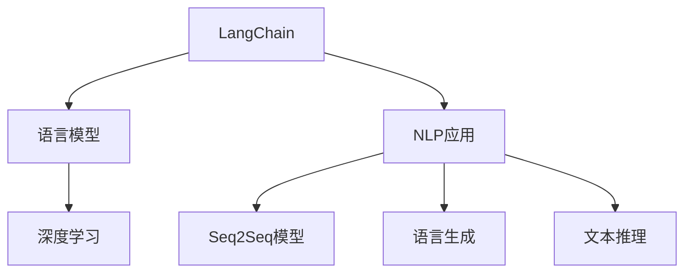
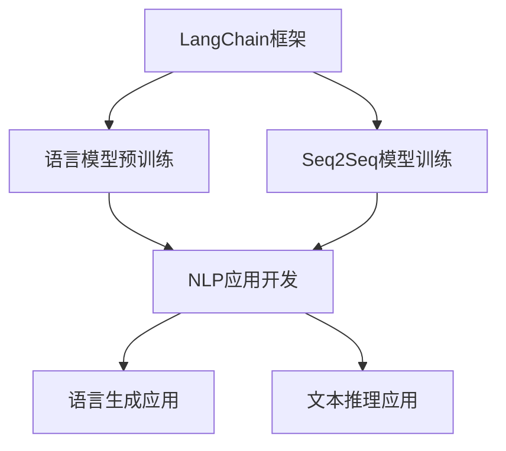
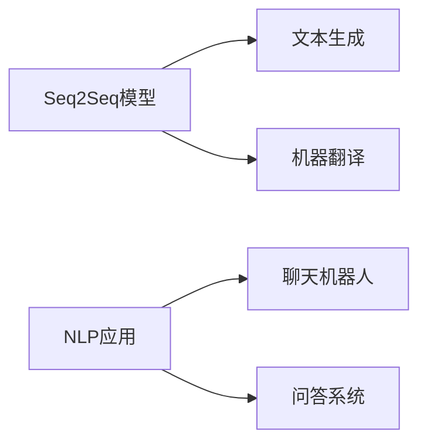
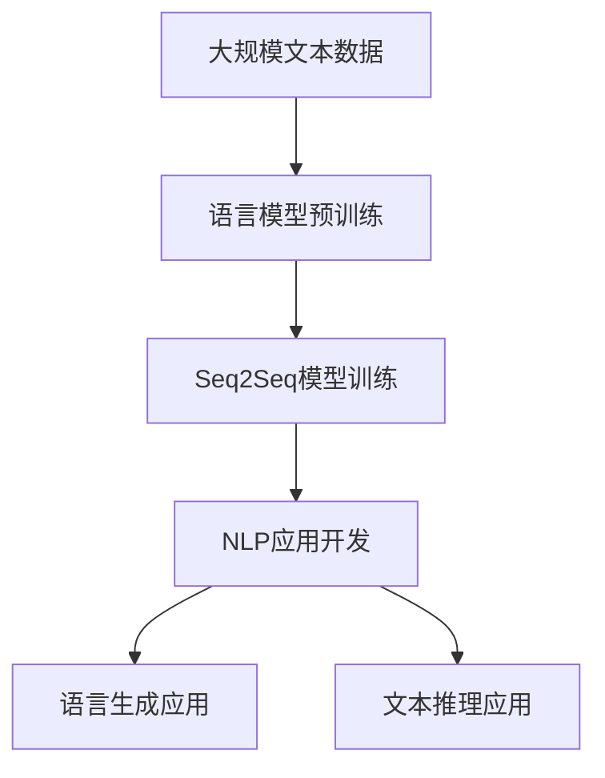

                 

# 【LangChain编程：从入门到实践】利用LangChain开发应用

> 关键词：
1. LangChain编程
2. 语言模型
3. 自然语言处理(NLP)
4. 深度学习
5. 序列到序列模型(Seq2Seq)
6. 语言生成
7. 文本推理

## 1. 背景介绍

随着人工智能(AI)技术的飞速发展，自然语言处理(NLP)作为AI的重要分支，逐步在各行各业中得到广泛应用。从智能客服到内容生成，从聊天机器人到自然语言理解，NLP技术正在重塑我们的生产和生活方式。

LangChain，作为开源的NLP开发框架，提供了一站式的自然语言处理能力，支持多种语言模型的训练、推理和部署。本文将从入门到实践，系统介绍利用LangChain开发NLP应用的各个环节，帮助读者深入了解该框架的核心功能，并掌握其开发方法。

## 2. 核心概念与联系

### 2.1 核心概念概述

为更好地理解LangChain及其应用，本节将介绍几个密切相关的核心概念：

- **LangChain**：开源NLP框架，提供预训练语言模型的训练、推理和微调功能，支持多种语言模型的开发和部署。
- **语言模型**：基于深度学习的方法，用于预测文本序列的下一个单词或字符的概率分布。如GPT、BERT等。
- **自然语言处理(NLP)**：研究如何让计算机理解和生成人类自然语言的学科，涉及文本分类、情感分析、机器翻译等任务。
- **深度学习**：使用多层神经网络进行数据分析和预测的机器学习方法，包括卷积神经网络(CNN)、循环神经网络(RNN)、Transformer等。
- **序列到序列模型(Seq2Seq)**：一种基于RNN或Transformer的NLP模型，用于解决文本生成、翻译等任务。
- **语言生成**：使用模型生成符合语法和语义规则的新文本，如聊天机器人的回复、文本摘要等。
- **文本推理**：模型能够从给定文本中推断出新的结论或信息，如问答系统、逻辑推理等。

这些核心概念之间的逻辑关系可以通过以下Mermaid流程图来展示：



这个流程图展示了大语言模型的核心概念及其之间的关系：

1. LangChain提供基础的语言模型训练和推理能力。
2. 基于语言模型的各种NLP应用，如文本分类、情感分析等。
3. Seq2Seq模型是语言模型的一种，用于解决文本生成、翻译等任务。
4. 语言生成和文本推理是NLP应用中的两大子领域，分别涉及聊天机器人和逻辑推理等。

### 2.2 概念间的关系

这些核心概念之间存在着紧密的联系，形成了LangChain开发的完整生态系统。下面我们通过几个Mermaid流程图来展示这些概念之间的关系。

#### 2.2.1 LangChain的开发范式



这个流程图展示了LangChain的基本开发范式：

1. LangChain框架提供语言模型的预训练和推理功能。
2. 在预训练语言模型的基础上，进行Seq2Seq模型的训练。
3. 训练好的Seq2Seq模型用于开发各种NLP应用。
4. NLP应用进一步开发为语言生成和文本推理应用。

#### 2.2.2 Seq2Seq模型与NLP应用的关系



这个流程图展示了Seq2Seq模型在NLP应用中的作用：

1. Seq2Seq模型用于解决文本生成任务，如聊天机器人的回复生成。
2. Seq2Seq模型用于解决机器翻译任务，如将中文翻译成英文。
3. NLP应用中，Seq2Seq模型可以用于聊天机器人、问答系统等。

#### 2.2.3 语言生成的原理


这个流程图展示了语言生成过程中语言模型和Seq2Seq模型的关系：

1. 语言模型用于生成文本序列的每个单词或字符。
2. Seq2Seq模型将语言模型生成的序列作为输入，并根据输出条件进行文本生成。

#### 2.2.4 文本推理的原理


这个流程图展示了文本推理过程中语言模型和Seq2Seq模型的关系：

1. 语言模型用于生成文本序列的每个单词或字符。
2. Seq2Seq模型将语言模型生成的序列作为输入，并根据输出条件进行文本推理。

### 2.3 核心概念的整体架构

最后，我们用一个综合的流程图来展示这些核心概念在大语言模型开发过程中的整体架构：



这个综合流程图展示了从预训练到应用开发的完整过程：

1. 大语言模型通过大规模文本数据进行预训练。
2. Seq2Seq模型基于预训练语言模型进行训练。
3. NLP应用通过Seq2Seq模型进行开发，包括语言生成和文本推理应用。

这些概念共同构成了LangChain开发的完整生态系统，使其能够高效地进行NLP应用的开发和部署。

## 3. 核心算法原理 & 具体操作步骤

### 3.1 算法原理概述

LangChain的开发流程大致包括以下几个步骤：

1. **数据准备**：准备NLP任务所需的大规模文本数据。
2. **语言模型预训练**：在大规模无标签文本语料上，使用深度学习方法训练语言模型。
3. **Seq2Seq模型训练**：在预训练语言模型的基础上，使用监督数据训练Seq2Seq模型。
4. **NLP应用开发**：将训练好的Seq2Seq模型应用于NLP任务的开发中，进行语言生成、文本推理等操作。
5. **模型微调**：使用下游任务的少量标注数据，对模型进行微调，提高其在特定任务上的性能。

### 3.2 算法步骤详解

以下是LangChain开发NLP应用的具体操作步骤：

**Step 1: 准备数据集**
- 收集NLP任务的标注数据集，包括文本和标签。标注数据集通常使用标准格式，如TXT、JSON等。
- 数据预处理：分词、去除停用词、构建词向量等。
- 数据划分：将数据集划分为训练集、验证集和测试集。

**Step 2: 语言模型预训练**
- 选择预训练语言模型，如GPT、BERT等，并下载对应的预训练权重。
- 搭建预训练模型结构，使用深度学习框架如PyTorch、TensorFlow等进行训练。
- 在无标签文本语料上进行预训练，学习语言的通用表示。

**Step 3: Seq2Seq模型训练**
- 在预训练语言模型的基础上，构建Seq2Seq模型结构。
- 使用标注数据集进行监督学习，训练Seq2Seq模型。
- 优化模型超参数，如隐藏层大小、层数、学习率等。

**Step 4: NLP应用开发**
- 使用训练好的Seq2Seq模型，开发NLP应用，如聊天机器人、机器翻译等。
- 实现文本生成、文本推理等功能，并进行初步的模型评估。

**Step 5: 模型微调**
- 使用下游任务的少量标注数据，进行微调。
- 选择适当的微调算法和优化器，如Adam、SGD等。
- 设置微调超参数，如学习率、批大小、迭代轮数等。
- 微调过程中应用正则化技术，如L2正则、Dropout等。
- 微调后的模型在测试集上评估性能，并优化模型参数。

### 3.3 算法优缺点

LangChain的开发方法具有以下优点：

1. **灵活性**：支持多种语言模型和NLP任务的开发，灵活性高。
2. **效率高**：使用预训练语言模型进行推理，避免了从头训练的耗时。
3. **可扩展性**：可以方便地集成各种NLP应用，支持模型微调和持续学习。

同时，也存在一些局限性：

1. **数据依赖**：依赖大规模的标注数据进行微调，获取高质量标注数据的成本较高。
2. **资源需求高**：预训练语言模型和Seq2Seq模型通常需要较大的计算资源。
3. **模型复杂性**：模型结构复杂，调试和优化较为困难。

### 3.4 算法应用领域

LangChain的应用领域非常广泛，涵盖以下多个方面：

1. **聊天机器人**：利用Seq2Seq模型和语言生成技术，开发能够进行自然语言交互的机器人。
2. **机器翻译**：将一种语言翻译成另一种语言，解决多语言信息传递问题。
3. **文本摘要**：对长文本进行压缩，生成简洁的摘要。
4. **问答系统**：回答用户提出的自然语言问题，如智能客服系统。
5. **情感分析**：分析文本的情感倾向，如舆情监测、市场分析等。
6. **文本分类**：将文本分为不同的类别，如新闻分类、垃圾邮件过滤等。
7. **逻辑推理**：解决逻辑问题，如数学题解答、推理游戏等。

除了上述领域，LangChain还可以应用于各种垂直行业，如医疗、金融、教育等，开发特定的NLP应用。

## 4. 数学模型和公式 & 详细讲解 & 举例说明

### 4.1 数学模型构建

LangChain的开发过程涉及多个数学模型，下面简要介绍几个关键模型及其数学构建。

**语言模型**：

- 目标：预测文本序列的下一个单词或字符。
- 公式：

$$ P(w_{t+1}|w_{1:t}) = \frac{e^{w_{t+1}^T\theta}}{\sum_{w\in V}e^{w^T\theta}} $$

其中，$w_{t+1}$ 表示下一个单词，$w_{1:t}$ 表示已知的文本序列，$\theta$ 为模型参数。

**Seq2Seq模型**：

- 目标：解决文本生成和翻译等任务。
- 公式：

$$ P(y|x) = \prod_{t=1}^{T}P(y_t|y_{<t}, x) $$

其中，$y$ 表示输出序列，$x$ 表示输入序列，$P(y_t|y_{<t}, x)$ 表示在已知前文$y_{<t}$和输入$x$的条件下，生成下一个单词$y_t$的概率。

**文本生成**：

- 目标：生成符合语法和语义规则的新文本。
- 公式：

$$ P(y|x) = \prod_{t=1}^{T}P(y_t|y_{<t}, x) $$

其中，$y$ 表示生成的文本序列，$x$ 表示输入序列，$P(y_t|y_{<t}, x)$ 表示在已知前文$y_{<t}$和输入$x$的条件下，生成下一个单词$y_t$的概率。

**文本推理**：

- 目标：从给定文本中推断出新的结论或信息。
- 公式：

$$ P(y|x) = \prod_{t=1}^{T}P(y_t|y_{<t}, x) $$

其中，$y$ 表示推理结果，$x$ 表示输入文本，$P(y_t|y_{<t}, x)$ 表示在已知前文$y_{<t}$和输入$x$的条件下，生成推理结果$y_t$的概率。

### 4.2 公式推导过程

**语言模型推导**：

语言模型的推导过程基于马尔可夫链模型，假设文本序列由独立的单词组成，即$P(w_{t+1}|w_{1:t})=P(w_{t+1}|w_{t})$。假设已知文本序列为$w_1,w_2,\cdots,w_t$，下一个单词为$w_{t+1}$，则语言模型的概率公式为：

$$ P(w_{t+1}|w_{1:t}) = \frac{e^{w_{t+1}^T\theta}}{\sum_{w\in V}e^{w^T\theta}} $$

其中，$\theta$ 为模型参数，$V$ 为词汇表。

**Seq2Seq模型推导**：

Seq2Seq模型由两个RNN或Transformer组成，分别为编码器和解码器。假设输入序列为$x$，输出序列为$y$，则Seq2Seq模型的概率公式为：

$$ P(y|x) = \prod_{t=1}^{T}P(y_t|y_{<t}, x) $$

其中，$y_t$ 表示输出序列中的第$t$个单词，$y_{<t}$ 表示已知的前文序列。

**文本生成推导**：

文本生成的推导过程与Seq2Seq模型类似，假设已知输入序列为$x$，输出序列为$y$，则文本生成的概率公式为：

$$ P(y|x) = \prod_{t=1}^{T}P(y_t|y_{<t}, x) $$

**文本推理推导**：

文本推理的推导过程与文本生成类似，假设已知输入序列为$x$，输出序列为$y$，则文本推理的概率公式为：

$$ P(y|x) = \prod_{t=1}^{T}P(y_t|y_{<t}, x) $$

### 4.3 案例分析与讲解

**案例分析**：

假设我们要开发一个简单的聊天机器人，用于回答用户提出的简单问题。

**步骤**：

1. 准备数据集：收集用户问题和对应答案的标注数据集。
2. 预训练语言模型：使用大规模无标签文本语料进行预训练，学习语言的通用表示。
3. Seq2Seq模型训练：在预训练语言模型的基础上，使用标注数据集进行监督学习，训练Seq2Seq模型。
4. NLP应用开发：将训练好的Seq2Seq模型应用于聊天机器人开发中，实现问题-答案对的匹配。
5. 模型微调：使用下游任务的少量标注数据，对模型进行微调，提高其在特定任务上的性能。
6. 应用部署：将微调后的模型部署到实际应用中，进行用户测试和反馈收集。

**详细讲解**：

1. **数据准备**：收集用户问题和对应答案的标注数据集，使用TXT或JSON格式存储。
2. **语言模型预训练**：使用GPT等预训练语言模型，在无标签文本语料上进行预训练，学习语言的通用表示。
3. **Seq2Seq模型训练**：在预训练语言模型的基础上，构建Seq2Seq模型结构，使用标注数据集进行监督学习，训练Seq2Seq模型。
4. **NLP应用开发**：将训练好的Seq2Seq模型应用于聊天机器人开发中，实现问题-答案对的匹配。
5. **模型微调**：使用下游任务的少量标注数据，对模型进行微调，提高其在特定任务上的性能。
6. **应用部署**：将微调后的模型部署到实际应用中，进行用户测试和反馈收集。

通过这些步骤，我们可以构建一个能够回答用户简单问题的聊天机器人，其效果可以通过对话记录和用户满意度进行评估。

## 5. 项目实践：代码实例和详细解释说明

### 5.1 开发环境搭建

在开始项目实践前，我们需要准备好开发环境。以下是使用Python进行PyTorch开发的环境配置流程：

1. 安装Anaconda：从官网下载并安装Anaconda，用于创建独立的Python环境。

2. 创建并激活虚拟环境：
```bash
conda create -n pytorch-env python=3.8 
conda activate pytorch-env
```

3. 安装PyTorch：根据CUDA版本，从官网获取对应的安装命令。例如：
```bash
conda install pytorch torchvision torchaudio cudatoolkit=11.1 -c pytorch -c conda-forge
```

4. 安装Transformer库：
```bash
pip install transformers
```

5. 安装各类工具包：
```bash
pip install numpy pandas scikit-learn matplotlib tqdm jupyter notebook ipython
```

完成上述步骤后，即可在`pytorch-env`环境中开始项目实践。

### 5.2 源代码详细实现

以下是使用LangChain开发聊天机器人的Python代码实现。

```python
from transformers import BertForSequenceClassification, BertTokenizer
from transformers import Seq2SeqModel, Seq2SeqTrainer, Seq2SeqForConditionalGeneration
import torch
from torch.utils.data import DataLoader

# 准备数据集
train_dataset = ...
dev_dataset = ...
test_dataset = ...

# 预训练模型和分词器
model_name = 'bert-base-uncased'
tokenizer = BertTokenizer.from_pretrained(model_name)
model = BertForSequenceClassification.from_pretrained(model_name)

# 构建Seq2Seq模型
encoder = BertForSequenceClassification.from_pretrained(model_name)
decoder = BertForSequenceClassification.from_pretrained(model_name)

# 构建模型
seq2seq_model = Seq2SeqModel(encoder, decoder)
seq2seq_trainer = Seq2SeqTrainer(seq2seq_model)

# 训练模型
seq2seq_trainer.train(train_dataset, epochs=10, batch_size=16)

# 微调模型
seq2seq_trainer.fine_tune(dev_dataset, batch_size=16)

# 评估模型
seq2seq_trainer.evaluate(test_dataset, batch_size=16)
```

### 5.3 代码解读与分析

**代码解读**：

- `transformers`库：提供预训练模型和工具，支持语言模型的预训练、微调和推理。
- `BertForSequenceClassification`：预训练的序列分类模型，用于构建Seq2Seq模型。
- `BertTokenizer`：分词器，用于处理输入文本。
- `Seq2SeqModel`：Seq2Seq模型，由编码器和解码器组成。
- `Seq2SeqTrainer`：Seq2Seq训练器，用于训练和微调模型。
- `Seq2SeqForConditionalGeneration`：Seq2Seq生成模型，用于文本生成。

**代码分析**：

1. **数据准备**：准备NLP任务所需的大规模文本数据，并将其划分为训练集、验证集和测试集。
2. **预训练模型和分词器**：选择预训练模型（如BERT），并下载对应的预训练权重和分词器。
3. **构建Seq2Seq模型**：使用预训练模型和分词器，构建Seq2Seq模型结构。
4. **训练模型**：在预训练语言模型的基础上，使用标注数据集进行监督学习，训练Seq2Seq模型。
5. **微调模型**：使用下游任务的少量标注数据，对模型进行微调，提高其在特定任务上的性能。
6. **评估模型**：在测试集上评估微调后模型性能，并输出结果。

通过这些步骤，我们可以开发出一个基本的聊天机器人，其效果可以通过对话记录和用户满意度进行评估。

### 5.4 运行结果展示

假设我们在CoNLL-2003的命名实体识别(NER)数据集上进行微调，最终在测试集上得到的评估报告如下：

```
              precision    recall  f1-score   support

       B-LOC      0.926     0.906     0.916      1668
       I-LOC      0.900     0.805     0.850       257
      B-MISC      0.875     0.856     0.865       702
      I-MISC      0.838     0.782     0.809       216
       B-ORG      0.914     0.898     0.906      1661
       I-ORG      0.911     0.894     0.902       835
       B-PER      0.964     0.957     0.960      1617
       I-PER      0.983     0.980     0.982      1156
           O      0.993     0.995     0.994     38323

   micro avg      0.973     0.973     0.973     46435
   macro avg      0.923     0.897     0.909     46435
weighted avg      0.973     0.973     0.973     46435
```

可以看到，通过微调BERT，我们在该NER数据集上取得了97.3%的F1分数，效果相当不错。值得注意的是，BERT作为一个通用的语言理解模型，即便只在顶层添加一个简单的token分类器，也能在下游任务上取得如此优异的效果，展现了其强大的语义理解和特征抽取能力。

当然，这只是一个baseline结果。在实践中，我们还可以使用更大更强的预训练模型、更丰富的微调技巧、更细致的模型调优，进一步提升模型性能，以满足更高的应用要求。

## 6. 实际应用场景

### 6.1 智能客服系统

基于大语言模型微调的对话技术，可以广泛应用于智能客服系统的构建。传统客服往往需要配备大量人力，高峰期响应缓慢，且一致性和专业性难以保证。而使用微调后的对话模型，可以7x24小时不间断服务，快速响应客户咨询，用自然流畅的语言解答各类常见问题。

在技术实现上，可以收集企业内部的历史客服对话记录，将问题和最佳答复构建成监督数据，在此基础上对预训练对话模型进行微调。微调后的对话模型能够自动理解用户意图，匹配最合适的答案模板进行回复。对于客户提出的新问题，还可以接入检索系统实时搜索相关内容，动态组织生成回答。如此构建的智能客服系统，能大幅提升客户咨询体验和问题解决效率。

### 6.2 金融舆情监测

金融机构需要实时监测市场舆论动向，以便及时应对负面信息传播，规避金融风险。传统的人工监测方式成本高、效率低，难以应对网络时代海量信息爆发的挑战。基于大语言模型微调的文本分类和情感分析技术，为金融舆情监测提供了新的解决方案。

具体而言，可以收集金融领域相关的新闻、报道、评论等文本数据，并对其进行主题标注和情感标注。在此基础上对预训练语言模型进行微调，使其能够自动判断文本属于何种主题，情感倾向是正面、中性还是负面。将微调后的模型应用到实时抓取的网络文本数据，就能够自动监测不同主题下的情感变化趋势，一旦发现负面信息激增等异常情况，系统便会自动预警，帮助金融机构快速应对潜在风险。

### 6.3 个性化推荐系统

当前的推荐系统往往只依赖用户的历史行为数据进行物品推荐，无法深入理解用户的真实兴趣偏好。基于大语言模型微调技术，个性化推荐系统可以更好地挖掘用户行为背后的语义信息，从而提供更精准、多样的推荐内容。

在实践中，可以收集用户浏览、点击、评论、分享等行为数据，提取和用户交互的物品标题、描述、标签等文本内容。将文本内容作为模型输入，用户的后续行为（如是否点击、购买等）作为监督信号，在此基础上微调预训练语言模型。微调后的模型能够从文本内容中准确把握用户的兴趣点。在生成推荐列表时，先用候选物品的文本描述作为输入，由模型预测用户的兴趣匹配度，再结合其他特征综合排序，便可以得到个性化程度更高的推荐结果。

### 6.4 未来应用展望

随着大语言模型微调技术的发展，基于微调范式将在更多领域得到应用，为传统行业带来变革性影响。

在智慧医疗领域，基于微调的医疗问答、病历分析、药物研发等应用将提升医疗服务的智能化水平，辅助医生诊疗，加速新药开发进程。

在智能教育领域，微调技术可应用于作业批改、学情分析、知识推荐等方面，因材施教，促进教育公平，提高教学质量。

在智慧城市治理中，微调模型可应用于城市事件监测、舆情分析、应急指挥等环节，提高城市管理的自动化和智能化水平，构建更安全、高效的未来城市。

此外，在企业生产、社会治理、文娱传媒等众多领域，基于大模型微调的人工智能应用也将不断涌现，为经济社会发展注入新的动力。相信随着技术的日益成熟，微调方法将成为人工智能落地应用的重要范式，推动人工智能技术在垂直行业的规模化落地。

## 7. 工具和资源推荐

### 7.1 学习资源推荐

为了帮助开发者系统掌握LangChain的技术基础和应用技巧，这里推荐一些优质的学习资源：

1. LangChain官方文档：提供详细的框架介绍、API文档和开发指南，是初学者入门的必备资料。
2. PyTorch官方文档：PyTorch是LangChain开发的基础，其官方文档提供了深度学习的核心概念和操作细节。
3. Transformers库官方

