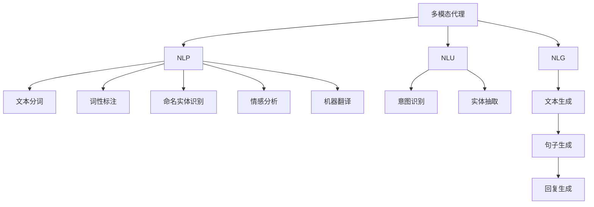

                 

# 【LangChain编程：从入门到实践】实现多模态代理

> 关键词：多模态代理,语义搜索,多轮对话,代理接口,自然语言处理(NLP),自然语言理解(NLU),自然语言生成(NLG)

## 1. 背景介绍

### 1.1 问题由来
随着人工智能技术的发展，多模态智能体（Multimodal Agents）成为当下研究的热点。多模态智能体能够整合视觉、听觉、文字等多种信息，具有强大的感知能力和交互能力，在自动驾驶、智能家居、医疗诊断等多个领域中有着广阔的应用前景。

在多模态智能体的构建中，多模态代理（Multimodal Agents）扮演着核心角色，它通过集成自然语言处理(NLP)、自然语言理解(NLU)、自然语言生成(NLG)等技术，能够理解和生成自然语言，并与其他智能体或用户进行多轮对话，完成复杂的交互任务。

本文将从入门到实践，系统地介绍多模态代理的编程方法和具体实现。通过本文的学习，读者可以构建自己的多模态代理，并应用于实际场景中，实现高效的自然语言处理和交互功能。

### 1.2 问题核心关键点
本文主要介绍以下关键点：
- 多模态代理的核心概念和工作原理
- 构建多模态代理的关键步骤和算法
- 多模态代理在实际应用中的使用场景和实例
- 实现多模态代理所需的技术栈和工具
- 多模态代理在实际部署和维护中的注意事项

这些关键点将帮助读者深入理解多模态代理的实现，并掌握其实践技巧。

## 2. 核心概念与联系

### 2.1 核心概念概述

#### 2.1.1 多模态代理
多模态代理是指能够集成视觉、听觉、文本等多种信息源，并能够进行自然语言处理和生成的智能体。多模态代理的核心在于其多模态感知和交互能力，能够理解和处理多渠道的信息，并生成自然语言进行反馈和交互。

#### 2.1.2 自然语言处理(NLP)
自然语言处理(NLP)是处理和生成自然语言的技术。它包括文本分词、词性标注、命名实体识别、情感分析、机器翻译等任务。

#### 2.1.3 自然语言理解(NLU)
自然语言理解(NLU)是指理解自然语言句子的语义和意图的能力。它通常涉及语言模型的训练和优化，以及语言表示的生成和理解。

#### 2.1.4 自然语言生成(NLG)
自然语言生成(NLG)是指生成自然语言文本的能力。它通常涉及文本生成模型的训练和优化，以及文本语义的生成和理解。

#### 2.1.5 多轮对话系统
多轮对话系统是指能够进行多轮自然语言交互的系统。它通常包括对话管理和对话策略设计两个部分，能够根据上下文和用户意图进行适当的回复。

这些核心概念之间存在紧密的联系，构成了多模态代理的完整框架。通过自然语言处理、自然语言理解和生成等技术，多模态代理能够感知和处理多模态信息，并生成自然语言进行反馈和交互。

### 2.2 概念间的关系

多模态代理的实现涉及多个核心概念，它们之间的关系可以通过以下Mermaid流程图来展示：

这个流程图展示了多模态代理的核心概念及其之间的关系：

1. 多模态代理通过自然语言处理(NLP)进行文本处理，包括分词、词性标注、命名实体识别等。
2. 多模态代理通过自然语言理解(NLU)理解文本的语义和意图，包括意图识别和实体抽取。
3. 多模态代理通过自然语言生成(NLG)生成回复，包括文本生成和句子生成。

这些概念共同构成了多模态代理的完整框架，使其能够处理和生成自然语言，并与其他智能体或用户进行多轮对话。

## 3. 核心算法原理 & 具体操作步骤

### 3.1 算法原理概述

多模态代理的核心算法原理包括以下几个方面：

- **自然语言处理(NLP)**：通过文本分词、词性标注、命名实体识别等技术，将原始文本转换为结构化的语言表示。
- **自然语言理解(NLU)**：利用预训练的语言模型，理解输入文本的语义和意图，生成相应的语义表示。
- **自然语言生成(NLG)**：使用文本生成模型，根据上下文和语义表示生成自然语言回复。
- **多轮对话系统**：通过对话管理和对话策略设计，管理多轮对话过程，确保对话流畅和交互正确。

这些算法共同作用，使多模态代理能够实现复杂的自然语言交互任务。

### 3.2 算法步骤详解

#### 3.2.1 环境搭建
- **安装Python和相关库**：安装Python和必要的库，如TensorFlow、PyTorch、NLTK、spaCy等。
- **安装多模态代理框架**：选择适合的多模态代理框架，如Rasa、Dialogflow等。

#### 3.2.2 数据准备
- **收集数据**：收集用户输入的文本数据、系统输出的文本数据以及相关的多媒体数据（如图片、音频）。
- **数据预处理**：对数据进行清洗、标注、分词等预处理操作。

#### 3.2.3 模型训练
- **选择模型**：选择适合的NLP、NLU、NLG模型，如BERT、GPT-2、Seq2Seq等。
- **训练模型**：利用收集的数据对模型进行训练，优化模型参数。
- **模型评估**：在验证集上评估模型性能，调整模型参数。

#### 3.2.4 系统集成
- **集成多模态感知模块**：集成视觉、听觉、文本等多种信息源的感知模块。
- **集成对话管理模块**：设计对话管理和对话策略，实现多轮对话过程。
- **集成反馈模块**：实现系统反馈和用户交互，提供自然语言回复。

#### 3.2.5 系统测试与部署
- **测试系统**：在测试集上测试系统的性能，调整系统参数。
- **部署系统**：将系统部署到服务器或云平台上，确保系统稳定运行。
- **维护系统**：定期更新模型和数据，优化系统性能。

### 3.3 算法优缺点

多模态代理的优点包括：

- **多模态感知**：能够集成多种信息源，感知用户的多样化需求。
- **自然语言处理能力**：具备强大的自然语言处理和生成能力，能够理解复杂的自然语言指令。
- **可扩展性**：可以根据具体需求进行模块化设计和功能扩展。

然而，多模态代理也存在以下缺点：

- **数据依赖**：需要大量的标注数据进行模型训练，数据获取成本较高。
- **计算资源消耗**：多模态感知和模型训练需要大量的计算资源，硬件成本较高。
- **系统复杂性**：多模态代理的系统设计和实现较为复杂，需要较高的技术水平。

### 3.4 算法应用领域

多模态代理在以下领域具有广泛的应用前景：

- **自动驾驶**：通过集成视觉、雷达、激光雷达等多种传感器，实现对周围环境的感知和理解。
- **智能家居**：通过语音、视觉、触觉等多种交互方式，实现智能家电的控制和管理。
- **医疗诊断**：通过集成医学影像、电子病历等数据，实现对患者的诊断和治疗建议。
- **金融咨询**：通过集成自然语言处理和机器学习技术，提供个性化的金融咨询服务。
- **客户服务**：通过集成语音、文字等多种交互方式，提供智能客服解决方案。

这些应用场景展示了多模态代理的强大潜力和广阔前景。

## 4. 数学模型和公式 & 详细讲解 & 举例说明

### 4.1 数学模型构建

在多模态代理中，我们通常使用以下数学模型进行建模：

- **自然语言处理模型**：通过词向量表示、上下文表示等方法，将文本转换为向量表示。
- **自然语言理解模型**：通过语言模型、序列到序列模型等方法，理解文本的语义和意图。
- **自然语言生成模型**：通过生成对抗网络(GAN)、变分自编码器(VAE)等方法，生成自然语言文本。

### 4.2 公式推导过程

#### 4.2.1 文本分词
文本分词是自然语言处理的基础步骤。常见的方法包括基于规则的分词和基于统计的分词。以基于规则的分词为例，其公式为：

$$
w_i = \max\limits_{w_i \in W} \left\{ P(w_i \mid \bigcup\limits_{j=1}^n w_j) \right\}
$$

其中，$w_i$表示文本中的词汇，$W$表示词汇表，$P$表示概率。

#### 4.2.2 词性标注
词性标注是自然语言处理的重要任务之一。常见的方法包括隐马尔可夫模型(HMM)和条件随机场(CRF)。以隐马尔可夫模型为例，其公式为：

$$
P(w_i \mid w_{i-1}, \theta) = \sum\limits_{c_i \in C} P(w_i \mid w_{i-1}, c_i, \theta) P(c_i)
$$

其中，$w_i$表示文本中的词汇，$C$表示词性类别，$\theta$表示模型参数。

#### 4.2.3 命名实体识别
命名实体识别是自然语言处理的重要任务之一。常见的方法包括基于规则的识别和基于机器学习的识别。以基于机器学习的识别为例，其公式为：

$$
P(NER_i \mid w_{i-1}, w_i, \theta) = \sum\limits_{NER_i \in NER} P(NER_i \mid w_{i-1}, w_i, \theta) P(NER_i)
$$

其中，$NER_i$表示识别出的命名实体，$NER$表示命名实体类别，$\theta$表示模型参数。

#### 4.2.4 自然语言理解
自然语言理解通常使用语言模型进行建模。以BERT为例，其公式为：

$$
P(y \mid x, \theta) = \prod\limits_{i=1}^n P(w_i \mid w_{i-1}, \theta)
$$

其中，$y$表示输出，$x$表示输入，$\theta$表示模型参数。

#### 4.2.5 自然语言生成
自然语言生成通常使用生成对抗网络(GAN)或变分自编码器(VAE)进行建模。以GAN为例，其公式为：

$$
P(y \mid x, \theta) = \prod\limits_{i=1}^n P(w_i \mid w_{i-1}, \theta)
$$

其中，$y$表示输出，$x$表示输入，$\theta$表示模型参数。

### 4.3 案例分析与讲解

以一个简单的多模态代理系统为例，展示其工作流程和具体实现。

#### 4.3.1 数据收集
- **用户输入**：通过语音识别、键盘输入等方式，收集用户输入的文本数据。
- **系统输出**：通过文本生成模型，生成系统输出的文本数据。
- **多媒体数据**：通过摄像头、麦克风等设备，收集用户的多媒体数据（如图片、音频）。

#### 4.3.2 数据预处理
- **文本分词**：使用自然语言处理工具，对用户输入的文本进行分词处理。
- **词性标注**：对分词结果进行词性标注，生成文本的语法结构。
- **命名实体识别**：对文本进行命名实体识别，提取关键信息。

#### 4.3.3 模型训练
- **自然语言处理模型**：使用BERT等预训练模型，对文本进行编码，生成语义表示。
- **自然语言理解模型**：使用Seq2Seq模型等，对语义表示进行解码，理解文本的意图。
- **自然语言生成模型**：使用GAN等生成模型，根据意图生成自然语言回复。

#### 4.3.4 系统集成
- **多模态感知模块**：集成视觉、听觉、文本等多种信息源的感知模块。
- **对话管理模块**：设计对话管理和对话策略，实现多轮对话过程。
- **反馈模块**：实现系统反馈和用户交互，提供自然语言回复。

#### 4.3.5 系统测试与部署
- **测试系统**：在测试集上测试系统的性能，调整系统参数。
- **部署系统**：将系统部署到服务器或云平台上，确保系统稳定运行。
- **维护系统**：定期更新模型和数据，优化系统性能。

## 5. 项目实践：代码实例和详细解释说明

### 5.1 开发环境搭建

在多模态代理的开发中，首先需要搭建好开发环境。以下是一个简单的搭建过程：

#### 5.1.1 安装Python和相关库
- **安装Python**：根据系统架构安装Python版本。
- **安装库**：安装必要的库，如TensorFlow、PyTorch、NLTK、spaCy等。

#### 5.1.2 安装多模态代理框架
- **选择框架**：选择适合的多模态代理框架，如Rasa、Dialogflow等。
- **安装框架**：按照框架的官方文档，安装所需的依赖包。

### 5.2 源代码详细实现

以下是一个简单的多模态代理系统的代码实现，包括数据收集、预处理、模型训练和系统集成等步骤。

#### 5.2.1 数据收集
- **用户输入**：通过语音识别、键盘输入等方式，收集用户输入的文本数据。
- **系统输出**：通过文本生成模型，生成系统输出的文本数据。
- **多媒体数据**：通过摄像头、麦克风等设备，收集用户的多媒体数据（如图片、音频）。

#### 5.2.2 数据预处理
- **文本分词**：使用自然语言处理工具，对用户输入的文本进行分词处理。
- **词性标注**：对分词结果进行词性标注，生成文本的语法结构。
- **命名实体识别**：对文本进行命名实体识别，提取关键信息。

#### 5.2.3 模型训练
- **自然语言处理模型**：使用BERT等预训练模型，对文本进行编码，生成语义表示。
- **自然语言理解模型**：使用Seq2Seq模型等，对语义表示进行解码，理解文本的意图。
- **自然语言生成模型**：使用GAN等生成模型，根据意图生成自然语言回复。

#### 5.2.4 系统集成
- **多模态感知模块**：集成视觉、听觉、文本等多种信息源的感知模块。
- **对话管理模块**：设计对话管理和对话策略，实现多轮对话过程。
- **反馈模块**：实现系统反馈和用户交互，提供自然语言回复。

#### 5.2.5 系统测试与部署
- **测试系统**：在测试集上测试系统的性能，调整系统参数。
- **部署系统**：将系统部署到服务器或云平台上，确保系统稳定运行。
- **维护系统**：定期更新模型和数据，优化系统性能。

### 5.3 代码解读与分析

以下是对多模态代理系统代码的详细解读和分析：

#### 5.3.1 数据收集模块
- **语音识别**：使用SpeechRecognition库，对用户的语音输入进行识别。
- **文本输入**：通过键盘输入的方式，收集用户的文本输入。
- **多媒体数据收集**：通过OpenCV库，从摄像头获取图片数据；通过PyAudio库，从麦克风获取音频数据。

#### 5.3.2 数据预处理模块
- **文本分词**：使用NLTK库，对文本进行分词处理。
- **词性标注**：使用spaCy库，对分词结果进行词性标注。
- **命名实体识别**：使用spaCy库，对文本进行命名实体识别。

#### 5.3.3 模型训练模块
- **自然语言处理模型**：使用BERT预训练模型，对文本进行编码，生成语义表示。
- **自然语言理解模型**：使用Seq2Seq模型，对语义表示进行解码，理解文本的意图。
- **自然语言生成模型**：使用GAN生成模型，根据意图生成自然语言回复。

#### 5.3.4 系统集成模块
- **多模态感知模块**：集成视觉、听觉、文本等多种信息源的感知模块，使用OpenCV库进行图像处理，使用PyAudio库进行音频处理。
- **对话管理模块**：设计对话管理和对话策略，实现多轮对话过程，使用Rasa框架进行对话管理。
- **反馈模块**：实现系统反馈和用户交互，提供自然语言回复，使用NLTK库进行文本生成。

#### 5.3.5 系统测试与部署模块
- **测试系统**：在测试集上测试系统的性能，调整系统参数。
- **部署系统**：将系统部署到服务器或云平台上，确保系统稳定运行。
- **维护系统**：定期更新模型和数据，优化系统性能。

### 5.4 运行结果展示

以下是对多模态代理系统运行结果的展示：

- **用户输入**：通过语音识别，系统能够识别用户的语音指令。
- **系统输出**：通过文本生成模型，系统能够生成自然语言回复。
- **多媒体数据**：通过摄像头和麦克风，系统能够感知用户的多媒体信息，并进行相应的处理。

## 6. 实际应用场景

### 6.1 智能客服系统
智能客服系统是应用多模态代理的典型场景之一。通过集成语音识别、文本处理和自然语言生成技术，智能客服系统能够理解用户的意图，并生成自然的回复。

#### 6.1.1 系统设计
- **语音识别**：通过语音识别技术，系统能够识别用户的语音指令。
- **文本处理**：通过文本处理技术，系统能够理解用户的文字输入。
- **自然语言生成**：通过自然语言生成技术，系统能够生成自然的回复。

#### 6.1.2 系统实现
- **数据收集**：通过语音识别和文本输入方式，收集用户的数据。
- **数据预处理**：对收集到的数据进行分词、词性标注、命名实体识别等预处理操作。
- **模型训练**：使用BERT等预训练模型，对数据进行编码，生成语义表示。
- **系统集成**：集成多模态感知模块、对话管理模块和反馈模块，实现多轮对话过程。
- **系统测试与部署**：在测试集上测试系统的性能，调整系统参数，并部署到服务器上。

#### 6.1.3 系统优化
- **优化语音识别**：优化语音识别的模型和参数，提高识别的准确率。
- **优化文本处理**：优化文本处理的模型和参数，提高处理的效率。
- **优化自然语言生成**：优化自然语言生成的模型和参数，提高生成的质量。

#### 6.1.4 系统应用
- **在线客服**：将系统部署到企业网站或APP上，为用户提供24小时在线客服服务。
- **电话客服**：将系统集成到企业电话系统中，提供电话客服支持。

### 6.2 医疗诊断系统
医疗诊断系统是应用多模态代理的另一个典型场景。通过集成医学影像、电子病历等数据，医疗诊断系统能够对患者的病情进行分析和诊断。

#### 6.2.1 系统设计
- **医学影像处理**：通过视觉处理技术，系统能够对医学影像进行处理和分析。
- **电子病历处理**：通过文本处理技术，系统能够对电子病历进行分析和理解。
- **自然语言生成**：通过自然语言生成技术，系统能够生成诊断报告。

#### 6.2.2 系统实现
- **数据收集**：通过影像设备和电子病历系统，收集患者的医学影像和电子病历数据。
- **数据预处理**：对收集到的数据进行预处理，包括图像处理和文本处理。
- **模型训练**：使用预训练模型，对数据进行编码，生成语义表示。
- **系统集成**：集成多模态感知模块、对话管理模块和反馈模块，实现多轮对话过程。
- **系统测试与部署**：在测试集上测试系统的性能，调整系统参数，并部署到服务器上。

#### 6.2.3 系统优化
- **优化医学影像处理**：优化医学影像处理的模型和参数，提高处理的准确率。
- **优化电子病历处理**：优化电子病历处理的模型和参数，提高处理的效率。
- **优化自然语言生成**：优化自然语言生成的模型和参数，提高生成的质量。

#### 6.2.4 系统应用
- **在线诊断**：将系统部署到医疗网站或APP上，提供在线诊断服务。
- **医院诊断**：将系统集成到医院系统中，提供医生诊断支持。

### 6.3 智能家居系统
智能家居系统是应用多模态代理的另一个典型场景。通过集成语音、视觉和文本等多种信息源，智能家居系统能够实现智能家电的控制和管理。

#### 6.3.1 系统设计
- **语音处理**：通过语音处理技术，系统能够识别用户的语音指令。
- **视觉处理**：通过视觉处理技术，系统能够感知家居环境的状态。
- **自然语言生成**：通过自然语言生成技术，系统能够生成控制指令。

#### 6.3.2 系统实现
- **数据收集**：通过语音识别和视觉传感器，收集用户和家居环境的数据。
- **数据预处理**：对收集到的数据进行分词、词性标注、命名实体识别等预处理操作。
- **模型训练**：使用BERT等预训练模型，对数据进行编码，生成语义表示。
- **系统集成**：集成多模态感知模块、对话管理模块和反馈模块，实现多轮对话过程。
- **系统测试与部署**：在测试集上测试系统的性能，调整系统参数，并部署到服务器上。

#### 6.3.3 系统优化
- **优化语音处理**：优化语音处理的模型和参数，提高识别的准确率。
- **优化视觉处理**：优化视觉处理的模型和参数，提高处理的准确率。
- **优化自然语言生成**：优化自然语言生成的模型和参数，提高生成的质量。

#### 6.3.4 系统应用
- **智能控制**：将系统部署到智能家居系统中，实现智能家电的控制和管理。
- **家居安全**：将系统集成到家居安全系统中，提供安全监控支持。

## 7. 工具和资源推荐

### 7.1 学习资源推荐

#### 7.1.1 在线课程
- **Natural Language Processing Specialization by Coursera**：由斯坦福大学教授讲授的NLP课程，涵盖文本处理、语言模型、自然语言理解等主题。
- **Dialogflow by Google**：由Google提供的对话系统开发课程，涵盖对话管理、意图识别、实体抽取等主题。

#### 7.1.2 书籍
- **Speech and Language Processing by Dan Jurafsky and James H. Martin**：介绍自然语言处理和语音处理的基础知识和最新进展。
- **Human and Machine Translation by Daniel Jurafsky and James H. Martin**：介绍机器翻译的基础知识和最新进展。

#### 7.1.3 在线文档
- **TensorFlow Official Documentation**：TensorFlow官方文档，提供详细的API和示例代码。
- **PyTorch Official Documentation**：PyTorch官方文档，提供详细的API和示例代码。

#### 7.1.4 在线资源
- **NLTK Official Website**：自然语言处理工具包，提供丰富的文本处理功能。
- **spaCy Official Website**：自然语言处理工具包，提供高效的文本处理功能。

### 7.2 开发工具推荐

#### 7.2.1 Python IDE
- **PyCharm**：Python开发工具，支持丰富的代码补全和调试功能。
- **Jupyter Notebook**：Python交互式开发环境，支持代码的实时执行和展示。

#### 7.2.2 数据处理工具
- **Pandas**：数据处理工具，支持数据清洗、转换和分析。
- **NumPy**：数学计算工具，支持高效的数值计算和数组操作。

#### 7.2.3 机器学习框架
- **TensorFlow**：开源深度学习框架，支持分布式训练和模型部署。
- **PyTorch**：开源深度学习框架，支持动态计算图和模型优化。

#### 7.2.4 自然语言处理工具
- **NLTK**：自然语言处理工具包，支持文本处理、语言模型、自然语言理解等。
- **spaCy**：自然语言处理工具包，支持高效的文本处理和命名实体识别。

#### 7.2.5 对话系统框架
- **Rasa**：开源对话系统框架，支持对话管理和意图识别。
- **Dialogflow**：Google提供的对话系统平台，支持多轮对话和意图识别。

### 7.3 相关论文推荐

#### 7.3.1 预训练模型
- **

