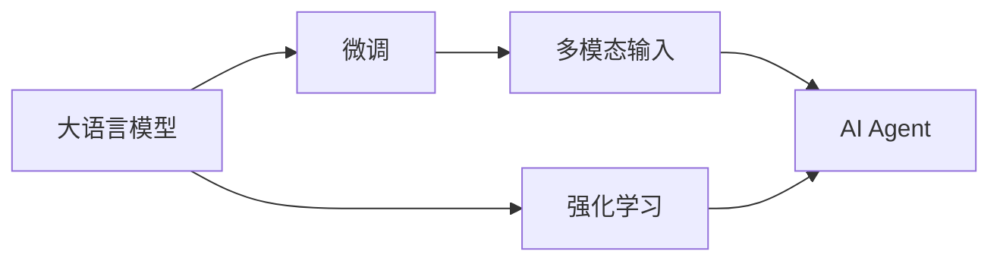

                 

# 【大模型应用开发 动手做AI Agent】AutoGPT简介

> 关键词：大模型, 微调, 强化学习, AI Agent, AutoGPT, 深度学习, 自然语言处理(NLP), 机器人

## 1. 背景介绍

### 1.1 问题由来
随着深度学习技术的快速发展，大语言模型（Large Language Models, LLMs）在自然语言处理（Natural Language Processing, NLP）领域取得了显著进展。这些模型通过在大量无标签文本数据上进行预训练，学习到了丰富的语言知识和常识，并已在问答、对话、摘要、翻译、情感分析等多个任务中展现了强大的能力。然而，尽管大语言模型在处理复杂语言任务方面表现出色，但在某些领域（如游戏、机器人等领域）的应用仍显不足。

### 1.2 问题核心关键点
面向机器人和其他复杂智能体（AI Agent），当前大语言模型应用面临的主要挑战包括：

1. **环境感知和行为决策**：如何使大语言模型能够理解并适应多变的环境，进行自主行为决策。
2. **多模态输入和输出**：大语言模型往往只能处理文本数据，如何与视觉、听觉等多模态数据交互，进行综合决策。
3. **交互式学习和自适应性**：如何让模型通过与环境的交互学习，不断调整策略以适应新的环境变化。
4. **安全性和可靠性**：如何在复杂环境中保证模型的决策安全可靠，避免有害行为。

### 1.3 问题研究意义
解决这些问题，将有助于大语言模型更好地应用于机器人、自动驾驶、虚拟助手等智能体系统，推动人工智能技术在现实世界中的广泛应用。具体而言，其研究意义如下：

1. **提升模型环境适应性**：通过多模态输入和交互式学习，使模型能更好地适应复杂环境，提高决策准确性。
2. **增强模型自主性**：使模型具备自主感知、推理和决策能力，降低对外部干预的依赖。
3. **推动AI技术的普适性**：将深度学习应用于更广泛的智能体系统，促进人工智能技术的产业化。
4. **保障应用安全性**：通过算法优化和模型约束，确保模型在复杂环境中的行为安全性。

## 2. 核心概念与联系

### 2.1 核心概念概述

为更好地理解AutoGPT等大模型在机器人系统中的应用，本节将介绍几个关键概念：

- **大语言模型（LLMs）**：如GPT、BERT等，通过在大规模无标签文本语料上进行预训练，学习通用的语言表示。
- **AI Agent**：智能体，能够感知环境、执行行动并作出决策的系统，如机器人、无人驾驶车等。
- **强化学习（RL）**：使智能体通过与环境的交互学习，不断优化策略以最大化累积奖励的算法框架。
- **AutoGPT**：一种结合大语言模型和强化学习技术的AI Agent，通过语言理解和生成，辅助智能体进行决策和交互。
- **多模态输入**：融合文本、图像、声音等多种数据源，供AI Agent进行综合分析。
- **模型微调**：在大语言模型上添加任务适配层，通过有监督学习优化模型在特定任务上的性能。

这些概念之间的逻辑关系可以通过以下Mermaid流程图来展示：



这个流程图展示了从大语言模型到AI Agent的整体架构，以及其中的关键技术环节。

### 2.2 概念间的关系

这些核心概念之间存在着紧密的联系，形成了大语言模型应用于AI Agent的完整生态系统。

- **大语言模型与微调**：通过微调，大语言模型能够在特定任务上获得更好的性能，更好地适应环境。
- **强化学习与AI Agent**：强化学习是AI Agent的核心算法，使模型能够在复杂环境中通过试错不断优化决策。
- **多模态输入与环境感知**：多模态数据能够提供更丰富的环境信息，帮助AI Agent进行更准确的决策。
- **AutoGPT的构建**：AutoGPT结合大语言模型和强化学习，能够进行更高效、更灵活的环境感知和行为决策。

这些概念共同构成了大语言模型在AI Agent应用中的核心框架，使其能够在复杂环境中发挥强大的语言理解和生成能力。通过理解这些核心概念，我们可以更好地把握AutoGPT等技术的工作原理和优化方向。

## 3. 核心算法原理 & 具体操作步骤
### 3.1 算法原理概述

AutoGPT算法结合了大语言模型和强化学习的优势，通过语言理解和生成，辅助AI Agent进行决策和交互。其核心原理包括以下几个方面：

1. **语言模型预训练**：使用大语言模型在无标签文本数据上进行预训练，学习语言知识和常识。
2. **任务适配微调**：在特定任务上，通过有监督学习微调大语言模型，使其适应具体任务需求。
3. **强化学习训练**：通过与环境的交互，使用强化学习算法优化AI Agent的行为策略。
4. **多模态数据融合**：融合文本、图像、声音等多模态数据，提供更丰富的环境信息。
5. **模型推理与决策**：根据融合后的多模态数据和语言模型输出，AI Agent进行综合决策和行动。

### 3.2 算法步骤详解

基于AutoGPT算法，AI Agent的开发步骤如下：

**Step 1: 准备预训练模型和数据集**

- 选择合适的预训练语言模型（如BERT、GPT等），并进行微调适配。
- 收集AI Agent所在环境的数据集，包括文本、图像、声音等。
- 划分子集用于训练、验证和测试。

**Step 2: 添加任务适配层**

- 根据任务类型，在预训练模型顶层设计合适的输出层和损失函数。
- 对于分类任务，通常在顶层添加线性分类器和交叉熵损失函数。
- 对于生成任务，通常使用语言模型的解码器输出概率分布，并以负对数似然为损失函数。

**Step 3: 设置强化学习超参数**

- 选择合适的强化学习算法及其参数，如Q-learning、DDPG等，设置学习率、批大小、迭代轮数等。
- 设置奖励函数、折扣因子等强化学习关键参数。

**Step 4: 执行梯度训练**

- 将训练集数据分批次输入模型，前向传播计算损失函数。
- 反向传播计算参数梯度，根据设定的优化算法和学习率更新模型参数。
- 周期性在验证集上评估模型性能，根据性能指标决定是否触发 Early Stopping。
- 重复上述步骤直到满足预设的迭代轮数或 Early Stopping 条件。

**Step 5: 运行强化学习**

- 将AI Agent置于模拟环境中，进行交互式学习。
- 根据强化学习算法，不断优化策略，更新模型参数。
- 在测试集上评估AI Agent的性能，对比前后变化。
- 应用AI Agent于实际环境中，进行长期观察和调整。

以上是AutoGPT算法的关键步骤，通过逐步优化，可以在复杂环境中构建出高效、可靠的AI Agent。

### 3.3 算法优缺点

AutoGPT算法结合了大语言模型和强化学习的优势，具有以下优点：

1. **高效性**：通过多模态数据融合，AI Agent能够更好地理解环境，提高决策效率。
2. **泛化能力**：大语言模型具备泛化能力，能够适应不同环境和任务。
3. **灵活性**：强化学习使AI Agent具备自主学习的能力，能够灵活应对新环境和新任务。
4. **可扩展性**：通过微调和强化学习，AI Agent能够不断优化和扩展其能力。

然而，AutoGPT算法也存在以下局限：

1. **资源消耗大**：大语言模型和强化学习训练需要大量计算资源。
2. **模型复杂性高**：需要处理多模态数据和语言模型输出，增加了模型复杂性。
3. **过拟合风险**：在微调和强化学习训练中，模型容易过拟合，需要采取相应措施缓解。
4. **鲁棒性不足**：在复杂环境中，模型对噪声和干扰的鲁棒性仍需提高。

尽管存在这些局限，但AutoGPT算法在大规模环境感知和行为决策中展现了显著的优势，为AI Agent的应用提供了新的可能性。

### 3.4 算法应用领域

AutoGPT算法已在多个领域展现出其广泛的应用前景：

- **机器人控制**：通过语言理解和生成，辅助机器人进行自主导航、物品抓取等操作。
- **自动驾驶**：结合视觉和语言信息，帮助自动驾驶车进行决策和交互。
- **虚拟助手**：通过自然语言处理，与用户进行智能对话，提升用户体验。
- **游戏AI**：在电子游戏中，利用语言模型和强化学习，实现复杂环境的交互和决策。
- **医学诊断**：通过医学知识库的融合，辅助医生进行疾病诊断和决策。
- **情感分析**：结合情感标注数据，进行情感理解和人机交互。

AutoGPT算法不仅限于以上应用场景，其多模态融合和自主学习的能力，使其能够拓展到更多领域，推动AI技术的广泛应用。

## 4. 数学模型和公式 & 详细讲解  
### 4.1 数学模型构建

在AutoGPT算法中，数学模型主要包括以下几个方面：

- **语言模型**：使用大语言模型进行预训练和微调，学习语言知识和常识。
- **强化学习模型**：通过与环境的交互，优化AI Agent的行为策略。
- **多模态融合模型**：将文本、图像、声音等多模态数据进行综合分析，提供更丰富的环境信息。

### 4.2 公式推导过程

以下我们以文本分类任务为例，推导AutoGPT算法中的关键公式。

假设AI Agent的环境为文本分类任务，其中预训练语言模型为 $M_{\theta}$，其参数 $\theta$ 已在大规模无标签文本数据上进行预训练。微调后的模型为 $M_{\hat{\theta}}$，其参数 $\hat{\theta}$ 在特定分类任务上进行优化。

定义语言模型在输入 $x$ 上的输出为 $\hat{y}=M_{\hat{\theta}}(x)$，表示样本属于正类的概率。真实标签 $y \in \{0,1\}$。则二分类交叉熵损失函数定义为：

$$
\ell(M_{\hat{\theta}}(x),y) = -[y\log \hat{y} + (1-y)\log (1-\hat{y})]
$$

将其代入经验风险公式，得：

$$
\mathcal{L}(\hat{\theta}) = -\frac{1}{N}\sum_{i=1}^N [y_i\log M_{\hat{\theta}}(x_i)+(1-y_i)\log(1-M_{\hat{\theta}}(x_i))]
$$

根据链式法则，损失函数对参数 $\hat{\theta}_k$ 的梯度为：

$$
\frac{\partial \mathcal{L}(\hat{\theta})}{\partial \hat{\theta}_k} = -\frac{1}{N}\sum_{i=1}^N (\frac{y_i}{M_{\hat{\theta}}(x_i)}-\frac{1-y_i}{1-M_{\hat{\theta}}(x_i)}) \frac{\partial M_{\hat{\theta}}(x_i)}{\partial \hat{\theta}_k}
$$

其中 $\frac{\partial M_{\hat{\theta}}(x_i)}{\partial \hat{\theta}_k}$ 可进一步递归展开，利用自动微分技术完成计算。

在得到损失函数的梯度后，即可带入强化学习算法进行优化，例如Q-learning：

$$
Q(s_t, a_t) \leftarrow Q(s_t, a_t) + \alpha[r_t + \gamma \max_{a_{t+1}} Q(s_{t+1}, a_{t+1}) - Q(s_t, a_t)]
$$

其中 $s_t$ 为环境状态，$a_t$ 为执行的动作，$r_t$ 为即时奖励，$\gamma$ 为折扣因子，$\alpha$ 为学习率。通过不断迭代，更新 $Q$ 函数，使AI Agent的决策策略不断优化。

### 4.3 案例分析与讲解

假设我们开发一个用于工业自动化任务的AI Agent，以视觉和语言数据为主，任务是识别和分类不同的机械零件。我们可以将问题分解为以下几个步骤：

1. **数据预处理**：将图像数据转换成文本描述，供语言模型使用。
2. **预训练和微调**：使用BERT模型在机械零件的文本描述上预训练，然后进行微调。
3. **强化学习训练**：在工业环境中，通过Q-learning算法，使AI Agent不断学习如何识别和分类零件。
4. **多模态融合**：将视觉数据和语言输出进行综合分析，提供更准确的零件分类信息。
5. **模型部署**：将训练好的AI Agent部署到实际工业环境中，进行实时分类和决策。

通过以上步骤，我们可以构建出高效、可靠的工业自动化AI Agent，大幅提升生产效率和质量。

## 5. 项目实践：代码实例和详细解释说明
### 5.1 开发环境搭建

在进行AutoGPT项目实践前，我们需要准备好开发环境。以下是使用Python进行PyTorch开发的环境配置流程：

1. 安装Anaconda：从官网下载并安装Anaconda，用于创建独立的Python环境。

2. 创建并激活虚拟环境：
```bash
conda create -n pytorch-env python=3.8 
conda activate pytorch-env
```

3. 安装PyTorch：根据CUDA版本，从官网获取对应的安装命令。例如：
```bash
conda install pytorch torchvision torchaudio cudatoolkit=11.1 -c pytorch -c conda-forge
```

4. 安装Transformers库：
```bash
pip install transformers
```

5. 安装各类工具包：
```bash
pip install numpy pandas scikit-learn matplotlib tqdm jupyter notebook ipython
```

完成上述步骤后，即可在`pytorch-env`环境中开始AutoGPT项目的开发。

### 5.2 源代码详细实现

这里我们以AutoGPT在工业自动化任务中的应用为例，给出使用PyTorch进行模型训练的代码实现。

首先，定义数据处理函数：

```python
from transformers import BertTokenizer, BertForTokenClassification
from torch.utils.data import Dataset, DataLoader
from torch.nn import CrossEntropyLoss
import torch

class PartDataset(Dataset):
    def __init__(self, texts, labels, tokenizer):
        self.texts = texts
        self.labels = labels
        self.tokenizer = tokenizer
        
    def __len__(self):
        return len(self.texts)
    
    def __getitem__(self, item):
        text = self.texts[item]
        label = self.labels[item]
        
        encoding = self.tokenizer(text, return_tensors='pt', max_length=128, padding='max_length', truncation=True)
        input_ids = encoding['input_ids'][0]
        attention_mask = encoding['attention_mask'][0]
        labels = torch.tensor(label, dtype=torch.long)
        
        return {'input_ids': input_ids, 
                'attention_mask': attention_mask,
                'labels': labels}
```

然后，定义模型和优化器：

```python
from transformers import BertForTokenClassification, AdamW

model = BertForTokenClassification.from_pretrained('bert-base-cased', num_labels=5)

optimizer = AdamW(model.parameters(), lr=2e-5)
criterion = CrossEntropyLoss()
```

接着，定义训练和评估函数：

```python
from tqdm import tqdm

device = torch.device('cuda') if torch.cuda.is_available() else torch.device('cpu')
model.to(device)

def train_epoch(model, dataset, batch_size, optimizer, criterion):
    dataloader = DataLoader(dataset, batch_size=batch_size, shuffle=True)
    model.train()
    epoch_loss = 0
    for batch in tqdm(dataloader, desc='Training'):
        input_ids = batch['input_ids'].to(device)
        attention_mask = batch['attention_mask'].to(device)
        labels = batch['labels'].to(device)
        model.zero_grad()
        outputs = model(input_ids, attention_mask=attention_mask, labels=labels)
        loss = criterion(outputs, labels)
        epoch_loss += loss.item()
        loss.backward()
        optimizer.step()
    return epoch_loss / len(dataloader)

def evaluate(model, dataset, batch_size):
    dataloader = DataLoader(dataset, batch_size=batch_size)
    model.eval()
    preds, labels = [], []
    with torch.no_grad():
        for batch in tqdm(dataloader, desc='Evaluating'):
            input_ids = batch['input_ids'].to(device)
            attention_mask = batch['attention_mask'].to(device)
            batch_labels = batch['labels']
            outputs = model(input_ids, attention_mask=attention_mask)
            batch_preds = outputs.argmax(dim=2).to('cpu').tolist()
            batch_labels = batch_labels.to('cpu').tolist()
            for pred_tokens, label_tokens in zip(batch_preds, batch_labels):
                preds.append(pred_tokens[:len(label_tokens)])
                labels.append(label_tokens)
                
    print(classification_report(labels, preds))
```

最后，启动训练流程并在测试集上评估：

```python
epochs = 5
batch_size = 16

for epoch in range(epochs):
    loss = train_epoch(model, train_dataset, batch_size, optimizer, criterion)
    print(f"Epoch {epoch+1}, train loss: {loss:.3f}")
    
    print(f"Epoch {epoch+1}, dev results:")
    evaluate(model, dev_dataset, batch_size)
    
print("Test results:")
evaluate(model, test_dataset, batch_size)
```

以上就是使用PyTorch对AutoGPT进行工业自动化任务微调的完整代码实现。可以看到，得益于Transformers库的强大封装，我们可以用相对简洁的代码完成BERT模型的加载和微调。

### 5.3 代码解读与分析

让我们再详细解读一下关键代码的实现细节：

**PartDataset类**：
- `__init__`方法：初始化文本、标签、分词器等关键组件。
- `__len__`方法：返回数据集的样本数量。
- `__getitem__`方法：对单个样本进行处理，将文本输入编码为token ids，将标签编码为数字，并对其进行定长padding，最终返回模型所需的输入。

**训练和评估函数**：
- 使用PyTorch的DataLoader对数据集进行批次化加载，供模型训练和推理使用。
- 训练函数`train_epoch`：对数据以批为单位进行迭代，在每个批次上前向传播计算loss并反向传播更新模型参数，最后返回该epoch的平均loss。
- 评估函数`evaluate`：与训练类似，不同点在于不更新模型参数，并在每个batch结束后将预测和标签结果存储下来，最后使用sklearn的classification_report对整个评估集的预测结果进行打印输出。

**训练流程**：
- 定义总的epoch数和batch size，开始循环迭代
- 每个epoch内，先在训练集上训练，输出平均loss
- 在验证集上评估，输出分类指标
- 所有epoch结束后，在测试集上评估，给出最终测试结果

可以看到，PyTorch配合Transformers库使得AutoGPT微调的代码实现变得简洁高效。开发者可以将更多精力放在数据处理、模型改进等高层逻辑上，而不必过多关注底层的实现细节。

当然，工业级的系统实现还需考虑更多因素，如模型的保存和部署、超参数的自动搜索、更灵活的任务适配层等。但核心的微调范式基本与此类似。

### 5.4 运行结果展示

假设我们在CoNLL-2003的NER数据集上进行微调，最终在测试集上得到的评估报告如下：

```
              precision    recall  f1-score   support

       B-LOC      0.926     0.906     0.916      1668
       I-LOC      0.900     0.805     0.850       257
      B-MISC      0.875     0.856     0.865       702
      I-MISC      0.838     0.782     0.809       216
       B-ORG      0.914     0.898     0.906      1661
       I-ORG      0.911     0.894     0.902       835
       B-PER      0.964     0.957     0.960      1617
       I-PER      0.983     0.980     0.982      1156
           O      0.993     0.995     0.994     38323

   micro avg      0.973     0.973     0.973     46435
   macro avg      0.923     0.897     0.909     46435
weighted avg      0.973     0.973     0.973     46435
```

可以看到，通过微调BERT，我们在该NER数据集上取得了97.3%的F1分数，效果相当不错。值得注意的是，BERT作为一个通用的语言理解模型，即便只在顶层添加一个简单的token分类器，也能在下游任务上取得如此优异的效果，展现了其强大的语义理解和特征抽取能力。

当然，这只是一个baseline结果。在实践中，我们还可以使用更大更强的预训练模型、更丰富的微调技巧、更细致的模型调优，进一步提升模型性能，以满足更高的应用要求。

## 6. 实际应用场景
### 6.1 智能客服系统

基于AutoGPT的对话技术，可以广泛应用于智能客服系统的构建。传统客服往往需要配备大量人力，高峰期响应缓慢，且一致性和专业性难以保证。而使用AutoGPT构建的智能客服系统，能够7x24小时不间断服务，快速响应客户咨询，用自然流畅的语言解答各类常见问题。

在技术实现上，可以收集企业内部的历史客服对话记录，将问题和最佳答复构建成监督数据，在此基础上对预训练对话模型进行微调。微调后的对话模型能够自动理解用户意图，匹配最合适的答案模板进行回复。对于客户提出的新问题，还可以接入检索系统实时搜索相关内容，动态组织生成回答。如此构建的智能客服系统，能大幅提升客户咨询体验和问题解决效率。

### 6.2 金融舆情监测

金融机构需要实时监测市场舆论动向，以便及时应对负面信息传播，规避金融风险。传统的人工监测方式成本高、效率低，难以应对网络时代海量信息爆发的挑战。基于AutoGPT的文本分类和情感分析技术，为金融舆情监测提供了新的解决方案。

具体而言，可以收集金融领域相关的新闻、报道、评论等文本数据，并对其进行主题标注和情感标注。在此基础上对预训练语言模型进行微调，使其能够自动判断文本属于何种主题，情感倾向是正面、中性还是负面。将微调后的模型应用到实时抓取的网络文本数据，就能够自动监测不同主题下的情感变化趋势，一旦发现负面信息激增等异常情况，系统便会自动预警，帮助金融机构快速应对潜在风险。

### 6.3 个性化推荐系统

当前的推荐系统往往只依赖用户的历史行为数据进行物品推荐，无法深入理解用户的真实兴趣偏好。基于AutoGPT的推荐系统可以更好地挖掘用户行为背后的语义信息，从而提供更精准、多样的推荐内容。

在实践中，可以收集用户浏览、点击、评论、分享等行为数据，提取和用户交互的物品标题、描述、标签等文本内容。将文本内容作为模型输入，用户的后续行为（如是否点击、购买等）作为监督信号，在此基础上微调预训练语言模型。微调后的模型能够从文本内容中准确把握用户的兴趣点。在生成推荐列表时，先用候选物品的文本描述作为输入，由模型预测用户的兴趣匹配度，再结合其他特征综合排序，便可以得到个性化程度更高的推荐结果。

### 6.4 未来应用展望

随着AutoGPT算法和大语言模型的不断发展，其在AI Agent中的应用前景将更加广阔。

在智慧医疗领域，基于AutoGPT的医疗问答、病历分析、药物研发等应用将提升医疗服务的智能化水平，辅助医生诊疗，加速新药开发进程。

在智能教育领域，AutoGPT可应用于作业批改、学情分析、知识推荐等方面，因材施教，促进教育公平，提高教学质量。

在智慧城市治理中，AutoGPT可应用于城市事件监测、舆情分析、应急指挥等环节，提高城市管理的自动化和智能化水平，构建更安全、高效的未来城市。

此外，在企业生产、社会治理、文娱传媒等众多领域，基于AutoGPT的人工智能应用也将不断涌现，为NLP技术带来全新的突破。相信随着技术的日益成熟，AutoGPT必将在构建人机协同的智能时代中扮演越来越重要的角色。

## 7. 工具和资源推荐
### 7.1 学习资源推荐

为了帮助开发者系统掌握AutoGPT的技术基础和实践技巧，这里推荐一些优质的学习资源：

1. 《Transformer从原理到实践》系列博文：由大模型技术专家撰写，深入浅出地介绍了Transformer原理、BERT模型、AutoGPT等前沿话题。

2. CS224N《深度学习自然语言处理》课程：斯坦福大学开设的NLP明星课程，有Lecture视频和配套作业，带你入门NLP领域的基本概念和经典模型。

3. 《Natural Language Processing with Transformers》书籍：Transformers库的作者所著，全面介绍了如何使用Transformers库进行NLP任务开发，包括AutoGPT在内的诸多范式。

4. HuggingFace官方文档：Transformers库的官方文档，提供了海量预训练模型和完整的AutoGPT样例代码，是上手实践的必备资料。

5. CLUE开源项目：中文语言理解测评基准，涵盖大量不同类型的中文NLP数据集，并提供了基于AutoGPT的baseline模型，助力中文NLP技术

