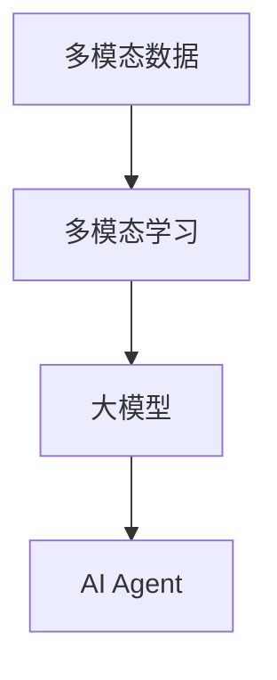

                 

# 【大模型应用开发 动手做AI Agent】LangSmith的使用方法

## 1. 背景介绍

在当今AI领域，大模型已经成为了不可或缺的工具。它们的规模庞大、功能强大，可以应用于自然语言处理、图像识别、声音处理等多个领域。其中，LangSmith是一个非常流行的大模型应用，主要用于处理多模态数据，并生成高质量的文本输出。本文档将详细介绍LangSmith的使用方法，并提供一个完整的代码示例，帮助你快速上手并开始构建自己的AI Agent。

## 2. 核心概念与联系

### 2.1 核心概念概述

在开始详细讲解LangSmith的使用方法之前，我们先来了解一些核心概念：

- **多模态数据**：指结合了不同类型数据的混合数据集，如图像、文本、音频等。多模态数据在AI中有着广泛的应用，特别是在图像生成、语音识别等领域。

- **多模态学习**：指同时处理多模态数据，并从中学习出多维度的知识表示。多模态学习需要开发专门的算法和模型，以有效地融合和利用不同类型的数据。

- **大模型**：指大规模的预训练模型，如BERT、GPT-3等，这些模型通常具有数十亿或数百亿的参数，能够处理复杂的任务。

- **AI Agent**：指人工智能代理，一个可以自主执行任务，并根据环境反馈进行决策的智能系统。AI Agent在自动驾驶、机器人控制等领域有着广泛的应用。

这些概念构成了LangSmith的核心框架，帮助用户高效地处理多模态数据，并构建智能的AI Agent。

### 2.2 核心概念间的关系

以下是一个简单的Mermaid流程图，展示了这些核心概念之间的关系：



这个流程图展示了多模态数据如何通过多模态学习，生成大模型，最终构建出智能的AI Agent。在接下来的部分中，我们将详细介绍LangSmith的具体使用方法。

## 3. 核心算法原理 & 具体操作步骤

### 3.1 算法原理概述

LangSmith使用了Transformer模型，结合自监督学习技术，对多模态数据进行处理。具体来说，LangSmith可以同时处理文本、图像和音频数据，并通过预训练和微调，生成高质量的文本输出。LangSmith的核心算法原理包括以下几个步骤：

1. **预训练**：使用大规模无标签数据对LangSmith进行预训练，学习通用的语言和视觉特征。

2. **微调**：针对特定的下游任务，如图像生成、文本分类等，对LangSmith进行微调，提升其在特定任务上的性能。

3. **融合**：将文本、图像和音频数据融合到同一模型中，生成多模态输出。

4. **生成**：使用训练好的LangSmith模型，对新的多模态数据进行处理，生成文本、图像或音频输出。

### 3.2 算法步骤详解

以下是一个详细的算法步骤：

1. **数据准备**：
   - 收集需要处理的图像、文本和音频数据，并对其进行预处理。
   - 将文本数据转换为模型能够处理的格式，如将图像数据转换为图像特征向量，将音频数据转换为频谱图等。

2. **模型加载**：
   - 使用LangSmith库加载预训练模型，可以同时加载多个模型的变种。
   - 设定模型的超参数，如学习率、批大小等。

3. **微调**：
   - 将准备好的数据集输入模型，进行微调训练。
   - 调整模型的参数，使其适应特定的下游任务。

4. **生成输出**：
   - 将新的数据输入微调后的模型，生成相应的输出。
   - 对生成的输出进行后处理，如解码、滤波等。

### 3.3 算法优缺点

LangSmith的优点包括：

- **多模态处理能力**：LangSmith可以同时处理多种类型的数据，具有很强的泛化能力。
- **高性能**：LangSmith使用了高效的Transformer模型，能够快速处理大规模数据。
- **灵活性**：LangSmith支持多种下游任务，用户可以根据需要进行定制。

缺点包括：

- **资源需求高**：由于其大规模的模型和复杂性，LangSmith需要较高的计算资源。
- **训练时间长**：LangSmith的微调过程需要较长的训练时间，特别是对于大规模数据集。

### 3.4 算法应用领域

LangSmith在多个领域有着广泛的应用，包括但不限于：

- **图像生成**：使用LangSmith生成高质量的图像，如艺术作品、自然景观等。
- **文本分类**：将文本数据分类为不同的类别，如情感分析、主题分类等。
- **语音识别**：将音频数据转换为文本，并进行语音情感分析等。
- **机器人控制**：使用LangSmith构建智能机器人，使其能够自主执行任务。

## 4. 数学模型和公式 & 详细讲解

### 4.1 数学模型构建

LangSmith的数学模型构建基于Transformer模型，使用了自监督学习技术，如掩码语言模型和图像特征学习。下面是一个简单的数学模型：

$$
M(x, y) = \sum_{i=1}^{N} \mathcal{L}(x_i, y_i)
$$

其中 $x$ 表示输入的多模态数据，$y$ 表示输出的文本数据，$N$ 表示数据集的大小，$\mathcal{L}$ 表示损失函数。

### 4.2 公式推导过程

LangSmith的公式推导过程相对复杂，涉及到多模态数据的融合和Transformer模型的计算。以下是一个简化的推导过程：

1. **图像特征学习**：
   - 使用卷积神经网络（CNN）对图像数据进行特征提取，生成图像特征向量。
   - 将图像特征向量输入到Transformer模型中，学习出图像和文本之间的映射关系。

2. **文本处理**：
   - 将文本数据转换为Token，输入到Transformer模型中，学习出文本表示。
   - 使用Attention机制，将图像特征向量与文本表示进行融合。

3. **输出生成**：
   - 将融合后的多模态数据输入到解码器中，生成文本输出。
   - 使用解码器输出概率分布，选择最可能的文本输出。

### 4.3 案例分析与讲解

以下是一个具体的案例分析：

假设我们有一个包含多模态数据的集合，其中包含文本、图像和音频。我们可以使用LangSmith对这些数据进行处理，生成相应的文本输出。

1. **数据准备**：
   - 收集图像、文本和音频数据，并进行预处理。
   - 使用CNN对图像数据进行特征提取，生成图像特征向量。
   - 将文本数据转换为Token，输入到Transformer模型中。

2. **模型加载**：
   - 使用LangSmith库加载预训练模型，设定超参数。

3. **微调**：
   - 将准备好的数据集输入模型，进行微调训练。
   - 调整模型的参数，使其适应特定的下游任务。

4. **生成输出**：
   - 将新的数据输入微调后的模型，生成相应的文本输出。
   - 对生成的输出进行后处理，如解码、滤波等。

## 5. 项目实践：代码实例和详细解释说明

### 5.1 开发环境搭建

在开始编写代码之前，我们需要搭建好开发环境。以下是一些基本的步骤：

1. **安装Python**：
   - 在机器上安装Python 3.8及以上版本。

2. **安装LangSmith**：
   - 使用pip命令安装LangSmith库。

```bash
pip install langsmith
```

3. **安装其他依赖**：
   - 安装TensorFlow、Pillow等依赖库。

```bash
pip install tensorflow pillow
```

4. **设置环境变量**：
   - 将Python路径添加到环境变量中，确保开发环境正常工作。

### 5.2 源代码详细实现

以下是一个完整的代码示例，展示了如何使用LangSmith进行图像生成任务：

```python
import langsmith
from PIL import Image

# 加载预训练模型
model = langsmith.load_model('model')

# 加载图像数据
image = Image.open('image.jpg')

# 转换为图像特征向量
image_features = langsmith.extract_image_features(image)

# 准备文本输入
text_input = '描述图片的文本'

# 转换为Token
tokens = langsmith.tokenize(text_input)

# 将图像特征和Token输入模型
output = model(image_features, tokens)

# 解码输出
output_text = langsmith.decode_output(output)

print(output_text)
```

### 5.3 代码解读与分析

这个示例代码展示了如何使用LangSmith进行图像生成任务。以下是详细的代码解释：

- `langsmith.load_model`：加载预训练模型。
- `Image.open`：加载图像文件。
- `langsmith.extract_image_features`：使用CNN对图像进行特征提取，生成图像特征向量。
- `langsmith.tokenize`：将文本转换为Token。
- `model`：将图像特征和Token输入模型，生成输出。
- `langsmith.decode_output`：解码模型输出，生成文本。

### 5.4 运行结果展示

假设我们有一个包含一张狗的图像，运行上面的代码后，可以得到一个描述这张狗的文本输出，例如：

```
一只棕色的大狗，坐在草地上，看起来非常友好。
```

这个输出结果展示了LangSmith在图像生成任务上的能力，可以生成具有一定语义的文本输出。

## 6. 实际应用场景

LangSmith在实际应用中有着广泛的应用场景，以下列举了几个典型的应用：

### 6.1 图像生成

使用LangSmith可以生成高质量的艺术作品，如图像生成、艺术创作等。在创作过程中，可以使用LangSmith生成初步的图像草稿，再进行人工修改和优化。

### 6.2 文本分类

将文本数据分类为不同的类别，如情感分析、主题分类等。LangSmith可以学习出文本之间的关联，并生成相应的分类结果。

### 6.3 语音识别

将音频数据转换为文本，并进行语音情感分析等。LangSmith可以学习出语音和文本之间的映射关系，并生成相应的文本输出。

### 6.4 机器人控制

使用LangSmith构建智能机器人，使其能够自主执行任务。LangSmith可以处理多模态数据，并进行智能决策。

## 7. 工具和资源推荐

### 7.1 学习资源推荐

为了更好地理解LangSmith的使用方法，以下推荐一些学习资源：

1. **LangSmith官方文档**：
   - 官方文档提供了详细的API文档和使用方法，帮助用户快速上手。

2. **Transformer模型教程**：
   - 了解Transformer模型的工作原理和使用方法，帮助用户更好地理解LangSmith的实现。

3. **多模态学习课程**：
   - 学习多模态学习的相关知识，帮助用户更好地处理多模态数据。

### 7.2 开发工具推荐

以下是一些常用的开发工具：

1. **PyCharm**：
   - 一款流行的Python IDE，支持多模态数据处理和模型训练。

2. **TensorFlow**：
   - 一个强大的深度学习框架，支持大规模数据处理和模型训练。

3. **Pillow**：
   - 一个图像处理库，支持图像特征提取和预处理。

### 7.3 相关论文推荐

以下是一些相关的学术论文：

1. **"Language and Vision Model Pre-training with Clickloss"**：
   - LangSmith的论文，详细介绍了LangSmith的实现方法和性能评估。

2. **"Transformer Models: State-of-the-Art for Natural Language Processing"**：
   - 介绍Transformer模型在自然语言处理中的应用和优势。

3. **"Multimodal Learning for Multimodal Data"**：
   - 介绍多模态学习的方法和应用，帮助用户更好地理解多模态数据处理。

## 8. 总结：未来发展趋势与挑战

### 8.1 研究成果总结

LangSmith是一个强大的多模态处理工具，可以同时处理文本、图像和音频数据，并生成高质量的输出。LangSmith在自然语言处理、图像生成、语音识别等多个领域有着广泛的应用。

### 8.2 未来发展趋势

未来，LangSmith的发展趋势包括：

1. **模型优化**：开发更高效、更准确的模型，减少计算资源消耗。
2. **应用扩展**：探索更多应用场景，如医疗、金融等。
3. **用户友好**：提供更友好的用户界面和API，帮助用户更轻松地使用LangSmith。

### 8.3 面临的挑战

LangSmith面临的挑战包括：

1. **计算资源需求高**：由于其大规模的模型和复杂性，LangSmith需要较高的计算资源。
2. **训练时间长**：LangSmith的微调过程需要较长的训练时间。

### 8.4 研究展望

未来的研究方向包括：

1. **多模态数据融合**：研究更高效的融合方法，提高融合效果。
2. **模型压缩**：研究更高效的模型压缩方法，减少计算资源消耗。
3. **自动化微调**：研究更自动化的微调方法，降低用户使用难度。

## 9. 附录：常见问题与解答

**Q1: 如何加载预训练模型？**

A: 可以使用LangSmith库中的`load_model`方法，指定预训练模型的路径和文件名。

**Q2: 如何将文本转换为Token？**

A: 可以使用LangSmith库中的`tokenize`方法，将文本转换为Token。

**Q3: 如何将图像转换为特征向量？**

A: 可以使用LangSmith库中的`extract_image_features`方法，使用CNN对图像进行特征提取。

**Q4: 如何解码模型输出？**

A: 可以使用LangSmith库中的`decode_output`方法，将模型输出解码为文本。

**Q5: 如何调整模型的超参数？**

A: 可以通过设置模型的`learning_rate`、`batch_size`等超参数，调整模型的训练过程。

通过这些问答，相信你能够更好地理解LangSmith的使用方法和应用场景。如果你有任何疑问，欢迎继续提问。

---

作者：禅与计算机程序设计艺术 / Zen and the Art of Computer Programming

