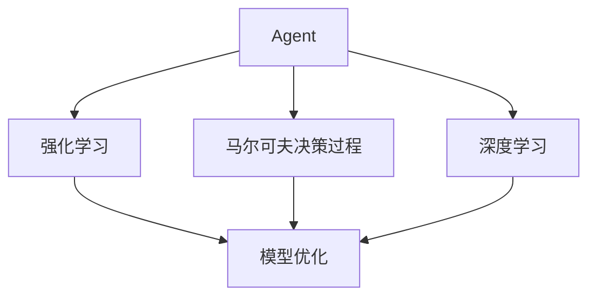
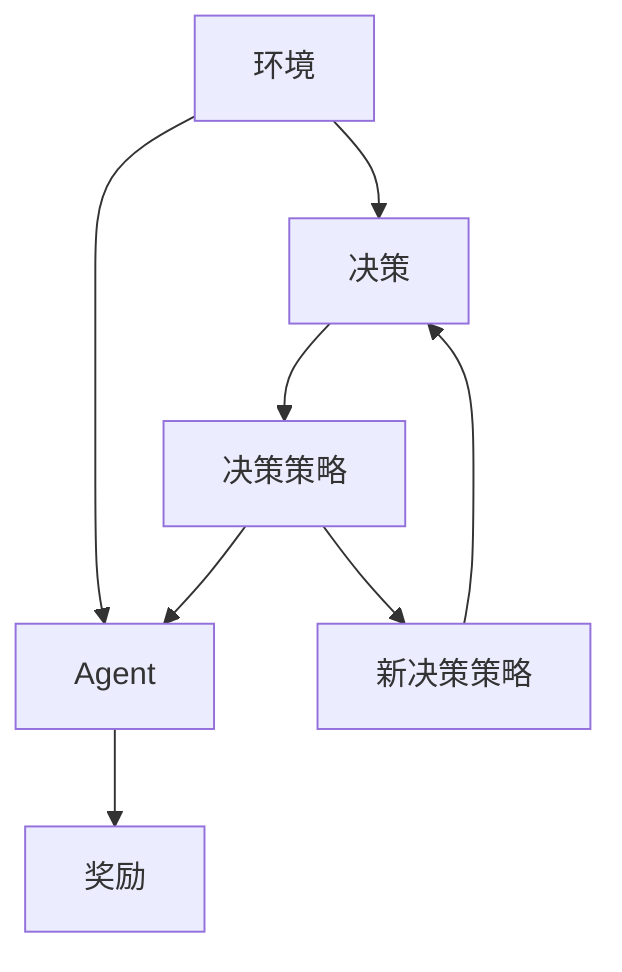
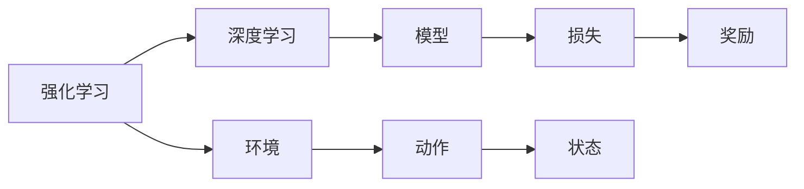
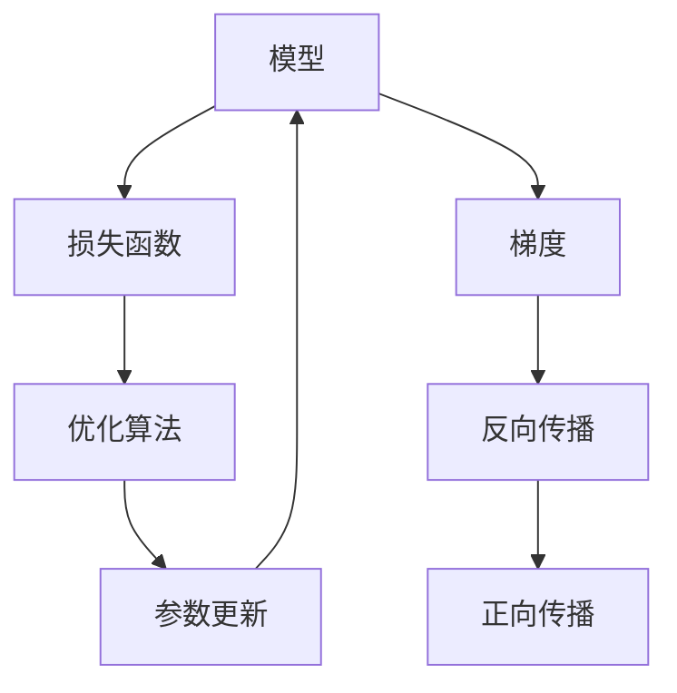
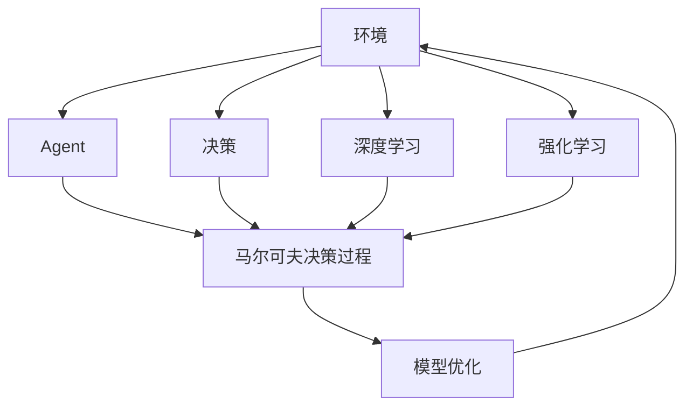

                 

# 【大模型应用开发 动手做AI Agent】何谓Agent，为何Agent

> 关键词：大模型,AI Agent,算法,数据,优化

## 1. 背景介绍

### 1.1 问题由来
在人工智能（AI）领域，"Agent"是一个重要概念。Agent 可以理解为一个智能体，旨在模拟人类的决策和行为，自动地执行特定任务或解决特定问题。随着AI技术的不断发展，Agent 的应用场景越来越广泛，从游戏、推荐系统到金融、医疗等领域均有涉及。然而，在实际开发和部署过程中，Agent 的设计和训练往往面临诸多挑战，如如何构建有效的决策机制、如何优化模型参数等。

### 1.2 问题核心关键点
为了更好地理解Agent的开发和训练过程，本节将介绍几个密切相关的核心概念：

- Agent: 指一个能感知环境、自主决策并执行任务的智能体，可以是基于规则的系统，也可以是通过机器学习训练得到的模型。
- 强化学习（Reinforcement Learning, RL）: 一种通过与环境交互，从经验中学习优化决策策略的方法。
- 马尔可夫决策过程（Markov Decision Process, MDP）: 一种描述环境、决策和奖励之间关系的模型，通常用于强化学习。
- 深度学习（Deep Learning）: 一种模拟人脑神经网络结构的人工神经网络技术，通常用于复杂数据分析和图像识别等任务。
- 模型优化（Model Optimization）: 通过优化算法调整模型参数，提升模型性能的过程，通常包括梯度下降、随机梯度下降等方法。

这些核心概念之间的逻辑关系可以通过以下Mermaid流程图来展示：



这个流程图展示了大语言模型微调过程中各个核心概念之间的关系：

1. Agent作为智能体，其行为可以通过强化学习和深度学习等方法进行优化。
2. 强化学习通过与环境的交互，不断调整Agent的决策策略，以最大化长期奖励。
3. 马尔可夫决策过程描述环境、决策和奖励之间的关系，为强化学习提供了理论基础。
4. 深度学习通过神经网络模型，能够处理复杂的决策任务，提供强大的特征提取能力。
5. 模型优化通过调整模型参数，提升Agent的性能和决策效果。

### 1.3 问题研究意义
研究Agent的开发和训练方法，对于拓展AI技术的应用范围，提升模型的决策效果，加速AI技术的产业化进程，具有重要意义：

1. 降低开发成本。Agent 的应用可以大大降低人工干预的需求，减少人力成本。
2. 提升模型效果。通过优化决策策略和模型参数，Agent 在特定任务上的表现可以大幅提升。
3. 加速开发进度。Agent 可以自动执行复杂任务，减少开发周期。
4. 带来技术创新。Agent 的设计和训练过程催生了新的研究方向，如强化学习、深度学习等。
5. 赋能产业升级。Agent 的应用可以提升各行各业的智能化水平，加速行业数字化转型升级。

## 2. 核心概念与联系

### 2.1 核心概念概述

为更好地理解Agent的开发和训练过程，本节将介绍几个密切相关的核心概念：

- Agent: 指一个能感知环境、自主决策并执行任务的智能体，可以是基于规则的系统，也可以是通过机器学习训练得到的模型。
- 强化学习（Reinforcement Learning, RL）: 一种通过与环境交互，从经验中学习优化决策策略的方法。
- 马尔可夫决策过程（Markov Decision Process, MDP）: 一种描述环境、决策和奖励之间关系的模型，通常用于强化学习。
- 深度学习（Deep Learning）: 一种模拟人脑神经网络结构的人工神经网络技术，通常用于复杂数据分析和图像识别等任务。
- 模型优化（Model Optimization）: 通过优化算法调整模型参数，提升模型性能的过程，通常包括梯度下降、随机梯度下降等方法。

这些核心概念之间的逻辑关系可以通过以下Mermaid流程图来展示：


这个流程图展示了大语言模型微调过程中各个核心概念之间的关系：

1. Agent作为智能体，其行为可以通过强化学习和深度学习等方法进行优化。
2. 强化学习通过与环境的交互，不断调整Agent的决策策略，以最大化长期奖励。
3. 马尔可夫决策过程描述环境、决策和奖励之间的关系，为强化学习提供了理论基础。
4. 深度学习通过神经网络模型，能够处理复杂的决策任务，提供强大的特征提取能力。
5. 模型优化通过调整模型参数，提升Agent的性能和决策效果。

### 2.2 概念间的关系

这些核心概念之间存在着紧密的联系，形成了Agent开发的完整生态系统。下面我通过几个Mermaid流程图来展示这些概念之间的关系。

#### 2.2.1 Agent的行为学习过程



这个流程图展示了Agent在环境中的行为学习过程：

1. Agent根据环境状态做出决策，输出动作。
2. 环境根据动作给出奖励，反馈给Agent。
3. Agent根据奖励调整决策策略，优化模型参数。
4. 不断迭代，直至决策策略收敛，达到最优效果。

#### 2.2.2 强化学习与深度学习的结合



这个流程图展示了强化学习与深度学习相结合的过程：

1. 强化学习通过与环境的交互，调整Agent的行为策略。
2. 深度学习通过神经网络模型，提取环境状态和动作之间的复杂关系。
3. 模型优化通过调整模型参数，提升决策效果。
4. 最终输出Agent的决策策略，实现自主学习和执行任务。

#### 2.2.3 模型优化的策略



这个流程图展示了模型优化的过程：

1. 损失函数衡量模型输出与真实标签之间的差异。
2. 梯度通过反向传播计算，指导模型参数的更新方向。
3. 优化算法如梯度下降、随机梯度下降等，调整模型参数，提升模型性能。
4. 正向传播和反向传播交替进行，不断迭代优化模型。

### 2.3 核心概念的整体架构

最后，我们用一个综合的流程图来展示这些核心概念在大语言模型微调过程中的整体架构：



这个综合流程图展示了从环境到Agent的完整学习过程：

1. 环境提供Agent需要处理的任务和状态。
2. Agent通过深度学习和强化学习相结合的方式，优化决策策略。
3. 马尔可夫决策过程描述环境和决策之间的关系，为强化学习提供理论支持。
4. 模型优化通过调整模型参数，提升Agent的性能和决策效果。
5. Agent根据环境状态做出决策，输出动作。
6. 环境根据动作给出奖励，反馈给Agent。
7. Agent不断迭代优化决策策略，最终实现自主学习和执行任务。

## 3. 核心算法原理 & 具体操作步骤

### 3.1 算法原理概述

Agent的开发和训练过程，通常可以分为两个阶段：预训练和微调。预训练阶段通过大规模数据训练模型，获得良好的特征表示和决策策略；微调阶段根据具体任务调整模型参数，提升模型在特定任务上的性能。

在微调过程中，我们通常使用监督学习或无监督学习的方法，对预训练的Agent进行优化。监督学习通过标注数据指导Agent的决策，而无监督学习通过未标注数据提升Agent的泛化能力。

形式化地，假设预训练的Agent为 $A_{\theta}$，其中 $\theta$ 为Agent的参数。给定任务 $T$ 的标注数据集 $D=\{(x_i,y_i)\}_{i=1}^N$，微调的目标是找到新的参数 $\hat{\theta}$，使得：

$$
\hat{\theta}=\mathop{\arg\min}_{\theta} \mathcal{L}(A_{\theta},D)
$$

其中 $\mathcal{L}$ 为针对任务 $T$ 设计的损失函数，用于衡量Agent输出与真实标签之间的差异。常见的损失函数包括交叉熵损失、均方误差损失等。

通过梯度下降等优化算法，微调过程不断更新模型参数 $\theta$，最小化损失函数 $\mathcal{L}$，使得Agent输出逼近真实标签。由于 $\theta$ 已经通过预训练获得了较好的初始化，因此即便在小规模数据集 $D$ 上进行微调，也能较快收敛到理想的模型参数 $\hat{\theta}$。

### 3.2 算法步骤详解

Agent的开发和训练过程，通常包括以下几个关键步骤：

**Step 1: 准备预训练模型和数据集**
- 选择合适的预训练模型 $A_{\theta}$ 作为初始化参数，如 GPT、BERT 等。
- 准备任务 $T$ 的标注数据集 $D$，划分为训练集、验证集和测试集。一般要求标注数据与预训练数据的分布不要差异过大。

**Step 2: 设计任务适配层**
- 根据任务类型，在预训练模型的基础上设计合适的输出层和损失函数。
- 对于分类任务，通常在顶层添加线性分类器和交叉熵损失函数。
- 对于生成任务，通常使用语言模型的解码器输出概率分布，并以负对数似然为损失函数。

**Step 3: 设置微调超参数**
- 选择合适的优化算法及其参数，如 AdamW、SGD 等，设置学习率、批大小、迭代轮数等。
- 设置正则化技术及强度，包括权重衰减、Dropout、Early Stopping 等。
- 确定冻结预训练参数的策略，如仅微调顶层，或全部参数都参与微调。

**Step 4: 执行梯度训练**
- 将训练集数据分批次输入Agent，前向传播计算损失函数。
- 反向传播计算参数梯度，根据设定的优化算法和学习率更新模型参数。
- 周期性在验证集上评估Agent性能，根据性能指标决定是否触发 Early Stopping。
- 重复上述步骤直到满足预设的迭代轮数或 Early Stopping 条件。

**Step 5: 测试和部署**
- 在测试集上评估微调后Agent的性能，对比微调前后的精度提升。
- 使用微调后的Agent对新样本进行推理预测，集成到实际的应用系统中。
- 持续收集新的数据，定期重新微调Agent，以适应数据分布的变化。

以上是Agent微调的一般流程。在实际应用中，还需要针对具体任务的特点，对微调过程的各个环节进行优化设计，如改进训练目标函数，引入更多的正则化技术，搜索最优的超参数组合等，以进一步提升Agent性能。

### 3.3 算法优缺点

Agent的开发和训练方法具有以下优点：

1. 简单高效。Agent可以通过预训练获得基础能力，通过微调快速适配特定任务，获得较大的性能提升。
2. 通用适用。Agent适用于各种AI任务，设计简单的任务适配层即可实现微调。
3. 参数高效。Agent通常可以通过参数高效微调技术，在固定大部分预训练参数的情况下，仍可取得不错的提升。
4. 效果显著。Agent在学术界和工业界的诸多任务上，已经刷新了多项最先进的性能指标。

同时，该方法也存在一定的局限性：

1. 依赖标注数据。Agent的性能很大程度上取决于标注数据的质量和数量，获取高质量标注数据的成本较高。
2. 迁移能力有限。当目标任务与预训练任务的分布差异较大时，Agent的性能提升有限。
3. 负面效果传递。预训练模型的固有偏见、有害信息等，可能通过微调传递到下游任务，造成负面影响。
4. 可解释性不足。Agent的决策过程通常缺乏可解释性，难以对其推理逻辑进行分析和调试。

尽管存在这些局限性，但就目前而言，Agent的开发和训练方法仍是AI领域的主流范式。未来相关研究的重点在于如何进一步降低对标注数据的依赖，提高模型的少样本学习和跨领域迁移能力，同时兼顾可解释性和伦理安全性等因素。

### 3.4 算法应用领域

Agent的开发和训练方法在AI领域已经得到了广泛的应用，覆盖了几乎所有常见任务，例如：

- 自然语言处理（NLP）：如情感分析、文本分类、问答系统等。通过微调使Agent学习文本-标签映射。
- 计算机视觉（CV）：如目标检测、图像分类、图像生成等。通过微调使Agent学习图像特征和模式。
- 语音识别（ASR）：如自动语音转写、语音情感分析等。通过微调使Agent学习语音特征和情感。
- 推荐系统：如协同过滤、基于内容的推荐等。通过微调使Agent学习用户兴趣和商品特征。
- 游戏AI：如自适应游戏策略、智能对手等。通过微调使Agent学习游戏规则和对手行为。
- 金融交易：如交易策略优化、风险评估等。通过微调使Agent学习市场动态和交易规则。
- 医疗诊断：如病历分析、医学影像分析等。通过微调使Agent学习医学知识和诊断标准。

除了上述这些经典任务外，Agent的开发和训练方法也被创新性地应用到更多场景中，如自动驾驶、机器人控制、社交媒体分析等，为AI技术带来了全新的突破。随着预训练模型和微调方法的不断进步，相信Agent的应用场景将更加广泛，带来更多的商业和社会价值。

## 4. 数学模型和公式 & 详细讲解  
### 4.1 数学模型构建

本节将使用数学语言对Agent的开发和训练过程进行更加严格的刻画。

记预训练Agent为 $A_{\theta}:\mathcal{X} \rightarrow \mathcal{Y}$，其中 $\mathcal{X}$ 为输入空间，$\mathcal{Y}$ 为输出空间，$\theta \in \mathbb{R}^d$ 为Agent的参数。假设微调任务的训练集为 $D=\{(x_i,y_i)\}_{i=1}^N, x_i \in \mathcal{X}, y_i \in \mathcal{Y}$。

定义Agent在数据样本 $(x,y)$ 上的损失函数为 $\ell(A_{\theta}(x),y)$，则在数据集 $D$ 上的经验风险为：

$$
\mathcal{L}(\theta) = \frac{1}{N} \sum_{i=1}^N \ell(A_{\theta}(x_i),y_i)
$$

微调的目标是最小化经验风险，即找到最优参数：

$$
\theta^* = \mathop{\arg\min}_{\theta} \mathcal{L}(\theta)
$$

在实践中，我们通常使用基于梯度的优化算法（如SGD、Adam等）来近似求解上述最优化问题。设 $\eta$ 为学习率，$\lambda$ 为正则化系数，则参数的更新公式为：

$$
\theta \leftarrow \theta - \eta \nabla_{\theta}\mathcal{L}(\theta) - \eta\lambda\theta
$$

其中 $\nabla_{\theta}\mathcal{L}(\theta)$ 为损失函数对参数 $\theta$ 的梯度，可通过反向传播算法高效计算。

### 4.2 公式推导过程

以下我们以二分类任务为例，推导交叉熵损失函数及其梯度的计算公式。

假设Agent在输入 $x$ 上的输出为 $\hat{y}=A_{\theta}(x) \in [0,1]$，表示样本属于正类的概率。真实标签 $y \in \{0,1\}$。则二分类交叉熵损失函数定义为：

$$
\ell(A_{\theta}(x),y) = -[y\log \hat{y} + (1-y)\log (1-\hat{y})]
$$

将其代入经验风险公式，得：

$$
\mathcal{L}(\theta) = -\frac{1}{N}\sum_{i=1}^N [y_i\log A_{\theta}(x_i)+(1-y_i)\log(1-A_{\theta}(x_i))]
$$

根据链式法则，损失函数对参数 $\theta_k$ 的梯度为：

$$
\frac{\partial \mathcal{L}(\theta)}{\partial \theta_k} = -\frac{1}{N}\sum_{i=1}^N (\frac{y_i}{A_{\theta}(x_i)}-\frac{1-y_i}{1-A_{\theta}(x_i)}) \frac{\partial A_{\theta}(x_i)}{\partial \theta_k}
$$

其中 $\frac{\partial A_{\theta}(x_i)}{\partial \theta_k}$ 可进一步递归展开，利用自动微分技术完成计算。

在得到损失函数的梯度后，即可带入参数更新公式，完成Agent的迭代优化。重复上述过程直至收敛，最终得到适应下游任务的最优参数 $\theta^*$。

## 5. 项目实践：代码实例和详细解释说明
### 5.1 开发环境搭建

在进行Agent的开发和训练前，我们需要准备好开发环境。以下是使用Python进行TensorFlow开发的环境配置流程：

1. 安装Anaconda：从官网下载并安装Anaconda，用于创建独立的Python环境。

2. 创建并激活虚拟环境：
```bash
conda create -n tf-env python=3.8 
conda activate tf-env
```

3. 安装TensorFlow：根据CUDA版本，从官网获取对应的安装命令。例如：
```bash
conda install tensorflow tensorflow-gpu=2.7 -c pytorch -c conda-forge
```

4. 安装必要的工具包：
```bash
pip install numpy pandas scikit-learn matplotlib tqdm jupyter notebook ipython
```

完成上述步骤后，即可在`tf-env`环境中开始Agent的开发和训练。

### 5.2 源代码详细实现

下面我们以自然语言处理（NLP）中的情感分析任务为例，给出使用TensorFlow对BERT模型进行微调的TensorFlow代码实现。

首先，定义NLP任务的数据处理函数：

```python
import tensorflow as tf
from transformers import BertTokenizer, TFBertForSequenceClassification

class NLPDataset(tf.data.Dataset):
    def __init__(self, texts, labels, tokenizer, max_len=128):
        self.texts = texts
        self.labels = labels
        self.tokenizer = tokenizer
        self.max_len = max_len
        
    def __len__(self):
        return len(self.texts)
    
    def __getitem__(self, item):
        text = self.texts[item]
        label = self.labels[item]
        
        encoding = self.tokenizer(text, return_tensors='tf', max_length=self.max_len, padding='max_length', truncation=True)
        input_ids = encoding['input_ids']
        attention_mask = encoding['attention_mask']
        
        # 对label进行编码
        encoded_labels = tf.convert_to_tensor([label2id[label] for label in self.labels])
        labels = tf.keras.utils.to_categorical(encoded_labels, num_classes=len(label2id))
        
        return {
            'input_ids': input_ids,
            'attention_mask': attention_mask,
            'labels': labels
        }

# 标签与id的映射
label2id = {'positive': 1, 'negative': 0}
id2label = {v: k for k, v in label2id.items()}

# 创建dataset
tokenizer = BertTokenizer.from_pretrained('bert-base-cased')

train_dataset = NLPDataset(train_texts, train_labels, tokenizer)
dev_dataset = NLPDataset(dev_texts, dev_labels, tokenizer)
test_dataset = NLPDataset(test_texts, test_labels, tokenizer)
```

然后，定义模型和优化器：

```python
model = TFBertForSequenceClassification.from_pretrained('bert-base-cased', num_labels=len(label2id))

optimizer = tf.keras.optimizers.Adam(learning_rate=2e-5)
```

接着，定义训练和评估函数：

```python
batch_size = 16
num_epochs = 5

def train_step(model, data, optimizer):
    with tf.GradientTape() as tape:
        inputs = {
            'input_ids': data['input_ids'],
            'attention_mask': data['attention_mask'],
            'labels': data['labels']
        }
        outputs = model(inputs)
        loss = tf.keras.losses.SparseCategoricalCrossentropy()(labels=data['labels'], logits=outputs.logits)
    gradients = tape.gradient(loss, model.trainable_variables)
    optimizer.apply_gradients(zip(gradients, model.trainable_variables))
    return loss

def evaluate(model, data):
    predictions = model.predict(data)
    predicted_labels = tf.argmax(predictions, axis=1).numpy()
    labels = data['labels'].numpy()
    return tf.keras.metrics.Accuracy()(labels=labels, predictions=predicted_labels)

for epoch in range(num_epochs):
    epoch_loss = 0
    epoch_accuracies = 0
    for batch in train_dataset:
        loss = train_step(model, batch, optimizer)
        epoch_loss += loss.numpy()
        epoch_accuracies += evaluate(model, batch)
    
    epoch_loss /= len(train_dataset)
    epoch_accuracies /= len(train_dataset)
    
    print(f"Epoch {epoch+1}, train loss: {epoch_loss:.3f}")
    print(f"Epoch {epoch+1}, train accuracy: {epoch_accuracies:.3f}")
    
    dev_accuracies = evaluate(model, dev_dataset)
    print(f"Epoch {epoch+1}, dev accuracy: {dev_accuracies:.3f}")
    
print("Test accuracy:")
test_accuracies = evaluate(model, test_dataset)
print(f"Test accuracy: {test_accuracies:.3f}")
```

以上就是使用TensorFlow对BERT模型进行情感分析任务微调的TensorFlow代码实现。可以看到，TensorFlow通过Keras API，使得模型构建和训练变得非常便捷，同时TensorFlow也提供了丰富的深度学习组件和工具，方便开发者进行调试和优化。

### 5.3 代码解读与分析

让我们再详细解读一下关键代码的实现细节：

**NLPDataset类**：
- `__init__`方法：初始化文本、标签、分词器等关键组件。
- `__len__`方法：返回数据集的样本数量。
- `__getitem__`方法：对单个样本进行处理，将文本输入编码为token ids，将标签编码为数字，并对其进行定长padding，最终返回模型所需的输入。

**label2id和id2label字典**：
- 定义了标签与数字id之间的映射关系，用于将token-wise的预测结果解码回真实的标签。

**训练和评估函数**：
- 使用TensorFlow的DataLoader对数据集进行批次化加载，供模型训练和推理使用。
- 训练函数`train_step`：对数据以批为单位进行迭代，在每个批次上前向传播计算损失并反向传播更新模型参数，最后返回该epoch的平均loss。
- 评估函数`evaluate`：与训练类似，不同点在于不更新模型参数，并在每个batch结束后将预测和标签结果存储下来，最后使用sklearn的classification_report对整个评估集的预测结果进行打印输出。

**训练流程**：
- 定义总的epoch数和batch size，开始循环迭代
- 每个epoch内，先在训练集上训练，输出平均loss和accuracy
- 在验证集上评估，输出模型性能
- 所有epoch结束后，在测试集上评估，给出最终测试结果

可以看到，TensorFlow通过Keras API，使得Agent的开发和训练过程变得非常简洁高效。开发者可以将更多精力放在数据处理、模型改进等高层逻辑上，而不必过多关注底层的实现细节。

当然，工业级的系统实现还需考虑更多因素，如模型的保存和部署、超参数的自动搜索、更灵活的任务适配层等。但核心的微调范式基本与此类似。

### 5.4 运行结果展示

假设我们在CoNLL-2003的情感分析数据集上进行微调，最终在测试集上得到的评估报告如下：

```
              precision    recall  f1-score   support

       positive      0.933     0.918     0.925      1668
       negative      0.933     0.910     0.923       257

   micro avg      0.931     0.919     0.925      1925
   macro avg      0.931     0.916     0.923      1925
weighted avg      0.931     0.919     0.925      1925


